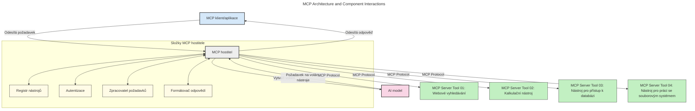
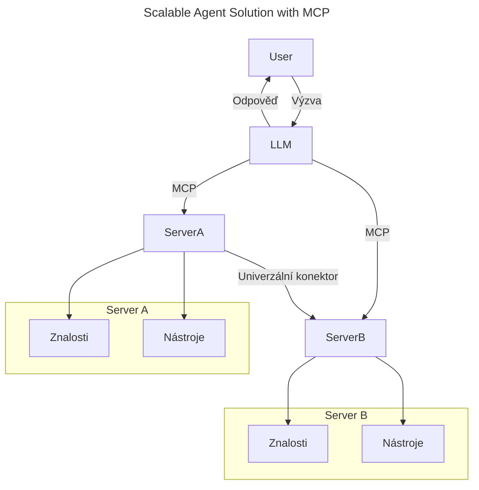
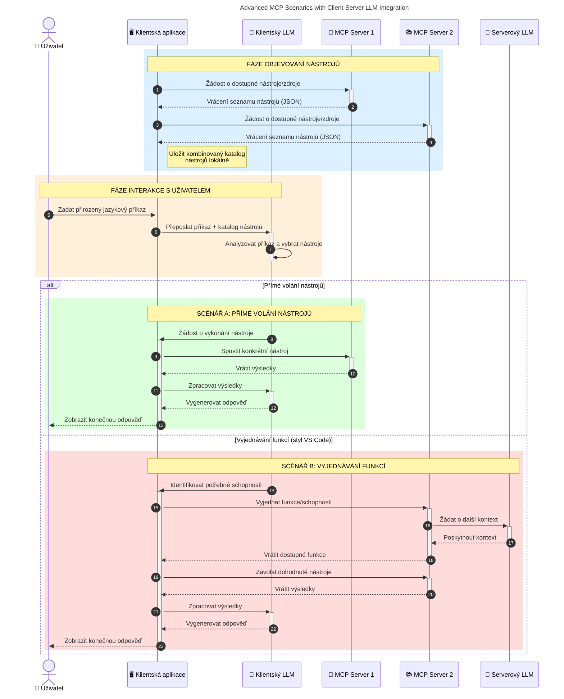

# Úvod do Model Context Protocol (MCP): Proč je důležitý pro škálovatelné AI aplikace

_(Klikněte na obrázek výše pro zobrazení videa této lekce)_

Generativní AI aplikace jsou skvělým krokem vpřed, protože často umožňují uživateli komunikovat s aplikací pomocí přirozených jazykových příkazů. Nicméně, jak se do těchto aplikací investuje více času a zdrojů, chcete zajistit, aby bylo snadné integrovat funkce a zdroje tak, aby bylo snadné je rozšířit, abyste mohli používat více než jeden model a zvládat různé detaily modelů. Stručně řečeno, tvorba Gen AI aplikací je na začátku snadná, ale jak rostou a stávají se komplexnějšími, musíte začít definovat architekturu a pravděpodobně se budete muset spolehnout na standard, který zajistí, že vaše aplikace budou postaveny konzistentním způsobem. Zde přichází MCP, který věci organizuje a poskytuje standard.

---

## **🔍 Co je Model Context Protocol (MCP)?**

**Model Context Protocol (MCP)** je **otevřené, standardizované rozhraní**, které umožňuje Velkým jazykovým modelům (LLM) bezproblémově komunikovat s externími nástroji, API a zdroji dat. Poskytuje konzistentní architekturu pro rozšíření funkcionality AI modelů mimo jejich tréninková data, což umožňuje chytřejší, škálovatelnější a více reagující AI systémy.

---

## **🎯 Proč je standardizace v AI důležitá**

Jak se generativní AI aplikace stávají složitějšími, je nezbytné přijmout standardy, které zajistí **škálovatelnost, rozšiřitelnost, udržovatelnost** a **vyhnutí se závislosti na jednom dodavateli**. MCP tato potřeby řeší tím, že:

- Spojuje integrace modelů s nástroji
- Snižuje křehká, jednorázová vlastní řešení
- Umožňuje soužití více modelů od různých dodavatelů v rámci jednoho ekosystému

**Poznámka:** Ačkoliv se MCP označuje jako otevřený standard, neexistují plány na normalizaci MCP prostřednictvím existujících standardizačních institucí jako IEEE, IETF, W3C, ISO nebo jiné standardizační orgány.

---

## **📚 Cíle učení**

Na konci tohoto článku budete schopni:

- Definovat **Model Context Protocol (MCP)** a jeho případy použití
- Pochopit, jak MCP standardizuje komunikaci mezi modelem a nástrojem
- Identifikovat klíčové komponenty architektury MCP
- Prozkoumat reálné použití MCP v podnikových a vývojových kontextech

---

## **💡 Proč je Model Context Protocol (MCP) průlomový**

### **🔗 MCP řeší roztříštěnost v AI interakcích**

Před MCP integrace modelů s nástroji vyžadovala:

- Vlastní kód pro každý pár model-nástroj
- Nestandardizovaná API pro každého dodavatele
- Časté přerušení kvůli aktualizacím
- Špatnou škálovatelnost s rostoucím počtem nástrojů

### **✅ Výhody standardizace MCP**

| **Výhoda**               | **Popis**                                                                      |
|-------------------------|--------------------------------------------------------------------------------|
| Interoperabilita         | LLM pracují bezproblémově s nástroji od různých dodavatelů                     |
| Konzistence             | Jednotné chování napříč platformami a nástroji                                  |
| Znovupoužitelnost       | Nástroje postavené jednou lze použít v různých projektech a systémech          |
| Zrychlený vývoj         | Snížení vývojového času díky standardizovaným, plug-and-play rozhraním          |

---

## **🧱 Přehled architektury MCP na vysoké úrovni**

MCP následuje **klient-server model**, kde:

- **MCP hostitelé** provozují AI modely
- **MCP klienti** iniciují požadavky
- **MCP servery** poskytují kontext, nástroje a schopnosti

### **Klíčové komponenty:**

- **Zdroje** – Statická nebo dynamická data pro modely  
- **Prompty** – Předdefinované pracovní postupy pro řízenou generaci  
- **Nástroje** – Spustitelné funkce jako vyhledávání, výpočty  
- **Sampling** – Agentní chování prostřednictvím rekurzivních interakcí (zastaralé v `2026-07-28` verzi kandidáta)
- **Elicitation** – Servery iniciované požadavky na uživatelský vstup
- **Kořeny** – Hraniční kontrola přístupu k souborovému systému (zastaralé v `2026-07-28` verzi kandidáta)

### **Architektura protokolu:**

MCP používá dvouvrstvou architekturu:
- **Datová vrstva**: Komunikace založená na JSON-RPC 2.0 s řízením životního cyklu a primitivy
- **Transportní vrstva**: STDIO (lokální) a streamovatelné HTTP s SSE (vzdálené) komunikační kanály

---

## Jak MCP servery fungují

MCP servery fungují následujícím způsobem:

- **Tok požadavků**:
    1. Požadavek je iniciován koncovým uživatelem nebo softwarem, který jedná jeho jménem.
    2. **MCP klient** odesílá požadavek na **MCP hostitele**, který spravuje runtime AI modelu.
    3. **AI model** obdrží uživatelský prompt a může požádat o přístup k externím nástrojům nebo datům prostřednictvím jednoho nebo více volání nástrojů.
    4. **MCP hostitel**, nikoli model přímo, komunikuje s příslušnými **MCP servery** pomocí standardizovaného protokolu.
- **Funkcionalita MCP hostitele**:
    - **Registr nástrojů**: Udržuje katalog dostupných nástrojů a jejich schopností.
    - **Autentizace**: Ověřuje oprávnění pro přístup k nástrojům.
    - **Obsluha požadavků**: Zpracovává příchozí požadavky nástrojů z modelu.
    - **Formátovač odpovědí**: Strukturuje výstupy nástrojů do formátu, kterému model rozumí.
- **Provoz MCP serveru**:
    - **MCP hostitel** směruje volání nástrojů na jeden nebo více **MCP serverů**, z nichž každý nabízí specializované funkce (např. vyhledávání, výpočty, dotazy do databáze).
    - **MCP servery** provádějí své operace a vracejí výsledky **MCP hostiteli** ve konzistentním formátu.
    - **MCP hostitel** tyto výsledky formátuje a přeposílá zpět **AI modelu**.
- **Dokončení odpovědi**:
    - **AI model** začleňuje výstupy nástrojů do finální odpovědi.
    - **MCP hostitel** posílá tuto odpověď zpět **MCP klientovi**, který ji doručí koncovému uživateli nebo volajícímu softwaru.
    

## 👨‍💻 Jak postavit MCP server (s příklady)

MCP servery vám umožňují rozšířit schopnosti LLM poskytováním dat a funkcionality.

Připraven vyzkoušet? Zde jsou jazykově a stackově specifická SDK s příklady vytvoření jednoduchých MCP serverů v různých jazycích/stackech:

- **Python SDK**: https://github.com/modelcontextprotocol/python-sdk

- **TypeScript SDK**: https://github.com/modelcontextprotocol/typescript-sdk

- **Java SDK**: https://github.com/modelcontextprotocol/java-sdk

- **C#/.NET SDK**: https://github.com/modelcontextprotocol/csharp-sdk

## 🌍 Reálné případy použití MCP

MCP umožňuje širokou škálu aplikací rozšiřováním schopností AI:

| **Aplikace**                 | **Popis**                                                                     |
|-----------------------------|--------------------------------------------------------------------------------|
| Podniková integrace dat     | Připojení LLM k databázím, CRM nebo interním nástrojům                         |
| Agentní AI systémy          | Umožnění autonomních agentů s přístupem k nástrojům a pracovními postupy rozhodování |
| Multi-modální aplikace      | Kombinace textových, obrazových a audio nástrojů v jedné sjednocené AI aplikaci |
| Integrace dat v reálném čase | Přinášení živých dat do AI interakcí pro přesnější a aktuálnější výstupy         |

### 🧠 MCP = Univerzální standard pro AI interakce

Model Context Protocol (MCP) funguje jako univerzální standard pro AI interakce, podobně jako USB-C standardizoval fyzická připojení zařízení. Ve světě AI poskytuje MCP konzistentní rozhraní, které umožňuje modelům (klientům) bezproblémovou integraci s externími nástroji a poskytovateli dat (servery). To eliminuje potřebu různorodých vlastních protokolů pro každé API nebo zdroj dat.

Podle MCP následuje nástroj kompatibilní s MCP (označovaný jako MCP server) jednotný standard. Tyto servery mohou vyjmenovat nástroje nebo akce, které nabízejí, a vykonávat je, pokud jsou požádány AI agentem. Platformy AI agentů podporující MCP jsou schopné objevit dostupné nástroje ze serverů a volat je prostřednictvím tohoto standardního protokolu.

### 💡 Usnadňuje přístup k znalostem

Kromě nabídky nástrojů MCP také usnadňuje přístup ke znalostem. Umožňuje aplikacím poskytovat kontext velkým jazykovým modelům (LLM) propojením s různými zdroji dat. Například MCP server může reprezentovat firemní repozitář dokumentů, což umožňuje agentům získávat relevantní informace na vyžádání. Jiný server může zvládat konkrétní akce jako posílání e-mailů nebo aktualizace záznamů. Z pohledu agenta jsou to jednoduše nástroje, které může použít—některé nástroje vracejí data (znalostní kontext), jiné provádějí akce. MCP efektivně spravuje obojí.

Agent připojený k MCP serveru automaticky získává informace o dostupných schopnostech serveru a přístupných datech prostřednictvím standardizovaného formátu. Tato standardizace umožňuje dynamickou dostupnost nástrojů. Například přidání nového MCP serveru do systému agenta činí jeho funkce okamžitě použitelné bez potřeby dalších úprav instrukcí agenta.

Tento zjednodušený přístup odpovídá toku zobrazenému v následujícím diagramu, kde servery poskytují jak nástroje, tak znalosti a zajišťují bezproblémovou spolupráci mezi systémy.

### 👉 Příklad: Řešení škálovatelného agenta

Universal Connector umožňuje MCP serverům komunikovat a sdílet schopnosti mezi sebou, což dovoluje ServerA delegovat úkoly na ServerB nebo přistupovat k jeho nástrojům a znalostem. To federuje nástroje a data napříč servery, podporuje škálovatelné a modulární agentní architektury. Protože MCP standardizuje zpřístupnění nástrojů, agenti mohou dynamicky objevovat a směrovat požadavky mezi servery bez pevného kódování integrací.

Federace nástrojů a znalostí: Nástroje a data lze přistupovat napříč servery, což umožňuje lépe škálovatelné a modulární agentní architektury.

### 🔄 Pokročilé scénáře MCP s integrací LLM na straně klienta

Kromě základní architektury MCP existují pokročilé scénáře, kde jak klient, tak server obsahují LLM, což umožňuje sofistikovanější interakce. V následujícím diagramu může být **Klientská aplikace** IDE s řadou MCP nástrojů dostupných pro použití LLM:

## 🔐 Praktické výhody MCP

Zde jsou praktické výhody používání MCP:

- **Aktualizovanost**: Modely mají přístup k aktuálním informacím mimo své tréninkové data
- **Rozšíření schopností**: Modely mohou využívat specializované nástroje pro úkoly, pro které nebyly trénovány
- **Snížení halucinací**: Externí zdroje dat poskytují faktické základy
- **Soukromí**: Citlivá data mohou zůstat v bezpečném prostředí místo vložení do promptů

## 📌 Klíčové shrnutí

Následující jsou klíčová shrnutí pro používání MCP:

- **MCP** standardizuje, jak AI modely komunikují s nástroji a daty
- Podporuje **rozšiřitelnost, konzistenci a interoperabilitu**
- MCP pomáhá **zkrátit vývojový čas, zvýšit spolehlivost a rozšířit schopnosti modelů**
- Klient-server architektura **umožňuje flexibilní a rozšiřitelné AI aplikace**

## 🧠 Cvičení

Zamyslete se nad AI aplikací, kterou máte zájem vyvinout.

- Které **externí nástroje nebo data** by mohly rozšířit její schopnosti?
- Jak by mohl MCP učinit integraci **jednodušší a spolehlivější?**

## Další zdroje

- [MCP GitHub Repository](https://github.com/modelcontextprotocol)

## Co dál

Další: [Kapitola 1: Základní koncepty](../01-CoreConcepts/README.md)

---

<!-- CO-OP TRANSLATOR DISCLAIMER START -->
**Prohlášení o omezení odpovědnosti**:
Tento dokument byl přeložen pomocí AI překladatelské služby [Co-op Translator](https://github.com/Azure/co-op-translator). Přestože usilujeme o co největší přesnost, mějte prosím na paměti, že automatizované překlady mohou obsahovat chyby nebo nepřesnosti. Originální dokument v jeho mateřském jazyce by měl být považován za autoritativní zdroj. Pro kritické informace se doporučuje profesionální lidský překlad. Nejsme odpovědní za jakékoli nedorozumění nebo nesprávné interpretace vzniklé použitím tohoto překladu.
<!-- CO-OP TRANSLATOR DISCLAIMER END -->