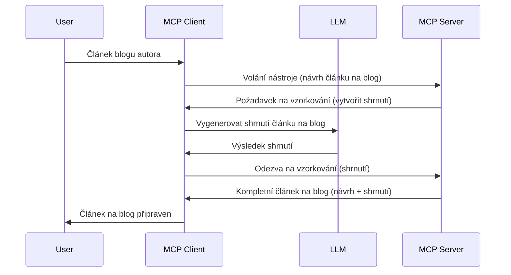

> [ZASTARALÉ: VERZE K DATU 2026-07-28](https://blog.modelcontextprotocol.io/posts/2026-07-28-release-candidate/)

# Sampling - delegování funkcí klientovi

> **Upozornění na ukončení podpory:** kandidátská verze specifikace MCP `2026-07-28` označuje Sampling jako zastaralé ve prospěch přímé integrace s API poskytovatelů LLM. Sampling nadále funguje ve verzi `2025-11-25` a alespoň po dobu jednoho roku po formálním ukončení podpory, takže všechno v této lekci zůstává platné — ale nové návrhy serverů by měly zvážit náhradní vzor. Viz [Co se mění v MCP: Kandidátská verze pro 2026-07-28](../../01-CoreConcepts/mcp-2026-07-28-release-candidate.md).

Někdy potřebujete, aby MCP Klient a MCP Server spolupracovali, aby dosáhli společného cíle. Může nastat situace, kdy server potřebuje pomoc LLM, které je umístěné na klientovi. Pro tuto situaci je sampling to, co byste měli použít.

Pojďme prozkoumat některé případy použití a jak postavit řešení, které sampling zahrnuje.

## Přehled

V této lekci se zaměříme na vysvětlení, kdy a kde použít Sampling a jak jej nakonfigurovat.

## Výukové cíle

V této kapitole:

- Vysvětlíme, co je Sampling a kdy jej používat.
- Ukážeme, jak nakonfigurovat Sampling v MCP.
- Poskytneme příklady použití Sampling.

## Co je Sampling a proč jej používat?

Sampling je pokročilá funkce, která funguje následujícím způsobem:



### Request na sampling

Dobrá, nyní máme přehled o věrohodném scénáři, pojďme si povědět o requestu na sampling, který server pošle klientovi. Takový požadavek může vypadat v JSON-RPC formátu takto:

```json
{
  "jsonrpc": "2.0",
  "id": 1,
  "method": "sampling/createMessage",
  "params": {
    "messages": [
      {
        "role": "user",
        "content": {
          "type": "text",
          "text": "Create a blog post summary of the following blog post: <BLOG POST>"
        }
      }
    ],
    "modelPreferences": {
      "hints": [
        {
          "name": "claude-3-sonnet"
        }
      ],
      "intelligencePriority": 0.8,
      "speedPriority": 0.5
    },
    "systemPrompt": "You are a helpful assistant.",
    "maxTokens": 100
  }
}
```

Je zde pár věcí, které stojí za zmínku:

- Prompt, pod obsahem -> text, je náš prompt, což je instrukce pro LLM, aby shrnul obsah blogového příspěvku.

- **modelPreferences**. Tato sekce je právě to, volba, doporučení, jakou konfiguraci použít s LLM. Uživatel si může vybrat, zda tyto doporučení přijme nebo změní. V tomto případě jsou doporučení ohledně modelu, rychlosti a priority inteligence.
- **systemPrompt**, to je váš běžný systémový prompt, který dává LLM osobnost a obsahuje instrukce.
- **maxTokens**, je to další vlastnost, která říká, kolik tokenů se doporučuje pro tento úkol použít.

### Odpověď na sampling

Tato odpověď je to, co MCP Klient nakonec pošle zpět MCP Serveru a je výsledkem volání LLM klientem, čekání na odpověď a sestavení této zprávy. Takto to může vypadat v JSON-RPC:

```json
{
  "jsonrpc": "2.0",
  "id": 1,
  "result": {
    "role": "assistant",
    "content": {
      "type": "text",
      "text": "Here's your abstract <ABSTRACT>"
    },
    "model": "gpt-5",
    "stopReason": "endTurn"
  }
}
```

Všimněte si, že odpověď je abstrakt blogového příspěvku, přesně podle naší žádosti. Také si všimněte, že použitý `model` není ten, o který jsme žádali, ale „gpt-5“ místo „claude-3-sonnet“. To demonstruje, že uživatel může změnit názor, který model použije, a že váš request na sampling je doporučení.

Dobrá, nyní, když chápeme hlavní tok a užitečný úkol, pro který sampling použít „vytvoření + abstrakt blogového příspěvku“, pojďme se podívat, co musíme udělat, aby to fungovalo.

### Typy zpráv

Samplingové zprávy nejsou omezeny jen na text, ale můžete posílat i obrázky a audio. Takto JSON-RPC vypadá jinak:

**Text**

```json
{
  "type": "text",
  "text": "The message content"
}
```

**Obsah obrázku**

```json
{
  "type": "image",
  "data": "base64-encoded-image-data",
  "mimeType": "image/jpeg"
}
```

**Obsah audia**

```json
{
  "type": "audio",
  "data": "base64-encoded-audio-data",
  "mimeType": "audio/wav"
}
```

> POZNÁMKA: pro podrobnější informace o Sampling si prohlédněte [oficiální dokumentaci](https://modelcontextprotocol.io/specification/2025-11-25/client/sampling)

## Jak nakonfigurovat Sampling v klientovi

> Poznámka: pokud stavíte pouze server, zde příliš nemusíte nic dělat.

V klientovi je potřeba specifikovat následující funkci takto:

```json
{
  "capabilities": {
    "sampling": {}
  }
}
```

To se pak načte při inicializaci vašeho vybraného klienta se serverem.

## Příklad použití Sampling - Vytvoření blogového příspěvku

Napišme sampling server společně, budeme potřebovat udělat toto:

1. Vytvořit nástroj na serveru.
2. Tento nástroj by měl vytvořit požadavek na sampling.
3. Nástroj by měl čekat na odpověď klienta na Sampling request.
4. Pak by měl nástroj vytvořit výsledek.

Podívejme se na kód krok za krokem:

### -1- Vytvoření nástroje

**python**

```python
@mcp.tool()
async def create_blog(title: str, content: str, ctx: Context[ServerSession, None]) -> str:
    """Create a blog post and generate a summary"""

```

### -2- Vytvoření sampling requestu

Rozšiřte svůj nástroj o následující kód:

**python**

```python
post = BlogPost(
        id=len(posts) + 1,
        title=title,
        content=content,
        abstract=""
    )

prompt = f"Create an abstract of the following blog post: title: {title} and draft: {content} "

result = await ctx.session.create_message(
        messages=[
            SamplingMessage(
                role="user",
                content=TextContent(type="text", text=prompt),
            )
        ],
        max_tokens=100,
)

```

### -3- Čekání na odpověď a návrat odpovědi

**python**

```python
post.abstract = result.content.text

posts.append(post)

# vraťte kompletní produkt
return json.dumps({
    "id": post.title,
    "abstract": post.abstract
})
```

### -4- Kompletní kód

**python**

```python
from starlette.applications import Starlette
from starlette.routing import Mount, Host

from mcp.server.fastmcp import Context, FastMCP

from mcp.server.session import ServerSession
from mcp.types import SamplingMessage, TextContent

import json


from uuid import uuid4
from typing import List
from pydantic import BaseModel


mcp = FastMCP("Blog post generator")

# app = FastAPI()

posts = []

class BlogPost(BaseModel):
    id: int
    title: str
    content: str
    abstract: str

posts: List[BlogPost] = []

@mcp.tool()
async def create_blog(title: str, content: str, ctx: Context[ServerSession, None]) -> str:
    """Create a blog post and generate a summary"""

    post = BlogPost(
        id=len(posts) + 1,
        title=title,
        content=content,
        abstract=""
    )

    prompt = f"Create an abstract of the following blog post: title: {title} and draft: {content} "

    result = await ctx.session.create_message(
        messages=[
            SamplingMessage(
                role="user",
                content=TextContent(type="text", text=prompt),
            )
        ],
        max_tokens=100,
    )

    post.abstract = result.content.text

    posts.append(post)

    # vrátit celý příspěvek na blogu
    return json.dumps({
        "id": post.title,
        "abstract": post.abstract
    })

if __name__ == "__main__":
    print("Starting server...")
    # mcp.run()
    mcp.run(transport="streamable-http")

# spusťte aplikaci příkazem: python server.py
```

### -5- Testování ve Visual Studio Code

Pro testování ve Visual Studio Code proveďte následující:

1. Spusťte server v terminálu
2. Přidejte jej do *mcp.json* (a ujistěte se, že je spuštěný), například takto:

   ```json
   "servers": {
      "blog-server": {
        "type": "http",
        "url": "http://localhost:8000/mcp"
      }
   }
   ```

3. Zadejte prompt:

   ```text
   create a blog post named "Where Python comes from", the content is "Python is actually named after Monty Python Flying Circus"
   ```

4. Povolit sampling. Při prvním testu se vám zobrazí dodatečný dialog, který musíte přijmout, poté uvidíte běžný dialog s žádostí o spuštění nástroje.

5. Prohlédněte si výsledky. Výsledky uvidíte pěkně zobrazené v GitHub Copilot Chat, ale můžete také zkontrolovat surovou JSON odpověď.

**Bonus**. Nástroje ve Visual Studio Code mají skvělou podporu pro sampling. Sampling přístup na vašem nainstalovaném serveru můžete konfigurovat takto:

1. Přejděte do sekce rozšíření.
2. Vyberte ikonu ozubeného kola u vašeho nainstalovaného serveru v sekci "MCP SERVERS - INSTALLED".
3. Vyberte "Configure Model Access", zde můžete vybrat, které modely může GitHub Copilot používat při sampling. Můžete také zobrazit všechny nedávné samplingové požadavky výběrem "Show Sampling requests".

## Zadání

V tomto zadání vybudujete mírně odlišný Sampling, konkrétně samplingovou integraci, která podporuje generování popisu produktu. Zde je váš scénář:

**Scénář**: Zaměstnanec back office v e-commerce potřebuje pomoc, vytváření popisů produktů zabírá příliš mnoho času. Proto máte vytvořit řešení, kde lze zavolat nástroj "create_product" s argumenty "title" a "keywords" a měl by vytvořit kompletní produkt včetně pole "description", které bude vyplněno LLM klienta.

TIP: použijte to, co jste se naučili dříve, k sestavení serveru a jeho nástroje s využitím Sampling requestu.

## Řešení

[Řešení](./solution/README.md)

## Klíčové poznatky

Sampling je silná funkce, která umožňuje serveru delegovat úkoly klientovi, když potřebuje pomoc LLM.

## Co dál

- [Kapitola 4 - Praktická implementace](../../04-PracticalImplementation/README.md)

---

<!-- CO-OP TRANSLATOR DISCLAIMER START -->
**Prohlášení o omezení odpovědnosti**:
Tento dokument byl přeložen pomocí AI překladatelské služby [Co-op Translator](https://github.com/Azure/co-op-translator). Přestože usilujeme o co největší přesnost, mějte prosím na paměti, že automatizované překlady mohou obsahovat chyby nebo nepřesnosti. Originální dokument v jeho mateřském jazyce by měl být považován za autoritativní zdroj. Pro kritické informace se doporučuje profesionální lidský překlad. Nejsme odpovědní za jakékoli nedorozumění nebo nesprávné interpretace vzniklé použitím tohoto překladu.
<!-- CO-OP TRANSLATOR DISCLAIMER END -->