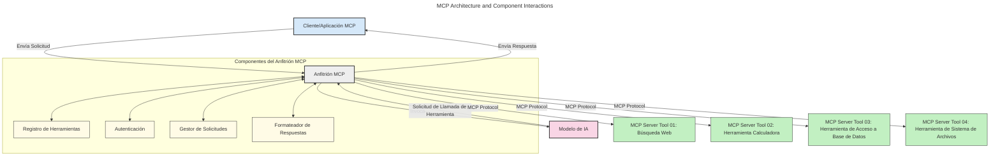
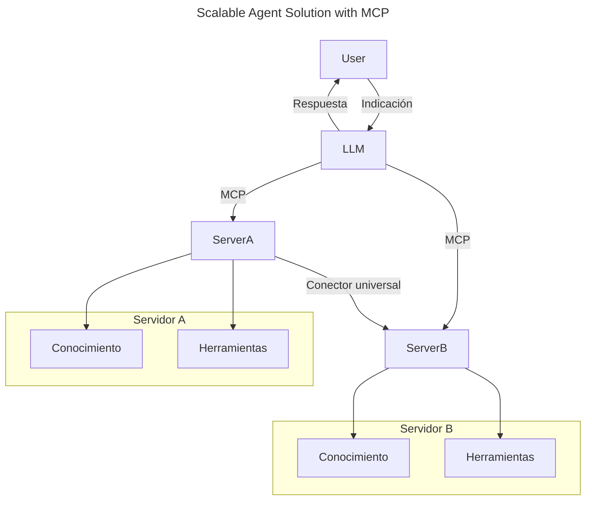
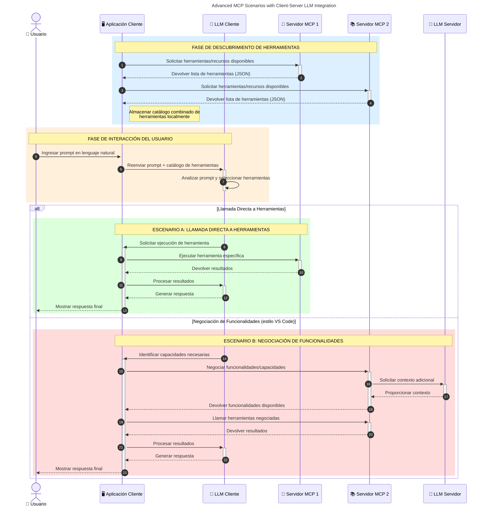

# Introducción al Protocolo de Contexto del Modelo (MCP): Por Qué Importa para Aplicaciones de IA Escalables

_(Haz clic en la imagen de arriba para ver el video de esta lección)_

Las aplicaciones de IA generativa son un gran avance ya que a menudo permiten al usuario interactuar con la aplicación mediante indicaciones en lenguaje natural. Sin embargo, a medida que se invierte más tiempo y recursos en estas aplicaciones, quieres asegurarte de poder integrar funcionalidades y recursos fácilmente de manera que sea sencillo extenderlas, que tu aplicación pueda atender más de un modelo usado y manejar las diversas complejidades de los modelos. En resumen, construir aplicaciones de IA generativa es fácil al principio, pero a medida que crecen y se vuelven más complejas, necesitas comenzar a definir una arquitectura y probablemente tendrás que basarte en un estándar para garantizar que tus aplicaciones se construyan de forma coherente. Aquí es donde MCP entra para organizar las cosas y proporcionar un estándar.

---

## **🔍 ¿Qué es el Protocolo de Contexto del Modelo (MCP)?**

El **Protocolo de Contexto del Modelo (MCP)** es una **interfaz abierta y estandarizada** que permite a los Grandes Modelos de Lenguaje (LLMs) interactuar de forma fluida con herramientas externas, APIs y fuentes de datos. Proporciona una arquitectura consistente para mejorar la funcionalidad del modelo de IA más allá de sus datos de entrenamiento, permitiendo sistemas de IA más inteligentes, escalables y con mayor capacidad de respuesta.

---

## **🎯 Por Qué Importa la Estandarización en IA**

A medida que las aplicaciones de IA generativa se vuelven más complejas, es esencial adoptar estándares que garanticen **escalabilidad, extensibilidad, mantenibilidad** y **eviten el encierro con un proveedor**. MCP aborda estas necesidades mediante:

- Unificar integraciones de modelos y herramientas
- Reducir soluciones personalizadas frágiles y puntuales
- Permitir que múltiples modelos de diferentes proveedores coexistan dentro de un solo ecosistema

**Nota:** Aunque MCP se promociona como un estándar abierto, no hay planes de estandarizar MCP a través de organismos de estándares existentes como IEEE, IETF, W3C, ISO u otros.

---

## **📚 Objetivos de Aprendizaje**

Al terminar este artículo, podrás:

- Definir el **Protocolo de Contexto del Modelo (MCP)** y sus casos de uso
- Entender cómo MCP estandariza la comunicación modelo-herramienta
- Identificar los componentes clave de la arquitectura MCP
- Explorar aplicaciones reales de MCP en entornos empresariales y de desarrollo

---

## **💡 Por Qué el Protocolo de Contexto del Modelo (MCP) es un Cambio Radical**

### **🔗 MCP Resuelve la Fragmentación en las Interacciones de IA**

Antes de MCP, integrar modelos con herramientas requería:

- Código personalizado por cada par herramienta-modelo
- APIs no estándar para cada proveedor
- Frecuentes interrupciones debido a actualizaciones
- Mala escalabilidad con más herramientas

### **✅ Beneficios de la Estandarización MCP**

| **Beneficio**            | **Descripción**                                                                |
|--------------------------|--------------------------------------------------------------------------------|
| Interoperabilidad        | Los LLMs funcionan sin problemas con herramientas de diferentes proveedores     |
| Consistencia             | Comportamiento uniforme entre plataformas y herramientas                        |
| Reusabilidad             | Las herramientas construidas una vez pueden usarse en proyectos y sistemas     |
| Desarrollo Acelerado     | Reducir el tiempo de desarrollo usando interfaces estandarizadas y plug-and-play |

---

## **🧱 Visión General de la Arquitectura MCP a Alto Nivel**

MCP sigue un **modelo cliente-servidor**, donde:

- **Hosts MCP** ejecutan los modelos de IA
- **Clientes MCP** inician solicitudes
- **Servidores MCP** sirven contexto, herramientas y capacidades

### **Componentes Clave:**

- **Recursos** – Datos estáticos o dinámicos para los modelos  
- **Prompts** – Flujos de trabajo predefinidos para generación guiada  
- **Herramientas** – Funciones ejecutables como búsqueda, cálculos  
- **Sampling** – Comportamiento agente mediante interacciones recursivas (obsoleto en candidato a lanzamiento `2026-07-28`)
- **Elicitación** – Solicitudes iniciadas por el servidor para entrada del usuario
- **Roots** – Límites del sistema de archivos para control de acceso del servidor (obsoleto en candidato a lanzamiento `2026-07-28`)

### **Arquitectura del Protocolo:**

MCP utiliza una arquitectura de dos capas:
- **Capa de Datos**: Comunicación basada en JSON-RPC 2.0 con gestión del ciclo de vida y primitivas
- **Capa de Transporte**: Canales de comunicación STDIO (local) y HTTP transmisible con SSE (remoto)

---

## Cómo Funcionan los Servidores MCP

Los servidores MCP operan de la siguiente manera:

- **Flujo de Solicitud**:
    1. Una solicitud es iniciada por un usuario final o software actuando en su nombre.
    2. El **Cliente MCP** envía la solicitud a un **Host MCP**, que administra el runtime del modelo de IA.
    3. El **Modelo de IA** recibe la prompt del usuario y puede solicitar acceso a herramientas o datos externos mediante una o más llamadas a herramientas.
    4. El **Host MCP**, no el modelo directamente, comunica con el/los **Servidor(es) MCP** correspondiente(s) usando el protocolo estandarizado.
- **Funcionalidad del Host MCP**:
    - **Registro de Herramientas**: Mantiene un catálogo de herramientas disponibles y sus capacidades.
    - **Autenticación**: Verifica permisos para acceso a herramientas.
    - **Manejador de Solicitudes**: Procesa las solicitudes entrantes de herramientas desde el modelo.
    - **Formateador de Respuestas**: Estructura las salidas de las herramientas en un formato que el modelo pueda entender.
- **Ejecución del Servidor MCP**:
    - El **Host MCP** enruta las llamadas a herramientas a uno o más **Servidores MCP**, cada uno exponiendo funciones especializadas (p. ej., búsqueda, cálculos, consultas a bases de datos).
    - Los **Servidores MCP** realizan sus operaciones respectivas y devuelven resultados al **Host MCP** en un formato consistente.
    - El **Host MCP** formatea y retransmite estos resultados al **Modelo de IA**.
- **Finalización de la Respuesta**:
    - El **Modelo de IA** incorpora las salidas de las herramientas en una respuesta final.
    - El **Host MCP** envía esta respuesta de vuelta al **Cliente MCP**, que la entrega al usuario final o software que llamó.
    

## 👨‍💻 Cómo Construir un Servidor MCP (Con Ejemplos)

Los servidores MCP te permiten extender las capacidades de los LLM proporcionando datos y funcionalidades.

¿Listo para probarlo? Aquí tienes SDKs específicos de lenguaje y/o stack con ejemplos para crear servidores MCP simples en diferentes lenguajes/stacks:

- **Python SDK**: https://github.com/modelcontextprotocol/python-sdk

- **TypeScript SDK**: https://github.com/modelcontextprotocol/typescript-sdk

- **Java SDK**: https://github.com/modelcontextprotocol/java-sdk

- **C#/.NET SDK**: https://github.com/modelcontextprotocol/csharp-sdk

## 🌍 Casos de Uso Reales para MCP

MCP permite una amplia gama de aplicaciones al extender las capacidades de IA:

| **Aplicación**                | **Descripción**                                                                |
|------------------------------|--------------------------------------------------------------------------------|
| Integración de Datos Empresariales | Conectar LLMs a bases de datos, CRMs o herramientas internas                   |
| Sistemas de IA Agentes       | Permitir agentes autónomos con acceso a herramientas y flujos de trabajo decisionales |
| Aplicaciones Multimodales    | Combinar herramientas de texto, imagen y audio dentro de una sola aplicación unificada de IA |
| Integración de Datos en Tiempo Real | Incorporar datos en vivo en interacciones de IA para resultados más precisos y actuales |

### 🧠 MCP = Estándar Universal para Interacciones de IA

El Protocolo de Contexto del Modelo (MCP) actúa como un estándar universal para interacciones de IA, tal como USB-C estandarizó las conexiones físicas para dispositivos. En el mundo de la IA, MCP proporciona una interfaz consistente que permite a los modelos (clientes) integrarse sin problemas con herramientas externas y proveedores de datos (servidores). Esto elimina la necesidad de protocolos diversos y personalizados para cada API o fuente de datos.

Bajo MCP, una herramienta compatible con MCP (denominada servidor MCP) sigue un estándar unificado. Estos servidores pueden listar las herramientas o acciones que ofrecen y ejecutar esas acciones cuando un agente de IA las solicita. Las plataformas de agentes IA que soportan MCP pueden descubrir las herramientas disponibles desde los servidores y llamarlas mediante este protocolo estándar.

### 💡 Facilita el acceso al conocimiento

Más allá de ofrecer herramientas, MCP también facilita el acceso al conocimiento. Permite que las aplicaciones provean contexto a los grandes modelos de lenguaje (LLMs) al vincularlos con diversas fuentes de datos. Por ejemplo, un servidor MCP podría representar el repositorio de documentos de una empresa, permitiendo que los agentes recuperen información relevante bajo demanda. Otro servidor podría manejar acciones específicas como enviar correos electrónicos o actualizar registros. Desde la perspectiva del agente, estas son simplemente herramientas que puede usar; algunas herramientas devuelven datos (contexto de conocimiento), mientras que otras realizan acciones. MCP gestiona ambas eficientemente.

Un agente que se conecta a un servidor MCP aprende automáticamente las capacidades disponibles del servidor y los datos accesibles mediante un formato estándar. Esta estandarización habilita la disponibilidad dinámica de herramientas. Por ejemplo, agregar un nuevo servidor MCP al sistema de un agente hace que sus funciones sean inmediatamente utilizables sin requerir más personalización de las instrucciones del agente.

Esta integración simplificada se alinea con el flujo representado en el siguiente diagrama, donde los servidores proveen tanto herramientas como conocimiento, asegurando una colaboración fluida entre sistemas.

### 👉 Ejemplo: Solución de Agente Escalable

El Conector Universal permite que los servidores MCP se comuniquen y compartan capacidades entre ellos, permitiendo que ServerA delegue tareas a ServerB o acceda a sus herramientas y conocimiento. Esto federá herramientas y datos entre servidores, apoyando arquitecturas de agentes escalables y modulares. Debido a que MCP estandariza la exposición de herramientas, los agentes pueden descubrir y enrutar dinámicamente solicitudes entre servidores sin integraciones codificadas rígidamente.

Federación de herramientas y conocimiento: Se puede acceder a herramientas y datos a través de servidores, permitiendo arquitecturas agentísticas más escalables y modulares.

### 🔄 Escenarios Avanzados de MCP con Integración de LLM en el Cliente

Más allá de la arquitectura básica MCP, existen escenarios avanzados donde tanto el cliente como el servidor contienen LLMs, permitiendo interacciones más sofisticadas. En el siguiente diagrama, **App Cliente** podría ser un IDE con varias herramientas MCP disponibles para usar por el LLM:

## 🔐 Beneficios Prácticos de MCP

Aquí están los beneficios prácticos de usar MCP:

- **Actualización continua**: Los modelos pueden acceder a información actualizada más allá de sus datos de entrenamiento
- **Extensión de capacidades**: Los modelos pueden aprovechar herramientas especializadas para tareas para las que no fueron entrenados
- **Reducción de alucinaciones**: Las fuentes de datos externas proporcionan fundamentación factual
- **Privacidad**: Datos sensibles pueden permanecer en entornos seguros en lugar de estar integrados en las prompts

## 📌 Puntos Clave

Los siguientes son puntos clave para usar MCP:

- **MCP** estandariza cómo los modelos de IA interactúan con herramientas y datos
- Promueve **extensibilidad, consistencia e interoperabilidad**
- MCP ayuda a **reducir el tiempo de desarrollo, mejorar la confiabilidad y extender las capacidades de los modelos**
- La arquitectura cliente-servidor **habilita aplicaciones de IA flexibles y extensibles**

## 🧠 Ejercicio

Piensa en una aplicación de IA que te interese construir.

- ¿Qué **herramientas o datos externos** podrían mejorar sus capacidades?
- ¿Cómo podría MCP hacer que la integración sea **más simple y confiable?**

## Recursos Adicionales

- [Repositorio MCP GitHub](https://github.com/modelcontextprotocol)

## Qué sigue

Siguiente: [Capítulo 1: Conceptos Básicos](../01-CoreConcepts/README.md)

---

<!-- CO-OP TRANSLATOR DISCLAIMER START -->
**Descargo de responsabilidad**:
Este documento ha sido traducido utilizando el servicio de traducción automática [Co-op Translator](https://github.com/Azure/co-op-translator). Aunque nos esforzamos por la precisión, tenga en cuenta que las traducciones automatizadas pueden contener errores o inexactitudes. El documento original en su idioma nativo debe considerarse la fuente autorizada. Para información crítica, se recomienda una traducción profesional humana. No somos responsables de cualquier malentendido o interpretación errónea que surja del uso de esta traducción.
<!-- CO-OP TRANSLATOR DISCLAIMER END -->