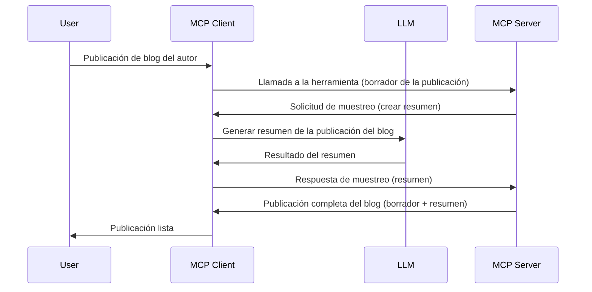

> [OBSOLETO: CANDIDATO A LANZAMIENTO 2026-07-28](https://blog.modelcontextprotocol.io/posts/2026-07-28-release-candidate/)

# Muestreo - delegar funciones al Cliente

> **Aviso de desuso:** el candidato a especificación MCP `2026-07-28` marca a Muestreo como obsoleto en favor de la integración directa con APIs de proveedores LLM. El muestreo sigue funcionando en `2025-11-25` y al menos un año después de cualquier desuso formal, por lo que todo en esta lección sigue siendo válido — pero los nuevos diseños de servidor deberían evaluar el patrón de reemplazo. Véase [Qué cambia en MCP: El candidato a lanzamiento 2026-07-28](../../01-CoreConcepts/mcp-2026-07-28-release-candidate.md).

A veces, es necesario que el Cliente MCP y el Servidor MCP colaboren para lograr un objetivo común. Puedes tener un caso donde el Servidor requiera la ayuda de un LLM que esté sobre el cliente. Para esta situación, el muestreo es lo que deberías usar.

Exploremos algunos casos de uso y cómo construir una solución que involucre muestreo.

## Resumen

En esta lección, nos enfocamos en explicar cuándo y dónde usar Muestreo y cómo configurarlo.

## Objetivos de aprendizaje

En este capítulo, vamos a:

- Explicar qué es Muestreo y cuándo usarlo.
- Mostrar cómo configurar Muestreo en MCP.
- Proveer ejemplos de Muestreo en acción.

## ¿Qué es Muestreo y por qué usarlo?

Muestreo es una función avanzada que funciona de la siguiente manera:



### Solicitud de muestreo

Bien, ahora que tenemos una vista general de un escenario creíble, hablemos de la solicitud de muestreo que el servidor envía al cliente. Esto es cómo puede lucir tal solicitud en formato JSON-RPC:

```json
{
  "jsonrpc": "2.0",
  "id": 1,
  "method": "sampling/createMessage",
  "params": {
    "messages": [
      {
        "role": "user",
        "content": {
          "type": "text",
          "text": "Create a blog post summary of the following blog post: <BLOG POST>"
        }
      }
    ],
    "modelPreferences": {
      "hints": [
        {
          "name": "claude-3-sonnet"
        }
      ],
      "intelligencePriority": 0.8,
      "speedPriority": 0.5
    },
    "systemPrompt": "You are a helpful assistant.",
    "maxTokens": 100
  }
}
```

Hay algunas cosas aquí que vale la pena destacar:

- El prompt, bajo content -> text, es nuestra instrucción para que el LLM resuma el contenido de una entrada de blog.

- **modelPreferences**. Esta sección es justamente eso, una preferencia, una recomendación sobre la configuración a usar con el LLM. El usuario puede elegir si seguir estas recomendaciones o modificarlas. En este caso hay recomendaciones sobre el modelo a usar y prioridad en velocidad y nivel de inteligencia.
- **systemPrompt**, este es el prompt normal del sistema que le da personalidad a tu LLM y contiene instrucciones de guía.
- **maxTokens**, es otra propiedad que indica cuántos tokens se recomiendan usar para esta tarea.

### Respuesta de muestreo

Esta respuesta es lo que el Cliente MCP termina enviando de regreso al Servidor MCP y es el resultado de que el cliente llama al LLM, espera esa respuesta y luego construye este mensaje. Así es como puede lucir en JSON-RPC:

```json
{
  "jsonrpc": "2.0",
  "id": 1,
  "result": {
    "role": "assistant",
    "content": {
      "type": "text",
      "text": "Here's your abstract <ABSTRACT>"
    },
    "model": "gpt-5",
    "stopReason": "endTurn"
  }
}
```

Nota cómo la respuesta es un resumen del post del blog tal como pedimos. También observa cómo el `model` usado no es el que pedimos sino "gpt-5" sobre "claude-3-sonnet". Esto es para ilustrar que el usuario puede cambiar de opinión sobre qué usar y que la solicitud de muestreo es una recomendación.

Bien, ahora que entendemos el flujo principal, y la tarea útil para usarlo "creación de post de blog + resumen", veamos qué debemos hacer para que funcione.

### Tipos de mensajes

Los mensajes de muestreo no se limitan solo al texto, también puedes enviar imágenes y audio. Así es como se ve el JSON-RPC diferente:

**Texto**

```json
{
  "type": "text",
  "text": "The message content"
}
```

**Contenido de imagen**

```json
{
  "type": "image",
  "data": "base64-encoded-image-data",
  "mimeType": "image/jpeg"
}
```

**Contenido de audio**

```json
{
  "type": "audio",
  "data": "base64-encoded-audio-data",
  "mimeType": "audio/wav"
}
```

> NOTA: para información detallada sobre Muestreo, revisa la [documentación oficial](https://modelcontextprotocol.io/specification/2025-11-25/client/sampling)

## Cómo configurar Muestreo en el Cliente

> Nota: si solo estás construyendo un servidor, no necesitas hacer mucho aquí.

En un cliente, necesitas especificar la siguiente función así:

```json
{
  "capabilities": {
    "sampling": {}
  }
}
```

Esto será detectado cuando tu cliente elegido se inicie con el servidor.

## Ejemplo de Muestreo en acción - Crear un post de blog

Codifiquemos un servidor de muestreo juntos, necesitaremos hacer lo siguiente:

1. Crear una herramienta en el Servidor.
1. Dicha herramienta debería crear una solicitud de muestreo.
1. La herramienta debe esperar a que la solicitud de muestreo del cliente sea respondida.
1. Luego debe producirse el resultado de la herramienta.

Veamos el código paso a paso:

### -1- Crear la herramienta

**python**

```python
@mcp.tool()
async def create_blog(title: str, content: str, ctx: Context[ServerSession, None]) -> str:
    """Create a blog post and generate a summary"""

```

### -2- Crear una solicitud de muestreo

Extiende tu herramienta con el siguiente código:

**python**

```python
post = BlogPost(
        id=len(posts) + 1,
        title=title,
        content=content,
        abstract=""
    )

prompt = f"Create an abstract of the following blog post: title: {title} and draft: {content} "

result = await ctx.session.create_message(
        messages=[
            SamplingMessage(
                role="user",
                content=TextContent(type="text", text=prompt),
            )
        ],
        max_tokens=100,
)

```

### -3- Esperar la respuesta y devolverla

**python**

```python
post.abstract = result.content.text

posts.append(post)

# devolver el producto completo
return json.dumps({
    "id": post.title,
    "abstract": post.abstract
})
```

### -4- Código completo

**python**

```python
from starlette.applications import Starlette
from starlette.routing import Mount, Host

from mcp.server.fastmcp import Context, FastMCP

from mcp.server.session import ServerSession
from mcp.types import SamplingMessage, TextContent

import json


from uuid import uuid4
from typing import List
from pydantic import BaseModel


mcp = FastMCP("Blog post generator")

# app = FastAPI()

posts = []

class BlogPost(BaseModel):
    id: int
    title: str
    content: str
    abstract: str

posts: List[BlogPost] = []

@mcp.tool()
async def create_blog(title: str, content: str, ctx: Context[ServerSession, None]) -> str:
    """Create a blog post and generate a summary"""

    post = BlogPost(
        id=len(posts) + 1,
        title=title,
        content=content,
        abstract=""
    )

    prompt = f"Create an abstract of the following blog post: title: {title} and draft: {content} "

    result = await ctx.session.create_message(
        messages=[
            SamplingMessage(
                role="user",
                content=TextContent(type="text", text=prompt),
            )
        ],
        max_tokens=100,
    )

    post.abstract = result.content.text

    posts.append(post)

    # devuelve la publicación de blog completa
    return json.dumps({
        "id": post.title,
        "abstract": post.abstract
    })

if __name__ == "__main__":
    print("Starting server...")
    # mcp.run()
    mcp.run(transport="streamable-http")

# ejecutar la aplicación con: python server.py
```

### -5- Probarlo en Visual Studio Code

Para probar esto en Visual Studio Code, haz lo siguiente:

1. Inicia el servidor en la terminal.
1. Agrégalo a *mcp.json* (y asegúrate de que esté iniciado), algo así:

   ```json
   "servers": {
      "blog-server": {
        "type": "http",
        "url": "http://localhost:8000/mcp"
      }
   }
   ```

1. Escribe un prompt:

   ```text
   create a blog post named "Where Python comes from", the content is "Python is actually named after Monty Python Flying Circus"
   ```

1. Permite que ocurra el muestreo. La primera vez que pruebes esto se te presentará un diálogo adicional que debes aceptar, luego verás el diálogo normal para pedirte que ejecutes una herramienta.

1. Inspecciona los resultados. Verás los resultados presentados de forma agradable en GitHub Copilot Chat pero también puedes inspeccionar la respuesta JSON cruda.

**Bonus**. Las herramientas de Visual Studio Code tienen un gran soporte para muestreo. Puedes configurar el acceso al Muestreo en tu servidor instalado navegando así:

1. Ve a la sección de extensiones.
1. Selecciona el ícono de engranaje para tu servidor instalado en la sección "MCP SERVERS - INSTALLED".
1 Selecciona "Configurar acceso a Modelos", aquí puedes seleccionar qué Modelos puede usar GitHub Copilot cuando realiza muestreo. También puedes ver todas las solicitudes de muestreo recientes seleccionando "Mostrar solicitudes de muestreo".

## Tarea

En esta tarea, construirás un Muestreo ligeramente diferente, concretamente una integración de muestreo que soporte generar una descripción de producto. Este es tu escenario:

**Escenario**: El trabajador de back office en un comercio electrónico necesita ayuda, le toma demasiado tiempo generar descripciones de productos. Por lo tanto, debes construir una solución donde puedas llamar a una herramienta "create_product" con "title" y "keywords" como argumentos y que debe producir un producto completo incluyendo un campo "description" que debe ser llenado por un LLM del cliente.

CONSEJO: usa lo que aprendiste antes para construir este servidor y su herramienta usando una solicitud de muestreo.

## Solución

[Solución](./solution/README.md)

## Puntos clave

Muestreo es una función poderosa que permite al servidor delegar tareas al cliente cuando necesita la ayuda de un LLM.

## Qué sigue

- [Capítulo 4 - Implementación práctica](../../04-PracticalImplementation/README.md)

---

<!-- CO-OP TRANSLATOR DISCLAIMER START -->
**Descargo de responsabilidad**:
Este documento ha sido traducido utilizando el servicio de traducción automática [Co-op Translator](https://github.com/Azure/co-op-translator). Aunque nos esforzamos por la precisión, tenga en cuenta que las traducciones automatizadas pueden contener errores o inexactitudes. El documento original en su idioma nativo debe considerarse la fuente autorizada. Para información crítica, se recomienda una traducción profesional humana. No somos responsables de cualquier malentendido o interpretación errónea que surja del uso de esta traducción.
<!-- CO-OP TRANSLATOR DISCLAIMER END -->