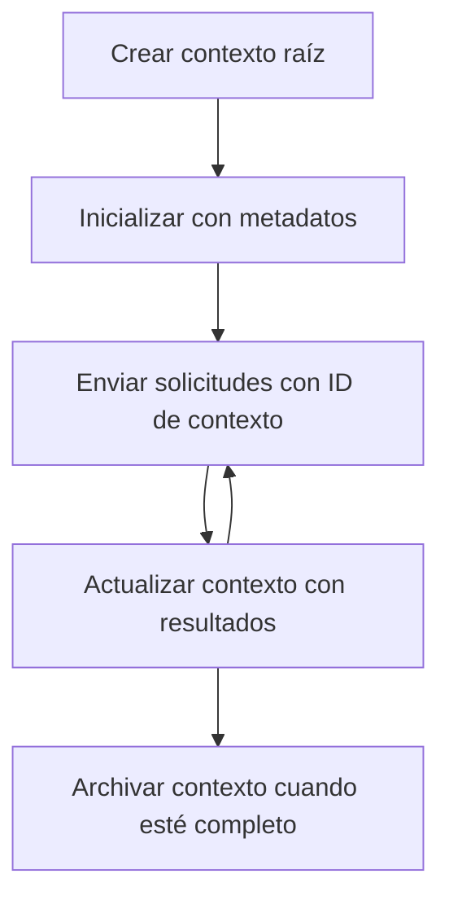

> [OBSOLETO: CANDIDATO A LANZAMIENTO 2026-07-28](https://blog.modelcontextprotocol.io/posts/2026-07-28-release-candidate/#roots-sampling-and-logging-are-deprecated)

# Contextos Raíz MCP

> **Aviso de obsolescencia:** el candidato a especificación de lanzamiento MCP `2026-07-28` marca las raíces como obsoletas a favor de parámetros de herramientas, URIs de recursos o configuración del servidor. Las raíces continúan funcionando en `2025-11-25` y durante al menos un año después de cualquier obsolescencia formal, por lo que todo en esta lección sigue siendo válido, pero los nuevos diseños de servidor deberían evaluar el patrón de reemplazo. Véase [Qué está cambiando en MCP: El candidato a lanzamiento 2026-07-28](../../01-CoreConcepts/mcp-2026-07-28-release-candidate.md).

Los contextos raíz son un concepto fundamental en el Protocolo de Contexto de Modelo que provee una capa persistente para mantener el historial de conversaciones y el estado compartido a través de múltiples solicitudes y sesiones.

## Introducción

En esta lección exploraremos cómo crear, administrar y utilizar contextos raíz en MCP.

## Objetivos de aprendizaje

Al final de esta lección, podrás:

- Entender el propósito y la estructura de los contextos raíz
- Crear y administrar contextos raíz usando bibliotecas cliente MCP
- Implementar contextos raíz en aplicaciones .NET, Java, JavaScript y Python
- Utilizar contextos raíz para conversaciones de múltiples turnos y gestión de estado
- Implementar buenas prácticas para la gestión de contextos raíz

## Comprendiendo los Contextos Raíz

Los contextos raíz actúan como contenedores que almacenan el historial y el estado para una serie de interacciones relacionadas. Permiten:

- **Persistencia de la conversación**: Mantener conversaciones coherentes de múltiples turnos
- **Gestión de memoria**: Almacenar y recuperar información a través de interacciones
- **Gestión de estado**: Rastrear el progreso en flujos de trabajo complejos
- **Compartición de contexto**: Permitir que múltiples clientes accedan al mismo estado de conversación

En MCP, los contextos raíz tienen estas características clave:

- Cada contexto raíz tiene un identificador único.
- Pueden contener historial de la conversación, preferencias de usuario y otros metadatos.
- Pueden ser creados, accedidos y archivados según sea necesario.
- Soportan control de acceso y permisos granulares.

## Ciclo de vida del contexto raíz



## Trabajando con contextos raíz

Aquí hay un ejemplo de cómo crear y administrar contextos raíz.

### Implementación en C#

```csharp
// .NET Example: Root Context Management
using Microsoft.Mcp.Client;
using System;
using System.Threading.Tasks;
using System.Collections.Generic;

public class RootContextExample
{
    private readonly IMcpClient _client;
    private readonly IRootContextManager _contextManager;
    
    public RootContextExample(IMcpClient client, IRootContextManager contextManager)
    {
        _client = client;
        _contextManager = contextManager;
    }
    
    public async Task DemonstrateRootContextAsync()
    {
        // 1. Create a new root context
        var contextResult = await _contextManager.CreateRootContextAsync(new RootContextCreateOptions
        {
            Name = "Customer Support Session",
            Metadata = new Dictionary<string, string>
            {
                ["CustomerName"] = "Acme Corporation",
                ["PriorityLevel"] = "High",
                ["Domain"] = "Cloud Services"
            }
        });
        
        string contextId = contextResult.ContextId;
        Console.WriteLine($"Created root context with ID: {contextId}");
        
        // 2. First interaction using the context
        var response1 = await _client.SendPromptAsync(
            "I'm having issues scaling my web service deployment in the cloud.", 
            new SendPromptOptions { RootContextId = contextId }
        );
        
        Console.WriteLine($"First response: {response1.GeneratedText}");
        
        // Second interaction - the model will have access to the previous conversation
        var response2 = await _client.SendPromptAsync(
            "Yes, we're using containerized deployments with Kubernetes.", 
            new SendPromptOptions { RootContextId = contextId }
        );
        
        Console.WriteLine($"Second response: {response2.GeneratedText}");
        
        // 3. Add metadata to the context based on conversation
        await _contextManager.UpdateContextMetadataAsync(contextId, new Dictionary<string, string>
        {
            ["TechnicalEnvironment"] = "Kubernetes",
            ["IssueType"] = "Scaling"
        });
        
        // 4. Get context information
        var contextInfo = await _contextManager.GetRootContextInfoAsync(contextId);
        
        Console.WriteLine("Context Information:");
        Console.WriteLine($"- Name: {contextInfo.Name}");
        Console.WriteLine($"- Created: {contextInfo.CreatedAt}");
        Console.WriteLine($"- Messages: {contextInfo.MessageCount}");
        
        // 5. When the conversation is complete, archive the context
        await _contextManager.ArchiveRootContextAsync(contextId);
        Console.WriteLine($"Archived context {contextId}");
    }
}
```

En el código anterior hemos:

1. Creado un contexto raíz para una sesión de soporte al cliente.
1. Enviado múltiples mensajes dentro de ese contexto, permitiendo que el modelo mantenga el estado.
1. Actualizado el contexto con metadatos relevantes basados en la conversación.
1. Recuperado información del contexto para entender el historial de la conversación.
1. Archivado el contexto cuando la conversación finalizó.

## Ejemplo: Implementación de contexto raíz para análisis financiero

En este ejemplo, crearemos un contexto raíz para una sesión de análisis financiero, demostrando cómo mantener el estado a través de múltiples interacciones.

### Implementación en Java

```java
// Ejemplo de Java: Implementación de Contexto Raíz
package com.example.mcp.contexts;

import com.mcp.client.McpClient;
import com.mcp.client.ContextManager;
import com.mcp.models.RootContext;
import com.mcp.models.McpResponse;

import java.util.HashMap;
import java.util.Map;
import java.util.UUID;

public class RootContextsDemo {
    private final McpClient client;
    private final ContextManager contextManager;
    
    public RootContextsDemo(String serverUrl) {
        this.client = new McpClient.Builder()
            .setServerUrl(serverUrl)
            .build();
            
        this.contextManager = new ContextManager(client);
    }
    
    public void demonstrateRootContext() throws Exception {
        // Crear metadatos de contexto
        Map<String, String> metadata = new HashMap<>();
        metadata.put("projectName", "Financial Analysis");
        metadata.put("userRole", "Financial Analyst");
        metadata.put("dataSource", "Q1 2025 Financial Reports");
        
        // 1. Crear un nuevo contexto raíz
        RootContext context = contextManager.createRootContext("Financial Analysis Session", metadata);
        String contextId = context.getId();
        
        System.out.println("Created context: " + contextId);
        
        // 2. Primera interacción
        McpResponse response1 = client.sendPrompt(
            "Analyze the trends in Q1 financial data for our technology division",
            contextId
        );
        
        System.out.println("First response: " + response1.getGeneratedText());
        
        // 3. Actualizar el contexto con información importante obtenida de la respuesta
        contextManager.addContextMetadata(contextId, 
            Map.of("identifiedTrend", "Increasing cloud infrastructure costs"));
        
        // Segunda interacción - usando el mismo contexto
        McpResponse response2 = client.sendPrompt(
            "What's driving the increase in cloud infrastructure costs?",
            contextId
        );
        
        System.out.println("Second response: " + response2.getGeneratedText());
        
        // 4. Generar un resumen de la sesión de análisis
        McpResponse summaryResponse = client.sendPrompt(
            "Summarize our analysis of the technology division financials in 3-5 key points",
            contextId
        );
        
        // Almacenar el resumen en los metadatos del contexto
        contextManager.addContextMetadata(contextId, 
            Map.of("analysisSummary", summaryResponse.getGeneratedText()));
            
        // Obtener información actualizada del contexto
        RootContext updatedContext = contextManager.getRootContext(contextId);
        
        System.out.println("Context Information:");
        System.out.println("- Created: " + updatedContext.getCreatedAt());
        System.out.println("- Last Updated: " + updatedContext.getLastUpdatedAt());
        System.out.println("- Analysis Summary: " + 
            updatedContext.getMetadata().get("analysisSummary"));
            
        // 5. Archivar el contexto cuando haya terminado
        contextManager.archiveContext(contextId);
        System.out.println("Context archived");
    }
}
```

En el código anterior, hemos:

1. Creado un contexto raíz para una sesión de análisis financiero.
2. Enviado múltiples mensajes dentro de ese contexto, permitiendo que el modelo mantenga el estado.
3. Actualizado el contexto con metadatos relevantes basados en la conversación.
4. Generado un resumen de la sesión de análisis y almacenado en los metadatos del contexto.
5. Archivado el contexto cuando la conversación finalizó.

## Ejemplo: Gestión de contextos raíz

Administrar eficazmente los contextos raíz es crucial para mantener el historial de conversaciones y estado. A continuación, un ejemplo de cómo implementar la gestión de contextos raíz.

### Implementación en JavaScript

```javascript
// Ejemplo de JavaScript: Gestión de Contextos Raíz MCP
const { McpClient, RootContextManager } = require('@mcp/client');

class ContextSession {
  constructor(serverUrl, apiKey = null) {
    // Inicializar el cliente MCP
    this.client = new McpClient({
      serverUrl,
      apiKey
    });
    
    // Inicializar el gestor de contexto
    this.contextManager = new RootContextManager(this.client);
  }
  
  /**
   * Create a new conversation context
   * @param {string} sessionName - Name of the conversation session
   * @param {Object} metadata - Additional metadata for the context
   * @returns {Promise<string>} - Context ID
   */
  async createConversationContext(sessionName, metadata = {}) {
    try {
      const contextResult = await this.contextManager.createRootContext({
        name: sessionName,
        metadata: {
          ...metadata,
          createdAt: new Date().toISOString(),
          status: 'active'
        }
      });
      
      console.log(`Created root context '${sessionName}' with ID: ${contextResult.id}`);
      return contextResult.id;
    } catch (error) {
      console.error('Error creating root context:', error);
      throw error;
    }
  }
  
  /**
   * Send a message in an existing context
   * @param {string} contextId - The root context ID
   * @param {string} message - The user's message
   * @param {Object} options - Additional options
   * @returns {Promise<Object>} - Response data
   */
  async sendMessage(contextId, message, options = {}) {
    try {
      // Enviar el mensaje usando el contexto especificado
      const response = await this.client.sendPrompt(message, {
        rootContextId: contextId,
        temperature: options.temperature || 0.7,
        allowedTools: options.allowedTools || []
      });
      
      // Opcionalmente almacenar ideas importantes de la conversación
      if (options.storeInsights) {
        await this.storeConversationInsights(contextId, message, response.generatedText);
      }
      
      return {
        message: response.generatedText,
        toolCalls: response.toolCalls || [],
        contextId
      };
    } catch (error) {
      console.error(`Error sending message in context ${contextId}:`, error);
      throw error;
    }
  }
  
  /**
   * Store important insights from a conversation
   * @param {string} contextId - The root context ID
   * @param {string} userMessage - User's message
   * @param {string} aiResponse - AI's response
   */
  async storeConversationInsights(contextId, userMessage, aiResponse) {
    try {
      // Extraer posibles ideas (en una aplicación real, esto sería más sofisticado)
      const combinedText = userMessage + "\n" + aiResponse;
      
      // Heurística simple para identificar posibles ideas
      const insightWords = ["important", "key point", "remember", "significant", "crucial"];
      
      const potentialInsights = combinedText
        .split(".")
        .filter(sentence => 
          insightWords.some(word => sentence.toLowerCase().includes(word))
        )
        .map(sentence => sentence.trim())
        .filter(sentence => sentence.length > 10);
      
      // Almacenar ideas en los metadatos del contexto
      if (potentialInsights.length > 0) {
        const insights = {};
        potentialInsights.forEach((insight, index) => {
          insights[`insight_${Date.now()}_${index}`] = insight;
        });
        
        await this.contextManager.updateContextMetadata(contextId, insights);
        console.log(`Stored ${potentialInsights.length} insights in context ${contextId}`);
      }
    } catch (error) {
      console.warn('Error storing conversation insights:', error);
      // Error no crítico, solo registrar una advertencia
    }
  }
  
  /**
   * Get summary information about a context
   * @param {string} contextId - The root context ID
   * @returns {Promise<Object>} - Context information
   */
  async getContextInfo(contextId) {
    try {
      const contextInfo = await this.contextManager.getContextInfo(contextId);
      
      return {
        id: contextInfo.id,
        name: contextInfo.name,
        created: new Date(contextInfo.createdAt).toLocaleString(),
        lastUpdated: new Date(contextInfo.lastUpdatedAt).toLocaleString(),
        messageCount: contextInfo.messageCount,
        metadata: contextInfo.metadata,
        status: contextInfo.status
      };
    } catch (error) {
      console.error(`Error getting context info for ${contextId}:`, error);
      throw error;
    }
  }
  
  /**
   * Generate a summary of the conversation in a context
   * @param {string} contextId - The root context ID
   * @returns {Promise<string>} - Generated summary
   */
  async generateContextSummary(contextId) {
    try {
      // Pedir al modelo que genere un resumen de la conversación hasta ahora
      const response = await this.client.sendPrompt(
        "Please summarize our conversation so far in 3-4 sentences, highlighting the main points discussed.",
        { rootContextId: contextId, temperature: 0.3 }
      );
      
      // Almacenar el resumen en los metadatos del contexto
      await this.contextManager.updateContextMetadata(contextId, {
        conversationSummary: response.generatedText,
        summarizedAt: new Date().toISOString()
      });
      
      return response.generatedText;
    } catch (error) {
      console.error(`Error generating context summary for ${contextId}:`, error);
      throw error;
    }
  }
  
  /**
   * Archive a context when it's no longer needed
   * @param {string} contextId - The root context ID
   * @returns {Promise<Object>} - Result of the archive operation
   */
  async archiveContext(contextId) {
    try {
      // Generar un resumen final antes de archivar
      const summary = await this.generateContextSummary(contextId);
      
      // Archivar el contexto
      await this.contextManager.archiveContext(contextId);
      
      return {
        status: "archived",
        contextId,
        summary
      };
    } catch (error) {
      console.error(`Error archiving context ${contextId}:`, error);
      throw error;
    }
  }
}

// Ejemplo de uso
async function demonstrateContextSession() {
  const session = new ContextSession('https://mcp-server-example.com');
  
  try {
    // 1. Crear un nuevo contexto para una conversación de soporte de producto
    const contextId = await session.createConversationContext(
      'Product Support - Database Performance',
      {
        customer: 'Globex Corporation',
        product: 'Enterprise Database',
        severity: 'Medium',
        supportAgent: 'AI Assistant'
      }
    );
    
    // 2. Primer mensaje en la conversación
    const response1 = await session.sendMessage(
      contextId,
      "I'm experiencing slow query performance on our database cluster after the latest update.",
      { storeInsights: true }
    );
    console.log('Response 1:', response1.message);
    
    // Mensaje de seguimiento en el mismo contexto
    const response2 = await session.sendMessage(
      contextId,
      "Yes, we've already checked the indexes and they seem to be properly configured.",
      { storeInsights: true }
    );
    console.log('Response 2:', response2.message);
    
    // 3. Obtener información sobre el contexto
    const contextInfo = await session.getContextInfo(contextId);
    console.log('Context Information:', contextInfo);
    
    // 4. Generar y mostrar el resumen de la conversación
    const summary = await session.generateContextSummary(contextId);
    console.log('Conversation Summary:', summary);
    
    // 5. Archivar el contexto cuando se termine
    const archiveResult = await session.archiveContext(contextId);
    console.log('Archive Result:', archiveResult);
    
    // 6. Manejar cualquier error de forma elegante
  } catch (error) {
    console.error('Error in context session demonstration:', error);
  }
}

demonstrateContextSession();
```

En el código anterior hemos:

1. Creado un contexto raíz para una conversación de soporte de producto con la función `createConversationContext`. En este caso, el contexto trata sobre problemas de rendimiento en bases de datos.

1. Enviado múltiples mensajes dentro de ese contexto, permitiendo que el modelo mantenga el estado con la función `sendMessage`. Los mensajes enviados tratan sobre el rendimiento lento en consultas y configuración de índices.

1. Actualizado el contexto con metadatos relevantes basados en la conversación.

1. Generado un resumen de la conversación y almacenado en los metadatos del contexto con la función `generateContextSummary`.

1. Archivado el contexto cuando la conversación finalizó con la función `archiveContext`.

1. Manejado errores de forma robusta para garantizar estabilidad.

## Contexto raíz para asistencia de múltiples turnos

En este ejemplo, crearemos un contexto raíz para una sesión de asistencia de múltiples turnos, demostrando cómo mantener el estado a través de múltiples interacciones.

### Implementación en Python

```python
# Ejemplo de Python: Contexto raíz para asistencia multi-turno
import asyncio
from datetime import datetime
from mcp_client import McpClient, RootContextManager

class AssistantSession:
    def __init__(self, server_url, api_key=None):
        self.client = McpClient(server_url=server_url, api_key=api_key)
        self.context_manager = RootContextManager(self.client)
    
    async def create_session(self, name, user_info=None):
        """Create a new root context for an assistant session"""
        metadata = {
            "session_type": "assistant",
            "created_at": datetime.now().isoformat(),
        }
        
        # Agregar información del usuario si se proporciona
        if user_info:
            metadata.update({f"user_{k}": v for k, v in user_info.items()})
            
        # Crear el contexto raíz
        context = await self.context_manager.create_root_context(name, metadata)
        return context.id
    
    async def send_message(self, context_id, message, tools=None):
        """Send a message within a root context"""
        # Crear opciones con ID de contexto
        options = {
            "root_context_id": context_id
        }
        
        # Agregar herramientas si se especifican
        if tools:
            options["allowed_tools"] = tools
        
        # Enviar el prompt dentro del contexto
        response = await self.client.send_prompt(message, options)
        
        # Actualizar metadatos del contexto con el progreso de la conversación
        await self.context_manager.update_context_metadata(
            context_id,
            {
                f"message_{datetime.now().timestamp()}": message[:50] + "...",
                "last_interaction": datetime.now().isoformat()
            }
        )
        
        return response
    
    async def get_conversation_history(self, context_id):
        """Retrieve conversation history from a context"""
        context_info = await self.context_manager.get_context_info(context_id)
        messages = await self.client.get_context_messages(context_id)
        
        return {
            "context_info": context_info,
            "messages": messages
        }
    
    async def end_session(self, context_id):
        """End an assistant session by archiving the context"""
        # Generar un prompt de resumen primero
        summary_response = await self.client.send_prompt(
            "Please summarize our conversation and any key points or decisions made.",
            {"root_context_id": context_id}
        )
        
        # Almacenar el resumen en los metadatos
        await self.context_manager.update_context_metadata(
            context_id,
            {
                "summary": summary_response.generated_text,
                "ended_at": datetime.now().isoformat(),
                "status": "completed"
            }
        )
        
        # Archivar el contexto
        await self.context_manager.archive_context(context_id)
        
        return {
            "status": "completed",
            "summary": summary_response.generated_text
        }

# Ejemplo de uso
async def demo_assistant_session():
    assistant = AssistantSession("https://mcp-server-example.com")
    
    # 1. Crear sesión
    context_id = await assistant.create_session(
        "Technical Support Session",
        {"name": "Alex", "technical_level": "advanced", "product": "Cloud Services"}
    )
    print(f"Created session with context ID: {context_id}")
    
    # 2. Primera interacción
    response1 = await assistant.send_message(
        context_id, 
        "I'm having trouble with the auto-scaling feature in your cloud platform.",
        ["documentation_search", "diagnostic_tool"]
    )
    print(f"Response 1: {response1.generated_text}")
    
    # Segunda interacción en el mismo contexto
    response2 = await assistant.send_message(
        context_id,
        "Yes, I've already checked the configuration settings you mentioned, but it's still not working."
    )
    print(f"Response 2: {response2.generated_text}")
    
    # 3. Obtener historial
    history = await assistant.get_conversation_history(context_id)
    print(f"Session has {len(history['messages'])} messages")
    
    # 4. Finalizar sesión
    end_result = await assistant.end_session(context_id)
    print(f"Session ended with summary: {end_result['summary']}")

if __name__ == "__main__":
    asyncio.run(demo_assistant_session())
```

En el código anterior hemos:

1. Creado un contexto raíz para una sesión de soporte técnico con la función `create_session`. El contexto incluye información del usuario como nombre y nivel técnico.

1. Enviado múltiples mensajes dentro de ese contexto, permitiendo que el modelo mantenga el estado con la función `send_message`. Los mensajes enviados tratan sobre problemas con la función de autoescalado.

1. Recuperado el historial de la conversación usando la función `get_conversation_history`, la cual provee información del contexto y mensajes.

1. Finalizado la sesión archivando el contexto y generando un resumen con la función `end_session`. El resumen captura puntos clave de la conversación.

## Mejores prácticas para contextos raíz

Aquí algunas mejores prácticas para gestionar eficazmente contextos raíz:

- **Crear contextos focalizados**: Crear contextos raíz separados para diferentes propósitos o dominios de conversación para mantener claridad.

- **Establecer políticas de expiración**: Implementar políticas para archivar o eliminar contextos antiguos para gestionar almacenamiento y cumplir con políticas de retención de datos.

- **Almacenar metadatos relevantes**: Usar metadatos del contexto para almacenar información importante sobre la conversación que pueda ser útil posteriormente.

- **Usar IDs de contexto consistentemente**: Una vez creado un contexto, usar su ID consistentemente para todas las solicitudes relacionadas para mantener continuidad.

- **Generar resúmenes**: Cuando un contexto crece mucho, considerar generar resúmenes para capturar información esencial mientras se gestiona el tamaño del contexto.

- **Implementar control de acceso**: Para sistemas multiusuario, implementar controles de acceso apropiados para garantizar privacidad y seguridad de los contextos de conversación.

- **Manejar limitaciones de contexto**: Ser consciente de las limitaciones del tamaño del contexto e implementar estrategias para manejar conversaciones muy largas.

- **Archivar al finalizar**: Archivar contextos cuando las conversaciones concluyen para liberar recursos mientras se preserva el historial de conversación.

## Qué sigue

- [5.5 Enrutamiento](../mcp-routing/README.md)

---

<!-- CO-OP TRANSLATOR DISCLAIMER START -->
**Descargo de responsabilidad**:
Este documento ha sido traducido utilizando el servicio de traducción automática [Co-op Translator](https://github.com/Azure/co-op-translator). Aunque nos esforzamos por la precisión, tenga en cuenta que las traducciones automatizadas pueden contener errores o inexactitudes. El documento original en su idioma nativo debe considerarse la fuente autorizada. Para información crítica, se recomienda una traducción profesional humana. No somos responsables de cualquier malentendido o interpretación errónea que surja del uso de esta traducción.
<!-- CO-OP TRANSLATOR DISCLAIMER END -->