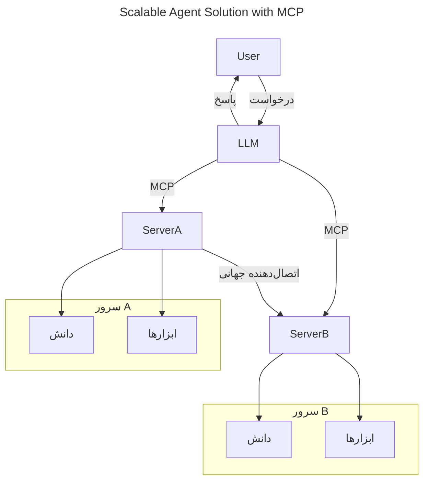
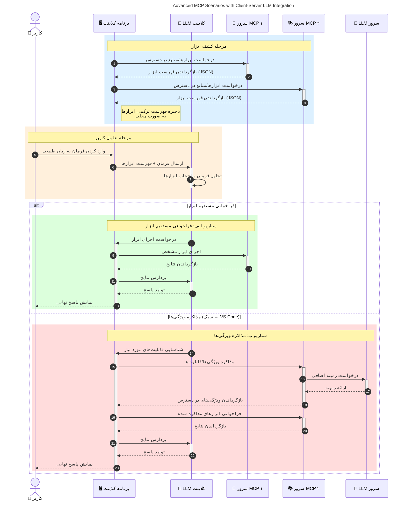

# مقدمه‌ای بر پروتکل مدل کانتکست (MCP): چرا برای برنامه‌های AI مقیاس‌پذیر اهمیت دارد

[](https://youtu.be/agBbdiOPLQA)

_(برای مشاهده ویدیو این درس روی تصویر بالا کلیک کنید)_

برنامه‌های AI مولد یک گام بزرگ به جلو هستند چرا که اغلب به کاربر اجازه می‌دهند تا با استفاده از دستورات زبان طبیعی با برنامه تعامل کنند. با این حال، هرچه زمان و منابع بیشتری در این برنامه‌ها سرمایه‌گذاری شود، باید اطمینان حاصل کنید که می‌توانید عملکردها و منابع را به گونه‌ای ادغام کنید که به راحتی قابل گسترش باشد، برنامه شما بتواند از بیش از یک مدل استفاده کند و پیچیدگی‌های مختلف مدل را مدیریت کند. به عبارتی، ساخت برنامه‌های Gen AI در ابتدا آسان است اما با رشد و پیچیدگی آن‌ها، باید معماری مشخصی تعریف کرده و احتمالاً به یک استاندارد تکیه کنید تا اطمینان حاصل شود برنامه‌ها به روشی یکسان ساخته شده‌اند. اینجاست که MCP به سازماندهی مسائل و ارائه یک استاندارد کمک می‌کند.

---

## **🔍 پروتکل مدل کانتکست (MCP) چیست؟**

**پروتکل مدل کانتکست (MCP)** یک **رابط استاندارد و باز** است که به مدل‌های زبان بزرگ (LLMها) اجازه می‌دهد به‌طور یکپارچه با ابزارها، APIها و منابع داده خارجی تعامل کنند. این پروتکل معماری ثابتی را فراهم می‌کند تا عملکرد مدل‌های AI را فراتر از داده‌های آموزشی‌شان تقویت کند و به سیستم‌های هوشمندتر، مقیاس‌پذیرتر و پاسخگوتر منجر شود.

---

## **🎯 چرا استانداردسازی در AI اهمیت دارد**

با پیچیده‌تر شدن برنامه‌های AI مولد، ضروری است که استانداردهایی را بپذیریم که اطمینان دهند این برنامه‌ها **مقیاس‌پذیر، قابل گسترش، قابل نگهداری** و **جلوگیری از قفل شدن به یک فروشنده** هستند. MCP این نیازها را با موارد زیر برطرف می‌کند:

- یکپارچه‌سازی ابزار-مدل
- کاهش راه‌حل‌های شکننده و اختصاصی
- امکان همزیستی چندین مدل از فروشندگان مختلف در یک اکوسیستم

**توجه:** در حالی که MCP خود را به عنوان یک استاندارد باز معرفی می‌کند، هیچ برنامه‌ای برای استانداردسازی MCP از طریق نهادهای استاندارد موجود مانند IEEE، IETF، W3C، ISO یا دیگر نهادهای استاندارد وجود ندارد.

---

## **📚 اهداف یادگیری**

در پایان این مقاله، شما قادر خواهید بود:

- تعریف **پروتکل مدل کانتکست (MCP)** و موارد استفاده آن
- درک چگونگی استانداردسازی ارتباط مدل با ابزارها توسط MCP
- شناسایی اجزای اصلی معماری MCP
- بررسی کاربردهای دنیای واقعی MCP در حوزه‌های سازمانی و توسعه‌ای

---

## **💡 چرا پروتکل مدل کانتکست (MCP) تحولی ایجاد کرده است**

### **🔗 MCP حل‌وفصل پراکندگی در تعاملات AI**

قبل از MCP، ادغام مدل‌ها با ابزارها نیازمند:

- کد سفارشی برای هر جفت ابزار-مدل
- APIهای غیر استاندارد برای هر فروشنده
- اختلالات مکرر به دلیل به‌روزرسانی‌ها
- مقیاس‌پذیری ضعیف با افزایش ابزارها

### **✅ مزایای استانداردسازی MCP**

| **مزیت**              | **توضیح**                                                                |
|--------------------------|-------------------------------------------------------------------------|
| تعامل‌پذیری         | LLMها به راحتی با ابزارها در میان فروشندگان مختلف کار می‌کنند       |
| یکنواختی              | رفتار یکنواخت در سرتاسر پلتفرم‌ها و ابزارها                           |
| قابلیت استفاده مجدد  | ابزارهایی که یک بار ساخته شده‌اند، می‌توانند در پروژه‌ها و سیستم‌ها استفاده شوند |
| توسعه سریع‌تر        | کاهش زمان توسعه با استفاده از رابط‌های استاندارد و قابل اتصال      |

---

## **🧱 نمای کلی معماری سطح بالا MCP**

MCP از **مدل کلاینت-سرور** پیروی می‌کند که:

- **میزبان‌های MCP** مدل‌های AI را اجرا می‌کنند
- **کلاینت‌های MCP** درخواست‌ها را آغاز می‌کنند
- **سرورهای MCP** کانتکست، ابزارها و قابلیت‌ها را ارائه می‌کنند

### **اجزای کلیدی:**

- **منابع** – داده‌های ایستا یا پویا برای مدل‌ها  
- **پرومت‌ها** – جریان‌های کاری از پیش تعریف‌شده برای تولید هدایت‌شده  
- **ابزارها** – توابع اجرایی مانند جستجو، محاسبات  
- **نمونه‌گیری** – رفتار عاملی از طریق تعاملات بازگشتی (در نسخه کاندید `2026-07-28` منسوخ شده است)
- **الیسیتیشن** – درخواست‌های سرور برای ورودی کاربر
- **ریشه‌ها** – مرزهای سیستم فایل برای کنترل دسترسی سرور (در نسخه کاندید `2026-07-28` منسوخ شده است)

### **معماری پروتکل:**

MCP از معماری دو لایه استفاده می‌کند:
- **لایه داده**: ارتباط مبتنی بر JSON-RPC 2.0 با مدیریت چرخه عمر و نوع‌های ابتدایی
- **لایه انتقال**: کانال‌های ارتباطی STDIO (محلی) و HTTP قابل جریان با SSE (از راه دور)

---

## عملکرد سرورهای MCP چگونه است

سرورهای MCP به این شکل کار می‌کنند:

- **روند درخواست**:
    1. یک درخواست توسط یک کاربر نهایی یا نرم‌افزاری که به نمایندگی از او عمل می‌کند ایجاد می‌شود.
    2. **کلاینت MCP** درخواست را به یک **میزبان MCP** می‌فرستد که زمان اجرای مدل AI را مدیریت می‌کند.
    3. **مدل AI** درخواست کاربر را دریافت می‌کند و ممکن است به ابزارها یا داده‌های خارجی از طریق یک یا چند فراخوان ابزار درخواست دسترسی کند.
    4. **میزبان MCP** نه خود مدل، با استفاده از پروتکل استاندارد با یک یا چند **سرور MCP** ارتباط برقرار می‌کند.
- **وظایف میزبان MCP**:
    - **ثبت ابزارها**: فهرستی از ابزارهای موجود و قابلیت‌هایشان را نگهداری می‌کند.
    - **احراز هویت**: مجوزهای دسترسی به ابزارها را بررسی می‌کند.
    - **مدیریت درخواست‌ها**: درخواست‌های ابزار ورودی از مدل را پردازش می‌کند.
    - **فرمت‌کننده پاسخ**: خروجی‌های ابزارها را به شکلی ساختار می‌دهد که مدل بتواند آن را بفهمد.
- **اجرای سرور MCP**:
    - **میزبان MCP** فراخوانی‌های ابزار را به یک یا چند **سرور MCP** که توابع تخصصی ارائه می‌دهند (مانند جستجو، محاسبات، پرس‌وجو پایگاه داده) هدایت می‌کند.
    - **سرورهای MCP** عملیات مربوطه را انجام داده و نتایج را در قالبی هماهنگ به **میزبان MCP** برمی‌گردانند.
    - **میزبان MCP** این نتایج را قالب‌بندی کرده و به **مدل AI** ارسال می‌کند.
- **تکمیل پاسخ**:
    - **مدل AI** خروجی ابزارها را در پاسخ نهایی می‌گنجاند.
    - **میزبان MCP** این پاسخ را به **کلاینت MCP** می‌فرستد که آن را به کاربر نهایی یا نرم‌افزار فراخواننده تحویل می‌دهد.
    

```mermaid
---
title: MCP Architecture and Component Interactions
description: A diagram showing the flows of the components in MCP.
---
graph TD
    Client[کلاینت/برنامه MCP] -->|ارسال درخواست| H[میزبان MCP]
    H -->|فراخوانی می‌کند| A[مدل هوش مصنوعی]
    A -->|درخواست فراخوانی ابزار| H
    H -->|MCP Protocol| T1[MCP Server Tool 01: جستجوی وب]
    H -->|MCP Protocol| T2[MCP Server Tool 02: ابزار ماشین‌حساب]
    H -->|MCP Protocol| T3[MCP Server Tool 03: ابزار دسترسی به پایگاه داده]
    H -->|MCP Protocol| T4[MCP Server Tool 04: ابزار سیستم فایل]
    H -->|ارسال پاسخ| Client

    subgraph «اجزای میزبان MCP»
        H
        G[ثبت‌نام ابزار]
        I[احراز هویت]
        J[مدیریت‌کننده درخواست]
        K[قالب‌بندی پاسخ]
    end

    H <--> G
    H <--> I
    H <--> J
    H <--> K

    style A fill:#f9d5e5,stroke:#333,stroke-width:2px
    style H fill:#eeeeee,stroke:#333,stroke-width:2px
    style Client fill:#d5e8f9,stroke:#333,stroke-width:2px
    style G fill:#fffbe6,stroke:#333,stroke-width:1px
    style I fill:#fffbe6,stroke:#333,stroke-width:1px
    style J fill:#fffbe6,stroke:#333,stroke-width:1px
    style K fill:#fffbe6,stroke:#333,stroke-width:1px
    style T1 fill:#c2f0c2,stroke:#333,stroke-width:1px
    style T2 fill:#c2f0c2,stroke:#333,stroke-width:1px
    style T3 fill:#c2f0c2,stroke:#333,stroke-width:1px
    style T4 fill:#c2f0c2,stroke:#333,stroke-width:1px
```

## 👨‍💻 چگونه یک سرور MCP بسازیم (با مثال‌ها)

سرورهای MCP به شما اجازه می‌دهند قابلیت‌های LLM را با ارائه داده‌ها و عملکرد گسترش دهید.

آماده‌اید امتحان کنید؟ در اینجا SDKها و مثال‌هایی برای ایجاد سرورهای ساده MCP در زبان‌ها و پشته‌های مختلف ارائه شده است:

- **Python SDK**: https://github.com/modelcontextprotocol/python-sdk

- **TypeScript SDK**: https://github.com/modelcontextprotocol/typescript-sdk

- **Java SDK**: https://github.com/modelcontextprotocol/java-sdk

- **C#/.NET SDK**: https://github.com/modelcontextprotocol/csharp-sdk


## 🌍 کاربردهای واقعی MCP

MCP دامنه وسیعی از کاربردها را با گسترش قابلیت‌های AI امکان‌پذیر می‌سازد:

| **کاربرد**              | **توضیح**                                                                |
|------------------------------|-------------------------------------------------------------------------|
| ادغام داده‌های سازمانی  | اتصال LLM به پایگاه‌های داده، CRMها یا ابزارهای داخلی                   |
| سیستم‌های AI عاملی      | فعال‌سازی عوامل مستقل با دسترسی به ابزارها و جریان‌های تصمیم‌گیری      |
| برنامه‌های چندرسانه‌ای   | ترکیب ابزارهای متن، تصویر و صوت در یک برنامه AI یکپارچه                 |
| ادغام داده‌های زنده     | وارد کردن داده‌های زنده در تعاملات AI برای خروجی‌های دقیق‌تر و به‌روز  |


### 🧠 MCP = استاندارد جهانی برای تعاملات AI

پروتکل مدل کانتکست (MCP) به عنوان یک استاندارد جهانی برای تعاملات AI عمل می‌کند، درست مانند استانداردسازی اتصال فیزیکی دستگاه‌ها توسط USB-C. در دنیای AI، MCP رابطی ثابت فراهم می‌کند که مدل‌ها (کلاینت‌ها) را قادر می‌سازد به طور یکپارچه با ابزارها و منابع داده خارجی (سرورها) ادغام شوند. این نیاز به پروتکل‌های متنوع و سفارشی برای هر API یا منبع داده را از بین می‌برد.

در چارچوب MCP، یک ابزار سازگار با MCP (که به آن سرور MCP می‌گویند) از یک استاندارد متحد پیروی می‌کند. این سرورها می‌توانند ابزارها یا اقداماتی را که ارائه می‌دهند فهرست کرده و هنگام درخواست یک عامل AI آن اقدامات را اجرا کنند. پلتفرم‌های عامل AI که از MCP پشتیبانی می‌کنند قادر به کشف ابزارهای موجود از سرورها و فراخوانی آن‌ها از طریق این پروتکل استاندارد هستند.

### 💡 تسهیل دسترسی به دانش

فراتر از ارائه ابزارها، MCP دسترسی به دانش را نیز تسهیل می‌کند. این امکان را به برنامه‌ها می‌دهد که کانتکستی به مدل‌های بزرگ زبان (LLMها) ارائه دهند از طریق پیوند دادن آن‌ها به منابع داده مختلف. برای مثال، یک سرور MCP ممکن است نماینده مخزن اسناد یک شرکت باشد و به عوامل اجازه می‌دهد اطلاعات مرتبط را هنگام نیاز بازیابی کنند. سرور دیگری ممکن است اقداماتی مانند ارسال ایمیل یا به‌روزرسانی سوابق را انجام دهد. از دید عامل، این‌ها صرفاً ابزارهایی هستند که می‌تواند استفاده کند—برخی ابزارها داده (کانتکست دانش) برمی‌گردانند و برخی دیگر اقدامات را انجام می‌دهند. MCP هر دو را به شکل مؤثری مدیریت می‌کند.

عاملی که به یک سرور MCP متصل می‌شود به طور خودکار قابلیت‌ها و داده‌های در دسترس سرور را از طریق قالب استاندارد می‌آموزد. این استانداردسازی امکان دسترسی پویا به ابزارها را فراهم می‌کند. برای مثال، افزودن یک سرور MCP جدید به سیستم عامل عامل، عملکردهای آن را بلافاصله قابل استفاده می‌کند بدون نیاز به سفارشی‌سازی بیشتر دستورالعمل‌های عامل.

این یکپارچگی ساده‌شده با جریان نشان داده شده در نمودار زیر هماهنگ است، جایی که سرورها هم ابزارها و هم دانش را ارائه می‌دهند و همکاری بی‌وقفه در سیستم‌ها را تضمین می‌کنند.

### 👉 مثال: راهکار عامل مقیاس‌پذیر


اتصال‌دهنده جهانی به سرورهای MCP این امکان را می‌دهد تا با یکدیگر ارتباط برقرار کرده و قابلیت‌ها را به اشتراک بگذارند، به طوری که ServerA بتواند وظایف را به ServerB واگذار کرده یا به ابزارها و دانش آن دسترسی داشته باشد. این باعث فدراسیون ابزارها و داده‌ها در میان سرورها می‌شود و از ساختارهای عاملی مقیاس‌پذیر و مدولار پشتیبانی می‌کند. چون MCP نمایش ابزارها را استاندارد می‌کند، عوامل می‌توانند ابزارها را پویا کشف کرده و درخواست‌ها را بین سرورها بدون ادغام‌های سخت‌کد شده مسیریابی کنند.


اتحاد ابزار و دانش: ابزارها و داده‌ها می‌توانند در سراسر سرورها دسترسی شوند و ساختارهای عاملی مقیاس‌پذیر و مدولار را ممکن سازند.

### 🔄 سناریوهای پیشرفته MCP با ادغام LLM سمت کلاینت

فراتر از معماری پایه MCP، سناریوهای پیشرفته وجود دارند که در آن‌ها هر دو سمت کلاینت و سرور دارای LLM هستند و تعاملات پیچیده‌تری فراهم می‌کنند. در نمودار زیر، **اپلیکیشن کلاینت** می‌تواند مجموعه‌ای از ابزارهای MCP باشد که توسط LLM برای کاربر در IDE در دسترس هستند:



## 🔐 مزایای عملی MCP

در اینجا مزایای عملی استفاده از MCP آمده است:

- **به‌روزرسانی اطلاعات**: مدل‌ها می‌توانند به اطلاعات به‌روز فراتر از داده‌های آموزشی‌شان دسترسی داشته باشند
- **گسترش قابلیت**: مدل‌ها می‌توانند از ابزارهای تخصصی برای وظایفی که آموزش ندیده‌اند استفاده کنند
- **کاهش توهمات**: منابع داده خارجی پایه واقعی فراهم می‌کنند
- **حریم خصوصی**: داده‌های حساس می‌توانند در محیط‌های امن باقی بمانند به جای اینکه در دستورات تعبیه شوند

## 📌 نکات کلیدی

نکات کلیدی برای استفاده از MCP:

- **MCP** نحوه تعامل مدل‌های AI با ابزارها و داده‌ها را استاندارد می‌کند
- ترویج **گسترش، یکنواختی، و تعامل‌پذیری**
- MCP به **کاهش زمان توسعه، بهبود قابلیت اطمینان و گسترش قابلیت‌های مدل کمک می‌کند**
- معماری کلاینت-سرور **برنامه‌های AI انعطاف‌پذیر و قابل گسترش را ممکن می‌سازد**

## 🧠 تمرین

درباره یک برنامه AI که دوست دارید بسازید فکر کنید.

- کدام **ابزارها یا داده‌های خارجی** می‌توانند قابلیت‌های آن را افزایش دهند؟
- MCP چگونه می‌تواند ادغام را **ساده‌تر و قابل اعتمادتر** کند؟

## منابع اضافی

- [مخزن GitHub MCP](https://github.com/modelcontextprotocol)


## قدم بعدی

بعدی: [فصل 1: مفاهیم اصلی](../01-CoreConcepts/README.md)

---

<!-- CO-OP TRANSLATOR DISCLAIMER START -->
**سلب مسئولیت**:
این سند با استفاده از سرویس ترجمه هوش مصنوعی [Co-op Translator](https://github.com/Azure/co-op-translator) ترجمه شده است. در حالی که ما در تلاش برای دقت هستیم، لطفاً توجه داشته باشید که ترجمه‌های خودکار ممکن است شامل خطاها یا نادرستی‌هایی باشند. سند اصلی به زبان مادری خود باید به عنوان منبع معتبر در نظر گرفته شود. برای اطلاعات حیاتی، ترجمه حرفه‌ای انسانی توصیه می‌شود. ما در قبال هرگونه سوء تفاهم یا برداشت نادرست ناشی از استفاده از این ترجمه مسئولیتی نداریم.
<!-- CO-OP TRANSLATOR DISCLAIMER END -->