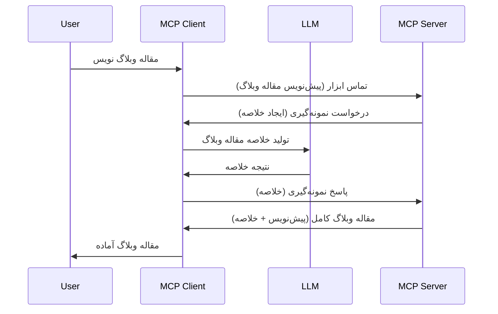

> [منسوخ شده: نامزد انتشار 2026-07-28](https://blog.modelcontextprotocol.io/posts/2026-07-28-release-candidate/)

# نمونه‌گیری - واگذاری ویژگی‌ها به کلاینت

> **اعلان منسوخ شدن:** نامزد انتشار مشخصات MCP نسخه `2026-07-28` نمونه‌گیری را به عنوان منسوخ شده به نفع یکپارچه‌سازی مستقیم با APIهای ارائه‌دهنده LLM علامت می‌دهد. نمونه‌گیری در نسخه `2025-11-25` و حداقل یک سال پس از هر منسوخ شدن رسمی به کار خود ادامه می‌دهد، بنابراین همه مطالب این درس معتبر باقی می‌مانند — اما طراحی‌های جدید سرور باید الگوی جایگزین را ارزیابی کنند. به [چه چیزهایی در MCP تغییر می‌کند: نامزد انتشار 2026-07-28](../../01-CoreConcepts/mcp-2026-07-28-release-candidate.md) مراجعه کنید.

گاهی شما نیاز دارید که کلاینت MCP و سرور MCP همکاری کنند تا به هدف مشترکی برسند. ممکن است موردی باشد که سرور به کمک LLM که روی کلاینت قرار دارد نیاز داشته باشد. برای این وضعیت، نمونه‌گیری همان چیزی است که باید استفاده کنید.

بیایید برخی از موارد استفاده را بررسی کنیم و ببینیم چگونه راه‌حلی شامل نمونه‌گیری بسازیم.

## نمای کلی

در این درس، روی توضیح اینکه چه زمانی و کجا باید نمونه‌گیری را استفاده کرد و چگونه تنظیم کنیم تمرکز می‌کنیم.

## اهداف یادگیری

در این فصل، ما:

- توضیح می‌دهیم نمونه‌گیری چیست و چه زمانی باید از آن استفاده کرد.
- نشان می‌دهیم چگونه نمونه‌گیری را در MCP تنظیم کنیم.
- مثال‌هایی از نمونه‌گیری در عمل ارائه می‌دهیم.

## نمونه‌گیری چیست و چرا از آن استفاده کنیم؟

نمونه‌گیری یک ویژگی پیشرفته است که به شرح زیر عمل می‌کند:



### درخواست نمونه‌گیری

خوب، حالا که یک نمای کلی از یک سناریوی معتبر داریم، بیایید درباره درخواست نمونه‌گیری که سرور به کلاینت می‌فرستد صحبت کنیم. این درخواست می‌تواند به شکل زیر در قالب JSON-RPC باشد:

```json
{
  "jsonrpc": "2.0",
  "id": 1,
  "method": "sampling/createMessage",
  "params": {
    "messages": [
      {
        "role": "user",
        "content": {
          "type": "text",
          "text": "Create a blog post summary of the following blog post: <BLOG POST>"
        }
      }
    ],
    "modelPreferences": {
      "hints": [
        {
          "name": "claude-3-sonnet"
        }
      ],
      "intelligencePriority": 0.8,
      "speedPriority": 0.5
    },
    "systemPrompt": "You are a helpful assistant.",
    "maxTokens": 100
  }
}
```

چند نکته در اینجا قابل توجه است:

- Prompt، زیر content -> text، همان دستورالعملی است که برای LLM ارسال می‌کنیم تا محتوای پست وبلاگ را خلاصه کند.

- **modelPreferences**. این بخش فقط یک ترجیح است، یک توصیه درباره پیکربندی‌ای که باید با LLM استفاده شود. کاربر می‌تواند انتخاب کند که این توصیه‌ها را بپذیرد یا تغییر دهد. در اینجا توصیه‌هایی درباره مدل به کار رفته، سرعت و اولویت هوش وجود دارد.
- **systemPrompt**، این همان فورمت معمول سیستم است که به LLM شخصیت می‌دهد و شامل دستورالعمل‌های راهنمایی است.
- **maxTokens**، این خاصیت دیگری است که بیان می‌کند استفاده از چه تعداد توکن برای این کار توصیه می‌شود.

### پاسخ نمونه‌گیری

این پاسخ همان پیامی است که کلاینت MCP ارسال می‌کند به سرور MCP و نتیجه تماس کلاینت با LLM است، منتظر آن پاسخ می‌ماند و سپس این پیام را می‌سازد. در JSON-RPC به شکل زیر است:

```json
{
  "jsonrpc": "2.0",
  "id": 1,
  "result": {
    "role": "assistant",
    "content": {
      "type": "text",
      "text": "Here's your abstract <ABSTRACT>"
    },
    "model": "gpt-5",
    "stopReason": "endTurn"
  }
}
```

توجه کنید پاسخ خلاصه‌ای از پست وبلاگ است همان‌طور که خواسته بودیم. همچنین توجه کنید که مدل استفاده شده همان مدل درخواست شده نیست بلکه "gpt-5" به جای "claude-3-sonnet" است. این نشان می‌دهد که کاربر می‌تواند نظرش را درباره استفاده از مدل تغییر دهد و درخواست نمونه‌گیری شما یک توصیه است.

خوب، حالا که جریان اصلی را فهمیدیم و یک کار مفید برای استفاده آن "ایجاد پست وبلاگ + خلاصه" است، بیایید ببینیم باید چه کار کنیم تا کار کند.

### انواع پیام‌ها

پیام‌های نمونه‌گیری فقط محدود به متن نیستند بلکه می‌توانید تصویر و صدا هم ارسال کنید. در اینجا JSON-RPC به شکل متفاوتی است:

**متن**

```json
{
  "type": "text",
  "text": "The message content"
}
```

**محتوای تصویر**

```json
{
  "type": "image",
  "data": "base64-encoded-image-data",
  "mimeType": "image/jpeg"
}
```

**محتوای صوتی**

```json
{
  "type": "audio",
  "data": "base64-encoded-audio-data",
  "mimeType": "audio/wav"
}
```

> توجه: برای اطلاعات دقیق‌تر درباره نمونه‌گیری، به [مستندات رسمی](https://modelcontextprotocol.io/specification/2025-11-25/client/sampling) مراجعه کنید.

## چگونه نمونه‌گیری را در کلاینت تنظیم کنیم

> توجه: اگر تنها سرور می‌سازید، نیاز زیادی به انجام کار اینجا ندارید.

در کلاینت باید ویژگی زیر را به این صورت مشخص کنید:

```json
{
  "capabilities": {
    "sampling": {}
  }
}
```

سپس این هنگام راه‌اندازی کلاینت انتخابی شما با سرور، به کار گرفته می‌شود.

## مثال نمونه‌گیری در عمل - ایجاد یک پست وبلاگ

بیایید با هم یک سرور نمونه‌گیری برنامه‌نویسی کنیم، باید کارهای زیر را انجام دهیم:

1. ایجاد ابزاری روی سرور.
1. این ابزار باید درخواست نمونه‌گیری ایجاد کند
1. ابزار باید منتظر پاسخ به درخواست نمونه‌گیری کلاینت بماند.
1. سپس نتیجه ابزار باید تولید شود.

بیایید کد را گام به گام ببینیم:

### -1- ایجاد ابزار

**python**

```python
@mcp.tool()
async def create_blog(title: str, content: str, ctx: Context[ServerSession, None]) -> str:
    """Create a blog post and generate a summary"""

```

### -2- ایجاد درخواست نمونه‌گیری

ابزار خود را با کد زیر گسترش دهید:

**python**

```python
post = BlogPost(
        id=len(posts) + 1,
        title=title,
        content=content,
        abstract=""
    )

prompt = f"Create an abstract of the following blog post: title: {title} and draft: {content} "

result = await ctx.session.create_message(
        messages=[
            SamplingMessage(
                role="user",
                content=TextContent(type="text", text=prompt),
            )
        ],
        max_tokens=100,
)

```

### -3- منتظر پاسخ بمانید و پاسخ را بازگردانید

**python**

```python
post.abstract = result.content.text

posts.append(post)

# بازگرداندن محصول کامل
return json.dumps({
    "id": post.title,
    "abstract": post.abstract
})
```

### -4- کد کامل

**python**

```python
from starlette.applications import Starlette
from starlette.routing import Mount, Host

from mcp.server.fastmcp import Context, FastMCP

from mcp.server.session import ServerSession
from mcp.types import SamplingMessage, TextContent

import json


from uuid import uuid4
from typing import List
from pydantic import BaseModel


mcp = FastMCP("Blog post generator")

# برنامه = FastAPI()

posts = []

class BlogPost(BaseModel):
    id: int
    title: str
    content: str
    abstract: str

posts: List[BlogPost] = []

@mcp.tool()
async def create_blog(title: str, content: str, ctx: Context[ServerSession, None]) -> str:
    """Create a blog post and generate a summary"""

    post = BlogPost(
        id=len(posts) + 1,
        title=title,
        content=content,
        abstract=""
    )

    prompt = f"Create an abstract of the following blog post: title: {title} and draft: {content} "

    result = await ctx.session.create_message(
        messages=[
            SamplingMessage(
                role="user",
                content=TextContent(type="text", text=prompt),
            )
        ],
        max_tokens=100,
    )

    post.abstract = result.content.text

    posts.append(post)

    # بازگرداندن پست کامل بلاگ
    return json.dumps({
        "id": post.title,
        "abstract": post.abstract
    })

if __name__ == "__main__":
    print("Starting server...")
    # mcp اجرا کن()
    mcp.run(transport="streamable-http")

# برنامه را اجرا کن با: python server.py
```

### -5- تست در Visual Studio Code

برای تست این در Visual Studio Code، به شرح زیر عمل کنید:

1. سرور را در ترمینال راه‌اندازی کنید
1. آن را به *mcp.json* اضافه کنید (و اطمینان حاصل کنید که شروع شده است) مثلاً به این شکل:

   ```json
   "servers": {
      "blog-server": {
        "type": "http",
        "url": "http://localhost:8000/mcp"
      }
   }
   ```

1. یک prompt تایپ کنید:

   ```text
   create a blog post named "Where Python comes from", the content is "Python is actually named after Monty Python Flying Circus"
   ```

1. اجازه دهید نمونه‌گیری انجام شود. اولین بار که این را تست می‌کنید، یک دیالوگ اضافی ظاهر می‌شود که باید آن را قبول کنید، سپس دیالوگ معمول می‌آید که از شما می‌خواهد یک ابزار را اجرا کنید

1. نتایج را بررسی کنید. نتایج را هم به شکل زیبا در GitHub Copilot Chat خواهید دید و هم می‌توانید پاسخ خام JSON را بررسی کنید.

**مزیت**. ابزار Visual Studio Code پشتیبانی عالی‌ای از نمونه‌گیری دارد. شما می‌توانید دسترسی نمونه‌گیری را روی سرور نصب شده خود با این روش تنظیم کنید:

1. به بخش افزونه‌ها بروید.
1. آیکون چرخ‌دنده را برای سرور نصب شده در بخش "MCP SERVERS - INSTALLED" انتخاب کنید.
1. گزینه "Configure Model Access" را انتخاب کنید، اینجا می‌توانید تعیین کنید که GitHub Copilot هنگام نمونه‌گیری از کدام مدل‌ها اجازه استفاده دارد. همچنین می‌توانید همه درخواست‌های نمونه‌گیری اخیر را با انتخاب "Show Sampling requests" مشاهده کنید.

## تمرین

در این تمرین، شما نوع کمی متفاوتی از نمونه‌گیری را می‌سازید، یعنی یک یکپارچه‌سازی نمونه‌گیری که از تولید توصیف محصول پشتیبانی می‌کند. این سناریوی شماست:

**سناریو**: کارمند بخش پشت صحنه در یک فروشگاه اینترنتی نیاز به کمک دارد، تولید توصیف محصول زمان زیادی می‌برد. بنابراین، شما باید راه‌حلی بسازید که بتوانید ابزاری به نام "create_product" با آرگومان‌های "title" و "keywords" فراخوانی کنید و این باید کالای کاملی از جمله فیلد "description" تولید کند که متن آن توسط LLM کلاینت ایجاد شود.

نکته: از آموخته‌های پیشین برای ساخت این سرور و ابزار آن با استفاده از درخواست نمونه‌گیری بهره ببرید.

## راه‌حل

[راه‌حل](./solution/README.md)

## نکات کلیدی

نمونه‌گیری ویژگی قدرتمندی است که اجازه می‌دهد سرور وظایف را به کلاینت واگذار کند وقتی که به کمک LLM نیاز دارد.

## بعدی چیست

- [فصل 4 - پیاده‌سازی عملی](../../04-PracticalImplementation/README.md)

---

<!-- CO-OP TRANSLATOR DISCLAIMER START -->
**سلب مسئولیت**:
این سند با استفاده از سرویس ترجمه هوش مصنوعی [Co-op Translator](https://github.com/Azure/co-op-translator) ترجمه شده است. در حالی که ما در تلاش برای دقت هستیم، لطفاً توجه داشته باشید که ترجمه‌های خودکار ممکن است شامل خطاها یا نادرستی‌هایی باشند. سند اصلی به زبان مادری خود باید به عنوان منبع معتبر در نظر گرفته شود. برای اطلاعات حیاتی، ترجمه حرفه‌ای انسانی توصیه می‌شود. ما در قبال هرگونه سوء تفاهم یا برداشت نادرست ناشی از استفاده از این ترجمه مسئولیتی نداریم.
<!-- CO-OP TRANSLATOR DISCLAIMER END -->