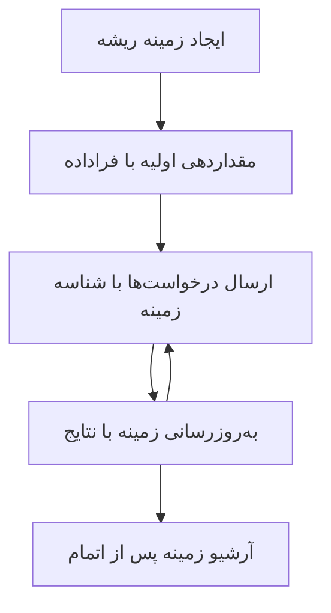

> [منسوخ شده: کاندید انتشار 2026-07-28](https://blog.modelcontextprotocol.io/posts/2026-07-28-release-candidate/#roots-sampling-and-logging-are-deprecated)

# زمینه‌های ریشه MCP

> **اطلاعیه منسوخ شدن:** نسخه کاندید مشخصات MCP با تاریخ 2026-07-28، زمینه‌های ریشه (Roots) را به نفع پارامترهای ابزار، نشانی‌های منابع (URIs) یا پیکربندی سرور منسوخ اعلام می‌کند. زمینه‌های ریشه همچنان در نسخه 2025-11-25 و حداقل یک سال پس از هر اعلام رسمی منسوخ بودن کار می‌کنند، بنابراین همه مطالب این درس معتبر باقی می‌مانند - اما طراحی‌های جدید سرور باید الگوی جایگزین را ارزیابی کنند. بخش «چه چیزهایی در MCP تغییر می‌کند: کاندید انتشار 2026-07-28» را مشاهده کنید. (../../01-CoreConcepts/mcp-2026-07-28-release-candidate.md)

زمینه‌های ریشه یک مفهوم بنیادی در پروتکل مدل زمینه هستند که لایه‌ای پایدار برای حفظ تاریخچه گفتگو و حالت مشترک بین چندین درخواست و نشست فراهم می‌کنند.

## مقدمه

در این درس، خواهیم دید چگونه زمینه‌های ریشه را ایجاد، مدیریت و استفاده کنیم.

## اهداف یادگیری

تا پایان این درس، قادر خواهید بود:

- هدف و ساختار زمینه‌های ریشه را درک کنید
- زمینه‌های ریشه را با استفاده از کتابخانه‌های کلاینت MCP ایجاد و مدیریت کنید
- زمینه‌های ریشه را در برنامه‌های .NET، جاوا، جاوااسکریپت و پایتون پیاده‌سازی کنید
- از زمینه‌های ریشه برای گفتگوهای چندمرحله‌ای و مدیریت حالت استفاده کنید
- بهترین شیوه‌های مدیریت زمینه ریشه را پیاده کنید

## درک زمینه‌های ریشه

زمینه‌های ریشه به عنوان مخازنی عمل می‌کنند که تاریخچه و حالت یک سری تعاملات مرتبط را نگه می‌دارند. آنها امکان موارد زیر را فراهم می‌کنند:

- **پایداری گفتگو**: حفظ گفتگوهای چندمرحله‌ای هماهنگ
- **مدیریت حافظه**: ذخیره و بازیابی اطلاعات در طی تعاملات
- **مدیریت حالت**: پیگیری پیشرفت در گردش‌کارهای پیچیده
- **اشتراک‌گذاری زمینه**: اجازه دسترسی چندین کلاینت به حالت یکسان گفتگو

در MCP، زمینه‌های ریشه خصوصیات کلیدی زیر را دارند:

- هر زمینه ریشه یک شناسه یکتا دارد.
- می‌توانند تاریخچه گفتگو، ترجیحات کاربر و متادیتای دیگر را ذخیره کنند.
- می‌توانند به هنگام نیاز ایجاد، دسترسی یا آرشیو شوند.
- از کنترل دسترسی دقیق و مجوزها پشتیبانی می‌کنند.

## چرخه عمر زمینه ریشه



## کار با زمینه‌های ریشه

در اینجا نمونه‌ای از چگونگی ایجاد و مدیریت زمینه‌های ریشه آورده شده است.

### پیاده‌سازی C#

```csharp
// .NET Example: Root Context Management
using Microsoft.Mcp.Client;
using System;
using System.Threading.Tasks;
using System.Collections.Generic;

public class RootContextExample
{
    private readonly IMcpClient _client;
    private readonly IRootContextManager _contextManager;
    
    public RootContextExample(IMcpClient client, IRootContextManager contextManager)
    {
        _client = client;
        _contextManager = contextManager;
    }
    
    public async Task DemonstrateRootContextAsync()
    {
        // 1. Create a new root context
        var contextResult = await _contextManager.CreateRootContextAsync(new RootContextCreateOptions
        {
            Name = "Customer Support Session",
            Metadata = new Dictionary<string, string>
            {
                ["CustomerName"] = "Acme Corporation",
                ["PriorityLevel"] = "High",
                ["Domain"] = "Cloud Services"
            }
        });
        
        string contextId = contextResult.ContextId;
        Console.WriteLine($"Created root context with ID: {contextId}");
        
        // 2. First interaction using the context
        var response1 = await _client.SendPromptAsync(
            "I'm having issues scaling my web service deployment in the cloud.", 
            new SendPromptOptions { RootContextId = contextId }
        );
        
        Console.WriteLine($"First response: {response1.GeneratedText}");
        
        // Second interaction - the model will have access to the previous conversation
        var response2 = await _client.SendPromptAsync(
            "Yes, we're using containerized deployments with Kubernetes.", 
            new SendPromptOptions { RootContextId = contextId }
        );
        
        Console.WriteLine($"Second response: {response2.GeneratedText}");
        
        // 3. Add metadata to the context based on conversation
        await _contextManager.UpdateContextMetadataAsync(contextId, new Dictionary<string, string>
        {
            ["TechnicalEnvironment"] = "Kubernetes",
            ["IssueType"] = "Scaling"
        });
        
        // 4. Get context information
        var contextInfo = await _contextManager.GetRootContextInfoAsync(contextId);
        
        Console.WriteLine("Context Information:");
        Console.WriteLine($"- Name: {contextInfo.Name}");
        Console.WriteLine($"- Created: {contextInfo.CreatedAt}");
        Console.WriteLine($"- Messages: {contextInfo.MessageCount}");
        
        // 5. When the conversation is complete, archive the context
        await _contextManager.ArchiveRootContextAsync(contextId);
        Console.WriteLine($"Archived context {contextId}");
    }
}
```

در کد بالا ما:

1. یک زمینه ریشه برای جلسه پشتیبانی مشتری ایجاد کردیم.
1. چند پیام در داخل همان زمینه ارسال کردیم تا مدل بتواند حالت را حفظ کند.
1. زمینه را با متادیتای مرتبط بر اساس گفتگو به‌روزرسانی کردیم.
1. اطلاعات زمینه را برای درک تاریخچه گفتگو بازیابی کردیم.
1. زمانی که گفتگو به پایان رسید، زمینه را آرشیو کردیم.

## مثال: پیاده‌سازی زمینه ریشه برای تحلیل مالی

در این مثال، زمینه ریشه‌ای برای جلسه تحلیل مالی ایجاد می‌کنیم تا نشان دهیم چگونه حالت را در طول چند تعامل حفظ کنیم.

### پیاده‌سازی جاوا

```java
// مثال جاوا: پیاده‌سازی زمینه ریشه
package com.example.mcp.contexts;

import com.mcp.client.McpClient;
import com.mcp.client.ContextManager;
import com.mcp.models.RootContext;
import com.mcp.models.McpResponse;

import java.util.HashMap;
import java.util.Map;
import java.util.UUID;

public class RootContextsDemo {
    private final McpClient client;
    private final ContextManager contextManager;
    
    public RootContextsDemo(String serverUrl) {
        this.client = new McpClient.Builder()
            .setServerUrl(serverUrl)
            .build();
            
        this.contextManager = new ContextManager(client);
    }
    
    public void demonstrateRootContext() throws Exception {
        // ایجاد فراداده زمینه
        Map<String, String> metadata = new HashMap<>();
        metadata.put("projectName", "Financial Analysis");
        metadata.put("userRole", "Financial Analyst");
        metadata.put("dataSource", "Q1 2025 Financial Reports");
        
        // ۱. ایجاد زمینه ریشه جدید
        RootContext context = contextManager.createRootContext("Financial Analysis Session", metadata);
        String contextId = context.getId();
        
        System.out.println("Created context: " + contextId);
        
        // ۲. اولین تعامل
        McpResponse response1 = client.sendPrompt(
            "Analyze the trends in Q1 financial data for our technology division",
            contextId
        );
        
        System.out.println("First response: " + response1.getGeneratedText());
        
        // ۳. به‌روزرسانی زمینه با اطلاعات مهم به‌دست آمده از پاسخ
        contextManager.addContextMetadata(contextId, 
            Map.of("identifiedTrend", "Increasing cloud infrastructure costs"));
        
        // تعامل دوم - استفاده از همان زمینه
        McpResponse response2 = client.sendPrompt(
            "What's driving the increase in cloud infrastructure costs?",
            contextId
        );
        
        System.out.println("Second response: " + response2.getGeneratedText());
        
        // ۴. تولید خلاصه‌ای از جلسه تحلیل
        McpResponse summaryResponse = client.sendPrompt(
            "Summarize our analysis of the technology division financials in 3-5 key points",
            contextId
        );
        
        // ذخیره خلاصه در فراداده زمینه
        contextManager.addContextMetadata(contextId, 
            Map.of("analysisSummary", summaryResponse.getGeneratedText()));
            
        // گرفتن اطلاعات به‌روزرسانی شده زمینه
        RootContext updatedContext = contextManager.getRootContext(contextId);
        
        System.out.println("Context Information:");
        System.out.println("- Created: " + updatedContext.getCreatedAt());
        System.out.println("- Last Updated: " + updatedContext.getLastUpdatedAt());
        System.out.println("- Analysis Summary: " + 
            updatedContext.getMetadata().get("analysisSummary"));
            
        // ۵. آرشیو کردن زمینه پس از اتمام
        contextManager.archiveContext(contextId);
        System.out.println("Context archived");
    }
}
```

در کد بالا ما:

1. یک زمینه ریشه برای جلسه تحلیل مالی ایجاد کردیم.
2. چند پیام در داخل همان زمینه ارسال کردیم تا مدل بتواند حالت را حفظ کند.
3. زمینه را با متادیتای مرتبط به‌روزرسانی کردیم.
4. خلاصه‌ای از جلسه تحلیل ایجاد و در متادیتای زمینه ذخیره کردیم.
5. زمانی که گفتگو کامل شد، زمینه را آرشیو کردیم.

## مثال: مدیریت زمینه ریشه

مدیریت موثر زمینه‌های ریشه برای حفظ تاریخچه و حالت گفتگو اهمیت دارد. در ادامه نمونه‌ای از پیاده‌سازی مدیریت زمینه ریشه آورده شده است.

### پیاده‌سازی جاوااسکریپت

```javascript
// مثال جاوااسکریپت: مدیریت زمینه‌های ریشه MCP
const { McpClient, RootContextManager } = require('@mcp/client');

class ContextSession {
  constructor(serverUrl, apiKey = null) {
    // مقداردهی اولیه کلاینت MCP
    this.client = new McpClient({
      serverUrl,
      apiKey
    });
    
    // مقداردهی اولیه مدیر زمینه
    this.contextManager = new RootContextManager(this.client);
  }
  
  /**
   * Create a new conversation context
   * @param {string} sessionName - Name of the conversation session
   * @param {Object} metadata - Additional metadata for the context
   * @returns {Promise<string>} - Context ID
   */
  async createConversationContext(sessionName, metadata = {}) {
    try {
      const contextResult = await this.contextManager.createRootContext({
        name: sessionName,
        metadata: {
          ...metadata,
          createdAt: new Date().toISOString(),
          status: 'active'
        }
      });
      
      console.log(`Created root context '${sessionName}' with ID: ${contextResult.id}`);
      return contextResult.id;
    } catch (error) {
      console.error('Error creating root context:', error);
      throw error;
    }
  }
  
  /**
   * Send a message in an existing context
   * @param {string} contextId - The root context ID
   * @param {string} message - The user's message
   * @param {Object} options - Additional options
   * @returns {Promise<Object>} - Response data
   */
  async sendMessage(contextId, message, options = {}) {
    try {
      // ارسال پیام با استفاده از زمینه مشخص شده
      const response = await this.client.sendPrompt(message, {
        rootContextId: contextId,
        temperature: options.temperature || 0.7,
        allowedTools: options.allowedTools || []
      });
      
      // به صورت اختیاری، ذخیره‌ی نکات مهم از گفتگو
      if (options.storeInsights) {
        await this.storeConversationInsights(contextId, message, response.generatedText);
      }
      
      return {
        message: response.generatedText,
        toolCalls: response.toolCalls || [],
        contextId
      };
    } catch (error) {
      console.error(`Error sending message in context ${contextId}:`, error);
      throw error;
    }
  }
  
  /**
   * Store important insights from a conversation
   * @param {string} contextId - The root context ID
   * @param {string} userMessage - User's message
   * @param {string} aiResponse - AI's response
   */
  async storeConversationInsights(contextId, userMessage, aiResponse) {
    try {
      // استخراج نکات بالقوه (در یک برنامه واقعی، این کار پیشرفته‌تر است)
      const combinedText = userMessage + "\n" + aiResponse;
      
      // قاعده ساده برای شناسایی نکات بالقوه
      const insightWords = ["important", "key point", "remember", "significant", "crucial"];
      
      const potentialInsights = combinedText
        .split(".")
        .filter(sentence => 
          insightWords.some(word => sentence.toLowerCase().includes(word))
        )
        .map(sentence => sentence.trim())
        .filter(sentence => sentence.length > 10);
      
      // ذخیره نکات در فراداده‌ی زمینه
      if (potentialInsights.length > 0) {
        const insights = {};
        potentialInsights.forEach((insight, index) => {
          insights[`insight_${Date.now()}_${index}`] = insight;
        });
        
        await this.contextManager.updateContextMetadata(contextId, insights);
        console.log(`Stored ${potentialInsights.length} insights in context ${contextId}`);
      }
    } catch (error) {
      console.warn('Error storing conversation insights:', error);
      // خطای غیر بحرانی، پس فقط ثبت هشدار
    }
  }
  
  /**
   * Get summary information about a context
   * @param {string} contextId - The root context ID
   * @returns {Promise<Object>} - Context information
   */
  async getContextInfo(contextId) {
    try {
      const contextInfo = await this.contextManager.getContextInfo(contextId);
      
      return {
        id: contextInfo.id,
        name: contextInfo.name,
        created: new Date(contextInfo.createdAt).toLocaleString(),
        lastUpdated: new Date(contextInfo.lastUpdatedAt).toLocaleString(),
        messageCount: contextInfo.messageCount,
        metadata: contextInfo.metadata,
        status: contextInfo.status
      };
    } catch (error) {
      console.error(`Error getting context info for ${contextId}:`, error);
      throw error;
    }
  }
  
  /**
   * Generate a summary of the conversation in a context
   * @param {string} contextId - The root context ID
   * @returns {Promise<string>} - Generated summary
   */
  async generateContextSummary(contextId) {
    try {
      // درخواست از مدل برای تولید خلاصه گفتگو تا کنون
      const response = await this.client.sendPrompt(
        "Please summarize our conversation so far in 3-4 sentences, highlighting the main points discussed.",
        { rootContextId: contextId, temperature: 0.3 }
      );
      
      // ذخیره خلاصه در فراداده‌ی زمینه
      await this.contextManager.updateContextMetadata(contextId, {
        conversationSummary: response.generatedText,
        summarizedAt: new Date().toISOString()
      });
      
      return response.generatedText;
    } catch (error) {
      console.error(`Error generating context summary for ${contextId}:`, error);
      throw error;
    }
  }
  
  /**
   * Archive a context when it's no longer needed
   * @param {string} contextId - The root context ID
   * @returns {Promise<Object>} - Result of the archive operation
   */
  async archiveContext(contextId) {
    try {
      // تولید خلاصه نهایی پیش از بایگانی
      const summary = await this.generateContextSummary(contextId);
      
      // بایگانی زمینه
      await this.contextManager.archiveContext(contextId);
      
      return {
        status: "archived",
        contextId,
        summary
      };
    } catch (error) {
      console.error(`Error archiving context ${contextId}:`, error);
      throw error;
    }
  }
}

// مثال استفاده
async function demonstrateContextSession() {
  const session = new ContextSession('https://mcp-server-example.com');
  
  try {
    // ۱. ایجاد زمینه جدید برای گفتگوی پشتیبانی محصول
    const contextId = await session.createConversationContext(
      'Product Support - Database Performance',
      {
        customer: 'Globex Corporation',
        product: 'Enterprise Database',
        severity: 'Medium',
        supportAgent: 'AI Assistant'
      }
    );
    
    // ۲. پیام اول در گفتگو
    const response1 = await session.sendMessage(
      contextId,
      "I'm experiencing slow query performance on our database cluster after the latest update.",
      { storeInsights: true }
    );
    console.log('Response 1:', response1.message);
    
    // پیام پیگیری در همان زمینه
    const response2 = await session.sendMessage(
      contextId,
      "Yes, we've already checked the indexes and they seem to be properly configured.",
      { storeInsights: true }
    );
    console.log('Response 2:', response2.message);
    
    // ۳. دریافت اطلاعات درباره زمینه
    const contextInfo = await session.getContextInfo(contextId);
    console.log('Context Information:', contextInfo);
    
    // ۴. تولید و نمایش خلاصه گفتگو
    const summary = await session.generateContextSummary(contextId);
    console.log('Conversation Summary:', summary);
    
    // ۵. بایگانی زمینه زمانی که کار تمام شد
    const archiveResult = await session.archiveContext(contextId);
    console.log('Archive Result:', archiveResult);
    
    // ۶. مدیریت خطاها به صورت آرام و بدون مشکل
  } catch (error) {
    console.error('Error in context session demonstration:', error);
  }
}

demonstrateContextSession();
```

در کد بالا ما:

1. زمینه ریشه‌ای برای گفتگو پشتیبانی محصول با تابع `createConversationContext` ایجاد کردیم. در این مورد، زمینه درباره مسائل عملکرد دیتابیس است.

1. چند پیام در زمینه ارسال کردیم تا مدل بتواند حالت را با تابع `sendMessage` حفظ کند. پیام‌ها درباره عملکرد کند کوئری و پیکربندی ایندکس هستند.

1. زمینه را با متادیتای مرتبط بر اساس گفتگو به‌روزرسانی کردیم.

1. خلاصه‌ای از گفتگو تولید کرده و در متادیتای زمینه به‌وسیله تابع `generateContextSummary` ذخیره کردیم.

1. هنگام اتمام گفتگو، زمینه را با تابع `archiveContext` آرشیو کردیم.

1. خطاها را به‌صورت قابل اعتماد مدیریت کردیم.

## زمینه ریشه برای کمک چندمرحله‌ای

در این مثال، زمینه ریشه‌ای برای یک جلسه کمک چندمرحله‌ای ایجاد می‌کنیم تا نشان دهیم چگونه حالت را در چند تعامل حفظ کنیم.

### پیاده‌سازی پایتون

```python
# نمونه پایتون: زمینه اصلی برای کمک چندمرحله‌ای
import asyncio
from datetime import datetime
from mcp_client import McpClient, RootContextManager

class AssistantSession:
    def __init__(self, server_url, api_key=None):
        self.client = McpClient(server_url=server_url, api_key=api_key)
        self.context_manager = RootContextManager(self.client)
    
    async def create_session(self, name, user_info=None):
        """Create a new root context for an assistant session"""
        metadata = {
            "session_type": "assistant",
            "created_at": datetime.now().isoformat(),
        }
        
        # افزودن اطلاعات کاربر در صورت ارائه
        if user_info:
            metadata.update({f"user_{k}": v for k, v in user_info.items()})
            
        # ایجاد زمینه ریشه
        context = await self.context_manager.create_root_context(name, metadata)
        return context.id
    
    async def send_message(self, context_id, message, tools=None):
        """Send a message within a root context"""
        # ایجاد گزینه‌ها با شناسه زمینه
        options = {
            "root_context_id": context_id
        }
        
        # افزودن ابزارها در صورت مشخص شدن
        if tools:
            options["allowed_tools"] = tools
        
        # ارسال درخواست درون زمینه
        response = await self.client.send_prompt(message, options)
        
        # به‌روزرسانی متادیتای زمینه با پیشرفت گفتگو
        await self.context_manager.update_context_metadata(
            context_id,
            {
                f"message_{datetime.now().timestamp()}": message[:50] + "...",
                "last_interaction": datetime.now().isoformat()
            }
        )
        
        return response
    
    async def get_conversation_history(self, context_id):
        """Retrieve conversation history from a context"""
        context_info = await self.context_manager.get_context_info(context_id)
        messages = await self.client.get_context_messages(context_id)
        
        return {
            "context_info": context_info,
            "messages": messages
        }
    
    async def end_session(self, context_id):
        """End an assistant session by archiving the context"""
        # ابتدا یک درخواست خلاصه تولید کن
        summary_response = await self.client.send_prompt(
            "Please summarize our conversation and any key points or decisions made.",
            {"root_context_id": context_id}
        )
        
        # ذخیره خلاصه در متادیتا
        await self.context_manager.update_context_metadata(
            context_id,
            {
                "summary": summary_response.generated_text,
                "ended_at": datetime.now().isoformat(),
                "status": "completed"
            }
        )
        
        # آرشیو کردن زمینه
        await self.context_manager.archive_context(context_id)
        
        return {
            "status": "completed",
            "summary": summary_response.generated_text
        }

# نمونه استفاده
async def demo_assistant_session():
    assistant = AssistantSession("https://mcp-server-example.com")
    
    # ۱. ایجاد جلسه
    context_id = await assistant.create_session(
        "Technical Support Session",
        {"name": "Alex", "technical_level": "advanced", "product": "Cloud Services"}
    )
    print(f"Created session with context ID: {context_id}")
    
    # ۲. تعامل اول
    response1 = await assistant.send_message(
        context_id, 
        "I'm having trouble with the auto-scaling feature in your cloud platform.",
        ["documentation_search", "diagnostic_tool"]
    )
    print(f"Response 1: {response1.generated_text}")
    
    # تعامل دوم در همان زمینه
    response2 = await assistant.send_message(
        context_id,
        "Yes, I've already checked the configuration settings you mentioned, but it's still not working."
    )
    print(f"Response 2: {response2.generated_text}")
    
    # ۳. دریافت تاریخچه
    history = await assistant.get_conversation_history(context_id)
    print(f"Session has {len(history['messages'])} messages")
    
    # ۴. پایان جلسه
    end_result = await assistant.end_session(context_id)
    print(f"Session ended with summary: {end_result['summary']}")

if __name__ == "__main__":
    asyncio.run(demo_assistant_session())
```

در کد بالا ما:

1. با تابع `create_session` زمینه ریشه‌ای برای جلسه پشتیبانی فنی ایجاد کردیم. زمینه شامل اطلاعات کاربر از جمله نام و سطح فنی است.

1. چند پیام در همان زمینه ارسال کردیم تا مدل بتواند حالت را با تابع `send_message` حفظ کند. پیام‌ها درباره مشکلات ویژگی مقیاس‌بندی خودکار هستند.

1. با تابع `get_conversation_history` تاریخچه گفتگو را بازیابی کردیم که اطلاعات زمینه و پیام‌ها را ارائه می‌دهد.

1. جلسه را با آرشیو کردن زمینه و تولید خلاصه با تابع `end_session` پایان دادیم. خلاصه نکات کلیدی گفتگو را ثبت می‌کند.

## بهترین شیوه‌های زمینه ریشه

در اینجا برخی از بهترین شیوه‌ها برای مدیریت موثر زمینه‌های ریشه آورده شده است:

- **ایجاد زمینه‌های متمرکز**: برای اهداف یا حوزه‌های مختلف گفتگو، زمینه‌های ریشه جداگانه ایجاد کنید تا وضوح حفظ شود.

- **تعیین سیاست‌های انقضا**: سیاست‌هایی برای آرشیو یا حذف زمینه‌های قدیمی جهت مدیریت ذخیره‌سازی و انطباق با سیاست‌های نگهداری داده‌ها اجرا کنید.

- **ذخیره متادیتای مرتبط**: از متادیتای زمینه برای ذخیره اطلاعات مهم درباره گفتگو استفاده کنید که ممکن است بعدا مفید باشد.

- **استفاده مداوم از شناسه‌های زمینه**: پس از ایجاد زمینه، شناسه آن را به طور مداوم برای همه درخواست‌های مرتبط استفاده کنید تا پیوستگی حفظ شود.

- **تولید خلاصه‌ها**: زمانی که زمینه بزرگ می‌شود، خلاصه‌هایی تولید کنید تا اطلاعات ضروری ثبت و مدیریت اندازه زمینه ممکن شود.

- **پیاده‌سازی کنترل دسترسی**: برای سیستم‌های چندکاربره، کنترل دسترسی مناسب را اجرا کنید تا حریم خصوصی و امنیت زمینه‌های گفتگو حفظ شود.

- **مدیریت محدودیت‌های زمینه**: از محدودیت‌های اندازه زمینه آگاه باشید و راهکارهایی برای مدیریت گفتگوهای بسیار طولانی پیاده کنید.

- **آرشیو هنگام اتمام**: زمانی که گفتگو کامل شد، زمینه‌ها را آرشیو کنید تا منابع آزاد و تاریخچه گفتگو حفظ شود.

## ادامه مطلب

- [5.5 مسیریابی](../mcp-routing/README.md)

---

<!-- CO-OP TRANSLATOR DISCLAIMER START -->
**سلب مسئولیت**:
این سند با استفاده از سرویس ترجمه هوش مصنوعی [Co-op Translator](https://github.com/Azure/co-op-translator) ترجمه شده است. در حالی که ما در تلاش برای دقت هستیم، لطفاً توجه داشته باشید که ترجمه‌های خودکار ممکن است شامل خطاها یا نادرستی‌هایی باشند. سند اصلی به زبان مادری خود باید به عنوان منبع معتبر در نظر گرفته شود. برای اطلاعات حیاتی، ترجمه حرفه‌ای انسانی توصیه می‌شود. ما در قبال هرگونه سوء تفاهم یا برداشت نادرست ناشی از استفاده از این ترجمه مسئولیتی نداریم.
<!-- CO-OP TRANSLATOR DISCLAIMER END -->