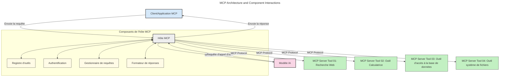
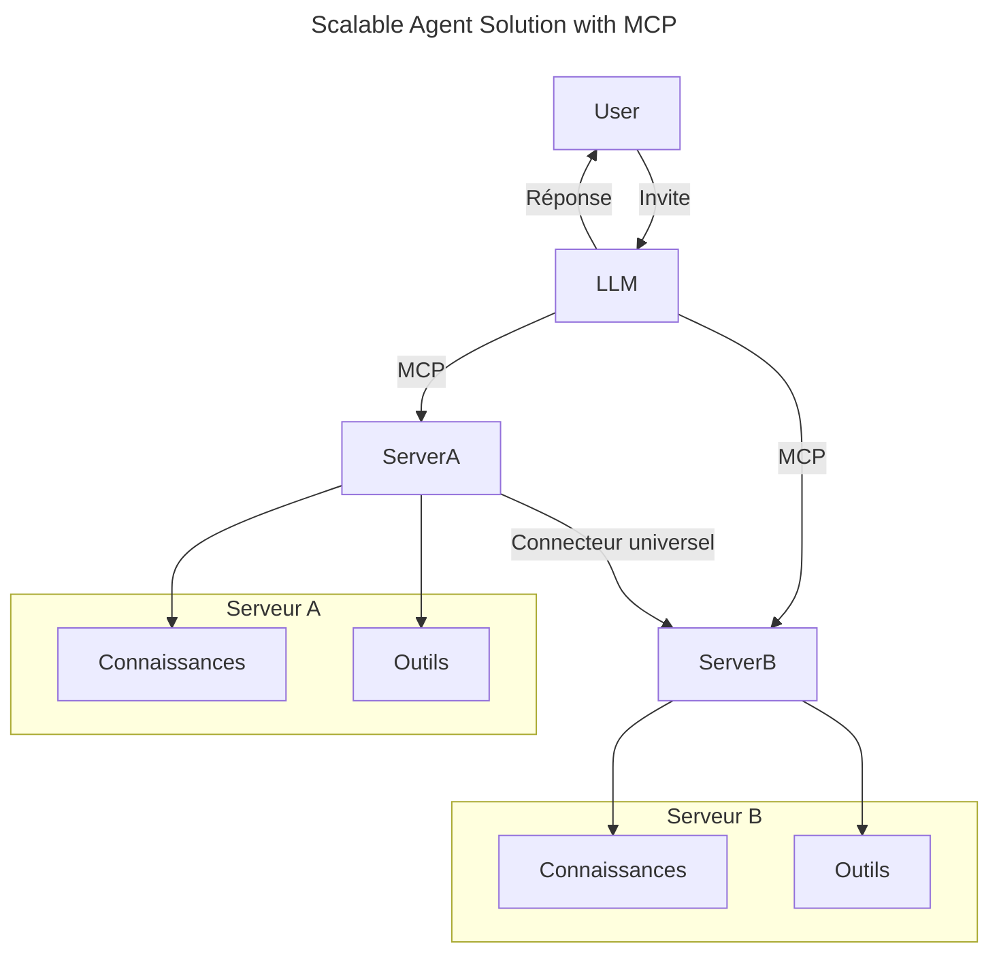
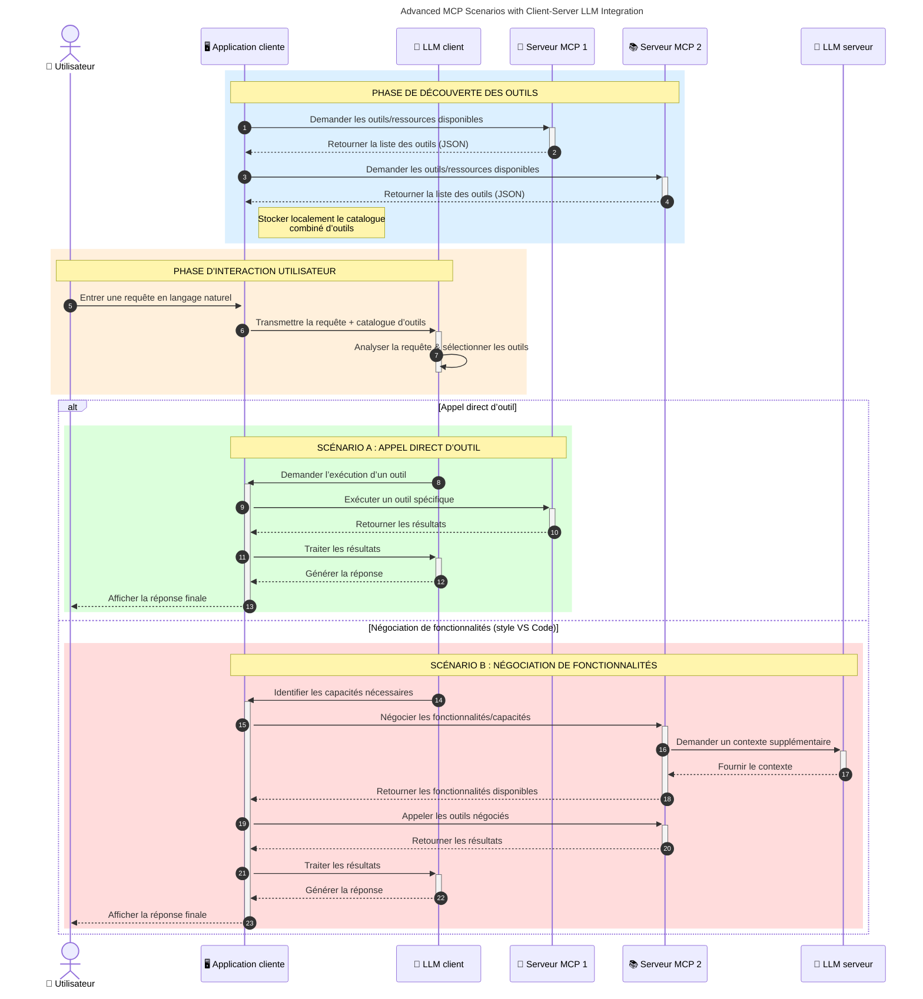

# Introduction au Model Context Protocol (MCP) : Pourquoi c'est important pour les applications d'IA évolutives

_(Cliquez sur l'image ci-dessus pour regarder la vidéo de cette leçon)_

Les applications d'IA générative représentent un grand pas en avant car elles permettent souvent à l'utilisateur d'interagir avec l'application via des invites en langage naturel. Cependant, à mesure que plus de temps et de ressources sont investis dans ces applications, il est important de s'assurer que vous pouvez facilement intégrer des fonctionnalités et des ressources de manière à faciliter l'extension, que votre application puisse gérer l'utilisation de plusieurs modèles, et gérer diverses subtilités des modèles. En bref, construire des applications d'IA générative est simple au début, mais à mesure qu'elles grandissent et deviennent plus complexes, vous devez commencer à définir une architecture et vous aurez probablement besoin de vous appuyer sur une norme pour garantir une construction cohérente de vos applications. C’est là qu’intervient le MCP pour organiser les choses et fournir une norme.

---

## **🔍 Qu'est-ce que le Model Context Protocol (MCP) ?**

Le **Model Context Protocol (MCP)** est une **interface ouverte et standardisée** qui permet aux grands modèles de langage (LLM) d'interagir de manière fluide avec des outils externes, des API et des sources de données. Il fournit une architecture cohérente pour améliorer la fonctionnalité des modèles d'IA au-delà de leurs données d'entraînement, permettant des systèmes d'IA plus intelligents, évolutifs et réactifs.

---

## **🎯 Pourquoi la standardisation est importante en IA**

Au fur et à mesure que les applications d'IA générative deviennent plus complexes, il est essentiel d'adopter des normes qui garantissent **l'évolutivité, l'extensibilité, la maintenabilité** et **l'évitement de l'enfermement propriétaire**. Le MCP répond à ces besoins en :

- Unifiant les intégrations modèle-outil
- Réduisant les solutions personnalisées fragiles et uniques
- Permettant à plusieurs modèles de différents fournisseurs de coexister au sein d'un même écosystème

**Note :** Bien que le MCP se présente comme une norme ouverte, il n'y a pas de plans visant à standardiser le MCP par le biais de corps de normalisation existants tels que IEEE, IETF, W3C, ISO ou tout autre organisme de normalisation.

---

## **📚 Objectifs d'apprentissage**

À la fin de cet article, vous serez capable de :

- Définir le **Model Context Protocol (MCP)** et ses cas d’usage
- Comprendre comment le MCP standardise la communication modèle-outil
- Identifier les composants clés de l’architecture MCP
- Explorer des applications réelles du MCP dans des contextes d’entreprise et de développement

---

## **💡 Pourquoi le Model Context Protocol (MCP) change la donne**

### **🔗 Le MCP résout la fragmentation dans les interactions en IA**

Avant le MCP, intégrer des modèles avec des outils nécessitait :

- Du code personnalisé par paire outil-modèle
- Des API non standard pour chaque fournisseur
- Des interruptions fréquentes dues aux mises à jour
- Une mauvaise évolutivité avec plus d’outils

### **✅ Avantages de la standardisation MCP**

| **Avantage**             | **Description**                                                                |
|--------------------------|--------------------------------------------------------------------------------|
| Interopérabilité         | Les LLM fonctionnent sans accrocs avec des outils de différents fournisseurs  |
| Cohérence                | Comportement uniforme sur plateformes et outils                              |
| Réutilisabilité          | Des outils créés une fois peuvent être utilisés dans plusieurs projets et systèmes |
| Développement accéléré   | Réduction du temps de développement grâce à des interfaces standardisées plug-and-play |

---

## **🧱 Vue d'ensemble de l'architecture MCP**

MCP suit un **modèle client-serveur**, où :

- **Les hôtes MCP** exécutent les modèles d'IA
- **Les clients MCP** initient les requêtes
- **Les serveurs MCP** fournissent contexte, outils et capacités

### **Composants clés :**

- **Ressources** – Données statiques ou dynamiques pour les modèles  
- **Prompts** – Flux de travail prédéfinis pour une génération guidée  
- **Outils** – Fonctions exécutables comme la recherche, les calculs  
- **Échantillonnage** – Comportement agentique via les interactions récursives (déprécié dans la version candidate `2026-07-28`)
- **Élicitation** – Requêtes initiées par le serveur pour obtenir les entrées utilisateur
- **Racines** – Limites du système de fichiers pour le contrôle d’accès serveur (déprécié dans la version candidate `2026-07-28`)

### **Architecture du protocole :**

MCP utilise une architecture à deux couches :
- **Couche de données** : Communication basée sur JSON-RPC 2.0 avec gestion du cycle de vie et primitives
- **Couche de transport** : STDIO (local) et HTTP streaming avec SSE (communication distante)

---

## Fonctionnement des serveurs MCP

Les serveurs MCP fonctionnent de la manière suivante :

- **Flux de la requête** :
    1. Une requête est initiée par un utilisateur final ou un logiciel agissant en son nom.
    2. Le **client MCP** envoie la requête à un **hôte MCP**, qui gère le runtime du modèle d’IA.
    3. Le **modèle d’IA** reçoit la requête utilisateur et peut demander l’accès à des outils externes ou des données via un ou plusieurs appels d'outils.
    4. L’**hôte MCP**, et non le modèle directement, communique avec les **serveurs MCP** appropriés via le protocole standardisé.
- **Fonctionnalités de l’hôte MCP** :
    - **Registre des outils** : Maintient un catalogue des outils disponibles et leurs capacités.
    - **Authentification** : Vérifie les autorisations d’accès aux outils.
    - **Gestionnaire de requêtes** : Traite les requêtes d’outils entrantes provenant du modèle.
    - **Formateur de réponses** : Structure les résultats des outils dans un format compréhensible par le modèle.
- **Exécution côté serveur MCP** :
    - L’**hôte MCP** redirige les appels d'outils vers un ou plusieurs **serveurs MCP**, chacun exposant des fonctions spécialisées (ex. recherche, calculs, requêtes base de données).
    - Les **serveurs MCP** effectuent leurs opérations respectives et retournent les résultats à l’**hôte MCP** dans un format cohérent.
    - L’**hôte MCP** formate et transmet ces résultats au **modèle d’IA**.
- **Finalisation de la réponse** :
    - Le **modèle d’IA** intègre les résultats des outils dans une réponse finale.
    - L’**hôte MCP** renvoie cette réponse au **client MCP**, qui la transmet à l’utilisateur final ou logiciel appelant.
    

## 👨‍💻 Comment construire un serveur MCP (avec exemples)

Les serveurs MCP vous permettent d’étendre les capacités des LLM en fournissant données et fonctionnalités.

Prêt à essayer ? Voici des SDK spécifiques aux langages et/ou stacks avec des exemples de création de serveurs MCP simples dans différents langages/stacks :

- **SDK Python** : https://github.com/modelcontextprotocol/python-sdk

- **SDK TypeScript** : https://github.com/modelcontextprotocol/typescript-sdk

- **SDK Java** : https://github.com/modelcontextprotocol/java-sdk

- **SDK C#/.NET** : https://github.com/modelcontextprotocol/csharp-sdk

## 🌍 Cas d’utilisation réels pour MCP

Le MCP permet une large gamme d’applications en étendant les capacités de l’IA :

| **Application**              | **Description**                                                                |
|------------------------------|--------------------------------------------------------------------------------|
| Intégration de données d’entreprise | Connecter les LLM à des bases de données, CRM ou outils internes             |
| Systèmes IA agentiques       | Permettre à des agents autonomes d’accéder aux outils et de gérer les workflows décisionnels |
| Applications multimodales    | Combiner outils texte, image et audio au sein d’une application IA unifiée    |
| Intégration de données en temps réel | Apporter des données en direct dans les interactions IA pour des résultats plus précis et actualisés |

### 🧠 MCP = norme universelle pour les interactions IA

Le Model Context Protocol (MCP) agit comme une norme universelle pour les interactions IA, tout comme l’USB-C a standardisé les connexions physiques pour les appareils. Dans le monde de l’IA, le MCP fournit une interface cohérente, permettant aux modèles (clients) d’intégrer sans couture des outils externes et fournisseurs de données (serveurs). Cela élimine le besoin de protocoles divers et personnalisés pour chaque API ou source de données.

Sous MCP, un outil compatible MCP (appelé serveur MCP) suit une norme unifiée. Ces serveurs peuvent lister les outils ou actions offerts et exécuter ces actions lorsqu’elles sont demandées par un agent IA. Les plateformes d’agents IA supportant MCP peuvent découvrir les outils disponibles sur les serveurs et les invoquer via ce protocole standard.

### 💡 Facilite l’accès au savoir

Au-delà de proposer des outils, MCP facilite aussi l’accès au savoir. Il permet aux applications de fournir du contexte aux grands modèles de langage (LLM) en les reliant à diverses sources de données. Par exemple, un serveur MCP peut représenter un dépôt de documents d’une entreprise, permettant aux agents de récupérer des informations pertinentes à la demande. Un autre serveur peut gérer des actions spécifiques comme l’envoi d’emails ou la mise à jour d’enregistrements. Du point de vue de l’agent, ce sont simplement des outils qu’il peut utiliser — certains outils renvoient des données (contexte de connaissance), d’autres effectuent des actions. Le MCP gère les deux efficacement.

Un agent se connectant à un serveur MCP apprend automatiquement les capacités disponibles du serveur et les données accessibles via un format standard. Cette standardisation permet une disponibilité dynamique des outils. Par exemple, ajouter un nouveau serveur MCP au système d’un agent rend ses fonctions immédiatement utilisables sans customization supplémentaire des instructions de l’agent.

Cette intégration simplifiée correspond au schéma illustré dans le diagramme suivant, où les serveurs fournissent à la fois outils et savoir, garantissant une collaboration fluide entre systèmes.

### 👉 Exemple : Solution agent scalable

Le Connecteur Universel permet aux serveurs MCP de communiquer et de partager leurs capacités entre eux, permettant à ServerA de déléguer des tâches à ServerB ou d’accéder à ses outils et connaissances. Cela fédère outils et données à travers les serveurs, supportant des architectures d’agents scalables et modulaires. Parce que MCP standardise l’exposition des outils, les agents peuvent découvrir dynamiquement et rediriger les requêtes entre les serveurs sans intégrations codées en dur.

Fédération des outils et connaissances : outils et données sont accessibles à travers les serveurs, permettant des architectures d'agents plus scalables et modulaires.

### 🔄 Scénarios avancés MCP avec intégration LLM côté client

Au-delà de l’architecture de base MCP, il existe des scénarios avancés où client et serveur contiennent des LLM, permettant des interactions plus sophistiquées. Dans le diagramme suivant, **Client App** pourrait être un IDE avec plusieurs outils MCP disponibles pour l’utilisation par le LLM :

## 🔐 Avantages pratiques du MCP

Voici les avantages pratiques de l’utilisation du MCP :

- **Fraîcheur** : Les modèles peuvent accéder à des informations à jour au-delà de leurs données d'entraînement
- **Extension des capacités** : Les modèles peuvent exploiter des outils spécialisés pour des tâches pour lesquelles ils n’ont pas été entraînés
- **Réduction des hallucinations** : Les sources de données externes fournissent un ancrage factuel
- **Confidentialité** : Les données sensibles restent dans des environnements sécurisés au lieu d’être intégrées dans les invites

## 📌 Points clés à retenir

Voici les points clés à retenir pour l'utilisation du MCP :

- Le **MCP** standardise la manière dont les modèles d’IA interagissent avec les outils et les données
- Favorise **l’extensibilité, la cohérence et l’interopérabilité**
- Le MCP aide à **réduire le temps de développement, améliorer la fiabilité et étendre les capacités des modèles**
- L’architecture client-serveur **permet des applications d’IA flexibles et extensibles**

## 🧠 Exercice

Réfléchissez à une application IA que vous souhaitez construire.

- Quels **outils externes ou données** pourraient améliorer ses capacités ?
- Comment le MCP pourrait-il rendre l’intégration **plus simple et plus fiable ?**

## Ressources supplémentaires

- [Dépôt GitHub MCP](https://github.com/modelcontextprotocol)

## Ce qui suit

Suivant : [Chapitre 1 : Concepts fondamentaux](../01-CoreConcepts/README.md)

---

<!-- CO-OP TRANSLATOR DISCLAIMER START -->
**Avertissement** :
Ce document a été traduit à l'aide du service de traduction automatique [Co-op Translator](https://github.com/Azure/co-op-translator). Bien que nous nous efforçions d'assurer l'exactitude, veuillez noter que les traductions automatisées peuvent contenir des erreurs ou des inexactitudes. Le document original dans sa langue native doit être considéré comme la source faisant autorité. Pour les informations critiques, il est recommandé de recourir à une traduction professionnelle réalisée par un humain. Nous ne saurions être tenus responsables des malentendus ou erreurs d'interprétation découlant de l'utilisation de cette traduction.
<!-- CO-OP TRANSLATOR DISCLAIMER END -->