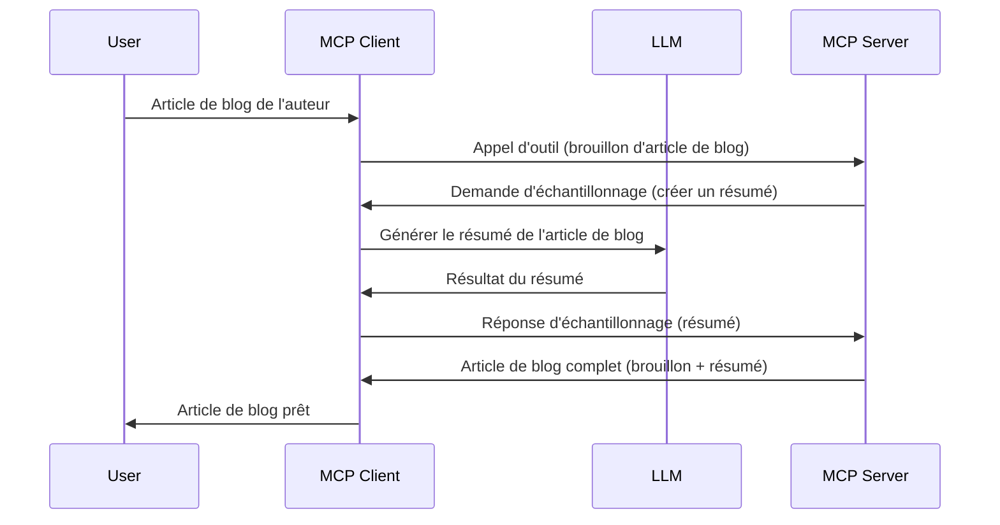

> [DÉPRÉCIÉ : CANDIDAT DE VERSION DU 28-07-2026](https://blog.modelcontextprotocol.io/posts/2026-07-28-release-candidate/)

# Échantillonnage - déléguer des fonctionnalités au Client

> **Avis de dépréciation :** le candidat à la spécification MCP `2026-07-28` marque l’Échantillonnage comme déprécié au profit d’une intégration directe avec les API des fournisseurs LLM. L’échantillonnage continue de fonctionner dans `2025-11-25` et pendant au moins une année après toute dépréciation formelle, donc tout ce qui est dans cette leçon reste valable — mais les nouvelles conceptions de serveurs devraient évaluer le modèle de remplacement. Voir [Qu’est-ce qui change dans MCP : Le candidat à la version du 28-07-2026](../../01-CoreConcepts/mcp-2026-07-28-release-candidate.md).

Parfois, il est nécessaire que le Client MCP et le Serveur MCP collaborent pour atteindre un objectif commun. Vous pouvez avoir un cas où le Serveur a besoin de l’aide d’un LLM qui se trouve sur le client. Dans cette situation, l’échantillonnage est ce que vous devriez utiliser.

Explorons quelques cas d’utilisation et comment construire une solution impliquant l’échantillonnage.

## Vue d’ensemble

Dans cette leçon, nous nous concentrons sur l’explication du moment et des endroits où utiliser l’échantillonnage ainsi que sur la manière de le configurer.

## Objectifs d’apprentissage

Dans ce chapitre, nous allons :

- Expliquer ce qu’est l’échantillonnage et quand l’utiliser.
- Montrer comment configurer l’échantillonnage dans MCP.
- Fournir des exemples d’échantillonnage en action.

## Qu’est-ce que l’échantillonnage et pourquoi l’utiliser ?

L’échantillonnage est une fonctionnalité avancée qui fonctionne de la manière suivante :



### Requête d’échantillonnage

Très bien, maintenant que nous avons une vue d’ensemble d’un scénario crédible, parlons de la requête d’échantillonnage que le serveur envoie au client. Voici à quoi une telle requête peut ressembler au format JSON-RPC :

```json
{
  "jsonrpc": "2.0",
  "id": 1,
  "method": "sampling/createMessage",
  "params": {
    "messages": [
      {
        "role": "user",
        "content": {
          "type": "text",
          "text": "Create a blog post summary of the following blog post: <BLOG POST>"
        }
      }
    ],
    "modelPreferences": {
      "hints": [
        {
          "name": "claude-3-sonnet"
        }
      ],
      "intelligencePriority": 0.8,
      "speedPriority": 0.5
    },
    "systemPrompt": "You are a helpful assistant.",
    "maxTokens": 100
  }
}
```

Il y a quelques points importants à souligner ici :

- Prompt, sous content -> text, est notre invite qui est une instruction pour que le LLM résume le contenu d’un article de blog.

- **modelPreferences**. Cette section est juste cela, une préférence, une recommandation de configuration à utiliser avec le LLM. L’utilisateur peut choisir de suivre ces recommandations ou de les modifier. Dans ce cas, il y a des recommandations sur le modèle à utiliser ainsi que sur la priorité vitesse et intelligence.
- **systemPrompt**, c’est votre invite système habituelle qui donne une personnalité à votre LLM et contient des instructions de guidage.
- **maxTokens**, il s’agit d’une autre propriété utilisée pour indiquer le nombre de tokens recommandés pour cette tâche.

### Réponse d’échantillonnage

Cette réponse est ce que le Client MCP finit par envoyer au Serveur MCP et est le résultat de l’appel du client au LLM, en attend la réponse puis en construisant ce message. Voici ce à quoi cela peut ressembler au format JSON-RPC :

```json
{
  "jsonrpc": "2.0",
  "id": 1,
  "result": {
    "role": "assistant",
    "content": {
      "type": "text",
      "text": "Here's your abstract <ABSTRACT>"
    },
    "model": "gpt-5",
    "stopReason": "endTurn"
  }
}
```

Notez comment la réponse est un résumé de l’article de blog exactement comme demandé. Notez aussi que le `model` utilisé n’est pas celui demandé mais "gpt-5" à la place de "claude-3-sonnet". Ceci illustre que l’utilisateur peut changer d’avis sur ce qu’il veut utiliser et que votre requête d’échantillonnage est une recommandation.

Très bien, maintenant que nous comprenons le flux principal, ainsi qu’une tâche utile pour l’utiliser « création d’article de blog + résumé », voyons ce qu’il faut faire pour le faire fonctionner.

### Types de messages

Les messages d’échantillonnage ne se limitent pas au texte mais vous pouvez aussi envoyer des images et de l’audio. Voici à quoi ressemble la différence en JSON-RPC :

**Texte**

```json
{
  "type": "text",
  "text": "The message content"
}
```

**Contenu image**

```json
{
  "type": "image",
  "data": "base64-encoded-image-data",
  "mimeType": "image/jpeg"
}
```

**Contenu audio**

```json
{
  "type": "audio",
  "data": "base64-encoded-audio-data",
  "mimeType": "audio/wav"
}
```

> NOTE : pour plus d’informations détaillées sur l’échantillonnage, consultez la [documentation officielle](https://modelcontextprotocol.io/specification/2025-11-25/client/sampling)

## Comment configurer l’Échantillonnage dans le Client

> Note : si vous ne construisez qu’un serveur, vous n’avez pas beaucoup à faire ici.

Dans un client, vous devez spécifier la fonctionnalité suivante comme suit :

```json
{
  "capabilities": {
    "sampling": {}
  }
}
```

Ceci sera pris en compte lors de l’initialisation de votre client choisi avec le serveur.

## Exemple d’échantillonnage en action - Créer un article de blog

Codons ensemble un serveur d’échantillonnage, nous devrons faire les étapes suivantes :

1. Créer un outil sur le Serveur.
1. Cet outil doit créer une requête d’échantillonnage
1. L’outil doit attendre la réponse à la requête d’échantillonnage du client.
1. Puis le résultat de l’outil doit être produit.

Voyons le code étape par étape :

### -1- Créer l’outil

**python**

```python
@mcp.tool()
async def create_blog(title: str, content: str, ctx: Context[ServerSession, None]) -> str:
    """Create a blog post and generate a summary"""

```

### -2- Créer une requête d’échantillonnage

Étendez votre outil avec le code suivant :

**python**

```python
post = BlogPost(
        id=len(posts) + 1,
        title=title,
        content=content,
        abstract=""
    )

prompt = f"Create an abstract of the following blog post: title: {title} and draft: {content} "

result = await ctx.session.create_message(
        messages=[
            SamplingMessage(
                role="user",
                content=TextContent(type="text", text=prompt),
            )
        ],
        max_tokens=100,
)

```

### -3- Attendre la réponse et retourner la réponse

**python**

```python
post.abstract = result.content.text

posts.append(post)

# retourner le produit complet
return json.dumps({
    "id": post.title,
    "abstract": post.abstract
})
```

### -4- Code complet

**python**

```python
from starlette.applications import Starlette
from starlette.routing import Mount, Host

from mcp.server.fastmcp import Context, FastMCP

from mcp.server.session import ServerSession
from mcp.types import SamplingMessage, TextContent

import json


from uuid import uuid4
from typing import List
from pydantic import BaseModel


mcp = FastMCP("Blog post generator")

# app = FastAPI()

posts = []

class BlogPost(BaseModel):
    id: int
    title: str
    content: str
    abstract: str

posts: List[BlogPost] = []

@mcp.tool()
async def create_blog(title: str, content: str, ctx: Context[ServerSession, None]) -> str:
    """Create a blog post and generate a summary"""

    post = BlogPost(
        id=len(posts) + 1,
        title=title,
        content=content,
        abstract=""
    )

    prompt = f"Create an abstract of the following blog post: title: {title} and draft: {content} "

    result = await ctx.session.create_message(
        messages=[
            SamplingMessage(
                role="user",
                content=TextContent(type="text", text=prompt),
            )
        ],
        max_tokens=100,
    )

    post.abstract = result.content.text

    posts.append(post)

    # renvoyer l'article de blog complet
    return json.dumps({
        "id": post.title,
        "abstract": post.abstract
    })

if __name__ == "__main__":
    print("Starting server...")
    # mcp.run()
    mcp.run(transport="streamable-http")

# exécuter l'application avec : python server.py
```

### -5- Le tester dans Visual Studio Code

Pour tester cela dans Visual Studio Code, faites ce qui suit :

1. Démarrez le serveur dans le terminal
1. Ajoutez-le dans *mcp.json* (et assurez-vous qu’il est démarré), quelque chose comme ceci :

   ```json
   "servers": {
      "blog-server": {
        "type": "http",
        "url": "http://localhost:8000/mcp"
      }
   }
   ```

1. Tapez une invite :

   ```text
   create a blog post named "Where Python comes from", the content is "Python is actually named after Monty Python Flying Circus"
   ```

1. Autorisez l’échantillonnage à se produire. La première fois que vous testez cela, une boîte de dialogue supplémentaire vous sera présentée, vous devrez l’accepter, puis vous verrez la boîte de dialogue normale pour vous demander d’exécuter un outil.

1. Examinez les résultats. Vous verrez les résultats bien rendus dans GitHub Copilot Chat mais vous pouvez aussi inspecter la réponse JSON brute.

**Bonus**. Les outils Visual Studio Code ont un excellent support pour l’échantillonnage. Vous pouvez configurer l’accès à l’échantillonnage sur votre serveur installé en naviguant comme suit :

1. Allez dans la section des extensions.
1. Sélectionnez l’icône d’engrenage pour votre serveur installé dans la section "MCP SERVERS - INSTALLED".
1 Sélectionnez "Configurer l’accès au modèle", ici vous pouvez choisir quels modèles GitHub Copilot est autorisé à utiliser lors de l’échantillonnage. Vous pouvez aussi voir toutes les requêtes d’échantillonnage survenues récemment en sélectionnant "Afficher les requêtes d’échantillonnage".

## Exercice

Dans cet exercice, vous allez construire un échantillonnage légèrement différent, à savoir une intégration d’échantillonnage qui supporte la génération d’une description produit. Voici votre scénario :

**Scénario** : L’employé du back office d’un commerce électronique a besoin d’aide, cela prend beaucoup trop de temps de générer des descriptions de produits. Par conséquent, vous allez construire une solution où vous pouvez appeler un outil "create_product" avec "title" et "keywords" comme arguments et il doit produire un produit complet incluant un champ "description" qui sera rempli par un LLM côté client.

CONSEIL : utilisez ce que vous avez appris plus tôt pour construire ce serveur et son outil en utilisant une requête d’échantillonnage.

## Solution

[Solution](./solution/README.md)

## Points principaux à retenir

L’échantillonnage est une fonctionnalité puissante qui permet au serveur de déléguer des tâches au client lorsqu’il a besoin de l’aide d’un LLM.

## Et après

- [Chapitre 4 - Mise en œuvre pratique](../../04-PracticalImplementation/README.md)

---

<!-- CO-OP TRANSLATOR DISCLAIMER START -->
**Avertissement** :
Ce document a été traduit à l'aide du service de traduction automatique [Co-op Translator](https://github.com/Azure/co-op-translator). Bien que nous nous efforçions d'assurer l'exactitude, veuillez noter que les traductions automatisées peuvent contenir des erreurs ou des inexactitudes. Le document original dans sa langue native doit être considéré comme la source faisant autorité. Pour les informations critiques, il est recommandé de recourir à une traduction professionnelle réalisée par un humain. Nous ne saurions être tenus responsables des malentendus ou erreurs d'interprétation découlant de l'utilisation de cette traduction.
<!-- CO-OP TRANSLATOR DISCLAIMER END -->