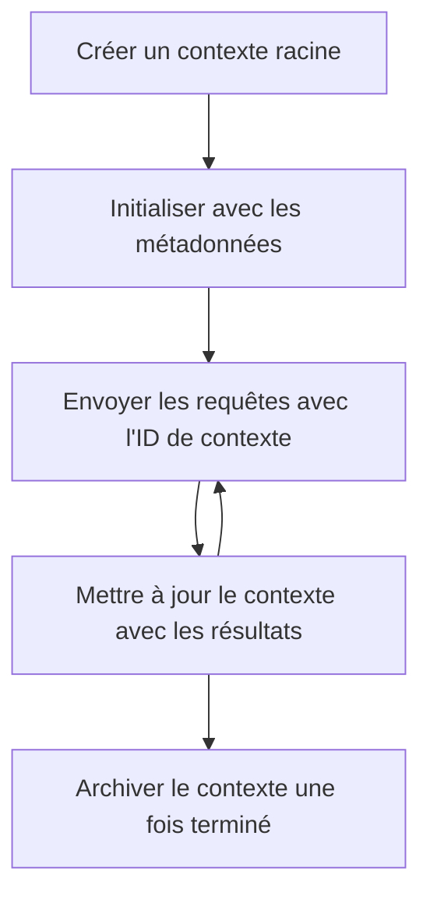

> [DÉPRÉCIÉ : CANDIDAT DE VERSION DU 28-07-2026](https://blog.modelcontextprotocol.io/posts/2026-07-28-release-candidate/#roots-sampling-and-logging-are-deprecated)

# Contextes racines MCP

> **Avis de dépréciation :** le candidat à la spécification MCP `2026-07-28` marque les Racines comme dépréciées au profit des paramètres d'outil, des URI de ressources ou de la configuration du serveur. Les Racines continuent de fonctionner dans la version `2025-11-25` et pendant au moins un an après toute dépréciation formelle, donc tout ce qui est dans cette leçon reste valide - mais les nouvelles conceptions de serveurs devraient évaluer le modèle de remplacement. Voir [Quoi de neuf dans MCP : Le candidat à la version du 28-07-2026](../../01-CoreConcepts/mcp-2026-07-28-release-candidate.md).

Les contextes racines sont un concept fondamental dans le protocole Model Context qui fournissent une couche persistante pour maintenir l'historique des conversations et l'état partagé à travers plusieurs requêtes et sessions.

## Introduction

Dans cette leçon, nous allons explorer comment créer, gérer et utiliser les contextes racines dans MCP.

## Objectifs d'apprentissage

À la fin de cette leçon, vous serez capable de :

- Comprendre le but et la structure des contextes racines
- Créer et gérer des contextes racines en utilisant les bibliothèques clientes MCP
- Implémenter des contextes racines dans des applications .NET, Java, JavaScript et Python
- Utiliser les contextes racines pour des conversations multi-tours et la gestion d'état
- Mettre en œuvre les bonnes pratiques pour la gestion des contextes racines

## Comprendre les contextes racines

Les contextes racines servent de conteneurs qui retiennent l'historique et l'état pour une série d'interactions liées. Ils permettent de :

- **Persistance des conversations** : Maintenir des conversations multi-tours cohérentes
- **Gestion de la mémoire** : Stocker et récupérer des informations à travers les interactions
- **Gestion de l'état** : Suivre la progression dans des flux de travail complexes
- **Partage du contexte** : Permettre à plusieurs clients d'accéder au même état de conversation

Dans MCP, les contextes racines ont ces caractéristiques clés :

- Chaque contexte racine a un identifiant unique.
- Ils peuvent contenir l'historique de la conversation, les préférences utilisateur et d'autres métadonnées.
- Ils peuvent être créés, accédés et archivés selon les besoins.
- Ils prennent en charge un contrôle d'accès et des permissions granulaire.

## Cycle de vie du contexte racine



## Travailler avec les contextes racines

Voici un exemple de création et de gestion des contextes racines.

### Implémentation en C#

```csharp
// .NET Example: Root Context Management
using Microsoft.Mcp.Client;
using System;
using System.Threading.Tasks;
using System.Collections.Generic;

public class RootContextExample
{
    private readonly IMcpClient _client;
    private readonly IRootContextManager _contextManager;
    
    public RootContextExample(IMcpClient client, IRootContextManager contextManager)
    {
        _client = client;
        _contextManager = contextManager;
    }
    
    public async Task DemonstrateRootContextAsync()
    {
        // 1. Create a new root context
        var contextResult = await _contextManager.CreateRootContextAsync(new RootContextCreateOptions
        {
            Name = "Customer Support Session",
            Metadata = new Dictionary<string, string>
            {
                ["CustomerName"] = "Acme Corporation",
                ["PriorityLevel"] = "High",
                ["Domain"] = "Cloud Services"
            }
        });
        
        string contextId = contextResult.ContextId;
        Console.WriteLine($"Created root context with ID: {contextId}");
        
        // 2. First interaction using the context
        var response1 = await _client.SendPromptAsync(
            "I'm having issues scaling my web service deployment in the cloud.", 
            new SendPromptOptions { RootContextId = contextId }
        );
        
        Console.WriteLine($"First response: {response1.GeneratedText}");
        
        // Second interaction - the model will have access to the previous conversation
        var response2 = await _client.SendPromptAsync(
            "Yes, we're using containerized deployments with Kubernetes.", 
            new SendPromptOptions { RootContextId = contextId }
        );
        
        Console.WriteLine($"Second response: {response2.GeneratedText}");
        
        // 3. Add metadata to the context based on conversation
        await _contextManager.UpdateContextMetadataAsync(contextId, new Dictionary<string, string>
        {
            ["TechnicalEnvironment"] = "Kubernetes",
            ["IssueType"] = "Scaling"
        });
        
        // 4. Get context information
        var contextInfo = await _contextManager.GetRootContextInfoAsync(contextId);
        
        Console.WriteLine("Context Information:");
        Console.WriteLine($"- Name: {contextInfo.Name}");
        Console.WriteLine($"- Created: {contextInfo.CreatedAt}");
        Console.WriteLine($"- Messages: {contextInfo.MessageCount}");
        
        // 5. When the conversation is complete, archive the context
        await _contextManager.ArchiveRootContextAsync(contextId);
        Console.WriteLine($"Archived context {contextId}");
    }
}
```

Dans le code précédent, nous avons :

1. Créé un contexte racine pour une session de support client.
1. Envoyé plusieurs messages dans ce contexte, permettant au modèle de maintenir l'état.
1. Mis à jour le contexte avec des métadonnées pertinentes basées sur la conversation.
1. Récupéré les informations du contexte pour comprendre l'historique de la conversation.
1. Archivé le contexte lorsque la conversation était terminée.

## Exemple : Implémentation de contexte racine pour analyse financière

Dans cet exemple, nous allons créer un contexte racine pour une session d'analyse financière, démontrant comment maintenir l'état à travers plusieurs interactions.

### Implémentation en Java

```java
// Exemple Java : Implémentation du contexte racine
package com.example.mcp.contexts;

import com.mcp.client.McpClient;
import com.mcp.client.ContextManager;
import com.mcp.models.RootContext;
import com.mcp.models.McpResponse;

import java.util.HashMap;
import java.util.Map;
import java.util.UUID;

public class RootContextsDemo {
    private final McpClient client;
    private final ContextManager contextManager;
    
    public RootContextsDemo(String serverUrl) {
        this.client = new McpClient.Builder()
            .setServerUrl(serverUrl)
            .build();
            
        this.contextManager = new ContextManager(client);
    }
    
    public void demonstrateRootContext() throws Exception {
        // Créer les métadonnées du contexte
        Map<String, String> metadata = new HashMap<>();
        metadata.put("projectName", "Financial Analysis");
        metadata.put("userRole", "Financial Analyst");
        metadata.put("dataSource", "Q1 2025 Financial Reports");
        
        // 1. Créer un nouveau contexte racine
        RootContext context = contextManager.createRootContext("Financial Analysis Session", metadata);
        String contextId = context.getId();
        
        System.out.println("Created context: " + contextId);
        
        // 2. Première interaction
        McpResponse response1 = client.sendPrompt(
            "Analyze the trends in Q1 financial data for our technology division",
            contextId
        );
        
        System.out.println("First response: " + response1.getGeneratedText());
        
        // 3. Mettre à jour le contexte avec les informations importantes obtenues de la réponse
        contextManager.addContextMetadata(contextId, 
            Map.of("identifiedTrend", "Increasing cloud infrastructure costs"));
        
        // Deuxième interaction - en utilisant le même contexte
        McpResponse response2 = client.sendPrompt(
            "What's driving the increase in cloud infrastructure costs?",
            contextId
        );
        
        System.out.println("Second response: " + response2.getGeneratedText());
        
        // 4. Générer un résumé de la session d'analyse
        McpResponse summaryResponse = client.sendPrompt(
            "Summarize our analysis of the technology division financials in 3-5 key points",
            contextId
        );
        
        // Stocker le résumé dans les métadonnées du contexte
        contextManager.addContextMetadata(contextId, 
            Map.of("analysisSummary", summaryResponse.getGeneratedText()));
            
        // Obtenir les informations mises à jour du contexte
        RootContext updatedContext = contextManager.getRootContext(contextId);
        
        System.out.println("Context Information:");
        System.out.println("- Created: " + updatedContext.getCreatedAt());
        System.out.println("- Last Updated: " + updatedContext.getLastUpdatedAt());
        System.out.println("- Analysis Summary: " + 
            updatedContext.getMetadata().get("analysisSummary"));
            
        // 5. Archiver le contexte une fois terminé
        contextManager.archiveContext(contextId);
        System.out.println("Context archived");
    }
}
```

Dans le code précédent, nous avons :

1. Créé un contexte racine pour une session d'analyse financière.
2. Envoyé plusieurs messages dans ce contexte, permettant au modèle de maintenir l'état.
3. Mis à jour le contexte avec des métadonnées pertinentes basées sur la conversation.
4. Généré un résumé de la session d'analyse et stocké dans les métadonnées du contexte.
5. Archivé le contexte lorsque la conversation était terminée.

## Exemple : Gestion des contextes racines

Gérer efficacement les contextes racines est crucial pour maintenir l'historique des conversations et l'état. Voici un exemple d'implémentation de la gestion des contextes racines.

### Implémentation en JavaScript

```javascript
// Exemple JavaScript : Gestion des contextes racines MCP
const { McpClient, RootContextManager } = require('@mcp/client');

class ContextSession {
  constructor(serverUrl, apiKey = null) {
    // Initialiser le client MCP
    this.client = new McpClient({
      serverUrl,
      apiKey
    });
    
    // Initialiser le gestionnaire de contexte
    this.contextManager = new RootContextManager(this.client);
  }
  
  /**
   * Create a new conversation context
   * @param {string} sessionName - Name of the conversation session
   * @param {Object} metadata - Additional metadata for the context
   * @returns {Promise<string>} - Context ID
   */
  async createConversationContext(sessionName, metadata = {}) {
    try {
      const contextResult = await this.contextManager.createRootContext({
        name: sessionName,
        metadata: {
          ...metadata,
          createdAt: new Date().toISOString(),
          status: 'active'
        }
      });
      
      console.log(`Created root context '${sessionName}' with ID: ${contextResult.id}`);
      return contextResult.id;
    } catch (error) {
      console.error('Error creating root context:', error);
      throw error;
    }
  }
  
  /**
   * Send a message in an existing context
   * @param {string} contextId - The root context ID
   * @param {string} message - The user's message
   * @param {Object} options - Additional options
   * @returns {Promise<Object>} - Response data
   */
  async sendMessage(contextId, message, options = {}) {
    try {
      // Envoyer le message en utilisant le contexte spécifié
      const response = await this.client.sendPrompt(message, {
        rootContextId: contextId,
        temperature: options.temperature || 0.7,
        allowedTools: options.allowedTools || []
      });
      
      // Stocker éventuellement des informations importantes issues de la conversation
      if (options.storeInsights) {
        await this.storeConversationInsights(contextId, message, response.generatedText);
      }
      
      return {
        message: response.generatedText,
        toolCalls: response.toolCalls || [],
        contextId
      };
    } catch (error) {
      console.error(`Error sending message in context ${contextId}:`, error);
      throw error;
    }
  }
  
  /**
   * Store important insights from a conversation
   * @param {string} contextId - The root context ID
   * @param {string} userMessage - User's message
   * @param {string} aiResponse - AI's response
   */
  async storeConversationInsights(contextId, userMessage, aiResponse) {
    try {
      // Extraire des informations potentielles (dans une application réelle, ce serait plus sophistiqué)
      const combinedText = userMessage + "\n" + aiResponse;
      
      // Heuristique simple pour identifier des informations potentielles
      const insightWords = ["important", "key point", "remember", "significant", "crucial"];
      
      const potentialInsights = combinedText
        .split(".")
        .filter(sentence => 
          insightWords.some(word => sentence.toLowerCase().includes(word))
        )
        .map(sentence => sentence.trim())
        .filter(sentence => sentence.length > 10);
      
      // Stocker les informations dans les métadonnées du contexte
      if (potentialInsights.length > 0) {
        const insights = {};
        potentialInsights.forEach((insight, index) => {
          insights[`insight_${Date.now()}_${index}`] = insight;
        });
        
        await this.contextManager.updateContextMetadata(contextId, insights);
        console.log(`Stored ${potentialInsights.length} insights in context ${contextId}`);
      }
    } catch (error) {
      console.warn('Error storing conversation insights:', error);
      // Erreur non critique, donc simplement enregistrer un avertissement
    }
  }
  
  /**
   * Get summary information about a context
   * @param {string} contextId - The root context ID
   * @returns {Promise<Object>} - Context information
   */
  async getContextInfo(contextId) {
    try {
      const contextInfo = await this.contextManager.getContextInfo(contextId);
      
      return {
        id: contextInfo.id,
        name: contextInfo.name,
        created: new Date(contextInfo.createdAt).toLocaleString(),
        lastUpdated: new Date(contextInfo.lastUpdatedAt).toLocaleString(),
        messageCount: contextInfo.messageCount,
        metadata: contextInfo.metadata,
        status: contextInfo.status
      };
    } catch (error) {
      console.error(`Error getting context info for ${contextId}:`, error);
      throw error;
    }
  }
  
  /**
   * Generate a summary of the conversation in a context
   * @param {string} contextId - The root context ID
   * @returns {Promise<string>} - Generated summary
   */
  async generateContextSummary(contextId) {
    try {
      // Demander au modèle de générer un résumé de la conversation jusqu’à présent
      const response = await this.client.sendPrompt(
        "Please summarize our conversation so far in 3-4 sentences, highlighting the main points discussed.",
        { rootContextId: contextId, temperature: 0.3 }
      );
      
      // Stocker le résumé dans les métadonnées du contexte
      await this.contextManager.updateContextMetadata(contextId, {
        conversationSummary: response.generatedText,
        summarizedAt: new Date().toISOString()
      });
      
      return response.generatedText;
    } catch (error) {
      console.error(`Error generating context summary for ${contextId}:`, error);
      throw error;
    }
  }
  
  /**
   * Archive a context when it's no longer needed
   * @param {string} contextId - The root context ID
   * @returns {Promise<Object>} - Result of the archive operation
   */
  async archiveContext(contextId) {
    try {
      // Générer un résumé final avant l’archivage
      const summary = await this.generateContextSummary(contextId);
      
      // Archiver le contexte
      await this.contextManager.archiveContext(contextId);
      
      return {
        status: "archived",
        contextId,
        summary
      };
    } catch (error) {
      console.error(`Error archiving context ${contextId}:`, error);
      throw error;
    }
  }
}

// Exemple d’utilisation
async function demonstrateContextSession() {
  const session = new ContextSession('https://mcp-server-example.com');
  
  try {
    // 1. Créer un nouveau contexte pour une conversation de support produit
    const contextId = await session.createConversationContext(
      'Product Support - Database Performance',
      {
        customer: 'Globex Corporation',
        product: 'Enterprise Database',
        severity: 'Medium',
        supportAgent: 'AI Assistant'
      }
    );
    
    // 2. Premier message de la conversation
    const response1 = await session.sendMessage(
      contextId,
      "I'm experiencing slow query performance on our database cluster after the latest update.",
      { storeInsights: true }
    );
    console.log('Response 1:', response1.message);
    
    // Message de suivi dans le même contexte
    const response2 = await session.sendMessage(
      contextId,
      "Yes, we've already checked the indexes and they seem to be properly configured.",
      { storeInsights: true }
    );
    console.log('Response 2:', response2.message);
    
    // 3. Obtenir des informations sur le contexte
    const contextInfo = await session.getContextInfo(contextId);
    console.log('Context Information:', contextInfo);
    
    // 4. Générer et afficher le résumé de la conversation
    const summary = await session.generateContextSummary(contextId);
    console.log('Conversation Summary:', summary);
    
    // 5. Archiver le contexte une fois terminé
    const archiveResult = await session.archiveContext(contextId);
    console.log('Archive Result:', archiveResult);
    
    // 6. Gérer les erreurs de manière appropriée
  } catch (error) {
    console.error('Error in context session demonstration:', error);
  }
}

demonstrateContextSession();
```

Dans le code précédent, nous avons :

1. Créé un contexte racine pour une conversation de support produit avec la fonction `createConversationContext`. Dans ce cas, le contexte concerne des problèmes de performance base de données.

1. Envoyé plusieurs messages dans ce contexte, permettant au modèle de maintenir l'état avec la fonction `sendMessage`. Les messages envoyés portent sur la lenteur des requêtes et la configuration des index.

1. Mis à jour le contexte avec des métadonnées pertinentes basées sur la conversation.

1. Généré un résumé de la conversation et stocké dans les métadonnées du contexte avec la fonction `generateContextSummary`.

1. Archivé le contexte lorsque la conversation était terminée avec la fonction `archiveContext`.

1. Géré les erreurs de manière robuste pour assurer la résilience.

## Contexte racine pour une assistance multi-tours

Dans cet exemple, nous allons créer un contexte racine pour une session d’aide multi-tours, démontrant comment maintenir l’état à travers plusieurs interactions.

### Implémentation en Python

```python
# Exemple Python : Contexte racine pour assistance à plusieurs tours
import asyncio
from datetime import datetime
from mcp_client import McpClient, RootContextManager

class AssistantSession:
    def __init__(self, server_url, api_key=None):
        self.client = McpClient(server_url=server_url, api_key=api_key)
        self.context_manager = RootContextManager(self.client)
    
    async def create_session(self, name, user_info=None):
        """Create a new root context for an assistant session"""
        metadata = {
            "session_type": "assistant",
            "created_at": datetime.now().isoformat(),
        }
        
        # Ajouter les informations utilisateur si fournies
        if user_info:
            metadata.update({f"user_{k}": v for k, v in user_info.items()})
            
        # Créer le contexte racine
        context = await self.context_manager.create_root_context(name, metadata)
        return context.id
    
    async def send_message(self, context_id, message, tools=None):
        """Send a message within a root context"""
        # Créer des options avec l'ID du contexte
        options = {
            "root_context_id": context_id
        }
        
        # Ajouter des outils si spécifiés
        if tools:
            options["allowed_tools"] = tools
        
        # Envoyer l'invite dans le contexte
        response = await self.client.send_prompt(message, options)
        
        # Mettre à jour les métadonnées du contexte avec la progression de la conversation
        await self.context_manager.update_context_metadata(
            context_id,
            {
                f"message_{datetime.now().timestamp()}": message[:50] + "...",
                "last_interaction": datetime.now().isoformat()
            }
        )
        
        return response
    
    async def get_conversation_history(self, context_id):
        """Retrieve conversation history from a context"""
        context_info = await self.context_manager.get_context_info(context_id)
        messages = await self.client.get_context_messages(context_id)
        
        return {
            "context_info": context_info,
            "messages": messages
        }
    
    async def end_session(self, context_id):
        """End an assistant session by archiving the context"""
        # Générer d'abord une invite de résumé
        summary_response = await self.client.send_prompt(
            "Please summarize our conversation and any key points or decisions made.",
            {"root_context_id": context_id}
        )
        
        # Stocker le résumé dans les métadonnées
        await self.context_manager.update_context_metadata(
            context_id,
            {
                "summary": summary_response.generated_text,
                "ended_at": datetime.now().isoformat(),
                "status": "completed"
            }
        )
        
        # Archiver le contexte
        await self.context_manager.archive_context(context_id)
        
        return {
            "status": "completed",
            "summary": summary_response.generated_text
        }

# Exemple d'utilisation
async def demo_assistant_session():
    assistant = AssistantSession("https://mcp-server-example.com")
    
    # 1. Créer la session
    context_id = await assistant.create_session(
        "Technical Support Session",
        {"name": "Alex", "technical_level": "advanced", "product": "Cloud Services"}
    )
    print(f"Created session with context ID: {context_id}")
    
    # 2. Première interaction
    response1 = await assistant.send_message(
        context_id, 
        "I'm having trouble with the auto-scaling feature in your cloud platform.",
        ["documentation_search", "diagnostic_tool"]
    )
    print(f"Response 1: {response1.generated_text}")
    
    # Deuxième interaction dans le même contexte
    response2 = await assistant.send_message(
        context_id,
        "Yes, I've already checked the configuration settings you mentioned, but it's still not working."
    )
    print(f"Response 2: {response2.generated_text}")
    
    # 3. Obtenir l'historique
    history = await assistant.get_conversation_history(context_id)
    print(f"Session has {len(history['messages'])} messages")
    
    # 4. Terminer la session
    end_result = await assistant.end_session(context_id)
    print(f"Session ended with summary: {end_result['summary']}")

if __name__ == "__main__":
    asyncio.run(demo_assistant_session())
```

Dans le code précédent, nous avons :

1. Créé un contexte racine pour une session de support technique avec la fonction `create_session`. Le contexte inclut des informations utilisateur telles que le nom et le niveau technique.

1. Envoyé plusieurs messages dans ce contexte, permettant au modèle de maintenir l'état avec la fonction `send_message`. Les messages portent sur des problèmes avec la fonctionnalité d'auto-scaling.

1. Récupéré l'historique de la conversation avec la fonction `get_conversation_history`, qui fournit des informations de contexte et des messages.

1. Terminé la session en archivant le contexte et en générant un résumé avec la fonction `end_session`. Le résumé capture les points clés de la conversation.

## Bonnes pratiques pour les contextes racines

Voici quelques bonnes pratiques pour gérer efficacement les contextes racines :

- **Créer des contextes ciblés** : Créer des contextes racines séparés pour différents objectifs ou domaines de conversation afin de maintenir la clarté.

- **Définir des politiques d’expiration** : Mettre en œuvre des politiques pour archiver ou supprimer les anciens contextes afin de gérer le stockage et respecter les politiques de conservation des données.

- **Stocker des métadonnées pertinentes** : Utiliser les métadonnées du contexte pour stocker des informations importantes sur la conversation qui pourraient être utiles ultérieurement.

- **Utiliser les ID de contexte de manière cohérente** : Une fois un contexte créé, utiliser son ID de manière cohérente pour toutes les requêtes liées afin de maintenir la continuité.

- **Générer des résumés** : Lorsque le contexte devient volumineux, envisager de générer des résumés pour capturer les informations essentielles tout en gérant la taille du contexte.

- **Mettre en œuvre un contrôle d’accès** : Pour les systèmes multi-utilisateurs, mettre en place un contrôle d’accès approprié pour garantir la confidentialité et la sécurité des contextes de conversation.

- **Gérer les limitations du contexte** : Être conscient des limites de taille des contextes et mettre en œuvre des stratégies pour gérer les conversations très longues.

- **Archiver une fois terminé** : Archiver les contextes lorsque les conversations sont terminées pour libérer des ressources tout en préservant l’historique de la conversation.

## Et après

- [5.5 Routage](../mcp-routing/README.md)

---

<!-- CO-OP TRANSLATOR DISCLAIMER START -->
**Avertissement** :
Ce document a été traduit à l'aide du service de traduction automatique [Co-op Translator](https://github.com/Azure/co-op-translator). Bien que nous nous efforçions d'assurer l'exactitude, veuillez noter que les traductions automatisées peuvent contenir des erreurs ou des inexactitudes. Le document original dans sa langue native doit être considéré comme la source faisant autorité. Pour les informations critiques, il est recommandé de recourir à une traduction professionnelle réalisée par un humain. Nous ne saurions être tenus responsables des malentendus ou erreurs d'interprétation découlant de l'utilisation de cette traduction.
<!-- CO-OP TRANSLATOR DISCLAIMER END -->