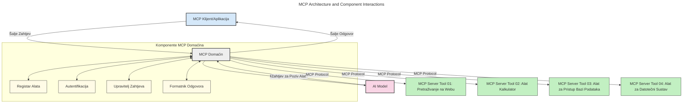
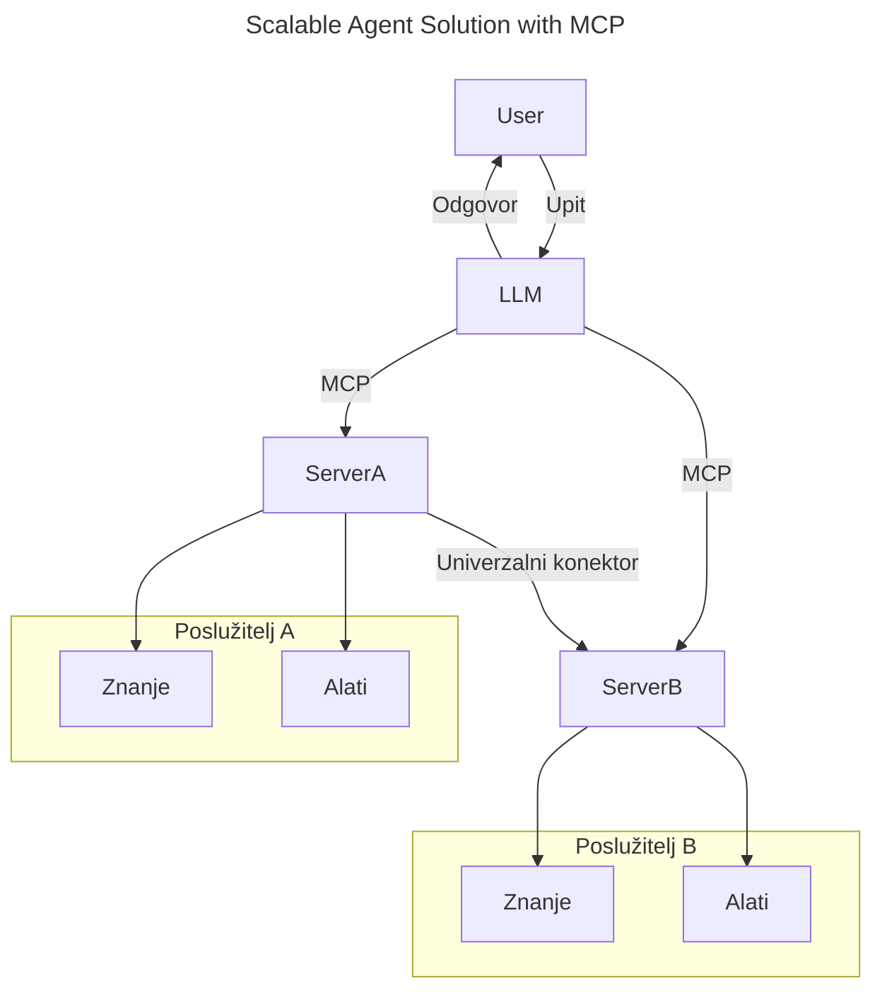
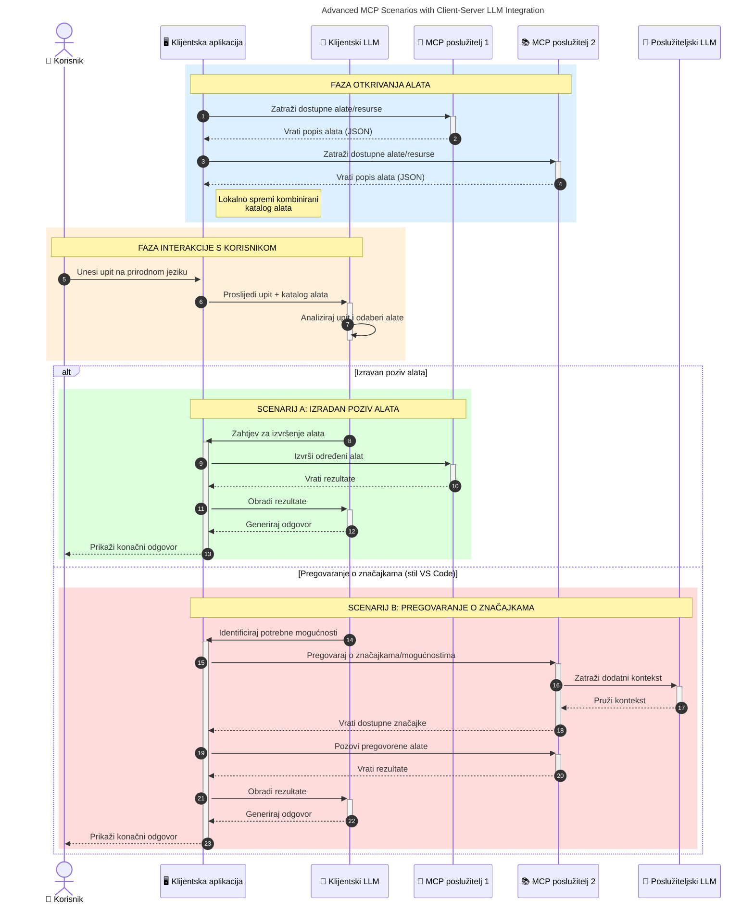

# Uvod u Model Context Protocol (MCP): Zašto je važan za skalabilne AI aplikacije

_(Kliknite na gornju sliku za pregled video lekcije)_

Generativne AI aplikacije predstavljaju veliki korak naprijed jer često omogućuju korisniku interakciju s aplikacijom putem prirodnih jezičnih upita. Međutim, kako se u takve aplikacije ulaže više vremena i resursa, želite biti sigurni da možete lako integrirati funkcionalnosti i resurse na način koji je jednostavan za proširenje, da vaša aplikacija može podržati korištenje više modela i upravljati raznim složenostima modela. Ukratko, izrada generativnih AI aplikacija je jednostavna na početku, ali kako rastu i postaju složenije, potrebno je definirati arhitekturu i najvjerojatnije se osloniti na standard koji će osigurati da se vaše aplikacije grade na dosljedan način. Tu dolazi MCP koji organizira stvari i pruža standard.

---

## **🔍 Što je Model Context Protocol (MCP)?**

**Model Context Protocol (MCP)** je **otvoreni, standardizirani sučelje** koje omogućuje velikim jezičnim modelima (LLM-ovima) besprijekornu interakciju s vanjskim alatima, API-jima i izvorima podataka. Ono pruža dosljednu arhitekturu za poboljšanje funkcionalnosti AI modela izvan njihovih podataka za obuku, omogućujući pametnije, skalabilnije i responzivnije AI sustave.

---

## **🎯 Zašto je standardizacija u AI važna**

Kako generativne AI aplikacije postaju složenije, važno je usvojiti standarde koji osiguravaju **skalabilnost, proširivost, održivost** i **izbjegavanje zaključavanja kod dobavljača**. MCP rješava te potrebe na sljedeće načine:

- Ujedinjuje integracije modela i alata
- Smanjuje krhka, jedinstvena prilagođena rješenja
- Dozvoljava suživot više modela različitih dobavljača unutar jednog ekosustava

**Napomena:** Iako se MCP predstavlja kao otvoreni standard, nema planova da se MCP standardizira putem postojećih tijela za standardizaciju kao što su IEEE, IETF, W3C, ISO ili neka druga tijela za standarde.

---

## **📚 Ciljevi učenja**

Do kraja ovog članka moći ćete:

- Definirati **Model Context Protocol (MCP)** i njegove primjene
- Razumjeti kako MCP standardizira komunikaciju modela s alatima
- Identificirati ključne komponente MCP arhitekture
- Istražiti stvarne primjene MCP u poslovnim i razvojnom kontekstu

---

## **💡 Zašto je Model Context Protocol (MCP) revolucionaran**

### **🔗 MCP rješava fragmentaciju u AI interakcijama**

Prije MCP-a, integracija modela s alatima zahtijevala je:

- Prilagođeni kod za svaki par alat-model
- Nestandardizirane API-je za svakog dobavljača
- Česte prekide zbog ažuriranja
- Lošu skalabilnost s rastom broja alata

### **✅ Prednosti standardizacije MCP-a**

| **Prednost**                | **Opis**                                                                      |
|----------------------------|-------------------------------------------------------------------------------|
| Interoperabilnost           | LLM-ovi rade besprijekorno s alatima različitih dobavljača                   |
| Dosljednost                | Uniformno ponašanje na platformama i alatima                                 |
| Ponovna upotrebljivost      | Alati izrađeni jednom mogu se koristiti u različitim projektima i sustavima  |
| Ubrzani razvoj              | Smanjenje vremena razvoja korištenjem standardiziranih, plug-and-play sučelja|

---

## **🧱 Pregled visoke razine MCP arhitekture**

MCP slijedi **klijent-poslužitelj model**, gdje:

- **MCP domaćini** pokreću AI modele
- **MCP klijenti** iniciraju zahtjeve
- **MCP poslužitelji** prolaze kontekst, alate i mogućnosti

### **Ključne komponente:**

- **Resursi** – Statički ili dinamički podaci za modele  
- **Upiti (Prompts)** – Predefinirani tijekovi rada za vođenu generaciju  
- **Alati** – Izvršne funkcije poput pretraživanja, izračuna  
- **Uzorkovanje (Sampling)** – Agencijsko ponašanje putem rekurzivnih interakcija (zastarjelo u kandidatu za izdanje `2026-07-28`)
- **Elicitation** – Zahtjevi koje inicira poslužitelj za korisnički unos
- **Roots** – Granice datotečnog sustava za kontrolu pristupa poslužitelju (zastarjelo u kandidatu za izdanje `2026-07-28`)

### **Arhitektura protokola:**

MCP koristi dvoslojnu arhitekturu:
- **Sloj podataka**: komunikacija temeljena na JSON-RPC 2.0 s upravljanjem životnim ciklusom i primitivima
- **Transportni sloj**: STDIO (lokalno) i Streamable HTTP s SSE (udaljena) komunikacijski kanali

---

## Kako MCP poslužitelji rade

MCP poslužitelji djeluju na sljedeći način:

- **Tijek zahtjeva**:
    1. Zahtjev inicira krajnji korisnik ili softver koji djeluje u njihovo ime.
    2. **MCP Klijent** šalje zahtjev **MCP Domaćinu**, koji upravlja AI model runtime okruženjem.
    3. **AI Model** prima korisnički upit i može zatražiti pristup vanjskim alatima ili podacima putem jednog ili više poziva alata.
    4. **MCP Domaćin**, a ne model direktno, komunicira s odgovarajućim **MCP Poslužiteljem/ima** koristeći standardizirani protokol.
- **Funkcionalnost MCP Domaćina**:
    - **Registar alata**: Održava katalog dostupnih alata i njihovih mogućnosti.
    - **Autentikacija**: Provjerava dopuštenja za pristup alatima.
    - **Rukovatelj zahtjevima**: Procesira dolazne zahtjeve alata iz modela.
    - **Formatiranje odgovora**: Strukturira izlaze alata u format koji model može razumjeti.
- **Izvršenje MCP poslužitelja**:
    - **MCP Domaćin** usmjerava pozive alata prema jednom ili više **MCP Poslužitelja**, od kojih svaki izlaže specijalizirane funkcije (npr. pretraživanje, izračune, upite baza podataka).
    - **MCP Poslužitelji** izvode svoje operacije i vraćaju rezultate MCP Domaćinu u dosljednom formatu.
    - **MCP Domaćin** formatira i prenosi rezultate natrag **AI Modelu**.
- **Dovršetak odgovora**:
    - **AI Model** integrira izlaze alata u konačni odgovor.
    - **MCP Domaćin** šalje taj odgovor natrag **MCP Klijentu**, koji ga dostavlja krajnjem korisniku ili pozivajućem softveru.
    

## 👨‍💻 Kako izgraditi MCP poslužitelj (s primjerima)

MCP poslužitelji omogućavaju proširenje mogućnosti LLM-ova pružanjem podataka i funkcionalnosti. 

Spremni za isprobavanje? Ovdje su SDK-ovi specifični za jezik i/ili stack sa primjerima izrade jednostavnih MCP poslužitelja u različitim jezicima i stackovima:

- **Python SDK**: https://github.com/modelcontextprotocol/python-sdk

- **TypeScript SDK**: https://github.com/modelcontextprotocol/typescript-sdk

- **Java SDK**: https://github.com/modelcontextprotocol/java-sdk

- **C#/.NET SDK**: https://github.com/modelcontextprotocol/csharp-sdk

## 🌍 Stvarni primjeri uporabe MCP-a

MCP omogućava širok spektar primjena produžujući AI mogućnosti:

| **Primjena**                | **Opis**                                                                       |
|----------------------------|--------------------------------------------------------------------------------|
| Integracija podataka u poduzeću | Povezivanje LLM-ova s bazama podataka, CRM sustavima ili internim alatima  |
| Agentni AI sustavi          | Omogućavanje autonomnih agenata s pristupom alatima i tijekovima odlučivanja    |
| Multimodalne aplikacije     | Kombiniranje teksta, slike i audio alata unutar jedne objedinjene AI aplikacije |
| Integracija podataka u stvarnom vremenu | Uvođenje živih podataka u AI interakcije za točnije, aktualne rezultate        |

### 🧠 MCP = univerzalni standard za AI interakcije

Model Context Protocol (MCP) djeluje kao univerzalni standard za AI interakcije, slično kao što je USB-C standardizirao fizičke veze za uređaje. U svijetu AI-a, MCP pruža dosljedno sučelje, dopuštajući modelima (klijentima) da se besprijekorno integriraju s vanjskim alatima i pružateljima podataka (poslužiteljima). Ovo uklanja potrebu za različitim, prilagođenim protokolima za svaki API ili izvor podataka.

Prema MCP-u, alat kompatibilan s MCP-om (koji se naziva MCP poslužitelj) slijedi jedinstveni standard. Ti poslužitelji mogu navesti alate ili radnje koje nude i izvršavati ih kada ih AI agent zatraži. Platforme AI agenata koje podržavaju MCP sposobne su otkrivati dostupne alate s poslužitelja i pozivati ih putem ovog standardnog protokola.

### 💡 Omogućuje pristup znanju

Osim što nudi alate, MCP također olakšava pristup znanju. Omogućuje aplikacijama da pružaju kontekst velikim jezičnim modelima (LLM-ovima) povezujući ih s različitim izvorima podataka. Na primjer, MCP poslužitelj može predstavljati spremište dokumenata tvrtke, dopuštajući agentima da po potrebi dohvaćaju relevantne informacije. Drugi poslužitelj može upravljati specifičnim radnjama poput slanja e-pošte ili ažuriranja zapisa. Iz perspektive agenta, to su jednostavno alati koje može koristiti – neki alati vraćaju podatke (kontekst znanja), dok drugi izvršavaju radnje. MCP učinkovito upravlja oboje.

Agent koji se povezuje na MCP poslužitelj automatski uči dostupne mogućnosti poslužitelja i pristupačne podatke putem standardnog formata. Ova standardizacija omogućuje dinamičku dostupnost alata. Na primjer, dodavanje novog MCP poslužitelja agentovom sustavu odmah čini njegove funkcije upotrebljivima bez potrebe za dodatnim prilagodbama u uputama agenta.

Ova pojednostavljena integracija usklađena je s tijekom prikazanim na sljedećoj dijagramu, gdje poslužitelji pružaju i alate i znanje, osiguravajući besprijekornu suradnju između sustava.

### 👉 Primjer: skalabilno rješenje za agente

Univerzalni konektor omogućava MCP poslužiteljima da međusobno komuniciraju i dijele mogućnosti, dopuštajući ServerA da delegira zadatke ServerB-u ili pristupi njegovim alatima i znanju. Ovo federira alate i podatke po poslužiteljima, podržavajući skalabilne i modularne arhitekture agenata. Budući da MCP standardizira izlaganje alata, agenti mogu dinamički otkrivati i usmjeravati zahtjeve između poslužitelja bez ugrađenih integracija.

Federacija alata i znanja: alati i podaci mogu se pristupiti preko poslužitelja, omogućavajući skalabilnije i modularnije agentne arhitekture.

### 🔄 Napredni MCP scenariji s integracijom LLM-a na strani klijenta

Osim osnovne MCP arhitekture, postoje napredni scenariji gdje i klijent i poslužitelj sadrže LLM-ove, omogućujući sofisticiranije interakcije. Na sljedećem dijagramu, **Aplikacija klijenta** može biti IDE s brojnim MCP alatima dostupnim za korištenje LLM-a:

## 🔐 Praktične prednosti MCP-a

Ovo su praktične prednosti korištenja MCP-a:

- **Svježina**: modeli mogu pristupiti ažuriranim informacijama izvan svojih podataka za obuku
- **Proširenje mogućnosti**: modeli mogu koristiti specijalizirane alate za zadatke za koje nisu trenirani
- **Smanjenje halucinacija**: vanjski izvori podataka pružaju factualnu osnovu
- **Privatnost**: osjetljivi podaci mogu ostati unutar sigurnih okruženja umjesto da budu ugrađeni u upite

## 📌 Ključne spoznaje

Slijede ključne spoznaje za korištenje MCP-a:

- **MCP** standardizira način na koji AI modeli komuniciraju s alatima i podacima
- Promovira **proširivost, dosljednost i interoperabilnost**
- MCP pomaže **skratiti vrijeme razvoja, poboljšati pouzdanost i proširiti mogućnosti modela**
- Klijent-poslužitelj arhitektura **omogućuje fleksibilne, proširive AI aplikacije**

## 🧠 Vježba

Razmislite o AI aplikaciji koju želite razviti.

- Koji bi **vanjski alati ili podaci** mogli poboljšati njezine mogućnosti?
- Kako bi MCP mogao učiniti integraciju **jednostavnijom i pouzdanijom?**

## Dodatni resursi

- [MCP GitHub repozitorij](https://github.com/modelcontextprotocol)

## Što dalje

Sljedeće: [Poglavlje 1: Osnovni pojmovi](../01-CoreConcepts/README.md)

---

<!-- CO-OP TRANSLATOR DISCLAIMER START -->
**Napomena**:
Ovaj dokument je preveden korištenjem AI prevoditeljskog servisa [Co-op Translator](https://github.com/Azure/co-op-translator). Iako težimo točnosti, imajte na umu da automatski prijevodi mogu sadržavati greške ili netočnosti. Izvorni dokument na izvornom jeziku treba smatrati autoritativnim izvorom. Za važne informacije preporuča se profesionalni ljudski prijevod. Nismo odgovorni za bilo kakva nesporazumevanja ili pogrešne interpretacije koje proizlaze iz korištenja ovog prijevoda.
<!-- CO-OP TRANSLATOR DISCLAIMER END -->