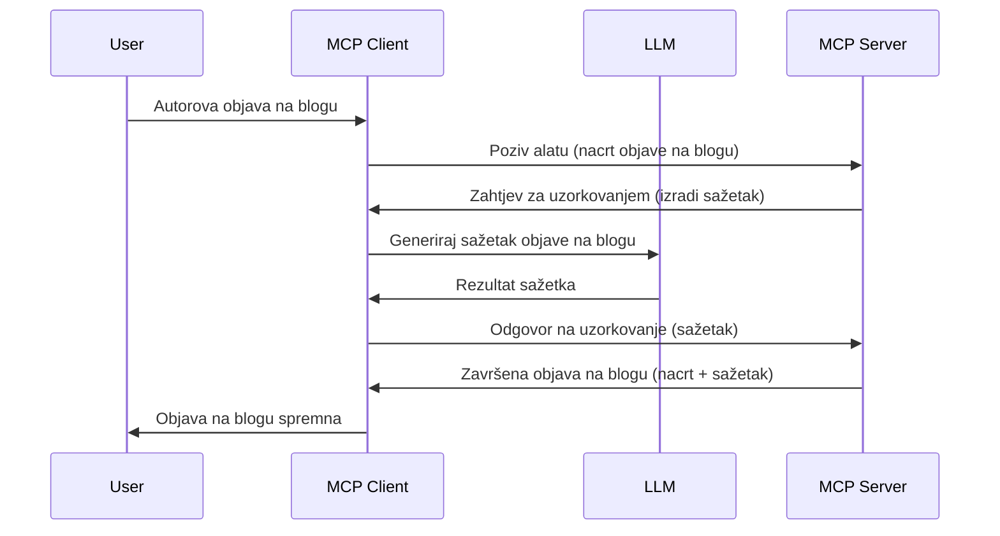

> [ZASTARJELO: IZDANJE KANDIDATA 2026-07-28](https://blog.modelcontextprotocol.io/posts/2026-07-28-release-candidate/)

# Uzorkovanje - delegiranje značajki Klijentu

> **Obavijest o zastarijevanju:** MCP specifikacija kandidata za izdanje `2026-07-28` označava uzorkovanje kao zastarjelo u korist izravne integracije s API-jima davatelja LLM-a. Uzorkovanje i dalje radi u `2025-11-25` i najmanje godinu dana nakon bilo kojeg službenog zastarijevanja, pa je sve u ovoj lekciji i dalje valjano — ali novi dizajni poslužitelja trebaju procijeniti obrazac zamjene. Pogledajte [Što se mijenja u MCP-u: Kandidat za izdanje 2026-07-28](../../01-CoreConcepts/mcp-2026-07-28-release-candidate.md).

Ponekad je potrebno da MCP Klijent i MCP Poslužitelj surađuju kako bi postigli zajednički cilj. Možete imati slučaj gdje poslužitelj treba pomoć LLM-a koji se nalazi na klijentu. Za ovu situaciju, uzorkovanje je ono što biste trebali koristiti.

Pogledajmo neke primjere i kako izgraditi rješenje koje uključuje uzorkovanje.

## Pregled

U ovoj lekciji fokusiramo se na objašnjenje kada i gdje koristiti Uzorkovanje i kako ga konfigurirati.

## Ciljevi učenja

U ovom poglavlju ćemo:

- Objasniti što je Uzorkovanje i kada ga koristiti.
- Pokazati kako konfigurirati Uzorkovanje u MCP-u.
- Pružiti primjere Uzorkovanja u praksi.

## Što je Uzorkovanje i zašto ga koristiti?

Uzorkovanje je napredna značajka koja funkcionira na sljedeći način:



### Zahtjev za uzorkovanje

Ok, sada imamo pregled vjerodostojnog scenarija, razgovarajmo o zahtjevu za uzorkovanje koji poslužitelj šalje natrag klijentu. Evo kako takav zahtjev može izgledati u JSON-RPC formatu:

```json
{
  "jsonrpc": "2.0",
  "id": 1,
  "method": "sampling/createMessage",
  "params": {
    "messages": [
      {
        "role": "user",
        "content": {
          "type": "text",
          "text": "Create a blog post summary of the following blog post: <BLOG POST>"
        }
      }
    ],
    "modelPreferences": {
      "hints": [
        {
          "name": "claude-3-sonnet"
        }
      ],
      "intelligencePriority": 0.8,
      "speedPriority": 0.5
    },
    "systemPrompt": "You are a helpful assistant.",
    "maxTokens": 100
  }
}
```

Ovdje je nekoliko stvari vrijednih isticanja:

- Prompt, pod content -> text, je naš zahtjev koji je uputa LLM-u da sažme sadržaj blog posta.

- **modelPreferences**. Ovaj odjeljak služi kao preferenca, preporuka konfiguracije za LLM. Korisnik može odlučiti hoće li prihvatiti ove preporuke ili ih promijeniti. U ovom slučaju postoje preporuke za model koji se koristi te prioritet brzine i inteligencije.
- **systemPrompt**, to je vaš uobičajeni sistemski prompt koji daje LLM-u osobnost i sadrži upute.
- **maxTokens**, još jedna značajka koja govori koliko tokena se preporučuje koristiti za ovaj zadatak.

### Odgovor na uzorkovanje

Ovaj odgovor je ono što MCP Klijent na kraju pošalje natrag MCP Poslužitelju i rezultat je poziva LLM-u, čekanja na odgovor i zatim sastavljanja ove poruke. Evo kako može izgledati u JSON-RPC formatu:

```json
{
  "jsonrpc": "2.0",
  "id": 1,
  "result": {
    "role": "assistant",
    "content": {
      "type": "text",
      "text": "Here's your abstract <ABSTRACT>"
    },
    "model": "gpt-5",
    "stopReason": "endTurn"
  }
}
```

Primijetite kako je odgovor sažetak blog posta, upravo kao što smo tražili. Također primijetite da korišteni `model` nije onaj koji smo tražili već "gpt-5" umjesto "claude-3-sonnet". To ilustrira da korisnik može promijeniti svoj izbor i da je vaš zahtjev za uzorkovanje samo preporuka.

Ok, sada kada razumijemo glavni tijek i korisnu zadaću za "izrada blog posta + sažetak", pogledajmo što treba učiniti da to funkcionira.

### Vrste poruka

Poruke za uzorkovanje nisu ograničene samo na tekst, već možete također slati slike i audio. Evo kako JSON-RPC izgleda drugačije:

**Tekst**

```json
{
  "type": "text",
  "text": "The message content"
}
```

**Sadržaj slike**

```json
{
  "type": "image",
  "data": "base64-encoded-image-data",
  "mimeType": "image/jpeg"
}
```

**Sadržaj zvuka**

```json
{
  "type": "audio",
  "data": "base64-encoded-audio-data",
  "mimeType": "audio/wav"
}
```

> NAPOMENA: za detaljnije informacije o Uzorkovanju, pogledajte [službenu dokumentaciju](https://modelcontextprotocol.io/specification/2025-11-25/client/sampling)

## Kako konfigurirati Uzorkovanje u Klijentu

> Napomena: ako gradite samo poslužitelj, ne trebate mnogo raditi ovdje.

U klijentu trebate specificirati sljedeću značajku na sljedeći način:

```json
{
  "capabilities": {
    "sampling": {}
  }
}
```

Ovo će se zatim registrirati kada se vaš odabrani klijent inicijalizira s poslužiteljem.

## Primjer Uzorkovanja u praksi - Izrada Blog posta

Kodirajmo zajedno poslužitelj za uzorkovanje, morat ćemo napraviti sljedeće:

1. Kreirati alat na Poslužitelju.
1. Taj alat treba kreirati zahtjev za uzorkovanje.
1. Alat treba čekati na odgovor klijentskog zahtjeva za uzorkovanjem.
1. Zatim treba proizvesti rezultat alata.

Pogledajmo kod korak po korak:

### -1- Kreirajte alat

**python**

```python
@mcp.tool()
async def create_blog(title: str, content: str, ctx: Context[ServerSession, None]) -> str:
    """Create a blog post and generate a summary"""

```

### -2- Kreirajte zahtjev za uzorkovanje

Proširite svoj alat sljedećim kodom:

**python**

```python
post = BlogPost(
        id=len(posts) + 1,
        title=title,
        content=content,
        abstract=""
    )

prompt = f"Create an abstract of the following blog post: title: {title} and draft: {content} "

result = await ctx.session.create_message(
        messages=[
            SamplingMessage(
                role="user",
                content=TextContent(type="text", text=prompt),
            )
        ],
        max_tokens=100,
)

```

### -3- Čekajte odgovor i vratite odgovor

**python**

```python
post.abstract = result.content.text

posts.append(post)

# vrati kompletan proizvod
return json.dumps({
    "id": post.title,
    "abstract": post.abstract
})
```

### -4- Cijeli kod

**python**

```python
from starlette.applications import Starlette
from starlette.routing import Mount, Host

from mcp.server.fastmcp import Context, FastMCP

from mcp.server.session import ServerSession
from mcp.types import SamplingMessage, TextContent

import json


from uuid import uuid4
from typing import List
from pydantic import BaseModel


mcp = FastMCP("Blog post generator")

# app = FastAPI()

posts = []

class BlogPost(BaseModel):
    id: int
    title: str
    content: str
    abstract: str

posts: List[BlogPost] = []

@mcp.tool()
async def create_blog(title: str, content: str, ctx: Context[ServerSession, None]) -> str:
    """Create a blog post and generate a summary"""

    post = BlogPost(
        id=len(posts) + 1,
        title=title,
        content=content,
        abstract=""
    )

    prompt = f"Create an abstract of the following blog post: title: {title} and draft: {content} "

    result = await ctx.session.create_message(
        messages=[
            SamplingMessage(
                role="user",
                content=TextContent(type="text", text=prompt),
            )
        ],
        max_tokens=100,
    )

    post.abstract = result.content.text

    posts.append(post)

    # vrati kompletan blog post
    return json.dumps({
        "id": post.title,
        "abstract": post.abstract
    })

if __name__ == "__main__":
    print("Starting server...")
    # mcp.run()
    mcp.run(transport="streamable-http")

# pokreni aplikaciju s: python server.py
```

### -5- Testiranje u Visual Studio Code-u

Za testirati ovo u Visual Studio Code-u, napravite sljedeće:

1. Pokrenite poslužitelj u terminalu
1. Dodajte ga u *mcp.json* (i osigurajte da je pokrenut) npr. ovako:

   ```json
   "servers": {
      "blog-server": {
        "type": "http",
        "url": "http://localhost:8000/mcp"
      }
   }
   ```

1. Upisati prompt:

   ```text
   create a blog post named "Where Python comes from", the content is "Python is actually named after Monty Python Flying Circus"
   ```

1. Dopustite da se dogodi uzorkovanje. Prvi put kada ovo testirate pojavit će se dodatni dijalog koji morate prihvatiti, zatim ćete vidjeti normalni dijalog za pokretanje alata.

1. Pregledajte rezultate. Vidjet ćete rezultate lijepo prikazane u GitHub Copilot Chatu, ali možete i pregledati sirovi JSON odgovor.

**Bonus**. Alati Visual Studio Code-a imaju izvrsnu podršku za uzorkovanje. Možete konfigurirati pristup uzorkovanju na instaliranom poslužitelju tako da odete na:

1. Idite na odjeljak ekstenzija.
1. Odaberite ikonu zupčanika za vaš instalirani poslužitelj u odjeljku "MCP SERVERS - INSTALLED".
1 Odaberite "Configure Model Access", ovdje možete odabrati koje modele GitHub Copilot smije koristiti prilikom uzorkovanja. Također možete vidjeti sve nedavne zahtjeve za uzorkovanjem klikom na "Show Sampling requests".

## Zadatak

U ovom zadatku izgradit ćete nešto malo drugačije uzorkovanje, naime integraciju za uzorkovanje koja podržava generiranje opisa proizvoda. Evo vašeg scenarija:

**Scenarij**: Radnik u back officeu e-trgovine treba pomoć jer generiranje opisa proizvoda traje previše vremena. Stoga trebate izgraditi rješenje gdje možete pozvati alat "create_product" s argumentima "title" i "keywords" i on bi trebao proizvesti potpuni proizvod uključujući polje "description" koje bi trebao popuniti LLM klijenta.

SAVJET: koristite ono što ste ranije naučili za konstrukciju ovog poslužitelja i njegovog alata koristeći zahtjev za uzorkovanjem.

## Rješenje

[Rješenje](./solution/README.md)

## Ključni zaključci

Uzorkovanje je moćna značajka koja omogućuje poslužitelju da delegira zadatke klijentu kada mu treba pomoć LLM-a.

## Što je dalje

- [Poglavlje 4 - Praktična implementacija](../../04-PracticalImplementation/README.md)

---

<!-- CO-OP TRANSLATOR DISCLAIMER START -->
**Napomena**:
Ovaj dokument je preveden korištenjem AI prevoditeljskog servisa [Co-op Translator](https://github.com/Azure/co-op-translator). Iako težimo točnosti, imajte na umu da automatski prijevodi mogu sadržavati greške ili netočnosti. Izvorni dokument na izvornom jeziku treba smatrati autoritativnim izvorom. Za važne informacije preporuča se profesionalni ljudski prijevod. Nismo odgovorni za bilo kakva nesporazumevanja ili pogrešne interpretacije koje proizlaze iz korištenja ovog prijevoda.
<!-- CO-OP TRANSLATOR DISCLAIMER END -->