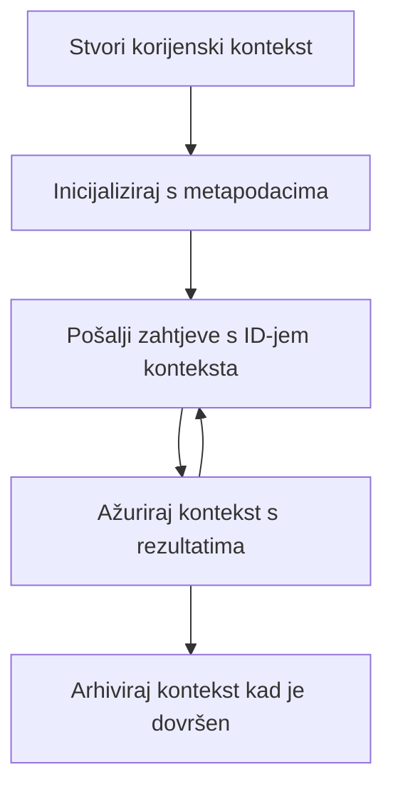

> [ZASTARJELO: IZDANJE KANDIDATA 2026-07-28](https://blog.modelcontextprotocol.io/posts/2026-07-28-release-candidate/#roots-sampling-and-logging-are-deprecated)

# MCP Korijenski Konteksti

> **Obavijest o zastarijevanju:** kandidatsko izdanje specifikacije MCP `2026-07-28` označava Korijene kao zastarjele u korist parametara alata, URI-ja resursa ili konfiguracije poslužitelja. Korijeni nastavljaju raditi u `2025-11-25` i barem godinu dana nakon bilo kakvog formalnog zastarijevanja, tako da je sve u ovoj lekciji i dalje valjano - ali novi dizajni poslužitelja trebaju procijeniti zamjenski obrazac. Pogledajte [Što se mijenja u MCP: Izdanje kandidata 2026-07-28](../../01-CoreConcepts/mcp-2026-07-28-release-candidate.md).

Korijenski konteksti temeljni su koncept u Model Context Protocolu koji pružaju trajni sloj za održavanje povijesti razgovora i zajedničkog stanja kroz više zahtjeva i sesija.

## Uvod

U ovoj lekciji istražit ćemo kako stvoriti, upravljati i koristiti korijenske kontekste u MCP-u.

## Ciljevi učenja

Na kraju ove lekcije moći ćete:

- Razumjeti svrhu i strukturu korijenskih konteksta
- Stvoriti i upravljati korijenskim kontekstima koristeći MCP klijentske biblioteke
- Implementirati korijenske kontekte u .NET, Java, JavaScript i Python aplikacijama
- Iskoristiti korijenske kontekte za višekratne razgovore i upravljanje stanjem
- Primijeniti najbolje prakse za upravljanje korijenskim kontekstima

## Razumijevanje korijenskih konteksta

Korijenski konteksti služe kao spremnici koji drže povijest i stanje za niz povezanih interakcija. Oni omogućuju:

- **Postojanost razgovora**: Održavanje koherentnih višekratnih razgovora
- **Upravljanje memorijom**: Pohranu i dohvat informacija kroz interakcije
- **Upravljanje stanjem**: Praćenje napretka u složenim radnim tokovima
- **Dijeljenje konteksta**: Omogućavanje više klijenata da pristupe istom stanju razgovora

U MCP-u, korijenski konteksti imaju ove ključne karakteristike:

- Svaki korijenski kontekst ima jedinstveni identifikator.
- Mogu sadržavati povijest razgovora, korisničke preferencije i druge metapodatke.
- Mogu se stvarati, pristupati im i arhivirati po potrebi.
- Podržavaju detaljnu kontrolu pristupa i dozvole.

## Životni ciklus korijenskog konteksta



## Rad s korijenskim kontekstima

Evo primjera kako stvoriti i upravljati korijenskim kontekstima.

### Implementacija u C#

```csharp
// .NET Example: Root Context Management
using Microsoft.Mcp.Client;
using System;
using System.Threading.Tasks;
using System.Collections.Generic;

public class RootContextExample
{
    private readonly IMcpClient _client;
    private readonly IRootContextManager _contextManager;
    
    public RootContextExample(IMcpClient client, IRootContextManager contextManager)
    {
        _client = client;
        _contextManager = contextManager;
    }
    
    public async Task DemonstrateRootContextAsync()
    {
        // 1. Create a new root context
        var contextResult = await _contextManager.CreateRootContextAsync(new RootContextCreateOptions
        {
            Name = "Customer Support Session",
            Metadata = new Dictionary<string, string>
            {
                ["CustomerName"] = "Acme Corporation",
                ["PriorityLevel"] = "High",
                ["Domain"] = "Cloud Services"
            }
        });
        
        string contextId = contextResult.ContextId;
        Console.WriteLine($"Created root context with ID: {contextId}");
        
        // 2. First interaction using the context
        var response1 = await _client.SendPromptAsync(
            "I'm having issues scaling my web service deployment in the cloud.", 
            new SendPromptOptions { RootContextId = contextId }
        );
        
        Console.WriteLine($"First response: {response1.GeneratedText}");
        
        // Second interaction - the model will have access to the previous conversation
        var response2 = await _client.SendPromptAsync(
            "Yes, we're using containerized deployments with Kubernetes.", 
            new SendPromptOptions { RootContextId = contextId }
        );
        
        Console.WriteLine($"Second response: {response2.GeneratedText}");
        
        // 3. Add metadata to the context based on conversation
        await _contextManager.UpdateContextMetadataAsync(contextId, new Dictionary<string, string>
        {
            ["TechnicalEnvironment"] = "Kubernetes",
            ["IssueType"] = "Scaling"
        });
        
        // 4. Get context information
        var contextInfo = await _contextManager.GetRootContextInfoAsync(contextId);
        
        Console.WriteLine("Context Information:");
        Console.WriteLine($"- Name: {contextInfo.Name}");
        Console.WriteLine($"- Created: {contextInfo.CreatedAt}");
        Console.WriteLine($"- Messages: {contextInfo.MessageCount}");
        
        // 5. When the conversation is complete, archive the context
        await _contextManager.ArchiveRootContextAsync(contextId);
        Console.WriteLine($"Archived context {contextId}");
    }
}
```

U prethodnom kodu smo:

1. Stvorili korijenski kontekst za sesiju korisničke podrške.
1. Poslali više poruka unutar tog konteksta, dopuštajući modelu održavanje stanja.
1. Ažurirali kontekst s relevantnim metapodacima na temelju razgovora.
1. Dohvatili informacije o kontekstu kako bismo razumjeli povijest razgovora.
1. Arhivirali kontekst nakon završetka razgovora.

## Primjer: Implementacija korijenskog konteksta za financijsku analizu

U ovom primjeru stvorit ćemo korijenski kontekst za sesiju financijske analize, pokazujući kako održavati stanje kroz više interakcija.

### Implementacija u Javi

```java
// Java primjer: Implementacija korijenskog konteksta
package com.example.mcp.contexts;

import com.mcp.client.McpClient;
import com.mcp.client.ContextManager;
import com.mcp.models.RootContext;
import com.mcp.models.McpResponse;

import java.util.HashMap;
import java.util.Map;
import java.util.UUID;

public class RootContextsDemo {
    private final McpClient client;
    private final ContextManager contextManager;
    
    public RootContextsDemo(String serverUrl) {
        this.client = new McpClient.Builder()
            .setServerUrl(serverUrl)
            .build();
            
        this.contextManager = new ContextManager(client);
    }
    
    public void demonstrateRootContext() throws Exception {
        // Kreiraj meta podatke konteksta
        Map<String, String> metadata = new HashMap<>();
        metadata.put("projectName", "Financial Analysis");
        metadata.put("userRole", "Financial Analyst");
        metadata.put("dataSource", "Q1 2025 Financial Reports");
        
        // 1. Kreiraj novi korijenski kontekst
        RootContext context = contextManager.createRootContext("Financial Analysis Session", metadata);
        String contextId = context.getId();
        
        System.out.println("Created context: " + contextId);
        
        // 2. Prva interakcija
        McpResponse response1 = client.sendPrompt(
            "Analyze the trends in Q1 financial data for our technology division",
            contextId
        );
        
        System.out.println("First response: " + response1.getGeneratedText());
        
        // 3. Ažuriraj kontekst važnim informacijama dobivenim iz odgovora
        contextManager.addContextMetadata(contextId, 
            Map.of("identifiedTrend", "Increasing cloud infrastructure costs"));
        
        // Druga interakcija - korištenje istog konteksta
        McpResponse response2 = client.sendPrompt(
            "What's driving the increase in cloud infrastructure costs?",
            contextId
        );
        
        System.out.println("Second response: " + response2.getGeneratedText());
        
        // 4. Generiraj sažetak sesije analize
        McpResponse summaryResponse = client.sendPrompt(
            "Summarize our analysis of the technology division financials in 3-5 key points",
            contextId
        );
        
        // Spremi sažetak u meta podatke konteksta
        contextManager.addContextMetadata(contextId, 
            Map.of("analysisSummary", summaryResponse.getGeneratedText()));
            
        // Dohvati ažurirane informacije konteksta
        RootContext updatedContext = contextManager.getRootContext(contextId);
        
        System.out.println("Context Information:");
        System.out.println("- Created: " + updatedContext.getCreatedAt());
        System.out.println("- Last Updated: " + updatedContext.getLastUpdatedAt());
        System.out.println("- Analysis Summary: " + 
            updatedContext.getMetadata().get("analysisSummary"));
            
        // 5. Arhiviraj kontekst kad završiš
        contextManager.archiveContext(contextId);
        System.out.println("Context archived");
    }
}
```

U prethodnom kodu smo:

1. Stvorili korijenski kontekst za sesiju financijske analize.
2. Poslali više poruka unutar tog konteksta, dopuštajući modelu održavanje stanja.
3. Ažurirali kontekst s relevantnim metapodacima na temelju razgovora.
4. Generirali sažetak sesije analize i pohranili ga u metapodatke konteksta.
5. Arhivirali kontekst nakon završetka razgovora.

## Primjer: Upravljanje korijenskim kontekstom

Učinkovito upravljanje korijenskim kontekstima ključno je za održavanje povijesti i stanja razgovora. Ispod je primjer implementacije upravljanja korijenskim kontekstom.

### Implementacija u JavaScriptu

```javascript
// Primjer JavaScripta: Upravljanje MCP Root Kontekstima
const { McpClient, RootContextManager } = require('@mcp/client');

class ContextSession {
  constructor(serverUrl, apiKey = null) {
    // Inicijalizirajte MCP klijenta
    this.client = new McpClient({
      serverUrl,
      apiKey
    });
    
    // Inicijalizirajte upravitelj kontekstom
    this.contextManager = new RootContextManager(this.client);
  }
  
  /**
   * Create a new conversation context
   * @param {string} sessionName - Name of the conversation session
   * @param {Object} metadata - Additional metadata for the context
   * @returns {Promise<string>} - Context ID
   */
  async createConversationContext(sessionName, metadata = {}) {
    try {
      const contextResult = await this.contextManager.createRootContext({
        name: sessionName,
        metadata: {
          ...metadata,
          createdAt: new Date().toISOString(),
          status: 'active'
        }
      });
      
      console.log(`Created root context '${sessionName}' with ID: ${contextResult.id}`);
      return contextResult.id;
    } catch (error) {
      console.error('Error creating root context:', error);
      throw error;
    }
  }
  
  /**
   * Send a message in an existing context
   * @param {string} contextId - The root context ID
   * @param {string} message - The user's message
   * @param {Object} options - Additional options
   * @returns {Promise<Object>} - Response data
   */
  async sendMessage(contextId, message, options = {}) {
    try {
      // Pošaljite poruku koristeći specificirani kontekst
      const response = await this.client.sendPrompt(message, {
        rootContextId: contextId,
        temperature: options.temperature || 0.7,
        allowedTools: options.allowedTools || []
      });
      
      // Po želji spremite važne uvide iz razgovora
      if (options.storeInsights) {
        await this.storeConversationInsights(contextId, message, response.generatedText);
      }
      
      return {
        message: response.generatedText,
        toolCalls: response.toolCalls || [],
        contextId
      };
    } catch (error) {
      console.error(`Error sending message in context ${contextId}:`, error);
      throw error;
    }
  }
  
  /**
   * Store important insights from a conversation
   * @param {string} contextId - The root context ID
   * @param {string} userMessage - User's message
   * @param {string} aiResponse - AI's response
   */
  async storeConversationInsights(contextId, userMessage, aiResponse) {
    try {
      // Izvucite potencijalne uvide (u stvarnoj aplikaciji to bi bilo sofisticiranije)
      const combinedText = userMessage + "\n" + aiResponse;
      
      // Jednostavan heuristički pristup za prepoznavanje potencijalnih uvida
      const insightWords = ["important", "key point", "remember", "significant", "crucial"];
      
      const potentialInsights = combinedText
        .split(".")
        .filter(sentence => 
          insightWords.some(word => sentence.toLowerCase().includes(word))
        )
        .map(sentence => sentence.trim())
        .filter(sentence => sentence.length > 10);
      
      // Spremite uvide u metapodatke konteksta
      if (potentialInsights.length > 0) {
        const insights = {};
        potentialInsights.forEach((insight, index) => {
          insights[`insight_${Date.now()}_${index}`] = insight;
        });
        
        await this.contextManager.updateContextMetadata(contextId, insights);
        console.log(`Stored ${potentialInsights.length} insights in context ${contextId}`);
      }
    } catch (error) {
      console.warn('Error storing conversation insights:', error);
      // Nije kritična pogreška, pa samo zabilježite upozorenje
    }
  }
  
  /**
   * Get summary information about a context
   * @param {string} contextId - The root context ID
   * @returns {Promise<Object>} - Context information
   */
  async getContextInfo(contextId) {
    try {
      const contextInfo = await this.contextManager.getContextInfo(contextId);
      
      return {
        id: contextInfo.id,
        name: contextInfo.name,
        created: new Date(contextInfo.createdAt).toLocaleString(),
        lastUpdated: new Date(contextInfo.lastUpdatedAt).toLocaleString(),
        messageCount: contextInfo.messageCount,
        metadata: contextInfo.metadata,
        status: contextInfo.status
      };
    } catch (error) {
      console.error(`Error getting context info for ${contextId}:`, error);
      throw error;
    }
  }
  
  /**
   * Generate a summary of the conversation in a context
   * @param {string} contextId - The root context ID
   * @returns {Promise<string>} - Generated summary
   */
  async generateContextSummary(contextId) {
    try {
      // Zamolite model da generira sažetak dosadašnjeg razgovora
      const response = await this.client.sendPrompt(
        "Please summarize our conversation so far in 3-4 sentences, highlighting the main points discussed.",
        { rootContextId: contextId, temperature: 0.3 }
      );
      
      // Spremite sažetak u metapodatke konteksta
      await this.contextManager.updateContextMetadata(contextId, {
        conversationSummary: response.generatedText,
        summarizedAt: new Date().toISOString()
      });
      
      return response.generatedText;
    } catch (error) {
      console.error(`Error generating context summary for ${contextId}:`, error);
      throw error;
    }
  }
  
  /**
   * Archive a context when it's no longer needed
   * @param {string} contextId - The root context ID
   * @returns {Promise<Object>} - Result of the archive operation
   */
  async archiveContext(contextId) {
    try {
      // Generirajte završni sažetak prije arhiviranja
      const summary = await this.generateContextSummary(contextId);
      
      // Arhivirajte kontekst
      await this.contextManager.archiveContext(contextId);
      
      return {
        status: "archived",
        contextId,
        summary
      };
    } catch (error) {
      console.error(`Error archiving context ${contextId}:`, error);
      throw error;
    }
  }
}

// Primjer korištenja
async function demonstrateContextSession() {
  const session = new ContextSession('https://mcp-server-example.com');
  
  try {
    // 1. Kreirajte novi kontekst za razgovor o podršci proizvoda
    const contextId = await session.createConversationContext(
      'Product Support - Database Performance',
      {
        customer: 'Globex Corporation',
        product: 'Enterprise Database',
        severity: 'Medium',
        supportAgent: 'AI Assistant'
      }
    );
    
    // 2. Prva poruka u razgovoru
    const response1 = await session.sendMessage(
      contextId,
      "I'm experiencing slow query performance on our database cluster after the latest update.",
      { storeInsights: true }
    );
    console.log('Response 1:', response1.message);
    
    // Slijedeća poruka u istom kontekstu
    const response2 = await session.sendMessage(
      contextId,
      "Yes, we've already checked the indexes and they seem to be properly configured.",
      { storeInsights: true }
    );
    console.log('Response 2:', response2.message);
    
    // 3. Dohvatite informacije o kontekstu
    const contextInfo = await session.getContextInfo(contextId);
    console.log('Context Information:', contextInfo);
    
    // 4. Generirajte i prikažite sažetak razgovora
    const summary = await session.generateContextSummary(contextId);
    console.log('Conversation Summary:', summary);
    
    // 5. Arhivirajte kontekst kada završite
    const archiveResult = await session.archiveContext(contextId);
    console.log('Archive Result:', archiveResult);
    
    // 6. Rukujte eventualnim pogreškama na uredan način
  } catch (error) {
    console.error('Error in context session demonstration:', error);
  }
}

demonstrateContextSession();
```

U prethodnom kodu smo:

1. Stvorili korijenski kontekst za razgovor o podršci proizvoda s funkcijom `createConversationContext`. U ovom slučaju, kontekst je o problemima s performansama baze podataka.

1. Poslali više poruka unutar tog konteksta, dopuštajući modelu održavanje stanja s funkcijom `sendMessage`. Poruke su o sporim upitima i konfiguraciji indeksa.

1. Ažurirali kontekst s relevantnim metapodacima na temelju razgovora.

1. Generirali sažetak razgovora i pohranili ga u metapodatke konteksta funkcijom `generateContextSummary`.

1. Arhivirali kontekst nakon završetka razgovora koristeći funkciju `archiveContext`.

1. Handlirali greške na elegantan način radi osiguravanja robusnosti.

## Korijenski kontekst za višeokretalnu pomoć

U ovom primjeru stvorit ćemo korijenski kontekst za sesiju višekratne pomoći, pokazujući kako održavati stanje kroz više interakcija.

### Implementacija u Pythonu

```python
# Python primjer: Korijenski kontekst za višekratnu pomoć
import asyncio
from datetime import datetime
from mcp_client import McpClient, RootContextManager

class AssistantSession:
    def __init__(self, server_url, api_key=None):
        self.client = McpClient(server_url=server_url, api_key=api_key)
        self.context_manager = RootContextManager(self.client)
    
    async def create_session(self, name, user_info=None):
        """Create a new root context for an assistant session"""
        metadata = {
            "session_type": "assistant",
            "created_at": datetime.now().isoformat(),
        }
        
        # Dodaj informacije o korisniku ako su dostupne
        if user_info:
            metadata.update({f"user_{k}": v for k, v in user_info.items()})
            
        # Kreiraj korijenski kontekst
        context = await self.context_manager.create_root_context(name, metadata)
        return context.id
    
    async def send_message(self, context_id, message, tools=None):
        """Send a message within a root context"""
        # Kreiraj opcije s ID-om konteksta
        options = {
            "root_context_id": context_id
        }
        
        # Dodaj alate ako su navedeni
        if tools:
            options["allowed_tools"] = tools
        
        # Pošalji upit unutar konteksta
        response = await self.client.send_prompt(message, options)
        
        # Ažuriraj metapodatke konteksta s napretkom razgovora
        await self.context_manager.update_context_metadata(
            context_id,
            {
                f"message_{datetime.now().timestamp()}": message[:50] + "...",
                "last_interaction": datetime.now().isoformat()
            }
        )
        
        return response
    
    async def get_conversation_history(self, context_id):
        """Retrieve conversation history from a context"""
        context_info = await self.context_manager.get_context_info(context_id)
        messages = await self.client.get_context_messages(context_id)
        
        return {
            "context_info": context_info,
            "messages": messages
        }
    
    async def end_session(self, context_id):
        """End an assistant session by archiving the context"""
        # Prvo generiraj sažetak upita
        summary_response = await self.client.send_prompt(
            "Please summarize our conversation and any key points or decisions made.",
            {"root_context_id": context_id}
        )
        
        # Pohrani sažetak u metapodatke
        await self.context_manager.update_context_metadata(
            context_id,
            {
                "summary": summary_response.generated_text,
                "ended_at": datetime.now().isoformat(),
                "status": "completed"
            }
        )
        
        # Arhiviraj kontekst
        await self.context_manager.archive_context(context_id)
        
        return {
            "status": "completed",
            "summary": summary_response.generated_text
        }

# Primjer korištenja
async def demo_assistant_session():
    assistant = AssistantSession("https://mcp-server-example.com")
    
    # 1. Kreiraj sesiju
    context_id = await assistant.create_session(
        "Technical Support Session",
        {"name": "Alex", "technical_level": "advanced", "product": "Cloud Services"}
    )
    print(f"Created session with context ID: {context_id}")
    
    # 2. Prva interakcija
    response1 = await assistant.send_message(
        context_id, 
        "I'm having trouble with the auto-scaling feature in your cloud platform.",
        ["documentation_search", "diagnostic_tool"]
    )
    print(f"Response 1: {response1.generated_text}")
    
    # Druga interakcija u istom kontekstu
    response2 = await assistant.send_message(
        context_id,
        "Yes, I've already checked the configuration settings you mentioned, but it's still not working."
    )
    print(f"Response 2: {response2.generated_text}")
    
    # 3. Dohvati povijest
    history = await assistant.get_conversation_history(context_id)
    print(f"Session has {len(history['messages'])} messages")
    
    # 4. Završi sesiju
    end_result = await assistant.end_session(context_id)
    print(f"Session ended with summary: {end_result['summary']}")

if __name__ == "__main__":
    asyncio.run(demo_assistant_session())
```

U prethodnom kodu smo:

1. Stvorili korijenski kontekst za sesiju tehničke podrške s funkcijom `create_session`. Kontekst uključuje informacije o korisniku kao što su ime i tehnička razina.

1. Poslali više poruka unutar tog konteksta, dopuštajući modelu održavanje stanja s funkcijom `send_message`. Poruke su o problemima s funkcijom automatskog skaliranja.

1. Dohvatili povijest razgovora funkcijom `get_conversation_history`, koja pruža informacije o kontekstu i porukama.

1. Završili sesiju arhiviranjem konteksta i generiranjem sažetka funkcijom `end_session`. Sažetak hvata ključne točke iz razgovora.

## Najbolje prakse za korijenske kontekste

Evo nekoliko najboljih praksi za učinkovito upravljanje korijenskim kontekstima:

- **Stvarajte fokusirane kontekste**: Stvarajte odvojene korijenske kontekte za različite svrhe razgovora ili domene radi jasnoće.

- **Postavite politike isteka**: Implementirajte politike za arhiviranje ili brisanje starih konteksta radi upravljanja pohranom i usklađenosti s pravilima zadržavanja podataka.

- **Pohranite relevantne metapodatke**: Koristite metapodatke konteksta za pohranu važnih informacija o razgovoru koje bi mogle biti korisne kasnije.

- **Dosljedno koristite ID konteksta**: Kada je kontekst stvoren, dosljedno koristite njegov ID za sve povezane zahtjeve radi održavanja kontinuiteta.

- **Generirajte sažetke**: Kada kontekst postane veliki, razmotrite generiranje sažetaka za hvatanje esencijalnih informacija uz upravljanje veličinom konteksta.

- **Primijenite kontrolu pristupa**: Za sustave s više korisnika implementirajte odgovarajuće kontrole pristupa kako biste osigurali privatnost i sigurnost konteksta razgovora.

- **Nosite se s ograničenjima konteksta**: Budite svjesni ograničenja veličine konteksta i implementirajte strategije za rukovanje vrlo dugim razgovorima.

- **Arhivirajte po završetku**: Arhivirajte kontekste kada su razgovori završeni radi oslobađanja resursa uz očuvanje povijesti razgovora.

## Što slijedi

- [5.5 Usmjeravanje](../mcp-routing/README.md)

---

<!-- CO-OP TRANSLATOR DISCLAIMER START -->
**Napomena**:
Ovaj dokument je preveden korištenjem AI prevoditeljskog servisa [Co-op Translator](https://github.com/Azure/co-op-translator). Iako težimo točnosti, imajte na umu da automatski prijevodi mogu sadržavati greške ili netočnosti. Izvorni dokument na izvornom jeziku treba smatrati autoritativnim izvorom. Za važne informacije preporuča se profesionalni ljudski prijevod. Nismo odgovorni za bilo kakva nesporazumevanja ili pogrešne interpretacije koje proizlaze iz korištenja ovog prijevoda.
<!-- CO-OP TRANSLATOR DISCLAIMER END -->