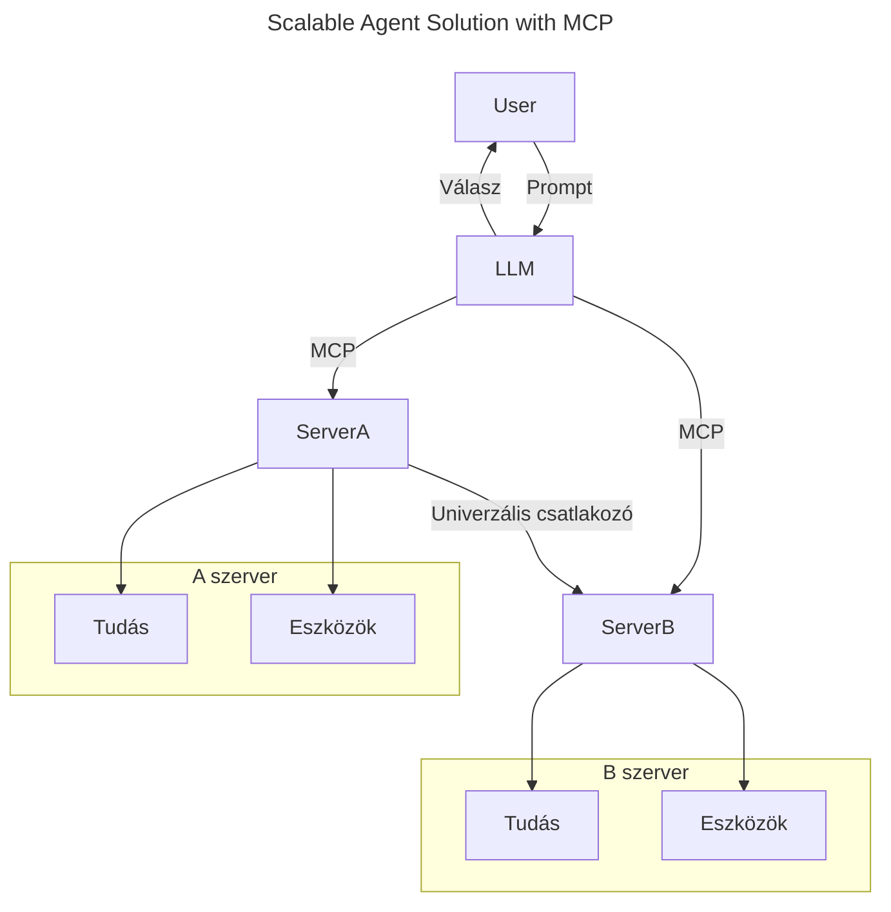
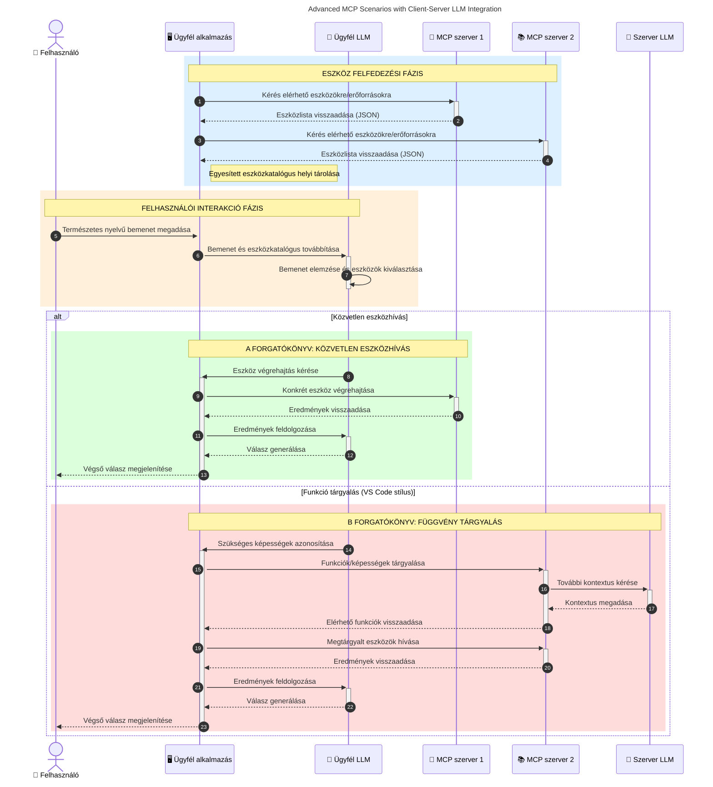

# Bevezetés a Model Context Protocol-ba (MCP): Miért fontos a skálázható AI alkalmazások számára

[](https://youtu.be/agBbdiOPLQA)

_(Kattintson a fenti képre a lecke videójának megtekintéséhez)_

A generatív AI alkalmazások nagy előrelépést jelentenek, mivel gyakran lehetővé teszik a felhasználó számára, hogy természetes nyelvi utasításokkal lépjen interakcióba az alkalmazással. Azonban, ahogy egyre több időt és erőforrást fektetnek ezekbe az alkalmazásokba, fontos, hogy könnyedén integrálhassunk funkciókat és erőforrásokat úgy, hogy az könnyen bővíthető legyen, az alkalmazás egyszerre több modellt tudjon kezelni, és kezelje a különféle modellbeli részleteket. Röviden: a generatív AI alkalmazások építése kezdetben könnyű, de ahogy nőnek és összetettebbé válnak, meg kell kezdeni egy architektúra meghatározását, és valószínűleg egy szabványra kell támaszkodni annak érdekében, hogy az alkalmazások egységes módon épüljenek fel. Ebben segít az MCP, hogy szervezetten működjön és szabványt biztosítson.

---

## **🔍 Mi az a Model Context Protocol (MCP)?**

A **Model Context Protocol (MCP)** egy **nyílt, szabványosított interfész**, amely lehetővé teszi a nagy nyelvi modellek (LLM-ek) zökkenőmentes kommunikációját külső eszközökkel, API-kkal és adatforrásokkal. Egy egységes architektúrát nyújt, amely meghaladja az AI modellek tanító adatait, így okosabbá, skálázhatóbbá és reagálóképesebbé teszi az AI rendszereket.

---

## **🎯 Miért fontos a szabványosítás az AI-ban**

Ahogy a generatív AI alkalmazások egyre összetettebbé válnak, elengedhetetlen szabványokat alkalmazni, amelyek biztosítják a **skálázhatóságot, bővíthetőséget, karbantarthatóságot** és az **eladói lekötés elkerülését**. Az MCP ezekre a kihívásokra ad választ azáltal, hogy:

- Egyesíti a modell-eszköz integrációkat
- Csökkenti a törékeny, egyedi megoldásokat
- Lehetővé teszi több különböző gyártó modelljeinek egyidejű létezését egy ökoszisztémán belül

**Megjegyzés:** Az MCP ugyan nyílt szabványként pozícionálja magát, de nincs terv arra, hogy az IEEE, IETF, W3C, ISO vagy bármely más szabványosító testület által szabványosított legyen.

---

## **📚 Tanulási célok**

A cikk végére képes lesz:

- Meghatározni a **Model Context Protocol (MCP)** fogalmát és felhasználási eseteit
- Megérteni, hogyan szabványosítja az MCP a modell-eszköz kommunikációt
- Azonosítani az MCP architektúra fő komponenseit
- Felfedezni az MCP valós alkalmazásait vállalati és fejlesztői környezetben

---

## **💡 Miért tartják a Model Context Protocolt (MCP) forradalminak**

### **🔗 Az MCP megoldja az AI interakciók fragmentációját**

Az MCP előtt a modellek és eszközök integrálása a következőket igényelte:

- Egyedi kód minden eszköz-modell pároshoz
- Nem szabványos API-k minden egyes gyártónál
- Gyakori megszakadások a frissítések miatt
- Rossz skálázhatóság több eszközzel

### **✅ Az MCP szabványosításának előnyei**

| **Előny**             | **Leírás**                                                                    |
|----------------------|------------------------------------------------------------------------------|
| Interoperabilitás     | LLM-ek zökkenőmentes együttműködése eszközökkel különböző gyártóktól          |
| Következetesség      | Egységes viselkedés platformok és eszközök között                            |
| Újrahasznosíthatóság | Egyszer elkészített eszközök több projektben és rendszerben is használhatók  |
| Gyorsított fejlesztés | Csökkenti a fejlesztési időt szabványos, plug-and-play interfészekkel       |

---

## **🧱 Áttekintés az MCP magas szintű architektúrájáról**

Az MCP **kliens-szerver modellt** követ, ahol:

- **MCP Hostok** futtatják az AI modelleket
- **MCP Kliensek** indítják a kéréseket
- **MCP Szerverek** szolgáltatják a kontextust, eszközöket és képességeket

### **Fő komponensek:**

- **Erőforrások** – Statikus vagy dinamikus adatok a modelleknek  
- **Prompt-ok** – Előre meghatározott munkafolyamatok a generáláshoz  
- **Eszközök** – Végrehajtható függvények, mint keresés, számítások  
- **Mintavételezés** – Ügynöki viselkedés rekurzív interakciók révén (elavult a `2026-07-28` kiadás-jelöltben)
- **Elicitáció** – Szerver által indított felhasználói input kérések
- **Roots** – Fájlrendszer határok a szerver hozzáférés vezérléséhez (elavult a `2026-07-28` kiadás-jelöltben)

### **Protokoll architektúra:**

Az MCP két rétegű architektúrát használ:
- **Adat réteg**: JSON-RPC 2.0 alapú kommunikáció életciklus-kezeléssel és primitívekkel
- **Szállítási réteg**: STDIO (helyi) és stream-elhető HTTP SSE-vel (távoli) kommunikációs csatornák

---

## Hogyan működnek az MCP szerverek

Az MCP szerverek a következő módon működnek:

- **Kérelem folyamata**:
    1. A kérést egy végfelhasználó vagy az ő nevében eljáró szoftver indítja.
    2. Az **MCP kliens** elküldi a kérést egy **MCP hosztnak**, amely az AI modell futtatókörnyezetét kezeli.
    3. Az **AI modell** megkapja a felhasználói utasítást, és kérheti külső eszközök vagy adatok elérését egy vagy több eszközhíváson keresztül.
    4. Az **MCP hoszt**, nem maga a modell, kommunikál a megfelelő **MCP szerver(ek)kel** a szabványos protokoll használatával.
- **MCP hoszt funkciók**:
    - **Eszköznyilvántartás**: Nyilvántartja az elérhető eszközök és képességeik katalógusát.
    - **Hitelesítés**: Ellenőrzi az eszközhozzáférési engedélyeket.
    - **Kérelemkezelő**: Feldolgozza a modellből érkező eszközkéréseket.
    - **Válaszformázó**: Strukturálja az eszköz kimeneteit a modell számára érthető formátumba.
- **MCP szerver végrehajtás**:
    - Az **MCP hoszt** továbbítja az eszközhívásokat egy vagy több, specializált funkciókat kínáló **MCP szervernek** (pl. keresés, számítások, adatbázis lekérdezések).
    - Az **MCP szerverek** végrehajtják a műveleteket és egységes formátumban visszaküldik az eredményeket az **MCP hosztnak**.
    - Az **MCP hoszt** formázza és továbbítja ezeket az eredményeket az **AI modellnek**.
- **Válasz lezárása**:
    - Az **AI modell** beépíti az eszközök kimeneteit a végső válaszba.
    - Az **MCP hoszt** továbbítja ezt a választ az **MCP kliensnek**, amely azt eljuttatja a végfelhasználónak vagy a hívó szoftvernek.
    

```mermaid
---
title: MCP Architecture and Component Interactions
description: A diagram showing the flows of the components in MCP.
---
graph TD
    Client[MCP kliens/alkalmazás] -->|Kérés küldése| H[MCP hoszt]
    H -->|Meghívja| A[AI modell]
    A -->|Eszköz hívás kérése| H
    H -->|MCP Protocol| T1[MCP Server Tool 01: Webes keresés
    H -->|MCP Protocol| T2[MCP Server Tool 02: Számológép eszköz
    H -->|MCP Protocol| T3[MCP Server Tool 03: Adatbázis hozzáférési eszköz
    H -->|MCP Protocol| T4[MCP Server Tool 04: Fájlrendszer eszköz
    H -->|Válasz küldése| Client

    subgraph "MCP hoszt összetevők"
        H
        G[Eszköz regiszter]
        I[Hitelesítés]
        J[Kérés kezelő]
        K[Válasz formázó]
    end

    H <--> G
    H <--> I
    H <--> J
    H <--> K

    style A fill:#f9d5e5,stroke:#333,stroke-width:2px
    style H fill:#eeeeee,stroke:#333,stroke-width:2px
    style Client fill:#d5e8f9,stroke:#333,stroke-width:2px
    style G fill:#fffbe6,stroke:#333,stroke-width:1px
    style I fill:#fffbe6,stroke:#333,stroke-width:1px
    style J fill:#fffbe6,stroke:#333,stroke-width:1px
    style K fill:#fffbe6,stroke:#333,stroke-width:1px
    style T1 fill:#c2f0c2,stroke:#333,stroke-width:1px
    style T2 fill:#c2f0c2,stroke:#333,stroke-width:1px
    style T3 fill:#c2f0c2,stroke:#333,stroke-width:1px
    style T4 fill:#c2f0c2,stroke:#333,stroke-width:1px
```

## 👨‍💻 Hogyan építsünk MCP szervert (példákkal)

Az MCP szerverek lehetővé teszik, hogy bővítsük a LLM képességeit adat- és funkcionalitásszolgáltatással. 

Készen áll kipróbálni? Itt vannak nyelv- és/vagy stack-specifikus SDK-k példákkal, amelyekkel egyszerű MCP szervereket hozhat létre különböző nyelveken/technológiákon:

- **Python SDK**: https://github.com/modelcontextprotocol/python-sdk

- **TypeScript SDK**: https://github.com/modelcontextprotocol/typescript-sdk

- **Java SDK**: https://github.com/modelcontextprotocol/java-sdk

- **C#/.NET SDK**: https://github.com/modelcontextprotocol/csharp-sdk


## 🌍 MCP valós használati esetek

Az MCP lehetővé teszi az AI képességek széles körű kiterjesztését:

| **Alkalmazás**               | **Leírás**                                                                    |
|------------------------------|------------------------------------------------------------------------------|
| Vállalati adat integráció     | LLM-ek csatlakoztatása adatbázisokhoz, CRM-ekhez vagy belső eszközökhöz      |
| Ügynöki AI rendszerek        | Autonóm ügynökök engedélyezése eszköz-hozzáféréssel és döntéshozatali munkafolyamatokkal |
| Többmodalitású alkalmazások  | Szöveg, kép és hang eszközök kombinálása egy egységes AI alkalmazásban        |
| Valós idejű adat integráció  | Élő adatok bevonása AI interakciókba a pontosabb, aktuális eredményekért       |


### 🧠 MCP = Az AI interakciók univerzális szabványa

A Model Context Protocol (MCP) az AI interakciók egyetemes szabványaként működik, hasonlóan ahhoz, ahogy az USB-C szabványosította az eszközök fizikai csatlakozását. Az AI világában az MCP egységes interfészt biztosít, amely lehetővé teszi, hogy a modellek (kliensek) zökkenőmentesen integrálódjanak külső eszközökkel és adatforrás szolgáltatókkal (szerverek). Ez megszünteti az egyes API-k vagy adatforrások különféle, egyedi protokolljainak használatát.

Az MCP alatt az MCP-kompatibilis eszköz (MCP szerverként említve) egy egységes szabványt követ. Ezek a szerverek feltüntethetik az általuk kínált eszközöket vagy műveleteket, és végrehajtják ezeket az AI ügynök kérésére. Az MCP-t támogató AI ügynök platformok képesek felfedezni a szerverek által kínált eszközöket, és szabványos protokollon keresztül meghívni azokat.

### 💡 Megkönnyíti a tudáshoz való hozzáférést

Az eszközök kínálása mellett az MCP támogatja a tudáshoz való hozzáférést is. Lehetővé teszi, hogy az alkalmazások kontextust szolgáltassanak a nagy nyelvi modelleknek (LLM-eknek) különböző adatforrások összekapcsolásával. Például egy MCP szerver egy vállalat dokumentumtárát képviselheti, lehetővé téve az ügynökök számára, hogy igény szerint lekérjenek releváns információkat. Egy másik szerver specifikus műveleteket végezhet, például e-mailek küldését vagy rekordok frissítését. Az ügynök szempontjából ezek egyszerűen eszközök, amelyeket használhat — néhány eszköz adatot (tudásalapú kontextust) szolgáltat, míg mások műveleteket hajtanak végre. Az MCP hatékonyan kezeli mindkettőt.

Az MCP szerverhez kapcsolódó ügynök automatikusan megtanulja a szerver elérhető képességeit és hozzáférhető adatait egy szabványos formátumon keresztül. Ez a szabványosítás dinamikus eszköz elérhetőséget tesz lehetővé. Például egy új MCP szerver hozzáadása az ügynök rendszeréhez azonnal használhatóvá teszi annak funkcióit további testreszabás nélkül.

Ez a gördülékeny integráció illeszkedik a következő ábrán bemutatott folyamathoz, ahol a szerverek egyszerre szolgáltatnak eszközöket és tudást, biztosítva a rendszerek közötti zökkenőmentes együttműködést.

### 👉 Példa: Skálázható ügynök megoldás


Az Universal Connector lehetővé teszi az MCP szerverek közötti kommunikációt és képességek megosztását, így a ServerA feladatokat delegálhat a ServerB-nek, vagy hozzáférhet annak eszközeihez és tudásához. Ez az eszközök és adatok szerverek közti szövetséges rendszerét hozza létre, támogatva a skálázható és moduláris ügynök architektúrákat. Mivel az MCP szabványosítja az eszközök elérhetőségét, az ügynökök dinamikusan fedezhetik fel és irányíthatják a kéréseket a szerverek között anélkül, hogy keménykódolt integrációkra lenne szükség.


Eszköz- és tudáskooperáció: Az eszközök és adatok hozzáférhetők szerverek között, támogatóbbá téve skálázhatóbb és modulárisabb ügynöki architektúrákat.

### 🔄 Fejlett MCP forgatókönyvek kliensoldali LLM integrációval

Az alap MCP architektúrán túl vannak fejlett forgatókönyvek, ahol mind a kliens, mind a szerver tartalmaz LLM-eket, lehetővé téve összetettebb interakciókat. A következő ábrán a **Kliens alkalmazás** lehet egy IDE, amely számos MCP eszköz elérését biztosítja a LLM számára:



## 🔐 Az MCP gyakorlati előnyei

Az MCP használatának gyakorlati előnyei:

- **Frissesség**: A modellek friss, tanító adatokon túli információkhoz férhetnek hozzá
- **Képességbővítés**: A modellek speciális eszközöket használhatnak olyan feladatokhoz, amelyekhez nem volt tréningjük
- **Csökkentett téveszmék**: Külső adatforrások tényalapú megalapozást biztosítanak
- **Adatvédelem**: Érzékeny adatok biztonságban maradhatnak helyi környezetben, nem a promptokban

## 📌 Fontos tanulságok

A következők a legfontosabb tanulságok az MCP használatáról:

- Az **MCP** szabványosítja, hogyan kommunikálnak az AI modellek az eszközökkel és adatokkal
- Támogatja a **bővíthetőséget, következetességet és interoperabilitást**
- Az MCP segít **csökkenteni a fejlesztési időt, növelni a megbízhatóságot és bővíteni a modell képességeit**
- A kliens-szerver architektúra **rugalmas, bővíthető AI alkalmazásokat tesz lehetővé**

## 🧠 Gyakorlat

Gondoljon egy olyan AI alkalmazásra, amely érdekelné, hogy megépítse.

- Milyen **külső eszközök vagy adatok** növelnék a képességeit?
- Hogyan teheti az MCP az integrációt **egyszerűbbé és megbízhatóbbá**?

## További források

- [MCP GitHub tárhely](https://github.com/modelcontextprotocol)


## Mi következik

Következő: [1. fejezet: Alapfogalmak](../01-CoreConcepts/README.md)

---

<!-- CO-OP TRANSLATOR DISCLAIMER START -->
**Jogi nyilatkozat**:
Ez a dokumentum az AI fordítási szolgáltatás, a [Co-op Translator](https://github.com/Azure/co-op-translator) segítségével készült. Bár az pontosságra törekszünk, kérjük, vegye figyelembe, hogy az automatikus fordítások hibákat vagy pontatlanságokat tartalmazhatnak. Az eredeti dokumentum az anyanyelvén tekintendő hiteles forrásnak. Fontos információk esetén professzionális emberi fordítást javasolunk. Nem vállalunk felelősséget semmilyen félreértésért vagy téves értelmezésért, amely ebből a fordításból ered.
<!-- CO-OP TRANSLATOR DISCLAIMER END -->