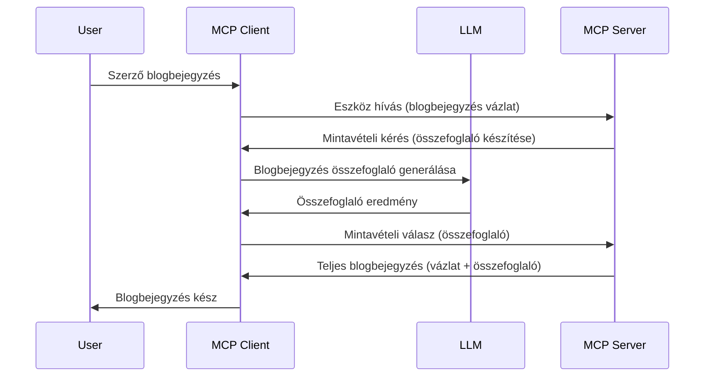

> [ELAVULT: 2026-07-28 KIADÁSI JELÖLT](https://blog.modelcontextprotocol.io/posts/2026-07-28-release-candidate/)

# Mintavételezés - funkciók delegálása az Ügyfélnek

> **Elavulási értesítés:** a `2026-07-28` MCP specifikáció kiadási jelöltje a Mintavételezést elavultnak nyilvánítja a közvetlen integráció javára az LLM szolgáltató API-ival. A Mintavételezés továbbra is működik a `2025-11-25` verzióban és legalább egy évig a formális elavulás után is, így minden, ami ebben a leckében szerepel, érvényes marad — de az új szerverterveknek érdemes megvizsgálniuk a helyettesítő mintázatot. Lásd: [Mi változik az MCP-ben: A 2026-07-28 kiadási jelölt](../../01-CoreConcepts/mcp-2026-07-28-release-candidate.md).

Néha szükség van arra, hogy az MCP Ügyfél és az MCP Szerver együttműködjenek egy közös cél elérése érdekében. Előfordulhat olyan eset, amikor a Szervernek egy az ügyfélen lévő LLM segítségére van szüksége. Ilyen helyzetben a mintavételezést kell használni.

Nézzünk meg néhány felhasználási esetet és azt, hogyan építhetünk megoldást mintavételezéssel.

## Áttekintés

Ebben a leckében arra koncentrálunk, hogy elmagyarázzuk, mikor és hol használjuk a Mintavételezést, és hogyan kell konfigurálni.

## Tanulási célok

Ebben a fejezetben:

- Megmagyarázzuk, mi a Mintavételezés és mikor használjuk.
- Megmutatjuk, hogyan konfiguráljuk a Mintavételezést az MCP-ben.
- Példákat mutatunk a Mintavételezés használatára.

## Mi az a Mintavételezés és miért használjuk?

A Mintavételezés egy fejlett funkció, amely a következő módon működik:



### Mintavételezési kérés

Rendben, most, hogy van egy magas szintű képünk egy hihető forgatókönyvről, beszéljünk a mintavételezési kérésről, amit a szerver küld vissza az ügyfélnek. Így nézhet ki egy ilyen kérés JSON-RPC formátumban:

```json
{
  "jsonrpc": "2.0",
  "id": 1,
  "method": "sampling/createMessage",
  "params": {
    "messages": [
      {
        "role": "user",
        "content": {
          "type": "text",
          "text": "Create a blog post summary of the following blog post: <BLOG POST>"
        }
      }
    ],
    "modelPreferences": {
      "hints": [
        {
          "name": "claude-3-sonnet"
        }
      ],
      "intelligencePriority": 0.8,
      "speedPriority": 0.5
    },
    "systemPrompt": "You are a helpful assistant.",
    "maxTokens": 100
  }
}
```

Itt van néhány fontos dolog, amit érdemes kiemelni:

- A Prompt, a content -> text alatt, a mi promptunk, amely egy utasítás az LLM-nek, hogy foglalja össze a blogbejegyzés tartalmát.

- **modelPreferences**. Ez a rész egy ajánlás, egy javaslat arra vonatkozóan, hogy milyen konfigurációt használjunk az LLM-mel. A felhasználó eldöntheti, hogy elfogadja-e ezeket az ajánlásokat vagy megváltoztatja azokat. Ebben az esetben ajánlások vannak a használni kívánt modellre, valamint a sebesség és intelligencia prioritásra.
- **systemPrompt**, ez a normál rendszerpromptod, ami személyiséget ad az LLM-ednek és tartalmaz útmutató utasításokat.
- **maxTokens**, ez egy másik tulajdonság, amely megmondja, hogy hány token használata javasolt a feladathoz.

### Mintavételezési válasz

Ez a válasz az, amit az MCP Ügyfél küld vissza az MCP Szervernek és az az eredménye, hogy az ügyfél meghívja az LLM-et, megvárja a választ, majd összeállítja ezt az üzenetet. Így nézhet ki JSON-RPC-ban:

```json
{
  "jsonrpc": "2.0",
  "id": 1,
  "result": {
    "role": "assistant",
    "content": {
      "type": "text",
      "text": "Here's your abstract <ABSTRACT>"
    },
    "model": "gpt-5",
    "stopReason": "endTurn"
  }
}
```

Figyeld meg, hogy a válasz egy kivonata a blogbejegyzésnek, pont ahogy kértük. Figyeld meg azt is, hogy a használt `model` nem az, amit kértünk, hanem "gpt-5" a "claude-3-sonnet" helyett. Ez azt illusztrálja, hogy a felhasználó változtathat a használaton és hogy a mintavételezési kérés egy ajánlás.

Rendben, most, hogy értjük a fő folyamatot és hasznos feladatnak a "blogbejegyzés létrehozása + kivonat", nézzük meg, mit kell tennünk, hogy működjön.

### Üzenettípusok

A mintavételezési üzenetek nem csak szövegre korlátozódnak, hanem képeket és hanganyagot is küldhetsz. Így néz ki a JSON-RPC eltérően:

**Szöveg**

```json
{
  "type": "text",
  "text": "The message content"
}
```

**Kép tartalom**

```json
{
  "type": "image",
  "data": "base64-encoded-image-data",
  "mimeType": "image/jpeg"
}
```

**Hang tartalom**

```json
{
  "type": "audio",
  "data": "base64-encoded-audio-data",
  "mimeType": "audio/wav"
}
```

> MEGJEGYZÉS: a Mintavételezésről részletesebb információkat találsz az [hivatalos dokumentációban](https://modelcontextprotocol.io/specification/2025-11-25/client/sampling)

## Hogyan konfiguráljuk a Mintavételezést az Ügyfélen

> Megjegyzés: ha csak szervert építesz, itt nem kell sokat tenned.

Egy ügyfélen a következő funkciót kell megadni így:

```json
{
  "capabilities": {
    "sampling": {}
  }
}
```

Ezt majd a választott ügyfél fogja felvenni, amikor inicializál a szerverrel.

## Példa a Mintavételezés működésére - Blogbejegyzés készítése

Kódoljunk együtt egy mintavételező szervert, a következőket kell tennünk:

1. Hozz létre egy eszközt a Szerveren.
1. Az említett eszköznek mintavételezési kérést kell létrehoznia.
1. Az eszköznek várnia kell az ügyfél mintavételezési kérésére adott válaszra.
1. Ezután elő kell állítani az eszköz eredményét.

Nézzük meg a kódot lépésről lépésre:

### -1- Az eszköz létrehozása

**python**

```python
@mcp.tool()
async def create_blog(title: str, content: str, ctx: Context[ServerSession, None]) -> str:
    """Create a blog post and generate a summary"""

```

### -2- Mintavételezési kérés létrehozása

Bővítsd az eszközt a következő kóddal:

**python**

```python
post = BlogPost(
        id=len(posts) + 1,
        title=title,
        content=content,
        abstract=""
    )

prompt = f"Create an abstract of the following blog post: title: {title} and draft: {content} "

result = await ctx.session.create_message(
        messages=[
            SamplingMessage(
                role="user",
                content=TextContent(type="text", text=prompt),
            )
        ],
        max_tokens=100,
)

```

### -3- Várakozás a válaszra és a válasz visszaadása

**python**

```python
post.abstract = result.content.text

posts.append(post)

# adja vissza a teljes terméket
return json.dumps({
    "id": post.title,
    "abstract": post.abstract
})
```

### -4- Teljes kód

**python**

```python
from starlette.applications import Starlette
from starlette.routing import Mount, Host

from mcp.server.fastmcp import Context, FastMCP

from mcp.server.session import ServerSession
from mcp.types import SamplingMessage, TextContent

import json


from uuid import uuid4
from typing import List
from pydantic import BaseModel


mcp = FastMCP("Blog post generator")

# app = FastAPI()

posts = []

class BlogPost(BaseModel):
    id: int
    title: str
    content: str
    abstract: str

posts: List[BlogPost] = []

@mcp.tool()
async def create_blog(title: str, content: str, ctx: Context[ServerSession, None]) -> str:
    """Create a blog post and generate a summary"""

    post = BlogPost(
        id=len(posts) + 1,
        title=title,
        content=content,
        abstract=""
    )

    prompt = f"Create an abstract of the following blog post: title: {title} and draft: {content} "

    result = await ctx.session.create_message(
        messages=[
            SamplingMessage(
                role="user",
                content=TextContent(type="text", text=prompt),
            )
        ],
        max_tokens=100,
    )

    post.abstract = result.content.text

    posts.append(post)

    # térjen vissza a teljes blogbejegyzéshez
    return json.dumps({
        "id": post.title,
        "abstract": post.abstract
    })

if __name__ == "__main__":
    print("Starting server...")
    # mcp.run()
    mcp.run(transport="streamable-http")

# futtassa az alkalmazást ezzel: python server.py
```

### -5- Tesztelés Visual Studio Code-ban

Ennek teszteléséhez Visual Studio Code-ban a következőt kell tenned:

1. Indítsd el a szervert a terminálban
1. Add hozzá az *mcp.json*-hez (és győződj meg róla, hogy elindult), például így:

   ```json
   "servers": {
      "blog-server": {
        "type": "http",
        "url": "http://localhost:8000/mcp"
      }
   }
   ```

1. Írj egy promptot:

   ```text
   create a blog post named "Where Python comes from", the content is "Python is actually named after Monty Python Flying Circus"
   ```

1. Engedélyezd a mintavételezést. Először, amikor először teszteled, megjelenik egy további párbeszédablak, amit el kell fogadnod, majd a normál párbeszédablakot fogod látni, ami megkér, hogy futtass egy eszközt.

1. Ellenőrizd az eredményeket. Az eredményeket szépen megjelenítve látod a GitHub Copilot Chat-ben, de megtekintheted a nyers JSON választ is.

**Bónusz**. A Visual Studio Code eszközei nagyszerű támogatást nyújtanak a mintavételezéshez. Beállíthatod a Mintavételezés hozzáférést a telepített szerverednél így:

1. Navigálj a bővítmények részhez.
1. Válaszd ki a fogaskerék ikont a telepített szerveredhez az "MCP SZERVEREK - TELEPÍTVE" szekcióban.
1 Válaszd a "Modellhozzáférés konfigurálása" lehetőséget, itt kiválaszthatod, mely modelleket használhatja a GitHub Copilot a mintavételezés során. Megtekintheted az utóbbi időben történt összes mintavételezési kérést is a "Mintavételezési kérések megjelenítése" választásával.

## Feladat

Ebben a feladatban egy kissé más Mintavételezést fogsz építeni, nevezetesen egy olyan mintavételezési integrációt, amely támogatja egy termékleírás generálását. Íme a forgatókönyved:

**Forgatókönyv**: Egy e-kereskedelmi háttéri munkatársnak segítségre van szüksége, mert túl sok időt vesz igénybe a termékleírások generálása. Ezért olyan megoldást kell építened, ahol meghívhatsz egy "create_product" eszközt "title" és "keywords" argumentumokkal, amelynek eredményeként egy teljes termék jön létre egy "description" mezővel, amit az ügyfél LLM-je tölthet ki.

TIPP: Használd azt, amit korábban tanultál, hogy felépítsd ezt a szervert és annak eszközét egy mintavételezési kéréssel.

## Megoldás

[Megoldás](./solution/README.md)

## Fő tanulságok

A Mintavételezés egy erőteljes funkció, amely lehetővé teszi, hogy a szerver feladatokat delegáljon az ügyfélnek, amikor egy LLM segítségére van szüksége.

## Mi következik

- [4. fejezet - Gyakorlati megvalósítás](../../04-PracticalImplementation/README.md)

---

<!-- CO-OP TRANSLATOR DISCLAIMER START -->
**Jogi nyilatkozat**:
Ez a dokumentum az AI fordítási szolgáltatás, a [Co-op Translator](https://github.com/Azure/co-op-translator) segítségével készült. Bár az pontosságra törekszünk, kérjük, vegye figyelembe, hogy az automatikus fordítások hibákat vagy pontatlanságokat tartalmazhatnak. Az eredeti dokumentum az anyanyelvén tekintendő hiteles forrásnak. Fontos információk esetén professzionális emberi fordítást javasolunk. Nem vállalunk felelősséget semmilyen félreértésért vagy téves értelmezésért, amely ebből a fordításból ered.
<!-- CO-OP TRANSLATOR DISCLAIMER END -->