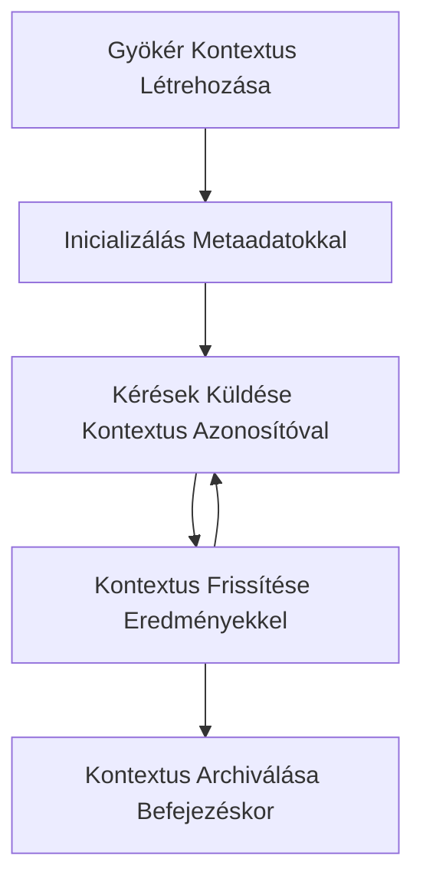

> [ELAVULT: 2026-07-28 KIADÁSI JELÖLT](https://blog.modelcontextprotocol.io/posts/2026-07-28-release-candidate/#roots-sampling-and-logging-are-deprecated)

# MCP Gyökér Kontextusok

> **Elavulási értesítés:** a `2026-07-28` MCP specifikáció kiadási jelöltje a Gyökereket elavultnak jelöli az eszközparaméterek, erőforrás URI-k vagy szerver konfiguráció javára. A Gyökerek továbbra is működnek a `2025-11-25` verzióban, valamint legalább egy évig bármely hivatalos elavulás után, tehát ez a leckében szereplő minden érvényes marad - de az új szerverterveknek érdemes megvizsgálniuk a helyettesítő mintát. Lásd [Mi változik az MCP-ben: a 2026-07-28 Kiadási Jelölt](../../01-CoreConcepts/mcp-2026-07-28-release-candidate.md).

A gyökér kontextusok a Model Context Protocol alapvető fogalmai, amelyek egy kitartó réteget biztosítanak a beszélgetési előzmények és megosztott állapot több kérés és munkamenet közötti fenntartásához.

## Bevezetés

Ebben a leckében megvizsgáljuk, hogyan lehet létrehozni, kezelni és használni gyökér kontextusokat az MCP-ben.

## Tanulási célok

A lecke végére képes lesz:

- Megérteni a gyökér kontextusok célját és szerkezetét
- Létrehozni és kezelni gyökér kontextusokat MCP klienskönyvtárak segítségével
- Megvalósítani gyökér kontextusokat .NET, Java, JavaScript és Python alkalmazásokban
- Használni gyökér kontextusokat többkörös beszélgetésekhez és állapotkezeléshez
- Alkalmazni a legjobb gyakorlatokat a gyökér kontextus kezelésében

## A Gyökér Kontextusok megértése

A gyökér kontextusok konténerekként szolgálnak, amelyek tartalmazzák a kapcsolódó interakciók sorozatának előzményeit és állapotát. Ezek lehetővé teszik:

- **Beszélgetés kitartása**: Koherens többkörös beszélgetések fenntartása
- **Emlékezetkezelés**: Információk tárolása és lekérése interakciók között
- **Állapotkezelés**: Előrehaladás követése összetett munkafolyamatokban
- **Kontextus megosztás**: Lehetővé téve, hogy több kliens hozzáférjen ugyanahhoz a beszélgetési állapothoz

Az MCP-ben a gyökér kontextusoknak ezek a kulcsjellemzői vannak:

- Minden gyökér kontextus egyedi azonosítóval rendelkezik.
- Tartalmazhat beszélgetési előzményeket, felhasználói preferenciákat és egyéb metaadatokat.
- Szükség szerint létrehozhatóak, elérhetőek és archiválhatóak.
- Finomhangolt hozzáférés-szabályozást és jogosultságokat támogatnak.

## A Gyökér Kontextus Élettartama



## Gyökér Kontextusok kezelése

Íme egy példa arra, hogyan lehet létrehozni és kezelni gyökér kontextusokat.

### C# megvalósítás

```csharp
// .NET Example: Root Context Management
using Microsoft.Mcp.Client;
using System;
using System.Threading.Tasks;
using System.Collections.Generic;

public class RootContextExample
{
    private readonly IMcpClient _client;
    private readonly IRootContextManager _contextManager;
    
    public RootContextExample(IMcpClient client, IRootContextManager contextManager)
    {
        _client = client;
        _contextManager = contextManager;
    }
    
    public async Task DemonstrateRootContextAsync()
    {
        // 1. Create a new root context
        var contextResult = await _contextManager.CreateRootContextAsync(new RootContextCreateOptions
        {
            Name = "Customer Support Session",
            Metadata = new Dictionary<string, string>
            {
                ["CustomerName"] = "Acme Corporation",
                ["PriorityLevel"] = "High",
                ["Domain"] = "Cloud Services"
            }
        });
        
        string contextId = contextResult.ContextId;
        Console.WriteLine($"Created root context with ID: {contextId}");
        
        // 2. First interaction using the context
        var response1 = await _client.SendPromptAsync(
            "I'm having issues scaling my web service deployment in the cloud.", 
            new SendPromptOptions { RootContextId = contextId }
        );
        
        Console.WriteLine($"First response: {response1.GeneratedText}");
        
        // Second interaction - the model will have access to the previous conversation
        var response2 = await _client.SendPromptAsync(
            "Yes, we're using containerized deployments with Kubernetes.", 
            new SendPromptOptions { RootContextId = contextId }
        );
        
        Console.WriteLine($"Second response: {response2.GeneratedText}");
        
        // 3. Add metadata to the context based on conversation
        await _contextManager.UpdateContextMetadataAsync(contextId, new Dictionary<string, string>
        {
            ["TechnicalEnvironment"] = "Kubernetes",
            ["IssueType"] = "Scaling"
        });
        
        // 4. Get context information
        var contextInfo = await _contextManager.GetRootContextInfoAsync(contextId);
        
        Console.WriteLine("Context Information:");
        Console.WriteLine($"- Name: {contextInfo.Name}");
        Console.WriteLine($"- Created: {contextInfo.CreatedAt}");
        Console.WriteLine($"- Messages: {contextInfo.MessageCount}");
        
        // 5. When the conversation is complete, archive the context
        await _contextManager.ArchiveRootContextAsync(contextId);
        Console.WriteLine($"Archived context {contextId}");
    }
}
```

A fenti kódban a következőket tettük:

1. Létrehoztunk egy gyökér kontextust egy ügyfélszolgálati munkamenethez.
1. Több üzenetet küldtünk ebben a kontextusban, lehetővé téve a modell számára az állapot fenntartását.
1. Frissítettük a kontextust a beszélgetés alapján releváns metaadatokkal.
1. Lekértük a kontextus információkat a beszélgetés előzményeinek megértéséhez.
1. Archiváltuk a kontextust, amikor a beszélgetés befejeződött.

## Példa: Gyökér Kontextus megvalósítása pénzügyi elemzéshez

Ebben a példában egy gyökér kontextust hozunk létre egy pénzügyi elemzési munkamenethez, bemutatva, hogyan lehet fenntartani az állapotot több interakción keresztül.

### Java megvalósítás

```java
// Java példa: Gyökér kontextus megvalósítása
package com.example.mcp.contexts;

import com.mcp.client.McpClient;
import com.mcp.client.ContextManager;
import com.mcp.models.RootContext;
import com.mcp.models.McpResponse;

import java.util.HashMap;
import java.util.Map;
import java.util.UUID;

public class RootContextsDemo {
    private final McpClient client;
    private final ContextManager contextManager;
    
    public RootContextsDemo(String serverUrl) {
        this.client = new McpClient.Builder()
            .setServerUrl(serverUrl)
            .build();
            
        this.contextManager = new ContextManager(client);
    }
    
    public void demonstrateRootContext() throws Exception {
        // Kontextus metaadatok létrehozása
        Map<String, String> metadata = new HashMap<>();
        metadata.put("projectName", "Financial Analysis");
        metadata.put("userRole", "Financial Analyst");
        metadata.put("dataSource", "Q1 2025 Financial Reports");
        
        // 1. Új gyökér kontextus létrehozása
        RootContext context = contextManager.createRootContext("Financial Analysis Session", metadata);
        String contextId = context.getId();
        
        System.out.println("Created context: " + contextId);
        
        // 2. Első interakció
        McpResponse response1 = client.sendPrompt(
            "Analyze the trends in Q1 financial data for our technology division",
            contextId
        );
        
        System.out.println("First response: " + response1.getGeneratedText());
        
        // 3. Kontextus frissítése a válaszból nyert fontos információkkal
        contextManager.addContextMetadata(contextId, 
            Map.of("identifiedTrend", "Increasing cloud infrastructure costs"));
        
        // Második interakció - ugyanazt a kontextust használva
        McpResponse response2 = client.sendPrompt(
            "What's driving the increase in cloud infrastructure costs?",
            contextId
        );
        
        System.out.println("Second response: " + response2.getGeneratedText());
        
        // 4. Az elemzési munkamenet összefoglalójának generálása
        McpResponse summaryResponse = client.sendPrompt(
            "Summarize our analysis of the technology division financials in 3-5 key points",
            contextId
        );
        
        // Az összefoglaló tárolása a kontextus metaadataiban
        contextManager.addContextMetadata(contextId, 
            Map.of("analysisSummary", summaryResponse.getGeneratedText()));
            
        // Frissített kontextus információ lekérése
        RootContext updatedContext = contextManager.getRootContext(contextId);
        
        System.out.println("Context Information:");
        System.out.println("- Created: " + updatedContext.getCreatedAt());
        System.out.println("- Last Updated: " + updatedContext.getLastUpdatedAt());
        System.out.println("- Analysis Summary: " + 
            updatedContext.getMetadata().get("analysisSummary"));
            
        // 5. A kontextus archiválása a munka befejezésekor
        contextManager.archiveContext(contextId);
        System.out.println("Context archived");
    }
}
```

A fenti kódban a következőket tettük:

1. Létrehoztunk egy gyökér kontextust egy pénzügyi elemzési munkamenethez.
2. Több üzenetet küldtünk ebben a kontextusban, lehetővé téve a modell számára az állapot fenntartását.
3. Frissítettük a kontextust a beszélgetés alapján releváns metaadatokkal.
4. Egy összefoglalót készítettünk az elemzési munkamenetről, és eltároltuk a kontextus metaadatai között.
5. Archiváltuk a kontextust, amikor a beszélgetés befejeződött.

## Példa: Gyökér Kontextus kezelés

A gyökér kontextusok hatékony kezelése kulcsfontosságú a beszélgetési előzmények és állapot fenntartásához. Az alábbiakban egy példa arra, hogyan lehet megvalósítani a gyökér kontextus kezelést.

### JavaScript megvalósítás  

```javascript
// JavaScript példa: MCP gyökér kontextusok kezelése
const { McpClient, RootContextManager } = require('@mcp/client');

class ContextSession {
  constructor(serverUrl, apiKey = null) {
    // MCP kliens inicializálása
    this.client = new McpClient({
      serverUrl,
      apiKey
    });
    
    // Kontextuskezelő inicializálása
    this.contextManager = new RootContextManager(this.client);
  }
  
  /**
   * Create a new conversation context
   * @param {string} sessionName - Name of the conversation session
   * @param {Object} metadata - Additional metadata for the context
   * @returns {Promise<string>} - Context ID
   */
  async createConversationContext(sessionName, metadata = {}) {
    try {
      const contextResult = await this.contextManager.createRootContext({
        name: sessionName,
        metadata: {
          ...metadata,
          createdAt: new Date().toISOString(),
          status: 'active'
        }
      });
      
      console.log(`Created root context '${sessionName}' with ID: ${contextResult.id}`);
      return contextResult.id;
    } catch (error) {
      console.error('Error creating root context:', error);
      throw error;
    }
  }
  
  /**
   * Send a message in an existing context
   * @param {string} contextId - The root context ID
   * @param {string} message - The user's message
   * @param {Object} options - Additional options
   * @returns {Promise<Object>} - Response data
   */
  async sendMessage(contextId, message, options = {}) {
    try {
      // Üzenet küldése a megadott kontextus használatával
      const response = await this.client.sendPrompt(message, {
        rootContextId: contextId,
        temperature: options.temperature || 0.7,
        allowedTools: options.allowedTools || []
      });
      
      // Opcióként fontos felismerések tárolása a beszélgetésből
      if (options.storeInsights) {
        await this.storeConversationInsights(contextId, message, response.generatedText);
      }
      
      return {
        message: response.generatedText,
        toolCalls: response.toolCalls || [],
        contextId
      };
    } catch (error) {
      console.error(`Error sending message in context ${contextId}:`, error);
      throw error;
    }
  }
  
  /**
   * Store important insights from a conversation
   * @param {string} contextId - The root context ID
   * @param {string} userMessage - User's message
   * @param {string} aiResponse - AI's response
   */
  async storeConversationInsights(contextId, userMessage, aiResponse) {
    try {
      // Potenciális felismerések kinyerése (egy valós alkalmazásban ez kifinomultabb lenne)
      const combinedText = userMessage + "\n" + aiResponse;
      
      // Egyszerű heurisztika potenciális felismerések azonosítására
      const insightWords = ["important", "key point", "remember", "significant", "crucial"];
      
      const potentialInsights = combinedText
        .split(".")
        .filter(sentence => 
          insightWords.some(word => sentence.toLowerCase().includes(word))
        )
        .map(sentence => sentence.trim())
        .filter(sentence => sentence.length > 10);
      
      // Felismerések tárolása a kontextus metaadataiban
      if (potentialInsights.length > 0) {
        const insights = {};
        potentialInsights.forEach((insight, index) => {
          insights[`insight_${Date.now()}_${index}`] = insight;
        });
        
        await this.contextManager.updateContextMetadata(contextId, insights);
        console.log(`Stored ${potentialInsights.length} insights in context ${contextId}`);
      }
    } catch (error) {
      console.warn('Error storing conversation insights:', error);
      // Nem kritikus hiba, ezért csak figyelmeztetés naplózása
    }
  }
  
  /**
   * Get summary information about a context
   * @param {string} contextId - The root context ID
   * @returns {Promise<Object>} - Context information
   */
  async getContextInfo(contextId) {
    try {
      const contextInfo = await this.contextManager.getContextInfo(contextId);
      
      return {
        id: contextInfo.id,
        name: contextInfo.name,
        created: new Date(contextInfo.createdAt).toLocaleString(),
        lastUpdated: new Date(contextInfo.lastUpdatedAt).toLocaleString(),
        messageCount: contextInfo.messageCount,
        metadata: contextInfo.metadata,
        status: contextInfo.status
      };
    } catch (error) {
      console.error(`Error getting context info for ${contextId}:`, error);
      throw error;
    }
  }
  
  /**
   * Generate a summary of the conversation in a context
   * @param {string} contextId - The root context ID
   * @returns {Promise<string>} - Generated summary
   */
  async generateContextSummary(contextId) {
    try {
      // Kérje meg a modellt, hogy generáljon összefoglalót eddigi beszélgetésről
      const response = await this.client.sendPrompt(
        "Please summarize our conversation so far in 3-4 sentences, highlighting the main points discussed.",
        { rootContextId: contextId, temperature: 0.3 }
      );
      
      // Összefoglaló tárolása a kontextus metaadataiban
      await this.contextManager.updateContextMetadata(contextId, {
        conversationSummary: response.generatedText,
        summarizedAt: new Date().toISOString()
      });
      
      return response.generatedText;
    } catch (error) {
      console.error(`Error generating context summary for ${contextId}:`, error);
      throw error;
    }
  }
  
  /**
   * Archive a context when it's no longer needed
   * @param {string} contextId - The root context ID
   * @returns {Promise<Object>} - Result of the archive operation
   */
  async archiveContext(contextId) {
    try {
      // Végső összefoglaló generálása archiválás előtt
      const summary = await this.generateContextSummary(contextId);
      
      // Kontextus archiválása
      await this.contextManager.archiveContext(contextId);
      
      return {
        status: "archived",
        contextId,
        summary
      };
    } catch (error) {
      console.error(`Error archiving context ${contextId}:`, error);
      throw error;
    }
  }
}

// Példa használat
async function demonstrateContextSession() {
  const session = new ContextSession('https://mcp-server-example.com');
  
  try {
    // 1. Új kontextus létrehozása egy terméktámogatási beszélgetéshez
    const contextId = await session.createConversationContext(
      'Product Support - Database Performance',
      {
        customer: 'Globex Corporation',
        product: 'Enterprise Database',
        severity: 'Medium',
        supportAgent: 'AI Assistant'
      }
    );
    
    // 2. Első üzenet a beszélgetésben
    const response1 = await session.sendMessage(
      contextId,
      "I'm experiencing slow query performance on our database cluster after the latest update.",
      { storeInsights: true }
    );
    console.log('Response 1:', response1.message);
    
    // Utókövető üzenet ugyanabban a kontextusban
    const response2 = await session.sendMessage(
      contextId,
      "Yes, we've already checked the indexes and they seem to be properly configured.",
      { storeInsights: true }
    );
    console.log('Response 2:', response2.message);
    
    // 3. Információk lekérése a kontextusról
    const contextInfo = await session.getContextInfo(contextId);
    console.log('Context Information:', contextInfo);
    
    // 4. Beszélgetés összefoglaló generálása és megjelenítése
    const summary = await session.generateContextSummary(contextId);
    console.log('Conversation Summary:', summary);
    
    // 5. Kontextus archiválása a befejezés után
    const archiveResult = await session.archiveContext(contextId);
    console.log('Archive Result:', archiveResult);
    
    // 6. Hibák szelíd kezelése
  } catch (error) {
    console.error('Error in context session demonstration:', error);
  }
}

demonstrateContextSession();
```

A fenti kódban a következőket tettük:

1. Létrehoztunk egy gyökér kontextust egy terméktámogatási beszélgetéshez a `createConversationContext` függvénnyel. Ebben az esetben a kontextus adatbázis teljesítmény problémákról szól.

1. Több üzenetet küldtünk ebben a kontextusban, lehetővé téve a modell számára az állapot fenntartását a `sendMessage` függvénnyel. A küldött üzenetek lassú lekérdezési teljesítményről és index konfigurációról szólnak.

1. Frissítettük a kontextust a beszélgetés alapján releváns metaadatokkal.

1. Egy összefoglalót generáltunk a beszélgetésről, és eltároltuk a kontextus metaadataiban a `generateContextSummary` függvénnyel.

1. Archiváltuk a kontextust, amikor a beszélgetés befejeződött a `archiveContext` függvénnyel.

1. Hiba esetén szépen kezeltük a helyzetet a robosztusság érdekében.

## Gyökér Kontextus többlépéses segítséghez

Ebben a példában létrehozunk egy gyökér kontextust egy többlépéses segítségnyújtási munkamenethez, bemutatva, hogyan lehet fenntartani az állapotot több interakción keresztül.

### Python megvalósítás

```python
# Python példa: Gyökér kontextus többfordulós segítségnyújtáshoz
import asyncio
from datetime import datetime
from mcp_client import McpClient, RootContextManager

class AssistantSession:
    def __init__(self, server_url, api_key=None):
        self.client = McpClient(server_url=server_url, api_key=api_key)
        self.context_manager = RootContextManager(self.client)
    
    async def create_session(self, name, user_info=None):
        """Create a new root context for an assistant session"""
        metadata = {
            "session_type": "assistant",
            "created_at": datetime.now().isoformat(),
        }
        
        # Felhasználói információ hozzáadása, ha meg van adva
        if user_info:
            metadata.update({f"user_{k}": v for k, v in user_info.items()})
            
        # A gyökér kontextus létrehozása
        context = await self.context_manager.create_root_context(name, metadata)
        return context.id
    
    async def send_message(self, context_id, message, tools=None):
        """Send a message within a root context"""
        # Opciók létrehozása kontextus azonosítóval
        options = {
            "root_context_id": context_id
        }
        
        # Eszközök hozzáadása, ha meg vannak adva
        if tools:
            options["allowed_tools"] = tools
        
        # Útmutató elküldése a kontextuson belül
        response = await self.client.send_prompt(message, options)
        
        # Kontextus metaadatainak frissítése a beszélgetés előrehaladásával
        await self.context_manager.update_context_metadata(
            context_id,
            {
                f"message_{datetime.now().timestamp()}": message[:50] + "...",
                "last_interaction": datetime.now().isoformat()
            }
        )
        
        return response
    
    async def get_conversation_history(self, context_id):
        """Retrieve conversation history from a context"""
        context_info = await self.context_manager.get_context_info(context_id)
        messages = await self.client.get_context_messages(context_id)
        
        return {
            "context_info": context_info,
            "messages": messages
        }
    
    async def end_session(self, context_id):
        """End an assistant session by archiving the context"""
        # Először összefoglaló útmutató generálása
        summary_response = await self.client.send_prompt(
            "Please summarize our conversation and any key points or decisions made.",
            {"root_context_id": context_id}
        )
        
        # Összefoglaló tárolása a metaadatokban
        await self.context_manager.update_context_metadata(
            context_id,
            {
                "summary": summary_response.generated_text,
                "ended_at": datetime.now().isoformat(),
                "status": "completed"
            }
        )
        
        # Kontextus archiválása
        await self.context_manager.archive_context(context_id)
        
        return {
            "status": "completed",
            "summary": summary_response.generated_text
        }

# Példa használat
async def demo_assistant_session():
    assistant = AssistantSession("https://mcp-server-example.com")
    
    # 1. Munkamenet létrehozása
    context_id = await assistant.create_session(
        "Technical Support Session",
        {"name": "Alex", "technical_level": "advanced", "product": "Cloud Services"}
    )
    print(f"Created session with context ID: {context_id}")
    
    # 2. Első interakció
    response1 = await assistant.send_message(
        context_id, 
        "I'm having trouble with the auto-scaling feature in your cloud platform.",
        ["documentation_search", "diagnostic_tool"]
    )
    print(f"Response 1: {response1.generated_text}")
    
    # Második interakció ugyanabban a kontextusban
    response2 = await assistant.send_message(
        context_id,
        "Yes, I've already checked the configuration settings you mentioned, but it's still not working."
    )
    print(f"Response 2: {response2.generated_text}")
    
    # 3. Előzmények lekérése
    history = await assistant.get_conversation_history(context_id)
    print(f"Session has {len(history['messages'])} messages")
    
    # 4. Munkamenet befejezése
    end_result = await assistant.end_session(context_id)
    print(f"Session ended with summary: {end_result['summary']}")

if __name__ == "__main__":
    asyncio.run(demo_assistant_session())
```

A fenti kódban a következőket tettük:

1. Létrehoztunk egy gyökér kontextust egy műszaki támogatási munkamenethez a `create_session` függvénnyel. A kontextus tartalmaz felhasználói információkat, például nevet és technikai szintet.

1. Több üzenetet küldtünk ebben a kontextusban, lehetővé téve a modell számára az állapot fenntartását a `send_message` függvénnyel. A küldött üzenetek az automatikus méretezési funkció problémáiról szólnak.

1. Lekértük a beszélgetési előzményeket a `get_conversation_history` függvénnyel, amely kontextus információkat és üzeneteket szolgáltat.

1. Befejeztük a munkamenetet úgy, hogy archiváltuk a kontextust és létrehoztunk egy összefoglalót az `end_session` függvénnyel. Az összefoglaló rögzíti a beszélgetés fő pontjait.

## Gyökér Kontextus legjobb gyakorlatok

Íme néhány legjobb gyakorlat a gyökér kontextusok hatékony kezeléséhez:

- **Fókuszált kontextusok létrehozása**: Külön gyökér kontextusokat hozzon létre különböző beszélgetési célokra vagy területekre a áttekinthetőség érdekében.

- **Lejárati szabályok beállítása**: Vezessen be szabályokat a régi kontextusok archiválására vagy törlésére a tárolás kezelése és az adatmegőrzési szabályok betartása érdekében.

- **Fontos metaadatok tárolása**: Használja a kontextus metaadatait a beszélgetéssel kapcsolatos fontos információk tárolására, amelyek később hasznosak lehetnek.

- **Konzisztens kontextus-azonosító használata**: Miután egy kontextus létrejött, konzisztensen használja annak azonosítóját az összes kapcsolódó kérésnél a folytonosság érdekében.

- **Összefoglalók generálása**: Ha egy kontextus nagyra nő, érdemes összefoglalókat készíteni, hogy rögzítsük a lényeges információkat, miközben kezeljük a kontextus méretét.

- **Hozzáférés-szabályozás megvalósítása**: Többfelhasználós rendszerek esetén valósítson meg megfelelő hozzáférés-ellenőrzést a beszélgetési kontextusok adatvédelme és biztonsága érdekében.

- **Kontextus korlátok kezelése**: Legyen tudatában a kontextus méretbeli korlátainak, és alkalmazzon stratégiákat a nagyon hosszú beszélgetések kezelésére.

- **Archiválás befejezéskor**: Archiválja a kontextusokat, amikor a beszélgetések befejeződnek, hogy felszabadítsa az erőforrásokat, miközben megőrzi a beszélgetési előzményeket.

## Mi következik

- [5.5 Routing](../mcp-routing/README.md)

---

<!-- CO-OP TRANSLATOR DISCLAIMER START -->
**Jogi nyilatkozat**:
Ez a dokumentum az AI fordítási szolgáltatás, a [Co-op Translator](https://github.com/Azure/co-op-translator) segítségével készült. Bár az pontosságra törekszünk, kérjük, vegye figyelembe, hogy az automatikus fordítások hibákat vagy pontatlanságokat tartalmazhatnak. Az eredeti dokumentum az anyanyelvén tekintendő hiteles forrásnak. Fontos információk esetén professzionális emberi fordítást javasolunk. Nem vállalunk felelősséget semmilyen félreértésért vagy téves értelmezésért, amely ebből a fordításból ered.
<!-- CO-OP TRANSLATOR DISCLAIMER END -->