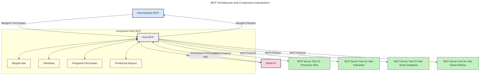
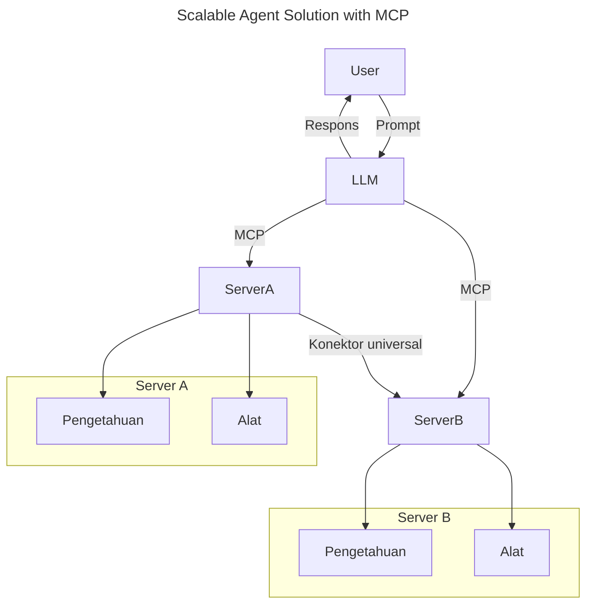
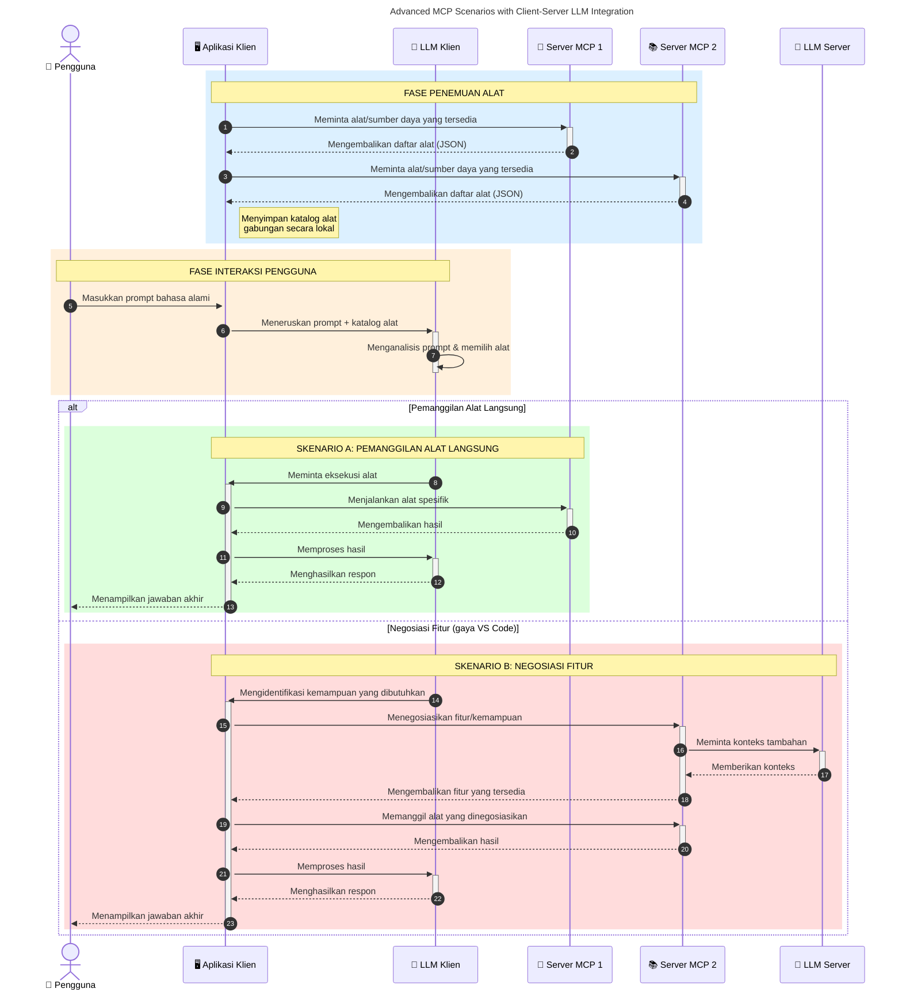

# Pengenalan Protokol Konteks Model (MCP): Mengapa Ini Penting untuk Aplikasi AI yang Skalabel

_(Klik gambar di atas untuk menonton video pelajaran ini)_

Aplikasi AI generatif adalah langkah maju yang besar karena seringkali memungkinkan pengguna berinteraksi dengan aplikasi menggunakan perintah bahasa alami. Namun, seiring waktu dan sumber daya yang semakin banyak diinvestasikan dalam aplikasi seperti ini, Anda ingin memastikan Anda dapat dengan mudah mengintegrasikan fungsi dan sumber daya sedemikian rupa sehingga mudah diperluas, aplikasi Anda dapat melayani lebih dari satu model yang digunakan, dan menangani berbagai kerumitan model. Singkatnya, membangun aplikasi Gen AI mudah dimulai, tetapi seiring pertumbuhan dan kompleksitasnya, Anda perlu mulai mendefinisikan arsitektur dan kemungkinan harus bergantung pada standar untuk memastikan aplikasi Anda dibangun dengan cara yang konsisten. Di sinilah MCP hadir untuk mengatur dan menyediakan standar.

---

## **🔍 Apa Itu Protoko Konteks Model (MCP)?**

**Protoko Konteks Model (MCP)** adalah **antarmuka terbuka dan terstandarisasi** yang memungkinkan Model Bahasa Besar (LLM) berinteraksi dengan lancar dengan alat eksternal, API, dan sumber data. Ini menyediakan arsitektur konsisten untuk meningkatkan fungsi model AI di luar data pelatihannya, memungkinkan sistem AI yang lebih cerdas, skalabel, dan lebih responsif.

---

## **🎯 Mengapa Standarisasi dalam AI Penting**

Seiring aplikasi AI generatif menjadi lebih kompleks, penting untuk mengadopsi standar yang memastikan **skalabilitas, ekstensi, pemeliharaan**, dan **menghindari keterikatan pada vendor**. MCP mengatasi kebutuhan ini dengan:

- Menyatukan integrasi model-alat
- Mengurangi solusi kustom yang rapuh dan satu kali
- Memungkinkan beberapa model dari vendor berbeda eksis dalam satu ekosistem

**Catatan:** Meski MCP mengklaim sebagai standar terbuka, tidak ada rencana untuk menstandarisasi MCP melalui badan standar yang ada seperti IEEE, IETF, W3C, ISO, atau badan standar lainnya.

---

## **📚 Tujuan Pembelajaran**

Pada akhir artikel ini, Anda akan dapat:

- Mendefinisikan **Protoko Konteks Model (MCP)** dan kasus penggunaannya
- Memahami bagaimana MCP menstandarkan komunikasi model-ke-alat
- Mengidentifikasi komponen inti arsitektur MCP
- Mengeksplorasi aplikasi nyata MCP dalam konteks perusahaan dan pengembangan

---

## **💡 Mengapa Protoko Konteks Model (MCP) Merupakan Perubahan Besar**

### **🔗 MCP Mengatasi Fragmentasi dalam Interaksi AI**

Sebelum MCP, mengintegrasikan model dengan alat membutuhkan:

- Kode kustom per pasangan alat-model
- API tidak standar untuk setiap vendor
- Sering terjadi pemutusan karena pembaruan
- Skalabilitas buruk dengan bertambahnya alat

### **✅ Manfaat Standarisasi MCP**

| **Manfaat**              | **Deskripsi**                                                                |
|--------------------------|------------------------------------------------------------------------------|
| Interoperabilitas        | LLM bekerja lancar dengan alat dari berbagai vendor                          |
| Konsistensi              | Perilaku seragam di seluruh platform dan alat                               |
| Dapat Digunakan Kembali  | Alat yang dibuat sekali dapat digunakan di berbagai proyek dan sistem       |
| Percepatan Pengembangan  | Mengurangi waktu pengembangan dengan menggunakan antarmuka standar plug-and-play |

---

## **🧱 Ringkasan Arsitektur MCP Tingkat Tinggi**

MCP mengikuti **model klien-server**, di mana:

- **Host MCP** menjalankan model AI
- **Klien MCP** memulai permintaan
- **Server MCP** menyediakan konteks, alat, dan kapabilitas

### **Komponen Utama:**

- **Sumber Daya** – Data statis atau dinamis untuk model  
- **Prompt** – Alur kerja yang telah ditentukan untuk generasi terpandu  
- **Alat** – Fungsi yang dapat dieksekusi seperti pencarian, perhitungan  
- **Sampling** – Perilaku agen melalui interaksi rekursif (dihapus di kandidat rilis `2026-07-28`)
- **Elicitation** – Permintaan yang dimulai server untuk input pengguna
- **Roots** – Batas sistem berkas untuk kontrol akses server (dihapus di kandidat rilis `2026-07-28`)

### **Arsitektur Protokol:**

MCP menggunakan arsitektur dua lapis:
- **Lapisan Data**: Komunikasi berbasis JSON-RPC 2.0 dengan manajemen siklus hidup dan primitif
- **Lapisan Transport**: Kanal komunikasi STDIO (lokal) dan HTTP Streamable dengan SSE (jauh)

---

## Cara Kerja Server MCP

Server MCP beroperasi dengan cara berikut:

- **Alur Permintaan**:
    1. Permintaan dimulai oleh pengguna akhir atau perangkat lunak yang bertindak atas nama mereka.
    2. **Klien MCP** mengirimkan permintaan ke **Host MCP**, yang mengelola runtime Model AI.
    3. **Model AI** menerima prompt pengguna dan dapat meminta akses ke alat atau data eksternal melalui satu atau lebih panggilan alat.
    4. **Host MCP**, bukan model secara langsung, berkomunikasi dengan **Server MCP** yang sesuai menggunakan protokol standar.
- **Fungsi Host MCP**:
    - **Registri Alat**: Memelihara katalog alat yang tersedia dan kapabilitasnya.
    - **Autentikasi**: Memverifikasi izin akses alat.
    - **Penangkap Permintaan**: Memproses permintaan alat yang masuk dari model.
    - **Penyusun Respons**: Menyusun keluaran alat dalam format yang dapat dipahami model.
- **Eksekusi Server MCP**:
    - **Host MCP** mengarahkan panggilan alat ke satu atau lebih **Server MCP**, masing-masing mengekspose fungsi khusus (misal, pencarian, perhitungan, kueri basis data).
    - **Server MCP** melaksanakan operasi mereka masing-masing dan mengembalikan hasil ke **Host MCP** dalam format yang konsisten.
    - **Host MCP** menyusun dan meneruskan hasil ini ke **Model AI**.
- **Penyelesaian Respons**:
    - **Model AI** menggabungkan keluaran alat ke dalam respons akhir.
    - **Host MCP** mengirim respons ini kembali ke **Klien MCP**, yang menyampaikannya ke pengguna akhir atau perangkat lunak pemanggil.
    

## 👨‍💻 Cara Membangun Server MCP (Dengan Contoh)

Server MCP memungkinkan Anda memperluas kemampuan LLM dengan menyediakan data dan fungsi. 

Siap mencobanya? Berikut adalah SDK spesifik bahasa dan/atau tumpukan dengan contoh membuat server MCP sederhana dalam berbagai bahasa/tumpukan:

- **Python SDK**: https://github.com/modelcontextprotocol/python-sdk

- **TypeScript SDK**: https://github.com/modelcontextprotocol/typescript-sdk

- **Java SDK**: https://github.com/modelcontextprotocol/java-sdk

- **C#/.NET SDK**: https://github.com/modelcontextprotocol/csharp-sdk

## 🌍 Kasus Penggunaan Dunia Nyata untuk MCP

MCP memungkinkan berbagai aplikasi dengan memperluas kapabilitas AI:

| **Aplikasi**              | **Deskripsi**                                                                 |
|--------------------------|-------------------------------------------------------------------------------|
| Integrasi Data Perusahaan| Menghubungkan LLM ke basis data, CRM, atau alat internal                      |
| Sistem AI Agenik         | Memungkinkan agen otonom dengan akses alat dan alur pengambilan keputusan     |
| Aplikasi Multi-modal     | Menggabungkan alat teks, gambar, dan audio dalam satu aplikasi AI terpadu    |
| Integrasi Data Real-time | Membawa data live ke interaksi AI untuk output yang lebih akurat dan terkini |

### 🧠 MCP = Standar Universal untuk Interaksi AI

Protoko Konteks Model (MCP) berperan sebagai standar universal untuk interaksi AI, seperti USB-C yang menstandarisasi koneksi fisik perangkat. Dalam dunia AI, MCP menyediakan antarmuka konsisten, memungkinkan model (klien) terintegrasi secara mulus dengan alat eksternal dan penyedia data (server). Ini menghilangkan kebutuhan protokol khusus yang beragam untuk setiap API atau sumber data.

Di bawah MCP, alat kompatibel MCP (disebut server MCP) mengikuti standar tunggal. Server ini dapat menyebutkan alat atau tindakan yang mereka tawarkan dan mengeksekusi tindakan tersebut saat diminta oleh agen AI. Platform agen AI yang mendukung MCP mampu menemukan alat yang tersedia dari server dan memanggilnya melalui protokol standar ini.

### 💡 Memudahkan akses ke pengetahuan

Selain menawarkan alat, MCP juga memfasilitasi akses ke pengetahuan. Ini memungkinkan aplikasi menyediakan konteks kepada model bahasa besar (LLM) dengan menghubungkannya ke berbagai sumber data. Misalnya, server MCP dapat merepresentasikan repositori dokumen perusahaan, memungkinkan agen mengambil informasi relevan sesuai permintaan. Server lain dapat menangani tindakan khusus seperti mengirim email atau memperbarui catatan. Dari perspektif agen, ini hanyalah alat yang bisa digunakan—beberapa alat mengembalikan data (konteks pengetahuan), sementara yang lain melakukan tindakan. MCP mengelola keduanya dengan efisien.

Agen yang terhubung ke server MCP secara otomatis mempelajari kapabilitas yang tersedia dan data yang dapat diakses server melalui format standar. Standarisasi ini memungkinkan ketersediaan alat secara dinamis. Misalnya, menambah server MCP baru ke sistem agen membuat fungsi tersebut langsung dapat digunakan tanpa perlu kustomisasi lebih lanjut pada instruksi agen.

Integrasi yang lancar ini selaras dengan alur yang digambarkan dalam diagram berikut, di mana server menyediakan alat dan pengetahuan, memastikan kolaborasi mulus antar sistem. 

### 👉 Contoh: Solusi Agen yang Dapat Diskalakan

The Universal Connector memungkinkan server MCP berkomunikasi dan berbagi kapabilitas satu sama lain, memungkinkan ServerA mendelegasikan tugas ke ServerB atau mengakses alat dan pengetahuannya. Ini memfederasi alat dan data di antara server, mendukung arsitektur agen yang skalabel dan modular. Karena MCP menstandarisasi eksposur alat, agen dapat menemukan dan mengarahkan permintaan antar server secara dinamis tanpa integrasi yang dikodekan keras.

Federasi alat dan pengetahuan: Alat dan data dapat diakses di seluruh server, memungkinkan arsitektur agenik yang lebih skalabel dan modular.

### 🔄 Skenario Lanjutan MCP dengan Integrasi LLM di Sisi Klien

Selain arsitektur MCP dasar, terdapat skenario lanjutan di mana baik klien maupun server berisi LLM, memungkinkan interaksi yang lebih canggih. Dalam diagram berikut, **Aplikasi Klien** bisa berupa IDE dengan sejumlah alat MCP yang tersedia untuk digunakan oleh LLM:

## 🔐 Manfaat Praktis MCP

Berikut adalah manfaat praktis menggunakan MCP:

- **Kesegaran**: Model dapat mengakses informasi terkini di luar data pelatihan mereka
- **Perluasan Kapabilitas**: Model dapat memanfaatkan alat khusus untuk tugas yang tidak mereka latih
- **Mengurangi Halusinasi**: Sumber data eksternal menyediakan dasar fakta
- **Privasi**: Data sensitif dapat tetap dalam lingkungan aman alih-alih tertanam dalam prompt

## 📌 Intisari Utama

Berikut adalah intisari utama dalam menggunakan MCP:

- **MCP** menstandarkan cara model AI berinteraksi dengan alat dan data
- Mendorong **ekstensi, konsistensi, dan interoperabilitas**
- MCP membantu **mengurangi waktu pengembangan, meningkatkan keandalan, dan memperluas kapabilitas model**
- Arsitektur klien-server **memungkinkan aplikasi AI yang fleksibel dan dapat diperluas**

## 🧠 Latihan

Pikirkan tentang aplikasi AI yang Anda minati untuk dibangun.

- Alat atau data eksternal apa yang dapat meningkatkan kapabilitasnya?
- Bagaimana MCP dapat membuat integrasi menjadi lebih sederhana dan lebih andal?

## Sumber Tambahan

- [Repositori GitHub MCP](https://github.com/modelcontextprotocol)

## Selanjutnya

Selanjutnya: [Bab 1: Konsep Inti](../01-CoreConcepts/README.md)

---

<!-- CO-OP TRANSLATOR DISCLAIMER START -->
**Penafian**:
Dokumen ini telah diterjemahkan menggunakan layanan terjemahan AI [Co-op Translator](https://github.com/Azure/co-op-translator). Meskipun kami berupaya untuk mencapai akurasi, harap diketahui bahwa terjemahan otomatis mungkin mengandung kesalahan atau ketidakakuratan. Dokumen asli dalam bahasa aslinya harus dianggap sebagai sumber yang sah. Untuk informasi penting, disarankan menggunakan terjemahan profesional oleh manusia. Kami tidak bertanggung jawab atas kesalahpahaman atau penafsiran yang keliru yang timbul dari penggunaan terjemahan ini.
<!-- CO-OP TRANSLATOR DISCLAIMER END -->