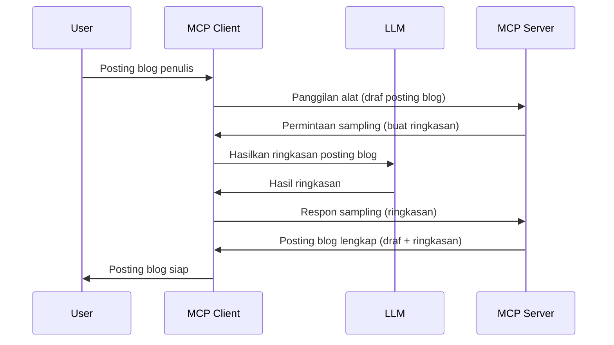

> [TIDAK DIREKOMENDASIKAN LAGI: CALON RILIS 2026-07-28](https://blog.modelcontextprotocol.io/posts/2026-07-28-release-candidate/)

# Sampling - mendelegasikan fitur ke Klien

> **Pemberitahuan penghentian:** kandidat rilis spesifikasi MCP `2026-07-28` menandai Sampling sebagai tidak direkomendasikan lagi demi integrasi langsung dengan API penyedia LLM. Sampling tetap bekerja di `2025-11-25` dan setidaknya selama satu tahun setelah penghentian resmi, jadi semua yang ada dalam pelajaran ini tetap berlaku — tetapi desain server baru harus mengevaluasi pola penggantiannya. Lihat [Apa yang Berubah di MCP: Kandidat Rilis 2026-07-28](../../01-CoreConcepts/mcp-2026-07-28-release-candidate.md).

Kadang-kadang, Anda membutuhkan Klien MCP dan Server MCP untuk berkolaborasi mencapai tujuan bersama. Anda mungkin punya kasus di mana Server membutuhkan bantuan LLM yang ada di klien. Untuk situasi ini, sampling adalah yang harus digunakan.

Mari kita eksplorasi beberapa kasus penggunaan dan cara membangun solusi yang melibatkan sampling.

## Ikhtisar

Dalam pelajaran ini, kita fokus menjelaskan kapan dan di mana menggunakan Sampling serta bagaimana mengonfigurasinya.

## Tujuan Pembelajaran

Dalam bab ini, kita akan:

- Menjelaskan apa itu Sampling dan kapan menggunakannya.
- Menunjukkan cara mengonfigurasi Sampling di MCP.
- Memberikan contoh penerapan Sampling.

## Apa itu Sampling dan mengapa menggunakannya?

Sampling adalah fitur lanjutan yang bekerja dengan cara berikut:



### Permintaan Sampling

Baik, sekarang kita punya gambaran umum skenario yang kredibel, mari kita bahas permintaan sampling yang dikirim server ke klien. Berikut contoh permintaan seperti ini dalam format JSON-RPC:

```json
{
  "jsonrpc": "2.0",
  "id": 1,
  "method": "sampling/createMessage",
  "params": {
    "messages": [
      {
        "role": "user",
        "content": {
          "type": "text",
          "text": "Create a blog post summary of the following blog post: <BLOG POST>"
        }
      }
    ],
    "modelPreferences": {
      "hints": [
        {
          "name": "claude-3-sonnet"
        }
      ],
      "intelligencePriority": 0.8,
      "speedPriority": 0.5
    },
    "systemPrompt": "You are a helpful assistant.",
    "maxTokens": 100
  }
}
```

Ada beberapa hal yang perlu diperhatikan di sini:

- Prompt, di bawah content -> text, adalah prompt kita yang berupa instruksi untuk LLM merangkum isi posting blog.

- **modelPreferences**. Bagian ini hanya preference, rekomendasi konfigurasi apa yang digunakan dengan LLM. Pengguna bisa memilih mengikuti rekomendasi ini atau mengubahnya. Dalam kasus ini ada rekomendasi model yang digunakan dan prioritas kecepatan serta kecerdasan.
- **systemPrompt**, ini adalah prompt sistem normal yang memberi LLM Anda kepribadian dan mengandung instruksi panduan.
- **maxTokens**, ini properti lain yang digunakan untuk memberi tahu berapa banyak token yang direkomendasikan untuk tugas ini.

### Respons Sampling

Respons ini adalah yang akhirnya dikirim Klien MCP kembali ke Server MCP dan merupakan hasil klien memanggil LLM, menunggu respons, kemudian menyusun pesan ini. Berikut contohnya dalam JSON-RPC:

```json
{
  "jsonrpc": "2.0",
  "id": 1,
  "result": {
    "role": "assistant",
    "content": {
      "type": "text",
      "text": "Here's your abstract <ABSTRACT>"
    },
    "model": "gpt-5",
    "stopReason": "endTurn"
  }
}
```

Perhatikan bagaimana respons adalah abstrak posting blog tepat seperti yang kita minta. Juga perhatikan model yang digunakan bukan yang diminta tapi "gpt-5" bukan "claude-3-sonnet". Ini untuk menunjukkan bahwa pengguna bisa mengubah pilihannya dan permintaan sampling Anda adalah rekomendasi.

Baik, sekarang kita mengerti alur utama, dan tugas berguna yang bisa dilakukan yaitu "pembuatan posting blog + abstrak", mari kita lihat apa yang perlu dilakukan agar ini bekerja.

### Jenis pesan

Pesan sampling tidak terbatas pada teks saja tapi Anda juga bisa mengirim gambar dan audio. Berikut bagaimana JSON-RPC berbeda:

**Teks**

```json
{
  "type": "text",
  "text": "The message content"
}
```

**Konten gambar**

```json
{
  "type": "image",
  "data": "base64-encoded-image-data",
  "mimeType": "image/jpeg"
}
```

**Konten audio**

```json
{
  "type": "audio",
  "data": "base64-encoded-audio-data",
  "mimeType": "audio/wav"
}
```

> CATATAN: untuk info lebih detail tentang Sampling, cek [dokumentasi resmi](https://modelcontextprotocol.io/specification/2025-11-25/client/sampling)

## Cara Mengonfigurasi Sampling di Klien

> Catatan: jika Anda hanya membangun server, Anda tidak perlu banyak melakukan di sini.

Di klien, Anda perlu menentukan fitur berikut seperti ini:

```json
{
  "capabilities": {
    "sampling": {}
  }
}
```

Ini kemudian akan diterapkan saat klien pilihan Anda menginisialisasi dengan server.

## Contoh Sampling dalam Praktek - Membuat Postingan Blog

Mari kita buat server sampling bersama, kita perlu melakukan hal berikut:

1. Membuat tool pada Server.
1. Tool ini harus membuat permintaan sampling.
1. Tool harus menunggu jawaban permintaan sampling dari klien.
1. Kemudian hasil tool harus diproduksi.

Mari kita lihat kode langkah demi langkah:

### -1- Membuat tool

**python**

```python
@mcp.tool()
async def create_blog(title: str, content: str, ctx: Context[ServerSession, None]) -> str:
    """Create a blog post and generate a summary"""

```

### -2- Membuat permintaan sampling

Perluas tool Anda dengan kode berikut:

**python**

```python
post = BlogPost(
        id=len(posts) + 1,
        title=title,
        content=content,
        abstract=""
    )

prompt = f"Create an abstract of the following blog post: title: {title} and draft: {content} "

result = await ctx.session.create_message(
        messages=[
            SamplingMessage(
                role="user",
                content=TextContent(type="text", text=prompt),
            )
        ],
        max_tokens=100,
)

```

### -3- Tunggu respons dan kembalikan respons

**python**

```python
post.abstract = result.content.text

posts.append(post)

# kembalikan produk lengkap
return json.dumps({
    "id": post.title,
    "abstract": post.abstract
})
```

### -4- Kode lengkap

**python**

```python
from starlette.applications import Starlette
from starlette.routing import Mount, Host

from mcp.server.fastmcp import Context, FastMCP

from mcp.server.session import ServerSession
from mcp.types import SamplingMessage, TextContent

import json


from uuid import uuid4
from typing import List
from pydantic import BaseModel


mcp = FastMCP("Blog post generator")

# app = FastAPI()

posts = []

class BlogPost(BaseModel):
    id: int
    title: str
    content: str
    abstract: str

posts: List[BlogPost] = []

@mcp.tool()
async def create_blog(title: str, content: str, ctx: Context[ServerSession, None]) -> str:
    """Create a blog post and generate a summary"""

    post = BlogPost(
        id=len(posts) + 1,
        title=title,
        content=content,
        abstract=""
    )

    prompt = f"Create an abstract of the following blog post: title: {title} and draft: {content} "

    result = await ctx.session.create_message(
        messages=[
            SamplingMessage(
                role="user",
                content=TextContent(type="text", text=prompt),
            )
        ],
        max_tokens=100,
    )

    post.abstract = result.content.text

    posts.append(post)

    # mengembalikan posting blog lengkap
    return json.dumps({
        "id": post.title,
        "abstract": post.abstract
    })

if __name__ == "__main__":
    print("Starting server...")
    # mcp.run()
    mcp.run(transport="streamable-http")

# jalankan app dengan: python server.py
```

### -5- Mencobanya di Visual Studio Code

Untuk menguji ini di Visual Studio Code, lakukan hal berikut:

1. Jalankan server di terminal
1. Tambahkan ke *mcp.json* (dan pastikan dijalankan) misalnya seperti ini:

   ```json
   "servers": {
      "blog-server": {
        "type": "http",
        "url": "http://localhost:8000/mcp"
      }
   }
   ```

1. Ketik sebuah prompt:

   ```text
   create a blog post named "Where Python comes from", the content is "Python is actually named after Monty Python Flying Circus"
   ```

1. Izinkan sampling berjalan. Pertama kali Anda menguji ini Anda akan mendapat dialog tambahan yang harus Anda setujui, kemudian Anda akan melihat dialog normal yang meminta Anda menjalankan tool

1. Periksa hasil. Anda akan melihat hasilnya dirender dengan baik di GitHub Copilot Chat tapi Anda juga bisa memeriksa respons JSON mentahnya.

**Bonus**. Alat Visual Studio Code memiliki dukungan bagus untuk sampling. Anda bisa mengonfigurasikan akses Sampling pada server terpasang Anda dengan menavigasi seperti ini:

1. Arahkan ke bagian ekstensi.
1. Pilih ikon roda gigi untuk server terpasang Anda di bagian "MCP SERVERS - INSTALLED".
1 Pilih "Configure Model Access", di sini Anda bisa memilih Model mana yang diizinkan GitHub Copilot gunakan saat melakukan sampling. Anda juga bisa melihat semua permintaan sampling yang terjadi belakangan dengan memilih "Show Sampling requests".

## Tugas

Dalam tugas ini, Anda akan membangun Sampling yang sedikit berbeda yakni integrasi sampling yang mendukung pembuatan deskripsi produk. Berikut skenario Anda:

**Skenario**: Pekerja back office di e-commerce butuh bantuan, terlalu lama membuat deskripsi produk. Oleh karena itu, Anda akan membuat solusi di mana Anda bisa memanggil tool "create_product" dengan argumen "title" dan "keywords" dan tool ini akan menghasilkan produk lengkap termasuk field "description" yang harus diisi oleh LLM klien.

TIP: gunakan apa yang Anda pelajari sebelumnya untuk membangun server dan tool ini menggunakan permintaan sampling.

## Solusi

[Solusi](./solution/README.md)

## Poin Penting

Sampling adalah fitur kuat yang memungkinkan server mendelegasikan tugas ke klien ketika membutuhkan bantuan LLM.

## Selanjutnya

- [Bab 4 - Implementasi Praktis](../../04-PracticalImplementation/README.md)

---

<!-- CO-OP TRANSLATOR DISCLAIMER START -->
**Penafian**:
Dokumen ini telah diterjemahkan menggunakan layanan terjemahan AI [Co-op Translator](https://github.com/Azure/co-op-translator). Meskipun kami berupaya untuk mencapai akurasi, harap diketahui bahwa terjemahan otomatis mungkin mengandung kesalahan atau ketidakakuratan. Dokumen asli dalam bahasa aslinya harus dianggap sebagai sumber yang sah. Untuk informasi penting, disarankan menggunakan terjemahan profesional oleh manusia. Kami tidak bertanggung jawab atas kesalahpahaman atau penafsiran yang keliru yang timbul dari penggunaan terjemahan ini.
<!-- CO-OP TRANSLATOR DISCLAIMER END -->