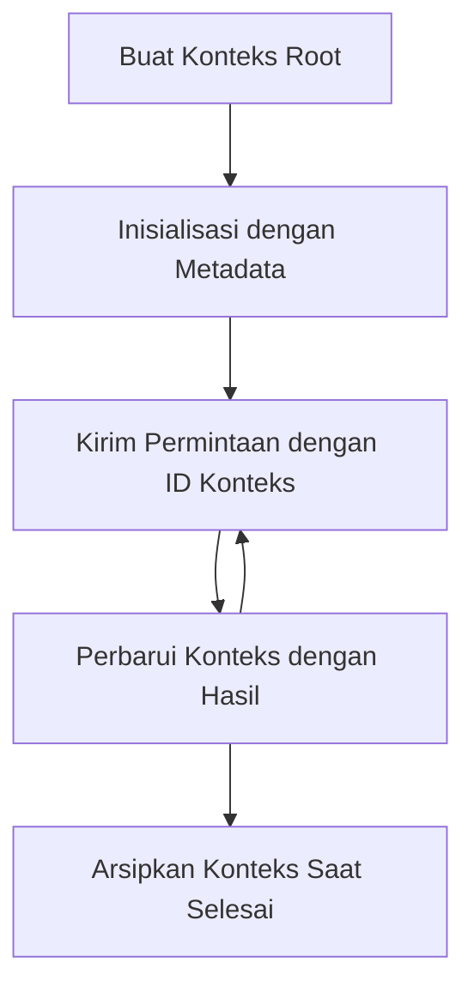

> [DIBERHENTIKAN: KANDIDAT RILIS 2026-07-28](https://blog.modelcontextprotocol.io/posts/2026-07-28-release-candidate/#roots-sampling-and-logging-are-deprecated)

# Konteks Root MCP

> **Pemberitahuan penghentian:** kandidat rilis spesifikasi MCP `2026-07-28` menandai Roots sebagai deprecated demi parameter alat, URI sumber daya, atau konfigurasi server. Roots tetap berfungsi pada `2025-11-25` dan setidaknya selama satu tahun setelah penghentian resmi, jadi semua dalam pelajaran ini tetap valid - namun desain server baru sebaiknya mengevaluasi pola penggantinya. Lihat [Apa yang Berubah dalam MCP: Kandidat Rilis 2026-07-28](../../01-CoreConcepts/mcp-2026-07-28-release-candidate.md).

Konteks root adalah konsep dasar dalam Model Context Protocol yang menyediakan lapisan persisten untuk menjaga riwayat percakapan dan status bersama di berbagai permintaan dan sesi.

## Pendahuluan

Dalam pelajaran ini, kita akan mengeksplorasi cara membuat, mengelola, dan menggunakan konteks root dalam MCP. 

## Tujuan Pembelajaran

Pada akhir pelajaran ini, Anda akan dapat:

- Memahami tujuan dan struktur konteks root
- Membuat dan mengelola konteks root menggunakan pustaka klien MCP
- Mengimplementasikan konteks root pada aplikasi .NET, Java, JavaScript, dan Python
- Memanfaatkan konteks root untuk percakapan multi-giliran dan manajemen status
- Menerapkan praktik terbaik untuk pengelolaan konteks root

## Memahami Konteks Root

Konteks root berfungsi sebagai wadah yang memuat riwayat dan status untuk serangkaian interaksi terkait. Mereka memungkinkan:

- **Persistensi Percakapan**: Mempertahankan percakapan multi-giliran yang koheren
- **Manajemen Memori**: Menyimpan dan mengambil informasi antar interaksi
- **Manajemen Status**: Melacak kemajuan dalam alur kerja kompleks
- **Berbagi Konteks**: Memungkinkan beberapa klien mengakses status percakapan yang sama

Dalam MCP, konteks root memiliki karakteristik utama berikut:

- Setiap konteks root memiliki pengenal unik.
- Mereka dapat memuat riwayat percakapan, preferensi pengguna, dan metadata lainnya.
- Mereka dapat dibuat, diakses, dan diarsipkan sesuai kebutuhan.
- Mereka mendukung kontrol akses dan izin yang terperinci.

## Siklus Hidup Konteks Root



## Bekerja dengan Konteks Root

Berikut ini contoh cara membuat dan mengelola konteks root. 

### Implementasi C#

```csharp
// .NET Example: Root Context Management
using Microsoft.Mcp.Client;
using System;
using System.Threading.Tasks;
using System.Collections.Generic;

public class RootContextExample
{
    private readonly IMcpClient _client;
    private readonly IRootContextManager _contextManager;
    
    public RootContextExample(IMcpClient client, IRootContextManager contextManager)
    {
        _client = client;
        _contextManager = contextManager;
    }
    
    public async Task DemonstrateRootContextAsync()
    {
        // 1. Create a new root context
        var contextResult = await _contextManager.CreateRootContextAsync(new RootContextCreateOptions
        {
            Name = "Customer Support Session",
            Metadata = new Dictionary<string, string>
            {
                ["CustomerName"] = "Acme Corporation",
                ["PriorityLevel"] = "High",
                ["Domain"] = "Cloud Services"
            }
        });
        
        string contextId = contextResult.ContextId;
        Console.WriteLine($"Created root context with ID: {contextId}");
        
        // 2. First interaction using the context
        var response1 = await _client.SendPromptAsync(
            "I'm having issues scaling my web service deployment in the cloud.", 
            new SendPromptOptions { RootContextId = contextId }
        );
        
        Console.WriteLine($"First response: {response1.GeneratedText}");
        
        // Second interaction - the model will have access to the previous conversation
        var response2 = await _client.SendPromptAsync(
            "Yes, we're using containerized deployments with Kubernetes.", 
            new SendPromptOptions { RootContextId = contextId }
        );
        
        Console.WriteLine($"Second response: {response2.GeneratedText}");
        
        // 3. Add metadata to the context based on conversation
        await _contextManager.UpdateContextMetadataAsync(contextId, new Dictionary<string, string>
        {
            ["TechnicalEnvironment"] = "Kubernetes",
            ["IssueType"] = "Scaling"
        });
        
        // 4. Get context information
        var contextInfo = await _contextManager.GetRootContextInfoAsync(contextId);
        
        Console.WriteLine("Context Information:");
        Console.WriteLine($"- Name: {contextInfo.Name}");
        Console.WriteLine($"- Created: {contextInfo.CreatedAt}");
        Console.WriteLine($"- Messages: {contextInfo.MessageCount}");
        
        // 5. When the conversation is complete, archive the context
        await _contextManager.ArchiveRootContextAsync(contextId);
        Console.WriteLine($"Archived context {contextId}");
    }
}
```

Dalam kode sebelumnya kami telah:

1. Membuat konteks root untuk sesi dukungan pelanggan.
1. Mengirim beberapa pesan dalam konteks tersebut, memungkinkan model mempertahankan status.
1. Memperbarui konteks dengan metadata relevan berdasarkan percakapan.
1. Mengambil informasi konteks untuk memahami riwayat percakapan.
1. Mengarsipkan konteks saat percakapan selesai.

## Contoh: Implementasi Konteks Root untuk analisa keuangan

Dalam contoh ini, kita akan membuat konteks root untuk sesi analisa keuangan, menunjukkan cara mempertahankan status dalam beberapa interaksi.

### Implementasi Java

```java
// Contoh Java: Implementasi Root Context
package com.example.mcp.contexts;

import com.mcp.client.McpClient;
import com.mcp.client.ContextManager;
import com.mcp.models.RootContext;
import com.mcp.models.McpResponse;

import java.util.HashMap;
import java.util.Map;
import java.util.UUID;

public class RootContextsDemo {
    private final McpClient client;
    private final ContextManager contextManager;
    
    public RootContextsDemo(String serverUrl) {
        this.client = new McpClient.Builder()
            .setServerUrl(serverUrl)
            .build();
            
        this.contextManager = new ContextManager(client);
    }
    
    public void demonstrateRootContext() throws Exception {
        // Buat metadata konteks
        Map<String, String> metadata = new HashMap<>();
        metadata.put("projectName", "Financial Analysis");
        metadata.put("userRole", "Financial Analyst");
        metadata.put("dataSource", "Q1 2025 Financial Reports");
        
        // 1. Buat root context baru
        RootContext context = contextManager.createRootContext("Financial Analysis Session", metadata);
        String contextId = context.getId();
        
        System.out.println("Created context: " + contextId);
        
        // 2. Interaksi pertama
        McpResponse response1 = client.sendPrompt(
            "Analyze the trends in Q1 financial data for our technology division",
            contextId
        );
        
        System.out.println("First response: " + response1.getGeneratedText());
        
        // 3. Perbarui konteks dengan informasi penting yang didapat dari respons
        contextManager.addContextMetadata(contextId, 
            Map.of("identifiedTrend", "Increasing cloud infrastructure costs"));
        
        // Interaksi kedua - menggunakan konteks yang sama
        McpResponse response2 = client.sendPrompt(
            "What's driving the increase in cloud infrastructure costs?",
            contextId
        );
        
        System.out.println("Second response: " + response2.getGeneratedText());
        
        // 4. Buat ringkasan dari sesi analisis
        McpResponse summaryResponse = client.sendPrompt(
            "Summarize our analysis of the technology division financials in 3-5 key points",
            contextId
        );
        
        // Simpan ringkasan dalam metadata konteks
        contextManager.addContextMetadata(contextId, 
            Map.of("analysisSummary", summaryResponse.getGeneratedText()));
            
        // Dapatkan informasi konteks yang diperbarui
        RootContext updatedContext = contextManager.getRootContext(contextId);
        
        System.out.println("Context Information:");
        System.out.println("- Created: " + updatedContext.getCreatedAt());
        System.out.println("- Last Updated: " + updatedContext.getLastUpdatedAt());
        System.out.println("- Analysis Summary: " + 
            updatedContext.getMetadata().get("analysisSummary"));
            
        // 5. Arsipkan konteks saat selesai
        contextManager.archiveContext(contextId);
        System.out.println("Context archived");
    }
}
```

Dalam kode sebelumnya kami telah:

1. Membuat konteks root untuk sesi analisa keuangan.
2. Mengirim beberapa pesan dalam konteks tersebut, memungkinkan model mempertahankan status.
3. Memperbarui konteks dengan metadata relevan dari percakapan.
4. Membuat ringkasan sesi analisa dan menyimpannya di metadata konteks.
5. Mengarsipkan konteks saat percakapan selesai.

## Contoh: Manajemen Konteks Root

Mengelola konteks root secara efektif sangat penting untuk menjaga riwayat percakapan dan status. Berikut contoh cara mengimplementasikan manajemen konteks root.

### Implementasi JavaScript

```javascript
// Contoh JavaScript: Mengelola Konteks Root MCP
const { McpClient, RootContextManager } = require('@mcp/client');

class ContextSession {
  constructor(serverUrl, apiKey = null) {
    // Inisialisasi klien MCP
    this.client = new McpClient({
      serverUrl,
      apiKey
    });
    
    // Inisialisasi pengelola konteks
    this.contextManager = new RootContextManager(this.client);
  }
  
  /**
   * Create a new conversation context
   * @param {string} sessionName - Name of the conversation session
   * @param {Object} metadata - Additional metadata for the context
   * @returns {Promise<string>} - Context ID
   */
  async createConversationContext(sessionName, metadata = {}) {
    try {
      const contextResult = await this.contextManager.createRootContext({
        name: sessionName,
        metadata: {
          ...metadata,
          createdAt: new Date().toISOString(),
          status: 'active'
        }
      });
      
      console.log(`Created root context '${sessionName}' with ID: ${contextResult.id}`);
      return contextResult.id;
    } catch (error) {
      console.error('Error creating root context:', error);
      throw error;
    }
  }
  
  /**
   * Send a message in an existing context
   * @param {string} contextId - The root context ID
   * @param {string} message - The user's message
   * @param {Object} options - Additional options
   * @returns {Promise<Object>} - Response data
   */
  async sendMessage(contextId, message, options = {}) {
    try {
      // Kirim pesan menggunakan konteks yang ditentukan
      const response = await this.client.sendPrompt(message, {
        rootContextId: contextId,
        temperature: options.temperature || 0.7,
        allowedTools: options.allowedTools || []
      });
      
      // Opsional menyimpan wawasan penting dari percakapan
      if (options.storeInsights) {
        await this.storeConversationInsights(contextId, message, response.generatedText);
      }
      
      return {
        message: response.generatedText,
        toolCalls: response.toolCalls || [],
        contextId
      };
    } catch (error) {
      console.error(`Error sending message in context ${contextId}:`, error);
      throw error;
    }
  }
  
  /**
   * Store important insights from a conversation
   * @param {string} contextId - The root context ID
   * @param {string} userMessage - User's message
   * @param {string} aiResponse - AI's response
   */
  async storeConversationInsights(contextId, userMessage, aiResponse) {
    try {
      // Ekstrak wawasan potensial (dalam aplikasi nyata, ini akan lebih canggih)
      const combinedText = userMessage + "\n" + aiResponse;
      
      // Heuristik sederhana untuk mengidentifikasi wawasan potensial
      const insightWords = ["important", "key point", "remember", "significant", "crucial"];
      
      const potentialInsights = combinedText
        .split(".")
        .filter(sentence => 
          insightWords.some(word => sentence.toLowerCase().includes(word))
        )
        .map(sentence => sentence.trim())
        .filter(sentence => sentence.length > 10);
      
      // Simpan wawasan dalam metadata konteks
      if (potentialInsights.length > 0) {
        const insights = {};
        potentialInsights.forEach((insight, index) => {
          insights[`insight_${Date.now()}_${index}`] = insight;
        });
        
        await this.contextManager.updateContextMetadata(contextId, insights);
        console.log(`Stored ${potentialInsights.length} insights in context ${contextId}`);
      }
    } catch (error) {
      console.warn('Error storing conversation insights:', error);
      // Kesalahan non-kritis, jadi hanya catat peringatan
    }
  }
  
  /**
   * Get summary information about a context
   * @param {string} contextId - The root context ID
   * @returns {Promise<Object>} - Context information
   */
  async getContextInfo(contextId) {
    try {
      const contextInfo = await this.contextManager.getContextInfo(contextId);
      
      return {
        id: contextInfo.id,
        name: contextInfo.name,
        created: new Date(contextInfo.createdAt).toLocaleString(),
        lastUpdated: new Date(contextInfo.lastUpdatedAt).toLocaleString(),
        messageCount: contextInfo.messageCount,
        metadata: contextInfo.metadata,
        status: contextInfo.status
      };
    } catch (error) {
      console.error(`Error getting context info for ${contextId}:`, error);
      throw error;
    }
  }
  
  /**
   * Generate a summary of the conversation in a context
   * @param {string} contextId - The root context ID
   * @returns {Promise<string>} - Generated summary
   */
  async generateContextSummary(contextId) {
    try {
      // Minta model untuk menghasilkan ringkasan percakapan sejauh ini
      const response = await this.client.sendPrompt(
        "Please summarize our conversation so far in 3-4 sentences, highlighting the main points discussed.",
        { rootContextId: contextId, temperature: 0.3 }
      );
      
      // Simpan ringkasan dalam metadata konteks
      await this.contextManager.updateContextMetadata(contextId, {
        conversationSummary: response.generatedText,
        summarizedAt: new Date().toISOString()
      });
      
      return response.generatedText;
    } catch (error) {
      console.error(`Error generating context summary for ${contextId}:`, error);
      throw error;
    }
  }
  
  /**
   * Archive a context when it's no longer needed
   * @param {string} contextId - The root context ID
   * @returns {Promise<Object>} - Result of the archive operation
   */
  async archiveContext(contextId) {
    try {
      // Hasilkan ringkasan akhir sebelum mengarsipkan
      const summary = await this.generateContextSummary(contextId);
      
      // Arsipkan konteks
      await this.contextManager.archiveContext(contextId);
      
      return {
        status: "archived",
        contextId,
        summary
      };
    } catch (error) {
      console.error(`Error archiving context ${contextId}:`, error);
      throw error;
    }
  }
}

// Contoh penggunaan
async function demonstrateContextSession() {
  const session = new ContextSession('https://mcp-server-example.com');
  
  try {
    // 1. Buat konteks baru untuk percakapan dukungan produk
    const contextId = await session.createConversationContext(
      'Product Support - Database Performance',
      {
        customer: 'Globex Corporation',
        product: 'Enterprise Database',
        severity: 'Medium',
        supportAgent: 'AI Assistant'
      }
    );
    
    // 2. Pesan pertama dalam percakapan
    const response1 = await session.sendMessage(
      contextId,
      "I'm experiencing slow query performance on our database cluster after the latest update.",
      { storeInsights: true }
    );
    console.log('Response 1:', response1.message);
    
    // Pesan lanjutan dalam konteks yang sama
    const response2 = await session.sendMessage(
      contextId,
      "Yes, we've already checked the indexes and they seem to be properly configured.",
      { storeInsights: true }
    );
    console.log('Response 2:', response2.message);
    
    // 3. Dapatkan informasi tentang konteks
    const contextInfo = await session.getContextInfo(contextId);
    console.log('Context Information:', contextInfo);
    
    // 4. Hasilkan dan tampilkan ringkasan percakapan
    const summary = await session.generateContextSummary(contextId);
    console.log('Conversation Summary:', summary);
    
    // 5. Arsipkan konteks setelah selesai
    const archiveResult = await session.archiveContext(contextId);
    console.log('Archive Result:', archiveResult);
    
    // 6. Tangani setiap kesalahan dengan baik
  } catch (error) {
    console.error('Error in context session demonstration:', error);
  }
}

demonstrateContextSession();
```

Dalam kode sebelumnya kami telah:

1. Membuat konteks root untuk percakapan dukungan produk dengan fungsi `createConversationContext`. Dalam kasus ini, konteksnya tentang masalah kinerja database.

1. Mengirim beberapa pesan dalam konteks tersebut, memungkinkan model mempertahankan status dengan fungsi `sendMessage`. Pesan yang dikirim tentang performa query lambat dan konfigurasi indeks.

1. Memperbarui konteks dengan metadata relevan berdasarkan percakapan.

1. Membuat ringkasan percakapan dan menyimpannya dalam metadata konteks dengan fungsi `generateContextSummary`.

1. Mengarsipkan konteks setelah percakapan selesai dengan fungsi `archiveContext`.

1. Menangani error secara sangat baik untuk memastikan ketangguhan.

## Konteks Root untuk Bantuan Multi-Giliran

Dalam contoh ini, kita akan membuat konteks root untuk sesi bantuan multi-giliran, menunjukkan cara mempertahankan status dalam beberapa interaksi.

### Implementasi Python

```python
# Contoh Python: Konteks Root untuk Bantuan Multi-Turn
import asyncio
from datetime import datetime
from mcp_client import McpClient, RootContextManager

class AssistantSession:
    def __init__(self, server_url, api_key=None):
        self.client = McpClient(server_url=server_url, api_key=api_key)
        self.context_manager = RootContextManager(self.client)
    
    async def create_session(self, name, user_info=None):
        """Create a new root context for an assistant session"""
        metadata = {
            "session_type": "assistant",
            "created_at": datetime.now().isoformat(),
        }
        
        # Tambahkan informasi pengguna jika disediakan
        if user_info:
            metadata.update({f"user_{k}": v for k, v in user_info.items()})
            
        # Buat konteks root
        context = await self.context_manager.create_root_context(name, metadata)
        return context.id
    
    async def send_message(self, context_id, message, tools=None):
        """Send a message within a root context"""
        # Buat opsi dengan ID konteks
        options = {
            "root_context_id": context_id
        }
        
        # Tambahkan alat jika ditentukan
        if tools:
            options["allowed_tools"] = tools
        
        # Kirim prompt dalam konteks
        response = await self.client.send_prompt(message, options)
        
        # Perbarui metadata konteks dengan kemajuan percakapan
        await self.context_manager.update_context_metadata(
            context_id,
            {
                f"message_{datetime.now().timestamp()}": message[:50] + "...",
                "last_interaction": datetime.now().isoformat()
            }
        )
        
        return response
    
    async def get_conversation_history(self, context_id):
        """Retrieve conversation history from a context"""
        context_info = await self.context_manager.get_context_info(context_id)
        messages = await self.client.get_context_messages(context_id)
        
        return {
            "context_info": context_info,
            "messages": messages
        }
    
    async def end_session(self, context_id):
        """End an assistant session by archiving the context"""
        # Hasilkan prompt ringkasan terlebih dahulu
        summary_response = await self.client.send_prompt(
            "Please summarize our conversation and any key points or decisions made.",
            {"root_context_id": context_id}
        )
        
        # Simpan ringkasan dalam metadata
        await self.context_manager.update_context_metadata(
            context_id,
            {
                "summary": summary_response.generated_text,
                "ended_at": datetime.now().isoformat(),
                "status": "completed"
            }
        )
        
        # Arsipkan konteks
        await self.context_manager.archive_context(context_id)
        
        return {
            "status": "completed",
            "summary": summary_response.generated_text
        }

# Contoh penggunaan
async def demo_assistant_session():
    assistant = AssistantSession("https://mcp-server-example.com")
    
    # 1. Buat sesi
    context_id = await assistant.create_session(
        "Technical Support Session",
        {"name": "Alex", "technical_level": "advanced", "product": "Cloud Services"}
    )
    print(f"Created session with context ID: {context_id}")
    
    # 2. Interaksi pertama
    response1 = await assistant.send_message(
        context_id, 
        "I'm having trouble with the auto-scaling feature in your cloud platform.",
        ["documentation_search", "diagnostic_tool"]
    )
    print(f"Response 1: {response1.generated_text}")
    
    # Interaksi kedua dalam konteks yang sama
    response2 = await assistant.send_message(
        context_id,
        "Yes, I've already checked the configuration settings you mentioned, but it's still not working."
    )
    print(f"Response 2: {response2.generated_text}")
    
    # 3. Dapatkan riwayat
    history = await assistant.get_conversation_history(context_id)
    print(f"Session has {len(history['messages'])} messages")
    
    # 4. Akhiri sesi
    end_result = await assistant.end_session(context_id)
    print(f"Session ended with summary: {end_result['summary']}")

if __name__ == "__main__":
    asyncio.run(demo_assistant_session())
```

Dalam kode sebelumnya kami telah:

1. Membuat konteks root untuk sesi dukungan teknis dengan fungsi `create_session`. Konteks memuat informasi pengguna seperti nama dan tingkat teknis.

1. Mengirim beberapa pesan dalam konteks tersebut, memungkinkan model mempertahankan status dengan fungsi `send_message`. Pesan yang dikirim terkait masalah fitur auto-scaling.

1. Mengambil riwayat percakapan menggunakan fungsi `get_conversation_history`, yang menyediakan informasi konteks dan pesan.

1. Mengakhiri sesi dengan mengarsipkan konteks dan membuat ringkasan menggunakan fungsi `end_session`. Ringkasan menangkap poin penting dari percakapan.

## Praktik Terbaik Konteks Root

Berikut beberapa praktik terbaik untuk mengelola konteks root secara efektif:

- **Buat Konteks Terfokus**: Buat konteks root terpisah untuk tujuan atau domain percakapan berbeda agar tetap jelas.

- **Tetapkan Kebijakan Kedaluwarsa**: Terapkan kebijakan untuk mengarsipkan atau menghapus konteks lama guna mengelola penyimpanan dan mematuhi kebijakan retensi data.

- **Simpan Metadata Relevan**: Gunakan metadata konteks untuk menyimpan informasi penting tentang percakapan yang mungkin berguna kemudian.

- **Gunakan ID Konteks Secara Konsisten**: Setelah konteks dibuat, gunakan ID-nya secara konsisten untuk semua permintaan terkait agar kesinambungan terjaga.

- **Buat Ringkasan**: Saat konteks menjadi besar, pertimbangkan membuat ringkasan untuk menangkap informasi penting sambil mengelola ukuran konteks.

- **Terapkan Kontrol Akses**: Untuk sistem multi-pengguna, terapkan kontrol akses yang tepat demi privasi dan keamanan konteks percakapan.

- **Tangani Batasan Konteks**: Sadari batas ukuran konteks dan terapkan strategi untuk menangani percakapan yang sangat panjang.

- **Arsipkan Setelah Selesai**: Arsipkan konteks saat percakapan selesai untuk membebaskan sumber daya sambil mempertahankan riwayat percakapan.

## Selanjutnya

- [5.5 Routing](../mcp-routing/README.md)

---

<!-- CO-OP TRANSLATOR DISCLAIMER START -->
**Penafian**:
Dokumen ini telah diterjemahkan menggunakan layanan terjemahan AI [Co-op Translator](https://github.com/Azure/co-op-translator). Meskipun kami berupaya untuk mencapai akurasi, harap diketahui bahwa terjemahan otomatis mungkin mengandung kesalahan atau ketidakakuratan. Dokumen asli dalam bahasa aslinya harus dianggap sebagai sumber yang sah. Untuk informasi penting, disarankan menggunakan terjemahan profesional oleh manusia. Kami tidak bertanggung jawab atas kesalahpahaman atau penafsiran yang keliru yang timbul dari penggunaan terjemahan ini.
<!-- CO-OP TRANSLATOR DISCLAIMER END -->