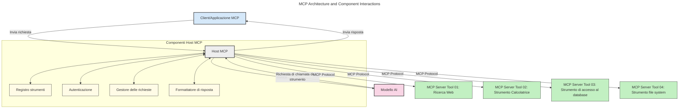
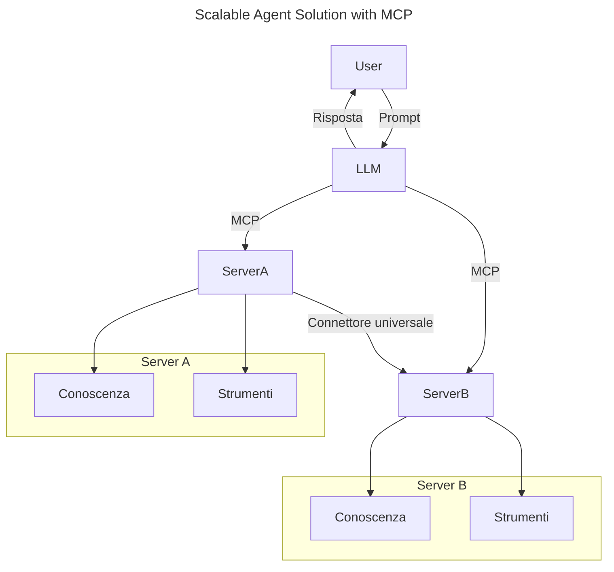
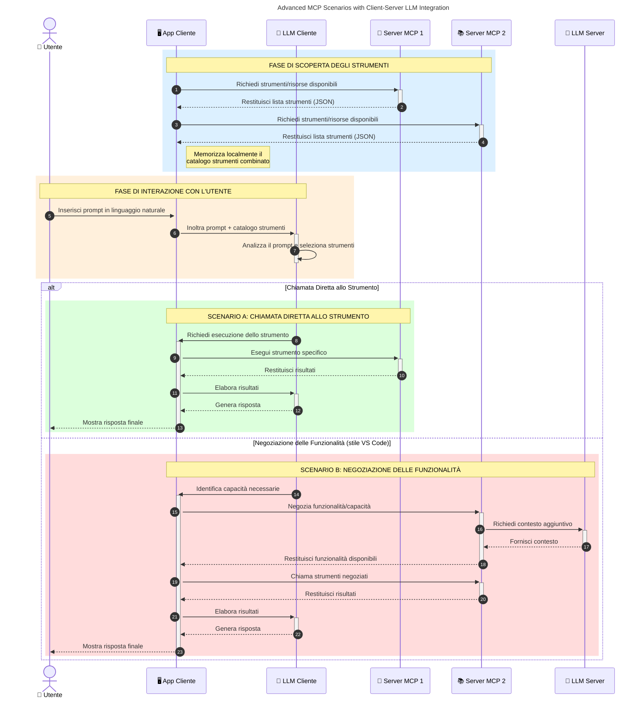

# Introduzione al Model Context Protocol (MCP): Perché è Importante per Applicazioni AI Scalabili

_(Clicca sull'immagine sopra per vedere il video di questa lezione)_

Le applicazioni di AI generativa rappresentano un grande passo avanti poiché spesso consentono all'utente di interagire con l'app utilizzando prompt in linguaggio naturale. Tuttavia, man mano che si investono più tempo e risorse in tali app, si vuole assicurarsi di poter integrare facilmente funzionalità e risorse in modo che sia semplice estenderle, che la tua app possa gestire più di un modello contemporaneamente e affrontare varie peculiarità dei modelli. In breve, costruire app Gen AI è facile all'inizio, ma con la crescita e la complessità è necessario iniziare a definire un'architettura e probabilmente affidarsi a uno standard per garantire che le app siano costruite in modo coerente. È qui che entra in gioco MCP per organizzare le cose e fornire uno standard.

---

## **🔍 Cos’è il Model Context Protocol (MCP)?**

Il **Model Context Protocol (MCP)** è un’**interfaccia aperta e standardizzata** che consente ai Large Language Models (LLM) di interagire senza problemi con strumenti esterni, API e fonti dati. Fornisce un’architettura coerente per migliorare la funzionalità dei modelli AI al di là dei loro dati di addestramento, permettendo sistemi AI più intelligenti, scalabili e reattivi.

---

## **🎯 Perché la Standardizzazione nell'AI è Importante**

Con il diventare più complesse delle applicazioni di AI generativa, è essenziale adottare standard che garantiscano **scalabilità, estensibilità, manutenibilità** e **evitare il lock-in del fornitore**. MCP risponde a queste necessità tramite:

- Unificare le integrazioni modello-strumento
- Ridurre soluzioni personalizzate fragili e ad hoc
- Consentire la coesistenza di più modelli di diversi fornitori in un unico ecosistema

**Nota:** Sebbene MCP si definisca uno standard aperto, non sono previsti piani per standardizzare MCP attraverso enti di standardizzazione esistenti come IEEE, IETF, W3C, ISO o altri.

---

## **📚 Obiettivi di Apprendimento**

Al termine di questo articolo, sarai in grado di:

- Definire il **Model Context Protocol (MCP)** e i suoi casi d’uso
- Comprendere come MCP standardizza la comunicazione modello-strumento
- Identificare i componenti principali dell’architettura MCP
- Esplorare applicazioni reali di MCP in contesti aziendali e di sviluppo

---

## **💡 Perché il Model Context Protocol (MCP) è una Svolta**

### **🔗 MCP Risolve la Frammentazione nelle Interazioni AI**

Prima di MCP, integrare modelli con gli strumenti richiedeva:

- Codice personalizzato per ogni coppia modello-strumento
- API non standard per ciascun fornitore
- Frequenti interruzioni dovute ad aggiornamenti
- Scarsa scalabilità con l’aumentare degli strumenti

### **✅ Benefici della Standardizzazione MCP**

| **Beneficio**              | **Descrizione**                                                                |
|--------------------------|--------------------------------------------------------------------------------|
| Interoperabilità         | Gli LLM funzionano senza problemi con strumenti di diversi fornitori          |
| Coerenza                 | Comportamento uniforme tra piattaforme e strumenti                           |
| Riutilizzabilità         | Strumenti costruiti una volta possono essere usati in progetti e sistemi diversi |
| Sviluppo Accelerato      | Riduce i tempi di sviluppo usando interfacce standard plug-and-play           |

---

## **🧱 Panoramica dell'Architettura MCP ad Alto Livello**

MCP segue un **modello client-server**, dove:

- **Host MCP** eseguono i modelli AI
- **Client MCP** iniziano le richieste
- **Server MCP** servono contesto, strumenti e capacità

### **Componenti Chiave:**

- **Risorse** – Dati statici o dinamici per i modelli  
- **Prompt** – Flussi di lavoro predefiniti per generazioni guidate  
- **Strumenti** – Funzioni eseguibili come ricerca, calcoli  
- **Sampling** – Comportamento agentico tramite interazioni ricorsive (deprecato nella release candidate `2026-07-28`)
- **Elicitation** – Richieste iniziate dal server per input utente
- **Roots** – Confini del filesystem per controllo accessi server (deprecato nella release candidate `2026-07-28`)

### **Architettura del Protocollo:**

MCP utilizza un’architettura a due livelli:
- **Data Layer**: comunicazione basata su JSON-RPC 2.0 con gestione del ciclo di vita e primitive
- **Transport Layer**: canali di comunicazione STDIO (locale) e HTTP streamabile con SSE (remoto)

---

## Come Funzionano i Server MCP

I server MCP operano nel seguente modo:

- **Flusso delle Richieste**:
    1. Una richiesta è avviata da un utente finale o software che agisce per suo conto.
    2. Il **Client MCP** invia la richiesta a un **Host MCP**, che gestisce il runtime del Modello AI.
    3. Il **Modello AI** riceve il prompt utente e può richiedere accesso a strumenti o dati esterni tramite una o più chiamate a strumenti.
    4. L’**Host MCP**, non il modello direttamente, comunica con gli opportuni **Server MCP** utilizzando il protocollo standardizzato.
- **Funzionalità Host MCP**:
    - **Registro Strumenti**: Mantiene un catalogo degli strumenti disponibili e relative capacità.
    - **Autenticazione**: Verifica i permessi di accesso agli strumenti.
    - **Gestore Richieste**: Processa le richieste in arrivo dagli strumenti al modello.
    - **Formatore Risposte**: Struttura l'output degli strumenti in un formato comprensibile dal modello.
- **Esecuzione Server MCP**:
    - L’**Host MCP** instrada le chiamate agli strumenti a uno o più **Server MCP**, ciascuno che espone funzioni specializzate (es. ricerca, calcoli, query database).
    - I **Server MCP** eseguono le rispettive operazioni e restituiscono risultati all’**Host MCP** in un formato coerente.
    - L’**Host MCP** formatta e trasmette questi risultati al **Modello AI**.
- **Completamento Risposta**:
    - Il **Modello AI** incorpora gli output degli strumenti in una risposta finale.
    - L’**Host MCP** invia questa risposta al **Client MCP**, che la consegna all’utente finale o al software chiamante.
    

## 👨‍💻 Come Costruire un Server MCP (Con Esempi)

I server MCP ti permettono di estendere le capacità degli LLM fornendo dati e funzionalità. 

Pronto a provarlo? Ecco SDK specifici per linguaggi e stack con esempi di creazione di server MCP semplici in vari linguaggi/stack:

- **Python SDK**: https://github.com/modelcontextprotocol/python-sdk

- **TypeScript SDK**: https://github.com/modelcontextprotocol/typescript-sdk

- **Java SDK**: https://github.com/modelcontextprotocol/java-sdk

- **C#/.NET SDK**: https://github.com/modelcontextprotocol/csharp-sdk

## 🌍 Casi d’Uso Reali per MCP

MCP abilita un’ampia gamma di applicazioni estendendo le capacità AI:

| **Applicazione**             | **Descrizione**                                                                |
|------------------------------|--------------------------------------------------------------------------------|
| Integrazione Dati Aziendali  | Collegare gli LLM a database, CRM o strumenti interni                          |
| Sistemi AI Agentici           | Abilitare agenti autonomi con accesso a strumenti e flussi decisionali         |
| Applicazioni Multimodali      | Combinare testo, immagine e audio in un’unica app AI unificata                 |
| Integrazione Dati in Tempo Reale | Portare dati live nelle interazioni AI per output più accurati e aggiornati  |

### 🧠 MCP = Standard Universale per Interazioni AI

Il Model Context Protocol (MCP) agisce come uno standard universale per le interazioni AI, proprio come USB-C ha standardizzato le connessioni fisiche tra dispositivi. Nel mondo AI, MCP fornisce un’interfaccia coerente, permettendo ai modelli (client) di integrarsi senza problemi con strumenti e fornitori di dati esterni (server). Ciò elimina la necessità di protocolli diversi e personalizzati per ogni API o fonte dati.

Secondo MCP, uno strumento compatibile (chiamato server MCP) segue uno standard unificato. Questi server possono elencare gli strumenti o le azioni che offrono ed eseguirle quando richiesto da un agente AI. Le piattaforme agenti AI che supportano MCP sono in grado di scoprire gli strumenti disponibili dai server e invocarli tramite questo protocollo standard.

### 💡 Facilita l’accesso alla conoscenza

Oltre a offrire strumenti, MCP facilita anche l’accesso alla conoscenza. Permette alle applicazioni di fornire contesto ai grandi modelli di linguaggio (LLM) collegandoli a varie fonti dati. Per esempio, un server MCP potrebbe rappresentare un archivio documentale aziendale, consentendo agli agenti di recuperare informazioni rilevanti su richiesta. Un altro server potrebbe gestire azioni specifiche come inviare email o aggiornare record. Dal punto di vista dell’agente, questi sono semplicemente strumenti che può usare—alcuni restituiscono dati (contesto di conoscenza), altri eseguono azioni. MCP gestisce entrambi in modo efficiente.

Un agente che si connette a un server MCP apprende automaticamente le capacità disponibili e i dati accessibili dal server tramite un formato standard. Questa standardizzazione abilita la disponibilità dinamica degli strumenti. Ad esempio, aggiungendo un nuovo server MCP al sistema di un agente, le sue funzioni diventano immediatamente utilizzabili senza richiedere ulteriori personalizzazioni delle istruzioni dell’agente.

Questa integrazione semplificata si allinea al flusso rappresentato nel diagramma seguente, in cui i server forniscono strumenti e conoscenza, assicurando una collaborazione senza soluzione di continuità tra i sistemi. 

### 👉 Esempio: Soluzione di Agente Scalabile

Il connettore universale permette ai server MCP di comunicare e condividere capacità tra loro, permettendo a ServerA di delegare compiti a ServerB o accedere ai suoi strumenti e conoscenza. Questo federare strumenti e dati tra server supporta architetture agenti scalabili e modulari. Poiché MCP standardizza l’esposizione degli strumenti, gli agenti possono scoprire dinamicamente e instradare richieste tra server senza integrazioni rigide.

Federazione di strumenti e conoscenza: Strumenti e dati possono essere accessibili tra server, abilitando architetture agenti più scalabili e modulari.

### 🔄 Scenari Avanzati MCP con Integrazione LLM lato Client

Oltre all’architettura MCP di base, ci sono scenari avanzati dove sia client che server contengono LLM, permettendo interazioni più sofisticate. Nel diagramma seguente, **Client App** potrebbe essere un IDE con vari strumenti MCP disponibili per l’uso da parte dell’LLM:

## 🔐 Benefici Pratici di MCP

Ecco i benefici pratici dell’uso di MCP:

- **Aggiornamento**: I modelli possono accedere a informazioni aggiornate oltre ai dati di addestramento
- **Estensione delle capacità**: I modelli possono sfruttare strumenti specializzati per compiti non previsti nel training
- **Riduzione delle allucinazioni**: Le fonti dati esterne forniscono basi fattuali
- **Privacy**: I dati sensibili possono rimanere in ambienti sicuri invece di essere incorporati nei prompt

## 📌 Punti Chiave

I seguenti sono i punti chiave per l’uso di MCP:

- **MCP** standardizza come i modelli AI interagiscono con strumenti e dati
- Promuove **estensibilità, coerenza e interoperabilità**
- MCP aiuta a **ridurre i tempi di sviluppo, migliorare l’affidabilità e estendere le capacità dei modelli**
- L’architettura client-server **abilita applicazioni AI flessibili e estensibili**

## 🧠 Esercizio

Pensa a un’applicazione AI che ti interessa costruire.

- Quali **strumenti esterni o dati** potrebbero migliorare le sue capacità?
- In che modo MCP potrebbe rendere l'integrazione **più semplice e affidabile?**

## Risorse Aggiuntive

- [Repository MCP su GitHub](https://github.com/modelcontextprotocol)

## Cosa aspettarsi

Dopo: [Capitolo 1: Concetti Fondamentali](../01-CoreConcepts/README.md)

---

<!-- CO-OP TRANSLATOR DISCLAIMER START -->
**Disclaimer**:
Questo documento è stato tradotto utilizzando il servizio di traduzione AI [Co-op Translator](https://github.com/Azure/co-op-translator). Sebbene ci impegniamo per garantire la precisione, si prega di notare che le traduzioni automatizzate possono contenere errori o imprecisioni. Il documento originale nella sua lingua nativa deve essere considerato la fonte autorevole. Per informazioni critiche, si raccomanda una traduzione professionale effettuata da un essere umano. Non siamo responsabili per eventuali malintesi o interpretazioni errate derivanti dall’uso di questa traduzione.
<!-- CO-OP TRANSLATOR DISCLAIMER END -->