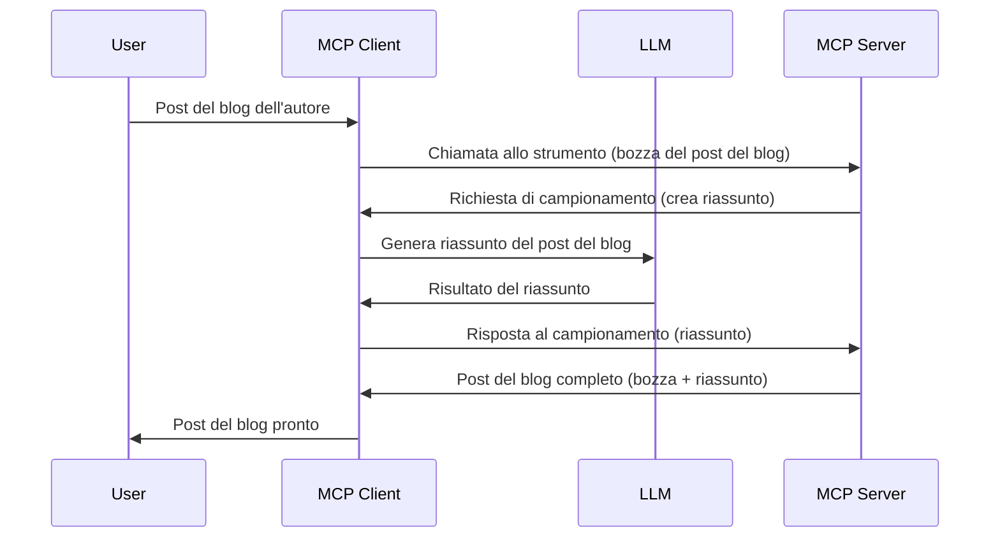

> [DEPRECATO: 2026-07-28 RELEASE CANDIDATE](https://blog.modelcontextprotocol.io/posts/2026-07-28-release-candidate/)

# Sampling - delegare funzionalità al Client

> **Avviso di deprecazione:** il candidato alla versione della specifica MCP `2026-07-28` segna Sampling come deprecato a favore dell'integrazione diretta con le API dei fornitori LLM. Sampling continua a funzionare in `2025-11-25` e per almeno un anno dopo qualsiasi deprecazione formale, quindi tutto ciò che è in questa lezione rimane valido — ma i nuovi design di server dovrebbero valutare il pattern di sostituzione. Vedi [Cosa cambia in MCP: il candidato alla versione 2026-07-28](../../01-CoreConcepts/mcp-2026-07-28-release-candidate.md).

A volte, è necessario che il Client MCP e il Server MCP collaborino per raggiungere un obiettivo comune. Potresti avere un caso in cui il Server necessita dell'aiuto di un LLM che risiede sul client. Per questa situazione, Sampling è ciò che dovresti usare.

Esploriamo alcuni casi d'uso e come costruire una soluzione che coinvolge Sampling.

## Panoramica

In questa lezione, ci concentriamo sull'esplicare quando e dove usare Sampling e come configurarlo.

## Obiettivi di apprendimento

In questo capitolo, faremo:

- Spiegare cos'è Sampling e quando usarlo.
- Mostrare come configurare Sampling in MCP.
- Fornire esempi di Sampling in azione.

## Cos'è Sampling e perché usarlo?

Sampling è una funzionalità avanzata che funziona nel modo seguente:



### Richiesta di Sampling

Ok, ora che abbiamo una panoramica di alto livello di uno scenario credibile, parliamo della richiesta di sampling che il server invia al client. Ecco come può apparire tale richiesta in formato JSON-RPC:

```json
{
  "jsonrpc": "2.0",
  "id": 1,
  "method": "sampling/createMessage",
  "params": {
    "messages": [
      {
        "role": "user",
        "content": {
          "type": "text",
          "text": "Create a blog post summary of the following blog post: <BLOG POST>"
        }
      }
    ],
    "modelPreferences": {
      "hints": [
        {
          "name": "claude-3-sonnet"
        }
      ],
      "intelligencePriority": 0.8,
      "speedPriority": 0.5
    },
    "systemPrompt": "You are a helpful assistant.",
    "maxTokens": 100
  }
}
```

Ci sono alcune cose qui vale la pena sottolineare:

- Prompt, sotto content -> text, è il nostro prompt che è un'istruzione per l'LLM di riassumere il contenuto di un post del blog.

- **modelPreferences**. Questa sezione è proprio questo, una preferenza, una raccomandazione su quale configurazione usare con l'LLM. L'utente può scegliere se seguire queste raccomandazioni o modificarle. In questo caso ci sono raccomandazioni sul modello da usare e priorità su velocità e intelligenza.
- **systemPrompt**, questo è il tuo normale prompt di sistema che dà all'LLM una personalità e contiene istruzioni guida.
- **maxTokens**, questa è un'altra proprietà usata per indicare quanti token si consiglia di usare per questo compito.

### Risposta di Sampling

Questa risposta è ciò che il Client MCP finisce per inviare indietro al Server MCP ed è il risultato del client che chiama l'LLM, attende quella risposta e poi costruisce questo messaggio. Ecco come può apparire in JSON-RPC:

```json
{
  "jsonrpc": "2.0",
  "id": 1,
  "result": {
    "role": "assistant",
    "content": {
      "type": "text",
      "text": "Here's your abstract <ABSTRACT>"
    },
    "model": "gpt-5",
    "stopReason": "endTurn"
  }
}
```

Nota come la risposta è un abstract del post del blog proprio come avevamo chiesto. Nota anche come il `model` usato non è quello che avevamo chiesto ma "gpt-5" rispetto a "claude-3-sonnet". Questo per illustrare che l'utente può cambiare idea su cosa usare e che la tua richiesta di sampling è una raccomandazione.

Ok, ora che abbiamo capito il flusso principale, e un compito utile per cui usarlo "creazione post del blog + abstract", vediamo cosa dobbiamo fare per farlo funzionare.

### Tipi di messaggi

I messaggi di Sampling non sono vincolati solo al testo, ma puoi anche inviare immagini e audio. Ecco come cambia il JSON-RPC:

**Testo**

```json
{
  "type": "text",
  "text": "The message content"
}
```

**Contenuto immagine**

```json
{
  "type": "image",
  "data": "base64-encoded-image-data",
  "mimeType": "image/jpeg"
}
```

**Contenuto audio**

```json
{
  "type": "audio",
  "data": "base64-encoded-audio-data",
  "mimeType": "audio/wav"
}
```

> NOTA: per informazioni più dettagliate su Sampling, consulta la [documentazione ufficiale](https://modelcontextprotocol.io/specification/2025-11-25/client/sampling)

## Come configurare Sampling nel Client

> Nota: se stai costruendo solo un server, non devi fare molto qui.

In un client, devi specificare la seguente funzionalità in questo modo:

```json
{
  "capabilities": {
    "sampling": {}
  }
}
```

Questo verrà quindi rilevato quando il client scelto si inizializza con il server.

## Esempio di Sampling in azione - Creare un post del blog

Codifichiamo insieme un server di sampling, dovremo fare quanto segue:

1. Creare uno strumento sul Server.
1. Detto strumento dovrebbe creare una richiesta di sampling
1. Lo strumento dovrebbe aspettare che la richiesta di sampling del client venga risposta.
1. Quindi il risultato dello strumento dovrebbe essere prodotto.

Vediamo il codice passo per passo:

### -1- Creare lo strumento

**python**

```python
@mcp.tool()
async def create_blog(title: str, content: str, ctx: Context[ServerSession, None]) -> str:
    """Create a blog post and generate a summary"""

```

### -2- Creare una richiesta di sampling

Estendi il tuo strumento con il codice seguente:

**python**

```python
post = BlogPost(
        id=len(posts) + 1,
        title=title,
        content=content,
        abstract=""
    )

prompt = f"Create an abstract of the following blog post: title: {title} and draft: {content} "

result = await ctx.session.create_message(
        messages=[
            SamplingMessage(
                role="user",
                content=TextContent(type="text", text=prompt),
            )
        ],
        max_tokens=100,
)

```

### -3- Aspetta la risposta e restituiscila

**python**

```python
post.abstract = result.content.text

posts.append(post)

# restituisci il prodotto completo
return json.dumps({
    "id": post.title,
    "abstract": post.abstract
})
```

### -4- Codice completo

**python**

```python
from starlette.applications import Starlette
from starlette.routing import Mount, Host

from mcp.server.fastmcp import Context, FastMCP

from mcp.server.session import ServerSession
from mcp.types import SamplingMessage, TextContent

import json


from uuid import uuid4
from typing import List
from pydantic import BaseModel


mcp = FastMCP("Blog post generator")

# app = FastAPI()

posts = []

class BlogPost(BaseModel):
    id: int
    title: str
    content: str
    abstract: str

posts: List[BlogPost] = []

@mcp.tool()
async def create_blog(title: str, content: str, ctx: Context[ServerSession, None]) -> str:
    """Create a blog post and generate a summary"""

    post = BlogPost(
        id=len(posts) + 1,
        title=title,
        content=content,
        abstract=""
    )

    prompt = f"Create an abstract of the following blog post: title: {title} and draft: {content} "

    result = await ctx.session.create_message(
        messages=[
            SamplingMessage(
                role="user",
                content=TextContent(type="text", text=prompt),
            )
        ],
        max_tokens=100,
    )

    post.abstract = result.content.text

    posts.append(post)

    # restituisci il post completo del blog
    return json.dumps({
        "id": post.title,
        "abstract": post.abstract
    })

if __name__ == "__main__":
    print("Starting server...")
    # mcp.run()
    mcp.run(transport="streamable-http")

# esegui l'app con: python server.py
```

### -5- Testarlo in Visual Studio Code

Per testarlo in Visual Studio Code, fai quanto segue:

1. Avvia il server nel terminale
1. Aggiungilo a *mcp.json* (e assicurati che sia avviato) ad esempio così:

   ```json
   "servers": {
      "blog-server": {
        "type": "http",
        "url": "http://localhost:8000/mcp"
      }
   }
   ```

1. Digita un prompt:

   ```text
   create a blog post named "Where Python comes from", the content is "Python is actually named after Monty Python Flying Circus"
   ```

1. Permetti che il sampling avvenga. La prima volta che testi questo, ti verrà presentata una finestra di dialogo aggiuntiva che dovrai accettare, poi vedrai la finestra di dialogo normale che ti chiede di eseguire uno strumento

1. Ispeziona i risultati. Vedrai i risultati sia ben renderizzati in GitHub Copilot Chat sia potrai ispezionare la risposta JSON grezza.

**Bonus**. Gli strumenti di Visual Studio Code hanno un ottimo supporto per Sampling. Puoi configurare l'accesso a Sampling sul tuo server installato navigando così:

1. Naviga alla sezione estensioni.
1. Seleziona l'icona dell'ingranaggio per il server installato nella sezione "MCP SERVERS - INSTALLED".
1 Seleziona "Configura Accesso Modello", qui puoi selezionare quali Modelli GitHub Copilot è autorizzato a usare quando esegue sampling. Puoi anche vedere tutte le richieste di sampling avvenute di recente selezionando "Mostra richieste di Sampling".

## Compito

In questo compito, costruirai un Sampling leggermente diverso, cioè un'integrazione di sampling che supporta la generazione di una descrizione del prodotto. Ecco il tuo scenario:

**Scenario**: L'impiegato dell'ufficio back office di un e-commerce ha bisogno di aiuto, impiega troppo tempo a generare descrizioni di prodotto. Perciò, devi costruire una soluzione dove puoi chiamare uno strumento "create_product" con "title" e "keywords" come argomenti e deve produrre un prodotto completo incluso un campo "description" che deve essere popolato da un LLM del client.

SUGGERIMENTO: usa ciò che hai imparato prima per costruire questo server e il suo strumento usando una richiesta di sampling.

## Soluzione

[Soluzione](./solution/README.md)

## Punti chiave

Sampling è una potente funzionalità che permette al server di delegare compiti al client quando necessita dell'aiuto di un LLM.

## Cosa c'è dopo

- [Capitolo 4 - Implementazione pratica](../../04-PracticalImplementation/README.md)

---

<!-- CO-OP TRANSLATOR DISCLAIMER START -->
**Disclaimer**:
Questo documento è stato tradotto utilizzando il servizio di traduzione AI [Co-op Translator](https://github.com/Azure/co-op-translator). Sebbene ci impegniamo per garantire la precisione, si prega di notare che le traduzioni automatizzate possono contenere errori o imprecisioni. Il documento originale nella sua lingua nativa deve essere considerato la fonte autorevole. Per informazioni critiche, si raccomanda una traduzione professionale effettuata da un essere umano. Non siamo responsabili per eventuali malintesi o interpretazioni errate derivanti dall’uso di questa traduzione.
<!-- CO-OP TRANSLATOR DISCLAIMER END -->