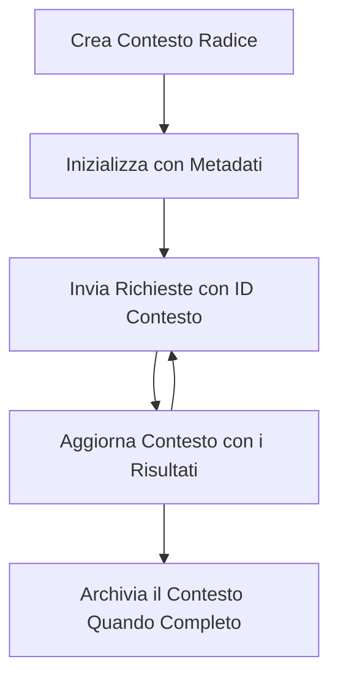

> [DEPRECATO: 2026-07-28 RELEASE CANDIDATE](https://blog.modelcontextprotocol.io/posts/2026-07-28-release-candidate/#roots-sampling-and-logging-are-deprecated)

# Contesti Radice MCP

> **Avviso di deprecazione:** il candidato alla release della specifica MCP `2026-07-28` segna le Radici come deprecate a favore di parametri dello strumento, URI di risorse o configurazione del server. Le Radici continuano a funzionare in `2025-11-25` e per almeno un anno dopo qualsiasi deprecazione formale, quindi tutto ciò che è in questa lezione rimane valido - ma i nuovi progetti di server dovrebbero valutare il modello di sostituzione. Vedi [Cosa cambia in MCP: Il candidato alla release 2026-07-28](../../01-CoreConcepts/mcp-2026-07-28-release-candidate.md).

I contesti radice sono un concetto fondamentale nel Model Context Protocol che forniscono uno strato persistente per mantenere la cronologia della conversazione e lo stato condiviso attraverso più richieste e sessioni.

## Introduzione

In questa lezione, esploreremo come creare, gestire e utilizzare i contesti radice in MCP.

## Obiettivi di Apprendimento

Alla fine di questa lezione, sarai in grado di:

- Comprendere lo scopo e la struttura dei contesti radice
- Creare e gestire contesti radice usando le librerie client MCP
- Implementare i contesti radice in applicazioni .NET, Java, JavaScript e Python
- Utilizzare i contesti radice per conversazioni multi-turno e gestione dello stato
- Implementare le migliori pratiche per la gestione dei contesti radice

## Comprendere i Contesti Radice

I contesti radice servono come contenitori che conservano la cronologia e lo stato per una serie di interazioni correlate. Consentono:

- **Persistenza della Conversazione**: Mantenere conversazioni multi-turno coerenti
- **Gestione della Memoria**: Memorizzare e recuperare informazioni tra le interazioni
- **Gestione dello Stato**: Tenere traccia del progresso in flussi di lavoro complessi
- **Condivisione del Contesto**: Permettere a più clienti di accedere allo stesso stato della conversazione

In MCP, i contesti radice hanno queste caratteristiche chiave:

- Ogni contesto radice ha un identificatore univoco.
- Possono contenere la cronologia della conversazione, preferenze dell'utente e altri metadati.
- Possono essere creati, accessi e archiviati secondo necessità.
- Supportano un controllo di accesso granulare e permessi.

## Ciclo di Vita del Contesto Radice



## Lavorare con i Contesti Radice

Ecco un esempio di come creare e gestire i contesti radice.

### Implementazione in C#

```csharp
// .NET Example: Root Context Management
using Microsoft.Mcp.Client;
using System;
using System.Threading.Tasks;
using System.Collections.Generic;

public class RootContextExample
{
    private readonly IMcpClient _client;
    private readonly IRootContextManager _contextManager;
    
    public RootContextExample(IMcpClient client, IRootContextManager contextManager)
    {
        _client = client;
        _contextManager = contextManager;
    }
    
    public async Task DemonstrateRootContextAsync()
    {
        // 1. Create a new root context
        var contextResult = await _contextManager.CreateRootContextAsync(new RootContextCreateOptions
        {
            Name = "Customer Support Session",
            Metadata = new Dictionary<string, string>
            {
                ["CustomerName"] = "Acme Corporation",
                ["PriorityLevel"] = "High",
                ["Domain"] = "Cloud Services"
            }
        });
        
        string contextId = contextResult.ContextId;
        Console.WriteLine($"Created root context with ID: {contextId}");
        
        // 2. First interaction using the context
        var response1 = await _client.SendPromptAsync(
            "I'm having issues scaling my web service deployment in the cloud.", 
            new SendPromptOptions { RootContextId = contextId }
        );
        
        Console.WriteLine($"First response: {response1.GeneratedText}");
        
        // Second interaction - the model will have access to the previous conversation
        var response2 = await _client.SendPromptAsync(
            "Yes, we're using containerized deployments with Kubernetes.", 
            new SendPromptOptions { RootContextId = contextId }
        );
        
        Console.WriteLine($"Second response: {response2.GeneratedText}");
        
        // 3. Add metadata to the context based on conversation
        await _contextManager.UpdateContextMetadataAsync(contextId, new Dictionary<string, string>
        {
            ["TechnicalEnvironment"] = "Kubernetes",
            ["IssueType"] = "Scaling"
        });
        
        // 4. Get context information
        var contextInfo = await _contextManager.GetRootContextInfoAsync(contextId);
        
        Console.WriteLine("Context Information:");
        Console.WriteLine($"- Name: {contextInfo.Name}");
        Console.WriteLine($"- Created: {contextInfo.CreatedAt}");
        Console.WriteLine($"- Messages: {contextInfo.MessageCount}");
        
        // 5. When the conversation is complete, archive the context
        await _contextManager.ArchiveRootContextAsync(contextId);
        Console.WriteLine($"Archived context {contextId}");
    }
}
```

Nel codice precedente abbiamo:

1. Creato un contesto radice per una sessione di supporto clienti.
1. Inviato più messaggi all’interno di quel contesto, permettendo al modello di mantenere lo stato.
1. Aggiornato il contesto con metadati rilevanti basati sulla conversazione.
1. Recuperato informazioni dal contesto per comprendere la cronologia della conversazione.
1. Archiviato il contesto al termine della conversazione.

## Esempio: Implementazione del Contesto Radice per analisi finanziaria

In questo esempio, creeremo un contesto radice per una sessione di analisi finanziaria, dimostrando come mantenere lo stato attraverso più interazioni.

### Implementazione in Java

```java
// Esempio Java: Implementazione del contesto radice
package com.example.mcp.contexts;

import com.mcp.client.McpClient;
import com.mcp.client.ContextManager;
import com.mcp.models.RootContext;
import com.mcp.models.McpResponse;

import java.util.HashMap;
import java.util.Map;
import java.util.UUID;

public class RootContextsDemo {
    private final McpClient client;
    private final ContextManager contextManager;
    
    public RootContextsDemo(String serverUrl) {
        this.client = new McpClient.Builder()
            .setServerUrl(serverUrl)
            .build();
            
        this.contextManager = new ContextManager(client);
    }
    
    public void demonstrateRootContext() throws Exception {
        // Crea i metadati del contesto
        Map<String, String> metadata = new HashMap<>();
        metadata.put("projectName", "Financial Analysis");
        metadata.put("userRole", "Financial Analyst");
        metadata.put("dataSource", "Q1 2025 Financial Reports");
        
        // 1. Crea un nuovo contesto radice
        RootContext context = contextManager.createRootContext("Financial Analysis Session", metadata);
        String contextId = context.getId();
        
        System.out.println("Created context: " + contextId);
        
        // 2. Prima interazione
        McpResponse response1 = client.sendPrompt(
            "Analyze the trends in Q1 financial data for our technology division",
            contextId
        );
        
        System.out.println("First response: " + response1.getGeneratedText());
        
        // 3. Aggiorna il contesto con informazioni importanti ricavate dalla risposta
        contextManager.addContextMetadata(contextId, 
            Map.of("identifiedTrend", "Increasing cloud infrastructure costs"));
        
        // Seconda interazione - utilizzo dello stesso contesto
        McpResponse response2 = client.sendPrompt(
            "What's driving the increase in cloud infrastructure costs?",
            contextId
        );
        
        System.out.println("Second response: " + response2.getGeneratedText());
        
        // 4. Genera un riepilogo della sessione di analisi
        McpResponse summaryResponse = client.sendPrompt(
            "Summarize our analysis of the technology division financials in 3-5 key points",
            contextId
        );
        
        // Memorizza il riepilogo nei metadati del contesto
        contextManager.addContextMetadata(contextId, 
            Map.of("analysisSummary", summaryResponse.getGeneratedText()));
            
        // Ottieni informazioni di contesto aggiornate
        RootContext updatedContext = contextManager.getRootContext(contextId);
        
        System.out.println("Context Information:");
        System.out.println("- Created: " + updatedContext.getCreatedAt());
        System.out.println("- Last Updated: " + updatedContext.getLastUpdatedAt());
        System.out.println("- Analysis Summary: " + 
            updatedContext.getMetadata().get("analysisSummary"));
            
        // 5. Archivia il contesto al termine
        contextManager.archiveContext(contextId);
        System.out.println("Context archived");
    }
}
```

Nel codice precedente abbiamo:

1. Creato un contesto radice per una sessione di analisi finanziaria.
2. Inviato più messaggi all’interno di quel contesto, permettendo al modello di mantenere lo stato.
3. Aggiornato il contesto con metadati rilevanti basati sulla conversazione.
4. Generato un riepilogo della sessione di analisi e memorizzato nei metadati del contesto.
5. Archiviato il contesto al termine della conversazione.

## Esempio: Gestione del Contesto Radice

Gestire efficacemente i contesti radice è cruciale per mantenere la cronologia della conversazione e lo stato. Di seguito un esempio di come implementare la gestione del contesto radice.

### Implementazione in JavaScript

```javascript
// Esempio JavaScript: Gestione dei Contesti Root MCP
const { McpClient, RootContextManager } = require('@mcp/client');

class ContextSession {
  constructor(serverUrl, apiKey = null) {
    // Inizializza il client MCP
    this.client = new McpClient({
      serverUrl,
      apiKey
    });
    
    // Inizializza il gestore del contesto
    this.contextManager = new RootContextManager(this.client);
  }
  
  /**
   * Create a new conversation context
   * @param {string} sessionName - Name of the conversation session
   * @param {Object} metadata - Additional metadata for the context
   * @returns {Promise<string>} - Context ID
   */
  async createConversationContext(sessionName, metadata = {}) {
    try {
      const contextResult = await this.contextManager.createRootContext({
        name: sessionName,
        metadata: {
          ...metadata,
          createdAt: new Date().toISOString(),
          status: 'active'
        }
      });
      
      console.log(`Created root context '${sessionName}' with ID: ${contextResult.id}`);
      return contextResult.id;
    } catch (error) {
      console.error('Error creating root context:', error);
      throw error;
    }
  }
  
  /**
   * Send a message in an existing context
   * @param {string} contextId - The root context ID
   * @param {string} message - The user's message
   * @param {Object} options - Additional options
   * @returns {Promise<Object>} - Response data
   */
  async sendMessage(contextId, message, options = {}) {
    try {
      // Invia il messaggio utilizzando il contesto specificato
      const response = await this.client.sendPrompt(message, {
        rootContextId: contextId,
        temperature: options.temperature || 0.7,
        allowedTools: options.allowedTools || []
      });
      
      // Opzionalmente memorizza importanti insight dalla conversazione
      if (options.storeInsights) {
        await this.storeConversationInsights(contextId, message, response.generatedText);
      }
      
      return {
        message: response.generatedText,
        toolCalls: response.toolCalls || [],
        contextId
      };
    } catch (error) {
      console.error(`Error sending message in context ${contextId}:`, error);
      throw error;
    }
  }
  
  /**
   * Store important insights from a conversation
   * @param {string} contextId - The root context ID
   * @param {string} userMessage - User's message
   * @param {string} aiResponse - AI's response
   */
  async storeConversationInsights(contextId, userMessage, aiResponse) {
    try {
      // Estrai potenziali insight (in un'app reale, sarebbe più sofisticato)
      const combinedText = userMessage + "\n" + aiResponse;
      
      // Semplice euristica per identificare potenziali insight
      const insightWords = ["important", "key point", "remember", "significant", "crucial"];
      
      const potentialInsights = combinedText
        .split(".")
        .filter(sentence => 
          insightWords.some(word => sentence.toLowerCase().includes(word))
        )
        .map(sentence => sentence.trim())
        .filter(sentence => sentence.length > 10);
      
      // Memorizza gli insight nei metadati del contesto
      if (potentialInsights.length > 0) {
        const insights = {};
        potentialInsights.forEach((insight, index) => {
          insights[`insight_${Date.now()}_${index}`] = insight;
        });
        
        await this.contextManager.updateContextMetadata(contextId, insights);
        console.log(`Stored ${potentialInsights.length} insights in context ${contextId}`);
      }
    } catch (error) {
      console.warn('Error storing conversation insights:', error);
      // Errore non critico, quindi registra solo un avviso
    }
  }
  
  /**
   * Get summary information about a context
   * @param {string} contextId - The root context ID
   * @returns {Promise<Object>} - Context information
   */
  async getContextInfo(contextId) {
    try {
      const contextInfo = await this.contextManager.getContextInfo(contextId);
      
      return {
        id: contextInfo.id,
        name: contextInfo.name,
        created: new Date(contextInfo.createdAt).toLocaleString(),
        lastUpdated: new Date(contextInfo.lastUpdatedAt).toLocaleString(),
        messageCount: contextInfo.messageCount,
        metadata: contextInfo.metadata,
        status: contextInfo.status
      };
    } catch (error) {
      console.error(`Error getting context info for ${contextId}:`, error);
      throw error;
    }
  }
  
  /**
   * Generate a summary of the conversation in a context
   * @param {string} contextId - The root context ID
   * @returns {Promise<string>} - Generated summary
   */
  async generateContextSummary(contextId) {
    try {
      // Chiedi al modello di generare un riassunto della conversazione finora
      const response = await this.client.sendPrompt(
        "Please summarize our conversation so far in 3-4 sentences, highlighting the main points discussed.",
        { rootContextId: contextId, temperature: 0.3 }
      );
      
      // Memorizza il riassunto nei metadati del contesto
      await this.contextManager.updateContextMetadata(contextId, {
        conversationSummary: response.generatedText,
        summarizedAt: new Date().toISOString()
      });
      
      return response.generatedText;
    } catch (error) {
      console.error(`Error generating context summary for ${contextId}:`, error);
      throw error;
    }
  }
  
  /**
   * Archive a context when it's no longer needed
   * @param {string} contextId - The root context ID
   * @returns {Promise<Object>} - Result of the archive operation
   */
  async archiveContext(contextId) {
    try {
      // Genera un riassunto finale prima di archiviare
      const summary = await this.generateContextSummary(contextId);
      
      // Archivia il contesto
      await this.contextManager.archiveContext(contextId);
      
      return {
        status: "archived",
        contextId,
        summary
      };
    } catch (error) {
      console.error(`Error archiving context ${contextId}:`, error);
      throw error;
    }
  }
}

// Esempio di utilizzo
async function demonstrateContextSession() {
  const session = new ContextSession('https://mcp-server-example.com');
  
  try {
    // 1. Crea un nuovo contesto per una conversazione di supporto prodotto
    const contextId = await session.createConversationContext(
      'Product Support - Database Performance',
      {
        customer: 'Globex Corporation',
        product: 'Enterprise Database',
        severity: 'Medium',
        supportAgent: 'AI Assistant'
      }
    );
    
    // 2. Primo messaggio nella conversazione
    const response1 = await session.sendMessage(
      contextId,
      "I'm experiencing slow query performance on our database cluster after the latest update.",
      { storeInsights: true }
    );
    console.log('Response 1:', response1.message);
    
    // Messaggio di follow-up nello stesso contesto
    const response2 = await session.sendMessage(
      contextId,
      "Yes, we've already checked the indexes and they seem to be properly configured.",
      { storeInsights: true }
    );
    console.log('Response 2:', response2.message);
    
    // 3. Ottieni informazioni sul contesto
    const contextInfo = await session.getContextInfo(contextId);
    console.log('Context Information:', contextInfo);
    
    // 4. Genera e mostra il riassunto della conversazione
    const summary = await session.generateContextSummary(contextId);
    console.log('Conversation Summary:', summary);
    
    // 5. Archivia il contesto quando hai finito
    const archiveResult = await session.archiveContext(contextId);
    console.log('Archive Result:', archiveResult);
    
    // 6. Gestisci eventuali errori in modo elegante
  } catch (error) {
    console.error('Error in context session demonstration:', error);
  }
}

demonstrateContextSession();
```

Nel codice precedente abbiamo:

1. Creato un contesto radice per una conversazione di supporto prodotto con la funzione `createConversationContext`. In questo caso, il contesto riguarda problemi di prestazioni del database.

1. Inviato più messaggi all’interno di quel contesto, permettendo al modello di mantenere lo stato con la funzione `sendMessage`. I messaggi inviati riguardano prestazioni di query lente e configurazione degli indici.

1. Aggiornato il contesto con metadati rilevanti basati sulla conversazione.

1. Generato un riepilogo della conversazione e memorizzato nei metadati del contesto con la funzione `generateContextSummary`.

1. Archiviato il contesto al termine della conversazione con la funzione `archiveContext`.

1. Gestito gli errori con attenzione per garantire robustezza.

## Contesto Radice per Assistenza Multi-Turno

In questo esempio, creeremo un contesto radice per una sessione di assistenza multi-turno, dimostrando come mantenere lo stato attraverso più interazioni.

### Implementazione in Python

```python
# Esempio Python: Contesto Radice per Assistenza Multi-Turno
import asyncio
from datetime import datetime
from mcp_client import McpClient, RootContextManager

class AssistantSession:
    def __init__(self, server_url, api_key=None):
        self.client = McpClient(server_url=server_url, api_key=api_key)
        self.context_manager = RootContextManager(self.client)
    
    async def create_session(self, name, user_info=None):
        """Create a new root context for an assistant session"""
        metadata = {
            "session_type": "assistant",
            "created_at": datetime.now().isoformat(),
        }
        
        # Aggiungi informazioni utente se fornite
        if user_info:
            metadata.update({f"user_{k}": v for k, v in user_info.items()})
            
        # Crea il contesto radice
        context = await self.context_manager.create_root_context(name, metadata)
        return context.id
    
    async def send_message(self, context_id, message, tools=None):
        """Send a message within a root context"""
        # Crea opzioni con ID contesto
        options = {
            "root_context_id": context_id
        }
        
        # Aggiungi strumenti se specificati
        if tools:
            options["allowed_tools"] = tools
        
        # Invia il prompt all'interno del contesto
        response = await self.client.send_prompt(message, options)
        
        # Aggiorna i metadati del contesto con il progresso della conversazione
        await self.context_manager.update_context_metadata(
            context_id,
            {
                f"message_{datetime.now().timestamp()}": message[:50] + "...",
                "last_interaction": datetime.now().isoformat()
            }
        )
        
        return response
    
    async def get_conversation_history(self, context_id):
        """Retrieve conversation history from a context"""
        context_info = await self.context_manager.get_context_info(context_id)
        messages = await self.client.get_context_messages(context_id)
        
        return {
            "context_info": context_info,
            "messages": messages
        }
    
    async def end_session(self, context_id):
        """End an assistant session by archiving the context"""
        # Genera prima un prompt di riepilogo
        summary_response = await self.client.send_prompt(
            "Please summarize our conversation and any key points or decisions made.",
            {"root_context_id": context_id}
        )
        
        # Memorizza il riepilogo nei metadati
        await self.context_manager.update_context_metadata(
            context_id,
            {
                "summary": summary_response.generated_text,
                "ended_at": datetime.now().isoformat(),
                "status": "completed"
            }
        )
        
        # Archivia il contesto
        await self.context_manager.archive_context(context_id)
        
        return {
            "status": "completed",
            "summary": summary_response.generated_text
        }

# Esempio di utilizzo
async def demo_assistant_session():
    assistant = AssistantSession("https://mcp-server-example.com")
    
    # 1. Crea sessione
    context_id = await assistant.create_session(
        "Technical Support Session",
        {"name": "Alex", "technical_level": "advanced", "product": "Cloud Services"}
    )
    print(f"Created session with context ID: {context_id}")
    
    # 2. Prima interazione
    response1 = await assistant.send_message(
        context_id, 
        "I'm having trouble with the auto-scaling feature in your cloud platform.",
        ["documentation_search", "diagnostic_tool"]
    )
    print(f"Response 1: {response1.generated_text}")
    
    # Seconda interazione nello stesso contesto
    response2 = await assistant.send_message(
        context_id,
        "Yes, I've already checked the configuration settings you mentioned, but it's still not working."
    )
    print(f"Response 2: {response2.generated_text}")
    
    # 3. Ottieni la cronologia
    history = await assistant.get_conversation_history(context_id)
    print(f"Session has {len(history['messages'])} messages")
    
    # 4. Termina la sessione
    end_result = await assistant.end_session(context_id)
    print(f"Session ended with summary: {end_result['summary']}")

if __name__ == "__main__":
    asyncio.run(demo_assistant_session())
```

Nel codice precedente abbiamo:

1. Creato un contesto radice per una sessione di supporto tecnico con la funzione `create_session`. Il contesto include informazioni sull’utente come nome e livello tecnico.

1. Inviato più messaggi all’interno di quel contesto, permettendo al modello di mantenere lo stato con la funzione `send_message`. I messaggi inviati riguardano problemi con la funzione di auto-scaling.

1. Recuperato la cronologia della conversazione utilizzando la funzione `get_conversation_history`, che fornisce informazioni di contesto e messaggi.

1. Terminata la sessione archiviando il contesto e generando un riepilogo con la funzione `end_session`. Il riepilogo cattura i punti chiave della conversazione.

## Migliori Pratiche per i Contesti Radice

Ecco alcune migliori pratiche per gestire efficacemente i contesti radice:

- **Creare Contesti Focalizzati**: Creare contesti radice separati per diversi scopi o domini di conversazione per mantenere chiarezza.

- **Impostare Politiche di Scadenza**: Implementare politiche per archiviare o eliminare contesti vecchi per gestire lo storage e conformarsi alle politiche di conservazione dati.

- **Memorizzare Metadati Rilevanti**: Utilizzare metadati di contesto per memorizzare informazioni importanti sulla conversazione che potrebbero essere utili in seguito.

- **Usare ID di Contesto in Modo Coerente**: Una volta creato un contesto, utilizzare il suo ID coerentemente per tutte le richieste correlate per mantenere la continuità.

- **Generare Riepiloghi**: Quando un contesto diventa grande, considerare di generare riepiloghi per catturare le informazioni essenziali gestendo la dimensione del contesto.

- **Implementare il Controllo di Accesso**: Per sistemi multi-utente, implementare controlli di accesso appropriati per garantire privacy e sicurezza dei contesti di conversazione.

- **Gestire i Limiti di Contesto**: Essere consapevoli delle limitazioni nelle dimensioni del contesto e implementare strategie per gestire conversazioni molto lunghe.

- **Archiviare a Fine Utilizzo**: Archiviare i contesti quando le conversazioni sono concluse per liberare risorse preservando la storia della conversazione.

## Cosa viene dopo

- [5.5 Routing](../mcp-routing/README.md)

---

<!-- CO-OP TRANSLATOR DISCLAIMER START -->
**Disclaimer**:
Questo documento è stato tradotto utilizzando il servizio di traduzione AI [Co-op Translator](https://github.com/Azure/co-op-translator). Sebbene ci impegniamo per garantire la precisione, si prega di notare che le traduzioni automatizzate possono contenere errori o imprecisioni. Il documento originale nella sua lingua nativa deve essere considerato la fonte autorevole. Per informazioni critiche, si raccomanda una traduzione professionale effettuata da un essere umano. Non siamo responsabili per eventuali malintesi o interpretazioni errate derivanti dall’uso di questa traduzione.
<!-- CO-OP TRANSLATOR DISCLAIMER END -->