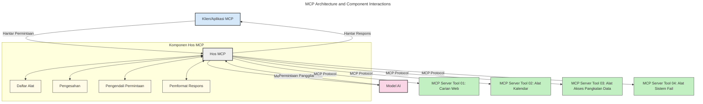
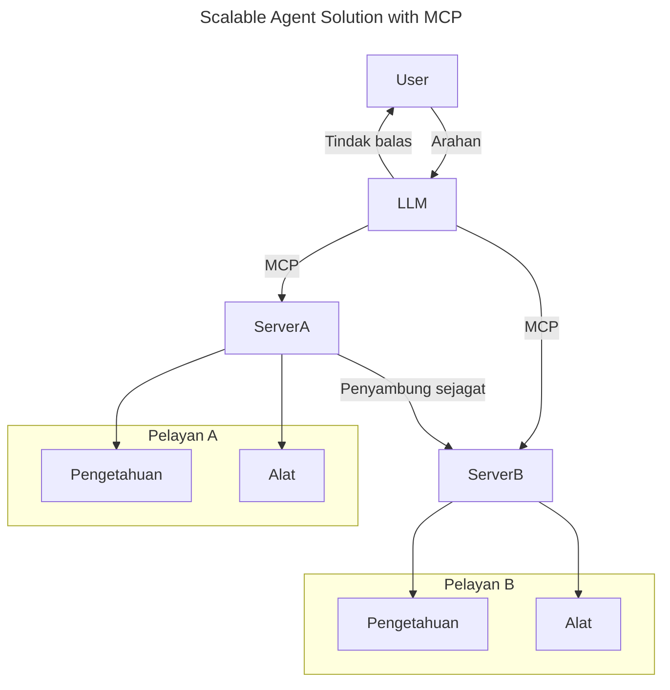
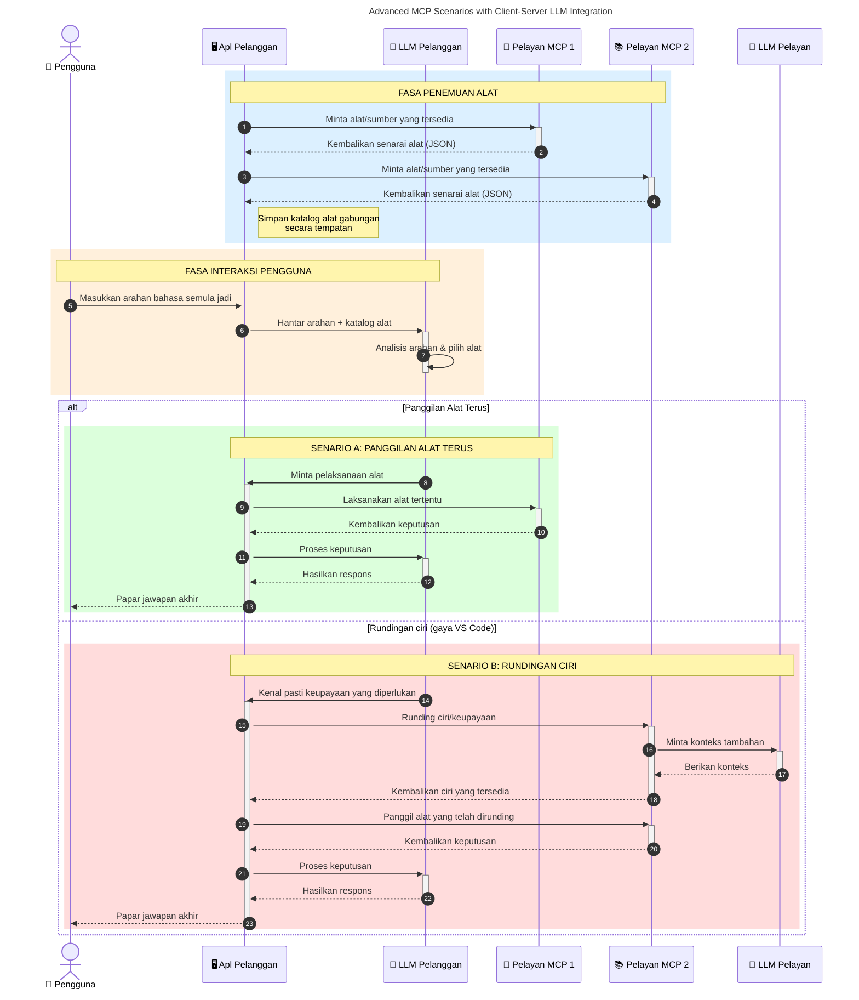

# Pengenalan kepada Protokol Konteks Model (MCP): Mengapa Ia Penting untuk Aplikasi AI yang Boleh Diskalakan

_(Klik imej di atas untuk menonton video pelajaran ini)_

Aplikasi AI generatif merupakan satu langkah yang hebat kerana ia sering membolehkan pengguna berinteraksi dengan aplikasi menggunakan arahan bahasa semula jadi. Walau bagaimanapun, apabila lebih banyak masa dan sumber dilaburkan dalam aplikasi sebegini, anda ingin memastikan anda boleh dengan mudah mengintegrasikan fungsi dan sumber sedemikian rupa sehingga mudah untuk dikembangkan, aplikasi anda boleh memenuhi penggunaan lebih dari satu model, dan mengendalikan pelbagai kerumitan model. Ringkasnya, membina aplikasi Gen AI mudah untuk dimulakan, tetapi apabila ia berkembang dan menjadi lebih kompleks, anda perlu mula mentakrifkan seni bina dan kemungkinan besar perlu bergantung pada sebuah piawaian untuk memastikan aplikasi anda dibina dengan cara yang konsisten. Inilah peranan MCP untuk menyusun perkara dan menyediakan piawaian.

---

## **🔍 Apakah Protokol Konteks Model (MCP)?**

**Protokol Konteks Model (MCP)** adalah antara muka **buka, piawai** yang membolehkan Model Bahasa Besar (LLM) berinteraksi dengan lancar dengan alat, API, dan sumber data luaran. Ia menyediakan seni bina yang konsisten untuk meningkatkan fungsi model AI melebihi data latihan mereka, membolehkan sistem AI yang lebih pintar, boleh diskalakan, dan lebih responsif.

---

## **🎯 Mengapa Piawaian dalam AI Penting**

Apabila aplikasi AI generatif menjadi lebih kompleks, adalah penting untuk mengguna pakai piawaian yang memastikan **boleh diskala, boleh dikembangkan, mudah diselenggara,** dan **mengelakkan terperangkap dengan vendor tertentu**. MCP menangani keperluan ini dengan:

- Menyatukan integrasi model-alat
- Mengurangkan penyelesaian khusus sekali dan rapuh
- Membenarkan pelbagai model dari vendor yang berbeza wujud dalam satu ekosistem

**Nota:** Walaupun MCP mendakwa sebagai piawaian terbuka, tiada rancangan untuk memstandardkan MCP melalui badan piawaian sedia ada seperti IEEE, IETF, W3C, ISO, atau badan piawaian lain.

---

## **📚 Objektif Pembelajaran**

Menjelang akhir artikel ini, anda akan dapat:

- Mentakrifkan **Protokol Konteks Model (MCP)** dan kes penggunaannya
- Memahami bagaimana MCP memstandardkan komunikasi model-ke-alat
- Mengenal pasti komponen teras seni bina MCP
- Meneroka aplikasi dunia sebenar MCP dalam konteks perusahaan dan pembangunan

---

## **💡 Mengapa Protokol Konteks Model (MCP) Merupakan Perubahan Permainan**

### **🔗 MCP Menyelesaikan Fragmentasi dalam Interaksi AI**

Sebelum MCP, mengintegrasikan model dengan alat memerlukan:

- Kod khusus untuk setiap pasangan alat-model
- API tidak standard untuk setiap vendor
- Gangguan kerap akibat kemas kini
- Skalabiliti yang lemah dengan lebih banyak alat

### **✅ Manfaat Piawaian MCP**

| **Manfaat**               | **Penerangan**                                                                |
|-------------------------|-------------------------------------------------------------------------------|
| Kebolehoperasian         | LLM berfungsi lancar dengan alat dari vendor yang berbeza                     |
| Konsistensi              | Kelakuan seragam merentasi platform dan alat                                  |
| Boleh Diguna Semula      | Alat yang dibina sekali boleh digunakan merentasi projek dan sistem           |
| Pembangunan Dipercepat   | Mengurangkan masa pembangunan dengan menggunakan antara muka piawaian plug-and-play |

---

## **🧱 Gambaran Keseluruhan Seni Bina MCP Tahap Tinggi**

MCP mengikuti **model klien-pelayan**, di mana:

- **Hos MCP** menjalankan model AI
- **Klien MCP** memulakan permintaan
- **Pelayan MCP** menyajikan konteks, alat, dan kemampuan

### **Komponen Utama:**

- **Sumber** – Data statik atau dinamik untuk model  
- **Arahan** – Aliran kerja pra-tetap untuk penjanaan berpandu  
- **Alat** – Fungsi boleh laksana seperti carian, pengiraan  
- **Pengambilan Sampel** – Kelakuan agen melalui interaksi berulang (tidak lagi digunakan dalam calon keluaran `2026-07-28`)
- **Pengekstrakan** – Permintaan bermula dari pelayan untuk input pengguna
- **Root** – Sempadan sistem fail untuk kawalan akses pelayan (tidak lagi digunakan dalam calon keluaran `2026-07-28`)

### **Seni Bina Protokol:**

MCP menggunakan seni bina dua lapisan:
- **Lapisan Data**: Komunikasi berasaskan JSON-RPC 2.0 dengan pengurusan kitaran hayat dan primitif
- **Lapisan Pengangkutan**: STDIO (tempatan) dan HTTP dapat alir dengan SSE (jarak jauh) sebagai saluran komunikasi

---

## Bagaimana Pelayan MCP Berfungsi

Pelayan MCP beroperasi dengan cara berikut:

- **Aliran Permintaan**:
    1. Permintaan dimulakan oleh pengguna akhir atau perisian bertindak atas nama mereka.
    2. **Klien MCP** menghantar permintaan kepada **Hos MCP**, yang mengurus runtime Model AI.
    3. **Model AI** menerima arahan pengguna dan mungkin memohon akses kepada alat atau data luaran melalui satu atau lebih panggilan alat.
    4. **Hos MCP**, bukan model secara langsung, berkomunikasi dengan **Pelayan MCP** yang sesuai menggunakan protokol piawaian.
- **Fungsi Hos MCP**:
    - **Daftar Alat**: Mengekalkan katalog alat yang tersedia dan kemampuan mereka.
    - **Pengesahan**: Mengesahkan kebenaran untuk mengakses alat.
    - **Pengendali Permintaan**: Memproses permintaan alat yang masuk dari model.
    - **Pemformat Respons**: Menstrukturkan output alat dalam format yang difahami oleh model.
- **Pelaksanaan Pelayan MCP**:
    - **Hos MCP** mengarahkan panggilan alat ke satu atau lebih **Pelayan MCP**, masing-masing mendedahkan fungsi khusus (contohnya, carian, pengiraan, pertanyaan pangkalan data).
    - **Pelayan MCP** menjalankan operasi masing-masing dan mengembalikan hasil kepada **Hos MCP** dalam format konsisten.
    - **Hos MCP** memformat dan menyampaikan hasil ini kepada **Model AI**.
- **Penyempurnaan Respons**:
    - **Model AI** memasukkan output alat ke dalam respons akhir.
    - **Hos MCP** menghantar respons ini kembali kepada **Klien MCP**, yang menyampaikannya kepada pengguna akhir atau perisian yang memanggil.
    

## 👨‍💻 Cara Membina Pelayan MCP (Dengan Contoh)

Pelayan MCP membolehkan anda memanjangkan keupayaan LLM dengan menyediakan data dan fungsi. 

Sedia untuk mencubanya? Berikut adalah SDK khusus bahasa dan/atau tumpukan dengan contoh membuat pelayan MCP ringkas dalam pelbagai bahasa/tumpukan:

- **Python SDK**: https://github.com/modelcontextprotocol/python-sdk

- **TypeScript SDK**: https://github.com/modelcontextprotocol/typescript-sdk

- **Java SDK**: https://github.com/modelcontextprotocol/java-sdk

- **C#/.NET SDK**: https://github.com/modelcontextprotocol/csharp-sdk

## 🌍 Kes Penggunaan Dunia Sebenar untuk MCP

MCP membolehkan pelbagai aplikasi dengan memperluaskan kemampuan AI:

| **Aplikasi**                 | **Penerangan**                                                                |
|-----------------------------|-------------------------------------------------------------------------------|
| Integrasi Data Perusahaan   | Menyambungkan LLM ke pangkalan data, CRM, atau alat dalaman                   |
| Sistem AI Agenik            | Membolehkan agen autonomi dengan akses alat dan aliran kerja pengambilan keputusan |
| Aplikasi Multi-mod  | Menggabungkan alat teks, imej, dan audio dalam satu aplikasi AI sehenti       |
| Integrasi Data Masa Nyata   | Membawa data langsung ke interaksi AI untuk hasil yang lebih tepat dan terkini|

### 🧠 MCP = Piawaian Universal untuk Interaksi AI

Protokol Konteks Model (MCP) berfungsi sebagai piawaian universal untuk interaksi AI, seperti bagaimana USB-C memstandardkan sambungan fizikal untuk peranti. Dalam dunia AI, MCP menyediakan antara muka yang konsisten, membenarkan model (klien) mengintegrasi dengan lancar dengan alat luaran dan penyedia data (pelayan). Ini menghapuskan keperluan untuk pelbagai protokol khas bagi setiap API atau sumber data.

Di bawah MCP, alat yang serasi MCP (dirujuk sebagai pelayan MCP) mengikuti piawaian bersatu. Pelayan ini boleh menyenaraikan alat atau tindakan yang mereka tawarkan dan melaksanakan tindakan tersebut apabila diminta oleh agen AI. Platform agen AI yang menyokong MCP mampu menemui alat yang tersedia dari pelayan dan memanggilnya melalui protokol piawaian ini.

### 💡 Memudahkan akses ke pengetahuan

Selain menawarkan alat, MCP juga memudahkan akses ke pengetahuan. Ia membolehkan aplikasi menyediakan konteks kepada model bahasa besar (LLM) dengan menghubungkannya kepada pelbagai sumber data. Contohnya, sebuah pelayan MCP mungkin mewakili repositori dokumen syarikat, membolehkan agen mengambil maklumat berkaitan atas permintaan. Pelayan lain boleh mengendalikan tindakan khusus seperti menghantar e-mel atau mengemas kini rekod. Dari perspektif agen, ini hanyalah alat yang boleh digunakannya—beberapa alat mengembalikan data (konteks pengetahuan), manakala yang lain melaksanakan tindakan. MCP mengurus kedua-duanya dengan cekap.

Agen yang menghubungkan ke pelayan MCP secara automatik mempelajari kemampuan tersedia dan data yang boleh diakses melalui format piawaian. Standardisasi ini membolehkan ketersediaan alat yang dinamik. Misalnya, menambah pelayan MCP baru ke sistem agen menjadikan fungsi pelayan tersebut segera boleh digunakan tanpa memerlukan penyesuaian lanjut dalam arahan agen.

Integrasi yang teratur ini selaras dengan aliran yang digambarkan dalam rajah berikut, di mana pelayan menyediakan kedua-dua alat dan pengetahuan, memastikan kerjasama lancar merentasi sistem. 

### 👉 Contoh: Penyelesaian Agen yang Boleh Diskalakan

Universal Connector membolehkan pelayan MCP berkomunikasi dan berkongsi kemampuan antara satu sama lain, membenarkan ServerA mendelegasikan tugas kepada ServerB atau mengakses alat dan pengetahuannya. Ini menyatukan alat dan data merentasi pelayan, menyokong seni bina agen yang boleh diskalakan dan modular. Kerana MCP memstandardkan pendedahan alat, agen boleh menemui dan mengarahkan permintaan secara dinamik antara pelayan tanpa integrasi kod keras.

Persekutuan alat dan pengetahuan: Alat dan data boleh diakses merentasi pelayan, membolehkan seni bina agenik yang lebih boleh diskalakan dan modular.

### 🔄 Senario MCP Lanjutan dengan Integrasi LLM di Pihak Klien

Selain seni bina MCP asas, terdapat senario lanjutan di mana kedua-dua klien dan pelayan mengandungi LLM, membolehkan interaksi yang lebih sofistikated. Dalam rajah berikut, **Aplikasi Klien** boleh menjadi IDE dengan beberapa alat MCP tersedia untuk digunakan oleh LLM:

## 🔐 Manfaat Praktikal MCP

Berikut adalah manfaat praktikal menggunakan MCP:

- **Kesegaran**: Model boleh mengakses maklumat terkini melebihi data latihan mereka
- **Perluasan Keupayaan**: Model boleh memanfaatkan alat khusus untuk tugasan yang bukan dalam latihan mereka
- **Pengurangan Halusinasi**: Sumber data luaran menyediakan asas fakta
- **Privasi**: Data sensitif boleh kekal dalam persekitaran selamat dan tidak disematkan dalam arahan

## 📌 Perkara Penting

Berikut adalah perkara penting untuk menggunakan MCP:

- **MCP** memstandardkan cara model AI berinteraksi dengan alat dan data
- Menggalakkan **kebolehluasan, konsistensi, dan kebolehoperasian**
- MCP membantu **mengurangkan masa pembangunan, meningkatkan kebolehpercayaan, dan memperluaskan keupayaan model**
- Seni bina klien-pelayan **membolehkan aplikasi AI yang fleksibel dan boleh dikembangkan**

## 🧠 Latihan

Fikirkan tentang satu aplikasi AI yang anda berminat untuk bina.

- Alat atau data luaran mana yang boleh meningkatkan keupayaannya?
- Bagaimana MCP boleh menjadikan integrasi lebih **mudah dan boleh dipercayai?**

## Sumber Tambahan

- [Repositori GitHub MCP](https://github.com/modelcontextprotocol)

## Apa seterusnya

Seterusnya: [Bab 1: Konsep Teras](../01-CoreConcepts/README.md)

---

<!-- CO-OP TRANSLATOR DISCLAIMER START -->
**Penafian**:
Dokumen ini telah diterjemahkan menggunakan perkhidmatan terjemahan AI [Co-op Translator](https://github.com/Azure/co-op-translator). Walaupun kami berusaha untuk ketepatan, sila ambil maklum bahawa terjemahan automatik mungkin mengandungi kesilapan atau ketidaktepatan. Dokumen asal dalam bahasa asalnya harus dianggap sebagai sumber yang sahih. Untuk maklumat penting, terjemahan oleh manusia profesional adalah disyorkan. Kami tidak bertanggungjawab terhadap sebarang salah faham atau salah tafsir yang timbul daripada penggunaan terjemahan ini.
<!-- CO-OP TRANSLATOR DISCLAIMER END -->