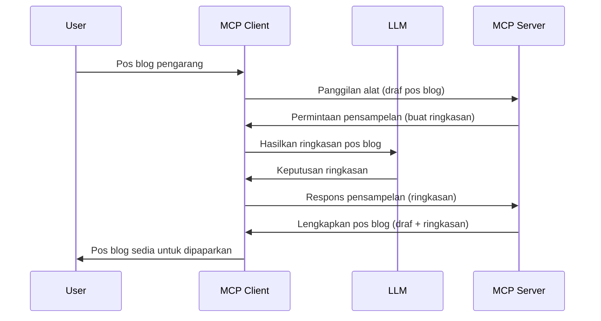

> [DILUPUSKAN: CALON PELEPASAN 2026-07-28](https://blog.modelcontextprotocol.io/posts/2026-07-28-release-candidate/)

# Sampling - menyerahkan ciri kepada Klien

> **Notis pelupusan:** calon pelepasan spesifikasi MCP `2026-07-28` menandakan Sampling sebagai dilupuskan demi integrasi langsung dengan API penyedia LLM. Sampling terus berfungsi dalam `2025-11-25` dan sekurang-kurangnya selama setahun selepas pelupusan rasmi, jadi segala yang diajar dalam pelajaran ini kekal sah — tetapi reka bentuk pelayan baru harus menilai corak gantian. Lihat [Apa Yang Berubah Dalam MCP: Calon Pelepasan 2026-07-28](../../01-CoreConcepts/mcp-2026-07-28-release-candidate.md).

Kadang-kadang, anda memerlukan Klien MCP dan Pelayan MCP untuk bekerjasama demi mencapai matlamat yang sama. Anda mungkin mempunyai kes di mana Pelayan memerlukan bantuan LLM yang berada pada klien. Untuk situasi ini, sampling adalah apa yang anda harus gunakan.

Mari terokai beberapa kes penggunaan dan cara membina penyelesaian yang melibatkan sampling.

## Gambaran Keseluruhan

Dalam pelajaran ini, kami akan fokus menerangkan bila dan di mana menggunakan Sampling dan cara mengkonfigurasinya.

## Objektif Pembelajaran

Dalam bab ini, kita akan:

- Jelaskan apa itu Sampling dan bila menggunakannya.
- Tunjukkan cara mengkonfigurasi Sampling dalam MCP.
- Berikan contoh Sampling dalam tindakan.

## Apa itu Sampling dan mengapa menggunakannya?

Sampling adalah ciri lanjutan yang berfungsi dengan cara berikut:



### Permintaan Sampling

Ok, sekarang kita ada gambaran besar senario yang boleh dipercayai, mari kita bincangkan tentang permintaan sampling yang dihantar balik oleh pelayan kepada klien. Berikut adalah contoh permintaan dalam format JSON-RPC:

```json
{
  "jsonrpc": "2.0",
  "id": 1,
  "method": "sampling/createMessage",
  "params": {
    "messages": [
      {
        "role": "user",
        "content": {
          "type": "text",
          "text": "Create a blog post summary of the following blog post: <BLOG POST>"
        }
      }
    ],
    "modelPreferences": {
      "hints": [
        {
          "name": "claude-3-sonnet"
        }
      ],
      "intelligencePriority": 0.8,
      "speedPriority": 0.5
    },
    "systemPrompt": "You are a helpful assistant.",
    "maxTokens": 100
  }
}
```

Ada beberapa perkara yang patut diberi perhatian di sini:

- Prompt, di bawah content -> text, adalah arahan untuk LLM meringkaskan kandungan pos blog.

- **modelPreferences**. Bahagian ini adalah satu keutamaan, satu cadangan tentang konfigurasi apa yang harus digunakan bersama LLM. Pengguna boleh memilih sama ada untuk mengikuti cadangan ini atau mengubahnya. Dalam kes ini, ada cadangan model yang digunakan dan prioriti kelajuan serta kecerdasan.
- **systemPrompt**, ini adalah prompt sistem biasa yang memberikan LLM anda personaliti dan mengandungi arahan panduan.
- **maxTokens**, ini adalah sifat lain yang digunakan untuk menyatakan berapa banyak token yang disarankan digunakan untuk tugasan ini.

### Respons Sampling

Respons ini adalah apa yang Klien MCP akhirnya hantar balik kepada Pelayan MCP dan merupakan hasil klien memanggil LLM, menunggu respons tersebut dan kemudian membina mesej ini. Ini contoh dalam JSON-RPC:

```json
{
  "jsonrpc": "2.0",
  "id": 1,
  "result": {
    "role": "assistant",
    "content": {
      "type": "text",
      "text": "Here's your abstract <ABSTRACT>"
    },
    "model": "gpt-5",
    "stopReason": "endTurn"
  }
}
```

Perhatikan bagaimana respons adalah abstrak pos blog seperti yang diminta. Juga perhatikan bagaimana `model` yang digunakan bukan apa yang kita minta tetapi "gpt-5" berbanding "claude-3-sonnet". Ini untuk menunjukkan bahawa pengguna boleh menukar fikiran tentang apa yang digunakan dan permintaan sampling anda adalah cadangan.

Ok, sekarang kita faham aliran utama, dan tugasan berguna untuk menggunakannya "penciptaan pos blog + abstrak", mari lihat apa yang perlu dilakukan untuk menjalankannya.

### Jenis mesej

Mesej sampling tidak terbatas hanya kepada teks tetapi anda juga boleh hantar imej dan audio. Berikut adalah perbezaan JSON-RPC:

**Teks**

```json
{
  "type": "text",
  "text": "The message content"
}
```

**Kandungan imej**

```json
{
  "type": "image",
  "data": "base64-encoded-image-data",
  "mimeType": "image/jpeg"
}
```

**Kandungan audio**

```json
{
  "type": "audio",
  "data": "base64-encoded-audio-data",
  "mimeType": "audio/wav"
}
```

> NOTA: untuk maklumat lebih terperinci tentang Sampling, sila rujuk [dokumen rasmi](https://modelcontextprotocol.io/specification/2025-11-25/client/sampling)

## Cara Mengkonfigurasi Sampling dalam Klien

> Nota: jika anda hanya membina pelayan, tiada banyak yang perlu dilakukan di sini.

Dalam klien, anda perlu menyatakan ciri berikut seperti ini:

```json
{
  "capabilities": {
    "sampling": {}
  }
}
```

Ini akan diambil kira apabila klien pilihan anda diinisialisasi dengan pelayan.

## Contoh Sampling Dalam Tindakan - Buat Pos Blog

Mari kita kodkan pelayan sampling bersama, kita perlu melakukan yang berikut:

1. Buat alat pada Pelayan.
1. Alat tersebut harus membuat permintaan sampling
1. Alat harus menunggu permintaan sampling klien dijawab.
1. Kemudian hasil alat harus dihasilkan.

Mari lihat kodenya langkah demi langkah:

### -1- Buat alat

**python**

```python
@mcp.tool()
async def create_blog(title: str, content: str, ctx: Context[ServerSession, None]) -> str:
    """Create a blog post and generate a summary"""

```

### -2- Buat permintaan sampling

Luaskan alat anda dengan kod berikut:

**python**

```python
post = BlogPost(
        id=len(posts) + 1,
        title=title,
        content=content,
        abstract=""
    )

prompt = f"Create an abstract of the following blog post: title: {title} and draft: {content} "

result = await ctx.session.create_message(
        messages=[
            SamplingMessage(
                role="user",
                content=TextContent(type="text", text=prompt),
            )
        ],
        max_tokens=100,
)

```

### -3- Tunggu respons dan pulangkan respons

**python**

```python
post.abstract = result.content.text

posts.append(post)

# pulangkan produk lengkap
return json.dumps({
    "id": post.title,
    "abstract": post.abstract
})
```

### -4- Kod penuh

**python**

```python
from starlette.applications import Starlette
from starlette.routing import Mount, Host

from mcp.server.fastmcp import Context, FastMCP

from mcp.server.session import ServerSession
from mcp.types import SamplingMessage, TextContent

import json


from uuid import uuid4
from typing import List
from pydantic import BaseModel


mcp = FastMCP("Blog post generator")

# app = FastAPI()

posts = []

class BlogPost(BaseModel):
    id: int
    title: str
    content: str
    abstract: str

posts: List[BlogPost] = []

@mcp.tool()
async def create_blog(title: str, content: str, ctx: Context[ServerSession, None]) -> str:
    """Create a blog post and generate a summary"""

    post = BlogPost(
        id=len(posts) + 1,
        title=title,
        content=content,
        abstract=""
    )

    prompt = f"Create an abstract of the following blog post: title: {title} and draft: {content} "

    result = await ctx.session.create_message(
        messages=[
            SamplingMessage(
                role="user",
                content=TextContent(type="text", text=prompt),
            )
        ],
        max_tokens=100,
    )

    post.abstract = result.content.text

    posts.append(post)

    # pulangkan pos blog lengkap
    return json.dumps({
        "id": post.title,
        "abstract": post.abstract
    })

if __name__ == "__main__":
    print("Starting server...")
    # mcp.run()
    mcp.run(transport="streamable-http")

# jalankan app dengan: python server.py
```

### -5- Uji dalam Visual Studio Code

Untuk menguji ini dalam Visual Studio Code, lakukan yang berikut:

1. Mulakan pelayan dalam terminal
1. Tambahkannya dalam *mcp.json* (dan pastikan ia dimulakan) contohnya seperti ini:

   ```json
   "servers": {
      "blog-server": {
        "type": "http",
        "url": "http://localhost:8000/mcp"
      }
   }
   ```

1. Taipkan prompt:

   ```text
   create a blog post named "Where Python comes from", the content is "Python is actually named after Monty Python Flying Circus"
   ```

1. Benarkan sampling berjalan. Kali pertama anda mengujinya anda akan dipersembahkan dengan dialog tambahan yang perlu diterima, kemudian anda akan lihat dialog biasa untuk memohon anda menjalankan alat

1. Periksa keputusan. Anda akan melihat hasil yang dipaparkan dengan kemas dalam GitHub Copilot Chat tetapi anda juga boleh memeriksa respons JSON mentah.

**Bonus**. Alat Visual Studio Code mempunyai sokongan hebat untuk sampling. Anda boleh mengkonfigurasi akses Sampling pada pelayan yang diinstal dengan navigasi seperti berikut:

1. Navigasi ke bahagian pelanjutan.
1. Pilih ikon cog untuk pelayan anda yang dipasang dalam seksyen "MCP SERVERS - INSTALLED".
1 Pilih "Configure Model Access", di sini anda boleh memilih model mana yang dibenarkan oleh GitHub Copilot untuk digunakan semasa melaksanakan sampling. Anda juga boleh melihat semua permintaan sampling yang berlaku baru-baru ini dengan memilih "Show Sampling requests".

## Tugasan

Dalam tugasan ini, anda akan membina Sampling yang sedikit berbeza iaitu integrasi sampling yang menyokong penjanaan deskripsi produk. Ini senario anda:

**Senario**: Pekerja pejabat belakang di e-dagang memerlukan bantuan, ia mengambil masa terlalu lama untuk menjana deskripsi produk. Oleh itu, anda perlu membina penyelesaian di mana anda boleh memanggil alat "create_product" dengan "title" dan "keywords" sebagai argumen dan ia harus menghasilkan produk lengkap termasuk medan "description" yang harus diisi oleh LLM klien.

TIP: gunakan apa yang anda pelajari sebelum ini untuk membina pelayan ini dan alatnya menggunakan permintaan sampling.

## Penyelesaian

[Penyelesaian](./solution/README.md)

## Ambilan Utama

Sampling adalah ciri yang kuat yang membolehkan pelayan menyerahkan tugasan kepada klien apabila ia memerlukan bantuan LLM.

## Apa Yang Seterusnya

- [Bab 4 - Pelaksanaan praktikal](../../04-PracticalImplementation/README.md)

---

<!-- CO-OP TRANSLATOR DISCLAIMER START -->
**Penafian**:
Dokumen ini telah diterjemahkan menggunakan perkhidmatan terjemahan AI [Co-op Translator](https://github.com/Azure/co-op-translator). Walaupun kami berusaha untuk ketepatan, sila ambil maklum bahawa terjemahan automatik mungkin mengandungi kesilapan atau ketidaktepatan. Dokumen asal dalam bahasa asalnya harus dianggap sebagai sumber yang sahih. Untuk maklumat penting, terjemahan oleh manusia profesional adalah disyorkan. Kami tidak bertanggungjawab terhadap sebarang salah faham atau salah tafsir yang timbul daripada penggunaan terjemahan ini.
<!-- CO-OP TRANSLATOR DISCLAIMER END -->