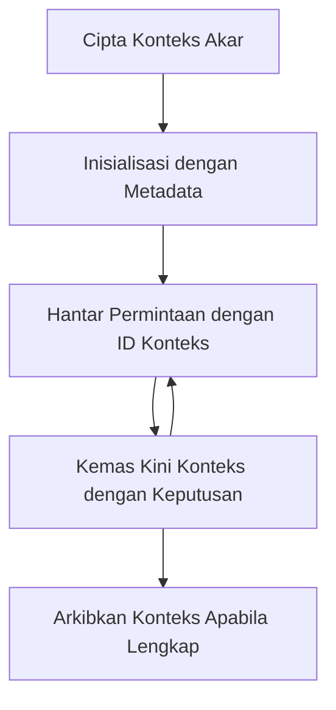

> [DAPATKAN PENGGUNAAN: KANDIDAT SIARAN 2026-07-28](https://blog.modelcontextprotocol.io/posts/2026-07-28-release-candidate/#roots-sampling-and-logging-are-deprecated)

# Konteks Akar MCP

> **Notis penarikan:** calon siaran spesifikasi MCP `2026-07-28` menandakan Akar sebagai tidak lagi digunakan bagi parameter alat, URI sumber atau konfigurasi pelayan. Akar terus berfungsi dalam `2025-11-25` dan sekurang-kurangnya setahun selepas apa-apa penarikan rasmi, jadi segala apa dalam pelajaran ini masih sah - tetapi reka bentuk pelayan baru perlu menilai corak pengganti. Lihat [Apa Yang Berubah Dalam MCP: Calon Siaran 2026-07-28](../../01-CoreConcepts/mcp-2026-07-28-release-candidate.md).

Konteks akar adalah konsep asas dalam Protokol Konteks Model yang menyediakan lapisan berterusan untuk mengekalkan sejarah perbualan dan keadaan bersama merentasi pelbagai permintaan dan sesi.

## Pengenalan

Dalam pelajaran ini, kita akan meneroka bagaimana untuk mencipta, mengurus, dan menggunakan konteks akar dalam MCP.

## Objektif Pembelajaran

Pada akhir pelajaran ini, anda akan dapat:

- Memahami tujuan dan struktur konteks akar
- Mencipta dan mengurus konteks akar menggunakan perpustakaan pelanggan MCP
- Melaksanakan konteks akar dalam aplikasi .NET, Java, JavaScript, dan Python
- Menggunakan konteks akar untuk perbualan multi-pusingan dan pengurusan keadaan
- Melaksanakan amalan terbaik untuk pengurusan konteks akar

## Memahami Konteks Akar

Konteks akar berfungsi sebagai bekas yang memegang sejarah dan keadaan untuk satu siri interaksi berkaitan. Mereka membolehkan:

- **Ketahanan Perbualan**: Mengekalkan perbualan multi-pusingan yang koheren
- **Pengurusan Memori**: Menyimpan dan mengambil maklumat merentasi interaksi
- **Pengurusan Keadaan**: Menjejak kemajuan dalam aliran kerja yang kompleks
- **Perkongsian Konteks**: Membenarkan pelbagai pelanggan mengakses keadaan perbualan yang sama

Dalam MCP, konteks akar mempunyai ciri-ciri utama berikut:

- Setiap konteks akar mempunyai pengecam unik.
- Mereka boleh mengandungi sejarah perbualan, keutamaan pengguna, dan metadata lain.
- Mereka boleh dicipta, diakses, dan diarkibkan apabila perlu.
- Mereka menyokong kawalan akses dan kebenaran yang terperinci.

## Kitaran Hayat Konteks Akar



## Bekerja Dengan Konteks Akar

Berikut adalah contoh cara untuk mencipta dan mengurus konteks akar.

### Pelaksanaan C#

```csharp
// .NET Example: Root Context Management
using Microsoft.Mcp.Client;
using System;
using System.Threading.Tasks;
using System.Collections.Generic;

public class RootContextExample
{
    private readonly IMcpClient _client;
    private readonly IRootContextManager _contextManager;
    
    public RootContextExample(IMcpClient client, IRootContextManager contextManager)
    {
        _client = client;
        _contextManager = contextManager;
    }
    
    public async Task DemonstrateRootContextAsync()
    {
        // 1. Create a new root context
        var contextResult = await _contextManager.CreateRootContextAsync(new RootContextCreateOptions
        {
            Name = "Customer Support Session",
            Metadata = new Dictionary<string, string>
            {
                ["CustomerName"] = "Acme Corporation",
                ["PriorityLevel"] = "High",
                ["Domain"] = "Cloud Services"
            }
        });
        
        string contextId = contextResult.ContextId;
        Console.WriteLine($"Created root context with ID: {contextId}");
        
        // 2. First interaction using the context
        var response1 = await _client.SendPromptAsync(
            "I'm having issues scaling my web service deployment in the cloud.", 
            new SendPromptOptions { RootContextId = contextId }
        );
        
        Console.WriteLine($"First response: {response1.GeneratedText}");
        
        // Second interaction - the model will have access to the previous conversation
        var response2 = await _client.SendPromptAsync(
            "Yes, we're using containerized deployments with Kubernetes.", 
            new SendPromptOptions { RootContextId = contextId }
        );
        
        Console.WriteLine($"Second response: {response2.GeneratedText}");
        
        // 3. Add metadata to the context based on conversation
        await _contextManager.UpdateContextMetadataAsync(contextId, new Dictionary<string, string>
        {
            ["TechnicalEnvironment"] = "Kubernetes",
            ["IssueType"] = "Scaling"
        });
        
        // 4. Get context information
        var contextInfo = await _contextManager.GetRootContextInfoAsync(contextId);
        
        Console.WriteLine("Context Information:");
        Console.WriteLine($"- Name: {contextInfo.Name}");
        Console.WriteLine($"- Created: {contextInfo.CreatedAt}");
        Console.WriteLine($"- Messages: {contextInfo.MessageCount}");
        
        // 5. When the conversation is complete, archive the context
        await _contextManager.ArchiveRootContextAsync(contextId);
        Console.WriteLine($"Archived context {contextId}");
    }
}
```

Dalam kod sebelum ini kami telah:

1. Mencipta konteks akar untuk sesi sokongan pelanggan.
1. Menghantar pelbagai mesej dalam konteks itu, membolehkan model mengekalkan keadaan.
1. Mengemas kini konteks dengan metadata yang berkaitan berdasarkan perbualan.
1. Mengambil maklumat konteks untuk memahami sejarah perbualan.
1. Mengarkibkan konteks apabila perbualan selesai.

## Contoh: Pelaksanaan Konteks Akar untuk analisis kewangan

Dalam contoh ini, kami akan mencipta konteks akar untuk sesi analisis kewangan, menunjukkan bagaimana untuk mengekalkan keadaan merentasi pelbagai interaksi.

### Pelaksanaan Java

```java
// Contoh Java: Pelaksanaan Konteks Akar
package com.example.mcp.contexts;

import com.mcp.client.McpClient;
import com.mcp.client.ContextManager;
import com.mcp.models.RootContext;
import com.mcp.models.McpResponse;

import java.util.HashMap;
import java.util.Map;
import java.util.UUID;

public class RootContextsDemo {
    private final McpClient client;
    private final ContextManager contextManager;
    
    public RootContextsDemo(String serverUrl) {
        this.client = new McpClient.Builder()
            .setServerUrl(serverUrl)
            .build();
            
        this.contextManager = new ContextManager(client);
    }
    
    public void demonstrateRootContext() throws Exception {
        // Cipta metadata konteks
        Map<String, String> metadata = new HashMap<>();
        metadata.put("projectName", "Financial Analysis");
        metadata.put("userRole", "Financial Analyst");
        metadata.put("dataSource", "Q1 2025 Financial Reports");
        
        // 1. Cipta konteks akar baharu
        RootContext context = contextManager.createRootContext("Financial Analysis Session", metadata);
        String contextId = context.getId();
        
        System.out.println("Created context: " + contextId);
        
        // 2. Interaksi pertama
        McpResponse response1 = client.sendPrompt(
            "Analyze the trends in Q1 financial data for our technology division",
            contextId
        );
        
        System.out.println("First response: " + response1.getGeneratedText());
        
        // 3. Kemas kini konteks dengan maklumat penting yang diperoleh daripada respons
        contextManager.addContextMetadata(contextId, 
            Map.of("identifiedTrend", "Increasing cloud infrastructure costs"));
        
        // Interaksi kedua - menggunakan konteks yang sama
        McpResponse response2 = client.sendPrompt(
            "What's driving the increase in cloud infrastructure costs?",
            contextId
        );
        
        System.out.println("Second response: " + response2.getGeneratedText());
        
        // 4. Hasilkan ringkasan sesi analisis
        McpResponse summaryResponse = client.sendPrompt(
            "Summarize our analysis of the technology division financials in 3-5 key points",
            contextId
        );
        
        // Simpan ringkasan dalam metadata konteks
        contextManager.addContextMetadata(contextId, 
            Map.of("analysisSummary", summaryResponse.getGeneratedText()));
            
        // Dapatkan maklumat konteks yang dikemas kini
        RootContext updatedContext = contextManager.getRootContext(contextId);
        
        System.out.println("Context Information:");
        System.out.println("- Created: " + updatedContext.getCreatedAt());
        System.out.println("- Last Updated: " + updatedContext.getLastUpdatedAt());
        System.out.println("- Analysis Summary: " + 
            updatedContext.getMetadata().get("analysisSummary"));
            
        // 5. Arkibkan konteks apabila selesai
        contextManager.archiveContext(contextId);
        System.out.println("Context archived");
    }
}
```

Dalam kod sebelum ini, kami telah:

1. Mencipta konteks akar untuk sesi analisis kewangan.
2. Menghantar pelbagai mesej dalam konteks itu, membolehkan model mengekalkan keadaan.
3. Mengemas kini konteks dengan metadata yang berkaitan berdasarkan perbualan.
4. Menjana ringkasan sesi analisis dan menyimpannya dalam metadata konteks.
5. Mengarkibkan konteks apabila perbualan selesai.

## Contoh: Pengurusan Konteks Akar

Mengurus konteks akar dengan berkesan adalah penting untuk mengekalkan sejarah perbualan dan keadaan. Berikut adalah contoh cara melaksanakan pengurusan konteks akar.

### Pelaksanaan JavaScript

```javascript
// Contoh JavaScript: Menguruskan Konteks Akar MCP
const { McpClient, RootContextManager } = require('@mcp/client');

class ContextSession {
  constructor(serverUrl, apiKey = null) {
    // Inisialisasi klien MCP
    this.client = new McpClient({
      serverUrl,
      apiKey
    });
    
    // Inisialisasi pengurus konteks
    this.contextManager = new RootContextManager(this.client);
  }
  
  /**
   * Create a new conversation context
   * @param {string} sessionName - Name of the conversation session
   * @param {Object} metadata - Additional metadata for the context
   * @returns {Promise<string>} - Context ID
   */
  async createConversationContext(sessionName, metadata = {}) {
    try {
      const contextResult = await this.contextManager.createRootContext({
        name: sessionName,
        metadata: {
          ...metadata,
          createdAt: new Date().toISOString(),
          status: 'active'
        }
      });
      
      console.log(`Created root context '${sessionName}' with ID: ${contextResult.id}`);
      return contextResult.id;
    } catch (error) {
      console.error('Error creating root context:', error);
      throw error;
    }
  }
  
  /**
   * Send a message in an existing context
   * @param {string} contextId - The root context ID
   * @param {string} message - The user's message
   * @param {Object} options - Additional options
   * @returns {Promise<Object>} - Response data
   */
  async sendMessage(contextId, message, options = {}) {
    try {
      // Hantar mesej menggunakan konteks yang ditetapkan
      const response = await this.client.sendPrompt(message, {
        rootContextId: contextId,
        temperature: options.temperature || 0.7,
        allowedTools: options.allowedTools || []
      });
      
      // Pilihan untuk menyimpan pandangan penting dari perbualan
      if (options.storeInsights) {
        await this.storeConversationInsights(contextId, message, response.generatedText);
      }
      
      return {
        message: response.generatedText,
        toolCalls: response.toolCalls || [],
        contextId
      };
    } catch (error) {
      console.error(`Error sending message in context ${contextId}:`, error);
      throw error;
    }
  }
  
  /**
   * Store important insights from a conversation
   * @param {string} contextId - The root context ID
   * @param {string} userMessage - User's message
   * @param {string} aiResponse - AI's response
   */
  async storeConversationInsights(contextId, userMessage, aiResponse) {
    try {
      // Ekstrak potensi pandangan (dalam aplikasi sebenar, ini akan lebih canggih)
      const combinedText = userMessage + "\n" + aiResponse;
      
      // Heuristik mudah untuk mengenal pasti potensi pandangan
      const insightWords = ["important", "key point", "remember", "significant", "crucial"];
      
      const potentialInsights = combinedText
        .split(".")
        .filter(sentence => 
          insightWords.some(word => sentence.toLowerCase().includes(word))
        )
        .map(sentence => sentence.trim())
        .filter(sentence => sentence.length > 10);
      
      // Simpan pandangan dalam metadata konteks
      if (potentialInsights.length > 0) {
        const insights = {};
        potentialInsights.forEach((insight, index) => {
          insights[`insight_${Date.now()}_${index}`] = insight;
        });
        
        await this.contextManager.updateContextMetadata(contextId, insights);
        console.log(`Stored ${potentialInsights.length} insights in context ${contextId}`);
      }
    } catch (error) {
      console.warn('Error storing conversation insights:', error);
      // Ralat tidak kritikal, jadi hanya log amaran
    }
  }
  
  /**
   * Get summary information about a context
   * @param {string} contextId - The root context ID
   * @returns {Promise<Object>} - Context information
   */
  async getContextInfo(contextId) {
    try {
      const contextInfo = await this.contextManager.getContextInfo(contextId);
      
      return {
        id: contextInfo.id,
        name: contextInfo.name,
        created: new Date(contextInfo.createdAt).toLocaleString(),
        lastUpdated: new Date(contextInfo.lastUpdatedAt).toLocaleString(),
        messageCount: contextInfo.messageCount,
        metadata: contextInfo.metadata,
        status: contextInfo.status
      };
    } catch (error) {
      console.error(`Error getting context info for ${contextId}:`, error);
      throw error;
    }
  }
  
  /**
   * Generate a summary of the conversation in a context
   * @param {string} contextId - The root context ID
   * @returns {Promise<string>} - Generated summary
   */
  async generateContextSummary(contextId) {
    try {
      // Minta model menjana ringkasan perbualan setakat ini
      const response = await this.client.sendPrompt(
        "Please summarize our conversation so far in 3-4 sentences, highlighting the main points discussed.",
        { rootContextId: contextId, temperature: 0.3 }
      );
      
      // Simpan ringkasan dalam metadata konteks
      await this.contextManager.updateContextMetadata(contextId, {
        conversationSummary: response.generatedText,
        summarizedAt: new Date().toISOString()
      });
      
      return response.generatedText;
    } catch (error) {
      console.error(`Error generating context summary for ${contextId}:`, error);
      throw error;
    }
  }
  
  /**
   * Archive a context when it's no longer needed
   * @param {string} contextId - The root context ID
   * @returns {Promise<Object>} - Result of the archive operation
   */
  async archiveContext(contextId) {
    try {
      // Janakan ringkasan akhir sebelum mengarkib
      const summary = await this.generateContextSummary(contextId);
      
      // Arkibkan konteks
      await this.contextManager.archiveContext(contextId);
      
      return {
        status: "archived",
        contextId,
        summary
      };
    } catch (error) {
      console.error(`Error archiving context ${contextId}:`, error);
      throw error;
    }
  }
}

// Contoh penggunaan
async function demonstrateContextSession() {
  const session = new ContextSession('https://mcp-server-example.com');
  
  try {
    // 1. Buat konteks baru untuk perbualan sokongan produk
    const contextId = await session.createConversationContext(
      'Product Support - Database Performance',
      {
        customer: 'Globex Corporation',
        product: 'Enterprise Database',
        severity: 'Medium',
        supportAgent: 'AI Assistant'
      }
    );
    
    // 2. Mesej pertama dalam perbualan
    const response1 = await session.sendMessage(
      contextId,
      "I'm experiencing slow query performance on our database cluster after the latest update.",
      { storeInsights: true }
    );
    console.log('Response 1:', response1.message);
    
    // Mesej susulan dalam konteks yang sama
    const response2 = await session.sendMessage(
      contextId,
      "Yes, we've already checked the indexes and they seem to be properly configured.",
      { storeInsights: true }
    );
    console.log('Response 2:', response2.message);
    
    // 3. Dapatkan maklumat mengenai konteks
    const contextInfo = await session.getContextInfo(contextId);
    console.log('Context Information:', contextInfo);
    
    // 4. Jana dan papar ringkasan perbualan
    const summary = await session.generateContextSummary(contextId);
    console.log('Conversation Summary:', summary);
    
    // 5. Arkibkan konteks apabila selesai
    const archiveResult = await session.archiveContext(contextId);
    console.log('Archive Result:', archiveResult);
    
    // 6. Tangani sebarang ralat dengan baik
  } catch (error) {
    console.error('Error in context session demonstration:', error);
  }
}

demonstrateContextSession();
```

Dalam kod sebelum ini kami telah:

1. Mencipta konteks akar untuk perbualan sokongan produk dengan fungsi `createConversationContext`. Dalam kes ini, konteks adalah tentang isu prestasi pangkalan data.

1. Menghantar pelbagai mesej dalam konteks itu, membolehkan model mengekalkan keadaan dengan fungsi `sendMessage`. Mesej yang dihantar adalah tentang prestasi pertanyaan yang perlahan dan konfigurasi indeks.

1. Mengemas kini konteks dengan metadata yang berkaitan berdasarkan perbualan.

1. Menjana ringkasan perbualan dan menyimpannya dalam metadata konteks dengan fungsi `generateContextSummary`.

1. Mengarkibkan konteks apabila perbualan selesai dengan fungsi `archiveContext`.

1. Mengendalikan ralat dengan baik untuk memastikan ketahanan.

## Konteks Akar untuk Bantuan Multi-Pusingan

Dalam contoh ini, kami akan mencipta konteks akar untuk sesi bantuan multi-pusingan, menunjukkan bagaimana untuk mengekalkan keadaan merentasi pelbagai interaksi.

### Pelaksanaan Python

```python
# Contoh Python: Konteks Akar untuk Bantuan Multi-Pusingan
import asyncio
from datetime import datetime
from mcp_client import McpClient, RootContextManager

class AssistantSession:
    def __init__(self, server_url, api_key=None):
        self.client = McpClient(server_url=server_url, api_key=api_key)
        self.context_manager = RootContextManager(self.client)
    
    async def create_session(self, name, user_info=None):
        """Create a new root context for an assistant session"""
        metadata = {
            "session_type": "assistant",
            "created_at": datetime.now().isoformat(),
        }
        
        # Tambah maklumat pengguna jika disediakan
        if user_info:
            metadata.update({f"user_{k}": v for k, v in user_info.items()})
            
        # Cipta konteks akar
        context = await self.context_manager.create_root_context(name, metadata)
        return context.id
    
    async def send_message(self, context_id, message, tools=None):
        """Send a message within a root context"""
        # Cipta pilihan dengan ID konteks
        options = {
            "root_context_id": context_id
        }
        
        # Tambah alatan jika ditentukan
        if tools:
            options["allowed_tools"] = tools
        
        # Hantar prompt dalam konteks
        response = await self.client.send_prompt(message, options)
        
        # Kemas kini metadata konteks dengan kemajuan perbualan
        await self.context_manager.update_context_metadata(
            context_id,
            {
                f"message_{datetime.now().timestamp()}": message[:50] + "...",
                "last_interaction": datetime.now().isoformat()
            }
        )
        
        return response
    
    async def get_conversation_history(self, context_id):
        """Retrieve conversation history from a context"""
        context_info = await self.context_manager.get_context_info(context_id)
        messages = await self.client.get_context_messages(context_id)
        
        return {
            "context_info": context_info,
            "messages": messages
        }
    
    async def end_session(self, context_id):
        """End an assistant session by archiving the context"""
        # Jana prompt ringkasan terlebih dahulu
        summary_response = await self.client.send_prompt(
            "Please summarize our conversation and any key points or decisions made.",
            {"root_context_id": context_id}
        )
        
        # Simpan ringkasan dalam metadata
        await self.context_manager.update_context_metadata(
            context_id,
            {
                "summary": summary_response.generated_text,
                "ended_at": datetime.now().isoformat(),
                "status": "completed"
            }
        )
        
        # Arkibkan konteks
        await self.context_manager.archive_context(context_id)
        
        return {
            "status": "completed",
            "summary": summary_response.generated_text
        }

# Contoh penggunaan
async def demo_assistant_session():
    assistant = AssistantSession("https://mcp-server-example.com")
    
    # 1. Cipta sesi
    context_id = await assistant.create_session(
        "Technical Support Session",
        {"name": "Alex", "technical_level": "advanced", "product": "Cloud Services"}
    )
    print(f"Created session with context ID: {context_id}")
    
    # 2. Interaksi pertama
    response1 = await assistant.send_message(
        context_id, 
        "I'm having trouble with the auto-scaling feature in your cloud platform.",
        ["documentation_search", "diagnostic_tool"]
    )
    print(f"Response 1: {response1.generated_text}")
    
    # Interaksi kedua dalam konteks yang sama
    response2 = await assistant.send_message(
        context_id,
        "Yes, I've already checked the configuration settings you mentioned, but it's still not working."
    )
    print(f"Response 2: {response2.generated_text}")
    
    # 3. Dapatkan sejarah
    history = await assistant.get_conversation_history(context_id)
    print(f"Session has {len(history['messages'])} messages")
    
    # 4. Tamatkan sesi
    end_result = await assistant.end_session(context_id)
    print(f"Session ended with summary: {end_result['summary']}")

if __name__ == "__main__":
    asyncio.run(demo_assistant_session())
```

Dalam kod sebelum ini kami telah:

1. Mencipta konteks akar untuk sesi sokongan teknikal dengan fungsi `create_session`. Konteks ini termasuk maklumat pengguna seperti nama dan tahap teknikal.

1. Menghantar pelbagai mesej dalam konteks itu, membolehkan model mengekalkan keadaan dengan fungsi `send_message`. Mesej yang dihantar adalah tentang isu dengan ciri penskalaan automatik.

1. Mengambil sejarah perbualan menggunakan fungsi `get_conversation_history`, yang menyediakan maklumat konteks dan mesej.

1. Menamatkan sesi dengan mengarkibkan konteks dan menjana ringkasan dengan fungsi `end_session`. Ringkasan menangkap perkara utama dari perbualan.

## Amalan Terbaik Konteks Akar

Berikut adalah beberapa amalan terbaik untuk mengurus konteks akar dengan berkesan:

- **Cipta Konteks Fokus**: Cipta konteks akar berasingan untuk tujuan atau domain perbualan yang berbeza untuk mengekalkan kejelasan.

- **Tetapkan Polisi Tamat Tempoh**: Laksanakan polisi untuk mengarkib atau memadam konteks lama untuk mengurus storan dan mematuhi polisi penyimpanan data.

- **Simpan Metadata Berkaitan**: Gunakan metadata konteks untuk menyimpan maklumat penting tentang perbualan yang mungkin berguna kemudian.

- **Gunakan ID Konteks dengan Konsisten**: Setelah konteks dicipta, gunakan IDnya secara konsisten untuk semua permintaan berkaitan bagi mengekalkan kesinambungan.

- **Jana Ringkasan**: Apabila konteks menjadi besar, pertimbangkan untuk menjana ringkasan bagi menangkap maklumat penting sambil menguruskan saiz konteks.

- **Laksanakan Kawalan Akses**: Untuk sistem multi-pengguna, laksanakan kawalan akses yang betul untuk memastikan privasi dan keselamatan konteks perbualan.

- **Tangani Had Konteks**: Sedar akan had saiz konteks dan laksanakan strategi untuk mengendalikan perbualan yang sangat panjang.

- **Arkib Apabila Selesai**: Arkib konteks apabila perbualan selesai untuk membebaskan sumber sambil mengekalkan sejarah perbualan.

## Apa Seterusnya

- [5.5 Penghalaan](../mcp-routing/README.md)

---

<!-- CO-OP TRANSLATOR DISCLAIMER START -->
**Penafian**:
Dokumen ini telah diterjemahkan menggunakan perkhidmatan terjemahan AI [Co-op Translator](https://github.com/Azure/co-op-translator). Walaupun kami berusaha untuk ketepatan, sila ambil maklum bahawa terjemahan automatik mungkin mengandungi kesilapan atau ketidaktepatan. Dokumen asal dalam bahasa asalnya harus dianggap sebagai sumber yang sahih. Untuk maklumat penting, terjemahan oleh manusia profesional adalah disyorkan. Kami tidak bertanggungjawab terhadap sebarang salah faham atau salah tafsir yang timbul daripada penggunaan terjemahan ini.
<!-- CO-OP TRANSLATOR DISCLAIMER END -->