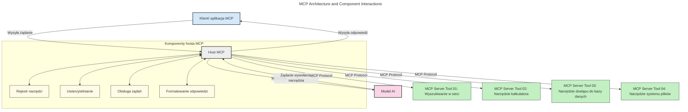
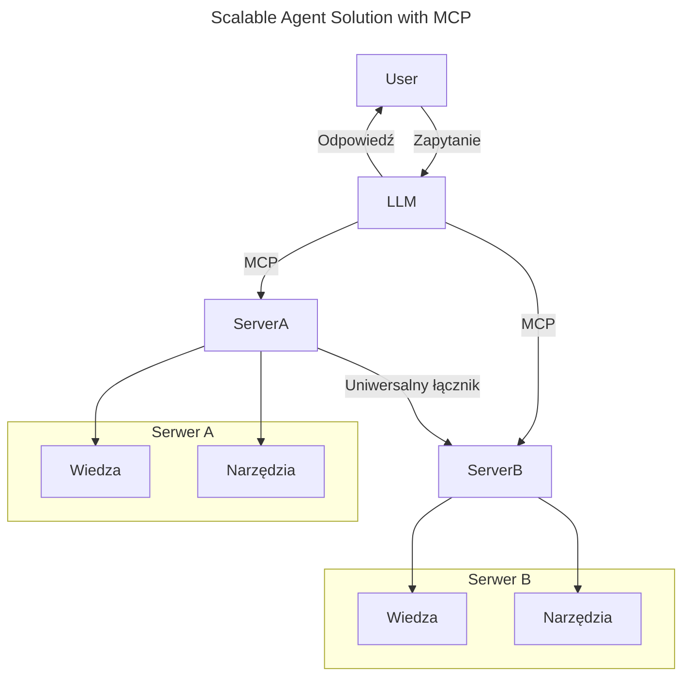
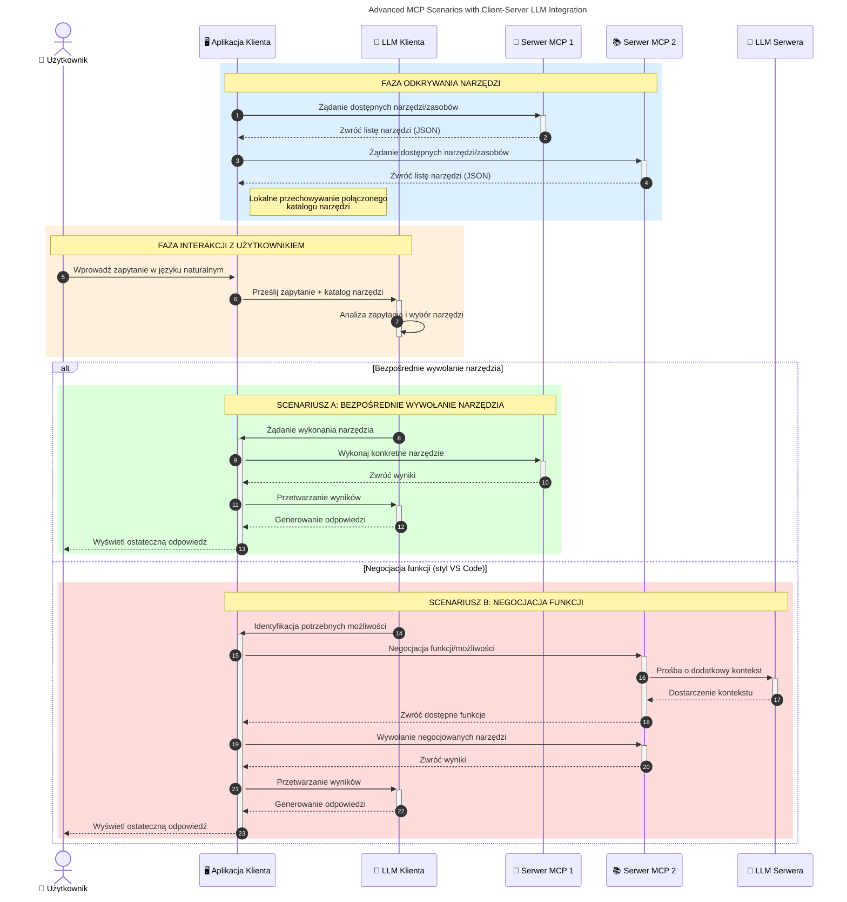

# Wprowadzenie do Model Context Protocol (MCP): Dlaczego jest ważny dla skalowalnych aplikacji AI

_(Kliknij powyższy obraz, aby obejrzeć materiał wideo tej lekcji)_

Aplikacje generatywnej AI to wielki krok naprzód, ponieważ często pozwalają użytkownikowi na interakcję z aplikacją za pomocą poleceń w naturalnym języku. Jednak wraz z inwestowaniem coraz więcej czasu i zasobów w takie aplikacje, chcesz mieć pewność, że możesz łatwo integrować funkcjonalności i zasoby w taki sposób, aby można było je łatwo rozszerzać, aby twoja aplikacja mogła obsługiwać więcej niż jeden model i radzić sobie z różnymi zawiłościami modeli. Krótko mówiąc, budowanie aplikacji Gen AI jest na początku łatwe, ale w miarę ich rozwoju i rosnącej złożoności musisz zacząć definiować architekturę i prawdopodobnie będziesz musiał polegać na standardzie, aby twoje aplikacje były budowane w spójny sposób. Tutaj wchodzi MCP, aby uporządkować rzeczy i zapewnić standard.

---

## **🔍 Czym jest Model Context Protocol (MCP)?**

**Model Context Protocol (MCP)** to **otwarty, standardowy interfejs**, który pozwala dużym modelom językowym (LLM) na płynną interakcję z zewnętrznymi narzędziami, API i źródłami danych. Zapewnia spójną architekturę do rozszerzania funkcjonalności modeli AI poza ich danymi szkoleniowymi, umożliwiając inteligentniejsze, skalowalne i bardziej responsywne systemy AI.

---

## **🎯 Dlaczego standaryzacja w AI ma znaczenie**

W miarę jak aplikacje generatywnej AI stają się bardziej złożone, niezbędne jest przyjęcie standardów zapewniających **skalowalność, rozszerzalność, utrzymywalność** oraz **unikanie uzależnienia od dostawcy**. MCP odpowiada na te potrzeby poprzez:

- Ujednolicenie integracji model-narzędzie
- Redukcję kruchego, jednorazowego kodu niestandardowego
- Umożliwienie współistnienia wielu modeli od różnych dostawców w jednym ekosystemie

**Uwaga:** Chociaż MCP przedstawia się jako otwarty standard, nie ma planów standaryzacji MCP przez żadne istniejące organizacje standaryzacyjne takie jak IEEE, IETF, W3C, ISO lub inne.

---

## **📚 Cele nauki**

Po przeczytaniu tego artykułu będziesz potrafił:

- Zdefiniować **Model Context Protocol (MCP)** i jego zastosowania
- Zrozumieć jak MCP standaryzuje komunikację model-narzędzie
- Zidentyfikować główne komponenty architektury MCP
- Poznać zastosowania MCP w kontekstach korporacyjnych i developerskich

---

## **💡 Dlaczego Model Context Protocol (MCP) to przełom**

### **🔗 MCP rozwiązuje problem fragmentacji interakcji AI**

Przed MCP integrowanie modeli z narzędziami wymagało:

- Niestandardowego kodu dla każdej pary narzędzie-model
- Niestandardowych API dla każdego dostawcy
- Częstych awarii spowodowanych aktualizacjami
- Słabej skalowalności wraz ze wzrostem liczby narzędzi

### **✅ Korzyści ze standaryzacji MCP**

| **Korzyść**              | **Opis**                                                                   |
|--------------------------|---------------------------------------------------------------------------|
| Interoperacyjność        | LLM współpracują bezproblemowo z narzędziami różnych dostawców            |
| Spójność                 | Jednolite zachowanie na platformach i narzędziach                         |
| Ponowne wykorzystanie    | Narzędzia stworzone raz mogą być używane w różnych projektach i systemach  |
| Przyspieszone tworzenie  | Skrócenie czasu deweloperskiego dzięki standardowym, plug-and-play interfejsom |

---

## **🧱 Ogólny przegląd architektury MCP**

MCP opiera się na **modelu klient-serwer**, gdzie:

- **Gospodarze MCP** uruchamiają modele AI
- **Klienci MCP** inicjują żądania
- **Serwery MCP** dostarczają kontekst, narzędzia i funkcje

### **Kluczowe komponenty:**

- **Zasoby** – dane statyczne lub dynamiczne dla modeli  
- **Polecenia (Prompts)** – zdefiniowane przebiegi pracy dla ukierunkowanej generacji  
- **Narzędzia** – funkcje wykonywalne takie jak wyszukiwanie, obliczenia  
- **Sampling** – zachowanie agentowe przez interakcje rekurencyjne (przestarzałe w wersji kandydującej `2026-07-28`)
- **Elicitation** – żądania inicjowane przez serwer w celu uzyskania danych od użytkownika
- **Roots** – granice systemu plików dla kontroli dostępu serwera (przestarzałe w wersji kandydującej `2026-07-28`)

### **Architektura protokołu:**

MCP korzysta z dwuwarstwowej architektury:
- **Warstwa danych**: komunikacja oparta na JSON-RPC 2.0 z zarządzaniem cyklem życia i prymitywami
- **Warstwa transportu**: kanały komunikacji STDIO (lokalny) oraz HTTP strumieniowy z SSE (zdalny)

---

## Jak działają serwery MCP

Serwery MCP działają w następujący sposób:

- **Przepływ żądania**:
    1. Żądanie inicjuje ostateczny użytkownik lub oprogramowanie działające w jego imieniu.
    2. **Klient MCP** wysyła żądanie do **Gospodarza MCP**, który zarządza środowiskiem wykonawczym modelu AI.
    3. **Model AI** otrzymuje polecenie od użytkownika i może żądać dostępu do zewnętrznych narzędzi lub danych przez jedno lub więcej wywołań narzędzi.
    4. **Gospodarz MCP**, a nie model bezpośrednio, komunikuje się z odpowiednim **serwerem(ami) MCP** używając standardowego protokołu.
- **Funkcje gospodarza MCP**:
    - **Rejestr narzędzi**: Utrzymuje katalog dostępnych narzędzi i ich funkcji.
    - **Uwierzytelnianie**: Weryfikuje uprawnienia dostępu do narzędzi.
    - **Obsługa żądań**: Przetwarza nadchodzące żądania narzędzi od modelu.
    - **Formatowanie odpowiedzi**: Strukturyzuje wyniki narzędzi w formacie zrozumiałym dla modelu.
- **Wykonanie serwera MCP**:
    - **Gospodarz MCP** kieruje wywołania narzędzi do jednego lub więcej **serwerów MCP**, z których każdy udostępnia specjalistyczne funkcje (np. wyszukiwanie, obliczenia, zapytania do bazy danych).
    - **Serwery MCP** wykonują swoje operacje i zwracają wyniki do **gospodarza MCP** w spójnym formacie.
    - **Gospodarz MCP** formatuje i przekazuje te wyniki do **modelu AI**.
- **Ukończenie odpowiedzi**:
    - **Model AI** włącza wyniki narzędzi do ostatecznej odpowiedzi.
    - **Gospodarz MCP** odsyła tę odpowiedź do **klienta MCP**, który dostarcza ją użytkownikowi końcowemu lub wywołującemu oprogramowaniu.
    

## 👨‍💻 Jak zbudować serwer MCP (z przykładami)

Serwery MCP pozwalają rozszerzyć możliwości LLM poprzez dostarczanie danych i funkcjonalności.

Gotowy na wypróbowanie? Oto specyficzne dla języka i/lub stosu SDK z przykładami tworzenia prostych serwerów MCP w różnych językach/stackach:

- **Python SDK**: https://github.com/modelcontextprotocol/python-sdk

- **TypeScript SDK**: https://github.com/modelcontextprotocol/typescript-sdk

- **Java SDK**: https://github.com/modelcontextprotocol/java-sdk

- **C#/.NET SDK**: https://github.com/modelcontextprotocol/csharp-sdk

## 🌍 Przykłady zastosowań MCP w rzeczywistym świecie

MCP umożliwia szerokie zastosowanie przez rozszerzenie możliwości AI:

| **Zastosowanie**             | **Opis**                                                                   |
|-----------------------------|---------------------------------------------------------------------------|
| Integracja danych korporacyjnych | Łączenie LLM z bazami danych, CRM lub narzędziami wewnętrznymi          |
| Systemy agentowe AI          | Umożliwienie autonomicznych agentów mających dostęp do narzędzi i procesów decyzyjnych |
| Aplikacje multimodalne       | Łączenie narzędzi tekstowych, obrazowych i audio w jednej zunifikowanej aplikacji AI |
| Integracja danych w czasie rzeczywistym | Dostarczanie na żywo danych do interakcji AI dla dokładniejszych, aktualnych wyników |

### 🧠 MCP = Uniwersalny standard dla interakcji AI

Model Context Protocol (MCP) działa jak uniwersalny standard dla interakcji AI, podobnie jak USB-C ustandaryzowało fizyczne połączenia urządzeń. W świecie AI MCP zapewnia spójny interfejs, umożliwiając modelom (klientom) płynną integrację z zewnętrznymi narzędziami i dostawcami danych (serwerami). Eliminuje to potrzebę stosowania różnych, niestandardowych protokołów dla każdego API lub źródła danych.

W ramach MCP narzędzie kompatybilne z MCP (zwane serwerem MCP) stosuje zunifikowany standard. Serwery te mogą wymieniać listę dostępnych narzędzi lub akcji i wykonywać je, gdy żąda tego agent AI. Platformy agentów AI wspierające MCP są w stanie odkrywać dostępne narzędzia na serwerach i wywoływać je za pośrednictwem tego standardowego protokołu.

### 💡 Ułatwia dostęp do wiedzy

Poza oferowaniem narzędzi, MCP ułatwia także dostęp do wiedzy. Umożliwia aplikacjom dostarczanie kontekstu dużym modelom językowym (LLM) poprzez łączenie ich z różnymi źródłami danych. Na przykład serwer MCP może reprezentować repozytorium dokumentów firmy, pozwalając agentom na pozyskiwanie odpowiednich informacji na żądanie. Inny serwer może obsługiwać konkretne akcje, takie jak wysyłanie e-maili lub aktualizowanie rekordów. Z punktu widzenia agenta są to po prostu narzędzia, które może używać — niektóre zwracają dane (kontekst wiedzy), inne wykonują akcje. MCP efektywnie zarządza oboma typami.

Agent łączący się z serwerem MCP automatycznie poznaje dostępne możliwości i dane serwera za pośrednictwem standardowego formatu. Ta standaryzacja umożliwia dynamiczną dostępność narzędzi. Na przykład dodanie nowego serwera MCP do systemu agenta sprawia, że jego funkcje są od razu dostępne bez potrzeby dalszej modyfikacji instrukcji agenta.

Taka uproszczona integracja odpowiada przepływowi przedstawionemu na poniższym diagramie, gdzie serwery dostarczają zarówno narzędzia, jak i wiedzę, zapewniając bezproblemową współpracę między systemami.

### 👉 Przykład: Skalowalne rozwiązanie agentowe

Uniwersalny łącznik umożliwia serwerom MCP komunikację i współdzielenie możliwości, pozwalając ServerA delegować zadania do ServerB lub korzystać z jego narzędzi i wiedzy. To federuje narzędzia i dane między serwerami, wspierając skalowalne i modułowe architektury agentowe. Dzięki standaryzacji ekspozycji narzędzi MCP agenci mogą dynamicznie odkrywać i kierować żądania między serwerami bez kodu sztywno wbudowanego.

Federacja narzędzi i wiedzy: Narzędzia i dane mogą być udostępniane między serwerami, umożliwiając bardziej skalowalne i modułowe architektury agentowe.

### 🔄 Zaawansowane scenariusze MCP z integracją LLM po stronie klienta

Poza podstawową architekturą MCP istnieją zaawansowane scenariusze, gdzie zarówno klient, jak i serwer zawierają LLM, umożliwiając bardziej wyrafinowane interakcje. Na poniższym diagramie **aplikacja klienta** może być IDE z wieloma narzędziami MCP dostępnymi dla LLM użytkownika:

## 🔐 Praktyczne korzyści MCP

Oto praktyczne zalety korzystania z MCP:

- **Aktualność**: Modele mogą uzyskiwać dostęp do najnowszych informacji poza ich danymi treningowymi
- **Rozszerzenie funkcji**: Modele mogą korzystać ze specjalistycznych narzędzi do zadań, do których nie były szkolone
- **Zmniejszenie halucynacji**: Zewnętrzne źródła danych dostarczają merytoryczne podstawy
- **Prywatność**: Wrażliwe dane mogą pozostawać w bezpiecznych środowiskach zamiast w poleceniach

## 📌 Najważniejsze wnioski

Oto kluczowe wnioski z korzystania z MCP:

- **MCP** standaryzuje sposób, w jaki modele AI współdziałają z narzędziami i danymi
- Promuje **rozszerzalność, spójność i interoperacyjność**
- MCP pomaga **skracać czas tworzenia, poprawiać niezawodność i rozszerzać możliwości modeli**
- Architektura klient-serwer **umożliwia elastyczne, rozszerzalne aplikacje AI**

## 🧠 Ćwiczenie

Pomyśl o aplikacji AI, którą chciałbyś zbudować.

- Jakie **zewnętrzne narzędzia lub dane** mogłyby rozszerzyć jej możliwości?
- W jaki sposób MCP mógłby uczynić integrację **prostszą i bardziej niezawodną?**

## Dodatkowe zasoby

- [Repozytorium MCP na GitHub](https://github.com/modelcontextprotocol)

## Co dalej

Następny rozdział: [Rozdział 1: Podstawowe koncepcje](../01-CoreConcepts/README.md)

---

<!-- CO-OP TRANSLATOR DISCLAIMER START -->
**Zastrzeżenie**:
Niniejszy dokument został przetłumaczony za pomocą usługi tłumaczenia AI [Co-op Translator](https://github.com/Azure/co-op-translator). Choć dążymy do dokładności, prosimy pamiętać, że automatyczne tłumaczenia mogą zawierać błędy lub niedokładności. Oryginalny dokument w jego języku źródłowym należy uznawać za autorytatywne źródło. W przypadku informacji krytycznych zalecane jest skorzystanie z profesjonalnego tłumaczenia wykonanego przez człowieka. Nie ponosimy odpowiedzialności za jakiekolwiek nieporozumienia lub błędne interpretacje wynikające z użycia tego tłumaczenia.
<!-- CO-OP TRANSLATOR DISCLAIMER END -->