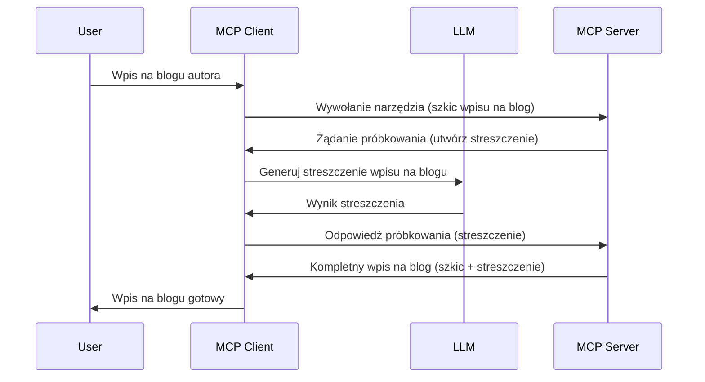

> [PRZETRWAŁO: KANDYDAT DO WYDANIA 2026-07-28](https://blog.modelcontextprotocol.io/posts/2026-07-28-release-candidate/)

# Sampling - delegowanie funkcji do Klienta

> **Informacja o przestarzałości:** kandydat do wydania specyfikacji MCP z 2026-07-28 oznacza Sampling jako przestarzały na rzecz bezpośredniej integracji z API dostawców LLM. Sampling nadal działa w wersji `2025-11-25` i co najmniej przez rok po oficjalnym wycofaniu, więc wszystko, co jest w tej lekcji, pozostaje ważne — ale nowe projekty serwera powinny rozważyć wzorzec zastępczy. Zobacz [Co się zmienia w MCP: Kandydat do wydania 2026-07-28](../../01-CoreConcepts/mcp-2026-07-28-release-candidate.md).

Czasami potrzebujesz, aby Klient MCP i Serwer MCP współpracowały w celu osiągnięcia wspólnego celu. Możesz mieć sytuację, w której Serwer potrzebuje pomocy LLM, który znajduje się po stronie klienta. W takiej sytuacji powinieneś użyć sampling.

Przyjrzyjmy się kilku przypadkom użycia i jak zbudować rozwiązanie wykorzystujące sampling.

## Przegląd

W tej lekcji skupimy się na wyjaśnieniu, kiedy i gdzie używać Sampling oraz jak go skonfigurować.

## Cele nauki

W tym rozdziale:

- Wyjaśnimy, czym jest Sampling i kiedy go używać.
- Pokażemy, jak skonfigurować Sampling w MCP.
- Przedstawimy przykłady działania Sampling.

## Czym jest Sampling i dlaczego go używać?

Sampling to zaawansowana funkcja działająca w następujący sposób:



### Żądanie sampling

Dobrze, teraz mamy ogólny zarys wiarygodnego scenariusza, porozmawiajmy o żądaniu sampling, które serwer wysyła z powrotem do klienta. Oto, jak takie żądanie może wyglądać w formacie JSON-RPC:

```json
{
  "jsonrpc": "2.0",
  "id": 1,
  "method": "sampling/createMessage",
  "params": {
    "messages": [
      {
        "role": "user",
        "content": {
          "type": "text",
          "text": "Create a blog post summary of the following blog post: <BLOG POST>"
        }
      }
    ],
    "modelPreferences": {
      "hints": [
        {
          "name": "claude-3-sonnet"
        }
      ],
      "intelligencePriority": 0.8,
      "speedPriority": 0.5
    },
    "systemPrompt": "You are a helpful assistant.",
    "maxTokens": 100
  }
}
```

Warto zwrócić uwagę na kilka rzeczy:

- Prompt, w polu content -> text, to nasza instrukcja dla LLM do podsumowania treści wpisu na blogu.

- **modelPreferences**. Ta sekcja to właśnie preferencje, rekomendacje dotyczące konfiguracji LLM. Użytkownik może zdecydować, czy skorzystać z tych rekomendacji, czy je zmienić. W tym przypadku są rekomendacje dotyczące modelu do użycia oraz priorytetu szybkości i inteligencji.
- **systemPrompt**, to standardowy prompt systemowy nadający LLM osobowość oraz zawierający instrukcje i wskazówki.
- **maxTokens**, to kolejna właściwość mówiąca, ile tokenów jest zalecane do użycia dla tego zadania.

### Odpowiedź na sampling

Ta odpowiedź jest tym, co Klient MCP ostatecznie wysyła z powrotem do Serwera MCP i jest wynikiem wywołania LLM przez klienta, oczekiwania na odpowiedź, a następnie skonstruowania tej wiadomości. Oto jak może wyglądać w formacie JSON-RPC:

```json
{
  "jsonrpc": "2.0",
  "id": 1,
  "result": {
    "role": "assistant",
    "content": {
      "type": "text",
      "text": "Here's your abstract <ABSTRACT>"
    },
    "model": "gpt-5",
    "stopReason": "endTurn"
  }
}
```

Zwróć uwagę, że odpowiedź jest streszczeniem wpisu na blogu, dokładnie tak, jak prosiliśmy. Zauważ również, że używany `model` nie jest tym, o który prosiliśmy, lecz "gpt-5" zamiast "claude-3-sonnet". Ilustruje to, że użytkownik może zmienić zdanie co do używanego modelu i że żądanie sampling jest rekomendacją.

Dobrze, teraz gdy rozumiemy główny przepływ i użyteczne zadanie "tworzenie wpisu na blog + streszczenie", spójrzmy, co musimy zrobić, aby to działało.

### Typy wiadomości

Wiadomości sampling nie są ograniczone tylko do tekstu, można również przesyłać obrazy i dźwięk. Oto, jak różni się JSON-RPC:

**Tekst**

```json
{
  "type": "text",
  "text": "The message content"
}
```

**Zawartość obrazu**

```json
{
  "type": "image",
  "data": "base64-encoded-image-data",
  "mimeType": "image/jpeg"
}
```

**Zawartość audio**

```json
{
  "type": "audio",
  "data": "base64-encoded-audio-data",
  "mimeType": "audio/wav"
}
```

> UWAGA: dla bardziej szczegółowych informacji na temat Sampling, sprawdź [oficjalną dokumentację](https://modelcontextprotocol.io/specification/2025-11-25/client/sampling)

## Jak skonfigurować Sampling w Kliencie

> Uwaga: jeśli budujesz tylko serwer, nie musisz tu wiele robić.

W kliencie musisz określić następującą funkcję w ten sposób:

```json
{
  "capabilities": {
    "sampling": {}
  }
}
```

To zostanie użyte podczas inicjalizacji klienta z serwerem.

## Przykład działania Sampling - Tworzenie wpisu na blogu

Zaimplementujmy razem serwer samplingowy, musimy wykonać następujące kroki:

1. Utworzyć narzędzie na Serwerze.
1. To narzędzie powinno stworzyć żądanie samplingowe.
1. Narzędzie powinno poczekać na odpowiedź samplingową klienta.
1. Następnie powinno wygenerować wynik narzędzia.

Spójrzmy na kod krok po kroku:

### -1- Utwórz narzędzie

**python**

```python
@mcp.tool()
async def create_blog(title: str, content: str, ctx: Context[ServerSession, None]) -> str:
    """Create a blog post and generate a summary"""

```

### -2- Utwórz żądanie sampling

Rozszerz swoje narzędzie następującym kodem:

**python**

```python
post = BlogPost(
        id=len(posts) + 1,
        title=title,
        content=content,
        abstract=""
    )

prompt = f"Create an abstract of the following blog post: title: {title} and draft: {content} "

result = await ctx.session.create_message(
        messages=[
            SamplingMessage(
                role="user",
                content=TextContent(type="text", text=prompt),
            )
        ],
        max_tokens=100,
)

```

### -3- Czekaj na odpowiedź i zwróć ją

**python**

```python
post.abstract = result.content.text

posts.append(post)

# zwróć kompletny produkt
return json.dumps({
    "id": post.title,
    "abstract": post.abstract
})
```

### -4- Pełny kod

**python**

```python
from starlette.applications import Starlette
from starlette.routing import Mount, Host

from mcp.server.fastmcp import Context, FastMCP

from mcp.server.session import ServerSession
from mcp.types import SamplingMessage, TextContent

import json


from uuid import uuid4
from typing import List
from pydantic import BaseModel


mcp = FastMCP("Blog post generator")

# app = FastAPI()

posts = []

class BlogPost(BaseModel):
    id: int
    title: str
    content: str
    abstract: str

posts: List[BlogPost] = []

@mcp.tool()
async def create_blog(title: str, content: str, ctx: Context[ServerSession, None]) -> str:
    """Create a blog post and generate a summary"""

    post = BlogPost(
        id=len(posts) + 1,
        title=title,
        content=content,
        abstract=""
    )

    prompt = f"Create an abstract of the following blog post: title: {title} and draft: {content} "

    result = await ctx.session.create_message(
        messages=[
            SamplingMessage(
                role="user",
                content=TextContent(type="text", text=prompt),
            )
        ],
        max_tokens=100,
    )

    post.abstract = result.content.text

    posts.append(post)

    # zwróć pełny wpis na blogu
    return json.dumps({
        "id": post.title,
        "abstract": post.abstract
    })

if __name__ == "__main__":
    print("Starting server...")
    # mcp.run()
    mcp.run(transport="streamable-http")

# uruchom aplikację poleceniem: python server.py
```

### -5- Testowanie w Visual Studio Code

Aby przetestować to w Visual Studio Code, wykonaj następujące czynności:

1. Uruchom serwer w terminalu
1. Dodaj go do *mcp.json* (i upewnij się, że jest uruchomiony), np. tak:

   ```json
   "servers": {
      "blog-server": {
        "type": "http",
        "url": "http://localhost:8000/mcp"
      }
   }
   ```

1. Wpisz prompt:

   ```text
   create a blog post named "Where Python comes from", the content is "Python is actually named after Monty Python Flying Circus"
   ```

1. Pozwól na wykonanie sampling. Za pierwszym razem podczas testu pojawi się dodatkowy dialog, który musisz zaakceptować, potem zobaczysz normalny dialog z prośbą o uruchomienie narzędzia.

1. Sprawdź wyniki. Zobaczysz je ładnie wyrenderowane w GitHub Copilot Chat, a także możesz przejrzeć surową odpowiedź JSON.

**Bonus**. Narzędzia Visual Studio Code mają świetne wsparcie dla sampling. Możesz skonfigurować dostęp do Sampling na swoim zainstalowanym serwerze, przechodząc tam tak:

1. Przejdź do sekcji rozszerzeń.
1. Wybierz ikonę koła zębatego dla zainstalowanego serwera w sekcji "MCP SERVERS - INSTALLED".
1 Wybierz "Configure Model Access", gdzie możesz wybrać, których modeli GitHub Copilot może używać podczas sampling. Możesz też zobaczyć wszystkie ostatnie żądania sampling, wybierając "Show Sampling requests".

## Zadanie

W tym zadaniu zbudujesz nieco inny Sampling, mianowicie integrację samplingową obsługującą generowanie opisu produktu. Oto Twój scenariusz:

**Scenariusz**: Pracownik zaplecza e-commerce potrzebuje pomocy, generowanie opisów produktów zabiera zbyt dużo czasu. Dlatego masz zbudować rozwiązanie, w którym wywołujesz narzędzie "create_product" z argumentami "title" i "keywords", a ono powinno wygenerować kompletny produkt z polem "description", które jest uzupełnione przez LLM klienta.

WSKAZÓWKA: użyj tego, czego nauczyłeś się wcześniej, aby zbudować ten serwer i jego narzędzie przy użyciu żądania sampling.

## Rozwiązanie

[Rozwiązanie](./solution/README.md)

## Kluczowe wnioski

Sampling to potężna funkcja umożliwiająca serwerowi delegowanie zadań do klienta, gdy potrzebuje pomocy LLM.

## Co dalej

- [Rozdział 4 - Implementacja praktyczna](../../04-PracticalImplementation/README.md)

---

<!-- CO-OP TRANSLATOR DISCLAIMER START -->
**Zastrzeżenie**:
Niniejszy dokument został przetłumaczony za pomocą usługi tłumaczenia AI [Co-op Translator](https://github.com/Azure/co-op-translator). Choć dążymy do dokładności, prosimy pamiętać, że automatyczne tłumaczenia mogą zawierać błędy lub niedokładności. Oryginalny dokument w jego języku źródłowym należy uznawać za autorytatywne źródło. W przypadku informacji krytycznych zalecane jest skorzystanie z profesjonalnego tłumaczenia wykonanego przez człowieka. Nie ponosimy odpowiedzialności za jakiekolwiek nieporozumienia lub błędne interpretacje wynikające z użycia tego tłumaczenia.
<!-- CO-OP TRANSLATOR DISCLAIMER END -->