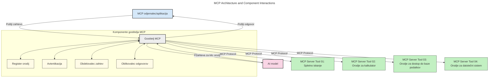
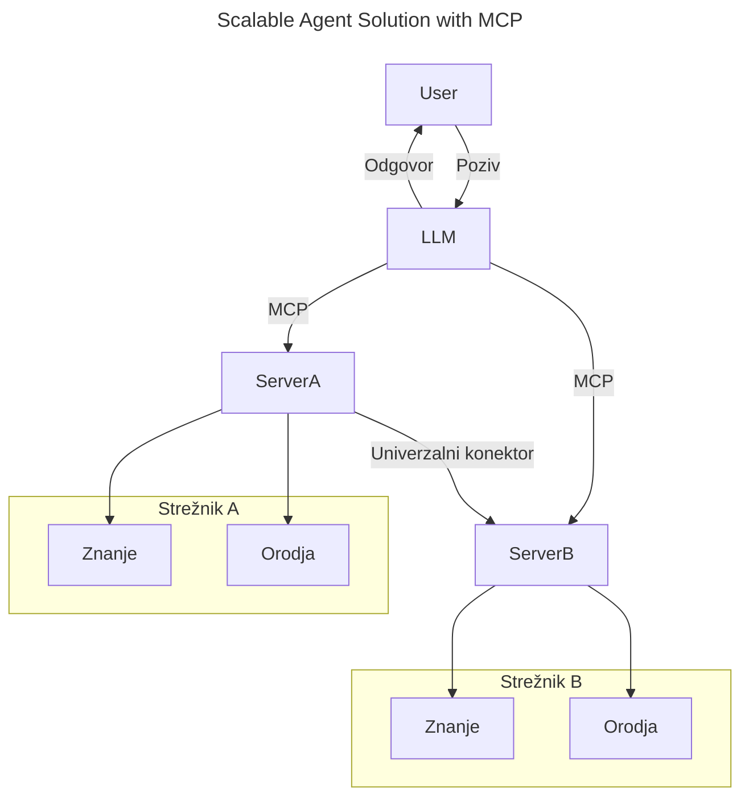
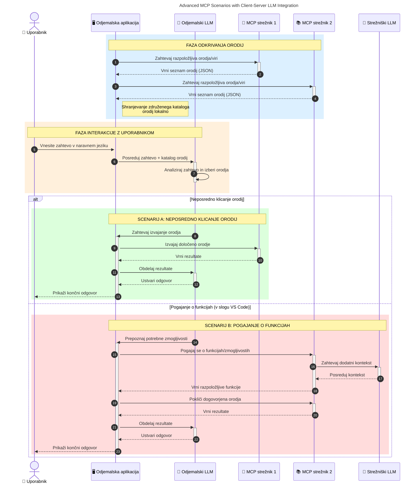

# Uvod v protokol za kontekst modela (MCP): Zakaj je pomemben za razširljive AI aplikacije

_(Kliknite na zgornjo sliko za ogled videoposnetka tega lekcije)_

Generativne AI aplikacije predstavljajo velik korak naprej, saj pogosto omogočajo uporabniku interakcijo z aplikacijo z uporabo naravnega jezika. Vendar pa, ko v takšne aplikacije vložite več časa in sredstev, želite zagotoviti, da lahko enostavno integrirate funkcionalnosti in vire na način, ki omogoča enostavno razširjanje, da vaša aplikacija podpira več kot en model in obvladuje različne zapletenosti modelov. S kratko povedano, izdelava Gen AI aplikacij je na začetku preprosta, a ko zrastejo in postanejo bolj kompleksne, je potrebno začeti opredeljevati arhitekturo in verjetno se bo treba zanašati na standard, da bodo vaše aplikacije zgrajene na dosleden način. Tu pride MCP, da uredi stvari in zagotovi standard.

---

## **🔍 Kaj je protokol za kontekst modela (MCP)?**

**Protokol za kontekst modela (MCP)** je **odprt, standardiziran vmesnik**, ki omogoča velikim jezikovnim modelom (LLM) nemoteno interakcijo z zunanjimi orodji, API-ji in podatkovnimi viri. Ponuja dosledno arhitekturo za izboljšanje zmogljivosti AI modelov onkraj njihovih učnih podatkov, kar omogoča pametnejše, razširljive in odzivnejše AI sisteme.

---

## **🎯 Zakaj je standardizacija v AI pomembna**

Ko generativne AI aplikacije postajajo bolj kompleksne, je nujno sprejeti standarde, ki zagotavljajo **razširljivost, razširljivost, vzdržnost** in **izogibanje zaklepanju pri ponudnikih**. MCP naslavlja te potrebe z:

- Združevanjem integracij model-orodje
- Zmanjševanjem krhkih, enkratnih prilagojenih rešitev
- Omogočanjem sožitja več modelov različnih ponudnikov v enem ekosistemu

**Opomba:** Čeprav se MCP oglašuje kot odprt standard, ni načrtov za standardizacijo MCP preko obstoječih standardizacijskih teles, kot so IEEE, IETF, W3C, ISO ali katero koli drugo telo za standarde.

---

## **📚 Cilji učenja**

Do konca tega članka boste lahko:

- Opredelili **protokol za kontekst modela (MCP)** in njegove primere uporabe
- Razumeli, kako MCP standardizira komunikacijo model-orodje
- Prepoznali osnovne sestavine arhitekture MCP
- Raziskali primere uporabe MCP v podjetniških in razvojnih okoljih

---

## **💡 Zakaj je protokol za kontekst modela (MCP) prelomnica**

### **🔗 MCP rešuje fragmentacijo v AI interakcijah**

Pred MCP so zahtevale integracije modelov in orodij:

- Prilagojena koda za vsak par orodje-model
- Nestandardizirani API-ji za vsakega ponudnika
- Pogoste prekinitve zaradi posodobitev
- Slaba razširljivost pri več orodjih

### **✅ Prednosti standardizacije MCP**

| **Prednost**              | **Opis**                                                                |
|--------------------------|-------------------------------------------------------------------------|
| Interoperabilnost        | LLM-ji nemoteno delujejo z orodji različnih ponudnikov                 |
| Konsistentnost           | Enotno vedenje med platformami in orodji                               |
| Ponovna uporabnost       | Orodja, zgrajena enkrat, se lahko uporabljajo v različnih projektih     |
| Pospešen razvoj          | Zmanjšanje časa razvoja z uporabo standardiziranih vmesnikov plug-and-play |

---

## **🧱 Pregled visokorazinske arhitekture MCP**

MCP sledi **modelu strežnik-stranka**, kjer:

- **Gostitelji MCP** poganjajo AI modele
- **MCP stranke** sprožajo zahtevke
- **MCP strežniki** zagotavljajo kontekst, orodja in zmogljivosti

### **Ključne sestavine:**

- **Viri** – statični ali dinamični podatki za modele  
- **Pozivi (Prompts)** – vnaprej določeni delovni tokovi za vodeno generiranje  
- **Orodja** – izvršljive funkcije, kot so iskanje, izračuni  
- **Vzorčenje (Sampling)** – agentno vedenje prek rekurzivnih interakcij (ukinjeno v izdaji kandidat `2026-07-28`)
- **Izvabljanje (Elicitation)** – zahteve na iniciativo strežnika za vnos uporabnika
- **Koreni (Roots)** – mejne datotečne sisteme za nadzor dostopa strežnika (ukinjeno v izdaji kandidat `2026-07-28`)

### **Arhitektura protokola:**

MCP uporablja dvoplastno arhitekturo:
- **Plast podatkov**: komunikacija temelji na JSON-RPC 2.0 z upravljanjem življenjskega cikla in primitivnimi operacijami
- **Plast prenosa**: kanali komunikacije STDIO (lokalno) in Streamable HTTP s SSE (oddaljeno)

---

## Kako delujejo MCP strežniki

MCP strežniki delujejo na naslednji način:

- **Potek zahtevka**:
    1. Zahtevek sproži končni uporabnik ali programska oprema v njegovem imenu.
    2. **MCP stranka** pošlje zahtevek gostitelju MCP, ki upravlja z izvajanjem AI modela.
    3. **AI model** prejme uporabniški poziv in lahko zahteva dostop do zunanjih orodij ali podatkov prek enega ali več klicev orodij.
    4. **Gostitelj MCP**, ne neposredno model, komunicira z ustreznim **MCP strežnikom(ki)** z uporabo standardiziranega protokola.
- **Funkcionalnost gostitelja MCP**:
    - **Register orodij**: Vzdržuje katalog razpoložljivih orodij in njihovih zmogljivosti.
    - **Avtentikacija**: Preverja dovoljenja za dostop do orodij.
    - **Obdelava zahtevkov**: Obdeluje vhodne zahtevke orodij od modela.
    - **Oblikovalec odgovorov**: Struktura izhodov orodij v obliki, ki jo model razume.
- **Izvrševanje MCP strežnika**:
    - **Gostitelj MCP** preusmeri klice orodij na enega ali več **MCP strežnikov**, ki vsak nudijo specializirane funkcije (npr. iskanje, izračuni, poizvedbe v bazi).
    - **MCP strežniki** izvedejo svoje operacije in vrnejo rezultate gostitelju v dosledni obliki.
    - **Gostitelj MCP** oblikuje in posreduje rezultate naprej **AI modelu**.
- **Dokončanje odgovora**:
    - **AI model** vključi izhode orodij v končni odgovor.
    - **Gostitelj MCP** pošlje ta odgovor nazaj **MCP stranki**, ki ga posreduje končnemu uporabniku ali klicni programski opremi.
    

## 👨‍💻 Kako zgraditi MCP strežnik (z zgledi)

MCP strežniki vam omogočajo razširjanje zmožnosti LLM z zagotavljanjem podatkov in funkcionalnosti. 

Ste pripravljeni preizkusiti? Tukaj so SDK-ji specifični za programski jezik in/ali sklad s primeri ustvarjanja preprostih MCP strežnikov v različnih jezikih/skladih:

- **Python SDK**: https://github.com/modelcontextprotocol/python-sdk

- **TypeScript SDK**: https://github.com/modelcontextprotocol/typescript-sdk

- **Java SDK**: https://github.com/modelcontextprotocol/java-sdk

- **C#/.NET SDK**: https://github.com/modelcontextprotocol/csharp-sdk

## 🌍 Resnični primeri uporabe MCP

MCP omogoča širok spekter aplikacij z razširitvijo zmogljivosti AI:

| **Aplikacija**                | **Opis**                                                                |
|------------------------------|-------------------------------------------------------------------------|
| Podjetniška integracija podatkov | Povezava LLM-jev z bazami podatkov, CRM-ji ali notranjimi orodji       |
| Agentni AI sistemi           | Omogočajo avtonomne agente z dostopom do orodij in delovnimi tokovi odločanja |
| Večmodalne aplikacije        | Združujejo besedilo, slike in zvočna orodja znotraj ene združene AI aplikacije |
| Integracija podatkov v realnem času | Vnašanje živih podatkov v AI interakcije za bolj točne in aktualne izhode |

### 🧠 MCP = Univerzalni standard za AI interakcije

Protokol za kontekst modela (MCP) deluje kot univerzalni standard za interakcije AI, podobno kot je USB-C standardiziral fizične povezave za naprave. V svetu AI MCP zagotavlja dosleden vmesnik, ki omogoča modelom (strankam) nemoteno integracijo z zunanjimi orodji in ponudniki podatkov (strežniki). To odpravlja potrebo po različnih, prilagojenih protokolih za vsak API ali podatkovni vir.

V okviru MCP orodje, združljivo z MCP (imenovano MCP strežnik), sledi enotnemu standardu. Ti strežniki lahko na seznamu prikažejo orodja ali dejanja, ki jih ponujajo, in izvajajo ta dejanja, ko jih zahteva AI agent. Platforme AI agentov, ki podpirajo MCP, lahko odkrijejo razpoložljiva orodja s strežnikov in jih pokličejo prek tega standardnega protokola.

### 💡 Omogoča dostop do znanja

Poleg ponujanja orodij MCP tudi olajša dostop do znanja. Omogoča aplikacijam, da zagotovijo kontekst velikim jezikovnim modelom (LLM) z povezovanjem z različnimi podatkovnimi viri. Na primer, MCP strežnik lahko predstavlja arhiv podjetja, ki agentom omogoča pridobivanje ustreznih informacij na zahtevo. Drug strežnik lahko upravlja s specifičnimi dejanji, kot je pošiljanje elektronske pošte ali posodabljanje zapisov. Z vidika agenta so to preprosto orodja, ki jih lahko uporablja – nekatera orodja vračajo podatke (koncept znanja), druga pa izvajajo dejanja. MCP učinkovito upravlja oboje.

Agent, ki se poveže z MCP strežnikom, samodejno spozna razpoložljive zmogljivosti in dostopne podatke strežnika prek standardizirane oblike. Ta standardizacija omogoča dinamično razpoložljivost orodij. Na primer, dodajanje novega MCP strežnika v sistem agenta takoj omogoči uporabnost njegovih funkcij brez dodatnih prilagoditev navodil agenta.

Ta enostavna integracija se ujema s tokom, prikazanim na spodnjem diagramu, kjer strežniki zagotavljajo tako orodja kot znanje, kar omogoča nemoteno sodelovanje med sistemi.

### 👉 Primer: Razširljiva agentna rešitev

Universalni priključek omogoča MCP strežnikom medsebojno komunikacijo in deljenje zmogljivosti, kar ServerA dovoljuje, da delegira naloge ServerBju ali dostopa do njegovih orodij in znanja. To povezuje orodja in podatke med strežniki, podpira razširljive in modularne agentne arhitekture. Ker MCP standardizira izpostavljanje orodij, lahko agenti dinamično odkrijejo in usmerjajo zahtevke med strežniki brez vnaprej kodiranih integracij.

Federacija orodij in znanja: Orodja in podatke je mogoče dostopati prek strežnikov, kar omogoča bolj razširljive in modularne agentne arhitekture.

### 🔄 Napredni MCP scenariji z integracijo LLM na strani odjemalca

Poleg osnovne arhitekture MCP obstajajo napredni scenariji, kjer tako stranka kot strežnik vsebujeta LLM-je, kar omogoča bolj sofisticirane interakcije. Na spodnjem diagramu je **Strankina aplikacija** lahko IDE z več MCP orodji, ki jih LLM uporablja:

## 🔐 Praktične prednosti MCP

Tukaj so praktične prednosti uporabe MCP:

- **Svežina**: modeli dostopajo do ažurnih informacij onkraj učnih podatkov
- **Razširitev zmožnosti**: modeli lahko uporabljajo specializirana orodja za naloge, za katere niso bili usposobljeni
- **Zmanjšane halucinacije**: zunanji podatkovni viri zagotavljajo dejansko osnovo
- **Zasebnost**: občutljivi podatki ostanejo v varnih okoljih namesto da so vdelani v pozive

## 📌 Ključni poudarki

Spodaj so ključni poudarki za uporabo MCP:

- **MCP** standardizira način, kako AI modeli komunicirajo z orodji in podatki
- Spodbuja **razširljivost, konsistentnost in interoperabilnost**
- MCP pomaga **zmanjšati čas razvoja, izboljšati zanesljivost in razširiti zmogljivosti modela**
- Arhitektura strežnik-stranka **omogoča prilagodljive, razširljive AI aplikacije**

## 🧠 Vaja

Razmislite o AI aplikaciji, ki jo želite razviti.

- Katera **zunanja orodja ali podatki** bi lahko izboljšali njene zmogljivosti?
- Kako bi MCP lahko naredil integracijo **preprostejšo in bolj zanesljivo?**

## Dodatni viri

- [MCP GitHub repozitorij](https://github.com/modelcontextprotocol)

## Kaj sledi

Naslednje: [Poglavje 1: Temeljni koncepti](../01-CoreConcepts/README.md)

---

<!-- CO-OP TRANSLATOR DISCLAIMER START -->
**Omejitev odgovornosti**:
Ta dokument je bil preveden z uporabo AI prevajalske storitve [Co-op Translator](https://github.com/Azure/co-op-translator). Čeprav si prizadevamo za natančnost, vas prosimo, da upoštevate, da avtomatizirani prevodi lahko vsebujejo napake ali netočnosti. Izvirni dokument v njegovem izvirnem jeziku je treba obravnavati kot avtoritativni vir. Za kritične informacije je priporočljiv strokovni človeški prevod. Ne odgovarjamo za morebitna nesporazume ali napačne interpretacije, ki izhajajo iz uporabe tega prevoda.
<!-- CO-OP TRANSLATOR DISCLAIMER END -->