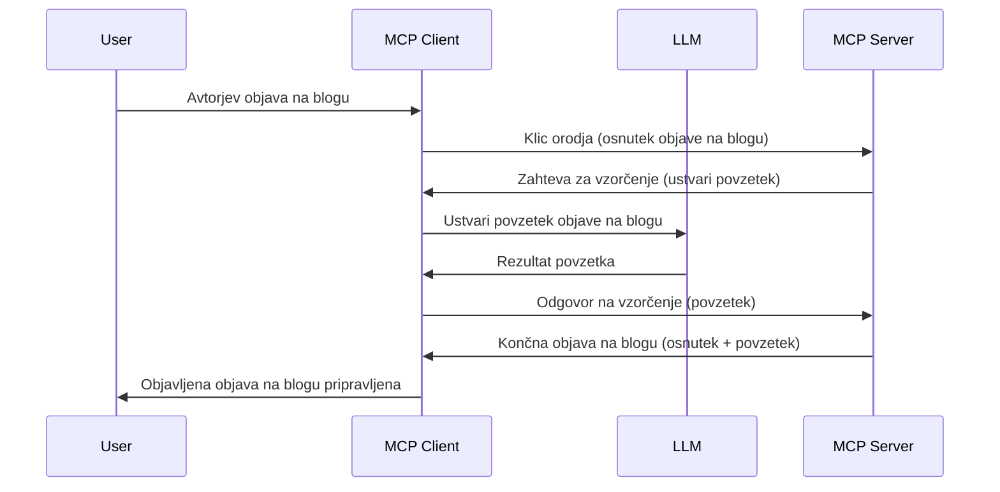

> [OPRAVLJENO: KANDIDAT ZA IZDAJO 2026-07-28](https://blog.modelcontextprotocol.io/posts/2026-07-28-release-candidate/)

# Sampling - delegiranje funkcij odjemalcu

> **Obvestilo o opuščanju:** kandidati za izdajo specifikacije MCP `2026-07-28` označujejo Sampling kot opuščeno v prid neposredni integraciji z API-ji ponudnikov LLM. Sampling še vedno deluje v `2025-11-25` in vsaj eno leto po formalnem opuščanju, zato je vse v tej lekciji še vedno veljavno — vendar naj novi strežniški dizajni ocenijo zamenjavni vzorec. Glej [Kaj se spreminja v MCP: Kandidat za izdajo 2026-07-28](../../01-CoreConcepts/mcp-2026-07-28-release-candidate.md).

Včasih morata MCP klient in MCP strežnik sodelovati, da dosežeta skupni cilj. Morda imate primer, kjer strežnik potrebuje pomoč LLM, ki teče na klientu. V tem primeru je sampling tisto, kar bi morali uporabiti.

Raziščimo nekaj primerov uporabe in kako zgraditi rešitev, ki vključuje sampling.

## Pregled

V tej lekciji se osredotočamo na razlago, kdaj in kje uporabiti Sampling ter kako ga konfigurirati.

## Cilji učenja

V tem poglavju bomo:

- Razložili, kaj je Sampling in kdaj ga uporabiti.
- Pokažemo, kako konfigurirati Sampling v MCP.
- Predstavili primere delovanja Sampling.

## Kaj je Sampling in zakaj ga uporabiti?

Sampling je napredna funkcija, ki deluje na naslednji način:



### Zahteva za sampling

V redu, zdaj imamo splošni pogled na verjeten scenarij, pogovorimo se o zahtevi za sampling, ki jo strežnik pošlje klientu. Takšna zahteva lahko izgleda takole v formatu JSON-RPC:

```json
{
  "jsonrpc": "2.0",
  "id": 1,
  "method": "sampling/createMessage",
  "params": {
    "messages": [
      {
        "role": "user",
        "content": {
          "type": "text",
          "text": "Create a blog post summary of the following blog post: <BLOG POST>"
        }
      }
    ],
    "modelPreferences": {
      "hints": [
        {
          "name": "claude-3-sonnet"
        }
      ],
      "intelligencePriority": 0.8,
      "speedPriority": 0.5
    },
    "systemPrompt": "You are a helpful assistant.",
    "maxTokens": 100
  }
}
```

Tu je nekaj pomembnih stvari, ki jih velja izpostaviti:

- Prompt, v vsebini -> text, je naš poziv, ki je navodilo LLM-ju za povzetek vsebine blog zapisa.

- **modelPreferences**. Ta razdelek je zgolj preference, priporočilo za konfiguracijo, ki jo naj bi uporabili z LLM. Uporabnik se lahko odloči, ali gre po teh priporočilih ali jih spremeni. V tem primeru so priporočila, kateri model uporabiti in prioriteta hitrosti ter inteligence.
- **systemPrompt**, to je običajni sistemski poziv, ki vašemu LLM-ju daje osebnost in vsebuje navodila.
- **maxTokens**, to je še ena lastnost, ki pove, koliko žetonov je priporočljivo uporabiti za to nalogo.

### Odgovor na sampling

Ta odgovor je tisto, kar MCP klient na koncu pošlje nazaj MCP strežniku in je rezultat klica LLM-ja, čakanja na odgovor in nato sestave tega sporočila. Takole lahko izgleda v JSON-RPC:

```json
{
  "jsonrpc": "2.0",
  "id": 1,
  "result": {
    "role": "assistant",
    "content": {
      "type": "text",
      "text": "Here's your abstract <ABSTRACT>"
    },
    "model": "gpt-5",
    "stopReason": "endTurn"
  }
}
```

Opazite, da je odgovor povzetek blog zapisa, kot smo zahtevali. Prav tako opazite, da uporabljen `model` ni tisti, ki smo ga zahtevali, ampak "gpt-5" namesto "claude-3-sonnet". To kaže, da lahko uporabnik spremeni odločitev o uporabi in da je vaša zahteva za sampling priporočilo.

V redu, zdaj ko razumemo glavni tok in uporabno nalogo za "ustvarjanje blog zapisa + povzetek", poglejmo, kaj moramo narediti, da deluje.

### Vrste sporočil

Sporočila za sampling niso omejena le na besedilo, ampak lahko pošljete tudi slike in zvok. Tako se JSON-RPC razlikuje:

**Besedilo**

```json
{
  "type": "text",
  "text": "The message content"
}
```

**Vsebina slike**

```json
{
  "type": "image",
  "data": "base64-encoded-image-data",
  "mimeType": "image/jpeg"
}
```

**Vsebina zvoka**

```json
{
  "type": "audio",
  "data": "base64-encoded-audio-data",
  "mimeType": "audio/wav"
}
```

> OPOMBA: za bolj podrobne informacije o Sampling glejte [uradne dokumente](https://modelcontextprotocol.io/specification/2025-11-25/client/sampling)

## Kako konfigurirati Sampling v Klientu

> Opomba: če izdelujete samo strežnik, tukaj večinoma ni potrebno kaj narediti.

V klientu morate določiti naslednjo funkcijo, kot sledi:

```json
{
  "capabilities": {
    "sampling": {}
  }
}
```

To bo nato zaznal, ko se vaš izbrani klient poveže s strežnikom.

## Primer delovanja Sampling - Ustvarjanje blog zapisa

Napišimo sampling strežnik skupaj; potrebno bo narediti naslednje:

1. Ustvariti orodje na strežniku.
1. Orodje naj ustvari zahtevo za sampling.
1. Orodje naj počaka na odgovor na zahtevo za sampling od klienta.
1. Nato naj bo rezultat orodja proizveden.

Poglejmo kodo korak za korakom:

### -1- Ustvari orodje

**python**

```python
@mcp.tool()
async def create_blog(title: str, content: str, ctx: Context[ServerSession, None]) -> str:
    """Create a blog post and generate a summary"""

```

### -2- Ustvari zahtevo za sampling

Razširite orodje s sledečo kodo:

**python**

```python
post = BlogPost(
        id=len(posts) + 1,
        title=title,
        content=content,
        abstract=""
    )

prompt = f"Create an abstract of the following blog post: title: {title} and draft: {content} "

result = await ctx.session.create_message(
        messages=[
            SamplingMessage(
                role="user",
                content=TextContent(type="text", text=prompt),
            )
        ],
        max_tokens=100,
)

```

### -3- Počakaj na odgovor in vrni odgovor

**python**

```python
post.abstract = result.content.text

posts.append(post)

# vrni celoten izdelek
return json.dumps({
    "id": post.title,
    "abstract": post.abstract
})
```

### -4- Celotna koda

**python**

```python
from starlette.applications import Starlette
from starlette.routing import Mount, Host

from mcp.server.fastmcp import Context, FastMCP

from mcp.server.session import ServerSession
from mcp.types import SamplingMessage, TextContent

import json


from uuid import uuid4
from typing import List
from pydantic import BaseModel


mcp = FastMCP("Blog post generator")

# app = FastAPI()

posts = []

class BlogPost(BaseModel):
    id: int
    title: str
    content: str
    abstract: str

posts: List[BlogPost] = []

@mcp.tool()
async def create_blog(title: str, content: str, ctx: Context[ServerSession, None]) -> str:
    """Create a blog post and generate a summary"""

    post = BlogPost(
        id=len(posts) + 1,
        title=title,
        content=content,
        abstract=""
    )

    prompt = f"Create an abstract of the following blog post: title: {title} and draft: {content} "

    result = await ctx.session.create_message(
        messages=[
            SamplingMessage(
                role="user",
                content=TextContent(type="text", text=prompt),
            )
        ],
        max_tokens=100,
    )

    post.abstract = result.content.text

    posts.append(post)

    # vrni celoten blog zapis
    return json.dumps({
        "id": post.title,
        "abstract": post.abstract
    })

if __name__ == "__main__":
    print("Starting server...")
    # mcp.run()
    mcp.run(transport="streamable-http")

# zaženi aplikacijo z: python server.py
```

### -5- Testiranje v Visual Studio Code

Za preizkus v Visual Studio Code naredite naslednje:

1. Zaženite strežnik v terminalu
1. Dodajte ga v *mcp.json* (in zagotovite, da teče), npr. nekaj takega:

   ```json
   "servers": {
      "blog-server": {
        "type": "http",
        "url": "http://localhost:8000/mcp"
      }
   }
   ```

1. Vnesite poziv:

   ```text
   create a blog post named "Where Python comes from", the content is "Python is actually named after Monty Python Flying Circus"
   ```

1. Dovolite izvajanje samplinga. Prvič, ko to preizkusite, se pojavi dodatno okno, ki ga morate potrditi, nato se prikaže običajno okno z zahtevo za zagon orodja.

1. Preglejte rezultate. Rezultate boste videli lepo prikazane v GitHub Copilot Chat, lahko pa pregledate tudi surov JSON odgovor.

**Bonus**. Orodja za Visual Studio Code odlično podpirajo sampling. Dostop do Sampling lahko konfigurirate na vašem nameščenem strežniku tako, da:

1. Pojdite v sekcijo razširitev.
1. Izberite ikono nastavitev za vaš nameščeni strežnik v razdelku "MCP SERVERS - INSTALLED".
1 Izberite "Configure Model Access" (Konfiguriraj dostop do modela), kjer lahko izberete, katere modele lahko GitHub Copilot uporablja pri samplingu. Vidite lahko tudi vse nedavne zahteve za sampling s klikom "Show Sampling requests" (Prikaži zahteve za sampling).

## Naloga

V tej nalogi boste zgradili nekoliko drugačen Sampling, in sicer integracijo za sampling, ki podpira generiranje opisa izdelka. Tukaj je vaš scenarij:

**Scenarij**: Delo v back office pri e-trgovini je zamudno, saj traja predolgo generiranje opisov izdelkov. Zato morate zgraditi rešitev, kjer lahko pokličete orodje "create_product" z argumentoma "title" in "keywords", ki ustvari popoln izdelek vključno s poljem "description", ki ga izpolni LLM na klientu.

NASVET: uporabite prej pridobljeno znanje, da sestavite ta strežnik in orodje z uporabo zahteve za sampling.

## Rešitev

[Rešitev](./solution/README.md)

## Ključne ugotovitve

Sampling je močna funkcija, ki strežniku omogoča delegiranje nalog klientu, kadar potrebuje pomoč LLM.

## Kaj sledi

- [Poglavje 4 - Praktična izvedba](../../04-PracticalImplementation/README.md)

---

<!-- CO-OP TRANSLATOR DISCLAIMER START -->
**Omejitev odgovornosti**:
Ta dokument je bil preveden z uporabo AI prevajalske storitve [Co-op Translator](https://github.com/Azure/co-op-translator). Čeprav si prizadevamo za natančnost, vas prosimo, da upoštevate, da avtomatizirani prevodi lahko vsebujejo napake ali netočnosti. Izvirni dokument v njegovem izvirnem jeziku je treba obravnavati kot avtoritativni vir. Za kritične informacije je priporočljiv strokovni človeški prevod. Ne odgovarjamo za morebitna nesporazume ali napačne interpretacije, ki izhajajo iz uporabe tega prevoda.
<!-- CO-OP TRANSLATOR DISCLAIMER END -->