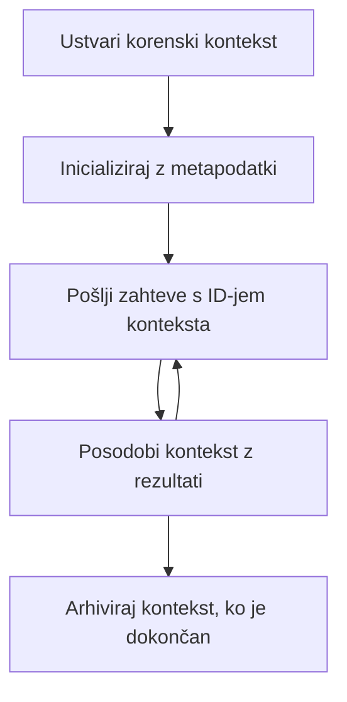

> [ZASTARELO: IZDAJNI KANIDAT 2026-07-28](https://blog.modelcontextprotocol.io/posts/2026-07-28-release-candidate/#roots-sampling-and-logging-are-deprecated)

# Koranji konteksti MCP

> **Obvestilo o zastarelosti:** izdajni kandidat specifikacije MCP `2026-07-28` označuje korenje kot zastarelo v korist parametrov orodij, URI-jev virov ali konfiguracije strežnika. Korenje še vedno delujejo v `2025-11-25` in vsaj eno leto po uradni zastarelosti, zato vsebina te lekcije ostaja veljavna - vendar naj nove zasnove strežnikov ocenijo nadomestni vzorec. Oglejte si [Kaj se spreminja v MCP: izdajni kandidat 2026-07-28](../../01-CoreConcepts/mcp-2026-07-28-release-candidate.md).

Korenji konteksti so temeljni koncept v Model Context Protocol, ki zagotavlja vztrajno plast za vzdrževanje zgodovine pogovora in skupnega stanja preko več zahtevkov in sej.

## Uvod

V tej lekciji bomo raziskali, kako ustvariti, upravljati in uporabljati korenje kontekste v MCP.

## Cilji učenja

Do konca te lekcije boste lahko:

- Razumeli namen in strukturo korenih kontekstov
- Ustvarjali in upravljali korenje kontekste z uporabo knjižnic strank MCP
- Implementirali korenji konteksti v aplikacijah .NET, Java, JavaScript in Python
- Uporabljali korenje kontekste za večvračilne pogovore in upravljanje stanja
- Uporabili najboljše prakse za upravljanje korenja konteksta

## Razumevanje korenih kontekstov

Korenji konteksti služijo kot vsebniki, ki hranijo zgodovino in stanje za serijo povezanih interakcij. Omogočajo:

- **Vztrajanje pogovora**: vzdrževanje koherentnih večvračilnih pogovorov
- **Upravljanje spomina**: shranjevanje in pridobivanje informacij skozi interakcije
- **Upravljanje stanja**: sledenje napredku v zapletenih potekih dela
- **Deljenje konteksta**: omogočanje dostopa večim strankam do istega stanja pogovora

V MCP imajo korenji konteksti te ključne značilnosti:

- Vsak korenji kontekst ima enolični identifikator.
- Lahko vsebujejo zgodovino pogovora, uporabniške nastavitve in druge metapodatke.
- Lahko jih ustvarimo, dostopamo do njih in arhiviramo po potrebi.
- Podpirajo natančen nadzor dostopa in dovoljenja.

## Življenjski cikel korenega konteksta



## Delo s korenimi konteksti

Tukaj je primer, kako ustvariti in upravljati korenje kontekste.

### Implementacija v C#

```csharp
// .NET Example: Root Context Management
using Microsoft.Mcp.Client;
using System;
using System.Threading.Tasks;
using System.Collections.Generic;

public class RootContextExample
{
    private readonly IMcpClient _client;
    private readonly IRootContextManager _contextManager;
    
    public RootContextExample(IMcpClient client, IRootContextManager contextManager)
    {
        _client = client;
        _contextManager = contextManager;
    }
    
    public async Task DemonstrateRootContextAsync()
    {
        // 1. Create a new root context
        var contextResult = await _contextManager.CreateRootContextAsync(new RootContextCreateOptions
        {
            Name = "Customer Support Session",
            Metadata = new Dictionary<string, string>
            {
                ["CustomerName"] = "Acme Corporation",
                ["PriorityLevel"] = "High",
                ["Domain"] = "Cloud Services"
            }
        });
        
        string contextId = contextResult.ContextId;
        Console.WriteLine($"Created root context with ID: {contextId}");
        
        // 2. First interaction using the context
        var response1 = await _client.SendPromptAsync(
            "I'm having issues scaling my web service deployment in the cloud.", 
            new SendPromptOptions { RootContextId = contextId }
        );
        
        Console.WriteLine($"First response: {response1.GeneratedText}");
        
        // Second interaction - the model will have access to the previous conversation
        var response2 = await _client.SendPromptAsync(
            "Yes, we're using containerized deployments with Kubernetes.", 
            new SendPromptOptions { RootContextId = contextId }
        );
        
        Console.WriteLine($"Second response: {response2.GeneratedText}");
        
        // 3. Add metadata to the context based on conversation
        await _contextManager.UpdateContextMetadataAsync(contextId, new Dictionary<string, string>
        {
            ["TechnicalEnvironment"] = "Kubernetes",
            ["IssueType"] = "Scaling"
        });
        
        // 4. Get context information
        var contextInfo = await _contextManager.GetRootContextInfoAsync(contextId);
        
        Console.WriteLine("Context Information:");
        Console.WriteLine($"- Name: {contextInfo.Name}");
        Console.WriteLine($"- Created: {contextInfo.CreatedAt}");
        Console.WriteLine($"- Messages: {contextInfo.MessageCount}");
        
        // 5. When the conversation is complete, archive the context
        await _contextManager.ArchiveRootContextAsync(contextId);
        Console.WriteLine($"Archived context {contextId}");
    }
}
```

V zgornji kodi smo:

1. Ustvarili korenji kontekst za sejo podpore strankam.
1. Poslali več sporočil znotraj tega konteksta, kar omogoča modelu vzdrževanje stanja.
1. Posodobili kontekst z ustreznimi metapodatki na podlagi pogovora.
1. Pridobili informacije iz konteksta za razumevanje zgodovine pogovora.
1. Arhivirali kontekst, ko je bil pogovor zaključen.

## Primer: Implementacija korenega konteksta za finančno analizo

V tem primeru bomo ustvarili korenji kontekst za sejo finančne analize, prikazali, kako vzdrževati stanje skozi več interakcij.

### Implementacija v Javi

```java
// Java primer: Implementacija osnovnega konteksta
package com.example.mcp.contexts;

import com.mcp.client.McpClient;
import com.mcp.client.ContextManager;
import com.mcp.models.RootContext;
import com.mcp.models.McpResponse;

import java.util.HashMap;
import java.util.Map;
import java.util.UUID;

public class RootContextsDemo {
    private final McpClient client;
    private final ContextManager contextManager;
    
    public RootContextsDemo(String serverUrl) {
        this.client = new McpClient.Builder()
            .setServerUrl(serverUrl)
            .build();
            
        this.contextManager = new ContextManager(client);
    }
    
    public void demonstrateRootContext() throws Exception {
        // Ustvari metapodatke konteksta
        Map<String, String> metadata = new HashMap<>();
        metadata.put("projectName", "Financial Analysis");
        metadata.put("userRole", "Financial Analyst");
        metadata.put("dataSource", "Q1 2025 Financial Reports");
        
        // 1. Ustvari nov osnovni kontekst
        RootContext context = contextManager.createRootContext("Financial Analysis Session", metadata);
        String contextId = context.getId();
        
        System.out.println("Created context: " + contextId);
        
        // 2. Prva interakcija
        McpResponse response1 = client.sendPrompt(
            "Analyze the trends in Q1 financial data for our technology division",
            contextId
        );
        
        System.out.println("First response: " + response1.getGeneratedText());
        
        // 3. Posodobi kontekst z pomembnimi informacijami iz odgovora
        contextManager.addContextMetadata(contextId, 
            Map.of("identifiedTrend", "Increasing cloud infrastructure costs"));
        
        // Druga interakcija - uporaba istega konteksta
        McpResponse response2 = client.sendPrompt(
            "What's driving the increase in cloud infrastructure costs?",
            contextId
        );
        
        System.out.println("Second response: " + response2.getGeneratedText());
        
        // 4. Ustvari povzetek analitične seje
        McpResponse summaryResponse = client.sendPrompt(
            "Summarize our analysis of the technology division financials in 3-5 key points",
            contextId
        );
        
        // Shrani povzetek v metapodatke konteksta
        contextManager.addContextMetadata(contextId, 
            Map.of("analysisSummary", summaryResponse.getGeneratedText()));
            
        // Pridobi posodobljene informacije konteksta
        RootContext updatedContext = contextManager.getRootContext(contextId);
        
        System.out.println("Context Information:");
        System.out.println("- Created: " + updatedContext.getCreatedAt());
        System.out.println("- Last Updated: " + updatedContext.getLastUpdatedAt());
        System.out.println("- Analysis Summary: " + 
            updatedContext.getMetadata().get("analysisSummary"));
            
        // 5. Arhiviraj kontekst, ko je delo opravljeno
        contextManager.archiveContext(contextId);
        System.out.println("Context archived");
    }
}
```

V zgornji kodi smo:

1. Ustvarili korenji kontekst za sejo finančne analize.
2. Poslali več sporočil znotraj tega konteksta, kar omogoča modelu vzdrževanje stanja.
3. Posodobili kontekst z ustreznimi metapodatki na podlagi pogovora.
4. Ustvarili povzetek analize seje in ga shranili v metapodatke konteksta.
5. Arhivirali kontekst, ko je bil pogovor zaključen.

## Primer: Upravljanje korenega konteksta

Učinkovito upravljanje korenih kontekstov je ključno za vzdrževanje zgodovine pogovora in stanja. Tukaj je primer, kako implementirati upravljanje korenega konteksta.

### Implementacija v JavaScriptu

```javascript
// Primer JavaScript: Upravljanje z MCP glavnim kontekstom
const { McpClient, RootContextManager } = require('@mcp/client');

class ContextSession {
  constructor(serverUrl, apiKey = null) {
    // Inicializirajte MCP odjemalca
    this.client = new McpClient({
      serverUrl,
      apiKey
    });
    
    // Inicializirajte upravitelja konteksta
    this.contextManager = new RootContextManager(this.client);
  }
  
  /**
   * Create a new conversation context
   * @param {string} sessionName - Name of the conversation session
   * @param {Object} metadata - Additional metadata for the context
   * @returns {Promise<string>} - Context ID
   */
  async createConversationContext(sessionName, metadata = {}) {
    try {
      const contextResult = await this.contextManager.createRootContext({
        name: sessionName,
        metadata: {
          ...metadata,
          createdAt: new Date().toISOString(),
          status: 'active'
        }
      });
      
      console.log(`Created root context '${sessionName}' with ID: ${contextResult.id}`);
      return contextResult.id;
    } catch (error) {
      console.error('Error creating root context:', error);
      throw error;
    }
  }
  
  /**
   * Send a message in an existing context
   * @param {string} contextId - The root context ID
   * @param {string} message - The user's message
   * @param {Object} options - Additional options
   * @returns {Promise<Object>} - Response data
   */
  async sendMessage(contextId, message, options = {}) {
    try {
      // Pošljite sporočilo z uporabo določenega konteksta
      const response = await this.client.sendPrompt(message, {
        rootContextId: contextId,
        temperature: options.temperature || 0.7,
        allowedTools: options.allowedTools || []
      });
      
      // Po želji shranite pomembne vpoglede iz pogovora
      if (options.storeInsights) {
        await this.storeConversationInsights(contextId, message, response.generatedText);
      }
      
      return {
        message: response.generatedText,
        toolCalls: response.toolCalls || [],
        contextId
      };
    } catch (error) {
      console.error(`Error sending message in context ${contextId}:`, error);
      throw error;
    }
  }
  
  /**
   * Store important insights from a conversation
   * @param {string} contextId - The root context ID
   * @param {string} userMessage - User's message
   * @param {string} aiResponse - AI's response
   */
  async storeConversationInsights(contextId, userMessage, aiResponse) {
    try {
      // Izvlecite morebitne vpoglede (v pravi aplikaciji bi bilo to bolj zahtevno)
      const combinedText = userMessage + "\n" + aiResponse;
      
      // Enostaven pravilnik za prepoznavanje možnih vpogledov
      const insightWords = ["important", "key point", "remember", "significant", "crucial"];
      
      const potentialInsights = combinedText
        .split(".")
        .filter(sentence => 
          insightWords.some(word => sentence.toLowerCase().includes(word))
        )
        .map(sentence => sentence.trim())
        .filter(sentence => sentence.length > 10);
      
      // Shranite vpoglede v metapodatke konteksta
      if (potentialInsights.length > 0) {
        const insights = {};
        potentialInsights.forEach((insight, index) => {
          insights[`insight_${Date.now()}_${index}`] = insight;
        });
        
        await this.contextManager.updateContextMetadata(contextId, insights);
        console.log(`Stored ${potentialInsights.length} insights in context ${contextId}`);
      }
    } catch (error) {
      console.warn('Error storing conversation insights:', error);
      // Nepomembna napaka, zato le zabeležite opozorilo
    }
  }
  
  /**
   * Get summary information about a context
   * @param {string} contextId - The root context ID
   * @returns {Promise<Object>} - Context information
   */
  async getContextInfo(contextId) {
    try {
      const contextInfo = await this.contextManager.getContextInfo(contextId);
      
      return {
        id: contextInfo.id,
        name: contextInfo.name,
        created: new Date(contextInfo.createdAt).toLocaleString(),
        lastUpdated: new Date(contextInfo.lastUpdatedAt).toLocaleString(),
        messageCount: contextInfo.messageCount,
        metadata: contextInfo.metadata,
        status: contextInfo.status
      };
    } catch (error) {
      console.error(`Error getting context info for ${contextId}:`, error);
      throw error;
    }
  }
  
  /**
   * Generate a summary of the conversation in a context
   * @param {string} contextId - The root context ID
   * @returns {Promise<string>} - Generated summary
   */
  async generateContextSummary(contextId) {
    try {
      // Prosite model, naj ustvari povzetek dosedanjega pogovora
      const response = await this.client.sendPrompt(
        "Please summarize our conversation so far in 3-4 sentences, highlighting the main points discussed.",
        { rootContextId: contextId, temperature: 0.3 }
      );
      
      // Shranite povzetek v metapodatke konteksta
      await this.contextManager.updateContextMetadata(contextId, {
        conversationSummary: response.generatedText,
        summarizedAt: new Date().toISOString()
      });
      
      return response.generatedText;
    } catch (error) {
      console.error(`Error generating context summary for ${contextId}:`, error);
      throw error;
    }
  }
  
  /**
   * Archive a context when it's no longer needed
   * @param {string} contextId - The root context ID
   * @returns {Promise<Object>} - Result of the archive operation
   */
  async archiveContext(contextId) {
    try {
      // Ustvarite končni povzetek pred arhiviranjem
      const summary = await this.generateContextSummary(contextId);
      
      // Arhivirajte kontekst
      await this.contextManager.archiveContext(contextId);
      
      return {
        status: "archived",
        contextId,
        summary
      };
    } catch (error) {
      console.error(`Error archiving context ${contextId}:`, error);
      throw error;
    }
  }
}

// Primer uporabe
async function demonstrateContextSession() {
  const session = new ContextSession('https://mcp-server-example.com');
  
  try {
    // 1. Ustvarite nov kontekst za pogovor o podpori izdelka
    const contextId = await session.createConversationContext(
      'Product Support - Database Performance',
      {
        customer: 'Globex Corporation',
        product: 'Enterprise Database',
        severity: 'Medium',
        supportAgent: 'AI Assistant'
      }
    );
    
    // 2. Prvo sporočilo v pogovoru
    const response1 = await session.sendMessage(
      contextId,
      "I'm experiencing slow query performance on our database cluster after the latest update.",
      { storeInsights: true }
    );
    console.log('Response 1:', response1.message);
    
    // Nadaljnje sporočilo v istem kontekstu
    const response2 = await session.sendMessage(
      contextId,
      "Yes, we've already checked the indexes and they seem to be properly configured.",
      { storeInsights: true }
    );
    console.log('Response 2:', response2.message);
    
    // 3. Pridobite informacije o kontekstu
    const contextInfo = await session.getContextInfo(contextId);
    console.log('Context Information:', contextInfo);
    
    // 4. Ustvarite in prikažite povzetek pogovora
    const summary = await session.generateContextSummary(contextId);
    console.log('Conversation Summary:', summary);
    
    // 5. Arhivirajte kontekst, ko končate
    const archiveResult = await session.archiveContext(contextId);
    console.log('Archive Result:', archiveResult);
    
    // 6. Nežno obravnavajte morebitne napake
  } catch (error) {
    console.error('Error in context session demonstration:', error);
  }
}

demonstrateContextSession();
```

V zgornji kodi smo:

1. Ustvarili korenji kontekst za pogovor o podpori izdelkom s funkcijo `createConversationContext`. V tem primeru je kontekst o težavah s hitrostjo poizvedb baze podatkov.

1. Poslali več sporočil v tem kontekstu, kar modeli omogoča vzdrževanje stanja s funkcijo `sendMessage`. Poslana sporočila so o počasni uspešnosti poizvedb in konfiguraciji indeksov.

1. Posodobili kontekst z ustreznimi metapodatki na podlagi pogovora.

1. Ustvarili povzetek pogovora in ga shranili v metapodatke konteksta s funkcijo `generateContextSummary`.

1. Arhivirali kontekst, ko je bil pogovor zaključen, s funkcijo `archiveContext`.

1. Napake smo prijeli in obravnavali nežno za zagotovitev robustnosti.

## Korenji kontekst za večvračilno pomoč

V tem primeru bomo ustvarili korenji kontekst za sejo večvračilne pomoči, prikazali kako vzdrževati stanje skozi več interakcij.

### Implementacija v Pythonu

```python
# Python Primer: Osnovni kontekst za večkratno pomoč
import asyncio
from datetime import datetime
from mcp_client import McpClient, RootContextManager

class AssistantSession:
    def __init__(self, server_url, api_key=None):
        self.client = McpClient(server_url=server_url, api_key=api_key)
        self.context_manager = RootContextManager(self.client)
    
    async def create_session(self, name, user_info=None):
        """Create a new root context for an assistant session"""
        metadata = {
            "session_type": "assistant",
            "created_at": datetime.now().isoformat(),
        }
        
        # Dodajte informacije o uporabniku, če so na voljo
        if user_info:
            metadata.update({f"user_{k}": v for k, v in user_info.items()})
            
        # Ustvarite osnovni kontekst
        context = await self.context_manager.create_root_context(name, metadata)
        return context.id
    
    async def send_message(self, context_id, message, tools=None):
        """Send a message within a root context"""
        # Ustvarite možnosti z ID konteksta
        options = {
            "root_context_id": context_id
        }
        
        # Dodajte orodja, če so določena
        if tools:
            options["allowed_tools"] = tools
        
        # Pošljite poziv znotraj konteksta
        response = await self.client.send_prompt(message, options)
        
        # Posodobite meta podatke konteksta s potekom pogovora
        await self.context_manager.update_context_metadata(
            context_id,
            {
                f"message_{datetime.now().timestamp()}": message[:50] + "...",
                "last_interaction": datetime.now().isoformat()
            }
        )
        
        return response
    
    async def get_conversation_history(self, context_id):
        """Retrieve conversation history from a context"""
        context_info = await self.context_manager.get_context_info(context_id)
        messages = await self.client.get_context_messages(context_id)
        
        return {
            "context_info": context_info,
            "messages": messages
        }
    
    async def end_session(self, context_id):
        """End an assistant session by archiving the context"""
        # Najprej ustvarite povzetek poziva
        summary_response = await self.client.send_prompt(
            "Please summarize our conversation and any key points or decisions made.",
            {"root_context_id": context_id}
        )
        
        # Povzetek shranite v meta podatke
        await self.context_manager.update_context_metadata(
            context_id,
            {
                "summary": summary_response.generated_text,
                "ended_at": datetime.now().isoformat(),
                "status": "completed"
            }
        )
        
        # Arhivirajte kontekst
        await self.context_manager.archive_context(context_id)
        
        return {
            "status": "completed",
            "summary": summary_response.generated_text
        }

# Primer uporabe
async def demo_assistant_session():
    assistant = AssistantSession("https://mcp-server-example.com")
    
    # 1. Ustvarite sejo
    context_id = await assistant.create_session(
        "Technical Support Session",
        {"name": "Alex", "technical_level": "advanced", "product": "Cloud Services"}
    )
    print(f"Created session with context ID: {context_id}")
    
    # 2. Prva interakcija
    response1 = await assistant.send_message(
        context_id, 
        "I'm having trouble with the auto-scaling feature in your cloud platform.",
        ["documentation_search", "diagnostic_tool"]
    )
    print(f"Response 1: {response1.generated_text}")
    
    # Druga interakcija v istem kontekstu
    response2 = await assistant.send_message(
        context_id,
        "Yes, I've already checked the configuration settings you mentioned, but it's still not working."
    )
    print(f"Response 2: {response2.generated_text}")
    
    # 3. Pridobite zgodovino
    history = await assistant.get_conversation_history(context_id)
    print(f"Session has {len(history['messages'])} messages")
    
    # 4. Končajte sejo
    end_result = await assistant.end_session(context_id)
    print(f"Session ended with summary: {end_result['summary']}")

if __name__ == "__main__":
    asyncio.run(demo_assistant_session())
```

V zgornji kodi smo:

1. Ustvarili korenji kontekst za sejo tehnične podpore s funkcijo `create_session`. Kontekst vsebuje uporabniške informacije, kot so ime in tehnična raven.

1. Poslali več sporočil znotraj tega konteksta, kar omogoča modelu vzdrževanje stanja s funkcijo `send_message`. Poslana sporočila se nanašajo na težave z avtomatsko razširitvijo.

1. Pridobili zgodovino pogovorov s funkcijo `get_conversation_history`, ki zagotavlja informacije o kontekstu in sporočila.

1. Sejo smo zaključili z arhiviranjem konteksta in ustvarjanjem povzetka s funkcijo `end_session`. Povzetek zajema ključne točke iz pogovora.

## Najboljše prakse za korenji kontekst

Tukaj je nekaj najboljših praks za učinkovito upravljanje korenih kontekstov:

- **Ustvarite osredotočene kontekste**: Ustvarite ločene korenje kontekste za različne namene pogovora ali domene za ohranjanje jasnosti.

- **Določite politike poteka veljavnosti**: Uvedite politike za arhiviranje ali brisanje starih kontekstov za upravljanje shranjevanja in skladnost s politikami zadrževanja podatkov.

- **Shranjujte relevantne metapodatke**: Uporabite metapodatke konteksta za shranjevanje pomembnih informacij o pogovoru, ki bi lahko bile kasneje uporabne.

- **Dosledno uporabljajte ID-je konteksta**: Ko je kontekst ustvarjen, dosledno uporabljajte njegov ID za vse povezane zahtevke za ohranjanje kontinuitete.

- **Ustvarjajte povzetke**: Ko kontekst postane velik, razmislite o ustvarjanju povzetkov za zajem ključnih informacij ob upravljanju velikosti konteksta.

- **Implementirajte nadzor dostopa**: Za sisteme z več uporabniki implementirajte ustrezen nadzor dostopa za zagotovitev zasebnosti in varnosti kontekstov pogovorov.

- **Upoštevajte omejitve konteksta**: Zavedajte se omejitev velikosti konteksta in implementirajte strategije za obvladovanje zelo dolgih pogovorov.

- **Arhivirajte ob zaključku**: Arhivirajte kontekste, ko so pogovori zaključeni, da sprostite vire in ohranite zgodovino pogovora.

## Kaj sledi

- [5.5 Usmerjanje](../mcp-routing/README.md)

---

<!-- CO-OP TRANSLATOR DISCLAIMER START -->
**Omejitev odgovornosti**:
Ta dokument je bil preveden z uporabo AI prevajalske storitve [Co-op Translator](https://github.com/Azure/co-op-translator). Čeprav si prizadevamo za natančnost, vas prosimo, da upoštevate, da avtomatizirani prevodi lahko vsebujejo napake ali netočnosti. Izvirni dokument v njegovem izvirnem jeziku je treba obravnavati kot avtoritativni vir. Za kritične informacije je priporočljiv strokovni človeški prevod. Ne odgovarjamo za morebitna nesporazume ali napačne interpretacije, ki izhajajo iz uporabe tega prevoda.
<!-- CO-OP TRANSLATOR DISCLAIMER END -->