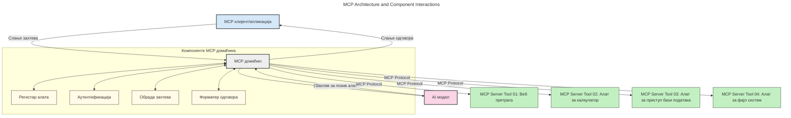
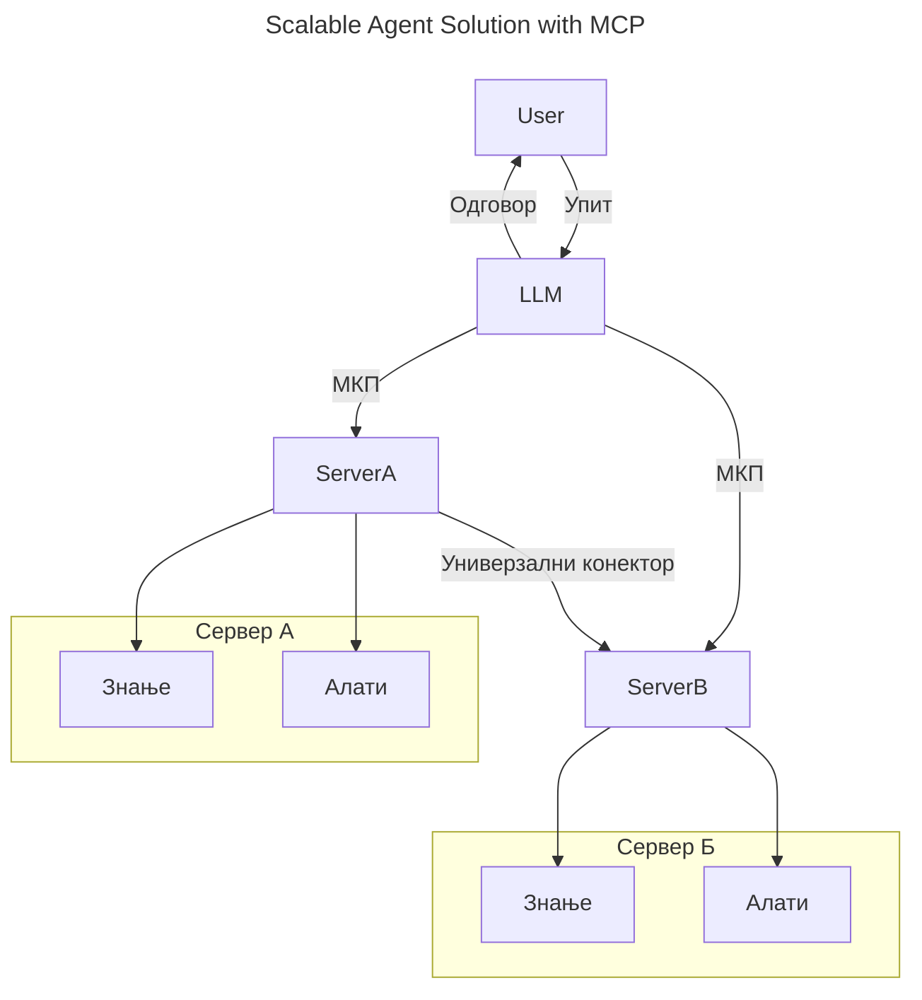
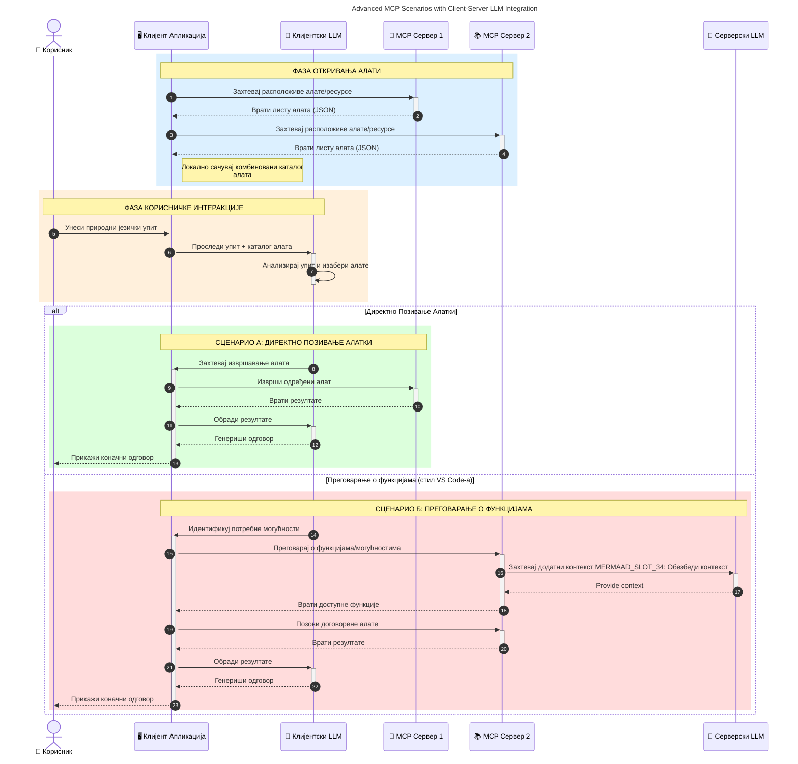

# Увод у Протокол Контекста Модела (MCP): Зашто је важан за скалабилне AI апликације

_(Кликните на слику изнад да бисте погледали видео овог часа)_

Генеративне AI апликације представљају велики напредак јер често омогућавају кориснику да интерагује са апликацијом користећи природне језичке упите. Међутим, како се у такве апликације улаже више времена и ресурса, желите да будете сигурни да можете лако интегрисати функционалности и ресурсе на начин који је лак за проширење, да ваша апликација може да подржи коришћење више модела и да се носи са различитим детаљима модела. Укратко, изградња генеративних AI апликација је на почетку лака, али како оне расту и постају сложеније, потребно је почети дефинисати архитектуру и вероватно ћете морати да се ослоните на стандард како бисте осигурали да се ваше апликације праве на доследан начин. Отуда долази MCP да уреди те ствари и обезбеди стандард.

---

## **🔍 Шта је Протокол Контекста Модела (MCP)?**

**Протокол Контекста Модела (MCP)** је **отворени, стандардизовани интерфејс** који омогућава великим језичким моделима (LLM) да беспрекорно комуницирају са спољним алатима, API-јима и изворима података. Он пружа конзистентну архитектуру за побољшање функционалности AI модела изван њихових тренираних података, омогућавајући паметније, скалабилније и одзивније AI системе.

---

## **🎯 Зашто је стандардизација у AI важна**

Како генеративне AI апликације постају сложеније, неопходно је усвојити стандарде који обезбеђују **скалабилност, проширивост, одрживост,** и **избегавање закључавања у једног продаваца**. MCP одговара на ове потребе тако што:

- Уједињује интеграције модела и алата
- Смањује крхка, појединачна прилагођена решења
- Омогућава коришћење више модела различитих произвођача унутар једног екосистема

**Напомена:** Иако MCP представља отворени стандард, нема планова да се MCP стандардизује кроз неке постојеће стандардне организације као што су IEEE, IETF, W3C, ISO или нека друга тела за стандарде.

---

## **📚 Циљеви учења**

На крају овог чланка, бићете у стању да:

- Дефинишете **Протокол Контекста Модела (MCP)** и његове случајеве употребе
- Разумете како MCP стандардизује комуникацију између модела и алата
- Идентификујете основне компоненте MCP архитектуре
- Истражите стварне примене MCP у пословном и развојном контексту

---

## **💡 Зашто је Протокол Контекста Модела (MCP) револуционалан**

### **🔗 MCP решава проблем фрагментације у AI интеракцијама**

Пре MCP-а, интеграција модела са алатима је захтевала:

- Прилагођени код за сваки пар алат-модел
- Нестандардне API-је за сваког произвођача
- Честа прекида због ажурирања
- Лошу скалабилност са повећањем броја алата

### **✅ Предности стандарда MCP**

| **Предност**              | **Опис**                                                                       |
|--------------------------|--------------------------------------------------------------------------------|
| Интероперабилност         | LLM-ови беспрекорно раде са алатима различитих произвођача                    |
| Доследност               | Једнакво понашање на свим платформама и алатима                               |
| Поновно коришћење        | Алате направљене једном се могу користити у више пројеката и система          |
| Убрзан развој            | Скраћује време развоја коришћењем стандардизованих, спремних интерфејса      |

---

## **🧱 Преглед високо-нивоу MCP архитектуре**

MCP прати **клијент-сервер модел**, где:

- **MCP Домаћини** покрећу AI моделе
- **MCP Клијенти** иницирају захтеве
- **MCP Сервери** пружају контекст, алате и капацитете

### **Кључне компоненте:**

- **Ресурси** – Статички или динамички подаци за моделе  
- **Упити** – Предефинисани токови за вођену генерацију  
- **Алатке** – Извршне функције као што су претрага, прорачуни  
- **Узораковање** – Агенцно понашање кроз рекурзивне интеракције (застарело у кандидату за издање `2026-07-28`)
- **Изазивање** – Захтеви иницирани од сервера за унос корисника
- **Руте** – Граничне линије система датотека за контролу приступа серверу (застарело у кандидату за издање `2026-07-28`)

### **Архитектура протокола:**

MCP користи двослојну архитектуру:
- **Слој података**: комуникација заснована на JSON-RPC 2.0 са управљањем животним циклусом и примитивама
- **Транспортни слој**: STDIO (локални) и струјни HTTP са SSE (даљински) комуникациони канали

---

## Како MCP сервери раде

MCP сервери раде на следећи начин:

- **Проток захтева**:
    1. Захтев иницира крајњи корисник или софтвер који делује у његово име.
    2. **MCP Клијент** шаље захтев **MCP Домаћину**, који управља извршавањем AI модела.
    3. **AI Модел** прими кориснички упит и може затражити приступ спољним алатима или подацима преко једне или више позива алата.
    4. **MCP Домаћин**, а не модел директно, комуницира са одговарајућим **MCP Серверима** користећи стандардизовани протокол.
- **Функционалност MCP Домаћина**:
    - **Регистар алата**: Одржава каталог доступних алата и њихових могућности.
    - **Аутентификација**: Потврђује дозволе за приступ алатима.
    - **Обрада захтева**: Обрађује долазне захтеве за алате из модела.
    - **Форматирање одговора**: Структурише излаз алата у формату који модел може разумети.
- **Извршење MCP сервера**:
    - **MCP Домаћин** усмерава позиве алата ка једном или више **MCP Серверa**, од којих сваки излаже специјализоване функције (нпр. претрагу, прорачуне, упите бази података).
    - **MCP Сервери** извршавају своје операције и враћају резултате **MCP Домаћину** у конзистентном формату.
    - **MCP Домаћин** форматира и преноси те резултате моделу.
- **Завршетак одговора**:
    - **AI Модел** интегрише излаз алата у коначни одговор.
    - **MCP Домаћин** шаље овај одговор назад **MCP Клијенту**, који га доставља крајњем кориснику или позивајућем софтверу.
    

## 👨‍💻 Како направити MCP сервер (са примерима)

MCP сервери вам омогућавају да проширите могућности LLM-ова пружајући податке и функционалност.

Спремни да пробате? Ево SDK-а за језике и/или стекове са примерима како креирати једноставне MCP сервере на различитим језицима/стековима:

- **Python SDK**: https://github.com/modelcontextprotocol/python-sdk

- **TypeScript SDK**: https://github.com/modelcontextprotocol/typescript-sdk

- **Java SDK**: https://github.com/modelcontextprotocol/java-sdk

- **C#/.NET SDK**: https://github.com/modelcontextprotocol/csharp-sdk

## 🌍 Стварни случајеви употребе за MCP

MCP омогућава широк спектар апликација проширујући AI могућности:

| **Апликација**              | **Опис**                                                                       |
|------------------------------|--------------------------------------------------------------------------------|
| Интеграција пословних података | Повезивање LLM-ова са базама података, CRM-овима или унутрашњим алатима       |
| Агенцки AI системи           | Омогућавају аутономне агенте са приступом алатима и токовима доношења одлука |
| Мултимодалне апликације       | Комбинују текст, слике и аудио алате у једну интегрисану AI апликацију        |
| Интеграција података у реалном времену | Уношење живих података у AI интеракције за прецизније и актуелне резултате      |

### 🧠 MCP = Универзални стандард за AI интеракције

Протокол Контекста Модела (MCP) делује као универзални стандард за AI интеракције, као што је USB-C стандардаизовао физичке везе за уређаје. У свету AI, MCP пружа конзистентан интерфејс, омогућавајући моделима (клијентима) да се беспрекорно интегришу са спољним алатима и добављачима података (серверима). Ово елиминише потребу за различитим, прилагођеним протоколима за сваки API или извор података.

Под MCP-ом, MCP-компатибилан алат (означен као MCP сервер) следи уједначени стандард. Ови сервери могу навести алате или радње које нуде и извршити те радње по захтеву AI агента. Платформе за AI агенте које подржавају MCP могу пронаћи доступне алате са сервера и позивати их кроз овај стандардни протокол.

### 💡 Олакшава приступ знању

Осим што нуди алате, MCP такође олакшава приступ знању. Он омогућава апликацијама да пруже контекст великим језичким моделима (LLM) повезујући их са различитим изворима података. На пример, MCP сервер може представљати репозиторијум докумената компаније, омогућавајући агенатима да на захтев преузму релевантне информације. Други сервер може управљати специфичним радњама као што су слање имејлова или ажурирање записа. Из перспективе агента, то су једноставно алати које може користити — неки алати враћају податке (контекст знања), док други извршавају радње. MCP ефикасно управља оба аспекта.

Агент који се повезује на MCP сервер аутоматски учи о могућностима сервера и доступним подацима кроз стандардизовани формат. Ова стандардизација омогућава динамичку доступност алата. На пример, додавање новог MCP сервера у систем агента чини његове функције одмах доступним без потребе за додатном прилагодбом агентових инструкција.

Ова поједностављена интеграција се уклапа у проток приказан на следећем дијаграму, где сервери пружају и алате и знање, обезбеђујући беспрекорну сарадњу између система.

### 👉 Пример: скалабилно агентско решење

Универзални конектор омогућава MCP серверима да комуницирају и деле капацитете међу собом, омогућавајући ServerA да делегира задатке ServerB-у или приступа његовим алатима и знању. Ово федеративно повезивање алата и података између сервера подржава скалабилне и модуларне агентске архитектуре. Због тога што MCP стандардује излагање алата, агенти могу динамички проналазити и усмеравати захтеве између сервера без унапред кодираног интегрисања.

Федерација алата и знања: алати и подаци су доступни преко сервера, омогућавајући скалабилније и модуларније агенцке архитектуре.

### 🔄 Напредни MCP сценарији са интеграцијом LLM-а на клијентској страни

Поред основне MCP архитектуре, постоје напредни сценарији у којима и клијент и сервер садрже LLM-ове, омогућавајући сложеније интеракције. На следећем дијаграму, **Клијент апликација** може бити IDE са бројним MCP алатима доступним за коришћење од стране LLM-а:

## 🔐 Практичне предности MCP-а

Ево практичних предности коришћења MCP-а:

- **Ажурност**: Модели могу приступити најсвежијим информацијама изван тренинга
- **Проширење могућности**: Модели могу користити специјализоване алате за задатке за које нису тренирани
- **Смањење халуцинација**: Спољни извори података обезбеђују чињеничну основу
- **Приватност**: Осетљиви подаци могу остати у сигурним окружењима уместо да буду уграђени у упите

## 📌 Кључне поуке

Следеће су кључне поуке за коришћење MCP-а:

- **MCP** стандардизује начин на који AI модели интерагују са алатима и подацима
- Подстиче **проширивост, доследност и интероперабилност**
- MCP помаже да се **скрати време развоја, побољша поузданост и прошире могућности модела**
- Клијент-сервер архитектура **омогућава флексибилне, прошириве AI апликације**

## 🧠 Вежба

Размислите о AI апликацији коју желите да направите.

- Који **спољни алати или подаци** би могли побољшати њене могућности?
- Како би MCP могао учинити интеграцију **једноставнијом и поузданијом?**

## Додатни ресурси

- [MCP GitHub Репозиторијум](https://github.com/modelcontextprotocol)

## Шта следи

Следеће: [Поглавље 1: Основни концепти](../01-CoreConcepts/README.md)

---

<!-- CO-OP TRANSLATOR DISCLAIMER START -->
**Изјава о одрицању одговорности**:
Овај документ је преведен коришћењем услуге за аутоматски превод [Co-op Translator](https://github.com/Azure/co-op-translator). Иако тежимо тачности, имајте у виду да аутоматски преводи могу садржати грешке или нетачности. Оригинални документ на његовом изворном језику треба сматрати ауторитативним извором. За критичне информације препоручује се професионални људски превод. Нисмо одговорни за било каква неспоразума или погрешна тумачења која произилазе из коришћења овог превода.
<!-- CO-OP TRANSLATOR DISCLAIMER END -->