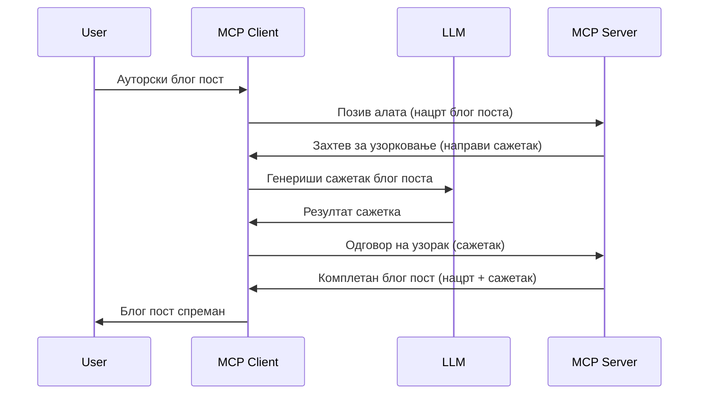

> [СА ИСТЕКЛИМ РОКОМ ВАЖНОСТИ: 2026-07-28 RELEASE CANDIDATE](https://blog.modelcontextprotocol.io/posts/2026-07-28-release-candidate/)

# Снимање узорака - делегирање функција Клијенту

> **Обавештење о застаревању:** кандидат за објављивање спецификације MCP `2026-07-28` означава Снимање узорака као застарело у корист директне интеграције са API-јима провајдера LLM-а. Снимање узорака наставља да ради у верзији `2025-11-25` и барем годину дана након формалног застаревања, тако да је све у овој лекцији још увек важеће — али нови дизајни сервера треба да процене нови образац. Погледајте [Шта се мења у MCP: кандидат за објављивање 2026-07-28](../../01-CoreConcepts/mcp-2026-07-28-release-candidate.md).

Понекад је потребно да MCP Клијент и MCP Сервер сарађују да би постигли заједнички циљ. Можда имате случај у којем Сервер захтева помоћ LLM-а који се налази на клијенту. За ову ситуацију, снимање узорака је оно што треба да користите.

Хајде да истражимо неке случајеве употребе и како изградити решење које укључује снимање узорака.

## Преглед

У овој лекцији ћемо се фокусирати на објашњење када и где користити снимање узорака и како га конфигурисати.

## Циљеви учења

У овом поглављу ћемо:

- Објаснити шта је снимање узорака и када га користити.
- Показати како подесити снимање узорака у MCP.
- Приложити примере снимања узорака у пракси.

## Шта је снимање узорака и зашто га користити?

Снимање узорака је напредна функција која функционише на следећи начин:



### Захтев за снимање узорака

Добро, сада када имамо преглед релевантног сценарија, хајде да причамо о захтеву за снимање узорака који сервер шаље клијенту. Ево како такав захтев може изгледати у JSON-RPC формату:

```json
{
  "jsonrpc": "2.0",
  "id": 1,
  "method": "sampling/createMessage",
  "params": {
    "messages": [
      {
        "role": "user",
        "content": {
          "type": "text",
          "text": "Create a blog post summary of the following blog post: <BLOG POST>"
        }
      }
    ],
    "modelPreferences": {
      "hints": [
        {
          "name": "claude-3-sonnet"
        }
      ],
      "intelligencePriority": 0.8,
      "speedPriority": 0.5
    },
    "systemPrompt": "You are a helpful assistant.",
    "maxTokens": 100
  }
}
```

Вреди издвојити неколико ствари:

- Подстицај (prompt), под content -> text, је наш подстицај који је упутство за LLM да сумира садржај блога.

- **modelPreferences**. Овај одељак је управо то, преференца, препорука о томе коју конфигурацију користити са LLM-ом. Корисник може изабрати да ли ће пратити ове препоруке или их мењати. У овом случају постоје препоруке о моделу који треба користити и о приоритету брзине и интелигенције.
- **systemPrompt**, ово је ваш уобичајени системски подстицај који даје вашем LLM-у личност и садржи упутства.
- **maxTokens**, ово је својство које каже колико се токена препоручује користити за овај задатак.

### Одговор на снимање узорака

Овај одговор је оно што MCP Клијент на крају шаље назад MCP Серверу и представља резултат позива клијента ка LLM-у, чекања одговора и затим конструкције ове поруке. Ево како то може изгледати у JSON-RPC формату:

```json
{
  "jsonrpc": "2.0",
  "id": 1,
  "result": {
    "role": "assistant",
    "content": {
      "type": "text",
      "text": "Here's your abstract <ABSTRACT>"
    },
    "model": "gpt-5",
    "stopReason": "endTurn"
  }
}
```

Обратите пажњу како је одговор резиме блога баш како смо тражили. Такође обратите пажњу да коришћени `model` није онај који смо тражили већ „gpt-5“ уместо „claude-3-sonnet“. Ово илуструје да корисник може променити мишљење о томе шта ће користити и да је ваш захтев за снимање узорака препорука.

Добро, сада када разумемо главни ток и корисну примену за "прављење блога + резиме", хајде да видимо шта треба да урадимо да би то функционисало.

### Врсте порука

Поруке узорковања нису ограничене само на текст већ можете слати и слике и аудио. Ево како JSON-RPC изгледа другачије:

**Текст**

```json
{
  "type": "text",
  "text": "The message content"
}
```

**Садржај слике**

```json
{
  "type": "image",
  "data": "base64-encoded-image-data",
  "mimeType": "image/jpeg"
}
```

**Садржај аудио записа**

```json
{
  "type": "audio",
  "data": "base64-encoded-audio-data",
  "mimeType": "audio/wav"
}
```

> НАПОМЕНА: за детаљније информације о снимању узорака, погледајте [службену документацију](https://modelcontextprotocol.io/specification/2025-11-25/client/sampling)

## Како конфигурисати снимање узорака у Клијенту

> Напомена: ако правите само сервер, овде не морате много радити.

У клијенту морате овако одредити следећу функцију:

```json
{
  "capabilities": {
    "sampling": {}
  }
}
```

Ово ће потом бити учитано када ваш одабрани клијент иницијализује везу са сервером.

## Пример снимања узорака у пракси - Креирање блога

Направимо снимање узорака сервера заједно, потребно је урадити следеће:

1. Направити алат на Серверу.
1. Тај алат треба да направи захтев за снимање узорака.
1. Алат треба да чека одговор на клијентов захтев за снимање узорака.
1. Онда треба произвести резултат алата.

Хајде да видимо код корак по корак:

### -1- Направи алат

**python**

```python
@mcp.tool()
async def create_blog(title: str, content: str, ctx: Context[ServerSession, None]) -> str:
    """Create a blog post and generate a summary"""

```

### -2- Направи захтев за снимање узорака

Прошири свој алат са следећим кодом:

**python**

```python
post = BlogPost(
        id=len(posts) + 1,
        title=title,
        content=content,
        abstract=""
    )

prompt = f"Create an abstract of the following blog post: title: {title} and draft: {content} "

result = await ctx.session.create_message(
        messages=[
            SamplingMessage(
                role="user",
                content=TextContent(type="text", text=prompt),
            )
        ],
        max_tokens=100,
)

```

### -3- Чекај одговор и врати одговор

**python**

```python
post.abstract = result.content.text

posts.append(post)

# врати комплетан производ
return json.dumps({
    "id": post.title,
    "abstract": post.abstract
})
```

### -4- Комплетан код

**python**

```python
from starlette.applications import Starlette
from starlette.routing import Mount, Host

from mcp.server.fastmcp import Context, FastMCP

from mcp.server.session import ServerSession
from mcp.types import SamplingMessage, TextContent

import json


from uuid import uuid4
from typing import List
from pydantic import BaseModel


mcp = FastMCP("Blog post generator")

# app = FastAPI()

posts = []

class BlogPost(BaseModel):
    id: int
    title: str
    content: str
    abstract: str

posts: List[BlogPost] = []

@mcp.tool()
async def create_blog(title: str, content: str, ctx: Context[ServerSession, None]) -> str:
    """Create a blog post and generate a summary"""

    post = BlogPost(
        id=len(posts) + 1,
        title=title,
        content=content,
        abstract=""
    )

    prompt = f"Create an abstract of the following blog post: title: {title} and draft: {content} "

    result = await ctx.session.create_message(
        messages=[
            SamplingMessage(
                role="user",
                content=TextContent(type="text", text=prompt),
            )
        ],
        max_tokens=100,
    )

    post.abstract = result.content.text

    posts.append(post)

    # врати цео блог пост
    return json.dumps({
        "id": post.title,
        "abstract": post.abstract
    })

if __name__ == "__main__":
    print("Starting server...")
    # mcp.run()
    mcp.run(transport="streamable-http")

# покрени апликацију командом: python server.py
```

### -5- Тестирање у Visual Studio Code

Да бисте тестирали ово у Visual Studio Code, урадите следеће:

1. Покрените сервер у терминалу
1. Додајте га у *mcp.json* (и уверите се да је покренут) нешто овако:

   ```json
   "servers": {
      "blog-server": {
        "type": "http",
        "url": "http://localhost:8000/mcp"
      }
   }
   ```

1. Откуцајте подстицај:

   ```text
   create a blog post named "Where Python comes from", the content is "Python is actually named after Monty Python Flying Circus"
   ```

1. Дозволите снимање узорака. При првом тестирању појавиће се додатни дијалог који морате прихватити, а онда ће се појавити уобичајени дијалог који тражи да покренете алат.

1. Прегледајте резултате. Видећете резултате лепо приказане у GitHub Copilot Chat, али можете и прегледати оригинални JSON одговор.

**Бонус**. Visual Studio Code алатке имају одличну подршку за снимање узорака. Можете конфигурисати приступ снимању узорака на вашем инсталираном серверу тако што ћете отићи овако:

1. Идите у одељак за проширења.
1. Изаберите икону зупчаника за ваш инсталирани сервер у секцији "MCP SERVERS - INSTALLED".
1 Изаберите "Configure Model Access", овде можете изабрати које моделе GitHub Copilot сме да користи приликом снимања узорака. Такође можете видети све недавне захтеве за снимање узорака кликом на "Show Sampling requests".

## Задатак

У овом задатку ћете изградити нешто другачије снимање узорака, конкретно интеграцију снимања узорака која подржава генерисање опис производа. Ево вашег сценарија:

**Сценарио**: Радник у позадини е-трговине има проблем, премного времена му одузима генерисање описа производа. Због тога треба да направите решење где можете позвати алат "create_product" са аргументима "title" и "keywords" који треба да произведе комплетан производ укључујући поље "description" које треба да попуни LLM клијента.

САВЕТ: користите оно што сте раније научили да конструишете овај сервер и његов алат користећи захтев за снимање узорака.

## Решење

[Решење](./solution/README.md)

## Главне поуке

Снимање узорака је моћна функција која омогућава серверу да делегира задатке клијенту када му треба помоћ LLM-а.

## Следећи кораци

- [Поглавље 4 - Практична имплементација](../../04-PracticalImplementation/README.md)

---

<!-- CO-OP TRANSLATOR DISCLAIMER START -->
**Изјава о одрицању одговорности**:
Овај документ је преведен коришћењем услуге за аутоматски превод [Co-op Translator](https://github.com/Azure/co-op-translator). Иако тежимо тачности, имајте у виду да аутоматски преводи могу садржати грешке или нетачности. Оригинални документ на његовом изворном језику треба сматрати ауторитативним извором. За критичне информације препоручује се професионални људски превод. Нисмо одговорни за било каква неспоразума или погрешна тумачења која произилазе из коришћења овог превода.
<!-- CO-OP TRANSLATOR DISCLAIMER END -->