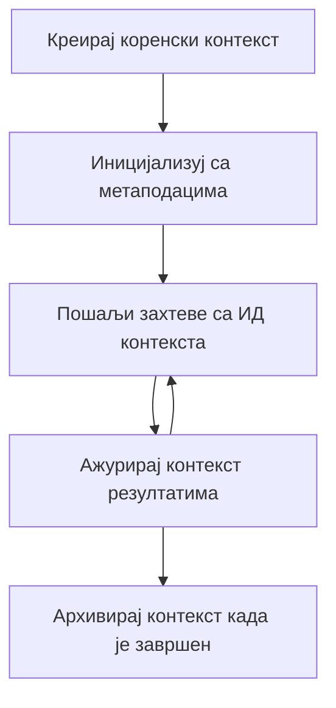

> [ЗАСТАРЕЛО: КАНДИДАТ ЗА ИЗДАЊЕ 2026-07-28](https://blog.modelcontextprotocol.io/posts/2026-07-28-release-candidate/#roots-sampling-and-logging-are-deprecated)

# MCP Основни Контексти

> **Обавештење о застаревању:** кандидат за издање MCP спецификације `2026-07-28` означава Основне Контексте као застареле у корист параметара алата, URI ресурса или конфигурације сервера. Основни Контексти настављају да раде у `2025-11-25` и најмање годину дана након формалног застаревања, тако да све у овој лекцији остаје валидно - али нови дизајни сервера треба да процене образац замене. Погледајте [Шта се мења у MCP: Кандидат за издање 2026-07-28](../../01-CoreConcepts/mcp-2026-07-28-release-candidate.md).

Основни контексти су фундаментални појам у Model Context Protocol који обезбеђује постојан слој за одржавање историје разговора и заједничког стања кроз више захтева и сесија.

## Увод

У овој лекцији ћемо истражити како да креирамо, управљамо и користимо основне контексте у MCP.

## Циљеви учења

На крају ове лекције моћи ћете да:

- Разумете сврху и структуру основних контекста
- Креирате и управљате основним контекстима користећи MCP клиентске библиотеке
- Имплементирате основне контексте у .NET, Java, JavaScript и Python апликацијама
- Користите основне контексте за вишекратне разговоре и управљање стањем
- Примените најбоље праксе за управљање основним контекстима

## Разумевање Основних Контекста

Основни контексти служе као контејнери који чувају историју и стање серије повезаних интеракција. Они омогућавају:

- **Постојаност разговора**: Одржавање кохерентних вишекратних разговора
- **Управљање меморијом**: Складиштење и преузимање информација кроз интеракције
- **Управљање стањем**: Праћење напретка у сложеним токовима рада
- **Деловање контекста**: Дозвољавање више клијената да приступе истом стању разговора

У MCP, основни контексти имају следеће кључне карактеристике:

- Сваки основни контекст има јединствени идентификатор.
- Могу да садрже историју разговора, корисничке преференције и другу метаподатке.
- Могу се креирати, приступати и архивирати по потреби.
- Подржавају прецизну контролу приступа и дозволе.

## Животни циклус основног контекста



## Рад са основним контекстима

Ево примера како се креирају и управљају основним контекстима.

### Имплементација у C#

```csharp
// .NET Example: Root Context Management
using Microsoft.Mcp.Client;
using System;
using System.Threading.Tasks;
using System.Collections.Generic;

public class RootContextExample
{
    private readonly IMcpClient _client;
    private readonly IRootContextManager _contextManager;
    
    public RootContextExample(IMcpClient client, IRootContextManager contextManager)
    {
        _client = client;
        _contextManager = contextManager;
    }
    
    public async Task DemonstrateRootContextAsync()
    {
        // 1. Create a new root context
        var contextResult = await _contextManager.CreateRootContextAsync(new RootContextCreateOptions
        {
            Name = "Customer Support Session",
            Metadata = new Dictionary<string, string>
            {
                ["CustomerName"] = "Acme Corporation",
                ["PriorityLevel"] = "High",
                ["Domain"] = "Cloud Services"
            }
        });
        
        string contextId = contextResult.ContextId;
        Console.WriteLine($"Created root context with ID: {contextId}");
        
        // 2. First interaction using the context
        var response1 = await _client.SendPromptAsync(
            "I'm having issues scaling my web service deployment in the cloud.", 
            new SendPromptOptions { RootContextId = contextId }
        );
        
        Console.WriteLine($"First response: {response1.GeneratedText}");
        
        // Second interaction - the model will have access to the previous conversation
        var response2 = await _client.SendPromptAsync(
            "Yes, we're using containerized deployments with Kubernetes.", 
            new SendPromptOptions { RootContextId = contextId }
        );
        
        Console.WriteLine($"Second response: {response2.GeneratedText}");
        
        // 3. Add metadata to the context based on conversation
        await _contextManager.UpdateContextMetadataAsync(contextId, new Dictionary<string, string>
        {
            ["TechnicalEnvironment"] = "Kubernetes",
            ["IssueType"] = "Scaling"
        });
        
        // 4. Get context information
        var contextInfo = await _contextManager.GetRootContextInfoAsync(contextId);
        
        Console.WriteLine("Context Information:");
        Console.WriteLine($"- Name: {contextInfo.Name}");
        Console.WriteLine($"- Created: {contextInfo.CreatedAt}");
        Console.WriteLine($"- Messages: {contextInfo.MessageCount}");
        
        // 5. When the conversation is complete, archive the context
        await _contextManager.ArchiveRootContextAsync(contextId);
        Console.WriteLine($"Archived context {contextId}");
    }
}
```

У претходном коду смо:

1. Креирали основни контекст за сесију корисничке подршке.
1. Послали више порука у оквиру тог контекста, дозвољавајући моделу да одржи стање.
1. Ажурирали контекст релевантним метаподацима на основу разговора.
1. Преузели информације из контекста да бисмо разумели историју разговора.
1. Архивирали контекст када је разговор завршен.

## Пример: Имплементација Основног Контекста за финансијску анализу

У овом примеру ћемо креирати основни контекст за сесију финансијске анализе, показујући како одржавати стање кроз више интеракција.

### Имплементација у Java

```java
// Пример у Јави: Имплементација коренског контекста
package com.example.mcp.contexts;

import com.mcp.client.McpClient;
import com.mcp.client.ContextManager;
import com.mcp.models.RootContext;
import com.mcp.models.McpResponse;

import java.util.HashMap;
import java.util.Map;
import java.util.UUID;

public class RootContextsDemo {
    private final McpClient client;
    private final ContextManager contextManager;
    
    public RootContextsDemo(String serverUrl) {
        this.client = new McpClient.Builder()
            .setServerUrl(serverUrl)
            .build();
            
        this.contextManager = new ContextManager(client);
    }
    
    public void demonstrateRootContext() throws Exception {
        // Креирајте метаподатке контекста
        Map<String, String> metadata = new HashMap<>();
        metadata.put("projectName", "Financial Analysis");
        metadata.put("userRole", "Financial Analyst");
        metadata.put("dataSource", "Q1 2025 Financial Reports");
        
        // 1. Креирајте нови коренски контекст
        RootContext context = contextManager.createRootContext("Financial Analysis Session", metadata);
        String contextId = context.getId();
        
        System.out.println("Created context: " + contextId);
        
        // 2. Прва интеракција
        McpResponse response1 = client.sendPrompt(
            "Analyze the trends in Q1 financial data for our technology division",
            contextId
        );
        
        System.out.println("First response: " + response1.getGeneratedText());
        
        // 3. Ажурирајте контекст важним информацијама добијеним из одговора
        contextManager.addContextMetadata(contextId, 
            Map.of("identifiedTrend", "Increasing cloud infrastructure costs"));
        
        // Друга интеракција - коришћење истог контекста
        McpResponse response2 = client.sendPrompt(
            "What's driving the increase in cloud infrastructure costs?",
            contextId
        );
        
        System.out.println("Second response: " + response2.getGeneratedText());
        
        // 4. Генеришите резиме сесије анализе
        McpResponse summaryResponse = client.sendPrompt(
            "Summarize our analysis of the technology division financials in 3-5 key points",
            contextId
        );
        
        // Сачувајте резиме у метаподатке контекста
        contextManager.addContextMetadata(contextId, 
            Map.of("analysisSummary", summaryResponse.getGeneratedText()));
            
        // Преузмите ажуриране информације о контексту
        RootContext updatedContext = contextManager.getRootContext(contextId);
        
        System.out.println("Context Information:");
        System.out.println("- Created: " + updatedContext.getCreatedAt());
        System.out.println("- Last Updated: " + updatedContext.getLastUpdatedAt());
        System.out.println("- Analysis Summary: " + 
            updatedContext.getMetadata().get("analysisSummary"));
            
        // 5. Архивирајте контекст када завршите
        contextManager.archiveContext(contextId);
        System.out.println("Context archived");
    }
}
```

У претходном коду смо:

1. Креирали основни контекст за сесију финансијске анализе.
2. Послали више порука у оквиру тог контекста, дозвољавајући моделу да одржи стање.
3. Ажурирали контекст релевантним метаподацима на основу разговора.
4. Генерисали резиме сесије анализе и сачували га у метаподацима контекста.
5. Архивирали контекст када је разговор завршен.

## Пример: Управљање Основним Контекстом

Ефикасно управљање основним контекстима је кључно за одржавање историје разговора и стања. Испод је пример како имплементирати управљање основним контекстом.

### Имплементација у JavaScript

```javascript
// Пример у ЈаваСкрипту: Управљање MCP Роот Контекстима
const { McpClient, RootContextManager } = require('@mcp/client');

class ContextSession {
  constructor(serverUrl, apiKey = null) {
    // Иницијализуј MCP клијента
    this.client = new McpClient({
      serverUrl,
      apiKey
    });
    
    // Иницијализуј менаџер контекста
    this.contextManager = new RootContextManager(this.client);
  }
  
  /**
   * Create a new conversation context
   * @param {string} sessionName - Name of the conversation session
   * @param {Object} metadata - Additional metadata for the context
   * @returns {Promise<string>} - Context ID
   */
  async createConversationContext(sessionName, metadata = {}) {
    try {
      const contextResult = await this.contextManager.createRootContext({
        name: sessionName,
        metadata: {
          ...metadata,
          createdAt: new Date().toISOString(),
          status: 'active'
        }
      });
      
      console.log(`Created root context '${sessionName}' with ID: ${contextResult.id}`);
      return contextResult.id;
    } catch (error) {
      console.error('Error creating root context:', error);
      throw error;
    }
  }
  
  /**
   * Send a message in an existing context
   * @param {string} contextId - The root context ID
   * @param {string} message - The user's message
   * @param {Object} options - Additional options
   * @returns {Promise<Object>} - Response data
   */
  async sendMessage(contextId, message, options = {}) {
    try {
      // Пошаљи поруку користећи одређени контекст
      const response = await this.client.sendPrompt(message, {
        rootContextId: contextId,
        temperature: options.temperature || 0.7,
        allowedTools: options.allowedTools || []
      });
      
      // Опционо сачувај важне увиде из разговора
      if (options.storeInsights) {
        await this.storeConversationInsights(contextId, message, response.generatedText);
      }
      
      return {
        message: response.generatedText,
        toolCalls: response.toolCalls || [],
        contextId
      };
    } catch (error) {
      console.error(`Error sending message in context ${contextId}:`, error);
      throw error;
    }
  }
  
  /**
   * Store important insights from a conversation
   * @param {string} contextId - The root context ID
   * @param {string} userMessage - User's message
   * @param {string} aiResponse - AI's response
   */
  async storeConversationInsights(contextId, userMessage, aiResponse) {
    try {
      // Извуци потенцијалне увиде (у правом апликацији ово би било софистицираније)
      const combinedText = userMessage + "\n" + aiResponse;
      
      // Једноставна хеуристика за идентификовање потенцијалних увида
      const insightWords = ["important", "key point", "remember", "significant", "crucial"];
      
      const potentialInsights = combinedText
        .split(".")
        .filter(sentence => 
          insightWords.some(word => sentence.toLowerCase().includes(word))
        )
        .map(sentence => sentence.trim())
        .filter(sentence => sentence.length > 10);
      
      // Сачувај увиде у метаподатке контекста
      if (potentialInsights.length > 0) {
        const insights = {};
        potentialInsights.forEach((insight, index) => {
          insights[`insight_${Date.now()}_${index}`] = insight;
        });
        
        await this.contextManager.updateContextMetadata(contextId, insights);
        console.log(`Stored ${potentialInsights.length} insights in context ${contextId}`);
      }
    } catch (error) {
      console.warn('Error storing conversation insights:', error);
      // Некритична грешка, само евидентирај упозорење
    }
  }
  
  /**
   * Get summary information about a context
   * @param {string} contextId - The root context ID
   * @returns {Promise<Object>} - Context information
   */
  async getContextInfo(contextId) {
    try {
      const contextInfo = await this.contextManager.getContextInfo(contextId);
      
      return {
        id: contextInfo.id,
        name: contextInfo.name,
        created: new Date(contextInfo.createdAt).toLocaleString(),
        lastUpdated: new Date(contextInfo.lastUpdatedAt).toLocaleString(),
        messageCount: contextInfo.messageCount,
        metadata: contextInfo.metadata,
        status: contextInfo.status
      };
    } catch (error) {
      console.error(`Error getting context info for ${contextId}:`, error);
      throw error;
    }
  }
  
  /**
   * Generate a summary of the conversation in a context
   * @param {string} contextId - The root context ID
   * @returns {Promise<string>} - Generated summary
   */
  async generateContextSummary(contextId) {
    try {
      // Замоли модел да генерише резиме досадашњег разговора
      const response = await this.client.sendPrompt(
        "Please summarize our conversation so far in 3-4 sentences, highlighting the main points discussed.",
        { rootContextId: contextId, temperature: 0.3 }
      );
      
      // Сачувај резиме у метаподатке контекста
      await this.contextManager.updateContextMetadata(contextId, {
        conversationSummary: response.generatedText,
        summarizedAt: new Date().toISOString()
      });
      
      return response.generatedText;
    } catch (error) {
      console.error(`Error generating context summary for ${contextId}:`, error);
      throw error;
    }
  }
  
  /**
   * Archive a context when it's no longer needed
   * @param {string} contextId - The root context ID
   * @returns {Promise<Object>} - Result of the archive operation
   */
  async archiveContext(contextId) {
    try {
      // Генериши коначни резиме пре архивирања
      const summary = await this.generateContextSummary(contextId);
      
      // Архивирај контекст
      await this.contextManager.archiveContext(contextId);
      
      return {
        status: "archived",
        contextId,
        summary
      };
    } catch (error) {
      console.error(`Error archiving context ${contextId}:`, error);
      throw error;
    }
  }
}

// Пример коришћења
async function demonstrateContextSession() {
  const session = new ContextSession('https://mcp-server-example.com');
  
  try {
    // 1. Направи нови контекст за разговор о подршци производу
    const contextId = await session.createConversationContext(
      'Product Support - Database Performance',
      {
        customer: 'Globex Corporation',
        product: 'Enterprise Database',
        severity: 'Medium',
        supportAgent: 'AI Assistant'
      }
    );
    
    // 2. Прва порука у разговору
    const response1 = await session.sendMessage(
      contextId,
      "I'm experiencing slow query performance on our database cluster after the latest update.",
      { storeInsights: true }
    );
    console.log('Response 1:', response1.message);
    
    // Праћење поруке у истом контексту
    const response2 = await session.sendMessage(
      contextId,
      "Yes, we've already checked the indexes and they seem to be properly configured.",
      { storeInsights: true }
    );
    console.log('Response 2:', response2.message);
    
    // 3. Добиј информације о контексту
    const contextInfo = await session.getContextInfo(contextId);
    console.log('Context Information:', contextInfo);
    
    // 4. Генериши и прикажи резиме разговора
    const summary = await session.generateContextSummary(contextId);
    console.log('Conversation Summary:', summary);
    
    // 5. Архивирај контекст када завршиш
    const archiveResult = await session.archiveContext(contextId);
    console.log('Archive Result:', archiveResult);
    
    // 6. Накнадно обради грешке на смирен начин
  } catch (error) {
    console.error('Error in context session demonstration:', error);
  }
}

demonstrateContextSession();
```

У претходном коду смо:

1. Креирали основни контекст за разговор о техничкој подршци производа функцијом `createConversationContext`. У овом случају, контекст се односи на проблеме са перформансама базе података.

1. Послали више порука у оквиру тог контекста, дозвољавајући моделу да одржи стање функцијом `sendMessage`. Поруке које се шаљу су о спором извршавању упита и конфигурацији индекса.

1. Ажурирали контекст релевантним метаподацима на основу разговора.

1. Генерисали резиме разговора и сачували га у метаподацима контекста функцијом `generateContextSummary`.

1. Архивирали контекст када је разговор завршен функцијом `archiveContext`.

1. Успешно руковали грешкама како би обезбедили робусност.

## Основни Контекст за Вишекратну Помоћ

У овом примеру ћемо креирати основни контекст за сесију вишекратне помоћи, показујући како одржавати стање кроз више интеракција.

### Имплементација у Python

```python
# Python пример: Рут контекст за мулти-тура помоћ
import asyncio
from datetime import datetime
from mcp_client import McpClient, RootContextManager

class AssistantSession:
    def __init__(self, server_url, api_key=None):
        self.client = McpClient(server_url=server_url, api_key=api_key)
        self.context_manager = RootContextManager(self.client)
    
    async def create_session(self, name, user_info=None):
        """Create a new root context for an assistant session"""
        metadata = {
            "session_type": "assistant",
            "created_at": datetime.now().isoformat(),
        }
        
        # Додај информације о кориснику ако су наведене
        if user_info:
            metadata.update({f"user_{k}": v for k, v in user_info.items()})
            
        # Направи рут контекст
        context = await self.context_manager.create_root_context(name, metadata)
        return context.id
    
    async def send_message(self, context_id, message, tools=None):
        """Send a message within a root context"""
        # Креирај опције са ID контекста
        options = {
            "root_context_id": context_id
        }
        
        # Додај алате ако су спецификовани
        if tools:
            options["allowed_tools"] = tools
        
        # Пошаљи упит у оквиру контекста
        response = await self.client.send_prompt(message, options)
        
        # Ажурирај метаподатке контекста са напретком разговора
        await self.context_manager.update_context_metadata(
            context_id,
            {
                f"message_{datetime.now().timestamp()}": message[:50] + "...",
                "last_interaction": datetime.now().isoformat()
            }
        )
        
        return response
    
    async def get_conversation_history(self, context_id):
        """Retrieve conversation history from a context"""
        context_info = await self.context_manager.get_context_info(context_id)
        messages = await self.client.get_context_messages(context_id)
        
        return {
            "context_info": context_info,
            "messages": messages
        }
    
    async def end_session(self, context_id):
        """End an assistant session by archiving the context"""
        # Прvo генериши подстицај за резиме
        summary_response = await self.client.send_prompt(
            "Please summarize our conversation and any key points or decisions made.",
            {"root_context_id": context_id}
        )
        
        # Сачувај резиме у метаподацима
        await self.context_manager.update_context_metadata(
            context_id,
            {
                "summary": summary_response.generated_text,
                "ended_at": datetime.now().isoformat(),
                "status": "completed"
            }
        )
        
        # Архивирај контекст
        await self.context_manager.archive_context(context_id)
        
        return {
            "status": "completed",
            "summary": summary_response.generated_text
        }

# Пример коришћења
async def demo_assistant_session():
    assistant = AssistantSession("https://mcp-server-example.com")
    
    # 1. Направи сесију
    context_id = await assistant.create_session(
        "Technical Support Session",
        {"name": "Alex", "technical_level": "advanced", "product": "Cloud Services"}
    )
    print(f"Created session with context ID: {context_id}")
    
    # 2. Прва интеракција
    response1 = await assistant.send_message(
        context_id, 
        "I'm having trouble with the auto-scaling feature in your cloud platform.",
        ["documentation_search", "diagnostic_tool"]
    )
    print(f"Response 1: {response1.generated_text}")
    
    # Друга интеракција у истом контексту
    response2 = await assistant.send_message(
        context_id,
        "Yes, I've already checked the configuration settings you mentioned, but it's still not working."
    )
    print(f"Response 2: {response2.generated_text}")
    
    # 3. Узми историју
    history = await assistant.get_conversation_history(context_id)
    print(f"Session has {len(history['messages'])} messages")
    
    # 4. Заврши сесију
    end_result = await assistant.end_session(context_id)
    print(f"Session ended with summary: {end_result['summary']}")

if __name__ == "__main__":
    asyncio.run(demo_assistant_session())
```

У претходном коду смо:

1. Креирали основни контекст за сесију техничке подршке функцијом `create_session`. Контекст укључује информације о кориснику као што су име и технички ниво.

1. Послали више порука у оквиру тог контекста, дозвољавајући моделу да одржи стање функцијом `send_message`. Поруке су о проблемима са функцијом аутоматског скалирања.

1. Преузели историју разговора користећи функцију `get_conversation_history`, која пружа информације о контексту и поруке.

1. Завршили сесију архивирањем контекста и генерисањем резимеа функцијом `end_session`. Резиме садржи кључне тачке из разговора.

## Најбоље праксе за Основни Контекст

Ево неких најбољих пракси за ефикасно управљање основним контекстима:

- **Креирање Фокусираних Контекста**: Креирајте одвојене основне контексте за различите сврхе разговора или домене ради јасноће.

- **Постављање политика истека**: Обезбедите политике за архивирање или брисање старих контекста ради управљања складиштењем и усклађености са политикама задржавања података.

- **Складиштење релевантних метаподатака**: Користите метаподатке контекста за чување важних информација о разговору које могу бити корисне касније.

- **Конзистентна употреба ID-ја контекста**: Када је контекст креиран, користите његов ID доследно за све повезане захтеве ради одржавања континуитета.

- **Генерисање резимеа**: Када контекст постане велики, размотрите генерисање резимеа да бисте сажели суштинске информације и управљали величином контекста.

- **Имплементација контроле приступа**: За вишекорисничке системе имплементирајте адекватне контроле приступа како бисте осигурали приватност и безбедност контекста разговора.

- **Руковање ограничењима контекста**: Будите свесни ограничења величине контекста и примените стратегије за руковалање веома дугим разговораима.

- **Архивирање по завршетку**: Архивирајте контексте када су разговори завршени да бисте ослободили ресурсе уз очување историје разговора.

## Шта следи

- [5.5 Рутинг](../mcp-routing/README.md)

---

<!-- CO-OP TRANSLATOR DISCLAIMER START -->
**Изјава о одрицању одговорности**:
Овај документ је преведен коришћењем услуге за аутоматски превод [Co-op Translator](https://github.com/Azure/co-op-translator). Иако тежимо тачности, имајте у виду да аутоматски преводи могу садржати грешке или нетачности. Оригинални документ на његовом изворном језику треба сматрати ауторитативним извором. За критичне информације препоручује се професионални људски превод. Нисмо одговорни за било каква неспоразума или погрешна тумачења која произилазе из коришћења овог превода.
<!-- CO-OP TRANSLATOR DISCLAIMER END -->