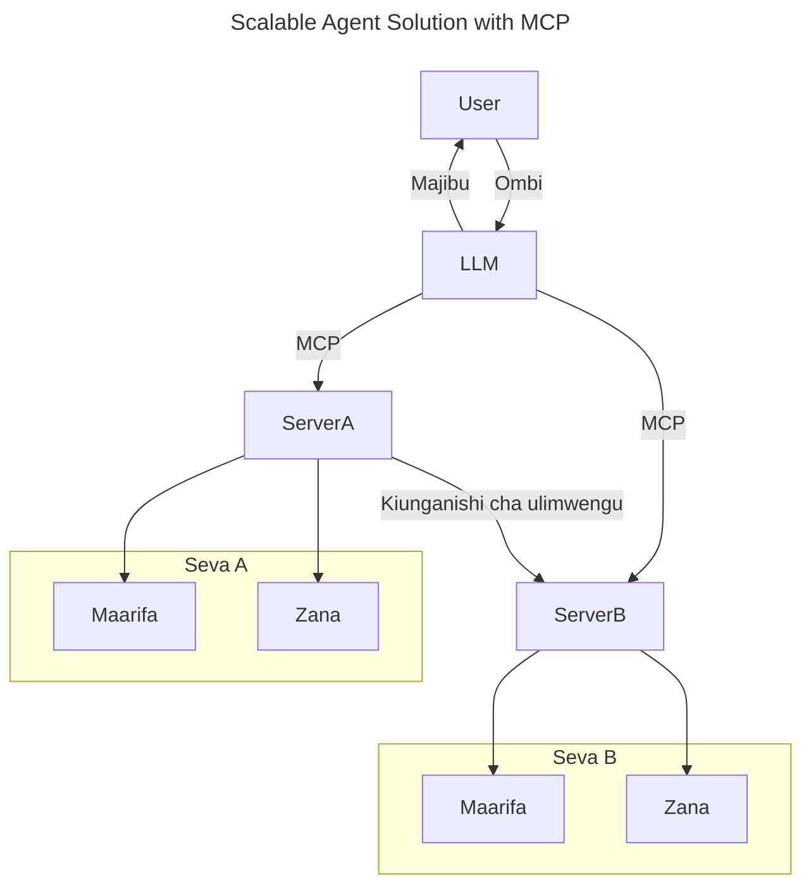
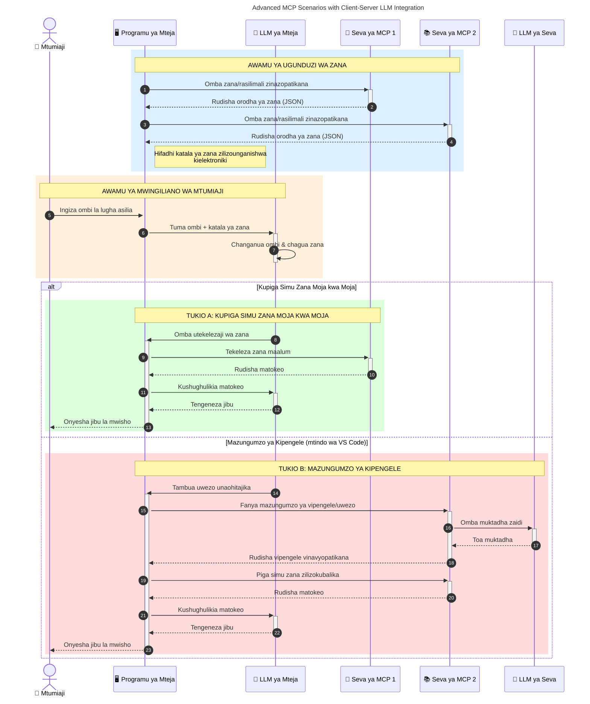

# Utangulizi wa Itifaki ya Muktadha wa Mfano (MCP): Kwa Nini Inafaa kwa Programu za AI Zinazoweza Kupanuka

[](https://youtu.be/agBbdiOPLQA)

_(Bofya picha hapo juu kuangalia video ya somo hili)_

Programu za AI zinazozalisha ni hatua nzuri mbele kwani mara nyingi hutoa uwezo kwa mtumiaji kuingiliana na programu kupitia maelekezo ya lugha ya asili. Hata hivyo, kadiri muda na rasilimali zinavyowekezwa katika programu kama hizi, unataka kuhakikisha unaweza kuunganisha kazi na rasilimali kwa urahisi kwa njia ambayo ni rahisi kupanua, kwamba programu yako inaweza kushughulikia zaidi ya mfano mmoja unaotumika, na kushughulikia changamoto mbalimbali za mfano. Kwa kifupi, kujenga programu za Gen AI ni rahisi kuanzia, lakini zinapokua na kuwa ngumu zaidi, unahitaji kuanza kufafanua usanifu na kuna uwezekano utahitaji kutegemea kiwango cha kawaida ili kuhakikisha programu zako zinajengwa kwa njia thabiti. Hapa ndipo MCP inaingia kupanga mambo na kutoa kiwango cha kawaida.

---

## **🔍 Itifaki ya Muktadha wa Mfano (MCP) ni Nini?**

**Itifaki ya Muktadha wa Mfano (MCP)** ni **kiolesura kilichofunguliwa na kimewekwa kiwango cha kawaida** kinachowezesha Modeli Kubwa za Lugha (LLMs) kuingiliana kwa urahisi na zana za nje, API, na vyanzo vya data. Inatoa usanifu thabiti wa kuboresha utendaji wa mifano ya AI zaidi ya data zao za mafunzo, kuruhusu mifumo ya AI kuwa na akili zaidi, inayoweza kupanuka, na inayojibu kwa ufanisi zaidi.

---

## **🎯 Kwa Nini Kuwepo kwa Kiwango cha Kawaida katika AI Ni Muhimu**

Kadiri programu za AI zinazozalisha zinavyoongezeka kuwa ngumu zaidi, ni muhimu kupitisha viwango vinavyohakikisha **uwezeshaji wa upanuzi, upanuzi, utunzaji,** na **kuepuka utegemezi wa muuzaji mmoja.** MCP inashughulikia mahitaji haya kwa:

- Kuunganisha kwa pamoja ushirikiano wa mfano na zana
- Kupunguza suluhisho dhaifu, za kipekee
- Kuwezesha mifano mingi kutoka kwa wauzaji tofauti kuishi katika mfumo mmoja

**Kumbuka:** Ingawa MCP inajitangaza kama kiwango cha wazi, hakuna mipango ya kuiingiza MCP kupitia taasisi zozote za viwango zilizopo kama IEEE, IETF, W3C, ISO, au taasisi nyingine za viwango.

---

## **📚 Malengo ya Kujifunza**

Mwishoni mwa makala hii, utaweza:

- Eleza **Itifaki ya Muktadha wa Mfano (MCP)** na matumizi yake
- Elewa jinsi MCP inavyosanidi mawasiliano ya mfano-na-zana
- Tambua vipengele vikuu vya usanifu wa MCP
- Chunguza matumizi halisi ya MCP katika mazingira ya mashirika na maendeleo

---

## **💡 Kwa Nini Itifaki ya Muktadha wa Mfano (MCP) Ni Mabadiliko Makubwa**

### **🔗 MCP Inatatua Mgawanyiko katika Mwingiliano wa AI**

Kabla ya MCP, kuunganisha mifano na zana ilihitaji:

- Msimbo maalum kwa kila jozi ya mfano-zana
- API zisizo za kawaida kwa kila muuzaji
- Kuvunjika mara kwa mara kutokana na masasisho
- Ugumu wa kupanuka kwa zana zaidi

### **✅ Manufaa ya Kiwango cha Kawaida cha MCP**

| **Manufaa**              | **Maelezo**                                                                |
|--------------------------|--------------------------------------------------------------------------------|
| Ushirikiano             | Modeli za LLM hufanya kazi kwa urahisi na zana kutoka kwa wauzaji tofauti                       |
| Ulinganifu              | Tabia moja kwa moja katika majukwaa na zana                                    |
| Utumiaji Upya           | Zana zilizojengwa mara moja zinaweza kutumika katika miradi na mifumo mbalimbali                       |
| Kuendeleza Haraka       | Punguza muda wa maendeleo kwa kutumia violesura vya kawaida, vya plug-and-play                |

---

## **🧱 Muhtasari wa Usanifu wa MCP wa Ngazi ya Juu**

MCP inafuata **mfano wa mteja-mtumiaji**, ambapo:

- **MCP Hosts** huendesha mifano ya AI
- **MCP Clients** huanzisha ombi
- **MCP Servers** hutumikia muktadha, zana, na uwezo

### **Vipengele Vikuu:**

- **Rasilimali** – Data zisizobadilika au zinazobadilika kwa mifano  
- **Maelekezo** – Matayarisho ya taratibu za uzalishaji  
- **Zana** – Kazi zinazotekelezwa kama utafutaji, hesabu  
- **Kuchuja Sampuli** – Tabia ya mawakala kupitia mwingiliano wa kurudiwa (imeachwa rasmi katika toleo la mvulana la `2026-07-28`)
- **Kutoa Maoni** – Maombi yanayotokana na seva kwa usaidizi wa mtumiaji
- **Mizizi** – Mipaka ya mfumo wa faili kwa udhibiti wa ufikiaji wa seva (imeachwa rasmi katika toleo la mvulana la `2026-07-28`)

### **Usanifu wa Itifaki:**

MCP hutumia usanifu wa tabaka mbili:
- **Tabaka la Data**: Mawasiliano ya JSON-RPC 2.0 yenye usimamizi wa mzunguko wa maisha na misingi
- **Tabaka la Usafirishaji**: STDIO (ndayo) na HTTP inayoweza kutiririka na SSE (mbalimbali) kama njia za mawasiliano

---

## Jinsi Seva za MCP Zinavyofanya Kazi

Seva za MCP hufanya kazi kwa njia ifuatayo:

- **Mtiririko wa Maombi**:
    1. Ombi huanzishwa na mtumiaji wa mwisho au programu inayowakilisha.
    2. **MCP Client** hutuma ombi kwa **MCP Host**, ambaye anasimamia mtandao wa Mfano wa AI.
    3. **Mfano wa AI** hupokea maelekezo kutoka kwa mtumiaji na huenda ukaomba ufikiaji wa zana za nje au data kupitia simu za zana moja au zaidi.
    4. **MCP Host**, si mfano moja kwa moja, huwasiliana na **Seva za MCP** zinazohitajika kwa kutumia itifaki ya kawaida.
- **Ustadi wa MCP Host**:
    - **Sajili ya Zana**: Inahifadhi orodha ya zana zinazopatikana na uwezo wao.
    - **Uthibitishaji**: Huhakikisha ruhusa za kupata zana.
    - **Mshughulikaji wa Maombi**: Hushughulikia maombi yanayoingia kutoka kwa mfano.
    - **Mtengenezaji wa Majibu**: Huunda matokeo ya zana kwa muundo unaoeleweka na mfano.
- **Utekelezaji wa Seva za MCP**:
    - **MCP Host** huwaelekeza simu za zana kwa seva moja au zaidi za MCP, kila moja ikitoa kazi maalum (mfano, utafutaji, hesabu, maswali ya hifadhidata).
    - **Seva za MCP** hufanya shughuli zao na kurudisha matokeo kwa **MCP Host** kwa muundo thabiti.
    - **MCP Host** huunda na kupitisha matokeo haya kwa **Mfano wa AI**.
- **Kumaliza Majibu**:
    - **Mfano wa AI** huingiza matokeo ya zana katika jibu la mwisho.
    - **MCP Host** hutuma jibu hili tena kwa **MCP Client**, ambaye huwasilisha kwa mtumiaji wa mwisho au programu inayoitisha.
    

```mermaid
---
title: MCP Architecture and Component Interactions
description: A diagram showing the flows of the components in MCP.
---
graph TD
    Client[Mteja/Mfunguo wa MCP] -->|Tuma Ombi| H[Mwenyezi wa MCP]
    H -->|Inaitisha| A[Mfano wa AI]
    A -->|Ombi la Kuitikia Zana| H
    H -->|MCP Protocol| T1[MCP Server Tool 01: Utafutaji wa Wavuti
    H -->|MCP Protocol| T2[MCP Server Tool 02: Zana ya Kihesabu
    H -->|MCP Protocol| T3[MCP Server Tool 03: Zana ya Kufikia Hifadhidata
    H -->|MCP Protocol| T4[MCP Server Tool 04: Zana ya Mfumo wa Faili
    H -->|Tuma Jibu| Client

    subgraph "Vijumlisho vya Mwenyezi wa MCP"
        H
        G[Usajili wa Zana]
        I[Uthibitishaji]
        J[Mshughulikiaji wa Ombi]
        K[Msimamizi wa Muundo wa Jibu]
    end

    H <--> G
    H <--> I
    H <--> J
    H <--> K

    style A fill:#f9d5e5,stroke:#333,stroke-width:2px
    style H fill:#eeeeee,stroke:#333,stroke-width:2px
    style Client fill:#d5e8f9,stroke:#333,stroke-width:2px
    style G fill:#fffbe6,stroke:#333,stroke-width:1px
    style I fill:#fffbe6,stroke:#333,stroke-width:1px
    style J fill:#fffbe6,stroke:#333,stroke-width:1px
    style K fill:#fffbe6,stroke:#333,stroke-width:1px
    style T1 fill:#c2f0c2,stroke:#333,stroke-width:1px
    style T2 fill:#c2f0c2,stroke:#333,stroke-width:1px
    style T3 fill:#c2f0c2,stroke:#333,stroke-width:1px
    style T4 fill:#c2f0c2,stroke:#333,stroke-width:1px
```

## 👨‍💻 Jinsi ya Kujenga Seva ya MCP (Kwa Mifano)

Seva za MCP zinakuwezesha kuongeza uwezo wa LLM kwa kutoa data na huduma. 

Tayari kujaribu? Hapa kuna SDK maalum za lugha na/au miradi pamoja na mifano ya kuunda seva rahisi za MCP katika lugha/miradi tofauti:

- **SDK ya Python**: https://github.com/modelcontextprotocol/python-sdk

- **SDK ya TypeScript**: https://github.com/modelcontextprotocol/typescript-sdk

- **SDK ya Java**: https://github.com/modelcontextprotocol/java-sdk

- **SDK ya C#/.NET**: https://github.com/modelcontextprotocol/csharp-sdk


## 🌍 Matumizi Halisi ya MCP

MCP inaruhusu matumizi mbalimbali kwa kuongeza uwezo wa AI:

| **Matumizi**              | **Maelezo**                                                                |
|------------------------------|--------------------------------------------------------------------------------|
| Muungano wa Data wa Shirika | Kuunganisha LLM na hifadhidata, CRM, au zana za ndani                             |
| Mifumo ya AI ya Mawakala     | Kuwezesha mawakala huru kwa ufikiaji wa zana na taratibu za maamuzi        |
| Programu Zenye Njia Mbalimbali   | Kuunganisha zana za maandishi, picha, na sauti ndani ya programu moja ya AI            |
| Muunganisho wa Data wa Muda Halisi  | Kuleta data ya moja kwa moja katika mwingiliano wa AI kwa matokeo sahihi na ya sasa        |


### 🧠 MCP = Kiwango cha Kawaida kwa Mwingiliano wa AI

Itifaki ya Muktadha wa Mfano (MCP) hufanya kazi kama kiwango cha kawaida kwa mwingiliano wa AI, kama vile USB-C ilivyosanidi miunganisho ya kifaa. Katika dunia ya AI, MCP hutoa kiolesura thabiti, kuruhusu mifano (wateja) kuungana kwa urahisi na zana na watoa data wa nje (seva). Hii inaondoa haja ya taratibu mbalimbali za kipekee kwa API au chanzo cha data.

Chini ya MCP, zana inayolingana na MCP (inayejulikana kama seva ya MCP) hufuata kiwango cha kawaida. Seva hizi zinaweza kuorodhesha zana au vitendo vinavyotolewa na kutekeleza vitendo hivyo vinapohitajika na wakala wa AI. Majukwaa ya wakala wa AI yanayotumia MCP yana uwezo wa kugundua zana zinazopatikana kutoka kwa seva na kuzitumia kupitia itifaki hii ya kawaida.

### 💡 Hurahisisha upatikanaji wa maarifa

Zaidi ya kutoa zana, MCP pia hurahisisha upatikanaji wa maarifa. Inaruhusu programu kutoa muktadha kwa modeli kubwa za lugha (LLMs) kwa kuziunganisha na vyanzo mbalimbali vya data. Kwa mfano, seva ya MCP inaweza kuwakilisha hazina ya hati ya kampuni, kuruhusu mawakala kupata taarifa muhimu wanapohitaji. Seva nyingine inaweza kushughulikia vitendo kama kutuma barua pepe au kusasisha rekodi. Kwa mtazamo wa wakala, hizi ni zana anazoweza kutumia—baadhi ya zana hurudisha data (muktadha wa maarifa), wakati zingine hutekeleza vitendo. MCP inasimamia vyote kwa ufanisi.

Wakala anayejumuika na seva ya MCP hujifunza moja kwa moja uwezo wa seva na data inayopatikana kupitia muundo wa kawaida. Kiwango hiki kinaruhusu upatikanaji wa zana kwa njia ya mabadiliko. Kwa mfano, kuongeza seva mpya ya MCP katika mfumo wa wakala hufanya kazi zake zitumike mara moja bila hitaji la kubadilisha maelekezo ya wakala.

Ushirikiano huu uliorahisishwa unaendana na mtiririko unaoonyeshwa katika mchoro ufuatao, ambapo seva hutoa zana na maarifa, kuhakikisha ushirikiano rahisi kati ya mifumo. 

### 👉 Mfano: Suluhisho la Wakala Linaloweza Kupanuka


Kifuniko cha Universal huwezesha seva za MCP kuwasiliana na kushirikiana uwezo, kuruhusu ServerA kupeana kazi kwa ServerB au kupata zana na maarifa yake. Hii inaunganisha zana na data kuvuka seva, kuunga mkono usanifu wa wakala unaoweza kupanuka na kuwa na vipengele tofauti. Kwa sababu MCP inastandadisha ufichuzi wa zana, mawakala wanaweza kugundua zana kwa wakati halisi na kuelekeza maombi kati ya seva bila uunganisho wa msimbo mgumu.


Muungano wa zana na maarifa: Zana na data zinaweza kupatikana kupitia seva, kuruhusu usanifu wa wakala uliopanuka na wenye vipengele tofauti.

### 🔄 Hali za Juu za MCP na Ujumuishaji wa LLM upande wa Mteja

Zaidi ya usanifu wa msingi wa MCP, kuna hali za juu ambapo mteja na seva zote zina LLM, kuruhusu mwingiliano wa hali ya juu zaidi. Katika mchoro ufuatao, **App ya Mteja** inaweza kuwa IDE yenye zana nyingi za MCP zinazopatikana kwa mtumiaji kupitia LLM:



## 🔐 Manufaa ya Kivitendo ya MCP

Hapa kuna manufaa ya kivitendo ya kutumia MCP:

- **Ufreshi**: Modeli zinaweza kupata taarifa za sasa zaidi kuliko data zao za mafunzo
- **Upanuzi wa Uwezo**: Modeli zinaweza kutumia zana maalum kwa kazi ambazo hazikufundishwa
- **Kupunguza Kumtamanisha**: Vyanzo vya data vya nje vinatoa msingi wa kivitendo
- **Faragha**: Taarifa nyeti zinaweza kubaki ndani ya mazingira salama badala ya kuingizwa kwenye maelekezo

## 📌 Muhimu wa Kumbuka

Haya ni mambo muhimu ya kukumbuka kuhusu MCP:

- **MCP** inaboresha jinsi modeli za AI zinavyoingiliana na zana na data
- Inaongeza **uwezeshaji, ulinganifu, na ushirikiano**
- MCP husaidia **kupunguza muda wa maendeleo, kuboresha uaminifu, na kupanua uwezo wa mfano**
- Usanifu wa mteja-mtumiaji **unawezesha programu za AI zinazobadilika na zinazopanuka**

## 🧠 Mazoezi

Fikiria kuhusu programu ya AI unayovutiwa kuijenga.

- Ni zana au data gani za nje zinaweza kuongeza uwezo wake?
- MCP inaweza kufanya ujumuishaji kuwa wa rahisi zaidi na wa kuaminika vipi?

## Vyanzo Zaidi vya Kujifunza

- [Hazina ya MCP kwenye GitHub](https://github.com/modelcontextprotocol)


## Kifuatiliacho

Kifuatazo: [Sura 1: Dhana za Msingi](../01-CoreConcepts/README.md)

---

<!-- CO-OP TRANSLATOR DISCLAIMER START -->
**Kionyozo**:
Hati hii imetafsiriwa kwa kutumia huduma ya tafsiri ya AI [Co-op Translator](https://github.com/Azure/co-op-translator). Ingawa tunajitahidi kupata usahihi, tafadhali fahamu kwamba tafsiri za kiotomatiki zinaweza kuwa na makosa au upungufu wa usahihi. Hati ya asili katika lugha yake halisi inapaswa kuchukuliwa kama chanzo cha mamlaka. Kwa taarifa muhimu, tafsiri ya kitaalamu inayofanywa na binadamu inapendekezwa. Hatutojibu kwa kuelewa vibaya au tafsiri potofu zinazotokea kutokana na matumizi ya tafsiri hii.
<!-- CO-OP TRANSLATOR DISCLAIMER END -->