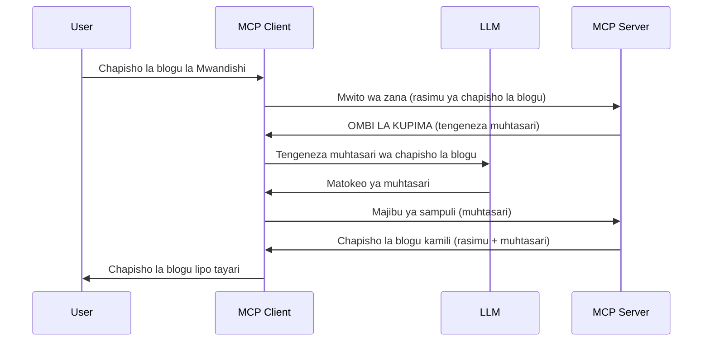

> [IMEPITWA TUMIA: MWAKA 2026-07-28 MGOMO WA KUTOLEWA](https://blog.modelcontextprotocol.io/posts/2026-07-28-release-candidate/)

# Sampuli - kuagiza vipengele kwa Mteja

> **Taarifa ya kumezwa matumizi:** mgomo wa maelezo ya MCP wa `2026-07-28` unaonyesha Sampuli kama imepitwa matumizi kwa faida ya ushirikiano wa moja kwa moja na API za mtoa huduma wa LLM. Sampuli inaendelea kufanya kazi katika `2025-11-25` na kwa angalau mwaka mmoja baada ya kuachiliwa rasmi kupitwa, hivyo kila kitu katika somo hili kinabaki halali — lakini miundombinu mipya ya seva inapaswa kutathmini mfano wa uingizaji. Angalia [Mabadiliko katika MCP: Mgomo wa Kutoelezwa wa 2026-07-28](../../01-CoreConcepts/mcp-2026-07-28-release-candidate.md).

Wakati mwingine, unahitaji Mteja MCP na Seva MCP kushirikiana kufanikisha lengo la pamoja. Unaweza kuwa na kesi ambapo Seva inahitaji msaada wa LLM iliyoko kwa mteja. Kwa hali hii, sampuli ndiyo unapaswa kutumia.

Hebu tuchunguze baadhi ya matumizi na jinsi ya kujenga suluhisho linalohusisha sampuli.

## Muhtasari

Katika somo hili, tunazingatia kuelezea lini na wapi kutumia Sampuli na jinsi ya kuipanga.

## Malengo ya Kujifunza

Katika sura hii, tutafanya:

- Eleza ni nini Sampuli na lini ya kuitumia.
- Onyesha jinsi ya kuanzisha Sampuli katika MCP.
- Toa mifano ya Sampuli katika utekelezaji.

## Ni nini Sampuli na kwa nini itumike?

Sampuli ni kipengele cha hali ya juu kinachofanya kazi kwa njia ifuatayo:



### Ombi la Sampuli

Sawa, sasa tuna mtazamo wa juu wa hali halisi ya kuaminika, hebu tuzungumze kuhusu ombi la sampuli ambalo seva inaturudishia kwa mteja. Hivi ndivyo ombi kama hilo linavyoonekana kwa mfumo wa JSON-RPC:

```json
{
  "jsonrpc": "2.0",
  "id": 1,
  "method": "sampling/createMessage",
  "params": {
    "messages": [
      {
        "role": "user",
        "content": {
          "type": "text",
          "text": "Create a blog post summary of the following blog post: <BLOG POST>"
        }
      }
    ],
    "modelPreferences": {
      "hints": [
        {
          "name": "claude-3-sonnet"
        }
      ],
      "intelligencePriority": 0.8,
      "speedPriority": 0.5
    },
    "systemPrompt": "You are a helpful assistant.",
    "maxTokens": 100
  }
}
```

Kuna mambo machache hapa yanayofaa kutajwa:

- Ombi, chini ya content -> text, ni ombi letu ambalo ni maelekezo kwa LLM kuchambua maudhui ya chapisho la blogu.

- **modelPreferences**. Sehemu hii ni hiyo, ni mapendeleo, pendekezo la usanidi wa kutumia LLM. Mtumiaji anaweza kuchagua kufuata mapendekezo haya au kuyabadilisha. Katika kesi hii kuna mapendekezo kuhusu mfano wa kutumia na kipaumbele cha kasi na akili.
- **systemPrompt**, hii ni ombi lako la kawaida la mfumo linalompatia LLM yako utu na lina maelekezo ya mwongozo.
- **maxTokens**, hii ni sifa nyingine inayotumiwa kusema ni token ngapi zinapendekezwa kutumika kwa kazi hii.

### Jibu la Sampuli

Jibu hili ndilo Mteja MCP anamaliza kurudisha kwa Seva MCP na ni matokeo ya mteja kupiga simu LLM, kusubiri jibu hilo na kisha kutengeneza ujumbe huu. Hivi ndivyo linavyoonekana kwa JSON-RPC:

```json
{
  "jsonrpc": "2.0",
  "id": 1,
  "result": {
    "role": "assistant",
    "content": {
      "type": "text",
      "text": "Here's your abstract <ABSTRACT>"
    },
    "model": "gpt-5",
    "stopReason": "endTurn"
  }
}
```

Angalia jinsi jibu linavyochanganya muhtasari wa chapisho la blogu kama tulivyotaka. Pia angalia jinsi `model` iliyotumika si ile tuliyoomba bali "gpt-5" badala ya "claude-3-sonnet". Hii ni kuonyesha kwamba mtumiaji anaweza kubadilisha maoni juu ya kile cha kutumia na kuwa ombi lako la sampuli ni pendekezo.

Sawa, sasa tumeelewa mtiririko mkuu, na kazi muhimu ya kuitumia kwa "kutengeneza chapisho la blogu + muhtasari", hebu tuone tunapaswa kufanya nini ili kufanya ifanye kazi.

### Aina za Ujumbe

Ujumbe za sampuli hazibaganiwi kwa maandishi tu bali unaweza pia kutuma picha na sauti. Hivi ndivyo JSON-RPC inavyoonekana tofauti:

**Maandishi**

```json
{
  "type": "text",
  "text": "The message content"
}
```

**Maudhui ya picha**

```json
{
  "type": "image",
  "data": "base64-encoded-image-data",
  "mimeType": "image/jpeg"
}
```

**Maudhui ya sauti**

```json
{
  "type": "audio",
  "data": "base64-encoded-audio-data",
  "mimeType": "audio/wav"
}
```

> TAARIFU: kwa taarifa zaidi kuhusu Sampuli, angalia [nyaraka rasmi](https://modelcontextprotocol.io/specification/2025-11-25/client/sampling)

## Jinsi ya Kuanzisha Sampuli kwa Mteja

> Kumbuka: kama unajenga seva tu, huna haja ya kufanya mengi hapa.

Kwa mteja, unahitaji kufafanua kipengele ifuatavyo kama hivi:

```json
{
  "capabilities": {
    "sampling": {}
  }
}
```

Hii kisha itachukuliwa wakati mteja uliyochagua anapoanzisha kwa seva.

## Mfano wa Sampuli Katika Utekelezaji - Tengeneza Chapisho la Blogu

Hebu tuchapishe seva ya sampuli pamoja, tutahitaji kufanya yafuatayo:

1. Tengeneza chombo kwenye Seva.
1. Chombo hicho kinapaswa kuunda ombi la sampuli
1. Chombo kinapaswa kusubiri jibu la ombi la sampuli la mteja.
1. Kisha matokeo ya chombo yanapaswa kutolewa.

Hebu tuone msimbo hatua kwa hatua:

### -1- Tengeneza chombo

**python**

```python
@mcp.tool()
async def create_blog(title: str, content: str, ctx: Context[ServerSession, None]) -> str:
    """Create a blog post and generate a summary"""

```

### -2- Tengeneza ombi la sampuli

Panjua chombo chako kwa msimbo ufuatao:

**python**

```python
post = BlogPost(
        id=len(posts) + 1,
        title=title,
        content=content,
        abstract=""
    )

prompt = f"Create an abstract of the following blog post: title: {title} and draft: {content} "

result = await ctx.session.create_message(
        messages=[
            SamplingMessage(
                role="user",
                content=TextContent(type="text", text=prompt),
            )
        ],
        max_tokens=100,
)

```

### -3- Subiri jibu na rudisha jibu

**python**

```python
post.abstract = result.content.text

posts.append(post)

# rudisha bidhaa kamili
return json.dumps({
    "id": post.title,
    "abstract": post.abstract
})
```

### -4- Msimbo kamili

**python**

```python
from starlette.applications import Starlette
from starlette.routing import Mount, Host

from mcp.server.fastmcp import Context, FastMCP

from mcp.server.session import ServerSession
from mcp.types import SamplingMessage, TextContent

import json


from uuid import uuid4
from typing import List
from pydantic import BaseModel


mcp = FastMCP("Blog post generator")

# app = FastAPI()

posts = []

class BlogPost(BaseModel):
    id: int
    title: str
    content: str
    abstract: str

posts: List[BlogPost] = []

@mcp.tool()
async def create_blog(title: str, content: str, ctx: Context[ServerSession, None]) -> str:
    """Create a blog post and generate a summary"""

    post = BlogPost(
        id=len(posts) + 1,
        title=title,
        content=content,
        abstract=""
    )

    prompt = f"Create an abstract of the following blog post: title: {title} and draft: {content} "

    result = await ctx.session.create_message(
        messages=[
            SamplingMessage(
                role="user",
                content=TextContent(type="text", text=prompt),
            )
        ],
        max_tokens=100,
    )

    post.abstract = result.content.text

    posts.append(post)

    # rudisha chapisho kamili la blogi
    return json.dumps({
        "id": post.title,
        "abstract": post.abstract
    })

if __name__ == "__main__":
    print("Starting server...")
    # mcp.run()
    mcp.run(transport="streamable-http")

# endesha app na: python server.py
```

### -5- Kuipima katika Visual Studio Code

Ili kuipima hii katika Visual Studio Code, fanya yafuatayo:

1. Anzisha seva kwenye terminal
1. Iweke kwenye *mcp.json* (na hakikisha imeanzishwa) mfano kama hivi:

   ```json
   "servers": {
      "blog-server": {
        "type": "http",
        "url": "http://localhost:8000/mcp"
      }
   }
   ```

1. Andika ombi:

   ```text
   create a blog post named "Where Python comes from", the content is "Python is actually named after Monty Python Flying Circus"
   ```

1. Ruhusu sampuli ifanyike. Mara ya kwanza unapotaka hii utaonyeshwa mazungumzo ya ziada unayopaswa kukubali, kisha utaona mazungumzo ya kawaida ya kukuomba uendeshe chombo

1. Kagua matokeo. Utaona matokeo yote yakiwa yamepangwa vizuri katika GitHub Copilot Chat lakini pia unaweza kuangalia jibu la moja kwa moja la JSON.

**Ziada**. Zana za Visual Studio Code zina msaada mzuri kwa sampuli. Unaweza kufafanua Upatikanaji wa Sampuli kwenye seva uliyoisakinisha kwa kuvinjari kama ifuatavyo:

1. Nenda sehemu ya upanuzi.
1. Chagua ikoni ya gia kwa seva uliyoisakinisha katika sehemu "MCP SERVERS - INSTALLED".
1 Chagua "Configure Model Access", hapa unaweza kuchagua ni Modeli zipi GitHub Copilot inaruhusiwa kutumia wakati wa kufanya sampuli. Pia unaweza kuona maombi yote ya sampuli yaliyotokea hivi karibuni kwa kuchagua "Show Sampling requests".

## Kazi ya Nyuma

Katika kazi hii ya nyuma, utajenga sampuli inayotofautiana kidogo yaani ushirikiano wa sampuli unaounga mkono kuzalisha maelezo ya bidhaa. Huu ndiyo muktadha wako:

**Muktadha**: Mfanyakazi wa ofisi wa nyuma katika e-commerce anahitaji msaada, inachukua muda mrefu sana kuzalisha maelezo ya bidhaa. Kwa hiyo, unapaswa kujenga suluhisho ambapo unaweza kupiga simu chombo "create_product" na hoja "title" na "keywords" na kinapaswa kutoa bidhaa kamili ikiwa na uwanja wa "description" ambao unapaswa kujazwa na LLM ya mteja.

KIPENDELEO: tumia kile ulichojifunza awali kujenga seva hii na chombo chake kwa kutumia ombi la sampuli.

## Suluhisho

[Suluhisho](./solution/README.md)

## Mambo Muhimu Kuibuka

Sampuli ni kipengele chenye nguvu kinachomruhusu seva kuagiza kazi kwa mteja inapohitaji msaada wa LLM.

## Kinachofuata

- [Sura ya 4 - Utekelezaji wa vitendo](../../04-PracticalImplementation/README.md)

---

<!-- CO-OP TRANSLATOR DISCLAIMER START -->
**Kionyozo**:
Hati hii imetafsiriwa kwa kutumia huduma ya tafsiri ya AI [Co-op Translator](https://github.com/Azure/co-op-translator). Ingawa tunajitahidi kupata usahihi, tafadhali fahamu kwamba tafsiri za kiotomatiki zinaweza kuwa na makosa au upungufu wa usahihi. Hati ya asili katika lugha yake halisi inapaswa kuchukuliwa kama chanzo cha mamlaka. Kwa taarifa muhimu, tafsiri ya kitaalamu inayofanywa na binadamu inapendekezwa. Hatutojibu kwa kuelewa vibaya au tafsiri potofu zinazotokea kutokana na matumizi ya tafsiri hii.
<!-- CO-OP TRANSLATOR DISCLAIMER END -->