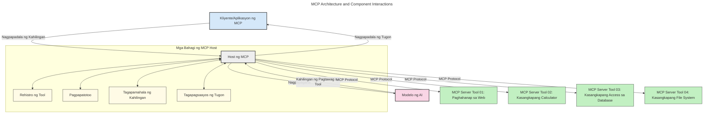
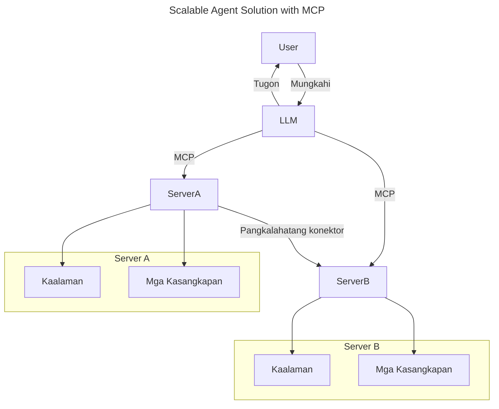
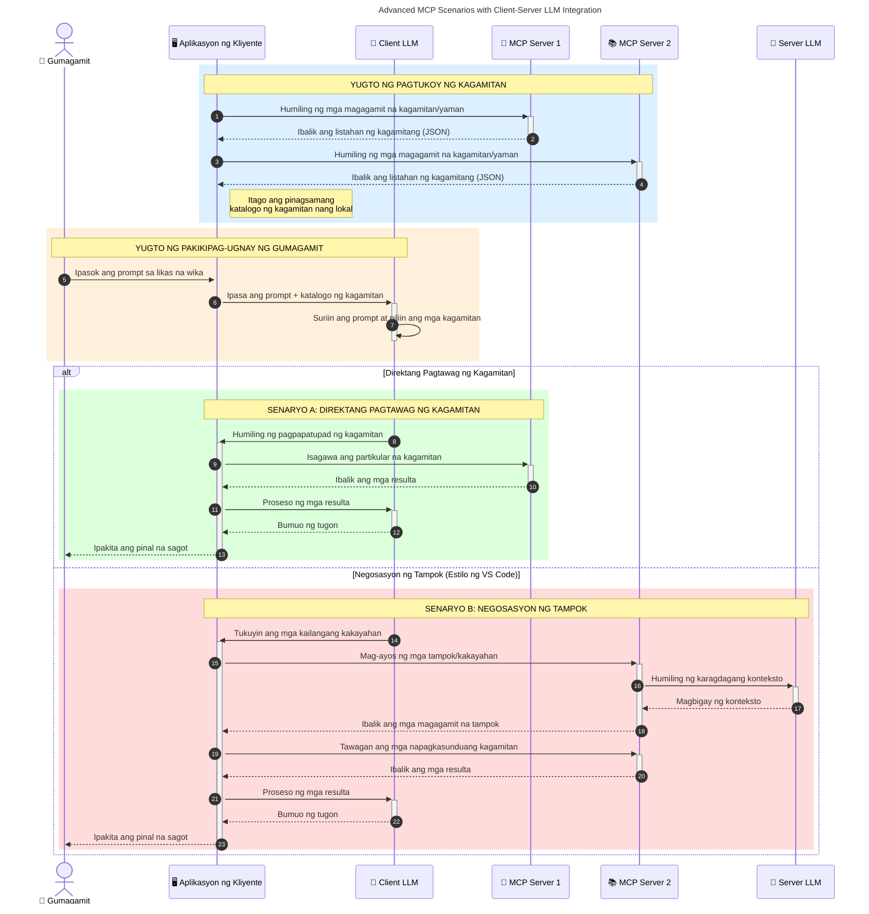

# Panimula sa Model Context Protocol (MCP): Bakit Mahalaga Ito para sa Ma-skalang Mga AI na Aplikasyon

_(I-click ang larawan sa itaas upang panoorin ang video ng araling ito)_

Ang mga generative AI na aplikasyon ay isang mahusay na hakbang pasulong dahil madalas nitong pinapayagan ang gumagamit na makipag-ugnayan sa app gamit ang mga natural na wikang prompt. Gayunpaman, habang mas maraming oras at mga mapagkukunan ang ilalaan sa ganitong mga app, nais mong matiyak na madali mong maisasama ang mga functionality at mga mapagkukunan sa paraang madaling mapapalawak, kaya maaari ang iyong app na maglingkod sa higit sa isang modelo na ginagamit, at mapangasiwaan ang iba't ibang kumplikasyon ng modelo. Sa madaling salita, madali ang paggawa ng Gen AI apps sa simula, ngunit habang lumalaki at nagiging mas kumplikado, kailangan mong simulan ang pagdedesisyon ng isang arkitektura at malamang na kakailanganin mong umasa sa isang pamantayan upang matiyak na ang mga app ay nabuo nang may pagkakapare-pareho. Dito pumapasok ang MCP upang ayusin ang mga bagay at magbigay ng pamantayan.

---

## **🔍 Ano ang Model Context Protocol (MCP)?**

Ang **Model Context Protocol (MCP)** ay isang **bukas, standardisadong interface** na nagpapahintulot sa Large Language Models (LLMs) na makipag-ugnayan nang tuloy-tuloy sa mga panlabas na kasangkapan, API, at mga pinagkukunan ng datos. Nagbibigay ito ng pare-parehong arkitektura upang mapahusay ang functionality ng AI model lampas sa kanilang training data, na nagpapahintulot ng mas matalino, ma-skalang, at mas tumutugong mga AI system.

---

## **🎯 Bakit Mahalaga ang Standardisasyon sa AI**

Habang nagiging mas kumplikado ang mga generative AI na aplikasyon, mahalagang magpatupad ng mga pamantayan na nagsisiguro ng **scalability, extensibility, maintainability,** at **pag-iwas sa vendor lock-in**. Tinatalakay ng MCP ang mga pangangailangang ito sa pamamagitan ng:

- Pagsasama-sama ng integrasyon ng model-tool
- Pagbawas ng mga maluwag at isang beses lang na custom na solusyon
- Pagpapahintulot sa maraming modelo mula sa iba't ibang vendor na magkakasamang umiiral sa isang ecosystem

**Tandaan:** Bagaman ipinagmamalaki ng MCP ang sarili bilang isang bukas na pamantayan, walang mga plano na i-standardize ang MCP sa pamamagitan ng anumang umiiral na mga katawan ng pamantayan tulad ng IEEE, IETF, W3C, ISO, o anumang iba pang mga katawan ng pamantayan.

---

## **📚 Mga Layunin sa Pagkatuto**

Sa pagtatapos ng artikulong ito, magagawa mong:

- Tukuyin ang **Model Context Protocol (MCP)** at ang mga gamit nito
- Unawain kung paano i-standardize ng MCP ang komunikasyon ng modelo-sa-kasangkapan
- Tukuyin ang mga pangunahing bahagi ng arkitektura ng MCP
- Tuklasin ang mga totoong aplikasyon ng MCP sa enterprise at development na konteksto

---

## **💡 Bakit Isang Game-Changer ang Model Context Protocol (MCP)**

### **🔗 Nilulutas ng MCP ang Fragmentation sa Mga Interaksyon ng AI**

Bago ang MCP, ang pagsasama ng mga modelo sa mga kasangkapan ay nangangailangan ng:

- Custom na code para sa bawat pares ng tool-model
- Hindi standard na API para sa bawat vendor
- Madalas na pagkakabasag dahil sa mga update
- Mahinang scalability kapag nadaragdagan ang mga kasangkapan

### **✅ Mga Benepisyo ng Standardisasyon ng MCP**

| **Benepisyo**              | **Paglalarawan**                                                                |
|--------------------------|--------------------------------------------------------------------------------|
| Interoperability         | Nakikipagtulungan nang maayos ang mga LLM sa mga kasangkapan mula sa iba't ibang vendor                       |
| Konsistensi              | Magkakatulad na pag-uugali sa iba't ibang platform at tool                                    |
| Reusability              | Ang mga kasangkapan ay maaaring magamit muli sa iba't ibang proyekto at sistema                       |
| Pabilisin ang Pag-unlad  | Bawasan ang oras ng pag-develop gamit ang mga standardisadong, plug-and-play na interface                |

---

## **🧱 Pangkalahatang Pagsusuri ng Arkitektura ng MCP**

Ang MCP ay sumusunod sa isang **client-server model**, kung saan:

- **MCP Hosts** ang nagpapatakbo ng mga AI models
- **MCP Clients** ang nagsisimula ng mga kahilingan
- **MCP Servers** ang nagpagsisilbi ng konteksto, mga kasangkapan, at mga kakayahan

### **Pangunahing Bahagi:**

- **Mga Mapagkukunan** – Static o dynamic na datos para sa mga modelo  
- **Mga Prompt** – Paunang natukoy na mga workflow para sa gabay sa pagbuo  
- **Mga Kasangkapan** – Mga naihahandang function tulad ng paghahanap, kalkulasyon  
- **Sampling** – Agentic na pag-uugali sa pamamagitan ng paulit-ulit na interaksyon (indiaorado sa release candidate na `2026-07-28`)
- **Elicitation** – Mga kahilingang inisyatiba ng server para sa input ng user
- **Roots** – Mga hangganan ng filesystem para sa kontrol ng access ng server (indiaorado sa release candidate na `2026-07-28`)

### **Arkitektura ng Protocol:**

Gumagamit ang MCP ng dalawang patong na arkitektura:
- **Data Layer**: Komunikasyong nakabase sa JSON-RPC 2.0 na may lifecycle management at primitives
- **Transport Layer**: STDIO (lokal) at Streamable HTTP na may SSE (malayo) na mga channel ng komunikasyon

---

## Paano Gumagana ang MCP Servers

Gumagana ang mga MCP server sa sumusunod na paraan:

- **Daloy ng Kahilingan**:
    1. Isang kahilingan ang inisiyahan ng end user o software na kumikilos sa kanilang ngalan.
    2. Ang **MCP Client** ay nagpapadala ng kahilingan sa isang **MCP Host**, na namamahala sa runtime ng AI Model.
    3. Natatanggap ng **AI Model** ang prompt ng user at maaaring humiling ng access sa mga panlabas na kasangkapan o datos sa pamamagitan ng isa o higit pang tawag sa tool.
    4. Ang **MCP Host**, hindi ang modelo mismo, ang nakikipag-usap sa angkop na **MCP Server(s)** gamit ang standardisadong protocol.
- **Functionality ng MCP Host**:
    - **Tool Registry**: Nagpapanatili ng katalogo ng mga magagamit na kasangkapan at kanilang mga kakayahan.
    - **Authentication**: Nagpapatunay ng mga pahintulot para sa pag-access ng kasangkapan.
    - **Request Handler**: Nagpoproseso ng mga papasok na kahilingan sa kasangkapan mula sa modelo.
    - **Response Formatter**: Nagsasaayos ng mga output ng kasangkapan sa format na maiintindihan ng modelo.
- **Pagpapatupad ng MCP Server**:
    - Ipinapasa ng **MCP Host** ang mga tawag sa kasangkapan sa isa o higit pang **MCP Servers**, na bawat isa ay naglalahad ng mga specialized function (halimbawa, paghahanap, kalkulasyon, query sa database).
    - Isinasagawa ng mga **MCP Servers** ang kanilang mga operasyon at ibinabalik ang mga resulta sa **MCP Host** sa pare-parehong format.
    - Inaayos at ipinapasa ng **MCP Host** ang mga resulta sa **AI Model**.
- **Pagtatapos ng Tugon**:
    - Isinasama ng **AI Model** ang mga output ng kasangkapan sa panghuling tugon.
    - Ipinapadala ng **MCP Host** ang tugon pabalik sa **MCP Client**, na nagde-deliver nito sa end user o tumatawag na software.
    

## 👨‍💻 Paano Gumawa ng MCP Server (May Mga Halimbawa)

Pinapayagan ng mga MCP server ang pagpapalawak ng kakayahan ng LLM sa pamamagitan ng pagbibigay ng datos at functionality. 

Handa ka na bang subukan? Narito ang mga SDK na partikular sa wika at/o stack na may mga halimbawa ng paggawa ng simpleng MCP servers sa iba't ibang wika/stack:

- **Python SDK**: https://github.com/modelcontextprotocol/python-sdk

- **TypeScript SDK**: https://github.com/modelcontextprotocol/typescript-sdk

- **Java SDK**: https://github.com/modelcontextprotocol/java-sdk

- **C#/.NET SDK**: https://github.com/modelcontextprotocol/csharp-sdk

## 🌍 Mga Totoong Gamit ng MCP

Pinapagana ng MCP ang malawak na hanay ng mga aplikasyon sa pamamagitan ng pagpapalawak ng mga kakayahan ng AI:

| **Aplikasyon**              | **Paglalarawan**                                                                |
|------------------------------|--------------------------------------------------------------------------------|
| Enterprise Data Integration  | Ikonekta ang mga LLM sa mga database, CRM, o mga panloob na kasangkapan                             |
| Agentic AI Systems           | Payagan ang mga autonomous na ahente na may access sa mga kasangkapan at mga workflow ng pagpapasya        |
| Multi-modal Applications     | Pagsamahin ang teksto, larawan, at audio na mga kasangkapan sa loob ng isang pinag-isang AI app            |
| Real-time Data Integration   | Dalhin ang live na datos sa mga pakikipag-ugnayan sa AI para sa mas tumpak at napapanahong mga output        |

### 🧠 MCP = Unibersal na Pamantayan para sa Mga Interaksyon ng AI

Ang Model Context Protocol (MCP) ay kumikilos bilang unibersal na pamantayan para sa mga interaksyon ng AI, tulad ng kung paano ni-standardize ng USB-C ang mga pisikal na koneksyon para sa mga aparato. Sa mundo ng AI, nagbibigay ang MCP ng isang pare-parehong interface, na nagpapahintulot sa mga modelo (clients) na makipagsama nang tuluy-tuloy sa mga panlabas na kasangkapan at tagapagbigay ng datos (servers). Nililimitahan nito ang pangangailangan para sa iba't ibang, custom na mga protocol para sa bawat API o pinagkukunan ng datos.

Sa ilalim ng MCP, ang isang MCP-compatible na kasangkapan (tinatawag na MCP server) ay sumusunod sa pinag-isang pamantayan. Maaaring ilista ng mga server na ito ang mga kasangkapan o aksyon na kanilang inaalok at isagawa ang mga aksyon na iyon kapag hinihiling ng isang AI agent. Ang mga platform ng AI agent na sumusuporta sa MCP ay may kakayahang tuklasin ang mga magagamit na kasangkapan mula sa mga server at tawagan ang mga ito sa pamamagitan ng standard na protocol na ito.

### 💡 Nagpapadali ng access sa kaalaman

Higit pa sa pag-aalok ng mga kasangkapan, pinadadali rin ng MCP ang access sa kaalaman. Pinapayagan nito ang mga aplikasyon na magbigay ng konteksto sa mga malalaking language model (LLMs) sa pamamagitan ng pag-link sa kanila sa iba't ibang pinagkukunan ng datos. Halimbawa, maaaring kumatawan ang isang MCP server sa repositoryo ng dokumento ng isang kumpanya, na nagpapahintulot sa mga ahente na kumuha ng kaugnay na impormasyon kapag kinakailangan. Maaari namang hawakan ng isa pang server ang mga partikular na aksyon tulad ng pagpapadala ng mga email o pag-update ng mga rekord. Mula sa perspektibo ng ahente, ang mga ito ay mga kasangkapan lamang na maaari nitong gamitin—ang ilang mga kasangkapan ay nagbabalik ng datos (knowledge context), habang ang iba naman ay nagsasagawa ng mga aksyon. Epektibo itong pinamamahalaan ng MCP.

Awtomatikong nalalaman ng isang ahente na nakakonekta sa isang MCP server ang mga magagamit na kakayahan at maaring ma-access na datos ng server sa pamamagitan ng standard na format. Pinapahintulutan ng standardisasyong ito ang dynamic na pagkakaroon ng mga kasangkapan. Halimbawa, ang pagdagdag ng isang bagong MCP server sa sistema ng ahente ay ginagawang agad na magagamit ang mga function nito nang hindi nangangailangan ng karagdagang pag-customize sa mga utos ng ahente.

Ang streamlined na integrasyong ito ay nakaayon sa daloy na ipinakita sa sumusunod na diagram, kung saan ang mga server ay nagbibigay ng parehong mga kasangkapan at kaalaman, na tinitiyak ang tuluy-tuloy na pagtutulungan sa mga sistema. 

### 👉 Halimbawa: Solusyong Ma-skalang Ahente

Pinapayagan ng Universal Connector ang mga MCP server na makipag-ugnayan at magbahagi ng mga kakayahan sa isa't isa, na nagpapahintulot kay ServerA na i-delegate ang mga gawain kay ServerB o ma-access ang mga kasangkapan at kaalaman nito. Pinagsasama nito ang mga kasangkapan at datos sa iba't ibang server, na sumusuporta sa ma-skalang at modular na mga arkitektura ng ahente. Dahil standard ang MCP sa paglalantad ng mga kasangkapan, maaaring dynamically tuklasin at ipasa ng mga ahente ang mga kahilingan sa pagitan ng mga server nang hindi kailangang magkaroon ng hardcoded na integrasyon.

Federation ng tool at kaalaman: Ang mga kasangkapan at datos ay maaaring ma-access sa iba't ibang server, na nagpapahintulot ng mas ma-skalang at modular na mga arkitektura ng mga ahenteng agentic.

### 🔄 Mga Advanced na Senaryo ng MCP na may Integrasyon ng LLM sa Client-Side

Higit pa sa pangunahing arkitektura ng MCP, may mga advanced na senaryo kung saan parehong may LLM ang client at server, na nagpapahintulot ng mas sopistikadong mga interaksyon. Sa sumusunod na diagram, ang **Client App** ay maaaring isang IDE na may ilang MCP tool na magagamit ng LLM:

## 🔐 Praktikal na Mga Benepisyo ng MCP

Narito ang mga praktikal na benepisyo ng paggamit ng MCP:

- **Kabaguhan**: Maaaring ma-access ng mga modelo ang napapanahong impormasyon lampas sa kanilang training data
- **Pagpapalawak ng Kakayahan**: Maaaring gamitin ng mga modelo ang mga specialized na kasangkapan para sa mga gawaing hindi kasama sa training nila
- **Pagbawas ng Hallucinations**: Nagbibigay ng factual grounding ang mga panlabas na pinagkukunan ng datos
- **Pribasiya**: Maaaring manatili ang sensitibong datos sa mga ligtas na kapaligiran sa halip na maisama sa mga prompt

## 📌 Mga Pangunahing Punto

Narito ang mga pangunahing punto sa paggamit ng MCP:

- Ina-standardize ng **MCP** kung paano makipag-ugnayan ang mga AI model sa mga kasangkapan at datos
- Pina-promote ang **extensibility, consistency, at interoperability**
- Tinutulungan ng MCP ang **pagbawas ng oras ng pag-develop, pagpapabuti ng pagiging maaasahan, at pagpapalawak ng kakayahan ng modelo**
- Pinapahintulutan ng client-server na arkitektura ang **maliksi at ma-expand na AI na mga aplikasyon**

## 🧠 Ehersisyo

Isipin ang isang AI na aplikasyon na interesado kang gawin.

- Anu-anong **panlabas na kasangkapan o datos** ang maaaring magpabuti ng mga kakayahan nito?
- Paano makapagpapadali at magiging mas maaasahan ang integrasyon gamit ang MCP?

## Karagdagang mga Mapagkukunan

- [MCP GitHub Repository](https://github.com/modelcontextprotocol)

## Ano ang susunod

Susunod: [Kabanata 1: Mga Pangunahing Konsepto](../01-CoreConcepts/README.md)

---

<!-- CO-OP TRANSLATOR DISCLAIMER START -->
**Pagtatanggi**:
Ang dokumentong ito ay isinalin gamit ang serbisyo ng AI translation na [Co-op Translator](https://github.com/Azure/co-op-translator). Bagama't nagsusumikap kami para sa katumpakan, pakatandaan na ang awtomatikong pagsasalin ay maaaring maglaman ng mga pagkakamali o hindi pagkakatugma. Ang orihinal na dokumento sa orihinal nitong wika ang dapat ituring na pangunahing sanggunian. Para sa mahahalagang impormasyon, inirerekomenda ang propesyonal na pagsasalin ng tao. Hindi kami mananagot sa anumang maling pagkakaintindi o maling interpretasyon na nagmula sa paggamit ng pagsasaling ito.
<!-- CO-OP TRANSLATOR DISCLAIMER END -->