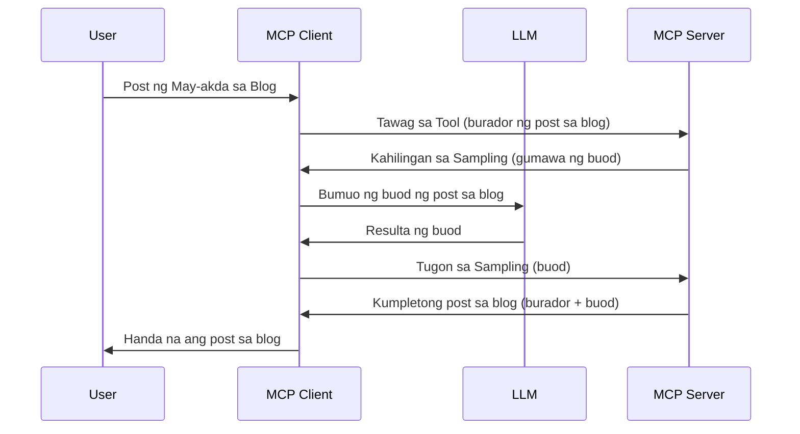

> [DEPRECATED: 2026-07-28 RELEASE CANDIDATE](https://blog.modelcontextprotocol.io/posts/2026-07-28-release-candidate/)

# Sampling - i-delegate ang mga tampok sa Kliyente

> **Paunawa sa pag-deprecate:** ang `2026-07-28` MCP specification release candidate ay nagsasaad ng Sampling bilang deprecated pabor sa direktang integrasyon sa mga LLM provider API. Patuloy na gagana ang Sampling sa `2025-11-25` at sa loob ng hindi bababa sa isang taon matapos ng opisyal na deprecate, kaya't lahat ng nasa leksyong ito ay nananatiling balido — ngunit ang mga bagong disenyo ng server ay dapat suriin ang kapalit na pattern. Tingnan ang [Ano ang Nagbabago sa MCP: Ang 2026-07-28 Release Candidate](../../01-CoreConcepts/mcp-2026-07-28-release-candidate.md).

Minsan, kailangan ng MCP Client at MCP Server na magtulungan upang makamit ang isang karaniwang layunin. Maaaring may kaso kung saan nangangailangan ang Server ng tulong ng LLM na nasa kliyente. Para sa ganitong sitwasyon, sampling ang dapat mong gamitin.

Tuklasin natin ang ilang mga gamit at kung paano bumuo ng solusyon na gumagamit ng sampling.

## Pangkalahatang-ideya

Sa leksyong ito, tututukan natin kung kailan at saan gagamitin ang Sampling at kung paano ito i-configure.

## Mga Layunin sa Pagkatuto

Sa kabanatang ito, ating gagawin ang mga sumusunod:

- Ipaliwanag kung ano ang Sampling at kailan ito gagamitin.
- Ipakita kung paano i-configure ang Sampling sa MCP.
- Magbigay ng mga halimbawa ng Sampling sa aksyon.

## Ano ang Sampling at bakit ito gamitin?

Ang Sampling ay isang advanced na tampok na gumagana sa sumusunod na paraan:



### Sampling request

Ok, ngayon ay mayroon na tayong pangkalahatang ideya sa isang makatwirang senaryo, pag-usapan natin ang sampling request na ipinapadala ng server pabalik sa kliyente. Ganito ang hitsura ng request sa format ng JSON-RPC:

```json
{
  "jsonrpc": "2.0",
  "id": 1,
  "method": "sampling/createMessage",
  "params": {
    "messages": [
      {
        "role": "user",
        "content": {
          "type": "text",
          "text": "Create a blog post summary of the following blog post: <BLOG POST>"
        }
      }
    ],
    "modelPreferences": {
      "hints": [
        {
          "name": "claude-3-sonnet"
        }
      ],
      "intelligencePriority": 0.8,
      "speedPriority": 0.5
    },
    "systemPrompt": "You are a helpful assistant.",
    "maxTokens": 100
  }
}
```

May ilang bagay dito na dapat bigyang pansin:

- Ang Prompt, sa ilalim ng content -> text, ay ang ating prompt na isang utos para sa LLM na ibuod ang nilalaman ng blog post.

- **modelPreferences**. Bahaging ito ay isang preference, isang rekomendasyon kung anong konfigurasyon ang gagamitin sa LLM. Puwedeng piliin ng user kung susundin ang mga rekomendasyong ito o babaguhin ito. Sa kasong ito, may mga rekomendasyon tungkol sa modelong gagamitin pati na ang prayoridad sa bilis at talino.
- **systemPrompt**, ito ang normal na system prompt mo na nagbibigay personalidad sa iyong LLM at naglalaman ng mga panuto.
- **maxTokens**, isa pang property na nagsasabi kung ilan ang rekomendadong tokens na gagamitin para sa takdang ito.

### Sampling response

Ang response na ito ang idinadalang pabalik ng MCP Client sa MCP Server bilang resulta ng pagtawag ng client sa LLM, paghintay ng sagot, at pagkatapos ay pagbuo ng mensaheng ito. Ganito ang hitsura nito sa JSON-RPC:

```json
{
  "jsonrpc": "2.0",
  "id": 1,
  "result": {
    "role": "assistant",
    "content": {
      "type": "text",
      "text": "Here's your abstract <ABSTRACT>"
    },
    "model": "gpt-5",
    "stopReason": "endTurn"
  }
}
```

Pansinin kung paano ang response ay isang buod ng blog post tulad ng ating hinihingi. Pansinin din kung paano ang ginamit na `model` ay hindi kung ano ang hiningi natin kundi "gpt-5" imbes na "claude-3-sonnet". Ipinapakita nito na puwedeng magbago ang isip ng user sa gagamitin at ang iyong sampling request ay isang rekomendasyon lang.

Ok, ngayon na naiintindihan natin ang pangunahing daloy, at ang kapaki-pakinabang na gawain para dito ay "paglikha ng blog post + abstrak", tingnan natin kung ano ang kailangan gawin para mapagana ito.

### Mga uri ng mensahe

Hindi lang limitado sa teksto ang mga mensahe sa Sampling kundi maaari ka ring magpadala ng mga imahe at audio. Ganito ang pagkakaiba ng hitsura ng JSON-RPC:

**Teksto**

```json
{
  "type": "text",
  "text": "The message content"
}
```

**Nilalaman ng Imahe**

```json
{
  "type": "image",
  "data": "base64-encoded-image-data",
  "mimeType": "image/jpeg"
}
```

**Nilalaman ng Audio**

```json
{
  "type": "audio",
  "data": "base64-encoded-audio-data",
  "mimeType": "audio/wav"
}
```

> NOTE: para sa mas detalyadong impormasyon tungkol sa Sampling, tingnan ang [opisyal na dokumentasyon](https://modelcontextprotocol.io/specification/2025-11-25/client/sampling)

## Paano I-configure ang Sampling sa Kliyente

> Paunawa: kung gumagawa ka lang ng server, hindi mo na kailangang gumawa ng marami dito.

Sa isang kliyente, kailangan mong tukuyin ang mga sumusunod na tampok tulad nito:

```json
{
  "capabilities": {
    "sampling": {}
  }
}
```

Ito ay kukunin kapag nag-initialize ang iyong napiling kliyente sa server.

## Halimbawa ng Sampling sa Aksyon - Gumawa ng Blog Post

Gawa tayo ng sampling server nang magkasama, kailangan nating gawin ang mga sumusunod:

1. Gumawa ng tool sa Server.
1. Ang tool na iyon ay dapat gumawa ng sampling request
1. Hintayin ng tool ang sagot sa sampling request ng kliyente.
1. Pagkatapos ay dapat maproseso ang resulta ng tool.

Tingnan natin ang code nang hakbang-hakbang:

### -1- Gumawa ng tool

**python**

```python
@mcp.tool()
async def create_blog(title: str, content: str, ctx: Context[ServerSession, None]) -> str:
    """Create a blog post and generate a summary"""

```

### -2- Gumawa ng sampling request

Palawakin ang iyong tool gamit ang sumusunod na code:

**python**

```python
post = BlogPost(
        id=len(posts) + 1,
        title=title,
        content=content,
        abstract=""
    )

prompt = f"Create an abstract of the following blog post: title: {title} and draft: {content} "

result = await ctx.session.create_message(
        messages=[
            SamplingMessage(
                role="user",
                content=TextContent(type="text", text=prompt),
            )
        ],
        max_tokens=100,
)

```

### -3- Hintayin ang tugon at ibalik ito

**python**

```python
post.abstract = result.content.text

posts.append(post)

# ibalik ang buong produkto
return json.dumps({
    "id": post.title,
    "abstract": post.abstract
})
```

### -4- Buong code

**python**

```python
from starlette.applications import Starlette
from starlette.routing import Mount, Host

from mcp.server.fastmcp import Context, FastMCP

from mcp.server.session import ServerSession
from mcp.types import SamplingMessage, TextContent

import json


from uuid import uuid4
from typing import List
from pydantic import BaseModel


mcp = FastMCP("Blog post generator")

# app = FastAPI()

posts = []

class BlogPost(BaseModel):
    id: int
    title: str
    content: str
    abstract: str

posts: List[BlogPost] = []

@mcp.tool()
async def create_blog(title: str, content: str, ctx: Context[ServerSession, None]) -> str:
    """Create a blog post and generate a summary"""

    post = BlogPost(
        id=len(posts) + 1,
        title=title,
        content=content,
        abstract=""
    )

    prompt = f"Create an abstract of the following blog post: title: {title} and draft: {content} "

    result = await ctx.session.create_message(
        messages=[
            SamplingMessage(
                role="user",
                content=TextContent(type="text", text=prompt),
            )
        ],
        max_tokens=100,
    )

    post.abstract = result.content.text

    posts.append(post)

    # ibalik ang buong blog post
    return json.dumps({
        "id": post.title,
        "abstract": post.abstract
    })

if __name__ == "__main__":
    print("Starting server...")
    # mcp.run()
    mcp.run(transport="streamable-http")

# patakbuhin ang app gamit ang: python server.py
```

### -5- Pagsubok sa Visual Studio Code

Para subukan ito sa Visual Studio Code, gawin ang mga sumusunod:

1. Simulan ang server sa terminal
1. Idagdag ito sa *mcp.json* (at siguraduhing ito ay naka-start) halimbawa ganito:

   ```json
   "servers": {
      "blog-server": {
        "type": "http",
        "url": "http://localhost:8000/mcp"
      }
   }
   ```

1. Mag-type ng prompt:

   ```text
   create a blog post named "Where Python comes from", the content is "Python is actually named after Monty Python Flying Circus"
   ```

1. Pahintulutan ang sampling na mangyari. Sa unang subok nito ay makakatanggap ka ng dagdag na dialog na kailangang i-accept, pagkatapos nito ay makikita mo ang karaniwang dialog na humihiling sa iyo na patakbuhin ang tool

1. Suriin ang mga resulta. Makikita mo ang mga resulta na maganda ang pagkak-render sa GitHub Copilot Chat pero maaari mo ring makita ang raw na JSON response.

**Bonus**. May mahusay na suporta para sa sampling ang mga tool sa Visual Studio Code. Maaari mong i-configure ang Sampling access sa iyong naka-install na server sa pamamagitan ng pag-navigate dito tulad ng sumusunod:

1. Pumunta sa seksyon ng extension.
1. Piliin ang cog icon para sa iyong naka-install na server sa seksyong "MCP SERVERS - INSTALLED".
1 Piliin ang "Configure Model Access", dito maaari mong piliin kung aling mga Modelo ang pinapayagan ng GitHub Copilot gamitin kapag nagsasagawa ng sampling. Maaari mo ring makita ang lahat ng sampling requests na naganap kamakailan sa pagpili ng "Show Sampling requests".

## Takdang Aralin

Sa takdang aralin na ito, gagawa ka ng bahagyang ibang Sampling, katulad ng sampling integration na sumusuporta sa pagbuo ng paglalarawan ng produkto. Narito ang iyong senaryo:

**Senaryo**: Ang tagagawa ng opisina sa isang e-commerce ay nangangailangan ng tulong, tumatagal ng sobra ang paggawa ng mga paglalarawan ng produkto. Kaya, ikaw ay gagawa ng solusyon kung saan maaari kang tumawag ng tool na "create_product" na may mga argumento na "title" at "keywords" at ito ay dapat gumawa ng kumpletong produkto kabilang ang "description" na field na pupunuin ng LLM ng kliyente.

TIP: gamitin ang iyong natutunan upang mabuo ang server na ito at ang tool nito gamit ang isang sampling request.

## Solusyon

[Solusyon](./solution/README.md)

## Pangunahing Mga Natutunan

Ang Sampling ay isang makapangyarihang tampok na nagbibigay-daan sa server upang i-delegate ang mga gawain sa kliyente kapag kailangan nito ng tulong mula sa isang LLM.

## Ano ang Susunod

- [Kabanata 4 - Praktikal na implementasyon](../../04-PracticalImplementation/README.md)

---

<!-- CO-OP TRANSLATOR DISCLAIMER START -->
**Pagtatanggi**:
Ang dokumentong ito ay isinalin gamit ang serbisyo ng AI translation na [Co-op Translator](https://github.com/Azure/co-op-translator). Bagama't nagsusumikap kami para sa katumpakan, pakatandaan na ang awtomatikong pagsasalin ay maaaring maglaman ng mga pagkakamali o hindi pagkakatugma. Ang orihinal na dokumento sa orihinal nitong wika ang dapat ituring na pangunahing sanggunian. Para sa mahahalagang impormasyon, inirerekomenda ang propesyonal na pagsasalin ng tao. Hindi kami mananagot sa anumang maling pagkakaintindi o maling interpretasyon na nagmula sa paggamit ng pagsasaling ito.
<!-- CO-OP TRANSLATOR DISCLAIMER END -->