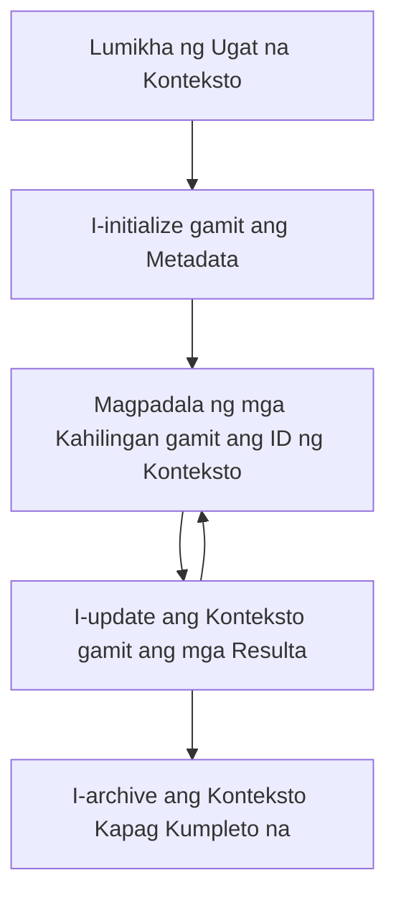

> [NABAWASAN NG SILA: 2026-07-28 RELEASE CANDIDATE](https://blog.modelcontextprotocol.io/posts/2026-07-28-release-candidate/#roots-sampling-and-logging-are-deprecated)

# MCP Mga Ugat na Konteksto

> **Pabatid sa Pagbawas:** ang `2026-07-28` MCP specification release candidate ay nagmamarka ng Roots bilang nabawasan pabor sa mga parametro ng tool, resource URIs, o server configuration. Patuloy na gumagana ang Roots sa `2025-11-25` at sa loob ng hindi bababa sa isang taon matapos ang pormal na pagbawas, kaya ang lahat ng nasa araling ito ay nananatiling wasto - ngunit ang mga bagong disenyo ng server ay dapat suriin ang pattern ng kapalit. Tingnan ang [Ano ang Nagbabago sa MCP: Ang 2026-07-28 Release Candidate](../../01-CoreConcepts/mcp-2026-07-28-release-candidate.md).

Ang mga root context ay isang pangunahing konsepto sa Model Context Protocol na nagbibigay ng matibay na patong para mapanatili ang kasaysayan ng pag-uusap at pinagsamang estado sa maraming mga kahilingan at session.

## Panimula

Sa araling ito, susuriin natin kung paano gumawa, pamahalaan, at gamitin ang mga root context sa MCP.

## Mga Layunin sa Pagkatuto

Sa pagtatapos ng araling ito, magagawa mong:

- Maunawaan ang layunin at estruktura ng mga root context
- Gumawa at pamahalaan ang mga root context gamit ang MCP client libraries
- Ipatupad ang mga root context sa mga aplikasyon ng .NET, Java, JavaScript, at Python
- Gamitin ang mga root context para sa mga multi-turn na pag-uusap at pamamahala ng estado
- Ipatupad ang mga pinakamahusay na kasanayan para sa pamamahala ng root context

## Pag-unawa sa Mga Root Context

Ang mga root context ay nagsisilbing mga lalagyan na nagtataglay ng kasaysayan at estado para sa isang serye ng magkakaugnay na interaksyon. Pinapagana nila ang:

- **Pagpapatuloy ng Pag-uusap**: Pagpapanatili ng magkakaugnay na multi-turn na pag-uusap
- **Pamamahala ng Memorya**: Pag-iimbak at pagkuha ng impormasyon sa mga interaksyon
- **Pamamahala ng Estado**: Pagsubaybay sa progreso sa mga kumplikadong workflow
- **Pagbabahagi ng Konteksto**: Pagbibigay-daan sa maraming kliyente na ma-access ang parehong estado ng pag-uusap

Sa MCP, ang mga root context ay may mga pangunahing katangian:

- Bawat root context ay may natatanging identifier.
- Maaari nilang taglayin ang kasaysayan ng pag-uusap, mga kagustuhan ng gumagamit, at iba pang metadata.
- Maaari silang malikha, ma-access, at ma-archive kung kinakailangan.
- Sinuportahan nila ang masusing kontrol sa pag-access at mga pahintulot.

## Lifecycle ng Root Context



## Paggana sa Mga Root Context

Narito ang isang halimbawa kung paano gumawa at pamahalaan ang mga root context.

### Pagpapatupad sa C#

```csharp
// .NET Example: Root Context Management
using Microsoft.Mcp.Client;
using System;
using System.Threading.Tasks;
using System.Collections.Generic;

public class RootContextExample
{
    private readonly IMcpClient _client;
    private readonly IRootContextManager _contextManager;
    
    public RootContextExample(IMcpClient client, IRootContextManager contextManager)
    {
        _client = client;
        _contextManager = contextManager;
    }
    
    public async Task DemonstrateRootContextAsync()
    {
        // 1. Create a new root context
        var contextResult = await _contextManager.CreateRootContextAsync(new RootContextCreateOptions
        {
            Name = "Customer Support Session",
            Metadata = new Dictionary<string, string>
            {
                ["CustomerName"] = "Acme Corporation",
                ["PriorityLevel"] = "High",
                ["Domain"] = "Cloud Services"
            }
        });
        
        string contextId = contextResult.ContextId;
        Console.WriteLine($"Created root context with ID: {contextId}");
        
        // 2. First interaction using the context
        var response1 = await _client.SendPromptAsync(
            "I'm having issues scaling my web service deployment in the cloud.", 
            new SendPromptOptions { RootContextId = contextId }
        );
        
        Console.WriteLine($"First response: {response1.GeneratedText}");
        
        // Second interaction - the model will have access to the previous conversation
        var response2 = await _client.SendPromptAsync(
            "Yes, we're using containerized deployments with Kubernetes.", 
            new SendPromptOptions { RootContextId = contextId }
        );
        
        Console.WriteLine($"Second response: {response2.GeneratedText}");
        
        // 3. Add metadata to the context based on conversation
        await _contextManager.UpdateContextMetadataAsync(contextId, new Dictionary<string, string>
        {
            ["TechnicalEnvironment"] = "Kubernetes",
            ["IssueType"] = "Scaling"
        });
        
        // 4. Get context information
        var contextInfo = await _contextManager.GetRootContextInfoAsync(contextId);
        
        Console.WriteLine("Context Information:");
        Console.WriteLine($"- Name: {contextInfo.Name}");
        Console.WriteLine($"- Created: {contextInfo.CreatedAt}");
        Console.WriteLine($"- Messages: {contextInfo.MessageCount}");
        
        // 5. When the conversation is complete, archive the context
        await _contextManager.ArchiveRootContextAsync(contextId);
        Console.WriteLine($"Archived context {contextId}");
    }
}
```

Sa nabanggit na code ay:

1. Nakagawa ng root context para sa isang session ng customer support.
1. Nagpadala ng maraming mensahe sa loob ng kontekstong iyon, na nagpapahintulot sa modelo na mapanatili ang estado.
1. Na-update ang konteksto gamit ang mahalagang metadata base sa pag-uusap.
1. Nakuha ang impormasyon ng konteksto upang maunawaan ang kasaysayan ng pag-uusap.
1. Na-archive ang konteksto nang matapos ang pag-uusap.

## Halimbawa: Pagpapatupad ng Root Context para sa pagsusuring pinansyal

Sa halimbawang ito, gagawa tayo ng root context para sa isang session ng pagsusuring pinansyal, na nagpapakita kung paano mapanatili ang estado sa maraming interaksyon.

### Pagpapatupad sa Java

```java
// Halimbawa ng Java: Implementasyon ng Root Context
package com.example.mcp.contexts;

import com.mcp.client.McpClient;
import com.mcp.client.ContextManager;
import com.mcp.models.RootContext;
import com.mcp.models.McpResponse;

import java.util.HashMap;
import java.util.Map;
import java.util.UUID;

public class RootContextsDemo {
    private final McpClient client;
    private final ContextManager contextManager;
    
    public RootContextsDemo(String serverUrl) {
        this.client = new McpClient.Builder()
            .setServerUrl(serverUrl)
            .build();
            
        this.contextManager = new ContextManager(client);
    }
    
    public void demonstrateRootContext() throws Exception {
        // Gumawa ng metadata ng konteksto
        Map<String, String> metadata = new HashMap<>();
        metadata.put("projectName", "Financial Analysis");
        metadata.put("userRole", "Financial Analyst");
        metadata.put("dataSource", "Q1 2025 Financial Reports");
        
        // 1. Gumawa ng bagong root context
        RootContext context = contextManager.createRootContext("Financial Analysis Session", metadata);
        String contextId = context.getId();
        
        System.out.println("Created context: " + contextId);
        
        // 2. Unang pakikipag-ugnayan
        McpResponse response1 = client.sendPrompt(
            "Analyze the trends in Q1 financial data for our technology division",
            contextId
        );
        
        System.out.println("First response: " + response1.getGeneratedText());
        
        // 3. I-update ang konteksto gamit ang mahahalagang impormasyon mula sa tugon
        contextManager.addContextMetadata(contextId, 
            Map.of("identifiedTrend", "Increasing cloud infrastructure costs"));
        
        // Pangalawang pakikipag-ugnayan - gamit ang parehong konteksto
        McpResponse response2 = client.sendPrompt(
            "What's driving the increase in cloud infrastructure costs?",
            contextId
        );
        
        System.out.println("Second response: " + response2.getGeneratedText());
        
        // 4. Gumawa ng buod ng sesyon ng pagsusuri
        McpResponse summaryResponse = client.sendPrompt(
            "Summarize our analysis of the technology division financials in 3-5 key points",
            contextId
        );
        
        // Itago ang buod sa metadata ng konteksto
        contextManager.addContextMetadata(contextId, 
            Map.of("analysisSummary", summaryResponse.getGeneratedText()));
            
        // Kuhanin ang na-update na impormasyon ng konteksto
        RootContext updatedContext = contextManager.getRootContext(contextId);
        
        System.out.println("Context Information:");
        System.out.println("- Created: " + updatedContext.getCreatedAt());
        System.out.println("- Last Updated: " + updatedContext.getLastUpdatedAt());
        System.out.println("- Analysis Summary: " + 
            updatedContext.getMetadata().get("analysisSummary"));
            
        // 5. I-archive ang konteksto kapag tapos na
        contextManager.archiveContext(contextId);
        System.out.println("Context archived");
    }
}
```

Sa nabanggit na code, kami ay:

1. Nakagawa ng root context para sa session ng pagsusuring pinansyal.
2. Nagpadala ng maraming mensahe sa loob ng kontekstong iyon, na nagpapahintulot sa modelo na mapanatili ang estado.
3. Na-update ang konteksto gamit ang mahalagang metadata base sa pag-uusap.
4. Nakabuo ng buod ng session ng pagsusuri at iniimbak ito sa metadata ng konteksto.
5. Na-archive ang konteksto nang matapos ang pag-uusap.

## Halimbawa: Pamamahala ng Root Context

Ang epektibong pamamahala ng mga root context ay mahalaga para mapanatili ang kasaysayan ng pag-uusap at estado. Narito ang isang halimbawa kung paano ipatupad ang pamamahala ng root context.

### Pagpapatupad sa JavaScript

```javascript
// Halimbawa sa JavaScript: Pamamahala ng MCP Root Contexts
const { McpClient, RootContextManager } = require('@mcp/client');

class ContextSession {
  constructor(serverUrl, apiKey = null) {
    // I-initialize ang MCP client
    this.client = new McpClient({
      serverUrl,
      apiKey
    });
    
    // I-initialize ang context manager
    this.contextManager = new RootContextManager(this.client);
  }
  
  /**
   * Create a new conversation context
   * @param {string} sessionName - Name of the conversation session
   * @param {Object} metadata - Additional metadata for the context
   * @returns {Promise<string>} - Context ID
   */
  async createConversationContext(sessionName, metadata = {}) {
    try {
      const contextResult = await this.contextManager.createRootContext({
        name: sessionName,
        metadata: {
          ...metadata,
          createdAt: new Date().toISOString(),
          status: 'active'
        }
      });
      
      console.log(`Created root context '${sessionName}' with ID: ${contextResult.id}`);
      return contextResult.id;
    } catch (error) {
      console.error('Error creating root context:', error);
      throw error;
    }
  }
  
  /**
   * Send a message in an existing context
   * @param {string} contextId - The root context ID
   * @param {string} message - The user's message
   * @param {Object} options - Additional options
   * @returns {Promise<Object>} - Response data
   */
  async sendMessage(contextId, message, options = {}) {
    try {
      // Ipadala ang mensahe gamit ang tinukoy na konteksto
      const response = await this.client.sendPrompt(message, {
        rootContextId: contextId,
        temperature: options.temperature || 0.7,
        allowedTools: options.allowedTools || []
      });
      
      // Opsyonal na itabi ang mahalagang mga insight mula sa pag-uusap
      if (options.storeInsights) {
        await this.storeConversationInsights(contextId, message, response.generatedText);
      }
      
      return {
        message: response.generatedText,
        toolCalls: response.toolCalls || [],
        contextId
      };
    } catch (error) {
      console.error(`Error sending message in context ${contextId}:`, error);
      throw error;
    }
  }
  
  /**
   * Store important insights from a conversation
   * @param {string} contextId - The root context ID
   * @param {string} userMessage - User's message
   * @param {string} aiResponse - AI's response
   */
  async storeConversationInsights(contextId, userMessage, aiResponse) {
    try {
      // Kunin ang mga posibleng insight (sa tunay na app, mas sopistikado ito)
      const combinedText = userMessage + "\n" + aiResponse;
      
      // Simpleng heuristic para matukoy ang posibleng mga insight
      const insightWords = ["important", "key point", "remember", "significant", "crucial"];
      
      const potentialInsights = combinedText
        .split(".")
        .filter(sentence => 
          insightWords.some(word => sentence.toLowerCase().includes(word))
        )
        .map(sentence => sentence.trim())
        .filter(sentence => sentence.length > 10);
      
      // Itabi ang mga insight sa metadata ng konteksto
      if (potentialInsights.length > 0) {
        const insights = {};
        potentialInsights.forEach((insight, index) => {
          insights[`insight_${Date.now()}_${index}`] = insight;
        });
        
        await this.contextManager.updateContextMetadata(contextId, insights);
        console.log(`Stored ${potentialInsights.length} insights in context ${contextId}`);
      }
    } catch (error) {
      console.warn('Error storing conversation insights:', error);
      // Hindi kritikal na error, kaya mag-log na lang ng babala
    }
  }
  
  /**
   * Get summary information about a context
   * @param {string} contextId - The root context ID
   * @returns {Promise<Object>} - Context information
   */
  async getContextInfo(contextId) {
    try {
      const contextInfo = await this.contextManager.getContextInfo(contextId);
      
      return {
        id: contextInfo.id,
        name: contextInfo.name,
        created: new Date(contextInfo.createdAt).toLocaleString(),
        lastUpdated: new Date(contextInfo.lastUpdatedAt).toLocaleString(),
        messageCount: contextInfo.messageCount,
        metadata: contextInfo.metadata,
        status: contextInfo.status
      };
    } catch (error) {
      console.error(`Error getting context info for ${contextId}:`, error);
      throw error;
    }
  }
  
  /**
   * Generate a summary of the conversation in a context
   * @param {string} contextId - The root context ID
   * @returns {Promise<string>} - Generated summary
   */
  async generateContextSummary(contextId) {
    try {
      // Hilingin sa modelo na gumawa ng buod ng pag-uusap hanggang ngayon
      const response = await this.client.sendPrompt(
        "Please summarize our conversation so far in 3-4 sentences, highlighting the main points discussed.",
        { rootContextId: contextId, temperature: 0.3 }
      );
      
      // Itabi ang buod sa metadata ng konteksto
      await this.contextManager.updateContextMetadata(contextId, {
        conversationSummary: response.generatedText,
        summarizedAt: new Date().toISOString()
      });
      
      return response.generatedText;
    } catch (error) {
      console.error(`Error generating context summary for ${contextId}:`, error);
      throw error;
    }
  }
  
  /**
   * Archive a context when it's no longer needed
   * @param {string} contextId - The root context ID
   * @returns {Promise<Object>} - Result of the archive operation
   */
  async archiveContext(contextId) {
    try {
      // Gumawa ng panghuling buod bago i-archive
      const summary = await this.generateContextSummary(contextId);
      
      // I-archive ang konteksto
      await this.contextManager.archiveContext(contextId);
      
      return {
        status: "archived",
        contextId,
        summary
      };
    } catch (error) {
      console.error(`Error archiving context ${contextId}:`, error);
      throw error;
    }
  }
}

// Halimbawa ng paggamit
async function demonstrateContextSession() {
  const session = new ContextSession('https://mcp-server-example.com');
  
  try {
    // 1. Gumawa ng bagong konteksto para sa pag-uusap tungkol sa suporta ng produkto
    const contextId = await session.createConversationContext(
      'Product Support - Database Performance',
      {
        customer: 'Globex Corporation',
        product: 'Enterprise Database',
        severity: 'Medium',
        supportAgent: 'AI Assistant'
      }
    );
    
    // 2. Unang mensahe sa pag-uusap
    const response1 = await session.sendMessage(
      contextId,
      "I'm experiencing slow query performance on our database cluster after the latest update.",
      { storeInsights: true }
    );
    console.log('Response 1:', response1.message);
    
    // Kasunod na mensahe sa parehong konteksto
    const response2 = await session.sendMessage(
      contextId,
      "Yes, we've already checked the indexes and they seem to be properly configured.",
      { storeInsights: true }
    );
    console.log('Response 2:', response2.message);
    
    // 3. Kunin ang impormasyon tungkol sa konteksto
    const contextInfo = await session.getContextInfo(contextId);
    console.log('Context Information:', contextInfo);
    
    // 4. Gumawa at ipakita ang buod ng pag-uusap
    const summary = await session.generateContextSummary(contextId);
    console.log('Conversation Summary:', summary);
    
    // 5. I-archive ang konteksto kapag tapos na
    const archiveResult = await session.archiveContext(contextId);
    console.log('Archive Result:', archiveResult);
    
    // 6. Harapin ang anumang error nang maayos
  } catch (error) {
    console.error('Error in context session demonstration:', error);
  }
}

demonstrateContextSession();
```

Sa nabanggit na code ay:

1. Nakagawa ng root context para sa isang pag-uusap ukol sa suporta ng produkto gamit ang function na `createConversationContext`. Sa kasong ito, ang konteksto ay tungkol sa mga isyu sa performance ng database.

1. Nagpadala ng maraming mensahe sa loob ng kontekstong iyon, na nagpapahintulot sa modelo na mapanatili ang estado gamit ang function na `sendMessage`. Ang mga ipinadalang mensahe ay tungkol sa mabagal na performance ng query at configuration ng index.

1. Na-update ang konteksto gamit ang mahalagang metadata base sa pag-uusap.

1. Nakabuo ng buod ng pag-uusap at iniimbak ito sa metadata ng konteksto gamit ang function na `generateContextSummary`.

1. Na-archive ang konteksto nang matapos ang pag-uusap gamit ang function na `archiveContext`.

1. Maingat na hinawakan ang mga error upang masigurong matibay ang proseso.

## Root Context para sa Multi-Turn na Tulong

Sa halimbawang ito, gagawa tayo ng root context para sa session ng multi-turn na tulong, na nagpapakita kung paano mapanatili ang estado sa maraming interaksyon.

### Pagpapatupad sa Python

```python
# Halimbawa ng Python: Root na Konteksto para sa Multi-Turn na Tulong
import asyncio
from datetime import datetime
from mcp_client import McpClient, RootContextManager

class AssistantSession:
    def __init__(self, server_url, api_key=None):
        self.client = McpClient(server_url=server_url, api_key=api_key)
        self.context_manager = RootContextManager(self.client)
    
    async def create_session(self, name, user_info=None):
        """Create a new root context for an assistant session"""
        metadata = {
            "session_type": "assistant",
            "created_at": datetime.now().isoformat(),
        }
        
        # Idagdag ang impormasyon ng user kung ibinigay
        if user_info:
            metadata.update({f"user_{k}": v for k, v in user_info.items()})
            
        # Gumawa ng root na konteksto
        context = await self.context_manager.create_root_context(name, metadata)
        return context.id
    
    async def send_message(self, context_id, message, tools=None):
        """Send a message within a root context"""
        # Gumawa ng mga opsyon gamit ang ID ng konteksto
        options = {
            "root_context_id": context_id
        }
        
        # Magdagdag ng mga kasangkapan kung tinukoy
        if tools:
            options["allowed_tools"] = tools
        
        # Ipadala ang prompt sa loob ng konteksto
        response = await self.client.send_prompt(message, options)
        
        # I-update ang metadata ng konteksto kasama ang progreso ng pag-uusap
        await self.context_manager.update_context_metadata(
            context_id,
            {
                f"message_{datetime.now().timestamp()}": message[:50] + "...",
                "last_interaction": datetime.now().isoformat()
            }
        )
        
        return response
    
    async def get_conversation_history(self, context_id):
        """Retrieve conversation history from a context"""
        context_info = await self.context_manager.get_context_info(context_id)
        messages = await self.client.get_context_messages(context_id)
        
        return {
            "context_info": context_info,
            "messages": messages
        }
    
    async def end_session(self, context_id):
        """End an assistant session by archiving the context"""
        # Bumuo muna ng summary prompt
        summary_response = await self.client.send_prompt(
            "Please summarize our conversation and any key points or decisions made.",
            {"root_context_id": context_id}
        )
        
        # Itabi ang summary sa metadata
        await self.context_manager.update_context_metadata(
            context_id,
            {
                "summary": summary_response.generated_text,
                "ended_at": datetime.now().isoformat(),
                "status": "completed"
            }
        )
        
        # I-archive ang konteksto
        await self.context_manager.archive_context(context_id)
        
        return {
            "status": "completed",
            "summary": summary_response.generated_text
        }

# Halimbawa ng paggamit
async def demo_assistant_session():
    assistant = AssistantSession("https://mcp-server-example.com")
    
    # 1. Gumawa ng session
    context_id = await assistant.create_session(
        "Technical Support Session",
        {"name": "Alex", "technical_level": "advanced", "product": "Cloud Services"}
    )
    print(f"Created session with context ID: {context_id}")
    
    # 2. Unang interaksyon
    response1 = await assistant.send_message(
        context_id, 
        "I'm having trouble with the auto-scaling feature in your cloud platform.",
        ["documentation_search", "diagnostic_tool"]
    )
    print(f"Response 1: {response1.generated_text}")
    
    # Pangalawang interaksyon sa parehong konteksto
    response2 = await assistant.send_message(
        context_id,
        "Yes, I've already checked the configuration settings you mentioned, but it's still not working."
    )
    print(f"Response 2: {response2.generated_text}")
    
    # 3. Kunin ang kasaysayan
    history = await assistant.get_conversation_history(context_id)
    print(f"Session has {len(history['messages'])} messages")
    
    # 4. Tapusin ang session
    end_result = await assistant.end_session(context_id)
    print(f"Session ended with summary: {end_result['summary']}")

if __name__ == "__main__":
    asyncio.run(demo_assistant_session())
```

Sa nabanggit na code ay:

1. Nakagawa ng root context para sa isang session ng teknikal na suporta gamit ang function na `create_session`. Kasama sa konteksto ang impormasyon ng gumagamit tulad ng pangalan at antas ng teknikalidad.

1. Nagpadala ng maraming mensahe sa loob ng kontekstong iyon, na nagpapahintulot sa modelo na mapanatili ang estado gamit ang function na `send_message`. Ang mga ipinadalang mensahe ay tungkol sa mga isyu sa auto-scaling na tampok.

1. Nakuha ang kasaysayan ng pag-uusap gamit ang function na `get_conversation_history`, na nagbibigay ng impormasyon sa konteksto at mga mensahe.

1. Tinapos ang session sa pamamagitan ng pag-archive ng konteksto at paggawa ng buod gamit ang function na `end_session`. Kinukuha ng buod ang mga mahalagang punto sa pag-uusap.

## Mga Pinakamahusay na Kasanayan sa Root Context

Narito ang ilang pinakamahusay na kasanayan para sa epektibong pamamahala ng mga root context:

- **Gumawa ng Nakatuong Mga Konteksto**: Gumawa ng hiwalay na root context para sa iba't ibang layunin ng pag-uusap o domain upang mapanatili ang linaw.

- **Magtakda ng mga Patakaran sa Pag-expire**: Magpatupad ng mga patakaran para i-archive o burahin ang mga lumang konteksto upang pamahalaan ang imbakan at sumunod sa mga patakaran ng pag-iimbak ng data.

- **Mag-imbak ng Mahahalagang Metadata**: Gamitin ang metadata ng konteksto upang mag-imbak ng mahahalagang impormasyon tungkol sa pag-uusap na maaaring makatulong sa susunod.

- **Gamitin ng Konsistenteng ang Mga ID ng Konteksto**: Kapag nakagawa ng konteksto, gamitin nang tuloy-tuloy ang ID nito para sa lahat ng kaugnay na kahilingan upang mapanatili ang tuloy-tuloy na daloy.

- **Gumawa ng Mga Buod**: Kapag lumalaki ang konteksto, isaalang-alang ang paggawa ng mga buod upang makuha ang mahalagang impormasyon habang pinamamahalaan ang laki ng konteksto.

- **Magpatupad ng Kontrol sa Pag-access**: Para sa mga multi-user na sistema, magpatupad ng angkop na kontrol sa pag-access upang masiguro ang privacy at seguridad ng mga konteksto ng pag-uusap.

- **Harapin ang Mga Limitasyon ng Konteksto**: Maging maalam sa mga limitasyon sa laki ng konteksto at magpatupad ng mga estratehiya para sa paghawak ng napakahabang mga pag-uusap.

- **I-archive Kapag Tapos na**: I-archive ang mga konteksto kapag tapos na ang mga pag-uusap upang palayain ang mga resources habang pinapanatili ang kasaysayan ng pag-uusap.

## Ano ang Susunod

- [5.5 Routing](../mcp-routing/README.md)

---

<!-- CO-OP TRANSLATOR DISCLAIMER START -->
**Pagtatanggi**:
Ang dokumentong ito ay isinalin gamit ang serbisyo ng AI translation na [Co-op Translator](https://github.com/Azure/co-op-translator). Bagama't nagsusumikap kami para sa katumpakan, pakatandaan na ang awtomatikong pagsasalin ay maaaring maglaman ng mga pagkakamali o hindi pagkakatugma. Ang orihinal na dokumento sa orihinal nitong wika ang dapat ituring na pangunahing sanggunian. Para sa mahahalagang impormasyon, inirerekomenda ang propesyonal na pagsasalin ng tao. Hindi kami mananagot sa anumang maling pagkakaintindi o maling interpretasyon na nagmula sa paggamit ng pagsasaling ito.
<!-- CO-OP TRANSLATOR DISCLAIMER END -->