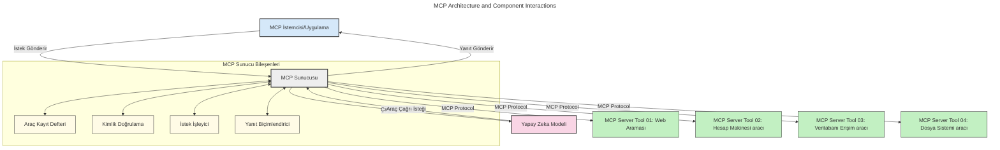
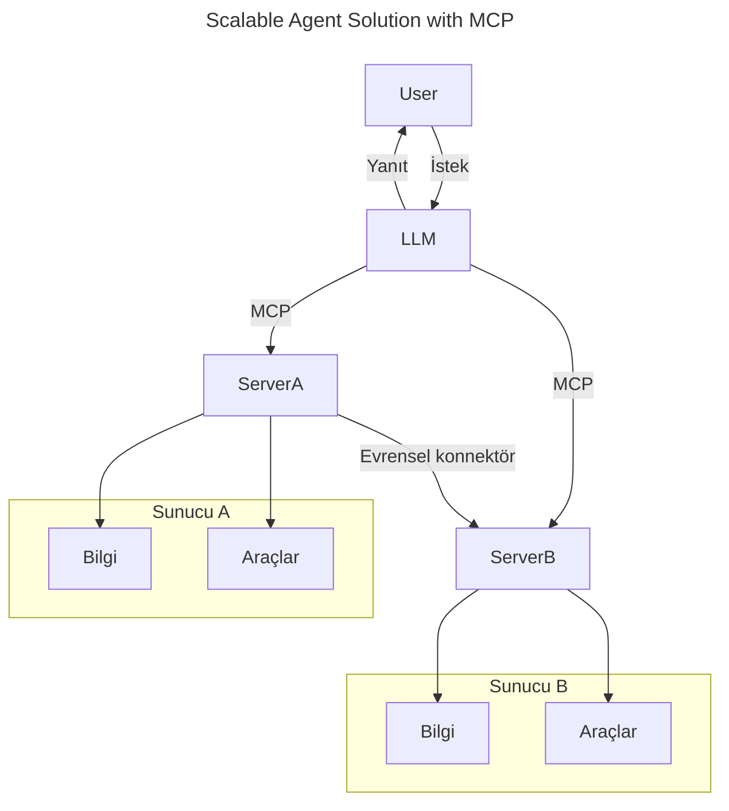
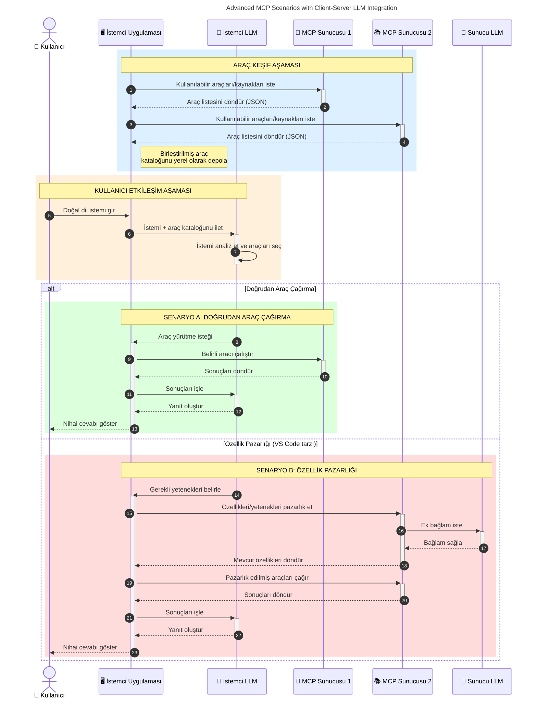

# Model Context Protocol (MCP) Giriş: Ölçeklenebilir AI Uygulamaları İçin Neden Önemlidir

_(Bu dersin videosunu izlemek için yukarıdaki resme tıklayın)_

Üretken AI uygulamaları, kullanıcıların doğal dil istemleriyle uygulamayla etkileşime girmesine olanak tanıması açısından büyük bir ilerlemedir. Ancak, bu tür uygulamalara daha fazla zaman ve kaynak yatırıldıkça, işlevleri ve kaynakları kolayca entegre edebilmeniz, uygulamanızın birden fazla model kullanımını desteklemesi ve farklı model özelliklerini yönetebilmesi önemlidir. Özetle, Gen AI uygulamaları başlamak için kolaydır, ancak büyüyüp karmaşıklaştıkça bir mimari tanımlamaya başlamanız ve uygulamalarınızın tutarlı bir şekilde oluşturulmasını sağlamak için muhtemelen bir standa dayanmaya ihtiyacınız olacaktır. İşte MCP bu noktada devreye girerek işleri organize eder ve bir standart sağlar.

---

## **🔍 Model Context Protocol (MCP) Nedir?**

**Model Context Protocol (MCP)**, Büyük Dil Modellerinin (LLM'ler) harici araçlar, API'ler ve veri kaynaklarıyla sorunsuz etkileşim kurmasını sağlayan **açık, standartlaştırılmış bir arayüz**dür. AI model işlevselliğini eğitim verilerinin ötesine taşımak için tutarlı bir mimari sağlar ve daha akıllı, ölçeklenebilir ve daha duyarlı AI sistemlerine olanak tanır.

---

## **🎯 AI'da Standardizasyon Neden Önemlidir**

Üretken AI uygulamaları karmaşıklaştıkça, **ölçeklenebilirlik, genişletilebilirlik, sürdürülebilirlik** ve **satıcı kilitlenmesini önleme** gibi ihtiyaçları karşılayacak standartları benimsemek esastır. MCP bu ihtiyaçları şu şekilde karşılar:

- Model ve araç entegrasyonlarını birleştirir
- Kırılgan, tek seferlik özel çözümleri azaltır
- Farklı satıcılardan birden çok modelin aynı ekosistemde var olmasına izin verir

**Not:** MCP kendini açık bir standart olarak tanıtır, ancak IEEE, IETF, W3C, ISO veya başka bir standart kuruluşu tarafından standartlaştırılması yönünde bir plan bulunmamaktadır.

---

## **📚 Öğrenme Hedefleri**

Bu makalenin sonunda şunları yapabileceksiniz:

- **Model Context Protocol (MCP)** ve kullanım alanlarını tanımlamak
- MCP'nin modelden araca iletişimi nasıl standartlaştırdığını anlamak
- MCP mimarisinin temel bileşenlerini belirlemek
- MCP'nin gerçek dünya uygulamalarını kurumsal ve geliştirme bağlamlarında keşfetmek

---

## **💡 Model Context Protocol (MCP) Neden Devrim Niteliğindedir?**

### **🔗 MCP, AI Etkileşimlerindeki Parçalanmayı Çözer**

MCP'den önce, modellerle araçların entegrasyonu şunları gerektiriyordu:

- Her araç-model çifti için özel kod
- Her satıcı için standart dışı API'ler
- Güncellemeler nedeniyle sık kesintiler
- Daha fazla araçla kötü ölçeklenebilirlik

### **✅ MCP Standartlaştırmanın Faydaları**

| **Fayda**                | **Açıklama**                                                                |
|--------------------------|----------------------------------------------------------------------------|
| Birlikte Çalışabilirlik  | LLM'ler farklı satıcıların araçlarıyla sorunsuz çalışır                    |
| Tutarlılık              | Platformlar ve araçlar arasında tekdüze davranış                           |
| Yeniden Kullanılabilirlik| Bir kez geliştirilen araçlar projelerde ve sistemlerde tekrar kullanılabilir|
| Hızlandırılmış Geliştirme | Standart, tak ve çalıştır arayüzleri kullanarak geliştirme süresini azaltır |

---

## **🧱 Yüksek Seviyede MCP Mimari Genel Bakış**

MCP, bir **istemci-sunucu modeli** takip eder, burada:

- **MCP Host'lar** AI modellerini çalıştırır
- **MCP Client'lar** istekleri başlatır
- **MCP Server'lar** bağlam, araçlar ve yetenekleri sağlar

### **Temel Bileşenler:**

- **Kaynaklar** – Modeller için statik veya dinamik veriler  
- **İstemler** – Yönlendirilmiş üretim için önceden tanımlanmış iş akışları  
- **Araçlar** – Arama, hesaplamalar gibi çalıştırılabilir fonksiyonlar  
- **Örnekleme** – Yinelemeli etkileşimler yoluyla ajan davranışı (2026-07-28 sürüm adayında kullanımdan kaldırıldı)
- **Çıkarım** – Kullanıcı girdisi için sunucu kaynaklı istekler
- **Kökler** – Sunucu erişim kontrolü için dosya sistemi sınırları (2026-07-28 sürüm adayında kullanımdan kaldırıldı)

### **Protokol Mimarisi:**

MCP iki katmanlı bir mimari kullanır:
- **Veri Katmanı**: Yaşam döngüsü yönetimi ve ilkel işlemlerle JSON-RPC 2.0 tabanlı iletişim
- **Taşıma Katmanı**: STDIO (yerel) ve SSE destekli Streamable HTTP (uzak) iletişim kanalları

---

## MCP Sunucuları Nasıl Çalışır

MCP sunucuları aşağıdaki şekilde çalışır:

- **İstek Akışı**:
    1. Bir istek, son kullanıcı veya onun adına hareket eden yazılım tarafından başlatılır.
    2. **MCP Client**, isteği AI Model çalışma zamanını yöneten **MCP Host**'a gönderir.
    3. **AI Model**, kullanıcı istemini alır ve bir veya daha fazla araç çağrısı aracılığıyla harici araçlara veya verilere erişim talep edebilir.
    4. **MCP Host**, model doğrudan değil, standartlaştırılmış protokolü kullanarak ilgili **MCP Server(lar)** ile iletişim kurar.
- **MCP Host İşlevleri**:
    - **Araç Kaydı**: Mevcut araçlar ve yeteneklerinin katalogunu tutar.
    - **Kimlik Doğrulama**: Araç erişim izinlerini doğrular.
    - **İstek İşleyici**: Modelden gelen araç isteklerini işler.
    - **Yanıt Formatlayıcı**: Araç çıktılarının modeli anlayabileceği biçimde yapılandırılması.
- **MCP Server Yürütme**:
    - **MCP Host**, özel fonksiyonlar sunan bir veya daha fazla **MCP Server**'a (örneğin arama, hesaplamalar, veritabanı sorguları) araç çağrılarını yönlendirir.
    - **MCP Server'lar** ilgili işlemleri gerçekleştirir ve sonuçları tutarlı bir formatta **MCP Host**'a iletir.
    - **MCP Host**, bu sonuçları biçimlendirir ve **AI Model**'e iletir.
- **Yanıt Tamamlama**:
    - **AI Model**, araç çıktısını nihai yanıta dahil eder.
    - **MCP Host**, yanıtı **MCP Client**'a gönderir ve oradan son kullanıcıya veya çağıran yazılıma iletilir.
    

## 👨‍💻 MCP Sunucusu Nasıl Oluşturulur (Örneklerle)

MCP sunucuları, LLM yeteneklerini veri ve işlevsellik sağlayarak genişletmenizi sağlar.

Denemeye hazır mısınız? Farklı dil/teknoloji yığınlarında basit MCP sunucuları oluşturmak için örneklerle SDK'lar şunlardır:

- **Python SDK**: https://github.com/modelcontextprotocol/python-sdk

- **TypeScript SDK**: https://github.com/modelcontextprotocol/typescript-sdk

- **Java SDK**: https://github.com/modelcontextprotocol/java-sdk

- **C#/.NET SDK**: https://github.com/modelcontextprotocol/csharp-sdk

## 🌍 MCP'nin Gerçek Dünya Kullanım Örnekleri

MCP, AI yeteneklerini genişleterek birçok uygulamaya olanak tanır:

| **Uygulama**                  | **Açıklama**                                                              |
|------------------------------|--------------------------------------------------------------------------|
| Kurumsal Veri Entegrasyonu   | LLM'leri veritabanlarına, CRM'lere veya dahili araçlara bağlar          |
| Ajanik AI Sistemleri         | Araç erişimi ve karar alma iş akışlarına sahip otonom ajanları etkinleştirir |
| Çok Modlu Uygulamalar        | Metin, görsel ve ses araçlarını tek bir birleşik AI uygulamasında birleştirir |
| Gerçek Zamanlı Veri Entegrasyonu | AI etkileşimlerine canlı veri getirerek daha doğru, güncel çıktılar sağlar  |

### 🧠 MCP = AI Etkileşimleri İçin Evrensel Standart

Model Context Protocol (MCP), cihazlar için USB-C'nin fiziksel bağlantıları standartlaştırması gibi AI etkileşimleri için evrensel bir standart görevi görür. AI dünyasında MCP, modellerin (istemciler) harici araçlar ve veri sağlayıcıları (sunucular) ile sorunsuz entegrasyonunu sağlayan tutarlı bir arayüz sunar. Bu, her API veya veri kaynağı için çeşitli, özel protokollere olan ihtiyacı ortadan kaldırır.

MCP altında, MCP uyumlu bir araç (MCP sunucusu olarak adlandırılır) birleşik bir standardı takip eder. Bu sunucular sundukları araçları veya eylemleri listeleyebilir ve AI ajan tarafından istendiğinde bu eylemleri gerçekleştirebilir. MCP destekli AI ajan platformları, sunuculardaki mevcut araçları keşfedebilir ve bu standart protokol aracılığıyla çağırabilir.

### 💡 Bilgiye Erişimi Kolaylaştırır

MCP sadece araç sunmakla kalmaz, aynı zamanda bilgiye erişimi kolaylaştırır. Uygulamaların büyük dil modellerine (LLM) çeşitli veri kaynaklarını bağlayarak bağlam sağlamasına imkan tanır. Örneğin, bir MCP sunucusu bir şirketin belge deposunu temsil edebilir ve ajanların ilgili bilgileri talep üzerine almasını sağlar. Başka bir sunucu ise e-posta gönderme veya kayıt güncelleme gibi belirli eylemleri yönetebilir. Ajan perspektifinden bunlar sadece kullanabileceği araçlardır—bazı araçlar veri (bilgi bağlamı) dönerken, diğerleri eylem gerçekleştirir. MCP her ikisini de etkili biçimde yönetir.

Bir ajan, bir MCP sunucusuna bağlandığında, standart bir format aracılığıyla sunucunun mevcut yeteneklerini ve erişilebilir verilerini otomatik olarak öğrenir. Bu standartlaştırma dinamik araç kullanılabilirliğini mümkün kılar. Örneğin, bir ajanın sistemine yeni bir MCP sunucusu eklemek, işlevlerinin hemen kullanılabilir olmasını sağlar ve ajanın talimatlarında ilave özelleştirme gerektirmez.

Bu akıcı entegrasyon aşağıdaki diyagramda gösterilmektedir; sunucular hem araç hem de bilgi sağlar ve sistemler arasında sorunsuz iş birliğini garanti eder.

### 👉 Örnek: Ölçeklenebilir Ajan Çözümü

 Evrensel Bağlayıcı, MCP sunucularının birbirleriyle iletişim kurmasını ve yeteneklerini paylaşmasını sağlar, böylece ServerA görevleri ServerB'ye devredebilir veya onun araçlarına ve bilgisine erişebilir. Bu, sunucular arasında araç ve veri federasyonu yaratır ve ölçeklenebilir modüler ajan mimarilerini destekler. MCP araç sunumunu standartlaştırdığı için ajanlar, sabit kodlu entegrasyonlar olmadan sunucular arasında dinamik olarak araç keşfedebilir ve istek yönlendirebilir.

Araç ve bilgi federasyonu: Araçlar ve verilere sunucular arasında erişim sağlanabilir, bu da daha ölçeklenebilir ve modüler ajanik mimariler sağlar.

### 🔄 İstemci Tarafı LLM Entegrasyonlu Gelişmiş MCP Senaryoları

Temel MCP mimarisinin ötesinde, hem istemci hem de sunucuda LLM'lerin bulunduğu ve daha gelişmiş etkileşimlere imkan veren ileri senaryolar vardır. Aşağıdaki diyagramda, **İstemci Uygulama** LLM tarafından kullanılabilecek birçok MCP aracı bulunan bir IDE olabilir:

## 🔐 MCP'nin Pratik Faydaları

MCP kullanmanın pratik faydaları şunlardır:

- **Güncellik**: Modeller, eğitim verilerinin ötesinde güncel bilgilere erişebilir
- **Yetenek Genişletme**: Modeller, eğitilmedikleri görevler için özel araçlardan yararlanabilir
- **Azaltılmış Halüsinasyonlar**: Harici veri kaynakları gerçekçi temellendirme sağlar
- **Gizlilik**: Hassas veriler, istemlerde gömülü olmak yerine güvenli ortamda kalabilir

## 📌 Önemli Noktalar

MCP kullanımı için önemli çıkarımlar şunlardır:

- **MCP**, AI modellerinin araçlar ve verilerle etkileşim biçimini standartlaştırır
- **Genişletilebilirlik, tutarlılık ve birlikte çalışabilirliği** teşvik eder
- MCP geliştirme süresini azaltmaya, güvenilirliği artırmaya ve model yeteneklerini genişletmeye yardımcı olur
- İstemci-sunucu mimarisi, esnek ve genişletilebilir AI uygulamalarına imkan tanır

## 🧠 Alıştırma

İnşa etmeye ilgi duyduğunuz bir AI uygulamasını düşünün.

- Hangi **harici araçlar veya veriler** yeteneklerini artırabilir?
- MCP, entegrasyonu nasıl **daha basit ve güvenilir** hale getirebilir?

## Ek Kaynaklar

- [MCP GitHub Deposu](https://github.com/modelcontextprotocol)

## Sonraki Ne Geliyor

Sonraki: [Bölüm 1: Temel Kavramlar](../01-CoreConcepts/README.md)

---

<!-- CO-OP TRANSLATOR DISCLAIMER START -->
**Feragatname**:
Bu belge, AI çeviri hizmeti [Co-op Translator](https://github.com/Azure/co-op-translator) kullanılarak çevrilmiştir. Doğruluk için çaba sarf etsek de, otomatik çevirilerin hata veya yanlışlık içerebileceğini lütfen unutmayınız. Orijinal belge, kendi dilinde yetkili kaynak olarak kabul edilmelidir. Kritik bilgiler için profesyonel insan çevirisi önerilir. Bu çevirinin kullanımı sonucu ortaya çıkabilecek yanlış anlamalardan veya yanlış yorumlamalardan sorumlu değiliz.
<!-- CO-OP TRANSLATOR DISCLAIMER END -->