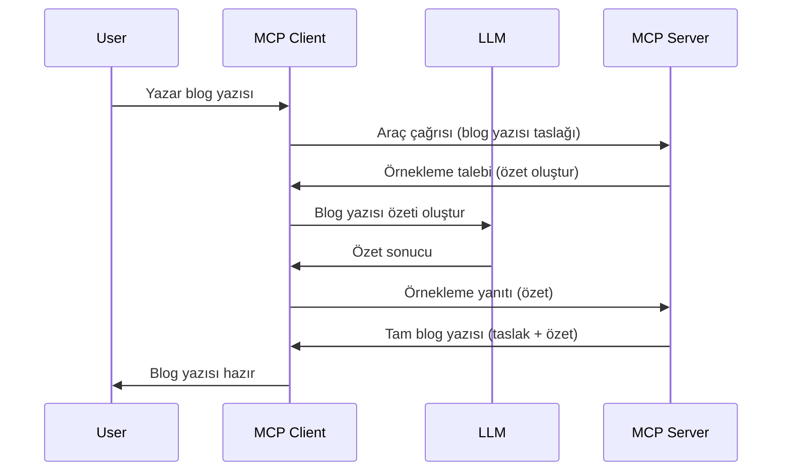

> [KALDIRILDI: 2026-07-28 SÜRÜM ADAYI](https://blog.modelcontextprotocol.io/posts/2026-07-28-release-candidate/)

# Örnekleme - Özellikleri İstemciye Devretme

> **Kaldırılma bildirimi:** `2026-07-28` MCP spesifikasyonu sürüm adayı, Örneklemeyi, LLM sağlayıcı API'leriyle doğrudan entegrasyon lehine kaldırılmış olarak işaretler. Örnekleme, `2025-11-25` sürümünde ve herhangi bir resmi kaldırılmadan sonra en az bir yıl boyunca çalışmaya devam eder, bu yüzden bu derste yer alan her şey geçerlidir — ancak yeni sunucu tasarımları yedek desenleri değerlendirmelidir. Bkz. [MCP’de Neler Değişiyor: 2026-07-28 Sürüm Adayı](../../01-CoreConcepts/mcp-2026-07-28-release-candidate.md).

Bazen, MCP İstemcisi ve MCP Sunucusunun ortak bir hedefe ulaşmak için iş birliği yapması gerekir. Sunucunun, istemcide bulunan bir LLM'nin yardımına ihtiyaç duyduğu durumlar olabilir. Bu durum için kullanmanız gereken yöntem örneklemedir.

Bazı kullanım durumlarını ve örneklemeyi içeren nasıl bir çözüm kurulacağını keşfedelim.

## Genel Bakış

Bu derste, Örneklemenin ne zaman ve nerede kullanılacağını ve nasıl yapılandırılacağını açıklamaya odaklanacağız.

## Öğrenme Hedefleri

Bu bölümde:

- Örneklemenin ne olduğunu ve ne zaman kullanılacağını açıklayacağız.
- MCP'de Örneklemenin nasıl yapılandırılacağını göstereceğiz.
- Örneklemenin uygulamadaki örneklerini sunacağız.

## Örnekleme nedir ve neden kullanılır?

Örnekleme, şu şekilde çalışan gelişmiş bir özelliktir:



### Örnekleme isteği

Tamam, şimdi güvenilir bir senaryoya genel bir bakışımız olduğuna göre, sunucunun istemciye göndereceği örnekleme isteği hakkında konuşalım. Bu tür bir istek JSON-RPC formatında şöyle görünebilir:

```json
{
  "jsonrpc": "2.0",
  "id": 1,
  "method": "sampling/createMessage",
  "params": {
    "messages": [
      {
        "role": "user",
        "content": {
          "type": "text",
          "text": "Create a blog post summary of the following blog post: <BLOG POST>"
        }
      }
    ],
    "modelPreferences": {
      "hints": [
        {
          "name": "claude-3-sonnet"
        }
      ],
      "intelligencePriority": 0.8,
      "speedPriority": 0.5
    },
    "systemPrompt": "You are a helpful assistant.",
    "maxTokens": 100
  }
}
```

Burada belirtmeye değer birkaç şey var:

- İçerik -> metin altında yer alan istek, LLM'ye blog yazısı içeriğini özetlemek için verilen talimattır.

- **modelPreferences**. Bu bölüm, sadece öneri olarak LLM ile kullanılacak yapılandırma tercihini belirtir. Kullanıcı bu önerileri kabul edebilir veya değiştirebilir. Bu durumda, kullanılacak model ve hız ile zeka önceliği hakkında öneriler bulunur.
- **systemPrompt**, bu, LLM'nize kişilik veren ve yönlendirme talimatları içeren normal sistem talimatınızdır.
- **maxTokens**, bu, bu görev için kullanılmasının önerildiği maksimum token sayısını belirtir.

### Örnekleme yanıtı

Bu yanıt, MCP İstemcisinin MCP Sunucusuna geri gönderdiği yanıttır ve istemcinin LLM'yi çağırıp yanıtı bekleyip ardından bu mesajı oluşturmasının sonucudur. JSON-RPC formatında şöyle görünebilir:

```json
{
  "jsonrpc": "2.0",
  "id": 1,
  "result": {
    "role": "assistant",
    "content": {
      "type": "text",
      "text": "Here's your abstract <ABSTRACT>"
    },
    "model": "gpt-5",
    "stopReason": "endTurn"
  }
}
```

Yanıtın, istediğimiz gibi blog yazısının bir özeti olduğunu not edin. Ayrıca kullanılan `model`'in istemediğimiz "claude-3-sonnet" değil, "gpt-5" olduğunu fark edin. Bu, kullanıcının ne kullanacağına kararını değiştirebileceğini ve örnekleme isteğinizin bir öneri olduğunu göstermektedir.

Tamam, şimdi ana akışı ve faydalı görev olan "blog yazısı oluşturma + özet" kullanımını anladığımıza göre, çalıştırmak için neler yapmamız gerektiğine bakalım.

### Mesaj türleri

Örnekleme mesajları sadece metinle sınırlı değildir, aynı zamanda resim ve ses de gönderebilirsiniz. JSON-RPC'nin nasıl farklı göründüğüne bakalım:

**Metin**

```json
{
  "type": "text",
  "text": "The message content"
}
```

**Resim içeriği**

```json
{
  "type": "image",
  "data": "base64-encoded-image-data",
  "mimeType": "image/jpeg"
}
```

**Ses içeriği**

```json
{
  "type": "audio",
  "data": "base64-encoded-audio-data",
  "mimeType": "audio/wav"
}
```

> NOT: Örnekleme hakkında daha ayrıntılı bilgi için [resmi dökümantasyona](https://modelcontextprotocol.io/specification/2025-11-25/client/sampling) bakınız.

## İstemcide Örnekleme Nasıl Yapılandırılır

> Not: Sadece bir sunucu inşa ediyorsanız, burada çok fazla bir şey yapmanıza gerek yok.

İstemcide aşağıdaki özelliği şöyle belirtmeniz gerekir:

```json
{
  "capabilities": {
    "sampling": {}
  }
}
```

Bu, seçilen istemci sunucuyla başlatıldığında alınacaktır.

## Örnekleme Uygulamasına Örnek - Bir Blog Yazısı Oluşturma

Hadi birlikte örnekleme sunucusu kodlayalım, aşağıdakileri yapmamız gerekecek:

1. Sunucuda bir araç oluştur.
1. Bu araç bir örnekleme isteği oluşturmalı.
1. Araç, istemcinin örnekleme isteğine yanıt vermesini beklemeli.
1. Ardından araç sonucu üretilmeli.

Kodu adım adım görelim:

### -1- Aracı oluştur

**python**

```python
@mcp.tool()
async def create_blog(title: str, content: str, ctx: Context[ServerSession, None]) -> str:
    """Create a blog post and generate a summary"""

```

### -2- Bir örnekleme isteği oluştur

Aracınızı aşağıdaki kodla genişletin:

**python**

```python
post = BlogPost(
        id=len(posts) + 1,
        title=title,
        content=content,
        abstract=""
    )

prompt = f"Create an abstract of the following blog post: title: {title} and draft: {content} "

result = await ctx.session.create_message(
        messages=[
            SamplingMessage(
                role="user",
                content=TextContent(type="text", text=prompt),
            )
        ],
        max_tokens=100,
)

```

### -3- Yanıtı bekleyip yanıtı döndür

**python**

```python
post.abstract = result.content.text

posts.append(post)

# tamamlanmış ürünü döndürün
return json.dumps({
    "id": post.title,
    "abstract": post.abstract
})
```

### -4- Tam kod

**python**

```python
from starlette.applications import Starlette
from starlette.routing import Mount, Host

from mcp.server.fastmcp import Context, FastMCP

from mcp.server.session import ServerSession
from mcp.types import SamplingMessage, TextContent

import json


from uuid import uuid4
from typing import List
from pydantic import BaseModel


mcp = FastMCP("Blog post generator")

# app = FastAPI()

posts = []

class BlogPost(BaseModel):
    id: int
    title: str
    content: str
    abstract: str

posts: List[BlogPost] = []

@mcp.tool()
async def create_blog(title: str, content: str, ctx: Context[ServerSession, None]) -> str:
    """Create a blog post and generate a summary"""

    post = BlogPost(
        id=len(posts) + 1,
        title=title,
        content=content,
        abstract=""
    )

    prompt = f"Create an abstract of the following blog post: title: {title} and draft: {content} "

    result = await ctx.session.create_message(
        messages=[
            SamplingMessage(
                role="user",
                content=TextContent(type="text", text=prompt),
            )
        ],
        max_tokens=100,
    )

    post.abstract = result.content.text

    posts.append(post)

    # tam blog gönderisini döndürür
    return json.dumps({
        "id": post.title,
        "abstract": post.abstract
    })

if __name__ == "__main__":
    print("Starting server...")
    # mcp.run()
    mcp.run(transport="streamable-http")

# uygulamayı çalıştır: python server.py
```

### -5- Visual Studio Code'da test etmek

Bunu Visual Studio Code'da test etmek için aşağıdakileri yapın:

1. Terminalde sunucuyu başlatın
1. *mcp.json* dosyasına ekleyin (ve başlatıldığından emin olun), örneğin şöyle:

   ```json
   "servers": {
      "blog-server": {
        "type": "http",
        "url": "http://localhost:8000/mcp"
      }
   }
   ```

1. Bir istek yazın:

   ```text
   create a blog post named "Where Python comes from", the content is "Python is actually named after Monty Python Flying Circus"
   ```

1. Örneklemenin gerçekleşmesine izin verin. Bunu ilk test ettiğinizde, ek bir diyaloğun gösterileceğini ve kabul etmeniz gerektiğini not edin, ardından normal araç çalıştırma isteği diyaloğunu göreceksiniz.

1. Sonuçları inceleyin. Sonuçları GitHub Copilot Chat'te güzelce render edilmiş olarak göreceksiniz ama aynı zamanda ham JSON yanıtını da inceleyebilirsiniz.

**Bonus**. Visual Studio Code araçları örnekleme için harika destek sunar. Kurulu sunucunuz için Örnekleme erişimini şöyle yapılandırabilirsiniz:

1. Uzantılar bölümüne gidin.
1. "MCP SERVERS - INSTALLED" bölümündeki kurulu sunucunuz için dişli simgesini seçin.
1 "Model Erişimini Yapılandır" seçeneğini belirleyin, burada GitHub Copilot’un örnekleme yaparken kullanmasına izin verilen modelleri seçebilirsiniz. Ayrıca "Örnekleme isteklerini göster" seçeneğiyle son zamanlarda yapılan tüm örnekleme isteklerini görebilirsiniz.

## Ödev

Bu ödevde, ürün açıklaması oluşturmayı destekleyen biraz farklı bir örnekleme entegrasyonu geliştireceksiniz. İşte senaryonuz:

**Senaryo**: E-ticaretin arka ofis çalışanı yardıma ihtiyaç duyuyor, ürün açıklamaları oluşturmak çok vakit alıyor. Bu nedenle, "title" ve "keywords" argümanları ile "create_product" aracını çağırabileceğiniz ve "description" alanını istemci LLM'si ile doldurması gereken eksiksiz bir ürün üretecek bir çözüm oluşturmanız gerekiyor.

İPUCU: Önceden öğrendiklerinizi kullanarak bu sunucuyu ve aracını bir örnekleme isteğiyle oluşturun.

## Çözüm

[Çözüm](./solution/README.md)

## Önemli Noktalar

Örnekleme, sunucunun bir LLM yardımı gerektiğinde görevleri istemciye devretmesini sağlayan güçlü bir özelliktir.

## Sonraki Adım

- [Bölüm 4 - Pratik uygulama](../../04-PracticalImplementation/README.md)

---

<!-- CO-OP TRANSLATOR DISCLAIMER START -->
**Feragatname**:
Bu belge, AI çeviri hizmeti [Co-op Translator](https://github.com/Azure/co-op-translator) kullanılarak çevrilmiştir. Doğruluk için çaba sarf etsek de, otomatik çevirilerin hata veya yanlışlık içerebileceğini lütfen unutmayınız. Orijinal belge, kendi dilinde yetkili kaynak olarak kabul edilmelidir. Kritik bilgiler için profesyonel insan çevirisi önerilir. Bu çevirinin kullanımı sonucu ortaya çıkabilecek yanlış anlamalardan veya yanlış yorumlamalardan sorumlu değiliz.
<!-- CO-OP TRANSLATOR DISCLAIMER END -->