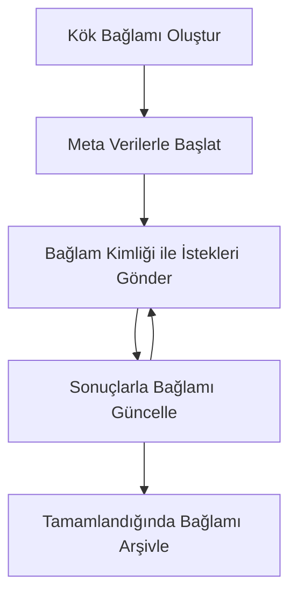

> [KULLANIM DIŞI: 2026-07-28 SÜRÜM ADAYI](https://blog.modelcontextprotocol.io/posts/2026-07-28-release-candidate/#roots-sampling-and-logging-are-deprecated)

# MCP Kök Bağlamlar

> **Kullanım dışı bildirim:** `2026-07-28` MCP spesifikasyon sürüm adayı, Kökleri araç parametreleri, kaynak URI'ları veya sunucu yapılandırması lehine kullanım dışı bırakıyor. Kökler `2025-11-25` sürümünde ve resmi kullanım dışı bildiriminden sonra en az bir yıl daha çalışmaya devam eder, bu yüzden bu dersteki her şey geçerlidir - ancak yeni sunucu tasarımları değiştirme modelini değerlendirmelidir. Bkz. [MCP’de Neler Değişiyor: 2026-07-28 Sürüm Adayı](../../01-CoreConcepts/mcp-2026-07-28-release-candidate.md).

Kök bağlamlar, birden çok istek ve oturum boyunca konuşma geçmişi ve paylaşılan durumu sürdürmek için kalıcı bir katman sağlayan Model Bağlam Protokolü'nün temel bir kavramıdır.

## Giriş

Bu derste, MCP'de kök bağlamların nasıl oluşturulacağını, yönetileceğini ve kullanılacağını keşfedeceğiz.

## Öğrenme Hedefleri

Dersin sonunda şunları yapabileceksiniz:

- Kök bağlamların amacını ve yapısını anlamak
- MCP istemci kitaplıklarını kullanarak kök bağlamlar oluşturmak ve yönetmek
- Kök bağlamları .NET, Java, JavaScript ve Python uygulamalarında uygulamak
- Çok turlu konuşmalar ve durum yönetimi için kök bağlamları kullanmak
- Kök bağlam yönetimi için en iyi uygulamaları uygulamak

## Kök Bağlamları Anlamak

Kök bağlamlar, bir dizi ilgili etkileşim için geçmişi ve durumu tutan konteynerler olarak hizmet eder. Şunları sağlarlar:

- **Konuşma Sürekliliği**: Tutarlı çok turlu konuşmaları sürdürmek
- **Bellek Yönetimi**: Etkileşimler arasında bilgiyi depolamak ve geri getirmek
- **Durum Yönetimi**: Karmaşık iş akışlarında ilerlemeyi takip etmek
- **Bağlam Paylaşımı**: Birden fazla istemcinin aynı konuşma durumuna erişmesini sağlamak

MCP'de kök bağlamların şu temel özellikleri vardır:

- Her kök bağlamın benzersiz bir kimliği vardır.
- Konuşma geçmişi, kullanıcı tercihleri ve diğer metadata içerebilirler.
- İhtiyaç duyulduğunda oluşturulabilir, erişilebilir ve arşivlenebilirler.
- Ayrıntılı erişim kontrolü ve izinleri desteklerler.

## Kök Bağlam Yaşam Döngüsü



## Kök Bağlamlarla Çalışma

İşte kök bağlamları oluşturma ve yönetme örneği.

### C# Uygulaması

```csharp
// .NET Example: Root Context Management
using Microsoft.Mcp.Client;
using System;
using System.Threading.Tasks;
using System.Collections.Generic;

public class RootContextExample
{
    private readonly IMcpClient _client;
    private readonly IRootContextManager _contextManager;
    
    public RootContextExample(IMcpClient client, IRootContextManager contextManager)
    {
        _client = client;
        _contextManager = contextManager;
    }
    
    public async Task DemonstrateRootContextAsync()
    {
        // 1. Create a new root context
        var contextResult = await _contextManager.CreateRootContextAsync(new RootContextCreateOptions
        {
            Name = "Customer Support Session",
            Metadata = new Dictionary<string, string>
            {
                ["CustomerName"] = "Acme Corporation",
                ["PriorityLevel"] = "High",
                ["Domain"] = "Cloud Services"
            }
        });
        
        string contextId = contextResult.ContextId;
        Console.WriteLine($"Created root context with ID: {contextId}");
        
        // 2. First interaction using the context
        var response1 = await _client.SendPromptAsync(
            "I'm having issues scaling my web service deployment in the cloud.", 
            new SendPromptOptions { RootContextId = contextId }
        );
        
        Console.WriteLine($"First response: {response1.GeneratedText}");
        
        // Second interaction - the model will have access to the previous conversation
        var response2 = await _client.SendPromptAsync(
            "Yes, we're using containerized deployments with Kubernetes.", 
            new SendPromptOptions { RootContextId = contextId }
        );
        
        Console.WriteLine($"Second response: {response2.GeneratedText}");
        
        // 3. Add metadata to the context based on conversation
        await _contextManager.UpdateContextMetadataAsync(contextId, new Dictionary<string, string>
        {
            ["TechnicalEnvironment"] = "Kubernetes",
            ["IssueType"] = "Scaling"
        });
        
        // 4. Get context information
        var contextInfo = await _contextManager.GetRootContextInfoAsync(contextId);
        
        Console.WriteLine("Context Information:");
        Console.WriteLine($"- Name: {contextInfo.Name}");
        Console.WriteLine($"- Created: {contextInfo.CreatedAt}");
        Console.WriteLine($"- Messages: {contextInfo.MessageCount}");
        
        // 5. When the conversation is complete, archive the context
        await _contextManager.ArchiveRootContextAsync(contextId);
        Console.WriteLine($"Archived context {contextId}");
    }
}
```

Önceki kodda şunları yaptık:

1. Bir müşteri destek oturumu için kök bağlam oluşturduk.
1. Modelin durumu koruyabilmesi için o bağlam içinde birden çok mesaj gönderdik.
1. Konuşmaya bağlı olarak bağlamı ilgili metadata ile güncelledik.
1. Konuşma geçmişini anlamak için bağlam bilgisini aldık.
1. Konuşma tamamlandığında bağlamı arşivledik.

## Örnek: Finansal analiz için Kök Bağlam Uygulaması

Bu örnekte, birkaç etkileşim boyunca durumu sürdürmeyi gösteren finansal analiz oturumu için bir kök bağlam oluşturacağız.

### Java Uygulaması

```java
// Java Örneği: Kök Bağlam Uygulaması
package com.example.mcp.contexts;

import com.mcp.client.McpClient;
import com.mcp.client.ContextManager;
import com.mcp.models.RootContext;
import com.mcp.models.McpResponse;

import java.util.HashMap;
import java.util.Map;
import java.util.UUID;

public class RootContextsDemo {
    private final McpClient client;
    private final ContextManager contextManager;
    
    public RootContextsDemo(String serverUrl) {
        this.client = new McpClient.Builder()
            .setServerUrl(serverUrl)
            .build();
            
        this.contextManager = new ContextManager(client);
    }
    
    public void demonstrateRootContext() throws Exception {
        // Bağlam meta verisi oluştur
        Map<String, String> metadata = new HashMap<>();
        metadata.put("projectName", "Financial Analysis");
        metadata.put("userRole", "Financial Analyst");
        metadata.put("dataSource", "Q1 2025 Financial Reports");
        
        // 1. Yeni bir kök bağlam oluştur
        RootContext context = contextManager.createRootContext("Financial Analysis Session", metadata);
        String contextId = context.getId();
        
        System.out.println("Created context: " + contextId);
        
        // 2. İlk etkileşim
        McpResponse response1 = client.sendPrompt(
            "Analyze the trends in Q1 financial data for our technology division",
            contextId
        );
        
        System.out.println("First response: " + response1.getGeneratedText());
        
        // 3. Yanıtla elde edilen önemli bilgilerle bağlamı güncelle
        contextManager.addContextMetadata(contextId, 
            Map.of("identifiedTrend", "Increasing cloud infrastructure costs"));
        
        // İkinci etkileşim - aynı bağlamı kullanarak
        McpResponse response2 = client.sendPrompt(
            "What's driving the increase in cloud infrastructure costs?",
            contextId
        );
        
        System.out.println("Second response: " + response2.getGeneratedText());
        
        // 4. Analiz oturumunun özetini oluştur
        McpResponse summaryResponse = client.sendPrompt(
            "Summarize our analysis of the technology division financials in 3-5 key points",
            contextId
        );
        
        // Özeti bağlam meta verisine kaydet
        contextManager.addContextMetadata(contextId, 
            Map.of("analysisSummary", summaryResponse.getGeneratedText()));
            
        // Güncellenmiş bağlam bilgisini al
        RootContext updatedContext = contextManager.getRootContext(contextId);
        
        System.out.println("Context Information:");
        System.out.println("- Created: " + updatedContext.getCreatedAt());
        System.out.println("- Last Updated: " + updatedContext.getLastUpdatedAt());
        System.out.println("- Analysis Summary: " + 
            updatedContext.getMetadata().get("analysisSummary"));
            
        // 5. İşlem tamamlandığında bağlamı arşivle
        contextManager.archiveContext(contextId);
        System.out.println("Context archived");
    }
}
```

Önceki kodda şunları yaptık:

1. Finansal analiz oturumu için bir kök bağlam oluşturduk.
2. Modelin durumu koruyabilmesi için o bağlam içinde birden çok mesaj gönderdik.
3. Konuşmaya bağlı olarak bağlamı ilgili metadata ile güncelledik.
4. Analiz oturumunun özetini oluşturarak bağlam metadata'sında sakladık.
5. Konuşma tamamlandığında bağlamı arşivledik.

## Örnek: Kök Bağlam Yönetimi

Kök bağlamları etkin bir şekilde yönetmek, konuşma geçmişi ve durumu sürdürmek için çok önemlidir. Aşağıda kök bağlam yönetiminin nasıl uygulanacağına dair bir örnek bulunmaktadır.

### JavaScript Uygulaması

```javascript
// JavaScript Örneği: MCP Kök Bağlamlarını Yönetme
const { McpClient, RootContextManager } = require('@mcp/client');

class ContextSession {
  constructor(serverUrl, apiKey = null) {
    // MCP istemcisini başlat
    this.client = new McpClient({
      serverUrl,
      apiKey
    });
    
    // Bağlam yöneticisini başlat
    this.contextManager = new RootContextManager(this.client);
  }
  
  /**
   * Create a new conversation context
   * @param {string} sessionName - Name of the conversation session
   * @param {Object} metadata - Additional metadata for the context
   * @returns {Promise<string>} - Context ID
   */
  async createConversationContext(sessionName, metadata = {}) {
    try {
      const contextResult = await this.contextManager.createRootContext({
        name: sessionName,
        metadata: {
          ...metadata,
          createdAt: new Date().toISOString(),
          status: 'active'
        }
      });
      
      console.log(`Created root context '${sessionName}' with ID: ${contextResult.id}`);
      return contextResult.id;
    } catch (error) {
      console.error('Error creating root context:', error);
      throw error;
    }
  }
  
  /**
   * Send a message in an existing context
   * @param {string} contextId - The root context ID
   * @param {string} message - The user's message
   * @param {Object} options - Additional options
   * @returns {Promise<Object>} - Response data
   */
  async sendMessage(contextId, message, options = {}) {
    try {
      // Belirtilen bağlamı kullanarak mesajı gönder
      const response = await this.client.sendPrompt(message, {
        rootContextId: contextId,
        temperature: options.temperature || 0.7,
        allowedTools: options.allowedTools || []
      });
      
      // İsteğe bağlı olarak, konuşmadan önemli çıkarımları sakla
      if (options.storeInsights) {
        await this.storeConversationInsights(contextId, message, response.generatedText);
      }
      
      return {
        message: response.generatedText,
        toolCalls: response.toolCalls || [],
        contextId
      };
    } catch (error) {
      console.error(`Error sending message in context ${contextId}:`, error);
      throw error;
    }
  }
  
  /**
   * Store important insights from a conversation
   * @param {string} contextId - The root context ID
   * @param {string} userMessage - User's message
   * @param {string} aiResponse - AI's response
   */
  async storeConversationInsights(contextId, userMessage, aiResponse) {
    try {
      // Olası çıkarımları çıkar (gerçek bir uygulamada bu daha sofistike olur)
      const combinedText = userMessage + "\n" + aiResponse;
      
      // Olası çıkarımları belirlemek için basit bir kestirim yöntemi
      const insightWords = ["important", "key point", "remember", "significant", "crucial"];
      
      const potentialInsights = combinedText
        .split(".")
        .filter(sentence => 
          insightWords.some(word => sentence.toLowerCase().includes(word))
        )
        .map(sentence => sentence.trim())
        .filter(sentence => sentence.length > 10);
      
      // Çıkarımları bağlam meta verilerinde sakla
      if (potentialInsights.length > 0) {
        const insights = {};
        potentialInsights.forEach((insight, index) => {
          insights[`insight_${Date.now()}_${index}`] = insight;
        });
        
        await this.contextManager.updateContextMetadata(contextId, insights);
        console.log(`Stored ${potentialInsights.length} insights in context ${contextId}`);
      }
    } catch (error) {
      console.warn('Error storing conversation insights:', error);
      // Kritik olmayan hata, sadece uyarı kaydı yap
    }
  }
  
  /**
   * Get summary information about a context
   * @param {string} contextId - The root context ID
   * @returns {Promise<Object>} - Context information
   */
  async getContextInfo(contextId) {
    try {
      const contextInfo = await this.contextManager.getContextInfo(contextId);
      
      return {
        id: contextInfo.id,
        name: contextInfo.name,
        created: new Date(contextInfo.createdAt).toLocaleString(),
        lastUpdated: new Date(contextInfo.lastUpdatedAt).toLocaleString(),
        messageCount: contextInfo.messageCount,
        metadata: contextInfo.metadata,
        status: contextInfo.status
      };
    } catch (error) {
      console.error(`Error getting context info for ${contextId}:`, error);
      throw error;
    }
  }
  
  /**
   * Generate a summary of the conversation in a context
   * @param {string} contextId - The root context ID
   * @returns {Promise<string>} - Generated summary
   */
  async generateContextSummary(contextId) {
    try {
      // Modelden şu ana kadar olan konuşmanın özetini oluşturmasını iste
      const response = await this.client.sendPrompt(
        "Please summarize our conversation so far in 3-4 sentences, highlighting the main points discussed.",
        { rootContextId: contextId, temperature: 0.3 }
      );
      
      // Özeti bağlam meta verilerinde sakla
      await this.contextManager.updateContextMetadata(contextId, {
        conversationSummary: response.generatedText,
        summarizedAt: new Date().toISOString()
      });
      
      return response.generatedText;
    } catch (error) {
      console.error(`Error generating context summary for ${contextId}:`, error);
      throw error;
    }
  }
  
  /**
   * Archive a context when it's no longer needed
   * @param {string} contextId - The root context ID
   * @returns {Promise<Object>} - Result of the archive operation
   */
  async archiveContext(contextId) {
    try {
      // Arşivlemeden önce son bir özet oluştur
      const summary = await this.generateContextSummary(contextId);
      
      // Bağlamı arşivle
      await this.contextManager.archiveContext(contextId);
      
      return {
        status: "archived",
        contextId,
        summary
      };
    } catch (error) {
      console.error(`Error archiving context ${contextId}:`, error);
      throw error;
    }
  }
}

// Örnek kullanım
async function demonstrateContextSession() {
  const session = new ContextSession('https://mcp-server-example.com');
  
  try {
    // 1. Ürün destek konuşması için yeni bir bağlam oluştur
    const contextId = await session.createConversationContext(
      'Product Support - Database Performance',
      {
        customer: 'Globex Corporation',
        product: 'Enterprise Database',
        severity: 'Medium',
        supportAgent: 'AI Assistant'
      }
    );
    
    // 2. Konuşmadaki ilk mesaj
    const response1 = await session.sendMessage(
      contextId,
      "I'm experiencing slow query performance on our database cluster after the latest update.",
      { storeInsights: true }
    );
    console.log('Response 1:', response1.message);
    
    // Aynı bağlamda takip mesajı
    const response2 = await session.sendMessage(
      contextId,
      "Yes, we've already checked the indexes and they seem to be properly configured.",
      { storeInsights: true }
    );
    console.log('Response 2:', response2.message);
    
    // 3. Bağlam hakkında bilgi al
    const contextInfo = await session.getContextInfo(contextId);
    console.log('Context Information:', contextInfo);
    
    // 4. Konuşma özetini oluştur ve göster
    const summary = await session.generateContextSummary(contextId);
    console.log('Conversation Summary:', summary);
    
    // 5. İşlem tamamlandığında bağlamı arşivle
    const archiveResult = await session.archiveContext(contextId);
    console.log('Archive Result:', archiveResult);
    
    // 6. Herhangi bir hatayı zarifçe ele al
  } catch (error) {
    console.error('Error in context session demonstration:', error);
  }
}

demonstrateContextSession();
```

Önceki kodda şunları yaptık:

1. `createConversationContext` fonksiyonu ile veri tabanı performans sorunlarıyla ilgili bir ürün destek konuşması için kök bağlam oluşturduk.

1. `sendMessage` fonksiyonunu kullanarak o bağlam içinde yavaş sorgu performansı ve indeks yapılandırması hakkında birden çok mesaj gönderdik, böylece model durumu koruyabildi.

1. Konuşmaya bağlı olarak bağlamı ilgili metadata ile güncelledik.

1. `generateContextSummary` fonksiyonu ile konuşmanın özetini oluşturarak bağlam metadata'sında sakladık.

1. `archiveContext` fonksiyonu ile konuşma tamamlandığında bağlamı arşivledik.

1. Hataları nazikçe yöneterek sağlamlığı sağladık.

## Çok Turlu Yardım için Kök Bağlam

Bu örnekte, çok turlu yardım oturumu için bir kök bağlam oluşturacağız ve birden fazla etkileşim boyunca durumu nasıl sürdüreceğimizi göstereceğiz.

### Python Uygulaması

```python
# Python Örneği: Çok Turlu Yardım için Kök Bağlam
import asyncio
from datetime import datetime
from mcp_client import McpClient, RootContextManager

class AssistantSession:
    def __init__(self, server_url, api_key=None):
        self.client = McpClient(server_url=server_url, api_key=api_key)
        self.context_manager = RootContextManager(self.client)
    
    async def create_session(self, name, user_info=None):
        """Create a new root context for an assistant session"""
        metadata = {
            "session_type": "assistant",
            "created_at": datetime.now().isoformat(),
        }
        
        # Sağlanmışsa kullanıcı bilgilerini ekle
        if user_info:
            metadata.update({f"user_{k}": v for k, v in user_info.items()})
            
        # Kök bağlamı oluştur
        context = await self.context_manager.create_root_context(name, metadata)
        return context.id
    
    async def send_message(self, context_id, message, tools=None):
        """Send a message within a root context"""
        # Bağlam kimliği ile seçenekleri oluştur
        options = {
            "root_context_id": context_id
        }
        
        # Belirtilmişse araçları ekle
        if tools:
            options["allowed_tools"] = tools
        
        # İsteği bağlam içinde gönder
        response = await self.client.send_prompt(message, options)
        
        # Konuşma ilerlemesi ile bağlam meta verilerini güncelle
        await self.context_manager.update_context_metadata(
            context_id,
            {
                f"message_{datetime.now().timestamp()}": message[:50] + "...",
                "last_interaction": datetime.now().isoformat()
            }
        )
        
        return response
    
    async def get_conversation_history(self, context_id):
        """Retrieve conversation history from a context"""
        context_info = await self.context_manager.get_context_info(context_id)
        messages = await self.client.get_context_messages(context_id)
        
        return {
            "context_info": context_info,
            "messages": messages
        }
    
    async def end_session(self, context_id):
        """End an assistant session by archiving the context"""
        # Öncelikle bir özet istemi oluştur
        summary_response = await self.client.send_prompt(
            "Please summarize our conversation and any key points or decisions made.",
            {"root_context_id": context_id}
        )
        
        # Özeti meta verilere kaydet
        await self.context_manager.update_context_metadata(
            context_id,
            {
                "summary": summary_response.generated_text,
                "ended_at": datetime.now().isoformat(),
                "status": "completed"
            }
        )
        
        # Bağlamı arşivle
        await self.context_manager.archive_context(context_id)
        
        return {
            "status": "completed",
            "summary": summary_response.generated_text
        }

# Örnek kullanım
async def demo_assistant_session():
    assistant = AssistantSession("https://mcp-server-example.com")
    
    # 1. Oturum oluştur
    context_id = await assistant.create_session(
        "Technical Support Session",
        {"name": "Alex", "technical_level": "advanced", "product": "Cloud Services"}
    )
    print(f"Created session with context ID: {context_id}")
    
    # 2. İlk etkileşim
    response1 = await assistant.send_message(
        context_id, 
        "I'm having trouble with the auto-scaling feature in your cloud platform.",
        ["documentation_search", "diagnostic_tool"]
    )
    print(f"Response 1: {response1.generated_text}")
    
    # Aynı bağlamdaki ikinci etkileşim
    response2 = await assistant.send_message(
        context_id,
        "Yes, I've already checked the configuration settings you mentioned, but it's still not working."
    )
    print(f"Response 2: {response2.generated_text}")
    
    # 3. Geçmişi al
    history = await assistant.get_conversation_history(context_id)
    print(f"Session has {len(history['messages'])} messages")
    
    # 4. Oturumu sonlandır
    end_result = await assistant.end_session(context_id)
    print(f"Session ended with summary: {end_result['summary']}")

if __name__ == "__main__":
    asyncio.run(demo_assistant_session())
```

Önceki kodda şunları yaptık:

1. `create_session` fonksiyonu ile kullanıcı bilgileri (isim, teknik seviye gibi) içeren teknik destek oturumu için kök bağlam oluşturduk.

1. `send_message` fonksiyonunu kullanarak o bağlam içinde otomatik ölçeklendirme özelliği ile ilgili sorunlara dair birden fazla mesaj gönderdik, böylece model durumu koruyabildi.

1. `get_conversation_history` fonksiyonuyla konuşma geçmişini alarak bağlam bilgisi ve mesajlara eriştik.

1. `end_session` fonksiyonunu kullanarak bağlamı arşivleyip bir özet oluşturarak oturumu sonlandırdık. Özet konuşmadan önemli noktaları yakalar.

## Kök Bağlam En İyi Uygulamaları

İşte kök bağlamları etkili yönetmek için bazı en iyi uygulamalar:

- **Odaklanmış Bağlamlar Oluşturun**: Farklı konuşma amaçları veya alanları için ayrı kök bağlamlar oluşturarak açıklık sağlayın.

- **Süre Sonu Politikaları Belirleyin**: Eski bağlamları arşivlemek veya silmek için politikalar uygulayarak depolamayı yönetip veri saklama politikalarına uyun.

- **İlgili Metadata Saklayın**: Konuşmayla ilgili önemli bilgileri daha sonra kullanılmak üzere bağlam metadata'sında tutun.

- **Bağlam Kimliklerini Tutarlı Kullanın**: Bir bağlam oluşturulduktan sonra, sürekliliği sağlamak için tüm ilişkili isteklerde kimliğini tutarlı şekilde kullanın.

- **Özetler Oluşturun**: Bir bağlam büyüdüğünde, boyutu yönetirken temel bilgileri yakalamak için özetler oluşturmayı düşünün.

- **Erişim Kontrolü Uygulayın**: Çok kullanıcı sistemlerinde konuşma bağlamlarının gizliliğini ve güvenliğini sağlamak için uygun erişim kontrolleri kurun.

- **Bağlam Kısıtlamalarını Yönetin**: Bağlam boyutu kısıtlamalarının farkında olun ve çok uzun konuşmalar için stratejiler uygulayın.

- **Konuşma Tamamlandığında Arşivleyin**: Kaynakları serbest bırakmak ve konuşma geçmişini korumak için konuşma tamamlandığında bağlamları arşivleyin.

## Sonraki Ne Var

- [5.5 Yönlendirme](../mcp-routing/README.md)

---

<!-- CO-OP TRANSLATOR DISCLAIMER START -->
**Feragatname**:
Bu belge, AI çeviri hizmeti [Co-op Translator](https://github.com/Azure/co-op-translator) kullanılarak çevrilmiştir. Doğruluk için çaba sarf etsek de, otomatik çevirilerin hata veya yanlışlık içerebileceğini lütfen unutmayınız. Orijinal belge, kendi dilinde yetkili kaynak olarak kabul edilmelidir. Kritik bilgiler için profesyonel insan çevirisi önerilir. Bu çevirinin kullanımı sonucu ortaya çıkabilecek yanlış anlamalardan veya yanlış yorumlamalardan sorumlu değiliz.
<!-- CO-OP TRANSLATOR DISCLAIMER END -->