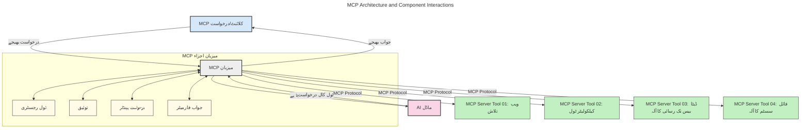
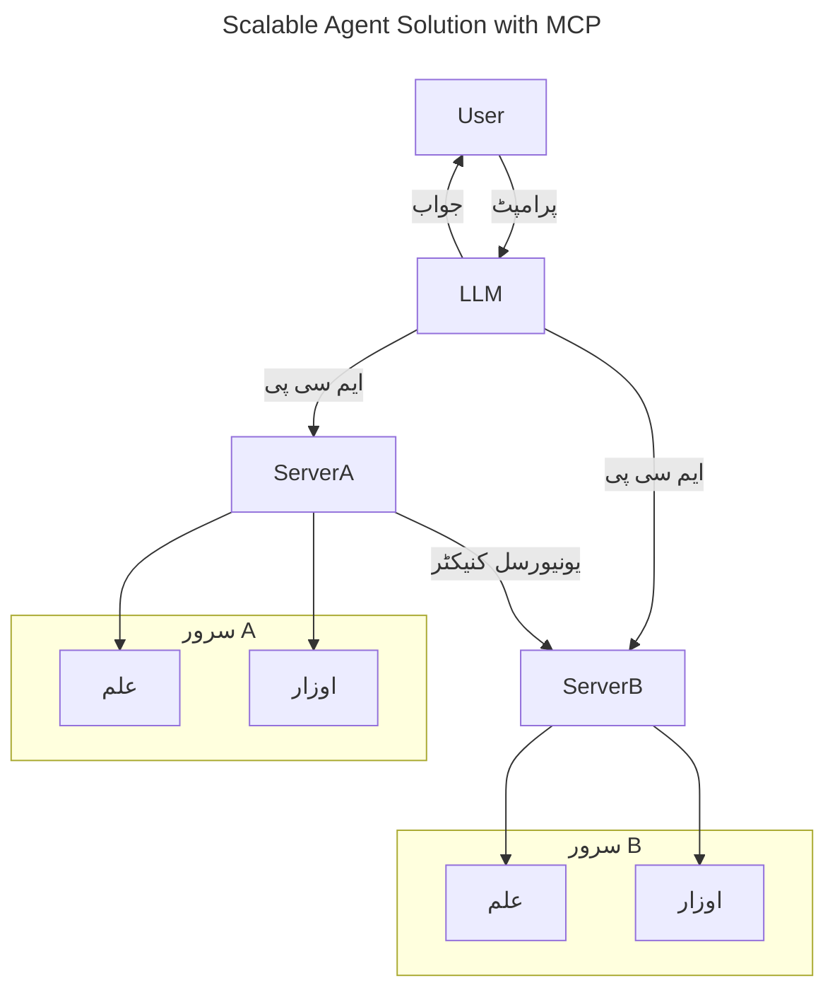
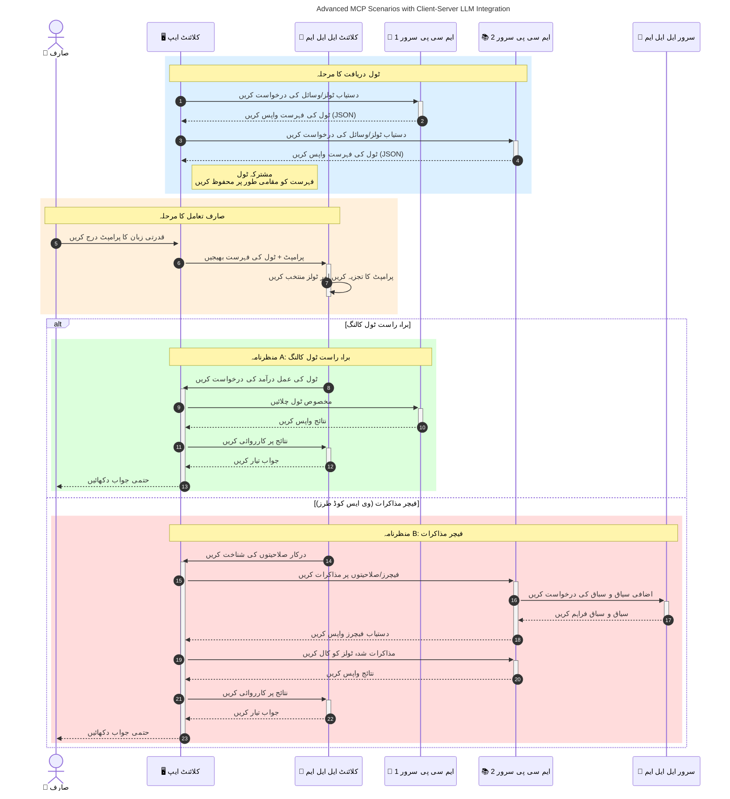

# ماڈل کانٹیکسٹ پروٹوکول (MCP) کا تعارف: اسکیل ایبل AI ایپلیکیشنز کے لیے کیوں اہم ہے

_(اس سبق کی ویڈیو دیکھنے کے لیے اوپر تصویر پر کلک کریں)_

جنریٹیو AI ایپلیکیشنز ایک بہت بڑا قدم ہیں کیونکہ یہ اکثر صارف کو قدرتی زبان کے پرامپٹس سے ایپ کے ساتھ بات چیت کرنے دیتے ہیں۔ تاہم، جیسے جیسے ایسی ایپس میں زیادہ وقت اور وسائل لگتے ہیں، آپ یہ یقینی بنانا چاہتے ہیں کہ آپ فنکشنز اور وسائل کو اس طرح آسانی سے ضم کر سکیں کہ اسے بڑھانا آسان ہو، آپ کی ایپ ایک سے زیادہ ماڈلز کو استعمال کر سکے، اور مختلف ماڈل کی پیچیدگیوں کو سنبھال سکے۔ مختصراً، جن AI ایپس بنانا شروع میں آسان ہے، لیکن جب یہ بڑھتی ہیں اور پیچیدہ ہوتی ہیں تو آپ کو ایک فن تعمیر کی وضاحت شروع کرنی ہوگی اور غالباً آپ کو ایک معیاری اصول پر انحصار کرنا ہوگا تاکہ آپ کی ایپس مستقل طریقے سے بنائی جائیں۔ یہاں MCP آتا ہے جو چیزوں کو منظم کرتا ہے اور ایک معیار فراہم کرتا ہے۔

---

## **🔍 ماڈل کانٹیکسٹ پروٹوکول (MCP) کیا ہے؟**

**ماڈل کانٹیکسٹ پروٹوکول (MCP)** ایک **کھلا، معیاری انٹرفیس** ہے جو بڑے زبان کے ماڈلز (LLMs) کو بیرونی آلات، APIs، اور ڈیٹا ذرائع کے ساتھ بغیر رکاوٹ بات چیت کرنے کی اجازت دیتا ہے۔ یہ AI ماڈل کی فعالیت کو ان کے تربیتی ڈیٹا سے آگے بڑھانے کے لیے ایک مستقل فن تعمیر فراہم کرتا ہے، اس طرح زیادہ ذہین، اسکیل ایبل، اور زیادہ جواب دہ AI سسٹمز ممکن بناتا ہے۔

---

## **🎯 AI میں معیاری بنانے کی اہمیت**

جیسا کہ جنریٹیو AI ایپلیکیشنز زیادہ پیچیدہ ہوتی جارہی ہیں، ضروری ہے کہ ایسے معیار اپنائے جائیں جو **اسکیل ایبلٹی، وسعت پذیری، قابلِ دیکھ بھال ہونا،** اور **وینڈر لاک-ان سے بچاؤ** کو یقینی بنائیں۔ MCP ان ضروریات کو پورا کرتا ہے:

- ماڈل-آلات انضمام کو یکجا کرنا
- کمزور، ایک وقت کے لیے بنائے گئے کسٹم حل کی کمی کرنا
- مختلف وینڈرز کے متعدد ماڈلز کو ایک ماحولیاتی نظام میں بقائے باہمی کی اجازت دینا

**نوٹ:** اگرچہ MCP خود کو ایک کھلا معیار ظاہر کرتا ہے، اس کو IEEE، IETF، W3C، ISO، یا کسی اور معیاری ادارے کے ذریعے معیاری بنانے کا کوئی منصوبہ نہیں ہے۔

---

## **📚 سیکھنے کے مقاصد**

اس مضمون کے آخر تک، آپ قابل ہوں گے:

- **ماڈل کانٹیکسٹ پروٹوکول (MCP)** اور اس کے استعمال کے کیسز کی تعریف کریں
- سمجھیں کہ MCP ماڈل سے ٹولز کی کمیونیکیشن کو کیسے معیاری بناتا ہے
- MCP فن تعمیر کے بنیادی اجزاء کی شناخت کریں
- MCP کے صنعتی اور ترقیاتی سیاق و سباق میں حقیقی دنیا کے استعمالات کو دریافت کریں

---

## **💡 ماڈل کانٹیکسٹ پروٹوکول (MCP) کیوں ایک گیم چینجر ہے**

### **🔗 MCP AI تعاملات میں ٹوٹ پھوٹ کو حل کرتا ہے**

MCP سے پہلے، ماڈلز کو ٹولز کے ساتھ ضم کرنے کے لیے ضروری تھا:

- ہر ٹول-ماڈل جوڑی کے لیے کسٹم کوڈ
- ہر وینڈر کے لیے غیر معیاری APIs
- اپڈیٹس کی وجہ سے بار بار توڑ پھوڑ
- زیادہ ٹولز کے ساتھ ناقص اسکیل ایبلٹی

### **✅ MCP معیاری بنانے کے فوائد**

| **فائدہ**               | **تفصیل**                                                                 |
|-------------------------|---------------------------------------------------------------------------|
| انٹرآپریبلٹی              | LLMs مختلف وینڈرز کے ٹولز کے ساتھ بغیر رکاوٹ کام کرتے ہیں                   |
| مستقل مزاجی              | پلیٹ فارمز اور ٹولز میں یکساں رویہ                                          |
| دوبارہ استعمال           | ایک بار بنائے گئے ٹولز کو مختلف پروجیکٹس اور سسٹمز میں استعمال کیا جا سکتا ہے |
| تیز تر ڈویلپمنٹ          | معیاری، پلگ اینڈ پلے انٹرفیسز استعمال کرکے ترقیاتی وقت کو کم کریں             |

---

## **🧱 اعلی سطحی MCP فن تعمیر کا جائزہ**

MCP ایک **کلائنٹ-سرور ماڈل** کی پیروی کرتا ہے، جہاں:

- **MCP ہوسٹس** AI ماڈلز چلاتے ہیں
- **MCP کلائنٹس** درخواستیں شروع کرتے ہیں
- **MCP سرورز** کانٹیکسٹ، ٹولز، اور صلاحیتیں فراہم کرتے ہیں

### **اہم اجزاء:**

- **وسائل** – ماڈلز کے لیے جامد یا متحرک ڈیٹا  
- **پرامپٹس** – ہدایت شدہ تخلیق کے لیے پہلے سے طے شدہ ورک فلو  
- **ٹولز** – قابلِ عمل فنکشنز جیسے تلاش، حساب کتاب  
- **نمونہ سازی** – ایجنٹک برتاؤ بذریعہ باقاعدہ تعاملات (2026-07-28 ریلیز امیدوار میں منسوخ)  
- **حاصل کرنا** – صارف کی معلومات کے لیے سرور کی جانب سے درخواستیں  
- **روٹس** – سرور کے رسائی کنٹرول کے لیے فائل سسٹم کی حدیں (2026-07-28 ریلیز امیدوار میں منسوخ)  

### **پروٹوکول فن تعمیر:**

MCP دو سطحی فن تعمیر استعمال کرتا ہے:
- **ڈیٹا لیئر**: JSON-RPC 2.0 پر مبنی کمیونیکیشن جس میں لائف سائیکل مینجمنٹ اور بنیادیات شامل ہیں
- **ٹرانسپورٹ لیئر**: STDIO (مقامی) اور Streamable HTTP کے ساتھ SSE (دور دراز) کمیونیکیشن چینلز

---

## MCP سرورز کیسے کام کرتے ہیں

MCP سرورز درج ذیل طریقے سے کام کرتے ہیں:

- **درخواست کی روانی**:
    1. ایک درخواست کو آخری صارف یا ان کی طرف سے کام کرنے والے سافٹ ویئر کی جانب سے شروع کیا جاتا ہے۔
    2. **MCP کلائنٹ** درخواست کو ایک **MCP ہوسٹ** کو بھیجتا ہے، جو AI ماڈل رن ٹائم کو منظم کرتا ہے۔
    3. **AI ماڈل** صارف کے پرامپٹ کو وصول کرتا ہے اور ایک یا زیادہ ٹول کالز کے ذریعے بیرونی ٹولز یا ڈیٹا تک رسائی کی درخواست کر سکتا ہے۔
    4. **MCP ہوسٹ**، ماڈل کے براہ راست نہیں، معیاری پروٹوکول استعمال کرتے ہوئے متعلقہ **MCP سرور(ز)** کے ساتھ بات چیت کرتا ہے۔
- **MCP ہوسٹ کی فعالیت**:
    - **ٹول رجسٹری**: دستیاب ٹولز اور ان کی صلاحیتوں کا کیٹلاگ رکھتا ہے۔
    - **تصدیق**: ٹول تک رسائی کی اجازت کی تصدیق کرتا ہے۔
    - **درخواست ہینڈلر**: ماڈل سے آنے والی ٹول درخواستوں کو پروسیس کرتا ہے۔
    - **ردعمل فارمیٹر**: ٹول کے نتائج کو ماڈل کے سمجھنے کے لیے ساخت دیتا ہے۔
- **MCP سرور کی عملدرآمد**:
    - **MCP ہوسٹ** ٹول کالز کو ایک یا زیادہ **MCP سرورز** کو روانہ کرتا ہے، ہر ایک مخصوص فنکشنز (جیسے تلاش، حساب کتاب، ڈیٹا بیس کوئریز) فراہم کرتا ہے۔
    - **MCP سرورز** متعلقہ آپریشنز انجام دیتے ہیں اور نتائج کو مستقل فارمیٹ میں **MCP ہوسٹ** کو واپس کرتے ہیں۔
    - **MCP ہوسٹ** ان نتائج کی فارمیٹنگ اور ترسیل کرتا ہے **AI ماڈل** کو۔
- **ردعمل کی تکمیل**:
    - **AI ماڈل** ٹول آؤٹ پٹس کو حتمی جواب میں شامل کرتا ہے۔
    - **MCP ہوسٹ** یہ جواب واپس **MCP کلائنٹ** کو بھیجتا ہے، جو اسے آخری صارف یا کال کرنے والے سافٹ ویئر کو فراہم کرتا ہے۔
    

## 👨‍💻 MCP سرور کیسے بنائیں (مثالوں کے ساتھ)

MCP سرورز آپ کو LLM صلاحیتوں کو بڑھانے کی اجازت دیتے ہیں، ڈیٹا اور فعالیت فراہم کر کے۔

تجربہ کرنا چاہیں؟ یہاں مخصوص زبان اور/یا اسٹیک کے SDKs دیے گئے ہیں جن کے ساتھ مختلف زبانوں/اسٹیکس میں سادہ MCP سرور بنانے کی مثالیں موجود ہیں:

- **Python SDK**: https://github.com/modelcontextprotocol/python-sdk

- **TypeScript SDK**: https://github.com/modelcontextprotocol/typescript-sdk

- **Java SDK**: https://github.com/modelcontextprotocol/java-sdk

- **C#/.NET SDK**: https://github.com/modelcontextprotocol/csharp-sdk

## 🌍 MCP کے حقیقی دنیا کے استعمالات

MCP AI صلاحیتوں کو بڑھانے سے وسیع پیمانے پر ایپلیکیشنز کو ممکن بناتا ہے:

| **ایپلیکیشن**                 | **تفصیل**                                                                |
|------------------------------|--------------------------------------------------------------------------|
| انٹرپرائز ڈیٹا انٹیگریشن    | LLMs کو ڈیٹا بیسز، CRMs، یا اندرونی ٹولز سے منسلک کرنا                     |
| ایجنٹک AI سسٹمز             | خود مختار ایجنٹس کو ٹول رسائی اور فیصلہ سازی ورک فلو کے ساتھ قابل بنانا  |
| کثیر الوضعی ایپلیکیشنز      | ایک ہی متحد AI ایپ میں متن، تصویر، اور آڈیو ٹولز کو یکجا کرنا              |
| حقیقی وقت کی ڈیٹا انٹیگریشن  | AI تعاملات میں زندہ ڈیٹا لانا تاکہ زیادہ درست، حالیہ نتائج مل سکیں       |

### 🧠 MCP = AI تعاملات کے لیے عالمگیر معیار

ماڈل کانٹیکسٹ پروٹوکول (MCP) AI تعاملات کے لیے ایک عالمگیر معیار کے طور پر کام کرتا ہے، جیسا کہ USB-C نے آلات کے لیے جسمانی کنکشنز کا معیار بنایا۔ AI کی دنیا میں، MCP ایک مستقل انٹرفیس فراہم کرتا ہے، جو ماڈلز (کلائنٹس) کو بیرونی ٹولز اور ڈیٹا فراہم کرنے والوں (سرورز) کے ساتھ بغیر رکاوٹ ضم ہونے دیتا ہے۔ یہ ہر API یا ڈیٹا ذرائع کے لیے مختلف، حسب ضرورت پروٹوکول کی ضرورت کو ختم کرتا ہے۔

MCP کے تحت، ایک MCP ہم آہنگ ٹول (جسے MCP سرور کہا جاتا ہے) ایک متحد معیاری کی پابندی کرتا ہے۔ یہ سرورز فراہم کردہ ٹولز یا اعمال کی فہرست بنا سکتے ہیں اور AI ایجنٹ کے درخواست کرنے پر ان اعمال کو انجام دیتے ہیں۔ AI ایجنٹ پلیٹ فارمز جو MCP کو سپورٹ کرتے ہیں، سرورز سے دستیاب ٹولز دریافت کرنے اور انہیں اس معیاری پروٹوکول کے ذریعہ کال کرنے کے قابل ہیں۔

### 💡 علم تک رسائی کو آسان بناتا ہے

صرف ٹولز فراہم کرنے کے علاوہ، MCP علم تک رسائی کو بھی آسان بناتا ہے۔ یہ ایپلیکیشنز کو بڑے زبان کے ماڈلز (LLMs) کو مختلف ڈیٹا ذرائع سے منسلک کرکے کانٹیکسٹ فراہم کرنے کی اجازت دیتا ہے۔ مثال کے طور پر، ایک MCP سرور کمپنی کے دستاویزات کے ذخیرے کی نمائندگی کر سکتا ہے، جو ایجنٹس کو مطالبہ پر متعلقہ معلومات بازیافت کرنے دیتا ہے۔ ایک اور سرور مخصوص اعمال سنبھال سکتا ہے جیسے ای میل بھیجنا یا ریکارڈز اپ ڈیٹ کرنا۔ ایجنٹ کے نقطہ نظر سے، یہ صرف ٹولز ہیں جنہیں وہ استعمال کر سکتے ہیں — کچھ ٹولز ڈیٹا (علم کا کانٹیکسٹ) واپس کرتے ہیں، جبکہ دوسرے اعمال انجام دیتے ہیں۔ MCP دونوں کو مؤثر طریقے سے منظم کرتا ہے۔

ایک ایجنٹ جو MCP سرور سے جڑتا ہے خود بخود سرور کی دستیاب صلاحیتوں اور قابل رسائی ڈیٹا کو ایک معیاری فارمیٹ کے ذریعے سیکھ لیتا ہے۔ یہ معیاری بنانے سے متحرک ٹول کی دستیابی ممکن ہوتی ہے۔ مثال کے طور پر، ایک نئے MCP سرور کو ایجنٹ کے نظام میں شامل کرنا اس کے فنکشنز کو فوری طور پر قابل استعمال بنا دیتا ہے بغیر ایجنٹ کی ہدایات میں مزید تخصیص کے۔

یہ آسان انضمام درج ذیل خاکے میں دکھائے گئے بہاؤ کے مطابق ہے، جہاں سرورز ٹولز اور علم دونوں فراہم کرتے ہیں، سسٹمز کے درمیان بغیر رکاوٹ تعاون کو یقینی بناتے ہیں۔

### 👉 مثال: اسکیل ایبل ایجنٹ حل

 یونیورسل کنیکٹر MCP سرورز کو ایک دوسرے کے ساتھ بات چیت اور صلاحیتوں کا اشتراک کرنے کے قابل بناتا ہے، جس سے ServerA کو ServerB کو کام سونپنے یا اس کے ٹولز اور علم تک رسائی حاصل کرنے کی اجازت ملتی ہے۔ یہ سرورز کے درمیان ٹولز اور ڈیٹا کی وفاقیت کرتا ہے، اسکیل ایبل اور ماڈیولر ایجنٹ فن تعمیر کی حمایت کرتا ہے۔ چونکہ MCP ٹول نمائش کو معیاری بناتا ہے، ایجنٹس بغیر سخت کوڈ کی گئی انضمامات کے سرورز کے درمیان درخواستیں متحرک طور پر دریافت اور راستہ بنا سکتے ہیں۔

ٹول اور علم کی وفاقیت: سرورز کے درمیان ٹولز اور ڈیٹا تک رسائی ممکن بناتا ہے، جو زیادہ اسکیل ایبل اور ماڈیولر ایجنٹ فن تعمیر کی اجازت دیتا ہے۔

### 🔄 کلائنٹ-سائیڈ LLM انضمام کے ساتھ اعلیٰ درجے کے MCP منظرنامے

بنیادی MCP فن تعمیر کے علاوہ، ایسے اعلیٰ درجے کے منظرنامے ہیں جہاں کلائنٹ اور سرور دونوں میں LLMs شامل ہوتے ہیں، جو زیادہ پیچیدہ تعاملات کو ممکن بناتے ہیں۔ درج ذیل خاکے میں، **کلائنٹ ایپ** ایک IDE ہو سکتی ہے جس میں LLM کے استعمال کے لیے متعدد MCP ٹولز دستیاب ہوں:

## 🔐 MCP کے عملی فوائد

MCP استعمال کرنے کے یہاں عملی فوائد ہیں:

- **تازگی**: ماڈلز اپنے تربیتی ڈیٹا سے آگے تازہ ترین معلومات تک رسائی حاصل کر سکتے ہیں
- **صلاحیت کی توسیع**: ماڈلز مخصوص ٹاسک کے لیے ماہر ٹولز کا فائدہ اٹھا سکتے ہیں جن کے لیے وہ تربیت یافتہ نہیں تھے
- **کم ہالوسینیشنز**: بیرونی ڈیٹا ذرائع حقائق کی بنیاد فراہم کرتے ہیں
- **پرائیویسی**: حساس ڈیٹا محفوظ ماحول میں رہ سکتا ہے بجائے اس کے کہ پرامپٹس میں شامل ہو

## 📌 کلیدی نکات

MCP استعمال کرنے کے لیے درج ذیل کلیدی نکات ہیں:

- **MCP** AI ماڈلز کے ٹولز اور ڈیٹا کے ساتھ تعامل کی معیاری بناتا ہے
- وسعت پذیری، مستقل مزاجی، اور انٹرآپریبلٹی کو فروغ دیتا ہے
- MCP ترقیاتی وقت کو کم کرتا ہے، بھروسے مندی کو بہتر بناتا ہے، اور ماڈل کی صلاحیتوں کو بڑھاتا ہے
- کلائنٹ-سرور فن تعمیر لچکدار، وسعت پذیر AI ایپلیکیشنز کو ممکن بناتا ہے

## 🧠 مشق

اس AI ایپلیکیشن کے بارے میں سوچیں جسے آپ بنانا چاہتے ہیں۔

- کون سے **بیرونی ٹولز یا ڈیٹا** اس کی صلاحیتوں کو بڑھا سکتے ہیں؟
- MCP انضمام کو **آسان اور قابلِ اعتماد** کیسے بنا سکتا ہے؟

## اضافی وسائل

- [MCP GitHub ریپوزیٹری](https://github.com/modelcontextprotocol)

## آگے کیا ہے

اگلا: [باب 1: بنیادی تصورات](../01-CoreConcepts/README.md)

---

<!-- CO-OP TRANSLATOR DISCLAIMER START -->
**ڈس کلیمر**:
یہ دستاویز AI ترجمہ سروس [Co-op Translator](https://github.com/Azure/co-op-translator) کے ذریعے ترجمہ کی گئی ہے۔ جبکہ ہم درستگی کے لیے کوشاں ہیں، براہ کرم اس بات سے آگاہ رہیں کہ خودکار ترجمے میں غلطیاں یا عدم درستیاں ہو سکتی ہیں۔ اصل دستاویز اپنے مادری زبان میں مستند ماخذ سمجھی جائے گی۔ حساس معلومات کے لیے پیشہ ور انسانی ترجمہ کی سفارش کی جاتی ہے۔ اس ترجمے کے استعمال سے پیدا ہونے والی کسی بھی غلط فہمی یا غلط تشریح کی ذمہ داری ہم قبول نہیں کرتے۔
<!-- CO-OP TRANSLATOR DISCLAIMER END -->