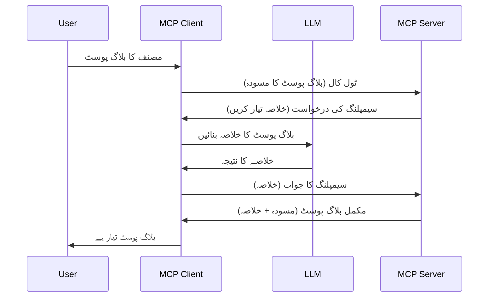

> [متروک: 2026-07-28 ریلیز کینڈیڈیٹ](https://blog.modelcontextprotocol.io/posts/2026-07-28-release-candidate/)

# سیمپلنگ - کلائنٹ کو خصوصیات تفویض کریں

> **متروک ہونے کا نوٹس:** `2026-07-28` MCP وضاحت ریلیز کینڈیڈیٹ سیمپلنگ کو LLM فراہم کنندہ APIs کے ساتھ براہ راست انضمام کی حمایت میں متروک قرار دیتا ہے۔ سیمپلنگ `2025-11-25` میں کام کرتی رہتی ہے اور کسی بھی رسمی متروکی کے بعد کم از کم ایک سال تک کام کرے گی، لہٰذا اس سبق کی تمام باتیں درست رہتی ہیں — لیکن نئے سرور ڈیزائنز کو متبادل نمونہ کا جائزہ لینا چاہیے۔ دیکھیں [MCP میں کیا تبدیلی آ رہی ہے: 2026-07-28 ریلیز کینڈیڈیٹ](../../01-CoreConcepts/mcp-2026-07-28-release-candidate.md)۔

بعض اوقات، آپ کو MCP کلائنٹ اور MCP سرور کو ایک مشترکہ مقصد کے لیے تعاون کرنا پڑتا ہے۔ ایسا کیس ہو سکتا ہے جہاں سرور کو ایسے LLM کی مدد چاہیے جو کلائنٹ پر موجود ہو۔ اس صورتحال کے لیے، آپ کو سیمپلنگ استعمال کرنی چاہیے۔

آئیے کچھ استعمال کے معاملات دیکھتے ہیں اور سیمپلنگ پر مبنی حل بنانے کا طریقہ سمجھتے ہیں۔

## جائزہ

اس سبق میں، ہم سیمپلنگ کب اور کہاں استعمال کریں اور اسے کیسے ترتیب دیں، اس پر توجہ دیں گے۔

## سیکھنے کے مقاصد

اس باب میں، ہم:

- سیمپلنگ کیا ہے اور اسے کب استعمال کریں، وضاحت کریں گے۔
- MCP میں سیمپلنگ کو کیسے ترتیب دیا جائے، دکھائیں گے۔
- سیمپلنگ کی عملی مثالیں فراہم کریں گے۔

## سیمپلنگ کیا ہے اور اسے کیوں استعمال کریں؟

سیمپلنگ ایک اعلیٰ خصوصیت ہے جو درج ذیل طریقے سے کام کرتی ہے:



### سیمپلنگ کی درخواست

اچھا، اب ہمارے پاس ایک معتبر منظر نامے کا ایک اعلیٰ سطحی نظر ہے، آئیے سیمپلنگ کی درخواست کے بارے میں بات کرتے ہیں جو سرور کلائنٹ کو بھیجتا ہے۔ JSON-RPC فارمیٹ میں ایسی درخواست یوں دکھ سکتی ہے:

```json
{
  "jsonrpc": "2.0",
  "id": 1,
  "method": "sampling/createMessage",
  "params": {
    "messages": [
      {
        "role": "user",
        "content": {
          "type": "text",
          "text": "Create a blog post summary of the following blog post: <BLOG POST>"
        }
      }
    ],
    "modelPreferences": {
      "hints": [
        {
          "name": "claude-3-sonnet"
        }
      ],
      "intelligencePriority": 0.8,
      "speedPriority": 0.5
    },
    "systemPrompt": "You are a helpful assistant.",
    "maxTokens": 100
  }
}
```

یہاں کچھ باتیں قابل ذکر ہیں:

- پرامپٹ، content -> text کے تحت، ہمارا پرامپٹ ہے جو LLM کو بلاگ پوسٹ کا خلاصہ بنانے کی ہدایت ہے۔

- **modelPreferences**۔ یہ سیکشن ایک ترجیح ہے، وہ سفارش کہ LLM کے ساتھ کون سا کنفیگریشن استعمال کیا جائے۔ صارف یہ سفارشات قبول کر سکتا ہے یا تبدیل کر سکتا ہے۔ اس معاملے میں ماڈل، رفتار، اور ذہانت کی ترجیح پر سفارشات ہیں۔
- **systemPrompt**، یہ آپ کا معمول کا سسٹم پرامپٹ ہے جو آپ کے LLM کو شخصیت دیتا ہے اور ہدایتیں فراہم کرتا ہے۔
- **maxTokens**، یہ ایک اور خاصیت ہے جو بتاتی ہے کہ اس کام کے لیے کتنے ٹوکنز استعمال کرنے کی سفارش کی گئی ہے۔

### سیمپلنگ کا جواب

یہ جوابی پیغام وہ ہے جو MCP کلائنٹ آخر میں MCP سرور کو بھیجتا ہے اور یہ کلائنٹ کے LLM کو کال کرنے، جواب کا انتظار کرنے، اور پھر یہ پیغام بنانے کا نتیجہ ہوتا ہے۔ JSON-RPC میں یہ یوں ہو سکتا ہے:

```json
{
  "jsonrpc": "2.0",
  "id": 1,
  "result": {
    "role": "assistant",
    "content": {
      "type": "text",
      "text": "Here's your abstract <ABSTRACT>"
    },
    "model": "gpt-5",
    "stopReason": "endTurn"
  }
}
```

دھیان دیں کہ جواب بلاگ پوسٹ کا ایک خلاصہ ہے جیسا کہ ہم نے درخواست کی تھی۔ اور یہ بھی دھیان دیں کہ استعمال کردہ `model` وہ نہیں جو ہم نے پوچھا تھا بلکہ "gpt-5" ہے "claude-3-sonnet" کی بجائے۔ یہ اس بات کو ظاہر کرتا ہے کہ صارف اپنی پسند بدل سکتا ہے اور آپ کی سیمپلنگ درخواست ایک سفارش ہے۔

اچھا، اب جب کہ ہم مرکزی بہاؤ کو سمجھ گئے ہیں، اور اس مفید کام "بلاگ پوسٹ کی تخلیق + خلاصہ" کے لیے استعمال کر سکتے ہیں، آئیے دیکھیں کہ اسے کام کرنے کے لیے کیا کرنا ہوگا۔

### پیغام کی اقسام

سیمپلنگ کے پیغامات صرف متن تک محدود نہیں بلکہ آپ تصاویر اور آڈیو بھی بھیج سکتے ہیں۔ یہاں JSON-RPC مختلف دکھائی دیتا ہے:

**متن**

```json
{
  "type": "text",
  "text": "The message content"
}
```

**تصویری مواد**

```json
{
  "type": "image",
  "data": "base64-encoded-image-data",
  "mimeType": "image/jpeg"
}
```

**آڈیو مواد**

```json
{
  "type": "audio",
  "data": "base64-encoded-audio-data",
  "mimeType": "audio/wav"
}
```

> نوٹ: سیمپلنگ کے بارے میں مزید تفصیلی معلومات کے لیے، [سرکاری دستاویزات](https://modelcontextprotocol.io/specification/2025-11-25/client/sampling) دیکھیں۔

## کلائنٹ میں سیمپلنگ کو کیسے ترتیب دیں

> نوٹ: اگر آپ صرف سرور بنا رہے ہیں، تو یہاں زیادہ کچھ کرنے کی ضرورت نہیں۔

کلائنٹ میں، آپ کو درج ذیل خصوصیت یوں مخصوص کرنی ہوگی:

```json
{
  "capabilities": {
    "sampling": {}
  }
}
```

یہ پھر منتخب کلائنٹ کے سرور کے ساتھ شروع ہوتے وقت اختیار کیا جائے گا۔

## سیمپلنگ کی ایک عملی مثال - بلاگ پوسٹ بنائیں

آئیے مل کر ایک سیمپلنگ سرور کوڈ کریں، ہمیں درج ذیل کرنا ہوگا:

1. سرور پر ایک ٹول بنائیں۔
1. وہ ٹول سیمپلنگ کی درخواست بنائے۔
1. ٹول کلائنٹ کی سیمپلنگ درخواست کے جواب کا انتظار کرے۔
1. پھر ٹول کا نتیجہ تیار کیا جائے۔

آئیے قدم بہ قدم کوڈ دیکھتے ہیں:

### -1- ٹول بنائیں

**python**

```python
@mcp.tool()
async def create_blog(title: str, content: str, ctx: Context[ServerSession, None]) -> str:
    """Create a blog post and generate a summary"""

```

### -2- سیمپلنگ کی درخواست بنائیں

اپنے ٹول کو درج ذیل کوڈ کے ساتھ بڑھائیں:

**python**

```python
post = BlogPost(
        id=len(posts) + 1,
        title=title,
        content=content,
        abstract=""
    )

prompt = f"Create an abstract of the following blog post: title: {title} and draft: {content} "

result = await ctx.session.create_message(
        messages=[
            SamplingMessage(
                role="user",
                content=TextContent(type="text", text=prompt),
            )
        ],
        max_tokens=100,
)

```

### -3- جواب کا انتظار کریں اور جواب واپس کریں

**python**

```python
post.abstract = result.content.text

posts.append(post)

# مکمل مصنوعہ واپس کریں
return json.dumps({
    "id": post.title,
    "abstract": post.abstract
})
```

### -4- مکمل کوڈ

**python**

```python
from starlette.applications import Starlette
from starlette.routing import Mount, Host

from mcp.server.fastmcp import Context, FastMCP

from mcp.server.session import ServerSession
from mcp.types import SamplingMessage, TextContent

import json


from uuid import uuid4
from typing import List
from pydantic import BaseModel


mcp = FastMCP("Blog post generator")

# app = FastAPI()

posts = []

class BlogPost(BaseModel):
    id: int
    title: str
    content: str
    abstract: str

posts: List[BlogPost] = []

@mcp.tool()
async def create_blog(title: str, content: str, ctx: Context[ServerSession, None]) -> str:
    """Create a blog post and generate a summary"""

    post = BlogPost(
        id=len(posts) + 1,
        title=title,
        content=content,
        abstract=""
    )

    prompt = f"Create an abstract of the following blog post: title: {title} and draft: {content} "

    result = await ctx.session.create_message(
        messages=[
            SamplingMessage(
                role="user",
                content=TextContent(type="text", text=prompt),
            )
        ],
        max_tokens=100,
    )

    post.abstract = result.content.text

    posts.append(post)

    # پورا بلاگ پوسٹ واپس کریں
    return json.dumps({
        "id": post.title,
        "abstract": post.abstract
    })

if __name__ == "__main__":
    print("Starting server...")
    # mcp.run()
    mcp.run(transport="streamable-http")

# ایپ چلائیں: python server.py
```

### -5- اسے Visual Studio Code میں ٹیسٹ کریں

Visual Studio Code میں اسے ٹیسٹ کرنے کے لیے، درج ذیل کریں:

1. ٹرمینل میں سرور شروع کریں
1. اسے *mcp.json* میں شامل کریں (اور اس بات کو یقینی بنائیں کہ یہ شروع ہے) جیسا کہ:

   ```json
   "servers": {
      "blog-server": {
        "type": "http",
        "url": "http://localhost:8000/mcp"
      }
   }
   ```

1. ایک پرامپٹ ٹائپ کریں:

   ```text
   create a blog post named "Where Python comes from", the content is "Python is actually named after Monty Python Flying Circus"
   ```

1. سیمپلنگ کو قابل بنائیں۔ پہلی بار جب آپ اسے ٹیسٹ کریں گے تو آپ کو ایک اضافی ڈائیلاگ باکس دکھایا جائے گا جسے آپ کو قبول کرنا ہوگا، پھر آپ کو عام ڈائیلاگ دکھائی دے گا جس میں آپ کو ٹول چلانے کے لیے پوچھا جائے گا۔

1. نتائج کا معائنہ کریں۔ آپ نتائج کو GitHub Copilot Chat میں خوبصورتی سے دیکھ سکیں گے اور آپ خام JSON جواب کا بھی معائنہ کر سکیں گے۔

**اضافی**۔ Visual Studio Code کے ٹولز میں سیمپلنگ کے لیے بہترین سپورٹ ہے۔ آپ اپنے انسٹال شدہ سرور پر سیمپلنگ تک رسائی کو یوں ترتیب دے سکتے ہیں:

1. ایکسٹینشن سیکشن پر جائیں۔
1. "MCP SERVERS - INSTALLED" سیکشن میں اپنے انسٹال شدہ سرور کے لیے گئیر آئیکن منتخب کریں۔
1 "Configure Model Access" منتخب کریں، یہاں آپ منتخب کر سکتے ہیں کہ GitHub Copilot کون سے ماڈلز کو سیمپلنگ کے دوران استعمال کرنے دے گا۔ آپ حال ہی میں کی گئی تمام سیمپلنگ درخواستیں بھی "Show Sampling requests" منتخب کرکے دیکھ سکتے ہیں۔

## اسائنمنٹ

اس اسائنمنٹ میں، آپ ایک تھوڑی مختلف سیمپلنگ بنائیں گے یعنی ایک سیمپلنگ انٹیگریشن جو پروڈکٹ کی تفصیلات بنانے میں مدد دے۔ یہ آپ کا منظر نامہ ہے:

**منظر نامہ**: ایک ای-کامرس کے بیک آفس کارکن کو مدد کی ضرورت ہے، پروڈکٹ کی تفصیل بنانے میں بہت زیادہ وقت لگتا ہے۔ لہٰذا آپ کو ایسا حل بنانا ہے جہاں آپ "create_product" ٹول کو "title" اور "keywords" دلائل کے ساتھ کال کریں اور وہ مکمل پروڈکٹ بنائے جس میں "description" کا فیلڈ شامل ہو جو کلائنٹ کے LLM سے بھرا جائے۔

مشورہ: جو آپ نے پہلے سیکھا ہے اسی کا استعمال کرتے ہوئے یہ سرور اور اس کا ٹول سیمپلنگ کی درخواست کے ذریعے بنائیں۔

## حل

[حل](./solution/README.md)

## اہم نکات

سیمپلنگ ایک طاقتور خصوصیت ہے جو جب سرور کو LLM کی مدد چاہیے تو کام کلائنٹ کو تفویض کرنے دیتی ہے۔

## اگلا کیا ہے

- [باب 4 - عملی نفاذ](../../04-PracticalImplementation/README.md)

---

<!-- CO-OP TRANSLATOR DISCLAIMER START -->
**ڈس کلیمر**:
یہ دستاویز AI ترجمہ سروس [Co-op Translator](https://github.com/Azure/co-op-translator) کے ذریعے ترجمہ کی گئی ہے۔ جبکہ ہم درستگی کے لیے کوشاں ہیں، براہ کرم اس بات سے آگاہ رہیں کہ خودکار ترجمے میں غلطیاں یا عدم درستیاں ہو سکتی ہیں۔ اصل دستاویز اپنے مادری زبان میں مستند ماخذ سمجھی جائے گی۔ حساس معلومات کے لیے پیشہ ور انسانی ترجمہ کی سفارش کی جاتی ہے۔ اس ترجمے کے استعمال سے پیدا ہونے والی کسی بھی غلط فہمی یا غلط تشریح کی ذمہ داری ہم قبول نہیں کرتے۔
<!-- CO-OP TRANSLATOR DISCLAIMER END -->