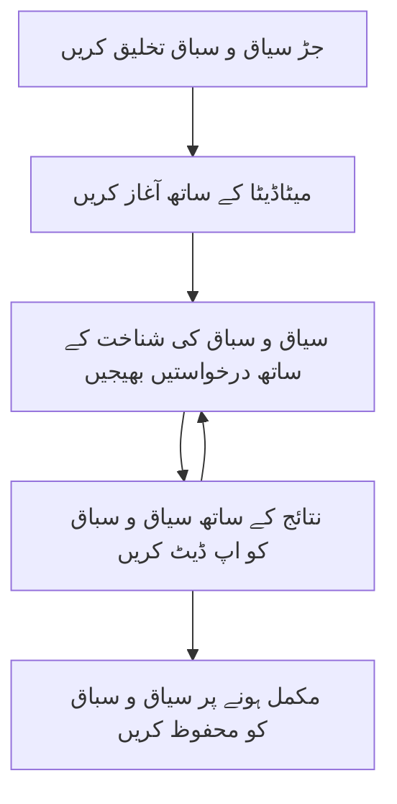

> [منسوخ شدہ: 2026-07-28 رلیز کینڈیڈیٹ](https://blog.modelcontextprotocol.io/posts/2026-07-28-release-candidate/#roots-sampling-and-logging-are-deprecated)

# MCP روٹ کانٹیکسٹس

> **منسوخی کا نوٹس:** `2026-07-28` MCP وضاحت رلیز کینڈیڈیٹ نے ٹول پیرامیٹرز، وسائل کے URI، یا سرور کنفیگریشن کے حق میں روٹس کو منسوخ قرار دیا ہے۔ روٹس `2025-11-25` میں کام کرتے رہیں گے اور کسی بھی رسمی منسوخی کے کم از کم ایک سال بعد تک کام کرتے رہیں گے، لہٰذا اس سبق کی تمام معلومات درست ہیں - لیکن نئے سرور ڈیزائنز کو اس تبدیلی کے نمونہ کا جائزہ لینا چاہیے۔ دیکھیں [MCP میں کیا تبدیل ہو رہا ہے: 2026-07-28 رلیز کینڈیڈیٹ](../../01-CoreConcepts/mcp-2026-07-28-release-candidate.md)۔

روٹ کانٹیکسٹس ماڈل کانٹیکسٹ پروٹوکول میں ایک بنیادی تصور ہیں جو گفتگو کی تاریخ اور شیئرڈ اسٹیٹ کو متعدد درخواستوں اور سیشنز کے دوران برقرار رکھنے کے لیے ایک مستقل پرت فراہم کرتے ہیں۔

## تعارف

اس سبق میں، ہم MCP میں روٹ کانٹیکسٹس بنانے، منظم کرنے، اور استعمال کرنے کا طریقہ سیکھیں گے۔

## تعلیمی مقاصد

اس سبق کے آخر تک، آپ یہ کر سکیں گے:

- روٹ کانٹیکسٹس کے مقصد اور ساخت کو سمجھنا
- MCP کلائنٹ لائبریریز استعمال کرتے ہوئے روٹ کانٹیکسٹس بنانا اور منظم کرنا
- .NET، جاوا، جاوا اسکرپٹ، اور پائتھن ایپلیکیشنز میں روٹ کانٹیکسٹس نافذ کرنا
- ملٹی ٹرن گفتگو اور اسٹیٹ مینجمنٹ کے لیے روٹ کانٹیکسٹس کا استعمال کرنا
- روٹ کانٹیکسٹ مینجمنٹ کی بہترین طریقہ کار اپنانا

## روٹ کانٹیکسٹس کو سمجھنا

روٹ کانٹیکسٹس ایسے کنٹینرز کے طور پر کام کرتے ہیں جو متعلقہ تعاملات کی تاریخ اور اسٹیٹ کو رکھتے ہیں۔ یہ درج ذیل کی سہولت دیتے ہیں:

- **گفتگو کی استقامت**: مربوط ملٹی ٹرن گفتگو برقرار رکھنا
- **میموری مینجمنٹ**: تعاملات کے دوران معلومات کو ذخیرہ اور بازیافت کرنا
- **اسٹیٹ مینجمنٹ**: پیچیدہ ورک فلو میں پیش رفت کو ٹریک کرنا
- **کانٹیکسٹ شیئرنگ**: متعدد کلائنٹس کو ایک ہی گفتگو کی حالت تک رسائی دینا

MCP میں، روٹ کانٹیکسٹس کی یہ اہم خصوصیات ہیں:

- ہر روٹ کانٹیکسٹ کا ایک منفرد شناخت کنندہ ہوتا ہے۔
- یہ گفتگو کی تاریخ، صارف کی ترجیحات، اور دیگر میٹا ڈیٹا رکھ سکتے ہیں۔
- یہ ضرورت کے مطابق بنائے، حاصل کیے، اور محفوظ کیے جا سکتے ہیں۔
- یہ باریک سطحی رسائی کنٹرول اور اجازتوں کی حمایت کرتے ہیں۔

## روٹ کانٹیکسٹ کی زندگی کا چکر



## روٹ کانٹیکسٹس کے ساتھ کام کرنا

یہاں ایک مثال ہے کہ کیسے روٹ کانٹیکسٹس بنائے اور منظم کیے جائیں۔

### C# نفاذ

```csharp
// .NET Example: Root Context Management
using Microsoft.Mcp.Client;
using System;
using System.Threading.Tasks;
using System.Collections.Generic;

public class RootContextExample
{
    private readonly IMcpClient _client;
    private readonly IRootContextManager _contextManager;
    
    public RootContextExample(IMcpClient client, IRootContextManager contextManager)
    {
        _client = client;
        _contextManager = contextManager;
    }
    
    public async Task DemonstrateRootContextAsync()
    {
        // 1. Create a new root context
        var contextResult = await _contextManager.CreateRootContextAsync(new RootContextCreateOptions
        {
            Name = "Customer Support Session",
            Metadata = new Dictionary<string, string>
            {
                ["CustomerName"] = "Acme Corporation",
                ["PriorityLevel"] = "High",
                ["Domain"] = "Cloud Services"
            }
        });
        
        string contextId = contextResult.ContextId;
        Console.WriteLine($"Created root context with ID: {contextId}");
        
        // 2. First interaction using the context
        var response1 = await _client.SendPromptAsync(
            "I'm having issues scaling my web service deployment in the cloud.", 
            new SendPromptOptions { RootContextId = contextId }
        );
        
        Console.WriteLine($"First response: {response1.GeneratedText}");
        
        // Second interaction - the model will have access to the previous conversation
        var response2 = await _client.SendPromptAsync(
            "Yes, we're using containerized deployments with Kubernetes.", 
            new SendPromptOptions { RootContextId = contextId }
        );
        
        Console.WriteLine($"Second response: {response2.GeneratedText}");
        
        // 3. Add metadata to the context based on conversation
        await _contextManager.UpdateContextMetadataAsync(contextId, new Dictionary<string, string>
        {
            ["TechnicalEnvironment"] = "Kubernetes",
            ["IssueType"] = "Scaling"
        });
        
        // 4. Get context information
        var contextInfo = await _contextManager.GetRootContextInfoAsync(contextId);
        
        Console.WriteLine("Context Information:");
        Console.WriteLine($"- Name: {contextInfo.Name}");
        Console.WriteLine($"- Created: {contextInfo.CreatedAt}");
        Console.WriteLine($"- Messages: {contextInfo.MessageCount}");
        
        // 5. When the conversation is complete, archive the context
        await _contextManager.ArchiveRootContextAsync(contextId);
        Console.WriteLine($"Archived context {contextId}");
    }
}
```

پچھلے کوڈ میں ہم نے:

1. کسٹمر سپورٹ سیشن کے لیے ایک روٹ کانٹیکسٹ بنایا۔
1. اُس کانٹیکسٹ میں متعدد پیغامات بھیجے، تاکہ ماڈل اسٹیٹ کو برقرار رکھ سکے۔
1. گفتگو کی بنیاد پر متعلقہ میٹا ڈیٹا کے ساتھ کانٹیکسٹ کو اپ ڈیٹ کیا۔
1. گفتگو کی تاریخ کو سمجھنے کے لیے کانٹیکسٹ کی معلومات حاصل کیں۔
1. جب گفتگو مکمل ہو گئی تو کانٹیکسٹ کو محفوظ کیا۔

## مثال: مالیاتی تجزیہ کے لیے روٹ کانٹیکسٹ کا نفاذ

اس مثال میں، ہم ایک مالیاتی تجزیہ سیشن کے لیے روٹ کانٹیکسٹ بنائیں گے، جو متعدد تعاملات کے دوران اسٹیٹ کو برقرار رکھنے کا مظاہرہ کرے گا۔

### جاوا نفاذ

```java
// جاوا مثال: روٹ کانٹیکسٹ کی عملی شکل
package com.example.mcp.contexts;

import com.mcp.client.McpClient;
import com.mcp.client.ContextManager;
import com.mcp.models.RootContext;
import com.mcp.models.McpResponse;

import java.util.HashMap;
import java.util.Map;
import java.util.UUID;

public class RootContextsDemo {
    private final McpClient client;
    private final ContextManager contextManager;
    
    public RootContextsDemo(String serverUrl) {
        this.client = new McpClient.Builder()
            .setServerUrl(serverUrl)
            .build();
            
        this.contextManager = new ContextManager(client);
    }
    
    public void demonstrateRootContext() throws Exception {
        // کانٹیکسٹ میٹا ڈیٹا تیار کریں
        Map<String, String> metadata = new HashMap<>();
        metadata.put("projectName", "Financial Analysis");
        metadata.put("userRole", "Financial Analyst");
        metadata.put("dataSource", "Q1 2025 Financial Reports");
        
        // 1۔ نیا روٹ کانٹیکسٹ بنائیں
        RootContext context = contextManager.createRootContext("Financial Analysis Session", metadata);
        String contextId = context.getId();
        
        System.out.println("Created context: " + contextId);
        
        // 2۔ پہلا تعامل
        McpResponse response1 = client.sendPrompt(
            "Analyze the trends in Q1 financial data for our technology division",
            contextId
        );
        
        System.out.println("First response: " + response1.getGeneratedText());
        
        // 3۔ جواب سے حاصل شدہ اہم معلومات کے ساتھ کانٹیکسٹ کو اپ ڈیٹ کریں
        contextManager.addContextMetadata(contextId, 
            Map.of("identifiedTrend", "Increasing cloud infrastructure costs"));
        
        // دوسرا تعامل - ایک ہی کانٹیکسٹ کا استعمال کرتے ہوئے
        McpResponse response2 = client.sendPrompt(
            "What's driving the increase in cloud infrastructure costs?",
            contextId
        );
        
        System.out.println("Second response: " + response2.getGeneratedText());
        
        // 4۔ تجزیہ سیشن کا خلاصہ تیار کریں
        McpResponse summaryResponse = client.sendPrompt(
            "Summarize our analysis of the technology division financials in 3-5 key points",
            contextId
        );
        
        // خلاصہ کو کانٹیکسٹ میٹا ڈیٹا میں محفوظ کریں
        contextManager.addContextMetadata(contextId, 
            Map.of("analysisSummary", summaryResponse.getGeneratedText()));
            
        // تازہ ترین کانٹیکسٹ معلومات حاصل کریں
        RootContext updatedContext = contextManager.getRootContext(contextId);
        
        System.out.println("Context Information:");
        System.out.println("- Created: " + updatedContext.getCreatedAt());
        System.out.println("- Last Updated: " + updatedContext.getLastUpdatedAt());
        System.out.println("- Analysis Summary: " + 
            updatedContext.getMetadata().get("analysisSummary"));
            
        // 5۔ مکمل ہونے پر کانٹیکسٹ کو محفوظ کریں
        contextManager.archiveContext(contextId);
        System.out.println("Context archived");
    }
}
```

پچھلے کوڈ میں ہم نے:

1. مالیاتی تجزیہ سیشن کے لیے ایک روٹ کانٹیکسٹ بنایا۔
2. اُس کانٹیکسٹ میں متعدد پیغامات بھیجے، تاکہ ماڈل اسٹیٹ کو برقرار رکھ سکے۔
3. گفتگو کی بنیاد پر متعلقہ میٹا ڈیٹا کے ساتھ کانٹیکسٹ کو اپ ڈیٹ کیا۔
4. تجزیہ سیشن کا خلاصہ تیار کیا اور اسے کانٹیکسٹ میٹا ڈیٹا میں محفوظ کیا۔
5. جب گفتگو مکمل ہو گئی تو کانٹیکسٹ کو محفوظ کیا۔

## مثال: روٹ کانٹیکسٹ مینجمنٹ

گفتگو کی تاریخ اور اسٹیٹ کو بہتر طریقے سے برقرار رکھنے کے لیے روٹ کانٹیکسٹس کو مؤثر طریقے سے منظم کرنا ضروری ہے۔ ذیل میں روٹ کانٹیکسٹ مینجمنٹ کے نفاذ کی ایک مثال دی گئی ہے۔

### جاوا اسکرپٹ نفاذ

```javascript
// جاوا اسکرپٹ مثال: MCP روٹ کانٹیکسٹ کو منظم کرنا
const { McpClient, RootContextManager } = require('@mcp/client');

class ContextSession {
  constructor(serverUrl, apiKey = null) {
    // MCP کلائنٹ کو شروع کریں
    this.client = new McpClient({
      serverUrl,
      apiKey
    });
    
    // کانٹیکسٹ مینیجر کو شروع کریں
    this.contextManager = new RootContextManager(this.client);
  }
  
  /**
   * Create a new conversation context
   * @param {string} sessionName - Name of the conversation session
   * @param {Object} metadata - Additional metadata for the context
   * @returns {Promise<string>} - Context ID
   */
  async createConversationContext(sessionName, metadata = {}) {
    try {
      const contextResult = await this.contextManager.createRootContext({
        name: sessionName,
        metadata: {
          ...metadata,
          createdAt: new Date().toISOString(),
          status: 'active'
        }
      });
      
      console.log(`Created root context '${sessionName}' with ID: ${contextResult.id}`);
      return contextResult.id;
    } catch (error) {
      console.error('Error creating root context:', error);
      throw error;
    }
  }
  
  /**
   * Send a message in an existing context
   * @param {string} contextId - The root context ID
   * @param {string} message - The user's message
   * @param {Object} options - Additional options
   * @returns {Promise<Object>} - Response data
   */
  async sendMessage(contextId, message, options = {}) {
    try {
      // مخصوص کانٹیکسٹ کا استعمال کرتے ہوئے پیغام بھیجیں
      const response = await this.client.sendPrompt(message, {
        rootContextId: contextId,
        temperature: options.temperature || 0.7,
        allowedTools: options.allowedTools || []
      });
      
      // گفتگو سے اہم بصیرت کو اختیاری طور پر ذخیرہ کریں
      if (options.storeInsights) {
        await this.storeConversationInsights(contextId, message, response.generatedText);
      }
      
      return {
        message: response.generatedText,
        toolCalls: response.toolCalls || [],
        contextId
      };
    } catch (error) {
      console.error(`Error sending message in context ${contextId}:`, error);
      throw error;
    }
  }
  
  /**
   * Store important insights from a conversation
   * @param {string} contextId - The root context ID
   * @param {string} userMessage - User's message
   * @param {string} aiResponse - AI's response
   */
  async storeConversationInsights(contextId, userMessage, aiResponse) {
    try {
      // ممکنہ بصیرت نکالیں (حقیقی ایپ میں یہ زیادہ پیچیدہ ہوگا)
      const combinedText = userMessage + "\n" + aiResponse;
      
      // ممکنہ بصیرت کی شناخت کے لیے سادہ ہیورسٹک
      const insightWords = ["important", "key point", "remember", "significant", "crucial"];
      
      const potentialInsights = combinedText
        .split(".")
        .filter(sentence => 
          insightWords.some(word => sentence.toLowerCase().includes(word))
        )
        .map(sentence => sentence.trim())
        .filter(sentence => sentence.length > 10);
      
      // بصیرت کو کانٹیکسٹ کے میٹا ڈیٹا میں ذخیرہ کریں
      if (potentialInsights.length > 0) {
        const insights = {};
        potentialInsights.forEach((insight, index) => {
          insights[`insight_${Date.now()}_${index}`] = insight;
        });
        
        await this.contextManager.updateContextMetadata(contextId, insights);
        console.log(`Stored ${potentialInsights.length} insights in context ${contextId}`);
      }
    } catch (error) {
      console.warn('Error storing conversation insights:', error);
      // غیر اہم خطا، لہٰذا صرف وارننگ لاگ کریں
    }
  }
  
  /**
   * Get summary information about a context
   * @param {string} contextId - The root context ID
   * @returns {Promise<Object>} - Context information
   */
  async getContextInfo(contextId) {
    try {
      const contextInfo = await this.contextManager.getContextInfo(contextId);
      
      return {
        id: contextInfo.id,
        name: contextInfo.name,
        created: new Date(contextInfo.createdAt).toLocaleString(),
        lastUpdated: new Date(contextInfo.lastUpdatedAt).toLocaleString(),
        messageCount: contextInfo.messageCount,
        metadata: contextInfo.metadata,
        status: contextInfo.status
      };
    } catch (error) {
      console.error(`Error getting context info for ${contextId}:`, error);
      throw error;
    }
  }
  
  /**
   * Generate a summary of the conversation in a context
   * @param {string} contextId - The root context ID
   * @returns {Promise<string>} - Generated summary
   */
  async generateContextSummary(contextId) {
    try {
      // ماڈل سے اب تک کی گفتگو کا خلاصہ تیار کرنے کو کہیں
      const response = await this.client.sendPrompt(
        "Please summarize our conversation so far in 3-4 sentences, highlighting the main points discussed.",
        { rootContextId: contextId, temperature: 0.3 }
      );
      
      // خلاصہ کو کانٹیکسٹ کے میٹا ڈیٹا میں ذخیرہ کریں
      await this.contextManager.updateContextMetadata(contextId, {
        conversationSummary: response.generatedText,
        summarizedAt: new Date().toISOString()
      });
      
      return response.generatedText;
    } catch (error) {
      console.error(`Error generating context summary for ${contextId}:`, error);
      throw error;
    }
  }
  
  /**
   * Archive a context when it's no longer needed
   * @param {string} contextId - The root context ID
   * @returns {Promise<Object>} - Result of the archive operation
   */
  async archiveContext(contextId) {
    try {
      // محفوظ کرنے سے پہلے حتمی خلاصہ تیار کریں
      const summary = await this.generateContextSummary(contextId);
      
      // کانٹیکسٹ کو آرکائیو کریں
      await this.contextManager.archiveContext(contextId);
      
      return {
        status: "archived",
        contextId,
        summary
      };
    } catch (error) {
      console.error(`Error archiving context ${contextId}:`, error);
      throw error;
    }
  }
}

// استعمال کی مثال
async function demonstrateContextSession() {
  const session = new ContextSession('https://mcp-server-example.com');
  
  try {
    // 1. پروڈکٹ سپورٹ گفتگو کے لیے نیا کانٹیکسٹ بنائیں
    const contextId = await session.createConversationContext(
      'Product Support - Database Performance',
      {
        customer: 'Globex Corporation',
        product: 'Enterprise Database',
        severity: 'Medium',
        supportAgent: 'AI Assistant'
      }
    );
    
    // 2. گفتگو میں پہلا پیغام
    const response1 = await session.sendMessage(
      contextId,
      "I'm experiencing slow query performance on our database cluster after the latest update.",
      { storeInsights: true }
    );
    console.log('Response 1:', response1.message);
    
    // اسی کانٹیکسٹ میں فالو اپ پیغام
    const response2 = await session.sendMessage(
      contextId,
      "Yes, we've already checked the indexes and they seem to be properly configured.",
      { storeInsights: true }
    );
    console.log('Response 2:', response2.message);
    
    // 3. کانٹیکسٹ کے بارے میں معلومات حاصل کریں
    const contextInfo = await session.getContextInfo(contextId);
    console.log('Context Information:', contextInfo);
    
    // 4. گفتگو کا خلاصہ تیار کریں اور دکھائیں
    const summary = await session.generateContextSummary(contextId);
    console.log('Conversation Summary:', summary);
    
    // 5. کام مکمل ہونے پر کانٹیکسٹ کو آرکائیو کریں
    const archiveResult = await session.archiveContext(contextId);
    console.log('Archive Result:', archiveResult);
    
    // 6. کسی بھی غلطی کو آرام سے سنبھالیں
  } catch (error) {
    console.error('Error in context session demonstration:', error);
  }
}

demonstrateContextSession();
```

پچھلے کوڈ میں ہم نے:

1. ایک پروڈکٹ سپورٹ گفتگو کے لیے `createConversationContext` فنکشن کے ساتھ روٹ کانٹیکسٹ بنایا۔ اس کیس میں، کانٹیکسٹ ڈیٹا بیس کی کارکردگی کے مسائل کے بارے میں ہے۔

1. اُس کانٹیکسٹ میں متعدد پیغامات بھیجے تاکہ ماڈل اسٹیٹ کو برقرار رکھ سکے، `sendMessage` فنکشن کے ذریعے۔ بھیجے جانے والے پیغامات سست استفسار کی کارکردگی اور انڈیکس کنفیگریشن کے بارے میں ہیں۔

1. گفتگو کی بنیاد پر متعلقہ میٹا ڈیٹا کے ساتھ کانٹیکسٹ کو اپ ڈیٹ کیا۔

1. گفتگو کا خلاصہ تیار کیا اور اسے کانٹیکسٹ میٹا ڈیٹا میں `generateContextSummary` فنکشن کے ذریعے محفوظ کیا۔

1. جب گفتگو مکمل ہو گئی تو کانٹیکسٹ کو `archiveContext` فنکشن کے ساتھ محفوظ کیا۔

1. خامیوں کو خوبصورتی سے سنبھالا تاکہ مضبوطی یقینی بن سکے۔

## ملٹی ٹرن معاونت کے لیے روٹ کانٹیکسٹ

اس مثال میں، ہم ایک ملٹی ٹرن معاونت سیشن کے لیے روٹ کانٹیکسٹ بنائیں گے، جو متعدد تعاملات کے دوران اسٹیٹ کو برقرار رکھنے کا مظاہرہ کرے گا۔

### پائتھن نفاذ

```python
# پائتھون مثال: کثیر مرحلے کی مدد کے لیے جڑ کا سیاق و سباق
import asyncio
from datetime import datetime
from mcp_client import McpClient, RootContextManager

class AssistantSession:
    def __init__(self, server_url, api_key=None):
        self.client = McpClient(server_url=server_url, api_key=api_key)
        self.context_manager = RootContextManager(self.client)
    
    async def create_session(self, name, user_info=None):
        """Create a new root context for an assistant session"""
        metadata = {
            "session_type": "assistant",
            "created_at": datetime.now().isoformat(),
        }
        
        # اگر فراہم کیا گیا ہو تو صارف کی معلومات شامل کریں
        if user_info:
            metadata.update({f"user_{k}": v for k, v in user_info.items()})
            
        # جڑ کا سیاق و سباق بنائیں
        context = await self.context_manager.create_root_context(name, metadata)
        return context.id
    
    async def send_message(self, context_id, message, tools=None):
        """Send a message within a root context"""
        # سیاق و سباق کے شناختی نمبر کے ساتھ اختیارات بنائیں
        options = {
            "root_context_id": context_id
        }
        
        # اگر مخصوص کیا گیا ہو تو اوزار شامل کریں
        if tools:
            options["allowed_tools"] = tools
        
        # سیاق و سباق کے اندر پرامپٹ بھیجیں
        response = await self.client.send_prompt(message, options)
        
        # بات چیت کی پیش رفت کے ساتھ سیاق و سباق کا میٹا ڈیٹا اپ ڈیٹ کریں
        await self.context_manager.update_context_metadata(
            context_id,
            {
                f"message_{datetime.now().timestamp()}": message[:50] + "...",
                "last_interaction": datetime.now().isoformat()
            }
        )
        
        return response
    
    async def get_conversation_history(self, context_id):
        """Retrieve conversation history from a context"""
        context_info = await self.context_manager.get_context_info(context_id)
        messages = await self.client.get_context_messages(context_id)
        
        return {
            "context_info": context_info,
            "messages": messages
        }
    
    async def end_session(self, context_id):
        """End an assistant session by archiving the context"""
        # پہلے خلاصہ پرامپٹ تیار کریں
        summary_response = await self.client.send_prompt(
            "Please summarize our conversation and any key points or decisions made.",
            {"root_context_id": context_id}
        )
        
        # میٹا ڈیٹا میں خلاصہ ذخیرہ کریں
        await self.context_manager.update_context_metadata(
            context_id,
            {
                "summary": summary_response.generated_text,
                "ended_at": datetime.now().isoformat(),
                "status": "completed"
            }
        )
        
        # سیاق و سباق کو محفوظ کریں
        await self.context_manager.archive_context(context_id)
        
        return {
            "status": "completed",
            "summary": summary_response.generated_text
        }

# استعمال کی مثال
async def demo_assistant_session():
    assistant = AssistantSession("https://mcp-server-example.com")
    
    # 1. سیشن بنائیں
    context_id = await assistant.create_session(
        "Technical Support Session",
        {"name": "Alex", "technical_level": "advanced", "product": "Cloud Services"}
    )
    print(f"Created session with context ID: {context_id}")
    
    # 2. پہلی بات چیت
    response1 = await assistant.send_message(
        context_id, 
        "I'm having trouble with the auto-scaling feature in your cloud platform.",
        ["documentation_search", "diagnostic_tool"]
    )
    print(f"Response 1: {response1.generated_text}")
    
    # اسی سیاق و سباق میں دوسری بات چیت
    response2 = await assistant.send_message(
        context_id,
        "Yes, I've already checked the configuration settings you mentioned, but it's still not working."
    )
    print(f"Response 2: {response2.generated_text}")
    
    # 3. تاریخ حاصل کریں
    history = await assistant.get_conversation_history(context_id)
    print(f"Session has {len(history['messages'])} messages")
    
    # 4. سیشن ختم کریں
    end_result = await assistant.end_session(context_id)
    print(f"Session ended with summary: {end_result['summary']}")

if __name__ == "__main__":
    asyncio.run(demo_assistant_session())
```

پچھلے کوڈ میں ہم نے:

1. `create_session` فنکشن کے ساتھ تکنیکی سپورٹ سیشن کے لیے روٹ کانٹیکسٹ بنایا۔ کانٹیکسٹ میں صارف کی معلومات جیسے نام اور تکنیکی سطح شامل ہے۔

1. اُس کانٹیکسٹ میں متعدد پیغامات بھیجے تاکہ ماڈل اسٹیٹ کو برقرار رکھ سکے، `send_message` فنکشن کے ذریعے۔ بھیجے جانے والے پیغامات آٹو-اسکیلنگ کی خصوصیت کے مسائل کے بارے میں ہیں۔

1. `get_conversation_history` فنکشن کے ذریعے گفتگو کی تاریخ حاصل کی، جو کانٹیکسٹ معلومات اور پیغامات فراہم کرتا ہے۔

1. سیشن کا خاتمہ `end_session` فنکشن کے ساتھ کیا، جس میں کانٹیکسٹ کو محفوظ کیا گیا اور خلاصہ بنایا گیا۔ خلاصہ گفتگو کے اہم نکات کو قید کرتا ہے۔

## روٹ کانٹیکسٹ کے بہترین طریقے

یہاں روٹ کانٹیکسٹس کو مؤثر طریقے سے منظم کرنے کے لیے کچھ بہترین طریقے ہیں:

- **مرکوز کانٹیکسٹس بنائیں**: مختلف گفتگو کے مقاصد یا شعبوں کے لیے مختلف روٹ کانٹیکسٹس بنائیں تاکہ وضاحت برقرار رہے۔

- **میعاد ختم ہونے کی پالیسیاں مرتب کریں**: پرانے کانٹیکسٹس کو محفوظ کرنے یا حذف کرنے کی پالیسیاں نافذ کریں تاکہ ذخیرہ اور ڈیٹا برقرار رکھنے کی پالیسیاں پوری ہوں۔

- **متعلقہ میٹا ڈیٹا ذخیرہ کریں**: گفتگو کے اہم معلومات کو محفوظ کرنے کے لیے کانٹیکسٹ میٹا ڈیٹا کا استعمال کریں جو بعد میں مفید ہو سکتی ہے۔

- **کانٹیکسٹ IDs کا مستقل استعمال کریں**: جب کانٹیکسٹ بنا لیا جائے تو اس کا شناختی نمبر مستقل طور پر تمام متعلقہ درخواستوں میں استعمال کریں تاکہ تسلسل برقرار رہے۔

- **خلاصے تیار کریں**: جب کانٹیکسٹ بہت بڑا ہو جائے تو اہم معلومات کو قید کرنے کے لیے خلاصے بنانا غور کریں تاکہ کانٹیکسٹ کا حجم منظم کیا جا سکے۔

- **رسائی کنٹرول نافذ کریں**: کثیر صارف نظام کے لیے مناسب رسائی کنٹرول نافذ کریں تاکہ گفتگو کے کانٹیکسٹس کی رازداری اور سلامتی یقینی بنائی جا سکے۔

- **کانٹیکسٹ کی محدودیت کا خیال رکھیں**: کانٹیکسٹ کے سائز کی حدود سے آگاہ رہیں اور بہت طویل گفتگو کے لیے حکمت عملی وضع کریں۔

- **مکمل ہونے پر محفوظ کریں**: جب گفتگو مکمل ہو جائے تو کانٹیکسٹس کو محفوظ کریں تاکہ وسائل آزاد ہوں اور گفتگو کی تاریخ برقرار رہے۔

## آگے کیا ہے

- [5.5 روٹنگ](../mcp-routing/README.md)

---

<!-- CO-OP TRANSLATOR DISCLAIMER START -->
**ڈس کلیمر**:
یہ دستاویز AI ترجمہ سروس [Co-op Translator](https://github.com/Azure/co-op-translator) کے ذریعے ترجمہ کی گئی ہے۔ جبکہ ہم درستگی کے لیے کوشاں ہیں، براہ کرم اس بات سے آگاہ رہیں کہ خودکار ترجمے میں غلطیاں یا عدم درستیاں ہو سکتی ہیں۔ اصل دستاویز اپنے مادری زبان میں مستند ماخذ سمجھی جائے گی۔ حساس معلومات کے لیے پیشہ ور انسانی ترجمہ کی سفارش کی جاتی ہے۔ اس ترجمے کے استعمال سے پیدا ہونے والی کسی بھی غلط فہمی یا غلط تشریح کی ذمہ داری ہم قبول نہیں کرتے۔
<!-- CO-OP TRANSLATOR DISCLAIMER END -->