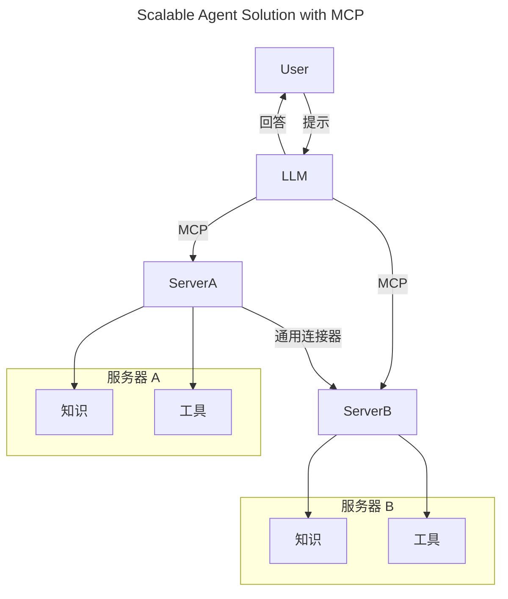
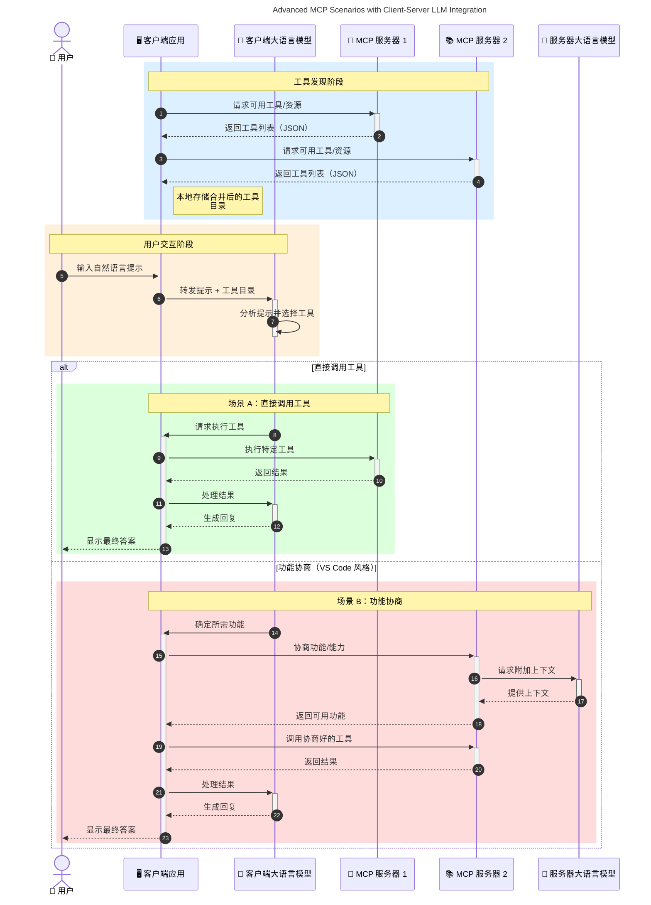

# 模型上下文协议（MCP）简介：为何对可扩展的AI应用至关重要

[](https://youtu.be/agBbdiOPLQA)

_(点击上方图片观看本课程视频)_

生成式AI应用是一个重要的进步，因为它们通常允许用户使用自然语言提示与应用互动。然而，随着在这些应用上投入的时间和资源增加，你需要确保能轻松集成功能和资源，使得扩展变得容易，应用能够支持多个模型的使用，并处理各种模型细节。简而言之，构建生成式AI应用开始时很简单，但随着应用的发展和复杂化，你需要开始定义架构，并可能需要依赖某个标准来确保应用以一致的方式构建。这就是MCP出现的地方，用于组织事务并提供标准。

---

## **🔍 什么是模型上下文协议（MCP）？**

**模型上下文协议（MCP）** 是一个<strong>开放的、标准化的接口</strong>，允许大型语言模型（LLM）无缝地与外部工具、API 和数据源交互。它提供了一种一致的架构，增强了AI模型的功能，超越了它们的训练数据，实现更智能、可扩展和响应更快的AI系统。

---

## **🎯 为什么AI中的标准化很重要**

随着生成式AI应用变得更加复杂，采用标准以确保<strong>可扩展性、可扩展性、可维护性</strong>和<strong>避免供应商锁定</strong>变得至关重要。MCP通过以下方式满足这些需求：

- 统一模型与工具的集成
- 减少脆弱的、一次性的定制解决方案
- 允许来自不同供应商的多个模型在同一生态系统中共存

<strong>注意：</strong>虽然MCP自称为开放标准，但目前没有计划通过任何现有标准机构如IEEE、IETF、W3C、ISO或其他标准机构来标准化MCP。

---

## **📚 学习目标**

在阅读本文后，你将能够：

- 定义<strong>模型上下文协议（MCP）</strong>及其使用场景
- 理解MCP如何标准化模型与工具间的通信
- 识别MCP架构的核心组成部分
- 探索MCP在企业和开发环境中的实际应用

---

## **💡 为什么模型上下文协议（MCP）是颠覆性创新**

### **🔗 MCP解决了AI交互的碎片化问题**

在MCP之前，集成模型与工具需要：

- 针对每对工具-模型编写定制代码
- 每个供应商都有非标准API
- 更新频繁导致整合中断
- 难以扩展以支持更多工具

### **✅ MCP标准化的好处**

| <strong>好处</strong>                 | <strong>描述</strong>                                                                   |
|--------------------------|---------------------------------------------------------------------------|
| 互操作性                 | 大型语言模型可无缝协作不同供应商的工具                                     |
| 一致性                   | 跨平台和工具的统一行为                                                     |
| 可重用性                 | 构建一次的工具可在多个项目和系统中使用                                     |
| 加速开发                 | 通过使用标准化、即插即用的接口减少开发时间                                 |

---

## **🧱 MCP架构的高层次概览**

MCP遵循<strong>客户端-服务器模型</strong>，其中：

- <strong>MCP主机</strong>运行AI模型
- <strong>MCP客户端</strong>发起请求
- <strong>MCP服务器</strong>提供上下文、工具和功能

### **关键组件：**

- <strong>资源</strong> – 为模型提供静态或动态数据  
- <strong>提示</strong> – 预定义的工作流用于指导生成  
- <strong>工具</strong> – 可执行功能如搜索、计算  
- <strong>采样</strong> – 通过递归交互实现的代理行为（`2026-07-28`发布候选版本中已弃用）
- <strong>引导</strong> – 服务器发起的用户输入请求
- <strong>根</strong> – 服务器访问控制的文件系统边界（`2026-07-28`发布候选版本中已弃用）

### **协议架构：**

MCP采用两层架构：
- <strong>数据层</strong>：基于JSON-RPC 2.0的通信，含生命周期管理和基本操作
- <strong>传输层</strong>：STDIO（本地）和支持SSE的可流式HTTP（远程）通信通道

---

## MCP服务器如何工作

MCP服务器的操作方式如下：

- <strong>请求流程</strong>：
    1. 请求由最终用户或代表其操作的软件发起。
    2. <strong>MCP客户端</strong>将请求发送给管理AI模型运行时的<strong>MCP主机</strong>。
    3. <strong>AI模型</strong>接收用户提示，可能通过一个或多个调用工具请求访问外部工具或数据。
    4. **MCP主机**（而非模型直接）使用标准化协议与相应的<strong>MCP服务器</strong>通信。
- **MCP主机功能**：
    - <strong>工具注册表</strong>：维护可用工具及其功能的目录。
    - <strong>认证</strong>：验证工具访问权限。
    - <strong>请求处理器</strong>：处理模型发出的工具请求。
    - <strong>响应格式化器</strong>：将工具输出结构化为模型可理解的格式。
- **MCP服务器执行**：
    - <strong>MCP主机</strong>将工具调用路由到一个或多个提供特定功能的<strong>MCP服务器</strong>（如搜索、计算、数据库查询）。
    - <strong>MCP服务器</strong>执行相关操作并以一致格式返回结果给<strong>MCP主机</strong>。
    - <strong>MCP主机</strong>格式化并传递结果给<strong>AI模型</strong>。
- <strong>响应完成</strong>：
    - <strong>AI模型</strong>将工具输出整合至最终响应中。
    - <strong>MCP主机</strong>将该响应发送回<strong>MCP客户端</strong>，后者传递给最终用户或调用软件。
    

```mermaid
---
title: MCP Architecture and Component Interactions
description: A diagram showing the flows of the components in MCP.
---
graph TD
    Client[MCP 客户端/应用] -->|发送请求| H[MCP 主机]
    H -->|调用| A[AI 模型]
    A -->|工具调用请求| H
    H -->|MCP Protocol| T1[MCP Server Tool 01: 网络搜索]
    H -->|MCP Protocol| T2[MCP Server Tool 02: 计算器工具]
    H -->|MCP Protocol| T3[MCP Server Tool 03: 数据库访问工具]
    H -->|MCP Protocol| T4[MCP Server Tool 04: 文件系统工具]
    H -->|发送响应| Client

    subgraph “MCP 主机组件”
        H
        G[工具注册表]
        I[身份验证]
        J[请求处理器]
        K[响应格式化器]
    end

    H <--> G
    H <--> I
    H <--> J
    H <--> K

    style A fill:#f9d5e5,stroke:#333,stroke-width:2px
    style H fill:#eeeeee,stroke:#333,stroke-width:2px
    style Client fill:#d5e8f9,stroke:#333,stroke-width:2px
    style G fill:#fffbe6,stroke:#333,stroke-width:1px
    style I fill:#fffbe6,stroke:#333,stroke-width:1px
    style J fill:#fffbe6,stroke:#333,stroke-width:1px
    style K fill:#fffbe6,stroke:#333,stroke-width:1px
    style T1 fill:#c2f0c2,stroke:#333,stroke-width:1px
    style T2 fill:#c2f0c2,stroke:#333,stroke-width:1px
    style T3 fill:#c2f0c2,stroke:#333,stroke-width:1px
    style T4 fill:#c2f0c2,stroke:#333,stroke-width:1px
```

## 👨‍💻 如何构建MCP服务器（附示例）

MCP服务器允许你通过提供数据和功能扩展LLM能力。

准备好试一试了吗？以下是不同语言和/或技术栈的SDK，附有创建简单MCP服务器的示例：

- **Python SDK**: https://github.com/modelcontextprotocol/python-sdk

- **TypeScript SDK**: https://github.com/modelcontextprotocol/typescript-sdk

- **Java SDK**: https://github.com/modelcontextprotocol/java-sdk

- **C#/.NET SDK**: https://github.com/modelcontextprotocol/csharp-sdk


## 🌍 MCP的现实世界用例

MCP通过扩展AI能力支持广泛的应用：

| <strong>应用</strong>                      | <strong>描述</strong>                                                                |
|------------------------------|------------------------------------------------------------------------|
| 企业数据集成                  | 连接LLM与数据库、CRM或内部工具                                        |
| 代理式AI系统                  | 实现具备工具访问和决策工作流的自治代理                                |
| 多模态应用                    | 在单一统一AI应用中结合文本、图像和音频工具                            |
| 实时数据集成                  | 将实时数据引入AI交互，实现更准确、及时的输出                          |


### 🧠 MCP = AI交互的通用标准

模型上下文协议（MCP）充当了AI交互的通用标准，就像USB-C统一了设备的物理连接方式一样。在AI领域，MCP提供了一致的接口，使模型（客户端）能无缝集成外部工具和数据提供方（服务器）。这消除了为每个API或数据源开发不同定制协议的需求。

在MCP下，兼容MCP的工具（称为MCP服务器）遵循统一标准。这些服务器能列出它们提供的工具或操作，并在AI代理请求时执行这些操作。支持MCP的AI代理平台能发现服务器上的可用工具，并通过该标准协议调用它们。

### 💡 促进知识访问

除了提供工具外，MCP还促进了知识访问。它使应用可以通过连接各种数据源为大型语言模型（LLM）提供上下文。例如，一个MCP服务器可能代表公司的文档库，让代理按需检索相关信息。另一个服务器可以处理发送邮件或更新记录等特定操作。从代理的角度看，这些都是它可以使用的工具——一些工具返回数据（知识上下文），另一些执行操作。MCP高效地管理两者。

连接到MCP服务器的代理能够通过标准格式自动了解服务器的可用功能和可访问数据。这种标准化实现了动态工具可用性。例如，向代理系统添加新MCP服务器，其功能立即可用，无需进一步定制代理指令。

这种简化的集成符合下图所示的流程，其中服务器提供工具和知识，确保系统间无缝协作。

### 👉 示例：可扩展的代理解决方案


通用连接器使MCP服务器能够相互通信和共享功能，允许ServerA委托任务给ServerB或访问其工具和知识。这在服务器间实现工具和数据的联合，支持可扩展和模块化的代理架构。由于MCP标准化了工具暴露，代理能动态发现并在服务器间路由请求，无需硬编码集成。


工具和知识联合：工具和数据可跨服务器访问，实现更可扩展和模块化的代理架构。

### 🔄 带客户端LLM集成的高级MCP场景

除了基本的MCP架构，还有一些高级场景，其中客户端和服务器都包含LLM，实现更复杂的交互。下图中，<strong>客户端应用</strong>可能是带有多个MCP工具的IDE，由LLM为用户使用：



## 🔐 MCP的实际好处

使用MCP的实际好处包括：

- <strong>时效性</strong>：模型可以访问超出其训练数据的最新信息
- <strong>能力扩展</strong>：模型能利用专门工具完成其未被训练的任务
- <strong>减少幻觉</strong>：外部数据源提供事实依据
- <strong>隐私</strong>：敏感数据可以留在安全环境中，而非嵌入提示词

## 📌 主要收获

以下是使用MCP的主要收获：

- <strong>MCP</strong>标准化AI模型与工具和数据的交互方式
- 促进<strong>可扩展性、一致性和互操作性</strong>
- MCP帮助<strong>减少开发时间、提升可靠性并扩展模型能力</strong>
- 客户端-服务器架构<strong>支持灵活、可扩展的AI应用</strong>

## 🧠 练习

思考一个你感兴趣构建的AI应用。

- 哪些<strong>外部工具或数据</strong>能增强其能力？
- MCP如何让集成变得<strong>更简单、更可靠</strong>？

## 附加资源

- [MCP GitHub 仓库](https://github.com/modelcontextprotocol)


## 接下来

下一章节：[第1章：核心概念](../01-CoreConcepts/README.md)

---

<!-- CO-OP TRANSLATOR DISCLAIMER START -->
**免责声明**：
本文件由 AI 翻译服务 [Co-op Translator](https://github.com/Azure/co-op-translator) 翻译完成。尽管我们力求准确，但请注意，自动翻译可能包含错误或不准确之处。原始语言版文件应视为权威来源。对于重要信息，建议使用专业人工翻译。我们对因使用本翻译而产生的任何误解或误释不承担责任。
<!-- CO-OP TRANSLATOR DISCLAIMER END -->