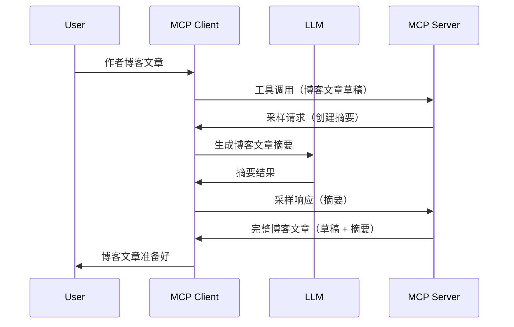

> [已弃用：2026-07-28 发布候选版本](https://blog.modelcontextprotocol.io/posts/2026-07-28-release-candidate/)

# 采样 - 将功能委托给客户端

> **弃用通知：** `2026-07-28` MCP 规范发布候选版本标记采样为已弃用，建议直接与 LLM 提供商 API 集成。采样在 `2025-11-25` 版本及正式弃用后至少一年内仍然可用，因此本课程中的内容仍然有效，但新的服务器设计应评估替代方案。详情见 [MCP 的变化：2026-07-28 发布候选版本](../../01-CoreConcepts/mcp-2026-07-28-release-candidate.md)。

有时，您需要 MCP 客户端和 MCP 服务器协作以实现共同目标。可能存在服务器需要客户端上的 LLM 帮助的情况。对于这种情况，您应使用采样。

让我们探讨一些用例以及如何构建涉及采样的解决方案。

## 概述

本课专注于说明何时何地使用采样以及如何配置它。

## 学习目标

本章将学习：

- 解释什么是采样及其使用时机。
- 展示如何在 MCP 中配置采样。
- 提供采样的实际示例。

## 什么是采样以及为何使用？

采样是一项高级功能，其工作方式如下：



### 采样请求

好的，现在我们对一个可信场景有了宏观了解，接下来谈谈服务器发回给客户端的采样请求。此类请求在 JSON-RPC 格式中可能如下：

```json
{
  "jsonrpc": "2.0",
  "id": 1,
  "method": "sampling/createMessage",
  "params": {
    "messages": [
      {
        "role": "user",
        "content": {
          "type": "text",
          "text": "Create a blog post summary of the following blog post: <BLOG POST>"
        }
      }
    ],
    "modelPreferences": {
      "hints": [
        {
          "name": "claude-3-sonnet"
        }
      ],
      "intelligencePriority": 0.8,
      "speedPriority": 0.5
    },
    "systemPrompt": "You are a helpful assistant.",
    "maxTokens": 100
  }
}
```

有几个点值得注意：

- Prompt 位于 content -> text 下，是对 LLM 总结博客文章内容的指令提示。

- **modelPreferences**，这部分是偏好建议，推荐使用的 LLM 配置。用户可以选择遵循或者更改这些建议。此案例中推荐了使用的模型以及速度和智能优先级。
- **systemPrompt**，这是普通的系统提示，赋予 LLM 个性并包含指导指令。
- **maxTokens**，该属性用于推荐这项任务应使用的最大令牌数。

### 采样响应

这是 MCP 客户端最终发送回 MCP 服务器的响应，是客户端调用 LLM、等待响应并构建此消息后的结果。它在 JSON-RPC 中可能如下：

```json
{
  "jsonrpc": "2.0",
  "id": 1,
  "result": {
    "role": "assistant",
    "content": {
      "type": "text",
      "text": "Here's your abstract <ABSTRACT>"
    },
    "model": "gpt-5",
    "stopReason": "endTurn"
  }
}
```

注意响应是博客文章的摘要，正如我们所要求的。同时注意这里使用的 `model` 并非请求的 "claude-3-sonnet"，而是 "gpt-5"。这说明用户可以改变选择，采样请求只是建议。

了解了主要流程以及“博客文章创作 + 摘要”这一常用任务后，接下来看看如何实现采样功能。

### 消息类型

采样消息不限于文本，也可以发送图像和音频。以下是 JSON-RPC 格式的不同示例：

<strong>文本</strong>

```json
{
  "type": "text",
  "text": "The message content"
}
```

<strong>图像内容</strong>

```json
{
  "type": "image",
  "data": "base64-encoded-image-data",
  "mimeType": "image/jpeg"
}
```

<strong>音频内容</strong>

```json
{
  "type": "audio",
  "data": "base64-encoded-audio-data",
  "mimeType": "audio/wav"
}
```

> 注：有关采样的详细信息，请参阅[官方文档](https://modelcontextprotocol.io/specification/2025-11-25/client/sampling)

## 如何在客户端配置采样

> 注意：如果您只构建服务器，这里无需太多操作。

在客户端，您需要如下指定功能：

```json
{
  "capabilities": {
    "sampling": {}
  }
}
```

这样，在客户端初始化连接服务器时，就会启用该功能。

## 采样实战示例 - 创建博客文章

让我们一起编码一个采样服务器，需要完成以下步骤：

1. 在服务器上创建一个工具。
1. 工具应创建采样请求。
1. 工具应等待客户端完成采样请求。
1. 然后产出工具结果。

我们一步步来看代码：

### -1- 创建工具

**python**

```python
@mcp.tool()
async def create_blog(title: str, content: str, ctx: Context[ServerSession, None]) -> str:
    """Create a blog post and generate a summary"""

```

### -2- 创建采样请求

在工具中添加以下代码：

**python**

```python
post = BlogPost(
        id=len(posts) + 1,
        title=title,
        content=content,
        abstract=""
    )

prompt = f"Create an abstract of the following blog post: title: {title} and draft: {content} "

result = await ctx.session.create_message(
        messages=[
            SamplingMessage(
                role="user",
                content=TextContent(type="text", text=prompt),
            )
        ],
        max_tokens=100,
)

```

### -3- 等待响应并返回结果

**python**

```python
post.abstract = result.content.text

posts.append(post)

# 返回完整产品
return json.dumps({
    "id": post.title,
    "abstract": post.abstract
})
```

### -4- 完整代码

**python**

```python
from starlette.applications import Starlette
from starlette.routing import Mount, Host

from mcp.server.fastmcp import Context, FastMCP

from mcp.server.session import ServerSession
from mcp.types import SamplingMessage, TextContent

import json


from uuid import uuid4
from typing import List
from pydantic import BaseModel


mcp = FastMCP("Blog post generator")

# app = FastAPI()

posts = []

class BlogPost(BaseModel):
    id: int
    title: str
    content: str
    abstract: str

posts: List[BlogPost] = []

@mcp.tool()
async def create_blog(title: str, content: str, ctx: Context[ServerSession, None]) -> str:
    """Create a blog post and generate a summary"""

    post = BlogPost(
        id=len(posts) + 1,
        title=title,
        content=content,
        abstract=""
    )

    prompt = f"Create an abstract of the following blog post: title: {title} and draft: {content} "

    result = await ctx.session.create_message(
        messages=[
            SamplingMessage(
                role="user",
                content=TextContent(type="text", text=prompt),
            )
        ],
        max_tokens=100,
    )

    post.abstract = result.content.text

    posts.append(post)

    # 返回完整的博文
    return json.dumps({
        "id": post.title,
        "abstract": post.abstract
    })

if __name__ == "__main__":
    print("Starting server...")
    # mcp.run()
    mcp.run(transport="streamable-http")

# 用以下命令运行应用：python server.py
```

### -5- 在 Visual Studio Code 中测试

在 Visual Studio Code 中测试，步骤如下：

1. 在终端启动服务器
1. 将其添加至 *mcp.json*（并确保服务器已启动），例如如下：

   ```json
   "servers": {
      "blog-server": {
        "type": "http",
        "url": "http://localhost:8000/mcp"
      }
   }
   ```

1. 输入提示：

   ```text
   create a blog post named "Where Python comes from", the content is "Python is actually named after Monty Python Flying Circus"
   ```

1. 允许采样动作。首次测试时会弹出额外对话框，需同意后才能继续，随后将显示正常的工具运行询问对话框

1. 检查结果。您将在 GitHub Copilot Chat 中看到格式化良好的结果，也可以查看原始 JSON 响应。

<strong>附加</strong>。Visual Studio Code 工具对采样支持非常好。可通过以下路径配置已安装服务器的采样访问：

1. 进入扩展区。
1. 在“MCP SERVERS - INSTALLED”部分选择所安装服务器的齿轮图标。
1 选择“Configure Model Access”，在此可设定 GitHub Copilot 采样时允许使用的模型。也可以通过“Show Sampling requests” 查看近期的所有采样请求。

## 练习任务

在本练习中，您将构建一个稍有不同的采样集成，用于生成产品描述。场景如下：

<strong>场景</strong>：电商后台工作人员需要帮助，生成产品描述耗时过长。因此，您将构建一个解决方案，可以调用名为 "create_product" 的工具，传入 "title" 和 "keywords" 作为参数，工具需返回完整产品信息，其中 "description" 字段由客户端 LLM 填充。

提示：利用前面学到的内容构建该服务器及其工具，并使用采样请求。

## 解决方案

[解决方案](./solution/README.md)

## 关键要点

采样是一项强大功能，允许服务器在需要 LLM 帮助时将任务委托给客户端。

## 后续内容

- [第4章 - 实际实现](../../04-PracticalImplementation/README.md)

---

<!-- CO-OP TRANSLATOR DISCLAIMER START -->
**免责声明**：
本文件由 AI 翻译服务 [Co-op Translator](https://github.com/Azure/co-op-translator) 翻译完成。尽管我们力求准确，但请注意，自动翻译可能包含错误或不准确之处。原始语言版文件应视为权威来源。对于重要信息，建议使用专业人工翻译。我们对因使用本翻译而产生的任何误解或误释不承担责任。
<!-- CO-OP TRANSLATOR DISCLAIMER END -->