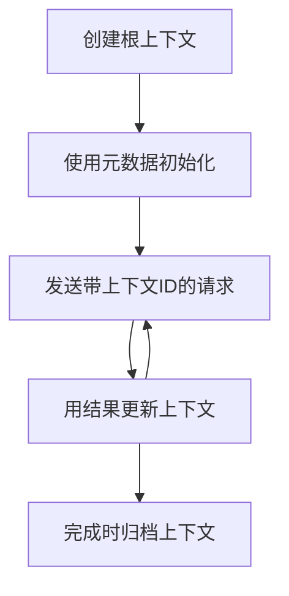

> [已弃用：2026-07-28 发布候选版本](https://blog.modelcontextprotocol.io/posts/2026-07-28-release-candidate/#roots-sampling-and-logging-are-deprecated)

# MCP 根上下文

> **弃用通知：** `2026-07-28` MCP 规范发布候选版本将根标记为弃用，建议使用工具参数、资源 URI 或服务器配置来替代。根在 `2025-11-25` 版本以及任何正式弃用后一年的时间内仍然可用，因此本课中内容依旧有效——但新的服务器设计应评估替代方案。详情见 [MCP 的变化：2026-07-28 发布候选版本](../../01-CoreConcepts/mcp-2026-07-28-release-candidate.md)。

根上下文是模型上下文协议中的一个基本概念，提供了一个持久的层，用于维护跨多次请求和会话的对话历史和共享状态。

## 介绍

在本课中，我们将探索如何在 MCP 中创建、管理和使用根上下文。

## 学习目标

通过本课，你将能够：

- 理解根上下文的目的和结构
- 使用 MCP 客户端库创建和管理根上下文
- 在 .NET、Java、JavaScript 和 Python 应用程序中实现根上下文
- 利用根上下文进行多轮对话和状态管理
- 实践根上下文管理的最佳做法

## 了解根上下文

根上下文作为容器，保存一系列相关交互的历史和状态。它们支持：

- <strong>对话持久化</strong>：维持连贯的多轮对话
- <strong>记忆管理</strong>：跨交互存储和检索信息
- <strong>状态管理</strong>：跟踪复杂工作流的进展
- <strong>上下文共享</strong>：允许多个客户端访问相同的对话状态

在 MCP 中，根上下文具有以下关键特征：

- 每个根上下文都有唯一标识符。
- 可以包含对话历史、用户偏好和其他元数据。
- 可以根据需要创建、访问和归档。
- 支持细粒度访问控制和权限管理。

## 根上下文生命周期



## 使用根上下文

下面是一个创建和管理根上下文的示例。

### C# 实现

```csharp
// .NET Example: Root Context Management
using Microsoft.Mcp.Client;
using System;
using System.Threading.Tasks;
using System.Collections.Generic;

public class RootContextExample
{
    private readonly IMcpClient _client;
    private readonly IRootContextManager _contextManager;
    
    public RootContextExample(IMcpClient client, IRootContextManager contextManager)
    {
        _client = client;
        _contextManager = contextManager;
    }
    
    public async Task DemonstrateRootContextAsync()
    {
        // 1. Create a new root context
        var contextResult = await _contextManager.CreateRootContextAsync(new RootContextCreateOptions
        {
            Name = "Customer Support Session",
            Metadata = new Dictionary<string, string>
            {
                ["CustomerName"] = "Acme Corporation",
                ["PriorityLevel"] = "High",
                ["Domain"] = "Cloud Services"
            }
        });
        
        string contextId = contextResult.ContextId;
        Console.WriteLine($"Created root context with ID: {contextId}");
        
        // 2. First interaction using the context
        var response1 = await _client.SendPromptAsync(
            "I'm having issues scaling my web service deployment in the cloud.", 
            new SendPromptOptions { RootContextId = contextId }
        );
        
        Console.WriteLine($"First response: {response1.GeneratedText}");
        
        // Second interaction - the model will have access to the previous conversation
        var response2 = await _client.SendPromptAsync(
            "Yes, we're using containerized deployments with Kubernetes.", 
            new SendPromptOptions { RootContextId = contextId }
        );
        
        Console.WriteLine($"Second response: {response2.GeneratedText}");
        
        // 3. Add metadata to the context based on conversation
        await _contextManager.UpdateContextMetadataAsync(contextId, new Dictionary<string, string>
        {
            ["TechnicalEnvironment"] = "Kubernetes",
            ["IssueType"] = "Scaling"
        });
        
        // 4. Get context information
        var contextInfo = await _contextManager.GetRootContextInfoAsync(contextId);
        
        Console.WriteLine("Context Information:");
        Console.WriteLine($"- Name: {contextInfo.Name}");
        Console.WriteLine($"- Created: {contextInfo.CreatedAt}");
        Console.WriteLine($"- Messages: {contextInfo.MessageCount}");
        
        // 5. When the conversation is complete, archive the context
        await _contextManager.ArchiveRootContextAsync(contextId);
        Console.WriteLine($"Archived context {contextId}");
    }
}
```

在上面的代码中我们：

1. 创建了一个用于客户支持会话的根上下文。
1. 在该上下文中发送了多条消息，使模型能够维护状态。
1. 根据对话更新了相关元数据。
1. 检索上下文信息以了解对话历史。
1. 对话完成后归档了该上下文。

## 示例：用于财务分析的根上下文实现

本示例中，我们将创建一个用于财务分析会话的根上下文，演示如何跨多次交互维护状态。

### Java 实现

```java
// Java 示例：根上下文实现
package com.example.mcp.contexts;

import com.mcp.client.McpClient;
import com.mcp.client.ContextManager;
import com.mcp.models.RootContext;
import com.mcp.models.McpResponse;

import java.util.HashMap;
import java.util.Map;
import java.util.UUID;

public class RootContextsDemo {
    private final McpClient client;
    private final ContextManager contextManager;
    
    public RootContextsDemo(String serverUrl) {
        this.client = new McpClient.Builder()
            .setServerUrl(serverUrl)
            .build();
            
        this.contextManager = new ContextManager(client);
    }
    
    public void demonstrateRootContext() throws Exception {
        // 创建上下文元数据
        Map<String, String> metadata = new HashMap<>();
        metadata.put("projectName", "Financial Analysis");
        metadata.put("userRole", "Financial Analyst");
        metadata.put("dataSource", "Q1 2025 Financial Reports");
        
        // 1. 创建一个新的根上下文
        RootContext context = contextManager.createRootContext("Financial Analysis Session", metadata);
        String contextId = context.getId();
        
        System.out.println("Created context: " + contextId);
        
        // 2. 第一次交互
        McpResponse response1 = client.sendPrompt(
            "Analyze the trends in Q1 financial data for our technology division",
            contextId
        );
        
        System.out.println("First response: " + response1.getGeneratedText());
        
        // 3. 使用从响应中获得的重要信息更新上下文
        contextManager.addContextMetadata(contextId, 
            Map.of("identifiedTrend", "Increasing cloud infrastructure costs"));
        
        // 第二次交互 - 使用相同的上下文
        McpResponse response2 = client.sendPrompt(
            "What's driving the increase in cloud infrastructure costs?",
            contextId
        );
        
        System.out.println("Second response: " + response2.getGeneratedText());
        
        // 4. 生成分析会话摘要
        McpResponse summaryResponse = client.sendPrompt(
            "Summarize our analysis of the technology division financials in 3-5 key points",
            contextId
        );
        
        // 将摘要存储在上下文元数据中
        contextManager.addContextMetadata(contextId, 
            Map.of("analysisSummary", summaryResponse.getGeneratedText()));
            
        // 获取更新后的上下文信息
        RootContext updatedContext = contextManager.getRootContext(contextId);
        
        System.out.println("Context Information:");
        System.out.println("- Created: " + updatedContext.getCreatedAt());
        System.out.println("- Last Updated: " + updatedContext.getLastUpdatedAt());
        System.out.println("- Analysis Summary: " + 
            updatedContext.getMetadata().get("analysisSummary"));
            
        // 5. 完成后归档上下文
        contextManager.archiveContext(contextId);
        System.out.println("Context archived");
    }
}
```

在上面的代码中我们：

1. 创建了一个用于财务分析会话的根上下文。
2. 在该上下文中发送了多条消息，使模型能够维护状态。
3. 根据对话更新了相关元数据。
4. 生成了分析会话摘要并存储在上下文元数据中。
5. 会话完成后归档了该上下文。

## 示例：根上下文管理

有效管理根上下文对于维护对话历史和状态至关重要。以下是根上下文管理的实现示例。

### JavaScript 实现

```javascript
// JavaScript 示例：管理 MCP 根上下文
const { McpClient, RootContextManager } = require('@mcp/client');

class ContextSession {
  constructor(serverUrl, apiKey = null) {
    // 初始化 MCP 客户端
    this.client = new McpClient({
      serverUrl,
      apiKey
    });
    
    // 初始化上下文管理器
    this.contextManager = new RootContextManager(this.client);
  }
  
  /**
   * Create a new conversation context
   * @param {string} sessionName - Name of the conversation session
   * @param {Object} metadata - Additional metadata for the context
   * @returns {Promise<string>} - Context ID
   */
  async createConversationContext(sessionName, metadata = {}) {
    try {
      const contextResult = await this.contextManager.createRootContext({
        name: sessionName,
        metadata: {
          ...metadata,
          createdAt: new Date().toISOString(),
          status: 'active'
        }
      });
      
      console.log(`Created root context '${sessionName}' with ID: ${contextResult.id}`);
      return contextResult.id;
    } catch (error) {
      console.error('Error creating root context:', error);
      throw error;
    }
  }
  
  /**
   * Send a message in an existing context
   * @param {string} contextId - The root context ID
   * @param {string} message - The user's message
   * @param {Object} options - Additional options
   * @returns {Promise<Object>} - Response data
   */
  async sendMessage(contextId, message, options = {}) {
    try {
      // 使用指定的上下文发送消息
      const response = await this.client.sendPrompt(message, {
        rootContextId: contextId,
        temperature: options.temperature || 0.7,
        allowedTools: options.allowedTools || []
      });
      
      // 可选地存储对话中的重要见解
      if (options.storeInsights) {
        await this.storeConversationInsights(contextId, message, response.generatedText);
      }
      
      return {
        message: response.generatedText,
        toolCalls: response.toolCalls || [],
        contextId
      };
    } catch (error) {
      console.error(`Error sending message in context ${contextId}:`, error);
      throw error;
    }
  }
  
  /**
   * Store important insights from a conversation
   * @param {string} contextId - The root context ID
   * @param {string} userMessage - User's message
   * @param {string} aiResponse - AI's response
   */
  async storeConversationInsights(contextId, userMessage, aiResponse) {
    try {
      // 提取潜在见解（在真实应用中，这会更复杂）
      const combinedText = userMessage + "\n" + aiResponse;
      
      // 识别潜在见解的简单启发式方法
      const insightWords = ["important", "key point", "remember", "significant", "crucial"];
      
      const potentialInsights = combinedText
        .split(".")
        .filter(sentence => 
          insightWords.some(word => sentence.toLowerCase().includes(word))
        )
        .map(sentence => sentence.trim())
        .filter(sentence => sentence.length > 10);
      
      // 将见解存储在上下文元数据中
      if (potentialInsights.length > 0) {
        const insights = {};
        potentialInsights.forEach((insight, index) => {
          insights[`insight_${Date.now()}_${index}`] = insight;
        });
        
        await this.contextManager.updateContextMetadata(contextId, insights);
        console.log(`Stored ${potentialInsights.length} insights in context ${contextId}`);
      }
    } catch (error) {
      console.warn('Error storing conversation insights:', error);
      // 非关键错误，只需记录警告
    }
  }
  
  /**
   * Get summary information about a context
   * @param {string} contextId - The root context ID
   * @returns {Promise<Object>} - Context information
   */
  async getContextInfo(contextId) {
    try {
      const contextInfo = await this.contextManager.getContextInfo(contextId);
      
      return {
        id: contextInfo.id,
        name: contextInfo.name,
        created: new Date(contextInfo.createdAt).toLocaleString(),
        lastUpdated: new Date(contextInfo.lastUpdatedAt).toLocaleString(),
        messageCount: contextInfo.messageCount,
        metadata: contextInfo.metadata,
        status: contextInfo.status
      };
    } catch (error) {
      console.error(`Error getting context info for ${contextId}:`, error);
      throw error;
    }
  }
  
  /**
   * Generate a summary of the conversation in a context
   * @param {string} contextId - The root context ID
   * @returns {Promise<string>} - Generated summary
   */
  async generateContextSummary(contextId) {
    try {
      // 让模型生成迄今为止对话的摘要
      const response = await this.client.sendPrompt(
        "Please summarize our conversation so far in 3-4 sentences, highlighting the main points discussed.",
        { rootContextId: contextId, temperature: 0.3 }
      );
      
      // 将摘要存储在上下文元数据中
      await this.contextManager.updateContextMetadata(contextId, {
        conversationSummary: response.generatedText,
        summarizedAt: new Date().toISOString()
      });
      
      return response.generatedText;
    } catch (error) {
      console.error(`Error generating context summary for ${contextId}:`, error);
      throw error;
    }
  }
  
  /**
   * Archive a context when it's no longer needed
   * @param {string} contextId - The root context ID
   * @returns {Promise<Object>} - Result of the archive operation
   */
  async archiveContext(contextId) {
    try {
      // 归档前生成最终摘要
      const summary = await this.generateContextSummary(contextId);
      
      // 归档上下文
      await this.contextManager.archiveContext(contextId);
      
      return {
        status: "archived",
        contextId,
        summary
      };
    } catch (error) {
      console.error(`Error archiving context ${contextId}:`, error);
      throw error;
    }
  }
}

// 示例用法
async function demonstrateContextSession() {
  const session = new ContextSession('https://mcp-server-example.com');
  
  try {
    // 1. 为产品支持对话创建新上下文
    const contextId = await session.createConversationContext(
      'Product Support - Database Performance',
      {
        customer: 'Globex Corporation',
        product: 'Enterprise Database',
        severity: 'Medium',
        supportAgent: 'AI Assistant'
      }
    );
    
    // 2. 对话中的第一条消息
    const response1 = await session.sendMessage(
      contextId,
      "I'm experiencing slow query performance on our database cluster after the latest update.",
      { storeInsights: true }
    );
    console.log('Response 1:', response1.message);
    
    // 同一上下文中的后续消息
    const response2 = await session.sendMessage(
      contextId,
      "Yes, we've already checked the indexes and they seem to be properly configured.",
      { storeInsights: true }
    );
    console.log('Response 2:', response2.message);
    
    // 3. 获取上下文信息
    const contextInfo = await session.getContextInfo(contextId);
    console.log('Context Information:', contextInfo);
    
    // 4. 生成并显示对话摘要
    const summary = await session.generateContextSummary(contextId);
    console.log('Conversation Summary:', summary);
    
    // 5. 完成后归档上下文
    const archiveResult = await session.archiveContext(contextId);
    console.log('Archive Result:', archiveResult);
    
    // 6. 优雅地处理任何错误
  } catch (error) {
    console.error('Error in context session demonstration:', error);
  }
}

demonstrateContextSession();
```

在上面的代码中我们：

1. 使用函数 `createConversationContext` 创建了一个产品支持对话的根上下文。在此案例中，上下文涉及数据库性能问题。

1. 使用函数 `sendMessage` 在该上下文中发送了关于慢查询性能和索引配置的多条消息，使模型能够维护状态。

1. 根据对话内容更新了相关元数据。

1. 使用函数 `generateContextSummary` 生成对话摘要并存储在上下文元数据中。

1. 会话完成后使用函数 `archiveContext` 归档了上下文。

1. 进行了错误处理以确保系统健壮性。

## 多轮协助的根上下文

本示例中，我们将创建一个多轮协助会话的根上下文，演示如何跨多次交互维护状态。

### Python 实现

```python
# Python 示例：多轮辅助的根上下文
import asyncio
from datetime import datetime
from mcp_client import McpClient, RootContextManager

class AssistantSession:
    def __init__(self, server_url, api_key=None):
        self.client = McpClient(server_url=server_url, api_key=api_key)
        self.context_manager = RootContextManager(self.client)
    
    async def create_session(self, name, user_info=None):
        """Create a new root context for an assistant session"""
        metadata = {
            "session_type": "assistant",
            "created_at": datetime.now().isoformat(),
        }
        
        # 如果提供，添加用户信息
        if user_info:
            metadata.update({f"user_{k}": v for k, v in user_info.items()})
            
        # 创建根上下文
        context = await self.context_manager.create_root_context(name, metadata)
        return context.id
    
    async def send_message(self, context_id, message, tools=None):
        """Send a message within a root context"""
        # 使用上下文 ID 创建选项
        options = {
            "root_context_id": context_id
        }
        
        # 如果指定，添加工具
        if tools:
            options["allowed_tools"] = tools
        
        # 在上下文中发送提示
        response = await self.client.send_prompt(message, options)
        
        # 用对话进度更新上下文元数据
        await self.context_manager.update_context_metadata(
            context_id,
            {
                f"message_{datetime.now().timestamp()}": message[:50] + "...",
                "last_interaction": datetime.now().isoformat()
            }
        )
        
        return response
    
    async def get_conversation_history(self, context_id):
        """Retrieve conversation history from a context"""
        context_info = await self.context_manager.get_context_info(context_id)
        messages = await self.client.get_context_messages(context_id)
        
        return {
            "context_info": context_info,
            "messages": messages
        }
    
    async def end_session(self, context_id):
        """End an assistant session by archiving the context"""
        # 首先生成总结提示
        summary_response = await self.client.send_prompt(
            "Please summarize our conversation and any key points or decisions made.",
            {"root_context_id": context_id}
        )
        
        # 将总结存储在元数据中
        await self.context_manager.update_context_metadata(
            context_id,
            {
                "summary": summary_response.generated_text,
                "ended_at": datetime.now().isoformat(),
                "status": "completed"
            }
        )
        
        # 归档上下文
        await self.context_manager.archive_context(context_id)
        
        return {
            "status": "completed",
            "summary": summary_response.generated_text
        }

# 示例用法
async def demo_assistant_session():
    assistant = AssistantSession("https://mcp-server-example.com")
    
    # 1. 创建会话
    context_id = await assistant.create_session(
        "Technical Support Session",
        {"name": "Alex", "technical_level": "advanced", "product": "Cloud Services"}
    )
    print(f"Created session with context ID: {context_id}")
    
    # 2. 第一次交互
    response1 = await assistant.send_message(
        context_id, 
        "I'm having trouble with the auto-scaling feature in your cloud platform.",
        ["documentation_search", "diagnostic_tool"]
    )
    print(f"Response 1: {response1.generated_text}")
    
    # 在同一上下文中的第二次交互
    response2 = await assistant.send_message(
        context_id,
        "Yes, I've already checked the configuration settings you mentioned, but it's still not working."
    )
    print(f"Response 2: {response2.generated_text}")
    
    # 3. 获取历史记录
    history = await assistant.get_conversation_history(context_id)
    print(f"Session has {len(history['messages'])} messages")
    
    # 4. 结束会话
    end_result = await assistant.end_session(context_id)
    print(f"Session ended with summary: {end_result['summary']}")

if __name__ == "__main__":
    asyncio.run(demo_assistant_session())
```

在上面的代码中我们：

1. 使用函数 `create_session` 创建了一个技术支持会话的根上下文。上下文包含用户信息如姓名和技术水平。

1. 使用函数 `send_message` 在该上下文中发送了多条关于自动扩缩容功能问题的消息，使模型能够维护状态。

1. 使用函数 `get_conversation_history` 检索对话历史，提供上下文信息和消息。

1. 使用函数 `end_session` 结束会话，通过归档上下文并生成摘要，摘要捕捉了对话的关键点。

## 根上下文最佳实践

以下是一些有效管理根上下文的最佳实践：

- <strong>创建专注的上下文</strong>：为不同的对话目的或领域创建独立的根上下文，以保持清晰。

- <strong>设置过期策略</strong>：实施策略归档或删除旧上下文，以管理存储并遵守数据保留政策。

- <strong>存储相关元数据</strong>：利用上下文元数据保存可能后续有用的重要对话信息。

- **一致使用上下文 ID**：上下文创建后，对所有相关请求保持一致使用其 ID 以维护连续性。

- <strong>生成摘要</strong>：当上下文规模变大时，考虑生成摘要以捕获关键信息，同时管理上下文大小。

- <strong>实施访问控制</strong>：对于多用户系统，实施适当的访问控制确保对话上下文的隐私和安全。

- <strong>处理上下文限制</strong>：意识到上下文大小限制，并实施策略处理极长的对话。

- <strong>完成时归档</strong>：当对话完成时归档上下文，释放资源同时保留对话历史。

## 接下来

- [5.5 路由](../mcp-routing/README.md)

---

<!-- CO-OP TRANSLATOR DISCLAIMER START -->
**免责声明**：
本文件由 AI 翻译服务 [Co-op Translator](https://github.com/Azure/co-op-translator) 翻译完成。尽管我们力求准确，但请注意，自动翻译可能包含错误或不准确之处。原始语言版文件应视为权威来源。对于重要信息，建议使用专业人工翻译。我们对因使用本翻译而产生的任何误解或误释不承担责任。
<!-- CO-OP TRANSLATOR DISCLAIMER END -->