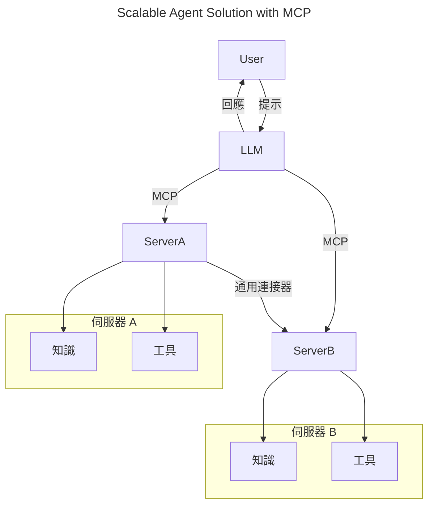
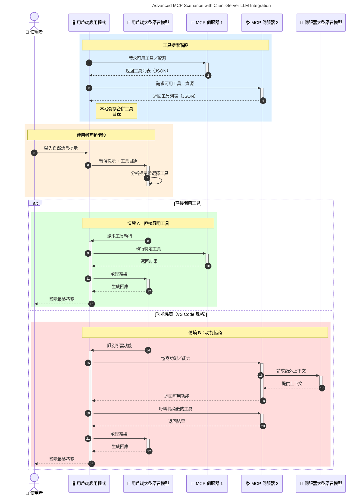

# 模型上下文協議（MCP）簡介：為何對可擴展的 AI 應用程式至關重要

[](https://youtu.be/agBbdiOPLQA)

_(點擊上方圖片以觀看本課程影片)_

生成式 AI 應用程式是一大進步，因為它們通常允許用戶使用自然語言提示與應用程式互動。然而，隨著投入更多時間和資源於這類應用程式，您會希望能輕鬆整合功能與資源，使其易於擴充，讓應用程式可支援多個模型並處理各種模型的複雜性。簡言之，構建生成式 AI 應用程式起步容易，但隨著其成長並變得更複雜，您需要開始定義架構，並可能需要依賴標準以確保應用程式建構一致。這正是 MCP 的角色，它用以組織事務並提供標準。

---

## **🔍 甚麼是模型上下文協議（MCP）？**

**模型上下文協議（MCP）** 是一個 <strong>開放且標準化的介面</strong>，讓大型語言模型（LLM）能夠無縫地與外部工具、API 和數據來源互動。它提供一致的架構以強化 AI 模型的功能，超越其訓練數據，實現更智慧、可擴展且具回應能力的 AI 系統。

---

## **🎯 為何 AI 標準化至關重要**

隨著生成式 AI 應用程式變得更複雜，採用標準以確保 **可擴展性、可擴充性、可維護性** 以及 <strong>避免供應商鎖定</strong> 是非常重要的。MCP 解決了這些需求，透過：

- 統一模型與工具的整合
- 降低脆弱且一次性打造的自定義方案
- 允許來自不同供應商的多個模型同時存在於一個生態系統中

**注意：** 雖然 MCP 自稱為開放標準，但目前沒有計劃透過 IEEE、IETF、W3C、ISO 或任何既有標準機構正式標準化 MCP。

---

## **📚 學習目標**

讀完本文後，您將能夠：

- 定義 **模型上下文協議（MCP）** 及其應用場景
- 理解 MCP 如何標準化模型到工具的通訊
- 辨識 MCP 架構的核心組件
- 探索 MCP 在企業及開發環境中的實際應用

---

## **💡 為何模型上下文協議（MCP）是改變遊戲規則的技術**

### **🔗 MCP 解決 AI 互動的碎片化問題**

在 MCP 出現之前，模型與工具的整合需要：

- 每對工具與模型都須定制程式碼
- 每個供應商使用非標準 API
- 經常因更新而出錯中斷
- 隨著工具數增加，擴展性差

### **✅ MCP 標準化的好處**

| <strong>好處</strong>                  | <strong>說明</strong>                                                                    |
|--------------------------|------------------------------------------------------------------------------|
| 互通性                    | LLM 可與不同供應商的工具無縫合作                                            |
| 一致性                    | 跨平台及工具有統一行為                                                        |
| 可重用性                  | 工具打造一次後，能跨專案及系統使用                                          |
| 加速開發                  | 使用標準化即插即用介面縮短開發時間                                            |

---

## **🧱 MCP 架構高階概覽**

MCP 採用 **客戶端-伺服器模型**，其中：

- **MCP 主機** 運行 AI 模型
- **MCP 客戶端** 發起請求
- **MCP 伺服器** 提供上下文、工具和功能

### **主要組件：**

- <strong>資源</strong> — 模型使用的靜態或動態數據  
- <strong>提示</strong> — 預定義引導生成的工作流程  
- <strong>工具</strong> — 可執行功能，例如搜尋、計算  
- <strong>採樣</strong> — 透過遞歸互動進行的代理行為（於 `2026-07-28` 候選版中棄用）
- <strong>引發</strong> — 伺服器主動請求用戶輸入
- <strong>根目錄</strong> — 伺服器存取控制的文件系統邊界（於 `2026-07-28` 候選版中棄用）

### **協議架構：**

MCP 採用雙層架構：
- <strong>資料層</strong>：基於 JSON-RPC 2.0 的通訊，擁有生命週期管理及原語
- <strong>傳輸層</strong>：STDIO（本地）與可串流 HTTP 包含 SSE（遠端）通訊通道

---

## MCP 伺服器如何運作

MCP 伺服器的運作方式如下：

- <strong>請求流程</strong>：
    1. 請求由終端用戶或代表其行事的軟體發起。
    2. **MCP 客戶端** 將請求發送給管理 AI 模型執行的 **MCP 主機**。
    3. **AI 模型** 接收用戶提示，可能透過一個或多個工具呼叫請求訪問外部工具或數據。
    4. **MCP 主機**（而非模型本身）使用標準協議與適當的 **MCP 伺服器** 通訊。
- **MCP 主機功能**：
    - <strong>工具註冊表</strong>：維護可用工具及其功能目錄。
    - <strong>認證</strong>：驗證工具訪問權限。
    - <strong>請求處理器</strong>：處理模型來的工具請求。
    - <strong>回應格式化器</strong>：將工具輸出結構化為模型可理解的格式。
- **MCP 伺服器執行**：
    - **MCP 主機** 將工具呼叫路由到一個或多個暴露專門功能（例如搜尋、計算、資料庫查詢）的 **MCP 伺服器**。
    - **MCP 伺服器** 執行其操作並以一致格式將結果返回給 **MCP 主機**。
    - **MCP 主機** 格式化並傳送結果給 **AI 模型**。
- <strong>回應完成</strong>：
    - **AI 模型** 將工具輸出融入最終回應。
    - **MCP 主機** 將此回應返回給 **MCP 客戶端**，由其轉交給終端用戶或呼叫軟體。
    

```mermaid
---
title: MCP Architecture and Component Interactions
description: A diagram showing the flows of the components in MCP.
---
graph TD
    Client[MCP 客戶端/應用程式] -->|發送請求| H[MCP 主機]
    H -->|調用| A[AI 模型]
    A -->|工具呼叫請求| H
    H -->|MCP Protocol| T1[MCP Server Tool 01: 網頁搜尋]
    H -->|MCP Protocol| T2[MCP Server Tool 02: 計算機工具]
    H -->|MCP Protocol| T3[MCP Server Tool 03: 資料庫存取工具]
    H -->|MCP Protocol| T4[MCP Server Tool 04: 檔案系統工具]
    H -->|發送回應| Client

    subgraph 「MCP 主機元件」
        H
        G[工具登記處]
        I[身份驗證]
        J[請求處理器]
        K[回應格式化器]
    end

    H <--> G
    H <--> I
    H <--> J
    H <--> K

    style A fill:#f9d5e5,stroke:#333,stroke-width:2px
    style H fill:#eeeeee,stroke:#333,stroke-width:2px
    style Client fill:#d5e8f9,stroke:#333,stroke-width:2px
    style G fill:#fffbe6,stroke:#333,stroke-width:1px
    style I fill:#fffbe6,stroke:#333,stroke-width:1px
    style J fill:#fffbe6,stroke:#333,stroke-width:1px
    style K fill:#fffbe6,stroke:#333,stroke-width:1px
    style T1 fill:#c2f0c2,stroke:#333,stroke-width:1px
    style T2 fill:#c2f0c2,stroke:#333,stroke-width:1px
    style T3 fill:#c2f0c2,stroke:#333,stroke-width:1px
    style T4 fill:#c2f0c2,stroke:#333,stroke-width:1px
```

## 👨‍💻 如何構建 MCP 伺服器（含範例）

MCP 伺服器允許您通過提供數據與功能來擴充 LLM 的能力。

準備好試試看了嗎？以下是語言和/或技術棧的 SDK 與在不同語言/棧中建立簡單 MCP 伺服器的範例：

- **Python SDK**: https://github.com/modelcontextprotocol/python-sdk

- **TypeScript SDK**: https://github.com/modelcontextprotocol/typescript-sdk

- **Java SDK**: https://github.com/modelcontextprotocol/java-sdk

- **C#/.NET SDK**: https://github.com/modelcontextprotocol/csharp-sdk


## 🌍 MCP 的實際應用案例

MCP 擴展 AI 功能，支持多種應用領域：

| <strong>應用</strong>                    | <strong>說明</strong>                                                                    |
|----------------------------|------------------------------------------------------------------------------|
| 企業資料整合               | 連接 LLM 到資料庫、CRM 或內部工具                                           |
| 代理式 AI 系統              | 使自主代理擁有工具訪問及決策工作流程                                       |
| 多模態應用                  | 將文字、影像及音頻工具結合於統一 AI 應用中                                 |
| 即時數據整合               | 將實時數據帶入 AI 互動，提供更精確且最新的輸出                              |


### 🧠 MCP = AI 互動的普遍標準

模型上下文協議（MCP）如同 USB-C 規範統一了設備的物理連接一樣，作為 AI 互動的普遍標準。在 AI 領域，MCP 提供了一致介面，讓模型（客戶端）可無縫整合外部工具與資料來源（伺服器）。這省去了為每個 API 或資料來源設計多種自訂協議的需求。

基於 MCP，兼容 MCP 的工具（即 MCP 伺服器）遵循統一標準。這些伺服器可列出所提供的工具或動作，並在 AI 代理請求時執行。支援 MCP 的 AI 代理平台能夠動態發現伺服器上的可用工具，並透過該標準協定調用它們。

### 💡 促進知識存取

除了提供工具外，MCP 也促進知識存取。它使應用程式透過連結多種資料來源，為大型語言模型（LLM）提供上下文。例如，某 MCP 伺服器可能代表公司文件庫，允許代理按需檢索相關資訊；另一個伺服器則可執行特定動作，例如發送電子郵件或更新紀錄。從代理的視角而言，這些都是可用工具，有些工具傳回資料（知識上下文），有些則執行操作。MCP 有效管理這兩者。

代理連接 MCP 伺服器會自動透過標準格式了解伺服器可用功能與可訪問數據。此標準化使工具可動態提供，例如新增 MCP 伺服器到代理系統即可立即使用其功能，無需調整代理指令。

這種精簡整合符合下圖所示流程，伺服器提供工具與知識，保證系統間的無縫協作。

### 👉 範例：可擴展代理解決方案


通用連接器使 MCP 伺服器間能互相通訊及共享功能，允許 ServerA 委派任務給 ServerB 或訪問其工具與知識。此舉實現伺服器間工具與數據的聯邦，支持可擴展且模組化代理架構。由於 MCP 標準化了工具展示，代理可動態發現及在伺服器間路由請求，無需硬編碼整合。


工具與知識聯盟：工具及數據可跨伺服器訪問，促進代理架構的可擴展性與模組化。

### 🔄 具備客戶端 LLM 整合的進階 MCP 情境

除了基本 MCP 架構，還有進階情境包含客戶端與伺服器皆含 LLM，可實現更複雜互動。下圖中，<strong>客戶端應用程式</strong> 可能是內建多個 MCP 工具供 LLM 使用的 IDE：



## 🔐 MCP 的實際優勢

使用 MCP 的實際優勢包括：

- <strong>最新資訊</strong>：模型能訪問超越其訓練資料的即時資訊
- <strong>功能擴充</strong>：模型可利用其未訓練的專門工具完成任務
- <strong>減少幻覺</strong>：外部資料來源提供事實依據
- <strong>隱私保護</strong>：敏感資料可留於安全環境，無需嵌入提示中

## 📌 主要重點摘要

使用 MCP 的主要重點如下：

- **MCP** 標準化 AI 模型與工具及資料的交互方式
- 促進 **可擴充性、一致性及互通性**
- MCP 有助於 **縮短開發時間、提高可靠性及擴展模型能力**
- 客戶端-伺服器架構 **支持靈活且可擴充的 AI 應用**

## 🧠 練習

請思考您有興趣建構的 AI 應用程式。

- 哪些 <strong>外部工具或資料</strong> 可以提升其能力？
- MCP 如何使整合變得 <strong>更簡單且更可靠</strong>？

## 補充資源

- [MCP GitHub 倉庫](https://github.com/modelcontextprotocol)


## 接下來

下一步：[第 1 章：核心概念](../01-CoreConcepts/README.md)

---

<!-- CO-OP TRANSLATOR DISCLAIMER START -->
**免責聲明**：
本文件由 AI 翻譯服務 [Co-op Translator](https://github.com/Azure/co-op-translator) 翻譯而成。雖然我們致力於確保準確性，但請注意，機器自動翻譯可能包含錯誤或不準確之處。原始文件的母語版本應被視為權威來源。對於重要資訊，建議進行專業人工翻譯。我們不對因使用本翻譯而產生的任何誤解或誤釋承擔責任。
<!-- CO-OP TRANSLATOR DISCLAIMER END -->