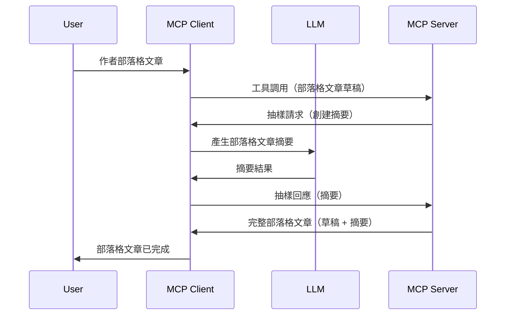

> [已淘汰：2026-07-28 發行候選版本](https://blog.modelcontextprotocol.io/posts/2026-07-28-release-candidate/)

# 採樣 - 將功能委派給用戶端

> **淘汰通知：** `2026-07-28` MCP 規範發行候選版本標記採樣為淘汰，取而代之的是直接整合 LLM 提供者 API。採樣在 `2025-11-25` 版本及至少在正式淘汰後一年內仍可正常運作，因此本課程中的所有內容仍然有效 —— 但新的伺服器設計應評估替代方案。詳見 [MCP 的變更重點：2026-07-28 發行候選版本](../../01-CoreConcepts/mcp-2026-07-28-release-candidate.md)。

有時您需要 MCP 用戶端和 MCP 伺服器協作以達成共同目標。可能出現伺服器需要位於用戶端的 LLM 來協助的情況。這種情境下，應該使用採樣。

讓我們來探索一些使用案例以及如何建立包含採樣的解決方案。

## 概覽

本課程重點說明何時何地使用採樣及如何配置它。

## 學習目標

本章節，我們將會：

- 解釋什麼是採樣以及何時使用。
- 展示如何在 MCP 中配置採樣。
- 提供採樣實際操作的範例。

## 什麼是採樣及為何使用？

採樣是一項進階功能，其運作方式如下：



### 採樣請求

好的，現在我們對一個合理情景有了概覽，接著談談伺服器發送回用戶端的採樣請求。這樣的請求在 JSON-RPC 格式中可能長這樣：

```json
{
  "jsonrpc": "2.0",
  "id": 1,
  "method": "sampling/createMessage",
  "params": {
    "messages": [
      {
        "role": "user",
        "content": {
          "type": "text",
          "text": "Create a blog post summary of the following blog post: <BLOG POST>"
        }
      }
    ],
    "modelPreferences": {
      "hints": [
        {
          "name": "claude-3-sonnet"
        }
      ],
      "intelligencePriority": 0.8,
      "speedPriority": 0.5
    },
    "systemPrompt": "You are a helpful assistant.",
    "maxTokens": 100
  }
}
```

這裡有幾點值得說明：

- 在 content -> text 底下的 Prompt，是我們用來指示 LLM 摘要部落格文章內容的提示。

- **modelPreferences**。這一部分僅是偏好設定，對應 LLM 要使用什麼配置的建議。使用者可選擇接受這些建議或自行更改。本例中有關於使用模型、速度與智能優先順序的建議。
- **systemPrompt**，這是您的正常系統提示，為您的 LLM 設定個性並包含指導指令。
- **maxTokens**，這是用來說明建議此任務使用多少 tokens 的屬性。

### 採樣回應

此回應是 MCP 用戶端最終送回 MCP 伺服器的結果，是用戶端呼叫 LLM、等待回應後所構造的訊息。它在 JSON-RPC 中可長得像這樣：

```json
{
  "jsonrpc": "2.0",
  "id": 1,
  "result": {
    "role": "assistant",
    "content": {
      "type": "text",
      "text": "Here's your abstract <ABSTRACT>"
    },
    "model": "gpt-5",
    "stopReason": "endTurn"
  }
}
```

注意回應是我們要求的部落格文章摘要。同時注意使用的 `model` 並非我們要求的，而是選擇了 "gpt-5" 替代 "claude-3-sonnet"。這用來說明用戶可改變他們的使用選擇，且您的採樣請求是建議而非硬性要求。

好的，現在我們了解主要流程及其適用於「部落格文章創作 + 摘要」的有用任務，接著看看我們如何使其運作。

### 訊息類型

採樣訊息不限於純文字，您還可以傳送圖像和音訊。以下展示 JSON-RPC 的不同樣貌：

<strong>文字</strong>

```json
{
  "type": "text",
  "text": "The message content"
}
```

<strong>圖像內容</strong>

```json
{
  "type": "image",
  "data": "base64-encoded-image-data",
  "mimeType": "image/jpeg"
}
```

<strong>音訊內容</strong>

```json
{
  "type": "audio",
  "data": "base64-encoded-audio-data",
  "mimeType": "audio/wav"
}
```

> 注意：有關採樣的詳細資訊，請參考[官方文件](https://modelcontextprotocol.io/specification/2025-11-25/client/sampling)

## 如何在用戶端配置採樣

> 注意：如果您只在建立伺服器，這裡不需要做太多設定。

在用戶端，您需要依此方式指定以下功能：

```json
{
  "capabilities": {
    "sampling": {}
  }
}
```

這將在您選擇的用戶端與伺服器初始化時被採用。

## 採樣實作範例 - 創建部落格文章

讓我們一起寫一個採樣伺服器，我們需要做以下步驟：

1. 在伺服器上建立一個工具。
1. 該工具應建立一個採樣請求。
1. 工具應等待用戶端的採樣請求回覆。
1. 接著產生工具的結果。

讓我們一步步看程式碼：

### -1- 建立工具

**python**

```python
@mcp.tool()
async def create_blog(title: str, content: str, ctx: Context[ServerSession, None]) -> str:
    """Create a blog post and generate a summary"""

```

### -2- 建立採樣請求

在您的工具中加入以下程式碼：

**python**

```python
post = BlogPost(
        id=len(posts) + 1,
        title=title,
        content=content,
        abstract=""
    )

prompt = f"Create an abstract of the following blog post: title: {title} and draft: {content} "

result = await ctx.session.create_message(
        messages=[
            SamplingMessage(
                role="user",
                content=TextContent(type="text", text=prompt),
            )
        ],
        max_tokens=100,
)

```

### -3- 等待回應並回傳

**python**

```python
post.abstract = result.content.text

posts.append(post)

# 返回完整產品
return json.dumps({
    "id": post.title,
    "abstract": post.abstract
})
```

### -4- 完整程式碼

**python**

```python
from starlette.applications import Starlette
from starlette.routing import Mount, Host

from mcp.server.fastmcp import Context, FastMCP

from mcp.server.session import ServerSession
from mcp.types import SamplingMessage, TextContent

import json


from uuid import uuid4
from typing import List
from pydantic import BaseModel


mcp = FastMCP("Blog post generator")

# app = FastAPI()

posts = []

class BlogPost(BaseModel):
    id: int
    title: str
    content: str
    abstract: str

posts: List[BlogPost] = []

@mcp.tool()
async def create_blog(title: str, content: str, ctx: Context[ServerSession, None]) -> str:
    """Create a blog post and generate a summary"""

    post = BlogPost(
        id=len(posts) + 1,
        title=title,
        content=content,
        abstract=""
    )

    prompt = f"Create an abstract of the following blog post: title: {title} and draft: {content} "

    result = await ctx.session.create_message(
        messages=[
            SamplingMessage(
                role="user",
                content=TextContent(type="text", text=prompt),
            )
        ],
        max_tokens=100,
    )

    post.abstract = result.content.text

    posts.append(post)

    # 返回完整的博客文章
    return json.dumps({
        "id": post.title,
        "abstract": post.abstract
    })

if __name__ == "__main__":
    print("Starting server...")
    # mcp.run()
    mcp.run(transport="streamable-http")

# 使用以下指令運行應用程式：python server.py
```

### -5- 在 Visual Studio Code 中測試

要在 Visual Studio Code 中測試，請執行：

1. 在終端啟動伺服器
1. 把它加入 *mcp.json*（並確保已啟動），例如如下：

   ```json
   "servers": {
      "blog-server": {
        "type": "http",
        "url": "http://localhost:8000/mcp"
      }
   }
   ```

1. 輸入提示：

   ```text
   create a blog post named "Where Python comes from", the content is "Python is actually named after Monty Python Flying Circus"
   ```

1. 允許採樣進行。第一次測試時會出現額外的對話框，您必須接受，然後會看到詢問是否執行工具的正常對話框。

1. 檢查結果。您將看到 GitHub Copilot Chat 中美觀呈現的結果，亦可查看原始 JSON 回應。

<strong>額外提示</strong>。Visual Studio Code 工具對採樣有很好的支援。您可以透過以下方式配置已安裝伺服器的採樣權限：

1. 前往擴充功能部分。
1. 在「MCP SERVERS - INSTALLED」區段選擇您安裝伺服器的齒輪圖示。
1 選擇「Configure Model Access」，此處可選擇 GitHub Copilot 執行採樣時允許使用哪些模型。也可選擇「Show Sampling requests」檢視近期所有採樣請求紀錄。

## 作業

在本作業中，您將建立稍微不同的採樣功能，即支援產生產品描述的採樣整合。以下為您的情境：

<strong>情境</strong>：電商後台工作者需要幫助，因產生產品描述花費過多時間。因此，您需要建立一個名為 "create_product" 的工具，帶入 "title" 和 "keywords" 作為參數，該工具應該產生一個完整產品，其中「description」欄位由用戶端的 LLM 填寫。

提示：利用您之前學到的知識，以採樣請求構建該伺服器與工具。

## 解答

[解答](./solution/README.md)

## 重要重點

採樣是一項強大功能，讓伺服器在需要 LLM 幫助時，能將任務委派給用戶端。

## 下一步

- [第四章 - 實務實作](../../04-PracticalImplementation/README.md)

---

<!-- CO-OP TRANSLATOR DISCLAIMER START -->
**免責聲明**：
本文件由 AI 翻譯服務 [Co-op Translator](https://github.com/Azure/co-op-translator) 翻譯而成。雖然我們致力於確保準確性，但請注意，機器自動翻譯可能包含錯誤或不準確之處。原始文件的母語版本應被視為權威來源。對於重要資訊，建議進行專業人工翻譯。我們不對因使用本翻譯而產生的任何誤解或誤釋承擔責任。
<!-- CO-OP TRANSLATOR DISCLAIMER END -->